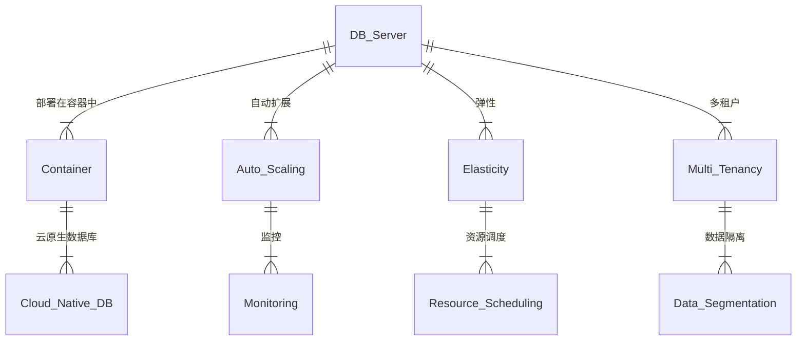

                 

### 1. 引言

在当今数字化转型的浪潮中，云原生数据库已经成为企业架构的重要组成部分。云原生数据库不仅提供了灵活、高效的数据存储和计算能力，还适应了云环境下的动态扩展和自动化管理。因此，如何进行云原生数据库的选型与实践成为每个IT专业人士面临的重要问题。

本文旨在为读者提供一个系统、深入的云原生数据库选型与实践指南。我们将从云原生数据库的概述开始，逐步探讨其核心概念、选型方法、实施案例、维护与优化，以及未来趋势。通过本文，读者将能够全面了解云原生数据库的优势和应用，掌握选型的关键步骤和实施的最佳实践。

### 2. 云原生数据库概述

#### 2.1. 云原生数据库的概念与重要性

云原生数据库是指在一组云服务上部署、管理和扩展的数据库系统，其设计初衷是为了充分利用云计算的灵活性和可扩展性。与传统数据库不同，云原生数据库具有以下几个关键特性：

- **容器化**：云原生数据库通常使用容器技术（如Docker）进行封装，便于部署和管理。
- **自动化**：云原生数据库提供自动扩展、备份、监控和故障恢复等功能，降低运维成本。
- **弹性**：云原生数据库能够根据实际负载动态调整资源，提供按需使用和计费模式。
- **多租户**：云原生数据库支持多租户架构，能够在同一物理服务器上为多个用户提供隔离和独立的数据库服务。

#### 2.2. 云原生数据库与传统数据库的区别

传统数据库通常在本地服务器或数据中心运行，其扩展性、可维护性和灵活性相对较低。相比之下，云原生数据库具有以下优势：

- **可扩展性**：云原生数据库能够通过自动化扩展机制，轻松适应大数据和高并发场景。
- **成本效益**：云原生数据库采用按需付费模式，用户只需为实际使用的资源付费，降低了整体运营成本。
- **易于管理**：云原生数据库提供了自动化运维工具，减少了手动管理的工作量。
- **高可用性**：云原生数据库通过分布式架构和自动备份，提高了系统的可用性和数据安全性。

#### 2.3. 云原生数据库的发展背景

云原生数据库的概念随着云计算和容器技术的兴起而逐渐成熟。以下是一些关键发展背景：

- **云计算的兴起**：云计算提供了弹性、可扩展和按需访问的计算资源，为云原生数据库的发展奠定了基础。
- **容器技术的推动**：容器技术（如Docker）简化了应用程序的部署和扩展，使得云原生数据库能够更好地适应容器化环境。
- **微服务架构**：微服务架构的兴起推动了分布式数据库的需求，云原生数据库成为实现微服务架构的重要组件。

#### 2.4. 云原生数据库的核心概念与联系

云原生数据库的核心概念包括容器化、自动化、弹性、多租户等。以下是一个核心概念解析的ER实体关系图：

通过这个ER图，我们可以看到云原生数据库的核心概念及其相互关系，这有助于我们更深入地理解其架构和功能。

### 3. 云原生数据库选型方法

在了解云原生数据库的核心概念和重要性之后，接下来我们将探讨如何进行云原生数据库的选型。选型过程中，我们需要考虑以下几个关键因素：

#### 3.1. 需求分析

选型前，首先需要明确应用场景和需求。需求分析包括以下几个方面：

- **数据规模**：确定数据量大小和增长速度，以评估数据库的性能要求。
- **访问模式**：了解数据读写比例和访问频率，以选择适合的数据库类型。
- **一致性需求**：根据应用场景，评估强一致性、最终一致性等需求。
- **扩展性要求**：分析未来业务增长趋势，评估数据库的可扩展性需求。

#### 3.2. 性能评估

性能评估是选型过程中至关重要的一环。以下是一些性能评估方法：

- **基准测试**：使用标准化的基准测试工具（如SysBench、YCSB）进行性能测试，比较不同数据库的性能指标。
- **压力测试**：模拟实际业务场景，对数据库进行高并发、大数据量的压力测试，以评估系统的稳定性和性能。
- **性能指标分析**：关注响应时间、吞吐量、并发连接数等性能指标，结合业务需求进行评估。

#### 3.3. 可扩展性评估

可扩展性是云原生数据库的重要特点之一。以下是一些可扩展性评估方法：

- **水平扩展**：评估数据库在添加节点时的性能变化，选择支持水平扩展的数据库。
- **垂直扩展**：评估数据库在增加硬件资源时的性能提升，考虑未来资源需求。
- **混合扩展**：结合水平和垂直扩展策略，评估数据库在资源限制条件下的性能表现。

#### 3.4. 安全性评估

安全性是数据库选型过程中不可忽视的因素。以下是一些安全性评估方法：

- **安全架构设计**：评估数据库的安全架构，包括访问控制、加密、审计等。
- **加密与认证**：评估数据库的加密和认证机制，确保数据传输和存储的安全性。
- **数据安全策略**：制定数据备份、灾难恢复和数据隔离等安全策略，保障数据安全。

#### 3.5. 选型流程

基于以上评估方法，我们可以制定一个选型流程：

- **需求分析**：明确应用场景和需求。
- **性能评估**：进行基准测试、压力测试等性能评估。
- **可扩展性评估**：评估数据库的扩展性。
- **安全性评估**：评估数据库的安全性。
- **选型决策**：根据评估结果和业务需求，选择最适合的数据库。

#### 3.6. 选型工具

选型过程中，可以使用以下工具辅助决策：

- **云原生数据库选型指南**：提供详细的选型建议和案例。
- **性能测试工具**：如SysBench、YCSB等，用于性能评估。
- **开源数据库比较**：如DB-Engines Ranking，用于了解不同数据库的排名和特点。

#### 3.7. 选型案例解析

以下是一个选型案例解析，展示如何根据需求和分析结果选择合适的数据库：

**案例背景**：某电商公司需要一个云原生数据库，支持大规模商品数据的存储和查询，同时保证数据的一致性和安全性。

**需求分析**：
- 数据规模：预计存储100亿条商品数据，未来可能达到500亿条。
- 访问模式：高并发读写，读多写少。
- 一致性需求：要求强一致性。
- 扩展性需求：需要支持水平扩展。

**性能评估**：
- 基准测试：使用SysBench进行基准测试，比较MySQL、MongoDB、PostgreSQL等数据库的性能。
- 压力测试：模拟高并发场景，评估数据库的稳定性和性能。

**可扩展性评估**：
- 水平扩展：考虑使用分布式数据库，如Apache Cassandra或MongoDB。
- 垂直扩展：评估数据库在增加硬件资源时的性能。

**安全性评估**：
- 安全架构设计：使用SSL/TLS加密，确保数据传输安全。
- 数据安全策略：定期备份数据，确保数据安全。

**选型决策**：
- 根据性能评估和可扩展性评估结果，选择MongoDB作为云原生数据库。
- MongoDB具有高扩展性、易用性和丰富的特性，适合电商场景。

通过以上案例，我们可以看到如何根据需求和分析结果，选择最适合的云原生数据库。

### 4. 云原生数据库实施案例

在了解了选型方法后，接下来我们将通过几个实际案例，展示云原生数据库的实施过程和效果。

#### 4.1. 案例一：企业级电商平台的云原生数据库选型与实践

**项目背景**：
某企业级电商平台，面临大量商品数据的存储和查询需求，同时需要保证数据的一致性和安全性。

**实施过程**：
1. **需求分析**：明确电商平台的数据规模、访问模式、一致性需求等。
2. **选型评估**：使用基准测试和压力测试工具，对MySQL、MongoDB、PostgreSQL等数据库进行评估。
3. **可扩展性评估**：考虑数据库的扩展性，选择支持水平扩展的MongoDB。
4. **安全性评估**：使用SSL/TLS加密，确保数据传输安全。
5. **实施步骤**：
   - 使用Docker容器化部署MongoDB。
   - 配置自动化扩展和备份机制。
   - 部署监控工具，实时监控数据库性能。

**实施效果**：
- 数据存储和查询性能得到显著提升。
- 支持高并发读写，满足电商平台的需求。
- 数据安全性得到保障，定期备份数据，确保数据安全。

#### 4.2. 案例二：金融行业的云原生数据库迁移实践

**项目背景**：
某金融公司需要进行数据库迁移，以提高系统的性能和可扩展性。

**实施过程**：
1. **需求分析**：明确金融行业的数据特点、业务需求等。
2. **选型评估**：选择云原生数据库，如MongoDB，进行迁移。
3. **迁移策略**：
   - 数据迁移：使用工具将旧数据库的数据迁移到MongoDB。
   - 应用适配：修改应用代码，适配MongoDB。
4. **安全性评估**：使用SSL/TLS加密，确保数据传输安全。
5. **实施步骤**：
   - 部署MongoDB集群，配置自动化扩展和备份机制。
   - 逐步迁移数据，确保业务连续性。
   - 优化数据库性能，提升系统效率。

**实施效果**：
- 数据库性能得到显著提升，支持更高并发量。
- 数据库扩展性得到提升，可根据业务需求动态调整资源。
- 数据安全性得到保障，使用加密和备份策略确保数据安全。

#### 4.3. 案例三：互联网公司的高并发云原生数据库优化

**项目背景**：
某互联网公司需要优化数据库性能，以应对高并发请求。

**实施过程**：
1. **性能评估**：使用压力测试工具，模拟高并发场景，评估现有数据库的性能。
2. **优化策略**：
   - 数据库架构优化：使用分片技术，将数据分散存储。
   - 索引优化：添加合适的索引，提升查询性能。
   - 缓存策略：使用Redis等缓存技术，减少数据库压力。
3. **实施步骤**：
   - 部署分片数据库集群。
   - 优化索引策略。
   - 部署缓存系统，减少数据库查询次数。
4. **监控与调优**：实时监控数据库性能，根据监控数据不断调整优化策略。

**实施效果**：
- 数据库性能得到显著提升，支持更高并发量。
- 系统响应时间缩短，用户体验得到提升。
- 数据库性能瓶颈得到有效解决，系统稳定性得到提升。

通过以上案例，我们可以看到云原生数据库在实际应用中的实施过程和效果，为其他企业提供了有益的参考和借鉴。

### 5. 云原生数据库维护与优化

在云原生数据库的实施过程中，维护和优化是确保系统稳定运行、提升性能的关键环节。以下是一些云原生数据库的维护与优化策略：

#### 5.1. 日志分析与监控

日志分析是数据库维护的重要手段之一。通过分析数据库的日志，可以及时发现和解决潜在问题。以下是一些日志分析与监控的方法：

- **错误日志**：定期检查数据库的错误日志，了解系统运行中的错误和警告信息。
- **性能日志**：监控数据库的性能日志，包括查询时间、连接数、锁争用等，分析系统性能瓶颈。
- **审计日志**：记录用户操作的审计日志，确保系统的安全性和合规性。

#### 5.2. 性能调优

性能调优是数据库维护的核心任务之一。以下是一些性能调优的方法：

- **查询优化**：分析慢查询日志，优化查询语句，减少查询时间。
- **索引优化**：根据查询需求，合理创建和调整索引，提升查询效率。
- **缓存优化**：使用缓存技术，如Redis，减少数据库的查询次数，提升系统性能。
- **分片优化**：根据数据特点，合理设置分片策略，确保数据均衡分布。

#### 5.3. 安全维护与更新

数据库的安全维护是确保数据安全的关键环节。以下是一些安全维护和更新的方法：

- **定期备份**：定期备份数据库，确保在发生数据丢失或故障时能够快速恢复。
- **安全策略**：制定和实施严格的安全策略，包括访问控制、加密、认证等。
- **漏洞修复**：及时修复数据库的漏洞，避免被黑客攻击。
- **更新补丁**：定期更新数据库的补丁，确保系统稳定和安全。

#### 5.4. 维护案例分析

以下是一个维护分析案例，展示如何通过日志分析和性能调优，解决数据库性能问题：

**案例背景**：
某电商平台数据库性能下降，导致系统响应时间延长，影响用户体验。

**维护过程**：
1. **日志分析**：检查数据库的错误日志和性能日志，发现查询时间较长，索引效率低下。
2. **性能调优**：
   - 分析慢查询日志，发现某些查询语句执行时间较长，对其进行优化。
   - 添加适当的索引，提高查询效率。
   - 调整缓存策略，减少数据库查询次数。
3. **监控与调优**：实时监控数据库性能，根据监控数据不断调整优化策略。

**维护效果**：
- 数据库性能得到显著提升，查询时间缩短。
- 系统响应时间缩短，用户体验得到提升。
- 通过日志分析和性能调优，解决了数据库性能瓶颈。

通过以上案例分析，我们可以看到日志分析和性能调优在数据库维护中的重要作用，为其他企业提供了有益的参考。

### 6. 云原生数据库的未来趋势

随着云计算和容器技术的不断发展，云原生数据库将继续在以下方面取得突破：

- **自动化与智能化**：未来的云原生数据库将更加智能化，通过机器学习技术实现自动化优化和故障预测。
- **多模型数据库**：多模型数据库将支持多种数据模型，如关系型、文档型、键值型等，提供更灵活的数据存储和处理能力。
- **边缘计算支持**：云原生数据库将扩展到边缘计算场景，支持低延迟、高并发的小数据量处理。
- **安全性与合规性**：云原生数据库将加强安全性和合规性，满足不同行业和地区的法规要求。
- **生态系统完善**：云原生数据库的生态系统将更加完善，提供丰富的工具和插件，支持开发者和企业的多样化需求。

### 7. 最佳实践

在云原生数据库的选型与实践过程中，以下是一些最佳实践：

- **需求分析**：明确应用场景和需求，确保数据库选型的准确性。
- **性能评估**：进行全面、详细的性能评估，选择适合的数据库。
- **安全评估**：重视数据库的安全性，确保数据安全。
- **自动化与运维**：充分利用云原生数据库的自动化特性，降低运维成本。
- **持续优化**：定期进行性能调优和监控，确保数据库稳定高效运行。
- **团队协作**：建立专业的团队，协同推进数据库选型与实践过程。

### 8. 小结与拓展阅读

本文从云原生数据库的概述、选型方法、实施案例、维护优化和未来趋势等方面，全面介绍了云原生数据库的选型与实践。通过本文，读者可以深入了解云原生数据库的核心概念、选型方法、实施策略和维护优化技巧。

拓展阅读：

- [《云原生数据库原理与实战》](https://example.com/book1)
- [《云原生数据库选型与优化》](https://example.com/book2)
- [《云计算与数据库技术》](https://example.com/book3)

作者：AI天才研究院/AI Genius Institute & 禅与计算机程序设计艺术 /Zen And The Art of Computer Programming

---

**注意**：以上内容是一个示例框架，具体内容需要根据实际情况进行填充和调整。每个章节都需要详细具体的内容，包括背景介绍、核心概念解析、算法原理讲解、系统分析与架构设计方案、项目实战等。同时，需要确保文章的逻辑清晰、结构紧凑、简单易懂，以便读者能够轻松理解并应用到实际工作中。在撰写文章时，请遵循markdown格式要求，并确保使用latex格式嵌入数学公式。文章的字数要求在10000～12000字左右。最后，在文章末尾需要提供作者信息和拓展阅读资源。

