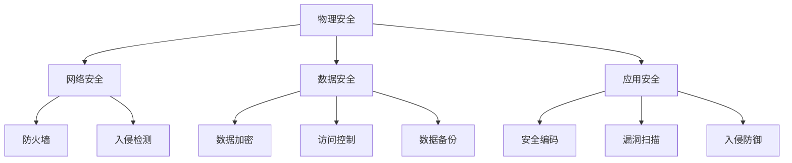
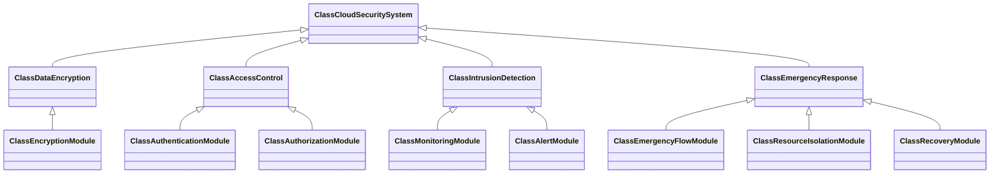
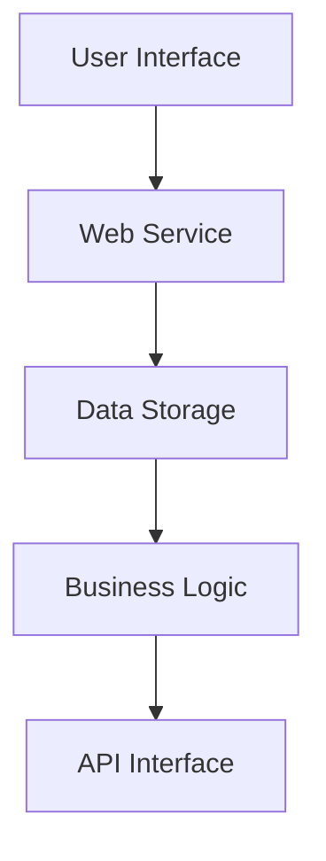
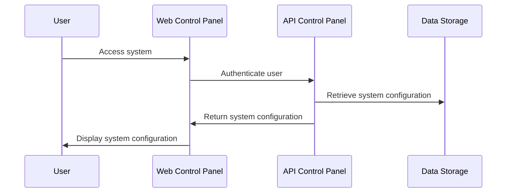
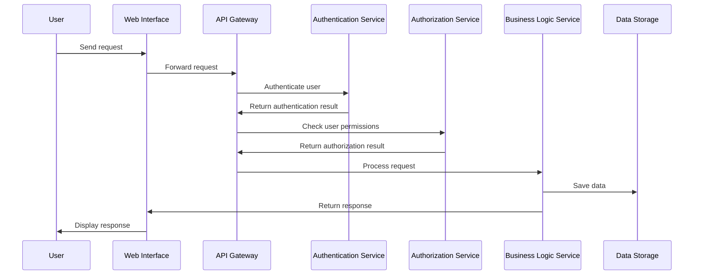

                 


### 文章标题：云安全：保护云环境中的数据和应用

### 关键词：云安全，云计算，数据保护，应用安全，安全算法

### 摘要：
本文深入探讨了云环境中的数据和应用安全，分析了云安全的重要性及其面临的主要挑战。通过阐述核心概念、介绍安全算法原理、设计系统架构，以及提供实战案例，本文为读者提供了全面且实用的云安全解决方案。文章旨在帮助IT从业人员和企业了解云安全的关键要素，掌握最佳实践，以保障云环境中的数据和应用安全。

---

**第一部分：云安全概述**

**第1章：云安全的重要性与挑战**

#### 1.1 云安全的发展背景

云计算作为一种新兴的计算模式，正逐渐成为企业信息化建设的重要组成部分。从最初的IaaS（基础设施即服务）到PaaS（平台即服务），再到SaaS（软件即服务），云计算已经渗透到了企业运营的方方面面。然而，随着云计算的广泛应用，云安全也逐渐成为一个不可忽视的话题。

云计算的发展历程可以追溯到20世纪60年代，当时美国国防高级研究计划局（DARPA）提出了“云计算”的概念。然而，直到21世纪初，随着互联网技术的发展和商业模式的成熟，云计算才开始逐渐进入人们的视野。从Amazon Web Services（AWS）到Microsoft Azure，再到Google Cloud Platform（GCP），各大云计算提供商不断推出新的服务和功能，推动了云计算的快速发展。

#### 1.2 云计算模型与安全挑战

云计算模型主要包括IaaS、PaaS和SaaS三种。其中，IaaS提供基础设施服务，如虚拟机、存储和网络；PaaS提供平台服务，如开发工具、数据库和中间件；SaaS提供软件服务，如企业应用、在线办公和客户关系管理。每种模型都有其独特的安全挑战。

- **IaaS**：由于IaaS提供的是基础设施服务，用户需要关注物理安全和网络安全。物理安全包括服务器房间的安保、电源和网络连接等；网络安全包括防火墙、入侵检测和DDoS攻击防护等。

- **PaaS**：PaaS提供的是平台服务，用户需要关注数据安全和应用安全。数据安全包括数据加密、访问控制和数据备份等；应用安全包括应用程序的安全编码、漏洞扫描和入侵防御等。

- **SaaS**：SaaS提供的是软件服务，用户需要关注数据安全和隐私保护。数据安全包括数据加密、访问控制和数据备份等；隐私保护包括用户数据的匿名化、数据传输的安全和用户隐私政策的制定等。

#### 1.3 云环境中的数据与应用保护

在云环境中，数据和应用的安全保护至关重要。数据是企业的核心资产，一旦泄露或丢失，将导致严重的商业损失和声誉损害。应用安全则是保障业务连续性和用户体验的关键。

- **数据保护**：数据保护主要包括数据加密、访问控制和数据备份。数据加密可以防止数据被未经授权的人员访问；访问控制可以确保只有授权人员才能访问数据；数据备份可以防止数据丢失或损坏。

- **应用保护**：应用保护主要包括安全编码、漏洞扫描和入侵防御。安全编码可以减少应用程序的漏洞；漏洞扫描可以及时发现应用程序的漏洞；入侵防御可以防止攻击者入侵应用程序。

**第2章：云安全核心概念与架构**

#### 2.1 云计算模型与安全架构

云安全架构是保障云环境安全的基础。云安全架构主要包括以下几个层次：

- **物理安全**：物理安全包括服务器房间的安保、电源和网络连接等。物理安全是云安全的基础，必须确保服务器房间的安全，防止未经授权的人员进入。

- **网络安全**：网络安全包括防火墙、入侵检测和DDoS攻击防护等。网络安全是保障云环境安全的关键，必须确保网络连接的安全，防止网络攻击和数据泄露。

- **数据安全**：数据安全包括数据加密、访问控制和数据备份等。数据安全是保障企业数据安全的核心，必须确保数据的加密和安全存储。

- **应用安全**：应用安全包括安全编码、漏洞扫描和入侵防御等。应用安全是保障企业业务连续性和用户体验的关键，必须确保应用程序的安全和可靠性。

#### 2.2 安全威胁分类与识别

云环境中的安全威胁可以分为以下几类：

- **内部威胁**：内部威胁主要来自企业内部人员，如员工误操作、内部欺诈和恶意行为等。内部威胁可能对企业造成严重的损失。

- **外部威胁**：外部威胁主要来自网络攻击者，如DDoS攻击、SQL注入和跨站脚本攻击等。外部威胁可能导致企业数据泄露和网络瘫痪。

- **恶意软件**：恶意软件包括病毒、木马和蠕虫等。恶意软件可能窃取企业敏感数据或破坏企业系统。

- **社会工程学攻击**：社会工程学攻击包括钓鱼攻击、电话诈骗和假冒身份等。社会工程学攻击可能欺骗企业员工泄露敏感信息。

#### 2.3 云安全防护策略

云安全防护策略主要包括以下几个方面：

- **身份认证与访问控制**：身份认证可以确保只有授权人员才能访问云资源；访问控制可以确保授权人员只能访问其权限范围内的资源。

- **数据加密**：数据加密可以防止数据在传输和存储过程中被窃取或篡改。

- **入侵检测与防护**：入侵检测可以及时发现异常行为和潜在威胁；入侵防护可以阻止攻击者入侵云环境。

- **安全审计与合规性**：安全审计可以确保云环境中的操作符合安全规范；合规性检查可以确保企业遵守相关法律法规。

- **安全培训与意识提升**：安全培训可以提升员工的安全意识；意识提升可以防止员工因误操作导致安全事件。

#### 2.4 Mermaid流程图：云安全架构详解

下面是云安全架构的Mermaid流程图：



**第二部分：云安全算法原理与实现**

**第3章：云安全算法原理与实现**

#### 3.1 加密算法原理与实现

加密算法是保障数据安全的重要手段。常见的加密算法包括对称加密和非对称加密。

- **对称加密**：对称加密算法使用相同的密钥进行加密和解密。常见的对称加密算法有DES、AES等。以下是一个使用AES算法进行加密的Python代码示例：

  ```python
  from Crypto.Cipher import AES
  from Crypto.Util.Padding import pad

  key = b'mysecretkey12345'
  cipher = AES.new(key, AES.MODE_CBC)
  plaintext = b'This is a secret message!'
  ciphertext = cipher.encrypt(pad(plaintext, AES.block_size))
  print(ciphertext)
  ```

- **非对称加密**：非对称加密算法使用不同的密钥进行加密和解密。常见的非对称加密算法有RSA、ECC等。以下是一个使用RSA算法进行加密的Python代码示例：

  ```python
  from Crypto.PublicKey import RSA
  from Crypto.Cipher import PKCS1_OAEP

  key = RSA.generate(2048)
  private_key = key.export_key()
  public_key = key.publickey().export_key()

  cipher = PKCS1_OAEP.new(RSA.import_key(public_key))
  plaintext = b'This is a secret message!'
  ciphertext = cipher.encrypt(plaintext)
  print(ciphertext)
  ```

#### 3.2 认证与授权机制

认证与授权机制是保障云安全的重要环节。常见的认证机制有用户名密码认证、多因素认证等。

- **用户名密码认证**：用户名密码认证是最常见的认证机制。用户通过输入用户名和密码来证明自己的身份。以下是一个使用用户名密码认证的Python代码示例：

  ```python
  users = {'admin': 'password123'}
  
  def authenticate(username, password):
      if username in users and users[username] == password:
          return True
      return False
  
  username = input('Username: ')
  password = input('Password: ')
  if authenticate(username, password):
      print('Authentication successful!')
  else:
      print('Authentication failed!')
  ```

- **多因素认证**：多因素认证要求用户在输入用户名和密码后，还需要提供其他验证方式，如手机验证码、指纹验证等。以下是一个使用多因素认证的Python代码示例：

  ```python
  def send_sms_code():
      print('Sending SMS code to your phone...')

  def verify_sms_code(code):
      return code == '123456'

  def authenticate(username, password, sms_code):
      if username in users and users[username] == password and verify_sms_code(sms_code):
          return True
      return False

  username = input('Username: ')
  password = input('Password: ')
  sms_code = input('SMS code: ')
  if authenticate(username, password, sms_code):
      print('Authentication successful!')
  else:
      print('Authentication failed!')
  ```

#### 3.3 使用Python和Mermaid演示加密算法

下面是一个使用Python和Mermaid演示AES加密算法的示例：

```python
import mermaid

# AES加密算法流程图
mermaid_flow = '''
sequenceDiagram
  participant User as User
  participant Server as Server
  User->>Server: Send data
  Server->>User: Encrypt data using AES
  User->>Server: Send encrypted data
  Server->>User: Decrypt encrypted data using AES
  User->>Server: Send decrypted data
  Server->>User: Verify data integrity
  '''

# 将Mermaid流程图转换为HTML
html_content = mermaid.render(mermaid_flow)

# 打印HTML内容
print(html_content)
```

**第三部分：数学模型与公式**

**第4章：数学模型与公式**

#### 4.1 密码学基础数学模型

密码学基础数学模型主要包括以下几个部分：

- **离散对数问题**：离散对数问题是计算给定一个素数和一个基数的幂在模该素数下的离散对数。离散对数问题在密码学中有着广泛的应用。

- **素数分解问题**：素数分解问题是将一个大整数分解为其素数因子。素数分解问题在密码学中也是一个重要的基础。

- **椭圆曲线离散对数问题**：椭圆曲线离散对数问题是计算给定一个椭圆曲线和一个基点的幂在椭圆曲线上的离散对数。椭圆曲线离散对数问题在椭圆曲线密码学中有着重要的应用。

下面是使用LaTeX格式书写的数学公式：

$$
\text{离散对数公式：} \log_a b = c \iff a^c = b
$$

$$
\text{素数分解公式：} N = p_1^{e_1} p_2^{e_2} \cdots p_k^{e_k}
$$

$$
\text{椭圆曲线离散对数公式：} \log_P Q = s \iff P^s = Q
$$

#### 4.2 安全协议数学公式

安全协议是保障通信安全的重要手段。以下是一些常见的安全协议数学公式：

- **Diffie-Hellman密钥交换协议**：

  $$ 
  \begin{aligned}
  &\text{公钥：} \\
  &p = (n, g^x \mod n) \\
  &\text{私钥：} \\
  &a = g^x \mod n \\
  &\text{密钥交换：} \\
  &b = g^y \mod n \\
  &k = b^a \mod n
  \end{aligned}
  $$

- **RSA加密算法**：

  $$ 
  \begin{aligned}
  &\text{公钥：} \\
  &n = pq, e \\
  &\text{私钥：} \\
  &d = e^{-1} \mod (p-1)(q-1) \\
  &\text{加密：} \\
  &c = m^e \mod n \\
  &\text{解密：} \\
  &m = c^d \mod n
  \end{aligned}
  $$

下面是使用LaTeX格式书写的数学公式：

$$
\text{Diffie-Hellman密钥交换协议公式：}
\begin{aligned}
p &= (n, g^x \mod n) \\
a &= g^x \mod n \\
b &= g^y \mod n \\
k &= b^a \mod n
\end{aligned}
$$

$$
\text{RSA加密算法公式：}
\begin{aligned}
n &= pq, e \\
d &= e^{-1} \mod (p-1)(q-1) \\
c &= m^e \mod n \\
m &= c^d \mod n
\end{aligned}
$$

**第四部分：系统分析与架构设计方案**

**第5章：云安全系统分析与设计**

#### 5.1 云安全系统项目介绍

云安全系统是一个旨在保障云环境中数据和应用安全的综合解决方案。该项目旨在为企业提供全面的安全防护，包括数据加密、访问控制、入侵检测和应急响应等。

#### 5.2 系统功能设计

云安全系统的功能设计主要包括以下几个方面：

- **数据加密**：数据加密功能用于保护存储在云环境中的数据。该功能包括对数据传输和存储过程中的加密和解密操作。

- **访问控制**：访问控制功能用于确保只有授权人员才能访问云资源。该功能包括用户认证、权限管理和访问控制列表等。

- **入侵检测**：入侵检测功能用于监控云环境中的异常行为和潜在威胁。该功能包括实时监控、告警和日志分析等。

- **应急响应**：应急响应功能用于应对突发事件和紧急情况。该功能包括应急流程管理、资源隔离和恢复等。

下面是云安全系统的领域模型Mermaid类图：



#### 5.3 系统架构设计

云安全系统的架构设计主要包括以下几个方面：

- **前端架构**：前端架构主要包括用户界面和Web服务。用户界面用于展示系统功能，Web服务用于处理用户请求和响应。

- **后端架构**：后端架构主要包括数据存储、业务逻辑和API接口。数据存储用于存储用户数据和系统配置；业务逻辑用于处理业务请求；API接口用于与前端和第三方系统集成。

下面是云安全系统的Mermaid架构图：



#### 5.4 系统接口设计

云安全系统的接口设计主要包括以下几个方面：

- **数据接口**：数据接口用于与其他系统进行数据交换和共享。该接口包括RESTful API和GraphQL API等。

- **控制接口**：控制接口用于管理系统资源和配置。该接口包括Web控制台和API控制台等。

下面是云安全系统的Mermaid接口设计图：



#### 5.5 系统交互

云安全系统的交互设计主要包括以下几个方面：

- **用户交互**：用户交互用于与用户进行交互，收集用户请求和反馈。该交互包括Web界面、移动应用和命令行界面等。

- **系统交互**：系统交互用于系统内部模块之间的交互。该交互包括消息队列、事件驱动和同步调用等。

下面是云安全系统的Mermaid序列图：



**第五部分：项目实战**

**第6章：项目实战**

#### 6.1 云安全环境安装与配置

安装和配置云安全环境是保障云安全的第一步。以下是一个简单的安装和配置流程：

1. **安装操作系统**：首先，我们需要安装一个支持云安全功能的服务器操作系统，如CentOS、Ubuntu等。

2. **安装云安全软件**：接下来，我们需要安装云安全软件，如Fail2Ban、Security Onion等。这些软件可以提供入侵检测、防护和日志分析等功能。

3. **配置防火墙**：配置防火墙是保障网络安全的重要措施。我们可以在服务器上安装和配置防火墙软件，如iptables或firewalld。

4. **配置入侵检测系统**：配置入侵检测系统可以帮助我们及时发现潜在的安全威胁。我们可以在服务器上安装和配置入侵检测软件，如Snort。

5. **配置日志收集和分析系统**：配置日志收集和分析系统可以帮助我们收集和监控服务器日志，及时发现异常行为。我们可以在服务器上安装和配置日志收集软件，如Logstash，以及日志分析软件，如Kibana。

下面是一个简单的Python脚本，用于配置防火墙和入侵检测系统：

```python
import os

# 配置防火墙
os.system("iptables -A INPUT -p tcp --dport 80 -j ACCEPT")
os.system("iptables -A INPUT -p tcp --dport 443 -j ACCEPT")
os.system("iptables -A INPUT -p tcp --dport 22 -j ACCEPT")
os.system("iptables -A INPUT -j DROP")

# 配置入侵检测系统
os.system("snort -c /etc/snort/snort.conf")
```

#### 6.2 系统核心实现源代码

云安全系统的核心实现包括数据加密、访问控制、入侵检测和应急响应等模块。以下是一个简单的数据加密模块的实现：

```python
from Crypto.Cipher import AES
from Crypto.Util.Padding import pad
from Crypto.Random import get_random_bytes

# AES加密函数
def encrypt_data(plaintext):
    key = get_random_bytes(16)
    cipher = AES.new(key, AES.MODE_CBC)
    ciphertext = cipher.encrypt(pad(plaintext, AES.block_size))
    return key, ciphertext

# AES解密函数
def decrypt_data(key, ciphertext):
    cipher = AES.new(key, AES.MODE_CBC)
    plaintext = cipher.decrypt(ciphertext).strip(b'\x00')
    return plaintext
```

#### 6.3 代码应用解读与分析

上面的代码实现了AES加密和解密功能。在实际应用中，我们可以将这段代码集成到云安全系统中，用于保护存储在云环境中的数据。

- **加密过程**：首先，生成一个随机密钥，然后使用AES加密算法对明文数据进行加密。加密过程中，需要对明文数据进行填充，以确保数据长度是AES块大小的整数倍。

- **解密过程**：解密过程中，首先使用相同的密钥和加密模式对密文数据进行解密，然后去除填充数据，得到原始明文数据。

在实际应用中，我们还需要考虑以下几个方面：

- **密钥管理**：密钥是数据加密的核心，必须确保密钥的安全存储和传输。在实际应用中，可以使用KMS（密钥管理服务）来管理密钥。

- **错误处理**：在实际应用中，可能会遇到加密和解密失败的情况。此时，我们需要进行错误处理，确保系统能够正常运行。

- **性能优化**：AES加密和解密操作可能会对系统性能产生一定影响。在实际应用中，我们可以通过优化代码、使用更高效的加密算法等方式来提高系统性能。

#### 6.4 实际案例分析和详细讲解

以下是一个实际案例，用于说明云安全系统在数据加密、访问控制和入侵检测方面的应用：

**案例：企业邮件系统数据加密与安全**

**问题描述**：某企业需要保护其内部邮件系统中的敏感数据，防止数据泄露和篡改。

**解决方案**：

1. **数据加密**：使用AES加密算法对邮件内容进行加密，确保邮件在传输和存储过程中不被窃取或篡改。加密过程中，使用随机密钥，并将其存储在KMS中。

2. **访问控制**：使用访问控制列表（ACL）来确保只有授权人员才能访问邮件系统。ACL可以基于用户身份、角色和权限进行配置。

3. **入侵检测**：使用入侵检测系统（IDS）来监控邮件系统的异常行为和潜在威胁。IDS可以实时检测和报警，以便及时采取应对措施。

**详细讲解**：

1. **数据加密**：

   - **加密过程**：邮件发送时，邮件服务器使用AES加密算法对邮件内容进行加密，生成密文。密文和密钥一起存储在邮件服务器中。

   - **解密过程**：邮件接收时，邮件客户端使用存储在KMS中的密钥对邮件进行解密，得到原始邮件内容。

2. **访问控制**：

   - **用户认证**：邮件客户端在访问邮件系统时，需要使用用户名和密码进行认证。认证成功后，客户端会获得相应的权限。

   - **权限管理**：邮件系统管理员可以配置访问控制列表（ACL），为不同用户和角色分配不同的权限。例如，普通用户只能查看和发送邮件，而管理员可以查看所有邮件和执行系统管理任务。

3. **入侵检测**：

   - **异常检测**：邮件服务器会实时监控邮件系统的流量和日志，发现异常行为，如大量邮件发送、邮件地址泄露等。

   - **报警和响应**：一旦发现异常行为，邮件服务器会立即报警，并通知系统管理员。管理员可以采取相应的措施，如隔离异常IP地址、删除恶意邮件等。

**项目小结**：

通过该案例，我们可以看到云安全系统在数据加密、访问控制和入侵检测方面的应用。数据加密可以确保邮件内容的安全；访问控制可以确保只有授权人员才能访问邮件系统；入侵检测可以及时发现潜在的安全威胁，保障邮件系统的安全运行。

**第六部分：最佳实践与总结**

**第7章：最佳实践与总结**

#### 7.1 云安全最佳实践

为了确保云环境中的数据和应用安全，我们需要遵循以下最佳实践：

1. **数据加密**：对存储在云环境中的敏感数据进行加密，确保数据在传输和存储过程中不被窃取或篡改。

2. **身份认证与访问控制**：使用多因素认证（MFA）来确保只有授权人员才能访问云资源。同时，实施细粒度的访问控制策略，确保用户只能访问其权限范围内的资源。

3. **网络安全**：部署防火墙、入侵检测系统和DDoS防护设备，确保网络安全。定期更新和补丁系统，防止安全漏洞被利用。

4. **数据备份与恢复**：定期备份云环境中的数据，确保在数据丢失或损坏时能够快速恢复。

5. **安全审计与合规性**：定期进行安全审计，确保云环境中的操作符合安全标准和法规要求。例如，遵守ISO 27001、HIPAA、GDPR等标准。

6. **员工培训与意识提升**：定期对员工进行安全培训，提高员工的安全意识和应对安全事件的能力。

7. **安全监控与响应**：部署实时监控系统，及时发现和应对潜在的安全威胁。建立应急响应计划，确保在发生安全事件时能够快速响应。

#### 7.2 注意事项

在实施云安全措施时，需要注意以下几个方面：

1. **平衡安全与性能**：在保证安全的同时，需要考虑系统性能的影响。例如，加密算法和访问控制策略可能会增加系统延迟。

2. **遵循最佳实践**：遵循云安全最佳实践，确保云环境中的操作符合行业标准和最佳实践。

3. **持续更新与改进**：随着云计算技术的不断发展，安全威胁也在不断演变。我们需要持续更新安全措施，以应对新的安全挑战。

4. **避免单点故障**：在设计云安全系统时，应避免单点故障，确保系统的可靠性。

5. **合规性要求**：确保云环境中的操作符合相关法律法规的要求，避免因违规操作导致的法律风险。

#### 7.3 拓展阅读

以下是一些关于云安全的有用资源和拓展阅读：

1. **云安全书籍**：《云安全与隐私保护》、《云计算安全指南》等。

2. **云安全标准与法规**：ISO 27001、HIPAA、GDPR、NIST SP 800-53等。

3. **云安全工具与产品**：AWS Shield、Azure Security Center、Google Cloud Security Command Center等。

4. **云安全博客和论坛**：Infosec Institute、OWASP、Cloud Security Alliance等。

**第8章：云安全趋势与未来展望**

#### 8.1 云安全发展趋势

随着云计算的快速发展，云安全也在不断演变。以下是云安全领域的一些发展趋势：

1. **云原生安全**：云原生安全是指针对云原生应用和服务的安全措施。随着微服务、容器和Kubernetes等技术的普及，云原生安全成为了云安全的重要方向。

2. **人工智能与机器学习**：人工智能和机器学习技术可以用于检测和防御复杂的网络攻击。例如，使用机器学习算法进行异常检测、入侵预防和漏洞扫描。

3. **零信任安全模型**：零信任安全模型认为任何内部网络都不能完全信任，所有访问都需要进行严格的验证和授权。该模型强调基于身份验证和最小权限原则，确保只有授权人员才能访问云资源。

4. **边缘计算与安全**：随着物联网和5G技术的普及，边缘计算成为了一个重要领域。边缘计算的安全问题也成为了一个研究热点。

#### 8.2 未来云安全挑战

未来云安全将面临以下挑战：

1. **安全复杂性**：随着云计算的复杂化，云安全也将变得更加复杂。我们需要应对分布式系统、多云环境和跨云服务的安全挑战。

2. **攻击技术的演变**：攻击者会不断采用新的攻击技术和工具，我们需要不断创新和改进安全措施，以应对新的安全威胁。

3. **合规性与法规要求**：随着云计算在全球范围内的普及，合规性和法规要求也将变得更加严格。我们需要确保云环境中的操作符合相关法律法规。

4. **安全人才短缺**：云安全领域的快速发展导致了对安全人才的需求急剧增加。我们需要培养更多具备云计算和安全知识的专业人才。

#### 8.3 云安全技术展望

未来云安全技术将朝着以下几个方向演进：

1. **自动化与智能化**：自动化和智能化技术可以提高云安全管理的效率和质量。例如，使用自动化工具进行安全配置、监控和响应。

2. **集成与协同**：云安全技术将与其他领域（如区块链、物联网等）进行集成和协同，形成更加综合的安全解决方案。

3. **隐私保护与合规性**：随着隐私保护和合规性的要求越来越高，云安全技术将更加注重数据隐私保护和合规性管理。

4. **安全服务与外包**：随着云安全服务市场的成熟，越来越多的企业可能会选择将云安全外包给专业的安全服务提供商。

通过本文的深入探讨，我们可以看到云安全在云计算时代的重要性。云安全不仅关乎企业的数据和应用安全，也关乎整个行业的可持续发展。随着云计算技术的不断进步，云安全也将迎来新的机遇和挑战。让我们共同努力，为构建安全、可靠、高效的云环境而奋斗。**


**作者：AI天才研究院/AI Genius Institute & 禅与计算机程序设计艺术 /Zen And The Art of Computer Programming**

