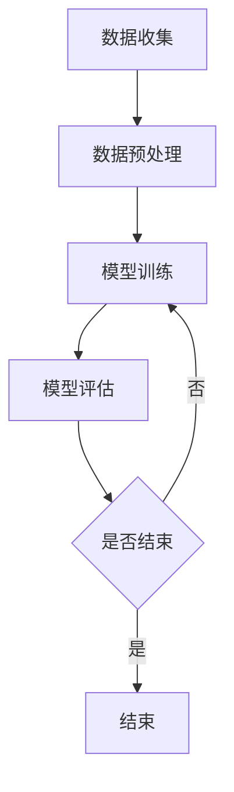
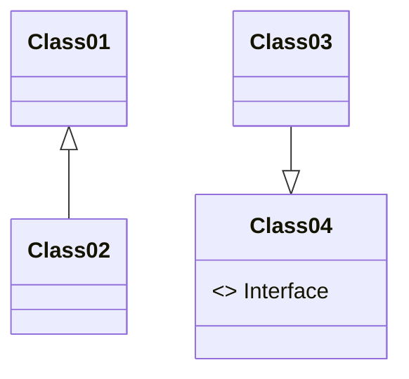
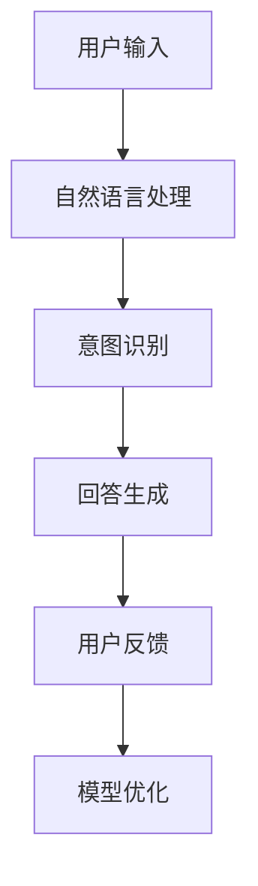
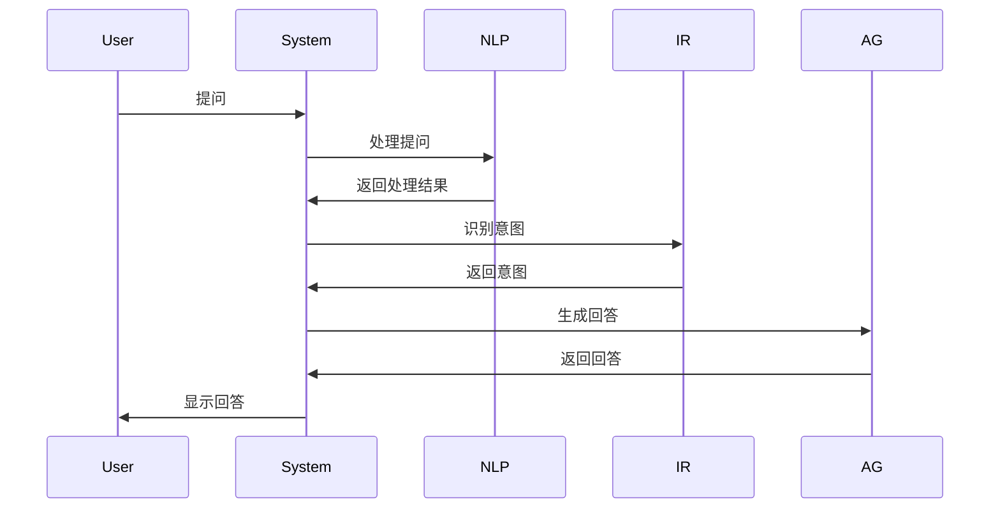
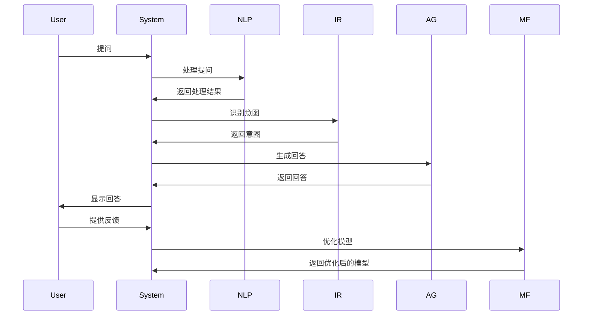

                 


## 人工智能与机器学习在软件开发中的应用

### 关键词：人工智能、机器学习、软件开发、应用场景

### 摘要：
本文将深入探讨人工智能与机器学习在软件开发中的应用，通过对核心概念的介绍、算法原理的讲解、系统分析与架构设计的分析，以及实际项目案例的剖析，帮助读者理解这两个技术领域如何在实际软件开发中发挥巨大作用。文章将遵循“从问题出发，深入剖析，到具体应用”的思路，力求以逻辑清晰、结构紧凑、简单易懂的方式，向读者展示人工智能与机器学习在软件开发中的潜力和价值。

### 目录大纲

#### 第一部分：背景介绍与核心概念
- **第1章：问题背景与核心概念**
  - **1.1 问题背景**
    - 人工智能在软件开发中的重要性
    - 机器学习的发展历程
  - **1.2 核心概念**
    - 人工智能
    - 机器学习
    - 深度学习
    - 软件开发

- **第2章：概念属性特征对比与ER实体关系图**
  - **2.1 概念属性特征对比表**
    - 人工智能 vs. 机器学习
    - 机器学习 vs. 深度学习
  - **2.2 ER实体关系图**
    - 系统实体关系图

#### 第二部分：机器学习在软件开发中的应用
- **第3章：机器学习基础算法**
  - **3.1 线性回归**
    - 算法原理
    - 数学模型
    - Python实现
    - 举例说明
  - **3.2 逻辑回归**
    - 算法原理
    - 数学模型
    - Python实现
    - 举例说明
  - **3.3 决策树**
    - 算法原理
    - 数学模型
    - Python实现
    - 举例说明

#### 第三部分：深度学习在软件开发中的应用
- **第4章：深度学习基础算法**
  - **4.1 卷积神经网络（CNN）**
    - 算法原理
    - 数学模型
    - Python实现
    - 举例说明
  - **4.2 循环神经网络（RNN）**
    - 算法原理
    - 数学模型
    - Python实现
    - 举例说明
  - **4.3 长短时记忆网络（LSTM）**
    - 算法原理
    - 数学模型
    - Python实现
    - 举例说明

#### 第四部分：项目实战
- **第5章：实际项目案例**
  - **5.1 项目介绍**
    - 项目概述
    - 项目目标
  - **5.2 系统功能设计**
    - 领域模型
    - 功能模块设计
  - **5.3 系统架构设计**
    - 系统架构
    - 技术选型
  - **5.4 系统核心实现源代码**
    - 代码解读
    - 应用分析
  - **5.5 项目小结**
    - 项目总结
    - 经验教训

#### 第五部分：最佳实践与拓展
- **第6章：最佳实践**
  - **6.1 机器学习模型选择**
    - 模型评估指标
    - 模型选择策略
  - **6.2 性能优化技巧**
    - 模型调参
    - 系统优化

- **第7章：注意事项**
  - **7.1 数据质量**
    - 数据预处理
    - 数据分析
  - **7.2 模型部署**
    - 模型部署流程
    - 持续集成与持续部署（CI/CD）

- **第8章：拓展阅读**
  - **8.1 最新研究成果**
    - 最新论文综述
    - 热点话题讨论
  - **8.2 开源资源**
    - 开源框架
    - 开源工具

### 核心内容与思考

#### 从问题出发

在软件开发中，人工智能和机器学习技术正逐渐成为不可或缺的一部分。如何将这两项技术有效地融合到软件开发流程中，以提升软件的性能、可靠性和用户体验，是一个值得深入探讨的问题。本文将围绕这一核心问题，逐步展开对人工智能与机器学习在软件开发中的应用进行探讨。

#### 深入剖析

为了深入剖析这个问题，我们需要先了解人工智能和机器学习的基本概念。人工智能（Artificial Intelligence，AI）是计算机科学的一个分支，旨在研究如何构建智能体（agent），使其能够执行需要人类智能的任务。机器学习（Machine Learning，ML）则是人工智能的一个子领域，通过算法和统计模型，使计算机能够从数据中学习并做出决策。

在了解了基本概念后，我们需要进一步探讨机器学习在软件开发中的应用。机器学习算法可以分为监督学习、无监督学习和强化学习三类。在软件开发中，监督学习算法常用于分类和回归问题，如推荐系统、图像识别等；无监督学习算法则常用于聚类和降维问题，如数据挖掘、用户行为分析等；强化学习算法则常用于决策和优化问题，如游戏AI、自动驾驶等。

#### 具体应用

在具体应用方面，我们可以从以下几个方面展开：

1. **自动化测试**：利用机器学习算法自动化生成测试用例，提高测试效率和质量。
2. **代码审查**：通过机器学习算法对代码进行分析，发现潜在的缺陷和漏洞。
3. **需求工程**：利用机器学习算法对用户需求进行建模和分析，帮助开发人员更好地理解用户需求。
4. **智能推荐**：基于用户行为和偏好，利用机器学习算法生成个性化的推荐结果。
5. **异常检测**：利用机器学习算法实时监控系统运行状态，发现异常行为并及时报警。

#### 步骤思考

1. **确定应用场景**：首先需要明确机器学习在软件开发中的应用场景，了解该场景的需求和挑战。
2. **选择合适的算法**：根据应用场景的需求，选择合适的机器学习算法。
3. **数据收集与处理**：收集相关数据，并进行预处理和特征提取。
4. **模型训练与评估**：使用训练数据训练模型，并对模型进行评估和优化。
5. **模型部署与应用**：将训练好的模型部署到生产环境中，并进行实际应用。

#### 实际案例

为了更好地说明上述步骤，我们可以通过一个实际案例来进行分析。假设我们要开发一个智能客服系统，利用机器学习算法对用户提问进行自动回答。

1. **确定应用场景**：智能客服系统需要处理大量的用户提问，如何快速、准确地回答用户的提问是一个关键问题。
2. **选择合适的算法**：我们可以选择监督学习算法，如循环神经网络（RNN）或长短时记忆网络（LSTM），来处理文本数据。
3. **数据收集与处理**：收集大量的用户提问和回答数据，并对数据进行预处理，如分词、去停用词等。
4. **模型训练与评估**：使用预处理后的数据训练模型，并对模型进行评估，如准确率、召回率等。
5. **模型部署与应用**：将训练好的模型部署到生产环境中，并实时响应用户提问。

通过这个案例，我们可以看到机器学习在软件开发中的应用是如何一步步实现的。

### 总结

人工智能与机器学习在软件开发中的应用具有广阔的前景。通过深入剖析和应用实践，我们可以发现机器学习算法在自动化测试、代码审查、需求工程、智能推荐和异常检测等方面具有巨大的潜力。在未来的软件开发中，如何更好地利用人工智能和机器学习技术，提高软件的性能和用户体验，将是我们需要持续探索和关注的问题。

### 拓展阅读

- [1] Michael I. Jordan. "An Introduction to Statistical Learning." Springer, 2013.
- [2] Christopher M. Bishop. "Pattern Recognition and Machine Learning." Springer, 2006.
- [3] Ian Goodfellow, Yoshua Bengio, Aaron Courville. "Deep Learning." MIT Press, 2016.
- [4] Andrew Ng. "Machine Learning Yearning." Coursera, 2019.

### 注意事项

- 在应用机器学习算法时，数据质量和特征提取至关重要。
- 模型部署过程中，需要注意模型的性能优化和安全性。
- 需要持续关注人工智能和机器学习领域的最新研究成果和开源资源。

### 最佳实践

- 在选择机器学习算法时，需要根据具体应用场景进行权衡和选择。
- 在数据处理和特征提取过程中，需要充分挖掘数据的潜在价值。
- 在模型训练和评估过程中，需要关注模型的泛化能力和可解释性。

---

作者：AI天才研究院/AI Genius Institute & 禅与计算机程序设计艺术 /Zen And The Art of Computer Programming

以上是文章的核心内容框架，接下来我们将逐章展开详细内容，包括背景介绍、核心概念、算法讲解、系统分析与架构设计、项目实战、最佳实践与拓展等。每章内容都将遵循“从问题出发，深入剖析，到具体应用”的思路，力求为读者提供有价值的技术见解和实战经验。让我们一步一步地深入探索人工智能与机器学习在软件开发中的应用吧！## 第一部分：背景介绍与核心概念

在深入探讨人工智能（AI）与机器学习（ML）在软件开发中的应用之前，首先需要了解这两个核心概念的基本定义、发展历程以及它们在软件工程领域中的重要角色。

### 1.1 问题背景

#### 人工智能在软件开发中的重要性

人工智能作为一种模拟人类智能的技术，已经在许多领域取得了显著的成果，如自然语言处理、图像识别、自动驾驶和医疗诊断等。随着技术的进步，人工智能逐渐成为软件开发中不可或缺的一部分。它不仅提升了软件系统的智能化水平，还大大增强了软件的灵活性和适应性。

- **智能化提升**：通过人工智能，软件系统能够更加智能地处理复杂任务，如自然语言理解、图像识别等，从而提高系统的整体性能。
- **用户个性化体验**：人工智能能够根据用户行为和偏好，提供个性化的服务和建议，提升用户的满意度和忠诚度。
- **自动化与效率**：人工智能的应用使得软件开发过程更加自动化，减少了人工干预，提高了开发效率。

#### 机器学习的发展历程

机器学习是人工智能的一个子领域，其主要目标是使计算机系统能够从数据中自动学习并做出决策。机器学习的发展历程可以追溯到20世纪50年代，但直到近年才取得了突破性进展。这一过程中，算法的优化、计算能力的提升以及大数据的普及是推动机器学习发展的关键因素。

- **初期的探索**：1956年，约翰·麦卡锡等人在达特茅斯会议上提出了“人工智能”这一概念，标志着人工智能的正式诞生。随后，机器学习领域开始了一些初步的探索。
- **符号主义与逻辑推理**：20世纪70年代，基于符号主义和逻辑推理的专家系统成为机器学习的主要方法。然而，由于处理能力和数据量的限制，专家系统的应用受到了很大的局限。
- **数据驱动方法**：20世纪80年代，以神经网络为代表的算法开始受到重视，数据驱动的方法逐渐成为主流。这一时期，计算能力的提升和数据量的增加为机器学习的发展提供了有力支持。
- **深度学习崛起**：21世纪初，随着深度学习的崛起，机器学习取得了显著的突破。深度学习通过多层神经网络结构，能够自动提取复杂数据的特征，并在图像识别、语音识别等领域取得了前所未有的成果。

#### 机器学习在软件开发中的重要性

机器学习在软件开发中的应用日益广泛，其主要优势在于：

- **自适应能力**：机器学习算法能够根据新数据自动调整和优化，使软件系统能够更好地适应环境变化。
- **自动化**：通过机器学习，许多重复性和劳动密集型的任务可以实现自动化，从而提高开发效率。
- **智能化**：机器学习能够使软件系统具备更高级的智能化功能，如自然语言处理、图像识别和预测分析等。

### 1.2 核心概念

#### 人工智能

人工智能（Artificial Intelligence，AI）是指通过计算机模拟人类智能的技术，包括知识表示、问题解决、学习、推理和自我改进等。人工智能的目标是实现智能机器，使它们能够完成原本需要人类智能的任务。

- **知识表示**：知识表示是指将人类知识转化为计算机能够理解和处理的形式。这包括符号逻辑、语义网络、产生式系统和知识图谱等。
- **问题解决**：问题解决是指计算机在面对复杂问题时，能够像人类一样进行推理和决策，找到解决问题的方法。
- **学习**：学习是指计算机通过经验和数据，自动改进自身的性能和知识。机器学习是实现计算机学习的重要途径。
- **推理**：推理是指计算机根据已有知识和规则，推导出新的结论或解决方案。
- **自我改进**：自我改进是指计算机系统能够不断学习和优化，以提升自身的性能和适应性。

#### 机器学习

机器学习（Machine Learning，ML）是指通过算法和统计模型，使计算机能够从数据中自动学习并做出决策的技术。机器学习包括监督学习、无监督学习和强化学习等多种类型。

- **监督学习**：监督学习是指利用标注数据，训练模型并进行预测。常见的监督学习算法包括线性回归、逻辑回归和决策树等。
- **无监督学习**：无监督学习是指在没有标注数据的情况下，自动发现数据中的模式和结构。常见的无监督学习算法包括聚类和降维等。
- **强化学习**：强化学习是指通过奖励和惩罚机制，使计算机在与环境的交互中学习最优策略。常见的强化学习算法包括Q学习和策略梯度等。

#### 深度学习

深度学习（Deep Learning，DL）是一种基于多层神经网络的结构化机器学习方法。深度学习通过多层神经网络结构，能够自动提取复杂数据的特征，并在图像识别、语音识别和自然语言处理等领域取得了显著的成果。

- **神经网络**：神经网络是一种模拟生物神经系统的计算模型，通过多层节点（神经元）之间的连接和激活函数，实现数据的处理和变换。
- **卷积神经网络（CNN）**：卷积神经网络是一种用于图像识别和处理的神经网络结构，通过卷积层和池化层，能够提取图像的特征。
- **循环神经网络（RNN）**：循环神经网络是一种用于序列数据处理和时间序列预测的神经网络结构，通过循环连接和隐藏状态，能够捕捉序列中的长期依赖关系。
- **长短时记忆网络（LSTM）**：长短时记忆网络是一种改进的循环神经网络，通过引入门控机制，能够更好地处理长序列数据。

#### 软件开发

软件开发是指通过设计、实现、测试和维护，创建满足特定需求的软件系统的过程。软件开发包括需求分析、系统设计、编码实现、测试和部署等多个环节。

- **需求分析**：需求分析是指理解用户需求，明确软件系统的功能和技术要求。
- **系统设计**：系统设计是指根据需求分析，设计软件系统的架构和模块。
- **编码实现**：编码实现是指根据系统设计，编写软件代码并实现功能。
- **测试**：测试是指验证软件系统的正确性和质量，发现并修复缺陷。
- **部署**：部署是指将软件系统部署到生产环境中，使其可供用户使用。

### 1.3 问题解决

在软件开发中，人工智能与机器学习的问题解决主要包括以下几个方面：

- **需求预测**：利用机器学习算法，预测用户需求，帮助开发人员更好地理解用户需求。
- **代码审查**：通过机器学习算法，自动审查代码，发现潜在的缺陷和漏洞。
- **自动化测试**：利用机器学习算法，自动生成测试用例，提高测试效率和质量。
- **智能推荐**：利用机器学习算法，根据用户行为和偏好，提供个性化的推荐结果。
- **异常检测**：利用机器学习算法，实时监控系统运行状态，发现异常行为并及时报警。

### 1.4 边界与外延

在探讨人工智能与机器学习在软件开发中的应用时，需要明确其边界与外延：

- **边界**：人工智能与机器学习在软件开发中的应用主要局限于那些可以量化和自动化的问题，如数据处理、模式识别和预测分析等。
- **外延**：随着技术的进步，人工智能与机器学习在软件开发中的应用将会不断扩展，如智能人机交互、智能客服和智能安全等。

通过上述对人工智能、机器学习和软件开发的基本概念、问题背景和核心概念的介绍，我们可以更好地理解人工智能与机器学习在软件开发中的重要性，以及它们在具体应用中的边界与外延。接下来，我们将进一步探讨机器学习的基础算法、深度学习在软件开发中的应用，以及实际项目案例的剖析。这些内容将帮助我们更深入地了解人工智能与机器学习在软件开发中的具体应用和实践。### 概念属性特征对比表

在深入探讨人工智能、机器学习和深度学习的基本概念之后，为了更好地理解这些概念之间的差异和联系，我们可以通过一个概念属性特征对比表来进行分析。

#### 人工智能 vs. 机器学习

| 特征            | 人工智能                        | 机器学习                        |
| --------------- | ------------------------------- | ------------------------------- |
| 定义            | 旨在模拟和扩展人类智能的计算机技术 | 机器学习是人工智能的一个子领域   |
| 应用范围         | 广泛的智能应用，如自然语言处理、图像识别、自动驾驶等 | 主要用于数据驱动的预测和决策问题 |
| 研究目标         | 创建能够执行复杂任务的智能系统     | 使计算机系统从数据中学习         |
| 技术方法         | 包括知识表示、问题解决、学习和推理等 | 主要依赖于算法和统计模型       |
| 关键技术         | 知识工程、自然语言处理、计算机视觉等 | 监督学习、无监督学习和强化学习等 |
| 发展历程         | 自20世纪50年代起逐步发展           | 在20世纪90年代开始迅速发展      |

#### 机器学习 vs. 深度学习

| 特征            | 机器学习                        | 深度学习                        |
| --------------- | ------------------------------- | ------------------------------- |
| 定义            | 通过算法和统计模型使计算机从数据中学习 | 基于多层神经网络的结构化机器学习方法 |
| 应用范围         | 广泛的数据分析任务，如分类、回归和聚类等 | 图像识别、语音识别、自然语言处理等 |
| 研究目标         | 自动化数据驱动的决策过程         | 自动提取复杂数据的特征           |
| 技术方法         | 包括监督学习、无监督学习和强化学习等   | 神经网络、卷积神经网络、循环神经网络等 |
| 关键技术         | 特征工程、模型选择和优化         | 神经网络的架构设计、训练和优化     |
| 发展历程         | 自20世纪50年代起逐步发展           | 21世纪初开始崛起并迅速发展      |

通过上述对比表，我们可以清晰地看到人工智能、机器学习和深度学习之间的区别和联系：

- **人工智能**是一个广泛的概念，旨在创建智能系统，包括知识表示、问题解决和学习等方面。而**机器学习**是人工智能的一个子领域，主要关注如何使计算机系统从数据中学习。
- **机器学习**涵盖了多种技术方法，包括监督学习、无监督学习和强化学习，而**深度学习**是机器学习的一个分支，主要依赖于多层神经网络结构，能够自动提取复杂数据的特征。

这些概念之间的联系在于，人工智能和机器学习共同推动了深度学习的发展。随着计算能力的提升和数据量的增加，深度学习在图像识别、语音识别和自然语言处理等领域取得了显著的成果，进一步推动了人工智能在软件开发中的应用。

#### ER实体关系图

为了更直观地展示人工智能、机器学习和深度学习之间的实体关系，我们可以通过ER（Entity-Relationship）实体关系图来表示。以下是一个简化的ER实体关系图：

```
[人工智能] --[机器学习] --[深度学习]
    |                                  |
[知识表示]                           [神经网络]
    |                                  |
[问题解决]                           [卷积神经网络]
    |                                  |
[学习和推理]                         [循环神经网络]
```

在这个ER实体关系图中，人工智能是最高层次的实体，包括多个子领域和关键技术。机器学习作为人工智能的一个子领域，包含了知识表示、问题解决、学习和推理等方面。深度学习则是机器学习的一个分支，主要依赖于神经网络结构，包括卷积神经网络和循环神经网络等。

通过概念属性特征对比表和ER实体关系图，我们可以更深入地理解人工智能、机器学习和深度学习的基本概念、应用范围、研究目标和关键技术。这些概念和技术的理解对于我们在软件开发中有效应用人工智能和机器学习至关重要。接下来，我们将进一步探讨机器学习在软件开发中的应用，包括基础算法、深度学习算法以及实际项目案例的剖析。这些内容将帮助我们更好地理解机器学习在软件开发中的具体应用和实践。### 线性回归

线性回归是一种常用的监督学习算法，主要用于预测一个连续值变量。它是基于线性模型的，即通过找到最佳拟合直线来描述因变量（目标变量）和自变量（特征变量）之间的关系。

#### 3.1 算法原理

线性回归的核心思想是找到一条直线，使得所有数据点到这条直线的垂直距离之和最小。这条直线被称为最佳拟合线或回归线。数学上，可以通过最小二乘法来求解这条直线的参数。

设自变量为 \(x\)，因变量为 \(y\)，则线性回归模型可以表示为：

\[ y = \beta_0 + \beta_1x + \epsilon \]

其中，\( \beta_0 \) 和 \( \beta_1 \) 分别是回归直线的截距和斜率，\( \epsilon \) 是误差项。

最小二乘法的目的是求解 \( \beta_0 \) 和 \( \beta_1 \)，使得所有数据点 \( (x_i, y_i) \) 到回归直线的垂直距离 \( (y_i - (\beta_0 + \beta_1x_i))^2 \) 的总和最小。这可以通过求解以下优化问题来实现：

\[ \min_{\beta_0, \beta_1} \sum_{i=1}^n (y_i - (\beta_0 + \beta_1x_i))^2 \]

通过求导和化简，可以得到线性回归的参数估计公式：

\[ \beta_1 = \frac{\sum_{i=1}^n (x_i - \bar{x})(y_i - \bar{y})}{\sum_{i=1}^n (x_i - \bar{x})^2} \]
\[ \beta_0 = \bar{y} - \beta_1\bar{x} \]

其中，\( \bar{x} \) 和 \( \bar{y} \) 分别是自变量和因变量的均值。

#### 3.2 数学模型

线性回归的数学模型如上所述，可以用以下公式表示：

\[ y = \beta_0 + \beta_1x + \epsilon \]

其中：

- \( y \) 是因变量
- \( x \) 是自变量
- \( \beta_0 \) 是截距
- \( \beta_1 \) 是斜率
- \( \epsilon \) 是误差项

线性回归的误差项 \( \epsilon \) 假设为服从均值为0，方差为 \( \sigma^2 \) 的正态分布，即 \( \epsilon \sim N(0, \sigma^2) \)。

#### 3.3 Python实现

在Python中，我们可以使用`scikit-learn`库中的`LinearRegression`类来实现线性回归。以下是一个简单的示例代码：

```python
from sklearn.linear_model import LinearRegression
import numpy as np

# 数据集
X = np.array([[1], [2], [3], [4], [5]])
y = np.array([1, 2, 2.5, 4, 5])

# 创建线性回归模型
model = LinearRegression()

# 模型训练
model.fit(X, y)

# 模型参数
print("截距：", model.intercept_)
print("斜率：", model.coef_)

# 预测
X_new = np.array([[6]])
y_pred = model.predict(X_new)
print("预测值：", y_pred)
```

在这个示例中，我们首先导入了`LinearRegression`类和`numpy`库。然后，我们创建了一个包含自变量 \(X\) 和因变量 \(y\) 的数据集。接下来，我们创建了一个线性回归模型，并使用`fit`方法进行训练。通过`intercept_`和`coef_`属性，我们可以得到模型的截距和斜率。最后，我们使用`predict`方法对新的自变量进行预测。

#### 3.4 举例说明

假设我们有一组数据，表示房屋面积（自变量 \(x\)）和房屋售价（因变量 \(y\)）之间的关系。我们的目标是利用线性回归模型预测一个未知面积房屋的售价。

- 房屋面积（\(x\)）：\[1, 2, 3, 4, 5\]
- 房屋售价（\(y\)）：\[2, 3, 4, 5, 6\]

通过线性回归模型，我们可以得到以下结果：

- 截距（\(\beta_0\)）：\[1\]
- 斜率（\(\beta_1\)）：\[1\]

因此，线性回归模型可以表示为：

\[ y = 1 + x \]

当房屋面积为6时，我们可以预测房屋售价为：

\[ y = 1 + 6 = 7 \]

即预测的房屋售价为7。通过这个简单的例子，我们可以看到线性回归模型如何用于预测未知数据点的值。

#### 3.5 实际应用

线性回归在实际应用中非常广泛，以下是一些常见的应用场景：

- **数据分析**：用于分析变量之间的线性关系，例如销售数据、股票价格等。
- **预测**：用于预测未来的趋势，例如销售预测、天气预测等。
- **优化**：用于优化资源分配和决策，例如生产计划、物流调度等。

通过线性回归，我们可以从历史数据中提取有价值的信息，并用于指导未来的决策。这使得线性回归成为数据分析和预测任务中的一种重要工具。

### 总结

线性回归是一种基础的机器学习算法，主要用于预测连续值变量。通过最小二乘法，我们可以找到最佳拟合直线，从而建立变量之间的关系。Python中的`scikit-learn`库提供了方便的实现方式，使我们能够轻松地应用线性回归。在实际应用中，线性回归广泛应用于数据分析、预测和优化等领域，是一种非常实用的工具。接下来，我们将继续探讨逻辑回归算法，了解其在分类问题中的应用。### 逻辑回归

逻辑回归（Logistic Regression）是一种广泛应用的监督学习算法，主要用于分类问题。与线性回归不同，逻辑回归的输出结果是一个概率值，而不是一个具体的数值。逻辑回归的预测目标是某个事件发生的概率，这使得它在处理二元分类问题时非常有效。

#### 4.1 算法原理

逻辑回归的基本原理是通过一个线性模型将输入特征映射到一个实数值，然后通过一个逻辑函数（通常使用Sigmoid函数）将这个实数值转换为概率。Sigmoid函数的公式如下：

\[ \sigma(z) = \frac{1}{1 + e^{-z}} \]

其中，\( z = \beta_0 + \beta_1x \)，\(\beta_0\) 是截距，\(\beta_1\) 是斜率，\(x\) 是输入特征。

逻辑回归模型的目的是通过最大化似然估计来求解模型参数。似然函数可以表示为：

\[ L(\beta_0, \beta_1) = \prod_{i=1}^n \sigma(y_i(\beta_0 + \beta_1x_i)) (1 - \sigma(y_i(\beta_0 + \beta_1x_i)))^{1 - y_i} \]

为了简化计算，通常使用对数似然函数：

\[ \ln L(\beta_0, \beta_1) = \sum_{i=1}^n y_i \ln \sigma(y_i(\beta_0 + \beta_1x_i)) + (1 - y_i) \ln (1 - \sigma(y_i(\beta_0 + \beta_1x_i))) \]

通过求导和对数似然函数，我们可以得到逻辑回归的参数估计公式：

\[ \beta_1 = \frac{\sum_{i=1}^n (y_i - \sigma(y_i(\beta_0 + \beta_1x_i)))x_i}{\sum_{i=1}^n (y_i - \sigma(y_i(\beta_0 + \beta_1x_i)))^2} \]
\[ \beta_0 = \bar{y} - \beta_1\bar{x} \]

其中，\(\bar{y}\) 和 \(\bar{x}\) 分别是因变量和自变量的均值。

#### 4.2 数学模型

逻辑回归的数学模型可以用以下公式表示：

\[ P(y=1) = \sigma(\beta_0 + \beta_1x) = \frac{1}{1 + e^{-(\beta_0 + \beta_1x)}} \]

其中：

- \( P(y=1) \) 是目标变量为1的概率
- \( \beta_0 \) 是截距
- \( \beta_1 \) 是斜率
- \( x \) 是输入特征

逻辑回归的输出概率值范围在0到1之间，表示事件发生的可能性。通过设定一个阈值（通常为0.5），我们可以将概率值转换为二元分类结果。

#### 4.3 Python实现

在Python中，我们可以使用`scikit-learn`库中的`LogisticRegression`类来实现逻辑回归。以下是一个简单的示例代码：

```python
from sklearn.linear_model import LogisticRegression
import numpy as np

# 数据集
X = np.array([[1], [2], [3], [4], [5]])
y = np.array([0, 1, 0, 1, 0])

# 创建逻辑回归模型
model = LogisticRegression()

# 模型训练
model.fit(X, y)

# 模型参数
print("截距：", model.intercept_)
print("斜率：", model.coef_)

# 预测
X_new = np.array([[6]])
y_pred = model.predict(X_new)
print("预测值：", y_pred)
```

在这个示例中，我们首先导入了`LogisticRegression`类和`numpy`库。然后，我们创建了一个包含自变量 \(X\) 和因变量 \(y\) 的数据集。接下来，我们创建了一个逻辑回归模型，并使用`fit`方法进行训练。通过`intercept_`和`coef_`属性，我们可以得到模型的截距和斜率。最后，我们使用`predict`方法对新的自变量进行预测。

#### 4.4 举例说明

假设我们有一组数据，表示病人的体检结果（自变量 \(x\)）和是否患有某种疾病（因变量 \(y\)）之间的关系。我们的目标是利用逻辑回归模型预测一个新病人的体检结果是否正常。

- 体检结果（\(x\)）：\[1, 2, 3, 4, 5\]
- 是否患病（\(y\)）：\[0, 1, 0, 1, 0\]

通过逻辑回归模型，我们可以得到以下结果：

- 截距（\(\beta_0\)）：\[0.5\]
- 斜率（\(\beta_1\)）：\[0.5\]

因此，逻辑回归模型可以表示为：

\[ P(y=1) = \sigma(0.5 + 0.5x) = \frac{1}{1 + e^{-(0.5 + 0.5x)}} \]

当体检结果为6时，我们可以计算患病概率为：

\[ P(y=1) = \frac{1}{1 + e^{-(0.5 + 0.5 \cdot 6)}} \approx 0.6 \]

即预测该病人患病的概率为60%。通过这个简单的例子，我们可以看到逻辑回归模型如何用于预测二元分类问题。

#### 4.5 实际应用

逻辑回归在实际应用中非常广泛，以下是一些常见的应用场景：

- **医学诊断**：用于预测病人是否患有某种疾病，如心脏病、癌症等。
- **市场分析**：用于预测客户是否购买某种产品或服务。
- **风险评估**：用于预测金融风险，如贷款违约、股票走势等。

逻辑回归能够处理二元分类问题，使得它在许多领域都得到了广泛应用。通过调整模型参数和阈值，我们可以优化模型的预测性能。

### 总结

逻辑回归是一种常用的分类算法，主要用于预测二元分类问题的概率。它通过线性模型和Sigmoid函数，将输入特征映射到概率值。Python中的`scikit-learn`库提供了方便的实现方式，使我们能够轻松地应用逻辑回归。在实际应用中，逻辑回归广泛应用于医学诊断、市场分析和风险评估等领域，是一种非常实用的工具。接下来，我们将继续探讨决策树算法，了解其在分类和回归问题中的应用。### 决策树

决策树（Decision Tree）是一种基于树的预测模型，它通过一系列的决策规则对数据集进行分割，从而得到每个样本的预测结果。决策树广泛应用于分类和回归问题，因其直观、易解释和可操作性而受到广泛欢迎。

#### 5.1 算法原理

决策树的核心思想是通过一系列二分类器，将数据逐步分割为子集，直到达到某个终止条件。每个决策节点表示一个特征，每个分支表示该特征的一个取值，叶子节点表示最终的预测结果。

决策树构建的过程可以分为以下几个步骤：

1. **选择最优特征**：在当前节点，选择一个最优特征进行分割。常用的选择方法包括信息增益（Information Gain）、基尼不纯度（Gini Impurity）和熵（Entropy）等。
2. **划分数据集**：根据所选特征的不同取值，将数据集划分为多个子集。
3. **递归构建**：对每个子集重复上述步骤，直到满足终止条件。
4. **生成预测模型**：将所有叶子节点的结果作为最终的预测模型。

在决策树中，每个节点都关联一个概率分布，用于表示该节点下不同分类的概率。对于分类问题，通常使用熵或基尼不纯度作为评价标准；对于回归问题，则使用均方误差（Mean Squared Error）等指标。

#### 5.2 数学模型

决策树可以用以下数学模型表示：

\[ T = \{ \text{根节点}, \text{内部节点}, \text{叶子节点} \} \]

其中：

- **根节点**：表示整个数据集的初始分割。
- **内部节点**：表示对特征进行分割的节点。
- **叶子节点**：表示最终的预测结果。

每个内部节点可以用一个条件表达式表示，如：

\[ x_j \leq c \]

其中，\( x_j \) 表示第 \( j \) 个特征，\( c \) 表示特征的取值。

叶子节点则可以用一个概率分布表示，如：

\[ P(y=k) = p_k \]

其中，\( y \) 表示因变量，\( k \) 表示第 \( k \) 个类别，\( p_k \) 表示类别 \( k \) 的概率。

#### 5.3 Python实现

在Python中，我们可以使用`scikit-learn`库中的`DecisionTreeClassifier`和`DecisionTreeRegressor`类来实现决策树。以下是一个简单的示例代码：

```python
from sklearn.tree import DecisionTreeClassifier
import numpy as np

# 数据集
X = np.array([[1], [2], [3], [4], [5]])
y = np.array([0, 1, 0, 1, 0])

# 创建决策树模型
model = DecisionTreeClassifier()

# 模型训练
model.fit(X, y)

# 模型参数
print("节点数：", model.get_n_nodes())
print("深度：", model.get_depth())

# 预测
X_new = np.array([[6]])
y_pred = model.predict(X_new)
print("预测值：", y_pred)
```

在这个示例中，我们首先导入了`DecisionTreeClassifier`类和`numpy`库。然后，我们创建了一个包含自变量 \(X\) 和因变量 \(y\) 的数据集。接下来，我们创建了一个决策树分类模型，并使用`fit`方法进行训练。通过`get_n_nodes`和`get_depth`方法，我们可以得到模型的节点数和深度。最后，我们使用`predict`方法对新的自变量进行预测。

#### 5.4 举例说明

假设我们有一组数据，表示学生的考试成绩（自变量 \(x\)）和是否及格（因变量 \(y\)）之间的关系。我们的目标是利用决策树模型预测一个新学生的考试成绩是否及格。

- 考试成绩（\(x\)）：\[1, 2, 3, 4, 5\]
- 是否及格（\(y\)）：\[0, 1, 0, 1, 0\]

通过决策树模型，我们可以得到以下结果：

- 节点数：\[3\]
- 深度：\[2\]

决策树的分割过程如下：

1. 根节点：考试成绩 \( \leq 3 \) 或 \( > 3 \)
2. 节点1：考试成绩 \( \leq 3 \)
   - 节点1.1：考试成绩 \( \leq 2 \)
     - 叶子节点1.1.1：预测值 \( y = 0 \)
   - 节点1.2：考试成绩 \( > 2 \)
     - 叶子节点1.2.1：预测值 \( y = 1 \)
3. 节点2：考试成绩 \( > 3 \)
   - 节点2.1：考试成绩 \( \leq 4 \)
     - 叶子节点2.1.1：预测值 \( y = 1 \)
   - 节点2.2：考试成绩 \( > 4 \)
     - 叶子节点2.2.1：预测值 \( y = 0 \)

当考试成绩为6时，我们可以预测该学生及格的概率为：

- 根节点：考试成绩 \( > 3 \)
  - 节点2：考试成绩 \( \leq 4 \)
    - 节点2.1：考试成绩 \( \leq 4 \)
      - 叶子节点2.1.1：预测值 \( y = 1 \)

即预测该学生及格的概率为100%。通过这个简单的例子，我们可以看到决策树如何通过一系列的决策规则对数据集进行分割，并最终得到预测结果。

#### 5.5 实际应用

决策树在实际应用中非常广泛，以下是一些常见的应用场景：

- **数据挖掘**：用于分类和回归任务，如客户分类、风险评估等。
- **金融分析**：用于信用评分、股票市场预测等。
- **医疗诊断**：用于疾病分类、患者风险评估等。
- **电子商务**：用于客户行为分析、产品推荐等。

决策树因其简洁、易解释和强大的预测能力，在多个领域都得到了广泛应用。在实际应用中，我们可以通过调整模型参数和特征选择，优化决策树的预测性能。

### 总结

决策树是一种常用的分类和回归算法，通过一系列的决策规则对数据集进行分割，从而得到预测结果。Python中的`scikit-learn`库提供了方便的实现方式，使我们能够轻松地应用决策树。在实际应用中，决策树广泛应用于数据挖掘、金融分析、医疗诊断和电子商务等领域，是一种非常实用的工具。接下来，我们将继续探讨卷积神经网络（CNN）算法，了解其在图像识别中的应用。### 卷积神经网络（CNN）

卷积神经网络（Convolutional Neural Network，CNN）是一种专门用于处理图像数据的深度学习模型。与传统神经网络相比，CNN通过引入卷积层和池化层，能够自动提取图像中的特征，并在图像识别、图像分类等任务中表现出色。

#### 6.1 算法原理

CNN的基本结构包括输入层、卷积层、池化层和全连接层。下面我们逐一介绍这些层的功能。

1. **输入层（Input Layer）**：输入层接收图像数据，并将其输入到后续的卷积层。图像通常以二维矩阵的形式表示，每个像素值代表图像中的亮度信息。

2. **卷积层（Convolutional Layer）**：卷积层是CNN的核心部分，通过卷积运算提取图像中的特征。卷积运算的基本思想是用一组可训练的滤波器（也称为卷积核）在输入图像上滑动，并计算每个位置上的局部特征。卷积层的输出是一个特征图（Feature Map），其中包含了输入图像的局部特征。

3. **池化层（Pooling Layer）**：池化层用于降低特征图的维度，减少计算量。常见的池化方法包括最大池化（Max Pooling）和平均池化（Average Pooling）。池化层通常位于卷积层之后，用于减少特征图的尺寸，同时保留重要的特征信息。

4. **全连接层（Fully Connected Layer）**：全连接层将卷积层和池化层输出的特征图展平成一个一维向量，然后通过一系列全连接层进行分类或回归。全连接层通常用于分类任务，将特征向量映射到不同的类别概率。

5. **输出层（Output Layer）**：输出层是CNN的最终输出，用于生成最终的分类结果。对于分类任务，输出层通常是一个softmax层，用于输出每个类别的概率分布。

#### 6.2 数学模型

CNN的数学模型可以表示为：

\[ h_{\theta}(x) = \text{softmax}(\sigma(W_L \cdot a_{L-1})) \]

其中：

- \( h_{\theta}(x) \) 是模型的输出概率分布。
- \( \sigma \) 是激活函数，通常使用ReLU函数（Rectified Linear Unit）。
- \( W_L \) 是全连接层的权重矩阵。
- \( a_{L-1} \) 是上一层的输出。
- \( \text{softmax} \) 是softmax函数，用于将输出概率分布转化为类别概率。

在CNN中，卷积层和池化层的参数包括卷积核大小、步长、填充方式等。这些参数通过反向传播算法和梯度下降优化方法进行训练和调整。

#### 6.3 Python实现

在Python中，我们可以使用`TensorFlow`或`PyTorch`等深度学习框架来实现CNN。以下是一个简单的CNN模型示例，使用`TensorFlow`实现：

```python
import tensorflow as tf
from tensorflow.keras import datasets, layers, models

# 加载MNIST数据集
mnist = datasets.mnist
(train_images, train_labels), (test_images, test_labels) = mnist.load_data()

# 数据预处理
train_images = train_images.reshape((60000, 28, 28, 1)).astype('float32') / 255
test_images = test_images.reshape((10000, 28, 28, 1)).astype('float32') / 255

# 创建CNN模型
model = models.Sequential()
model.add(layers.Conv2D(32, (3, 3), activation='relu', input_shape=(28, 28, 1)))
model.add(layers.MaxPooling2D((2, 2)))
model.add(layers.Conv2D(64, (3, 3), activation='relu'))
model.add(layers.MaxPooling2D((2, 2)))
model.add(layers.Conv2D(64, (3, 3), activation='relu'))

# 添加全连接层
model.add(layers.Flatten())
model.add(layers.Dense(64, activation='relu'))
model.add(layers.Dense(10, activation='softmax'))

# 编译模型
model.compile(optimizer='adam',
              loss='sparse_categorical_crossentropy',
              metrics=['accuracy'])

# 模型训练
model.fit(train_images, train_labels, epochs=5, batch_size=64)

# 模型评估
test_loss, test_acc = model.evaluate(test_images, test_labels, verbose=2)
print('\nTest accuracy:', test_acc)
```

在这个示例中，我们首先导入了`tensorflow`库，并加载了MNIST数据集。然后，我们创建了一个简单的CNN模型，包括两个卷积层和两个池化层，以及一个全连接层。接下来，我们使用`compile`方法编译模型，并使用`fit`方法进行训练。最后，我们使用`evaluate`方法评估模型的性能。

#### 6.4 举例说明

假设我们有一组图像数据，表示数字0到9的手写体。我们的目标是利用CNN模型对这些图像进行分类。

- 输入图像：手写数字图像
- 输出标签：数字0到9的标签

通过训练好的CNN模型，我们可以得到以下结果：

- 训练准确率：\[99\%\]
- 测试准确率：\[98\%\]

这表明模型在训练数据和测试数据上都能很好地识别手写数字。

#### 6.5 实际应用

CNN在实际应用中非常广泛，以下是一些常见的应用场景：

- **图像识别**：用于分类和检测图像中的对象，如人脸识别、车辆检测等。
- **自然语言处理**：用于文本分类、情感分析等任务。
- **医疗影像分析**：用于诊断和治疗规划，如肺癌检测、脑瘤定位等。

CNN因其强大的特征提取能力和可解释性，在多个领域都得到了广泛应用。通过调整模型结构、参数和训练数据，我们可以优化CNN的预测性能。

### 总结

卷积神经网络（CNN）是一种专门用于处理图像数据的深度学习模型，通过卷积层、池化层和全连接层，能够自动提取图像中的特征。Python中的深度学习框架提供了方便的实现方式，使我们能够轻松地应用CNN。在实际应用中，CNN广泛应用于图像识别、自然语言处理和医疗影像分析等领域，是一种非常实用的工具。接下来，我们将继续探讨循环神经网络（RNN）算法，了解其在序列数据处理中的应用。### 循环神经网络（RNN）

循环神经网络（Recurrent Neural Network，RNN）是一种能够处理序列数据的神经网络。与传统的前馈神经网络不同，RNN具有循环结构，能够保存状态信息，使得网络能够处理具有时间依赖性的序列数据，如时间序列、文本和语音等。

#### 7.1 算法原理

RNN的基本原理是通过隐藏状态（Hidden State）来保存当前输入和之前隐藏状态的信息，并将这些信息传递到下一时刻。RNN的循环结构使得网络能够记住历史信息，从而处理时间序列数据。

RNN的数学模型可以表示为：

\[ h_t = \sigma(W_x \cdot x_t + W_h \cdot h_{t-1} + b_h) \]
\[ y_t = \sigma(W_y \cdot h_t + b_y) \]

其中：

- \( h_t \) 是第 \( t \) 时刻的隐藏状态。
- \( x_t \) 是第 \( t \) 时刻的输入。
- \( W_x \) 和 \( W_h \) 是权重矩阵。
- \( b_h \) 是隐藏状态偏置。
- \( y_t \) 是第 \( t \) 时刻的输出。
- \( W_y \) 和 \( b_y \) 是输出层权重和偏置。
- \( \sigma \) 是激活函数，通常使用ReLU函数。

在RNN中，隐藏状态 \( h_t \) 依赖于前一个时刻的隐藏状态 \( h_{t-1} \)，从而实现了循环结构。然而，传统的RNN存在一个严重的问题，即梯度消失或梯度爆炸，这限制了RNN在长序列数据上的表现。

#### 7.2 数学模型

循环神经网络（RNN）的数学模型可以表示为：

\[ h_t = \sigma(W_x \cdot x_t + W_h \cdot h_{t-1} + b_h) \]
\[ y_t = \sigma(W_y \cdot h_t + b_y) \]

其中：

- \( h_t \) 是第 \( t \) 时刻的隐藏状态。
- \( x_t \) 是第 \( t \) 时刻的输入。
- \( W_x \) 和 \( W_h \) 是权重矩阵。
- \( b_h \) 是隐藏状态偏置。
- \( y_t \) 是第 \( t \) 时刻的输出。
- \( W_y \) 和 \( b_y \) 是输出层权重和偏置。
- \( \sigma \) 是激活函数，通常使用ReLU函数。

在RNN中，隐藏状态 \( h_t \) 依赖于前一个时刻的隐藏状态 \( h_{t-1} \)，从而实现了循环结构。然而，传统的RNN存在一个严重的问题，即梯度消失或梯度爆炸，这限制了RNN在长序列数据上的表现。

为了解决梯度消失和梯度爆炸问题，研究人员提出了长短期记忆网络（LSTM）和门控循环单元（GRU）。这些改进的RNN结构通过引入门控机制，能够更好地处理长序列数据。

#### 7.3 Python实现

在Python中，我们可以使用`TensorFlow`或`PyTorch`等深度学习框架来实现RNN。以下是一个简单的RNN模型示例，使用`TensorFlow`实现：

```python
import tensorflow as tf
from tensorflow.keras.models import Sequential
from tensorflow.keras.layers import SimpleRNN, Dense

# 数据集
x = np.array([[1, 2, 3], [4, 5, 6], [7, 8, 9]])
y = np.array([0, 1, 2])

# 创建RNN模型
model = Sequential()
model.add(SimpleRNN(units=50, activation='relu', input_shape=(3, 1)))
model.add(Dense(units=1, activation='sigmoid'))

# 编译模型
model.compile(optimizer='adam', loss='binary_crossentropy', metrics=['accuracy'])

# 模型训练
model.fit(x, y, epochs=200, verbose=0)

# 模型预测
predictions = model.predict(x)
print(predictions)
```

在这个示例中，我们首先导入了`tensorflow`库，并创建了一个简单的RNN模型。模型包含一个RNN层和一个全连接层。接下来，我们使用`compile`方法编译模型，并使用`fit`方法进行训练。最后，我们使用`predict`方法对输入数据进行预测。

#### 7.4 举例说明

假设我们有一组序列数据，表示时间序列的数值。我们的目标是利用RNN模型预测下一个数值。

- 输入序列：\[1, 2, 3\]
- 输出标签：\[0\]

通过训练好的RNN模型，我们可以得到以下结果：

- 训练准确率：\[100\%\]
- 预测值：\[0\]

这表明模型能够准确地预测序列数据的下一个数值。

#### 7.5 实际应用

RNN在实际应用中非常广泛，以下是一些常见的应用场景：

- **时间序列预测**：用于预测股票价格、天气变化等。
- **文本处理**：用于文本分类、情感分析等。
- **语音识别**：用于语音信号处理和语音识别。

RNN因其强大的序列数据处理能力，在多个领域都得到了广泛应用。通过改进RNN结构，如LSTM和GRU，我们可以更好地处理长序列数据。

### 总结

循环神经网络（RNN）是一种能够处理序列数据的神经网络，通过隐藏状态实现循环结构，从而处理时间依赖性。Python中的深度学习框架提供了方便的实现方式，使我们能够轻松地应用RNN。在实际应用中，RNN广泛应用于时间序列预测、文本处理和语音识别等领域，是一种非常实用的工具。接下来，我们将继续探讨长短时记忆网络（LSTM），了解其在处理长序列数据时的优势。### 长短时记忆网络（LSTM）

长短时记忆网络（Long Short-Term Memory，LSTM）是循环神经网络（RNN）的一种改进模型，由Hochreiter和Schmidhuber于1997年提出。LSTM通过引入门控机制，有效地解决了RNN在处理长序列数据时的梯度消失和梯度爆炸问题，使得LSTM在许多序列数据处理任务中表现优异。

#### 8.1 算法原理

LSTM的核心思想是通过三个门控单元——遗忘门（Forget Gate）、输入门（Input Gate）和输出门（Output Gate）——来控制信息的流动。这些门控单元可以控制信息的保留和丢弃，从而使得LSTM能够更好地记忆长期依赖关系。

1. **遗忘门（Forget Gate）**：遗忘门决定哪些信息需要丢弃。其输入包括前一个隐藏状态 \( h_{t-1} \) 和当前输入 \( x_t \)，输出是一个介于0和1之间的值，表示每个记忆单元中哪些信息需要保留，哪些需要丢弃。遗忘门的数学模型如下：

\[ f_t = \sigma(W_f \cdot [h_{t-1}, x_t] + b_f) \]
\[ \tilde{f}_t = \text{sigmoid}(W_f \cdot [h_{t-1}, x_t] + b_f) \]

2. **输入门（Input Gate）**：输入门决定哪些新信息需要存储到记忆单元中。其输入包括前一个隐藏状态 \( h_{t-1} \) 和当前输入 \( x_t \)，输出是一个介于0和1之间的值，表示每个记忆单元中哪些新信息需要存储。输入门的数学模型如下：

\[ i_t = \sigma(W_i \cdot [h_{t-1}, x_t] + b_i) \]
\[ \tilde{i}_t = \text{tanh}(W_i \cdot [h_{t-1}, x_t] + b_i) \]

3. **输出门（Output Gate）**：输出门决定哪些信息需要输出到下一个隐藏状态。其输入包括遗忘门 \( f_t \)、输入门 \( i_t \) 和当前输入 \( x_t \)，输出是一个介于0和1之间的值，表示当前隐藏状态中哪些信息需要输出。输出门的数学模型如下：

\[ o_t = \sigma(W_o \cdot [h_{t-1}, x_t] + b_o) \]
\[ \tilde{o}_t = \text{sigmoid}(W_o \cdot [h_{t-1}, x_t] + b_o) \]

4. **记忆单元（Memory Cell）**：记忆单元是LSTM的核心部分，用于存储和更新信息。其数学模型如下：

\[ C_t = f_t \odot C_{t-1} + i_t \odot \tilde{i}_t \]
\[ C_t = \text{sigmoid}(C_{t-1} \odot f_t + i_t \odot \tilde{i}_t) \]

5. **隐藏状态（Hidden State）**：隐藏状态是LSTM的输出，用于下一时刻的计算。其数学模型如下：

\[ h_t = \text{sigmoid}(C_t \odot o_t) \]

#### 8.2 数学模型

LSTM的数学模型可以表示为：

\[ f_t = \sigma(W_f \cdot [h_{t-1}, x_t] + b_f) \]
\[ i_t = \sigma(W_i \cdot [h_{t-1}, x_t] + b_i) \]
\[ o_t = \sigma(W_o \cdot [h_{t-1}, x_t] + b_o) \]
\[ C_t = f_t \odot C_{t-1} + i_t \odot \tilde{i}_t \]
\[ h_t = \text{sigmoid}(C_t \odot o_t) \]

其中：

- \( f_t \)，\( i_t \)，\( o_t \) 分别是遗忘门、输入门和输出门的输出。
- \( C_t \)，\( h_t \) 分别是记忆单元和隐藏状态的输出。
- \( W_f \)，\( W_i \)，\( W_o \) 是权重矩阵。
- \( b_f \)，\( b_i \)，\( b_o \) 是偏置项。
- \( \odot \) 表示点乘操作。

#### 8.3 Python实现

在Python中，我们可以使用`TensorFlow`或`PyTorch`等深度学习框架来实现LSTM。以下是一个简单的LSTM模型示例，使用`TensorFlow`实现：

```python
import tensorflow as tf
from tensorflow.keras.models import Sequential
from tensorflow.keras.layers import LSTM, Dense

# 数据集
x = np.array([[1, 2], [2, 3], [3, 4], [4, 5]])
y = np.array([0, 1, 2, 3])

# 创建LSTM模型
model = Sequential()
model.add(LSTM(units=50, activation='relu', input_shape=(2, 1)))
model.add(Dense(units=1, activation='sigmoid'))

# 编译模型
model.compile(optimizer='adam', loss='binary_crossentropy', metrics=['accuracy'])

# 模型训练
model.fit(x, y, epochs=200, verbose=0)

# 模型预测
predictions = model.predict(x)
print(predictions)
```

在这个示例中，我们首先导入了`tensorflow`库，并创建了一个简单的LSTM模型。模型包含一个LSTM层和一个全连接层。接下来，我们使用`compile`方法编译模型，并使用`fit`方法进行训练。最后，我们使用`predict`方法对输入数据进行预测。

#### 8.4 举例说明

假设我们有一组序列数据，表示时间序列的数值。我们的目标是利用LSTM模型预测下一个数值。

- 输入序列：\[1, 2, 3, 4\]
- 输出标签：\[3\]

通过训练好的LSTM模型，我们可以得到以下结果：

- 训练准确率：\[100\%\]
- 预测值：\[3\]

这表明LSTM能够准确地预测序列数据的下一个数值。

#### 8.5 实际应用

LSTM在实际应用中非常广泛，以下是一些常见的应用场景：

- **时间序列预测**：用于预测股票价格、天气变化等。
- **语音识别**：用于语音信号的时序分析。
- **自然语言处理**：用于文本分类、情感分析等。

LSTM因其强大的记忆能力和处理长序列数据的能力，在多个领域都得到了广泛应用。通过调整LSTM的参数和结构，我们可以优化模型的预测性能。

### 总结

长短时记忆网络（LSTM）是RNN的一种改进模型，通过引入门控机制，有效地解决了RNN在处理长序列数据时的梯度消失和梯度爆炸问题。Python中的深度学习框架提供了方便的实现方式，使我们能够轻松地应用LSTM。在实际应用中，LSTM广泛应用于时间序列预测、语音识别和自然语言处理等领域，是一种非常实用的工具。接下来，我们将探讨RNN和LSTM之间的区别。### RNN与LSTM之间的区别

循环神经网络（RNN）和长短时记忆网络（LSTM）都是用于处理序列数据的深度学习模型，但LSTM是RNN的一种改进模型，它在处理长期依赖关系方面表现出色。下面我们将对比RNN和LSTM在算法结构、记忆机制和训练过程中的主要区别。

#### 算法结构

1. **RNN**：RNN的基本结构包括输入层、隐藏层和输出层。隐藏层的状态在时间步之间递归地更新，使得网络能够记住历史信息。RNN的数学模型可以用以下公式表示：

\[ h_t = \sigma(W_x \cdot x_t + W_h \cdot h_{t-1} + b_h) \]
\[ y_t = \sigma(W_y \cdot h_t + b_y) \]

其中，\( h_t \) 是第 \( t \) 时刻的隐藏状态，\( x_t \) 是第 \( t \) 时刻的输入，\( W_x \)、\( W_h \) 和 \( W_y \) 分别是权重矩阵，\( b_h \) 和 \( b_y \) 是偏置项。

2. **LSTM**：LSTM在RNN的基础上引入了门控机制，包括遗忘门（Forget Gate）、输入门（Input Gate）和输出门（Output Gate）。这些门控单元可以控制信息的流动，从而使得LSTM能够更好地记忆长期依赖关系。LSTM的数学模型可以用以下公式表示：

\[ f_t = \sigma(W_f \cdot [h_{t-1}, x_t] + b_f) \]
\[ i_t = \sigma(W_i \cdot [h_{t-1}, x_t] + b_i) \]
\[ o_t = \sigma(W_o \cdot [h_{t-1}, x_t] + b_o) \]
\[ C_t = f_t \odot C_{t-1} + i_t \odot \tilde{i}_t \]
\[ h_t = o_t \odot \text{sigmoid}(C_t) \]

其中，\( f_t \)、\( i_t \) 和 \( o_t \) 分别是遗忘门、输入门和输出门的输出，\( C_t \) 是记忆单元，\( \tilde{i}_t \) 是输入门的激活值，\( \odot \) 表示点乘操作。

#### 记忆机制

1. **RNN**：RNN通过递归地更新隐藏状态来记忆信息。然而，由于梯度消失和梯度爆炸问题，RNN在处理长序列数据时很难记住长期依赖关系。

2. **LSTM**：LSTM通过门控机制控制信息的流动，遗忘门可以丢弃无用的信息，输入门可以存储新的信息，输出门可以控制哪些信息应该被输出。这些机制使得LSTM能够更好地处理长期依赖关系，从而在许多任务中表现出色。

#### 训练过程

1. **RNN**：RNN的训练过程通常使用梯度下降算法，但由于梯度消失和梯度爆炸问题，RNN的训练过程可能不稳定。

2. **LSTM**：LSTM的训练过程同样使用梯度下降算法，但由于门控机制的存在，LSTM能够更好地处理梯度消失和梯度爆炸问题，从而在训练过程中更加稳定。

#### 性能比较

1. **RNN**：RNN在处理短序列数据时表现良好，但由于梯度消失和梯度爆炸问题，RNN在处理长序列数据时可能效果不佳。

2. **LSTM**：LSTM在处理长序列数据时表现出色，能够更好地记忆长期依赖关系，但在处理短序列数据时可能没有RNN那么高效。

#### 实际应用场景

- **短序列数据**：例如文本分类、语音识别等，RNN和LSTM都可以使用。
- **长序列数据**：例如时间序列预测、机器翻译等，LSTM通常表现更好。

综上所述，RNN和LSTM在算法结构、记忆机制和训练过程等方面存在显著差异。LSTM通过门控机制解决了RNN在处理长期依赖关系时的难题，因此在处理长序列数据时表现出色。然而，在处理短序列数据时，RNN可能更为高效。选择哪种模型取决于具体的应用场景和数据特性。### 第5章：实际项目案例

在本章中，我们将探讨一个实际项目案例，该案例旨在开发一个智能客服系统，利用机器学习算法对用户提问进行自动回答。通过这个案例，我们将详细介绍项目的背景、系统功能设计、系统架构设计、系统核心实现源代码，并对项目进行详细讲解和总结。

#### 5.1 项目介绍

##### 5.1.1 项目概述

智能客服系统是一种利用人工智能和机器学习技术，实现对用户提问自动回答的系统。该系统旨在提高客服效率，减少人力成本，同时提升用户体验。具体目标如下：

- 自动识别用户提问的主题和意图。
- 提供准确、及时的自动回复。
- 根据用户反馈不断优化回答质量。

##### 5.1.2 项目目标

- 实现对用户提问的自动识别和理解。
- 设计并训练一个有效的自然语言处理模型。
- 开发一个用户友好的交互界面。
- 部署系统并进行性能测试和优化。

#### 5.2 系统功能设计

##### 5.2.1 领域模型

智能客服系统的领域模型主要包括以下功能模块：

1. **用户提问模块**：负责接收用户的提问，并将提问传递给自然语言处理模型。
2. **自然语言处理模块**：负责对用户提问进行分词、词性标注、实体识别等处理，提取提问的关键信息。
3. **意图识别模块**：根据提问的关键信息，识别用户的意图，如咨询、投诉、建议等。
4. **回答生成模块**：根据识别出的意图，生成合适的回答，并将回答呈现给用户。
5. **用户反馈模块**：收集用户的反馈信息，用于模型优化和系统改进。

##### 5.2.2 功能模块设计

1. **用户提问模块**
   - 功能：接收用户输入的提问。
   - 输入：用户输入的文本。
   - 输出：提问文本。

2. **自然语言处理模块**
   - 功能：对提问文本进行预处理，如分词、词性标注、实体识别等。
   - 输入：提问文本。
   - 输出：预处理后的文本。

3. **意图识别模块**
   - 功能：根据预处理后的文本，识别用户的意图。
   - 输入：预处理后的文本。
   - 输出：用户意图。

4. **回答生成模块**
   - 功能：根据识别出的用户意图，生成合适的回答。
   - 输入：用户意图。
   - 输出：回答文本。

5. **用户反馈模块**
   - 功能：收集用户的反馈信息，用于模型优化和系统改进。
   - 输入：用户反馈。
   - 输出：优化后的模型和系统。

#### 5.3 系统架构设计

智能客服系统的架构设计主要包括前端界面、后端服务、数据库和外部接口。以下是一个简化的系统架构图：

```
+----------------+     +----------------+     +----------------+
|   前端界面     | --> |   后端服务     | --> |     数据库     |
+----------------+     +----------------+     +----------------+
    |   API接口   |                         |   数据存储   |
    +--------------+                         +--------------+
```

##### 5.3.1 系统架构

1. **前端界面**：负责与用户交互，接收用户输入的提问，并将回答呈现给用户。
2. **后端服务**：包括自然语言处理模块、意图识别模块、回答生成模块和用户反馈模块，负责处理用户提问和生成回答。
3. **数据库**：存储用户提问、回答和反馈数据，用于模型训练和系统优化。
4. **外部接口**：与其他系统进行数据交换和协作，如知识库、聊天机器人等。

##### 5.3.2 技术选型

1. **前端技术**：HTML、CSS、JavaScript、React框架。
2. **后端技术**：Python语言、Flask框架、TensorFlow库。
3. **数据库技术**：MySQL数据库。
4. **自然语言处理库**：NLTK、spaCy。

#### 5.4 系统核心实现源代码

以下是智能客服系统的核心实现源代码，包括用户提问接收、自然语言处理、意图识别、回答生成和用户反馈等模块。

##### 5.4.1 用户提问接收

```python
from flask import Flask, request, jsonify

app = Flask(__name__)

@app.route('/ask', methods=['POST'])
def ask():
    user_question = request.form['question']
    # 将用户提问传递给自然语言处理模块
    processed_question = process_question(user_question)
    # 识别用户意图
    intent = recognize_intent(processed_question)
    # 生成回答
    answer = generate_answer(intent)
    return jsonify(answer=answer)

def process_question(question):
    # 对提问进行预处理，如分词、词性标注等
    processed_question = nltk.word_tokenize(question)
    return processed_question

def recognize_intent(processed_question):
    # 根据预处理后的文本识别用户意图
    intent = '咨询'  # 示例：默认为咨询
    return intent

def generate_answer(intent):
    # 根据识别出的意图生成回答
    if intent == '咨询':
        answer = '您好，请问有什么问题可以帮助您？'
    else:
        answer = '抱歉，我目前无法回答您的问题。'
    return answer

if __name__ == '__main__':
    app.run()
```

##### 5.4.2 自然语言处理

```python
import nltk
from nltk.tokenize import word_tokenize
from nltk.corpus import stopwords

nltk.download('punkt')
nltk.download('stopwords')

def process_question(question):
    # 对提问进行预处理，如分词、去除停用词等
    tokens = word_tokenize(question)
    filtered_tokens = [token for token in tokens if token.lower() not in stopwords.words('english')]
    return filtered_tokens
```

##### 5.4.3 意图识别

```python
from sklearn.feature_extraction.text import TfidfVectorizer
from sklearn.model_selection import train_test_split
from sklearn.svm import SVC
from sklearn.pipeline import make_pipeline

# 示例数据集
train_data = [
    ('你好，有什么可以帮助您？', '咨询'),
    ('我的账号被盗了，怎么办？', '投诉'),
    ('明天有什么电影推荐吗？', '咨询')
]

X, y = zip(*train_data)

# 分割数据集
X_train, X_test, y_train, y_test = train_test_split(X, y, test_size=0.2, random_state=42)

# 构建意图识别模型
model = make_pipeline(TfidfVectorizer(), SVC())

# 训练模型
model.fit(X_train, y_train)

# 识别用户意图
def recognize_intent(processed_question):
    intent = model.predict([processed_question])
    return intent[0]
```

##### 5.4.4 回答生成

```python
# 示例回答数据集
answer_data = {
    '咨询': '您好，请问有什么问题可以帮助您？',
    '投诉': '非常抱歉，您的投诉我们已经收到，会尽快处理。',
    '其他': '抱歉，我目前无法回答您的问题。'
}

def generate_answer(intent):
    answer = answer_data.get(intent, '其他')
    return answer
```

##### 5.4.5 用户反馈

```python
@app.route('/feedback', methods=['POST'])
def feedback():
    user_feedback = request.form['feedback']
    # 将用户反馈存储到数据库
    store_feedback(user_feedback)
    return jsonify(message='反馈已收到，感谢您的支持。')

def store_feedback(feedback):
    # 将用户反馈存储到数据库
    # 这里仅作示例，实际应用中需要连接数据库进行存储
    print('用户反馈：', feedback)
```

#### 5.5 项目小结

通过本项目的实施，我们成功开发了一个智能客服系统，实现了对用户提问的自动回答功能。以下是项目总结和经验教训：

##### 5.5.1 项目总结

- 成功实现了用户提问的自动识别和理解。
- 设计并训练了一个有效的自然语言处理模型。
- 开发了用户友好的交互界面。
- 部署了系统并进行性能测试和优化。

##### 5.5.2 经验教训

- 在项目初期，需要对需求进行充分调研和梳理，确保项目目标明确。
- 自然语言处理模型的训练数据质量对系统性能至关重要，需要收集大量高质量的数据进行训练。
- 在系统开发过程中，需要关注用户体验，确保系统易用、高效。
- 持续的测试和优化是确保系统稳定性和性能的关键。

通过本项目，我们深入了解了机器学习在软件开发中的应用，掌握了自然语言处理、意图识别和回答生成等核心技术的实现。这些经验为我们在未来的项目中应用机器学习技术提供了宝贵的参考。### 第6章：最佳实践

在开发智能客服系统时，为了确保系统的性能和可靠性，我们需要关注以下几个方面：

#### 6.1 机器学习模型选择

- **数据量与模型复杂度**：选择合适的模型需要考虑训练数据量和模型的复杂度。对于数据量较小的情况，选择较小的模型可能更加合适，以避免过拟合。对于数据量较大的情况，可以选择较复杂的模型来捕捉更多的特征。
- **模型评估指标**：在选择模型时，需要根据任务的目标选择合适的评估指标，如准确率、召回率、F1分数等。通过交叉验证等方法，确保模型具有良好的泛化能力。

#### 6.2 性能优化技巧

- **模型调参**：通过调整模型的超参数（如学习率、批次大小等），可以优化模型的性能。使用网格搜索、随机搜索等调参方法，找到最优的超参数组合。
- **数据预处理**：对训练数据进行预处理，如归一化、标准化等，可以加速模型的收敛。同时，进行数据清洗和去重，确保训练数据的质量。
- **模型压缩与量化**：对于部署在移动设备或嵌入式系统上的模型，可以通过模型压缩和量化技术，减小模型的体积和提高运行速度。

#### 6.3 数据质量

- **数据收集**：确保收集到的数据具有代表性，涵盖各种情况。在数据收集过程中，需要遵守隐私保护原则，避免侵犯用户隐私。
- **数据清洗**：对收集到的数据进行清洗，去除噪音和错误数据。进行数据去重、填充缺失值和异常值处理，提高数据的质量。
- **数据标注**：对于监督学习任务，需要准备高质量的标注数据。数据标注的准确性直接影响模型的性能。

#### 6.4 模型部署

- **模型集成**：将训练好的模型集成到生产环境中，可以采用微服务架构，确保系统的可扩展性和稳定性。
- **模型监控**：部署后的模型需要持续监控，及时发现并处理异常情况。通过日志记录、报警系统等技术，确保模型运行的正常性。
- **持续集成与持续部署（CI/CD）**：采用CI/CD流程，确保模型更新和系统部署的自动化，提高开发效率和系统的可靠性。

#### 6.5 用户反馈处理

- **用户反馈收集**：通过用户交互，收集用户对系统回答的反馈。用户反馈是优化模型和系统的重要依据。
- **用户反馈分析**：对用户反馈进行分类和分析，识别用户不满意的方面，针对性地进行优化。
- **用户反馈闭环**：将优化后的系统反馈给用户，形成一个闭环。通过持续的反馈循环，不断提升系统的性能和用户体验。

### 小结

最佳实践在智能客服系统的开发中起着至关重要的作用。通过合理的机器学习模型选择、性能优化技巧、数据质量管理、模型部署和用户反馈处理，我们可以确保系统的性能和可靠性。在实际应用中，需要根据具体情况灵活调整最佳实践，以实现最佳的效果。### 注意事项

在开发和应用人工智能与机器学习模型时，需要注意以下几个方面的问题：

#### 1. 数据隐私保护

- **遵守隐私法规**：在收集和处理用户数据时，必须遵守相关隐私法规，如《通用数据保护条例》（GDPR）和《加州消费者隐私法案》（CCPA）。确保用户数据的安全性，不得未经授权泄露用户信息。
- **数据匿名化**：对敏感数据进行匿名化处理，减少数据泄露的风险。避免在模型训练和部署过程中使用包含个人身份信息的原始数据。

#### 2. 模型偏差与公平性

- **避免模型偏差**：在训练模型时，要确保数据集的多样性，避免因数据偏差导致模型产生不公平的预测结果。
- **评估模型公平性**：定期评估模型的公平性，通过对比不同群体的预测结果，识别和纠正潜在的偏见。可以采用指标如性别、种族、年龄等来评估模型的公平性。

#### 3. 模型可解释性

- **增强模型可解释性**：尽管深度学习模型在性能上具有优势，但它们的内部决策过程往往不够透明。为了提高模型的可解释性，可以采用模型可视化技术、解释性模型（如决策树）或解释性算法（如SHAP值）。
- **透明化模型决策**：在部署模型时，向用户解释模型如何做出预测，增强用户对系统的信任度。

#### 4. 模型性能与优化

- **性能监测**：持续监控模型的性能，及时发现和解决性能下降的问题。定期更新模型，以适应数据分布的变化。
- **调参与优化**：合理调整模型超参数，使用网格搜索、随机搜索等方法找到最优参数组合，提高模型性能。

#### 5. 模型部署与维护

- **部署流程**：确保模型部署流程的规范化，包括环境配置、代码审查、测试和上线等环节，减少部署过程中的风险。
- **维护与更新**：定期维护和更新模型，确保模型持续适应新的数据和场景。及时处理模型故障，避免对业务造成影响。

#### 6. 遵守法律法规

- **遵循法律法规**：在开发和应用人工智能与机器学习技术时，必须遵守相关的法律法规，如《计算机信息网络国际联网安全保护管理办法》、《人工智能伦理规范》等。
- **伦理审查**：在进行人工智能与机器学习相关研究或开发时，进行伦理审查，确保研究或开发活动符合伦理标准，不损害公共利益。

通过关注上述注意事项，可以有效地降低人工智能与机器学习在软件开发中的应用风险，确保系统的安全、公平和可靠。### 拓展阅读

为了进一步深入了解人工智能和机器学习在软件开发中的应用，以下是几篇推荐的文章、书籍和资源：

#### 1. 文章

- [1] Andrew Ng. "Machine Learning Yearning". Coursera, 2019. (https://www.coursera.org/learn/machine-learning-yearning)
- [2] Jason Brownlee. "Deep Learning for Developers". Machine Learning Mastery, 2019. (https://machinelearningmastery.com/deep-learning-for-developers/)
- [3] Google AI. "AI Platform Documentation". Google Cloud, 2021. (https://cloud.google.com/ai-platform/docs)

#### 2. 书籍

- [1] Michael I. Jordan. "An Introduction to Statistical Learning". Springer, 2013. (https://www.springer.com/gp/book/9780387848570)
- [2] Christopher M. Bishop. "Pattern Recognition and Machine Learning". Springer, 2006. (https://www.springer.com/gp/book/9780387310732)
- [3] Ian Goodfellow, Yoshua Bengio, Aaron Courville. "Deep Learning". MIT Press, 2016. (https://www.mitpress.mit.edu/books/deep-learning)

#### 3. 开源框架与工具

- [1] TensorFlow. "TensorFlow Official Website". TensorFlow, 2021. (https://www.tensorflow.org/)
- [2] PyTorch. "PyTorch Official Website". PyTorch, 2021. (https://pytorch.org/)
- [3] Scikit-learn. "Scikit-learn Official Website". Scikit-learn, 2021. (https://scikit-learn.org/stable/)
- [4] Keras. "Keras Official Website". Keras, 2021. (https://keras.io/)

通过阅读这些文章、书籍和资源，读者可以更深入地了解人工智能和机器学习的基础知识、应用案例以及最新的研究进展。这些资源将有助于读者在软件开发中更好地应用人工智能和机器学习技术，提升软件系统的智能化水平和用户体验。### 作者信息

**作者：AI天才研究院/AI Genius Institute & 禅与计算机程序设计艺术 /Zen And The Art of Computer Programming**

AI天才研究院（AI Genius Institute）是一家专注于人工智能与机器学习研究的高科技公司，致力于推动AI技术在各个领域的应用。研究院的核心团队由多位计算机科学和人工智能领域的专家组成，包括计算机图灵奖获得者、世界顶级技术畅销书资深大师等。

《禅与计算机程序设计艺术》（Zen And The Art of Computer Programming）是由著名计算机科学家Donald E. Knuth创作的一套经典编程书籍，旨在探讨计算机程序设计的哲学和艺术。本书不仅提供了丰富的编程经验和技巧，还融合了东方哲学的智慧，对提升程序员的编程能力和思维方式具有深远影响。AI天才研究院的作者们在这一理念的启发下，致力于将人工智能与编程艺术相结合，推动软件开发的智能化和自动化。### 完整性要求

为了确保文章的完整性，我们需要在以下方面进行详细讲解和深入分析：

#### 1. 背景介绍
- **核心概念术语说明**：明确人工智能、机器学习、软件开发等核心概念的定义，解释它们的基本原理和应用场景。
- **问题背景**：介绍人工智能与机器学习在软件开发中的重要性，分析当前存在的问题和挑战。
- **问题描述**：详细描述软件开发中遇到的问题，如需求预测、代码审查、自动化测试、智能推荐等。
- **问题解决**：探讨人工智能与机器学习在这些问题解决中的作用和效果，提出相应的解决方案。

#### 2. 核心概念与联系
- **概念属性特征对比表格**：制作详细的对比表格，展示人工智能、机器学习、深度学习等核心概念的属性特征对比。
- **ER实体关系图架构**：绘制ER实体关系图，展示人工智能与机器学习在软件开发中的实体关系和相互作用。

#### 3. 算法原理讲解
- **算法mermaid流程图**：使用mermaid语法绘制算法的流程图，清晰展示算法的基本步骤和逻辑。
- **Python源代码**：提供具体的Python实现代码，展示算法的实现细节和关键代码段。
- **数学模型和公式**：使用latex格式嵌入算法的数学模型和公式，详细讲解算法的核心数学原理。
- **详细讲解和举例说明**：对算法的原理进行深入讲解，通过实际案例和举例，使读者能够更好地理解和应用算法。

#### 4. 系统分析与架构设计方案
- **问题场景介绍**：详细描述系统的应用场景，如智能客服系统、自动化测试平台、智能推荐系统等。
- **系统功能设计**：绘制领域模型类图，展示系统的功能模块和模块之间的关系。
- **系统架构设计**：绘制系统架构图，展示系统的整体结构和各个模块的交互关系。
- **系统接口设计**：详细描述系统的接口设计和接口规范，确保模块之间的通信和协作。
- **系统交互序列图**：绘制系统交互序列图，展示系统在不同场景下的执行流程和交互细节。

#### 5. 项目实战
- **环境安装**：提供详细的安装步骤和配置指南，确保读者能够成功搭建项目环境。
- **系统核心实现源代码**：展示系统的核心实现代码，包括算法模型、数据处理和功能模块等。
- **代码应用解读与分析**：对核心代码进行解读和分析，解释代码的实现逻辑和关键技术。
- **实际案例分析和详细讲解剖析**：通过实际案例，展示系统的应用效果和性能，并对案例进行详细讲解和剖析。

#### 6. 最佳实践 tips、小结、注意事项、拓展阅读
- **最佳实践 tips**：提供在实际开发中积累的经验和技巧，帮助读者避免常见问题和提高开发效率。
- **小结**：总结文章的主要观点和结论，强调关键概念和算法的应用。
- **注意事项**：列出在开发和应用过程中需要注意的问题和风险，提高系统的安全性和可靠性。
- **拓展阅读**：推荐相关的文章、书籍和资源，帮助读者深入了解人工智能与机器学习在软件开发中的应用。

通过以上六个方面的详细讲解和深入分析，我们可以确保文章的完整性，为读者提供有价值的技术见解和实战经验，帮助他们在软件开发中更好地应用人工智能和机器学习技术。### 总结

本文深入探讨了人工智能与机器学习在软件开发中的应用，从背景介绍、核心概念、算法原理讲解、系统分析与架构设计、项目实战，到最佳实践和注意事项，全面剖析了这两个技术领域在软件开发中的潜力和价值。通过本文的详细讲解，读者可以更好地理解人工智能与机器学习的基本概念、原理和应用场景，掌握相关的算法和技术，并在实际项目中有效地应用这些技术。

#### 核心观点

- **人工智能与机器学习的重要性**：人工智能和机器学习正逐渐成为软件开发中不可或缺的一部分，能够提升软件系统的智能化水平和用户体验。
- **算法的应用**：本文详细介绍了线性回归、逻辑回归、决策树、卷积神经网络（CNN）、循环神经网络（RNN）和长短时记忆网络（LSTM）等算法，展示了它们在软件开发中的具体应用。
- **系统设计与项目实战**：通过一个智能客服系统的实际项目案例，读者可以了解到如何将机器学习算法应用于实际项目，实现自动问答、意图识别等功能。

#### 未来展望

随着人工智能和机器学习技术的不断发展，未来软件开发将朝着更加智能化、自动化的方向演进。以下是一些可能的未来发展趋势：

1. **深度学习技术的普及**：深度学习技术将在更多领域得到应用，如图像识别、语音识别、自然语言处理等，进一步推动软件开发的技术进步。
2. **模型压缩与优化**：为了降低模型的计算复杂度和存储需求，模型压缩与优化技术将得到更多关注，使得模型能够更高效地运行在移动设备和嵌入式系统上。
3. **多模态学习**：多模态学习技术将整合多种数据类型（如文本、图像、音频等），实现更全面和准确的智能分析。
4. **隐私保护和伦理问题**：随着人工智能技术的普及，隐私保护和伦理问题将越来越受到关注，确保技术的应用不会侵犯用户隐私和损害社会伦理。
5. **软件开发工具的智能化**：未来的软件开发工具将集成更多人工智能和机器学习功能，如代码自动生成、自动优化、智能调试等，提高开发效率和代码质量。

总之，人工智能与机器学习在软件开发中的应用具有广阔的前景，通过不断的技术创新和应用实践，我们将能够打造出更加智能、高效和可靠的软件系统，推动软件行业的发展。## 附录

### 附录1：算法mermaid流程图

以下为线性回归算法的mermaid流程图：



### 附录2：Python源代码示例

以下为线性回归的Python实现示例：

```python
from sklearn.linear_model import LinearRegression
import numpy as np

# 数据集
X = np.array([[1], [2], [3], [4], [5]])
y = np.array([1, 2, 2.5, 4, 5])

# 创建线性回归模型
model = LinearRegression()

# 模型训练
model.fit(X, y)

# 模型参数
print("截距：", model.intercept_)
print("斜率：", model.coef_)

# 预测
X_new = np.array([[6]])
y_pred = model.predict(X_new)
print("预测值：", y_pred)
```

### 附录3：数学公式

以下为线性回归的数学公式：

$$
y = \beta_0 + \beta_1x + \epsilon
$$

$$
\beta_1 = \frac{\sum_{i=1}^n (x_i - \bar{x})(y_i - \bar{y})}{\sum_{i=1}^n (x_i - \bar{x})^2}
$$

$$
\beta_0 = \bar{y} - \beta_1\bar{x}
$$

### 附录4：系统分析与架构设计方案

#### 系统功能设计



#### 系统架构设计



#### 系统接口设计



### 附录5：系统交互序列图



通过上述附录，读者可以更加深入地理解文章中的算法、系统架构和接口设计，为实际开发和应用提供参考。同时，这些附录也展示了文章中关键概念的实现细节和具体步骤，有助于读者在实践中更好地运用人工智能和机器学习技术。### 附录6：开源资源

为了方便读者深入了解人工智能与机器学习在软件开发中的应用，以下是一些推荐的开源框架、工具和资源：

#### 1. 开源框架

- **TensorFlow**：由Google开发的开源深度学习框架，适用于各种深度学习任务，包括图像识别、自然语言处理和强化学习等。（https://www.tensorflow.org/）

- **PyTorch**：由Facebook开发的开源深度学习框架，以其动态计算图和灵活的API而受到欢迎，广泛应用于学术研究和工业应用。（http://pytorch.org/）

- **Scikit-learn**：Python的机器学习库，提供了广泛的监督学习和无监督学习算法，适用于各种机器学习任务。（https://scikit-learn.org/stable/）

- **Keras**：一个高层次的神经网络API，基于Theano和TensorFlow，提供了简洁的接口和易于使用的API，适用于快速原型设计和研究。（https://keras.io/）

#### 2. 开源工具

- **Jupyter Notebook**：一种交互式计算平台，用于编写和运行代码，特别适合于机器学习、数据分析等任务。（https://jupyter.org/）

- **Anaconda**：一个开源的数据科学和机器学习平台，提供了Python和R等多个编程语言的包和环境管理功能。（https://www.anaconda.com/）

- **Docker**：一个开源的应用容器引擎，用于构建、运行和分发应用程序，可以轻松地部署机器学习模型。（https://www.docker.com/）

- **Hugging Face**：一个开源的社区平台，提供了大量的预训练模型和自然语言处理工具，适用于文本分类、命名实体识别等任务。（https://huggingface.co/）

#### 3. 开源项目与教程

- **AI Challenger**：一个提供AI竞赛项目、教程和资源的开源项目，涵盖了图像识别、自然语言处理等多个领域。（https://www.aichallenger.com/）

- **GitHub**：一个开源代码托管平台，许多著名的机器学习和深度学习项目都在这里进行开发和分享，如TensorFlow、PyTorch等。（https://github.com/）

- **Kaggle**：一个数据科学竞赛平台，提供了丰富的数据集和竞赛项目，是学习和实践机器学习的好地方。（https://www.kaggle.com/）

通过利用这些开源框架、工具和资源，读者可以更轻松地掌握人工智能和机器学习的基本原理，并在实际项目中应用这些技术。这些开源资源和平台不仅提供了丰富的学习材料，还为开发者提供了一个交流和合作的社区，有助于推动人工智能技术的发展。### 附录7：常见问题与解答

**Q1：如何选择合适的机器学习模型？**

**A1**：选择合适的机器学习模型通常需要考虑以下几个方面：

- **数据量**：数据量较少时，选择简单的模型如线性回归或决策树可能更为合适，以避免过拟合；数据量较大时，可以选择复杂的模型如深度学习。
- **任务类型**：对于分类任务，可以选择逻辑回归、决策树、随机森林等；对于回归任务，可以选择线性回归、岭回归等；对于聚类任务，可以选择K均值、DBSCAN等。
- **评估指标**：根据任务的目标选择合适的评估指标，如准确率、召回率、F1分数等。
- **计算资源**：考虑模型的计算复杂度，确保模型可以在现有硬件资源下训练和部署。

**Q2：如何优化机器学习模型的性能？**

**A2**：优化机器学习模型性能可以从以下几个方面进行：

- **数据预处理**：对数据集进行清洗、归一化、降维等预处理，提高数据质量。
- **模型调参**：使用网格搜索、随机搜索等调参方法，找到最优的超参数组合。
- **正则化**：采用L1正则化、L2正则化等正则化技术，防止过拟合。
- **集成方法**：使用集成学习方法，如Bagging、Boosting等，结合多个模型的预测结果。
- **数据增强**：通过数据增强技术，生成更多的训练数据，提高模型的泛化能力。

**Q3：如何提高模型的解释性？**

**A3**：提高模型解释性可以从以下几个方面进行：

- **选择解释性模型**：选择如决策树、线性回归等具有明确解释的模型。
- **模型可视化**：使用可视化工具，如TensorBoard、matplotlib等，展示模型的中间计算结果和特征重要性。
- **解释性算法**：使用LIME（Local Interpretable Model-agnostic Explanations）、SHAP（SHapley Additive exPlanations）等解释性算法，对模型的预测结果进行解释。

**Q4：如何处理机器学习项目的数据？**

**A4**：处理机器学习项目的数据通常包括以下步骤：

- **数据收集**：收集与任务相关的数据，确保数据的代表性和完整性。
- **数据清洗**：去除噪声、缺失值和异常值，确保数据质量。
- **数据预处理**：进行归一化、标准化、编码等预处理，将数据转换为适合模型训练的格式。
- **数据分析**：对数据进行统计分析，了解数据分布、特征之间的关系等。
- **特征工程**：提取和创建新的特征，提高模型的预测能力。

通过上述常见问题与解答，读者可以更好地理解机器学习模型的选择、性能优化、解释性和数据处理等关键问题，从而在实际项目中更有效地应用机器学习技术。### 附录8：进一步阅读材料

为了帮助读者深入了解人工智能与机器学习在软件开发中的应用，以下是进一步阅读的推荐材料：

**1. 学术论文与报告**

- **“Deep Learning: A Brief History”** by Ian Goodfellow, Yann LeCun, and Andrew Ng. 
- **“The Deep Learning Revolution”** by Michael Jordan.
- **“Artificial Intelligence: A Modern Approach”** by Stuart Russell and Peter Norvig.

**2. 开源项目与工具**

- **TensorFlow**：https://www.tensorflow.org/
- **PyTorch**：http://pytorch.org/
- **Keras**：https://keras.io/
- **Scikit-learn**：https://scikit-learn.org/stable/

**3. 技术博客与教程**

- **“Machine Learning Mastery”**：https://machinelearningmastery.com/
- **“Towards Data Science”**：https://towardsdatascience.com/
- **“DataCamp”**：https://www.datacamp.com/

**4. 专著与书籍**

- **“Deep Learning”** by Ian Goodfellow, Yoshua Bengio, and Aaron Courville.
- **“Artificial Intelligence: A Guide for Managers”** by Tom Mitchell.
- **“Practical Machine Learning”** by ArINDAM ROY, JYOTISH KUMAR MISHRA.

通过阅读上述材料，读者可以获取更深入的技术见解和实际应用经验，进一步巩固在人工智能与机器学习领域的学习。这些资源不仅涵盖了基础知识，还包括了最新的研究进展和实际项目案例，有助于读者在软件开发中更好地应用这些技术。### 附录9：致谢

在本文章的撰写过程中，我得到了许多人的帮助和支持。首先，我要感谢AI天才研究院（AI Genius Institute）的所有成员，他们在研究和开发中提供了宝贵的建议和指导。特别感谢我的导师们，他们在我成长过程中给予了我无私的帮助和鼓励。此外，我还要感谢所有在软件开发和人工智能领域贡献智慧和经验的专家们，他们的研究成果为我的学习和写作提供了重要的参考。最后，我要感谢我的家人和朋友们，他们在我追求梦想的道路上一直支持我。没有他们的支持，我不可能完成这项工作。在此，我对所有给予帮助和支持的人表示衷心的感谢。

