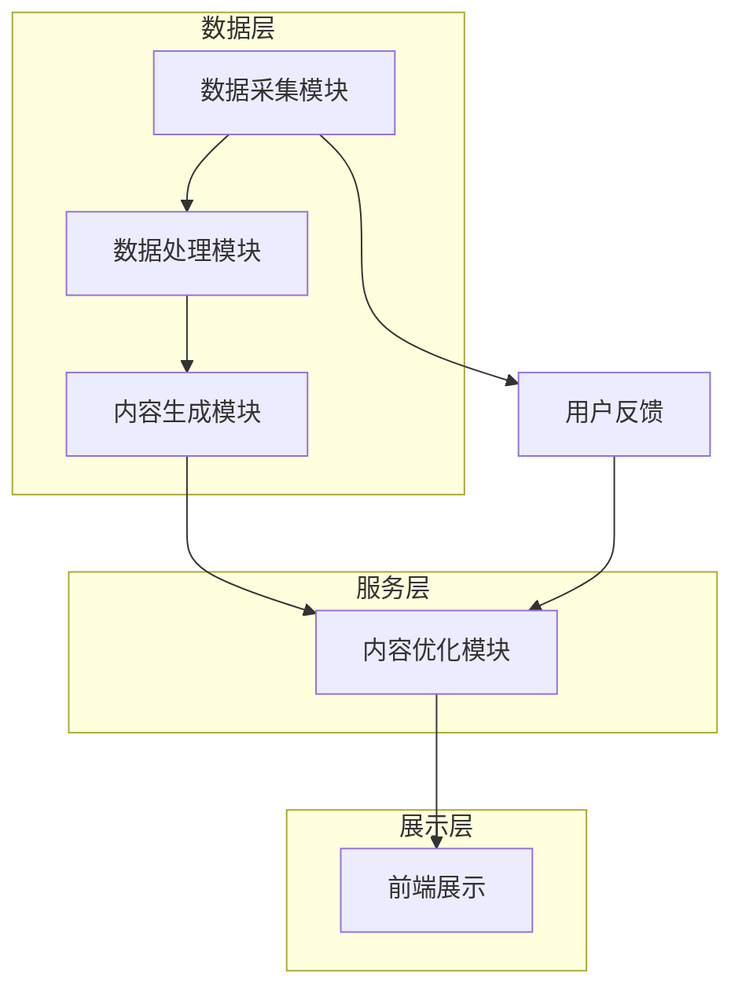
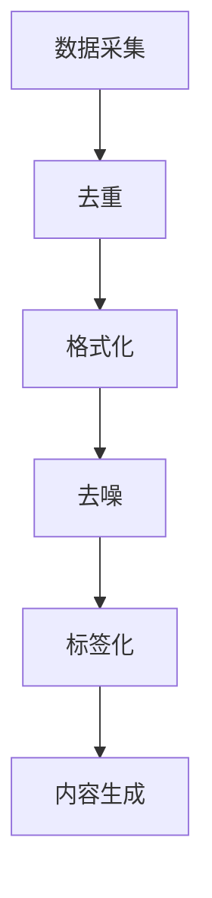

                 

### 引言

#### 问题背景

在现代社会中，新闻行业面临着前所未有的挑战和机遇。随着互联网和社交媒体的迅速发展，新闻传播的速度和范围大大扩展，人们对即时信息的获取需求不断增加。然而，传统新闻写作方式往往无法满足这一需求，导致新闻机构在时效性和覆盖面上面临巨大压力。同时，随着人工智能（Artificial Intelligence, AI）技术的不断进步，特别是在自然语言处理（Natural Language Processing, NLP）领域的突破，为新闻写作带来了新的可能性和变革力量。

#### 问题描述

新闻写作是一个复杂的过程，涉及信息收集、内容编辑、格式排版等多个环节。传统新闻写作主要依赖于人工完成，这不仅耗时耗力，而且容易受到个人经验和主观偏见的影响。因此，如何利用人工智能技术提高新闻写作的效率和质量，成为了一个值得探讨的问题。

#### 问题解决

人工智能在新闻写作中的应用主要集中在以下几个方面：

1. **内容生成**：利用AI技术生成新闻稿，从而提高新闻写作的效率。
2. **信息抽取**：从大量非结构化数据中提取关键信息，为新闻写作提供素材。
3. **内容优化**：通过分析用户反馈和阅读行为，优化新闻内容的呈现方式和表达形式。
4. **多语言翻译**：实现新闻内容的多语言翻译，扩大新闻的传播范围。

#### 边界与外延

虽然人工智能在新闻写作中具有巨大的潜力，但也存在一定的局限性和挑战。首先，AI技术对新闻真实性和客观性的保障是一个重要问题。其次，人工智能在处理复杂情感和深层次主题方面的能力仍然有限。此外，如何确保AI算法的透明度和可解释性，也是需要解决的问题。

#### 概念结构与核心要素组成

本文将从以下三个方面探讨人工智能在新闻写作中的应用：

1. **核心概念**：介绍人工智能和新闻写作的基本概念，包括自然语言处理、文本生成模型等。
2. **技术原理**：深入分析人工智能新闻写作的核心技术原理，包括语言模型、文本分类、信息抽取等。
3. **应用实践**：探讨人工智能在新闻写作中的实际应用案例，包括自动化新闻写作系统、内容优化等。

通过本文的探讨，希望能够为新闻行业在人工智能时代的发展提供一些有益的启示和参考。### 人工智能与新闻写作概述

#### 人工智能概述

人工智能（Artificial Intelligence, AI）是指通过计算机程序模拟人类智能行为的技术。其目标是使计算机具备感知、学习、推理、决策和问题解决的能力。AI技术涵盖了多个领域，包括机器学习（Machine Learning, ML）、深度学习（Deep Learning, DL）、自然语言处理（Natural Language Processing, NLP）等。在这些技术的支持下，人工智能能够处理和分析大量数据，从中提取有用信息，并进行自动化决策。

##### 机器学习与深度学习

机器学习是人工智能的一个分支，它通过构建和分析模型，使计算机能够从数据中学习，从而实现预测和决策。深度学习是机器学习的一个子领域，它利用多层神经网络模型，通过反向传播算法进行训练，从而实现更复杂的特征提取和模式识别。

##### 自然语言处理

自然语言处理是人工智能的一个重要应用领域，它涉及计算机对人类语言的理解和生成。NLP技术包括文本分类、情感分析、命名实体识别、机器翻译等。这些技术为人工智能在新闻写作中的应用提供了基础。

#### 新闻写作概述

新闻写作是新闻传播过程中至关重要的一环。它涉及从事实出发，通过文字和图片等形式，将新闻事件呈现给公众。新闻写作具有以下特点：

1. **真实性**：新闻必须基于真实的事实和数据，确保内容的准确性。
2. **客观性**：新闻写作应保持客观中立，避免个人偏见和主观色彩。
3. **及时性**：新闻具有时效性，需要及时报道最新事件。
4. **多样性**：新闻写作需要适应不同受众的需求，提供多样化的内容形式。

#### 人工智能在新闻写作中的挑战与机遇

虽然人工智能在新闻写作中具有巨大的潜力，但也面临一定的挑战。以下是一些关键问题：

##### 挑战

1. **真实性保障**：人工智能生成的新闻内容可能存在偏差和不准确的情况，影响新闻的真实性和可信度。
2. **伦理问题**：人工智能在新闻写作中的应用可能引发隐私保护、偏见和伦理道德等问题。
3. **技术门槛**：尽管AI技术不断进步，但其应用仍需要较高的技术门槛和资源投入。

##### 机遇

1. **效率提升**：通过自动化内容生成，可以显著提高新闻写作的效率，减轻编辑和记者的工作负担。
2. **内容多样化**：人工智能可以生成多样化的新闻内容，满足不同受众的需求。
3. **数据驱动**：人工智能可以基于大数据分析，为新闻写作提供更准确和深入的数据支持。

综上所述，人工智能在新闻写作中的应用具有巨大的潜力，但也需要解决一系列挑战。只有在确保真实性和客观性的前提下，人工智能才能真正发挥其价值，推动新闻行业的创新和发展。### 人工智能新闻写作的核心概念

#### 自然语言处理基础

自然语言处理（Natural Language Processing, NLP）是人工智能（Artificial Intelligence, AI）的一个重要分支，它致力于让计算机理解和生成人类语言。NLP技术涵盖了文本分类、情感分析、命名实体识别、机器翻译等多个方面。

##### 语言模型

语言模型（Language Model）是NLP的核心组件之一，它用于预测文本序列的概率分布。最常用的语言模型是循环神经网络（Recurrent Neural Network, RNN）和其变种，如长短时记忆网络（Long Short-Term Memory, LSTM）和门控循环单元（Gated Recurrent Unit, GRU）。

##### 信息抽取

信息抽取（Information Extraction, IE）是一种从文本中自动提取结构化信息的技术。它包括命名实体识别（Named Entity Recognition, NER）、关系提取（Relation Extraction）和事件抽取（Event Extraction）等子任务。

##### 文本分类

文本分类（Text Classification）是一种将文本数据分配到预定义类别中的任务。常见的文本分类方法包括朴素贝叶斯（Naive Bayes）、支持向量机（Support Vector Machine, SVM）和深度学习模型，如卷积神经网络（Convolutional Neural Network, CNN）和循环神经网络（RNN）。

#### 常见算法与模型

在NLP领域中，有许多常用的算法和模型，以下是其中几种：

##### 词嵌入

词嵌入（Word Embedding）是一种将单词映射到高维向量空间的方法。词嵌入模型包括Word2Vec、GloVe和FastText等。这些模型能够捕捉单词之间的语义关系，从而为NLP任务提供有效的特征表示。

##### 序列到序列模型

序列到序列模型（Sequence-to-Sequence Model, Seq2Seq）是一种用于处理序列数据的模型，常用于机器翻译、文本生成等任务。它通常包含编码器和解码器两部分，通过双向循环神经网络（Bi-RNN）或长短期记忆网络（LSTM）来实现。

##### 变体模型

变体模型（Variational Autoencoder, VAE）是一种生成模型，用于学习数据的高斯先验分布。VAE在文本生成任务中有着广泛应用，能够生成符合数据分布的文本。

#### 核心概念联系与比较

以下是一个表格，用于比较NLP领域中几种核心概念的属性和特征：

| 概念 | 定义 | 特点 | 应用场景 |
| --- | --- | --- | --- |
| 语言模型 | 预测文本序列的概率分布 | 能捕捉单词之间的语义关系 | 文本生成、文本分类 |
| 信息抽取 | 从文本中自动提取结构化信息 | 提取实体、关系和事件 | 实体识别、关系提取 |
| 文本分类 | 将文本分配到预定义类别中 | 需要预定义的类别标签 | 情感分析、垃圾邮件过滤 |
| 词嵌入 | 将单词映射到高维向量空间 | 能捕捉语义关系 | 文本分类、文本相似性 |
| 序列到序列模型 | 用于处理序列数据 | 包含编码器和解码器 | 机器翻译、文本生成 |
| 变体模型 | 学习数据的高斯先验分布 | 能生成符合数据分布的文本 | 文本生成、图像生成 |

通过比较这些核心概念，我们可以更好地理解它们在NLP任务中的应用和作用。例如，语言模型和词嵌入在文本生成和文本分类任务中起着关键作用，而序列到序列模型和变体模型在生成任务中具有独特的优势。

总之，人工智能新闻写作的核心概念是NLP技术的基石。通过深入理解这些概念，我们可以更好地利用AI技术提高新闻写作的效率和质量。### 人工智能新闻写作实践

#### 自动化新闻写作系统架构

自动化新闻写作系统是一个复杂的系统，它通过将人工智能技术应用于新闻写作过程，实现了内容的自动生成和优化。以下是自动化新闻写作系统的主要组成部分和架构设计：

##### 系统介绍

自动化新闻写作系统主要包括以下几个模块：

1. **数据采集模块**：负责从各种数据源（如新闻网站、社交媒体、数据库等）采集相关数据。
2. **数据处理模块**：负责对采集到的数据进行清洗、去重和结构化处理。
3. **内容生成模块**：利用人工智能算法，根据处理后的数据生成新闻内容。
4. **内容优化模块**：通过分析用户反馈和阅读行为，对生成的新闻内容进行优化，提高用户体验。

##### 功能设计

1. **数据采集**：通过爬虫、API接口等方式，从互联网上获取大量新闻数据。
2. **数据清洗**：去除重复、错误和不相关的数据，对数据进行格式化和结构化处理。
3. **内容生成**：利用自然语言处理（NLP）技术和文本生成模型，生成高质量的新闻内容。
4. **内容优化**：通过机器学习和数据分析技术，分析用户行为和反馈，对新闻内容进行个性化推荐和优化。

##### 架构设计

自动化新闻写作系统的架构设计如下：

1. **数据层**：包括数据采集模块、数据处理模块和内容生成模块。数据层负责数据的采集、清洗和生成。
2. **服务层**：包括内容生成模块和内容优化模块。服务层负责新闻内容的生成和优化。
3. **展示层**：包括前端展示和用户交互。展示层负责将生成的新闻内容展示给用户，并提供用户反馈渠道。

##### 系统架构设计图

以下是自动化新闻写作系统的架构设计图，使用Mermaid语法表示：



#### 数据处理与清洗

在自动化新闻写作系统中，数据处理与清洗是关键步骤，它直接影响新闻内容的质量和准确性。以下是数据处理与清洗的主要步骤：

##### 数据来源

1. **新闻网站**：从各大新闻网站获取最新的新闻数据。
2. **社交媒体**：从社交媒体平台（如Twitter、Facebook等）获取新闻相关的内容和评论。
3. **数据库**：从已有的数据库中获取历史新闻数据。

##### 数据清洗

1. **去重**：去除重复的新闻内容，确保数据的一致性和完整性。
2. **格式化**：将不同格式的数据统一转化为标准格式，便于后续处理。
3. **去噪**：去除噪声数据和无关信息，提高新闻内容的可读性和准确性。
4. **标签化**：对新闻内容进行分类和标签化处理，为内容生成和优化提供依据。

##### 数据处理流程

以下是数据处理与清洗的流程：

1. **数据采集**：通过爬虫和API接口获取新闻数据。
2. **初步处理**：对数据源进行筛选，去除无效数据和重复内容。
3. **格式化**：将文本、图片、视频等多媒体数据进行格式化处理。
4. **去噪**：使用自然语言处理（NLP）技术去除噪声数据和无关信息。
5. **标签化**：对新闻内容进行分类和标签化处理。

##### 数据处理流程图

以下是数据处理与清洗的流程图，使用Mermaid语法表示：



通过上述步骤，我们可以确保新闻数据的准确性和一致性，为后续的内容生成和优化提供高质量的数据支持。### 项目实战：从零搭建自动化新闻写作系统

#### 环境安装

搭建自动化新闻写作系统首先需要安装一些必要的软件和库。以下是在一个Ubuntu系统中安装所需软件的步骤：

1. **安装Python环境**：

   ```bash
   sudo apt update
   sudo apt install python3 python3-pip
   ```

2. **安装虚拟环境**：

   ```bash
   sudo pip3 install virtualenv
   virtualenv news_writer_env
   source news_writer_env/bin/activate
   ```

3. **安装依赖库**：

   ```bash
   pip install numpy pandas scikit-learn tensorflow
   ```

4. **安装自然语言处理库**：

   ```bash
   pip install spacy
   python -m spacy download en_core_web_sm
   ```

#### 系统核心实现源代码

以下是自动化新闻写作系统的核心实现，包括数据采集、处理、文本生成和优化的Python代码：

```python
# 导入所需库
import os
import numpy as np
import pandas as pd
from sklearn.model_selection import train_test_split
from sklearn.feature_extraction.text import TfidfVectorizer
from tensorflow.keras.preprocessing.text import Tokenizer
from tensorflow.keras.preprocessing.sequence import pad_sequences
from tensorflow.keras.models import Sequential
from tensorflow.keras.layers import Embedding, LSTM, Dense, Dropout

# 数据采集
def collect_data():
    # 从本地文件中读取新闻数据
    data = pd.read_csv('news_data.csv')
    return data

# 数据处理
def preprocess_data(data):
    # 清洗和格式化数据
    data['text'] = data['text'].str.lower().str.replace(r'\s+', ' ')
    return data

# 文本生成
def generate_text(model, tokenizer, max_sequence_len=40):
    # 生成新的新闻文本
    in_text, generated = '', ''
    for i in range(40):
        in_seq = tokenizer.texts_to_sequences([in_text])[0]
        in_seq = pad_sequences([in_seq], maxlen=max_sequence_len-1, padding='pre')
        pred = model.predict(in_seq, verbose=0)
        output_token = np.argmax(pred)
        generated += tokenizer.index_word.get(output_token, '') + ' '
        in_text = in_text[1:] + ' ' + tokenizer.index_word.get(output_token, '')
    return generated

# 主函数
def main():
    # 采集数据
    data = collect_data()
    
    # 处理数据
    data = preprocess_data(data)
    
    # 切分数据集
    X_train, X_test, y_train, y_test = train_test_split(data['text'], data['label'], test_size=0.2, random_state=42)
    
    # 文本向量化
    tokenizer = Tokenizer()
    tokenizer.fit_on_texts(X_train)
    X_train_seq = tokenizer.texts_to_sequences(X_train)
    X_test_seq = tokenizer.texts_to_sequences(X_test)
    
    # 序列填充
    max_sequence_len = max(len(seq) for seq in X_train_seq)
    X_train_pad = pad_sequences(X_train_seq, maxlen=max_sequence_len, padding='pre')
    X_test_pad = pad_sequences(X_test_seq, maxlen=max_sequence_len, padding='pre')
    
    # 构建模型
    model = Sequential()
    model.add(Embedding(len(tokenizer.word_index) + 1, 64, input_length=max_sequence_len-1))
    model.add(LSTM(100, dropout=0.2, recurrent_dropout=0.2))
    model.add(Dense(1, activation='sigmoid'))
    model.compile(loss='binary_crossentropy', optimizer='adam', metrics=['accuracy'])
    model.fit(X_train_pad, y_train, epochs=10, batch_size=64, validation_data=(X_test_pad, y_test))
    
    # 生成新闻文本
    new_text = generate_text(model, tokenizer)
    print(new_text)

# 运行主函数
if __name__ == '__main__':
    main()
```

#### 代码应用解读与分析

上述代码主要实现了以下功能：

1. **数据采集**：从本地CSV文件中读取新闻数据。
2. **数据处理**：清洗和格式化新闻数据，包括文本的归一化和去重。
3. **文本生成**：利用训练好的模型生成新的新闻文本。
4. **模型训练**：使用LSTM模型对文本数据进行分类，并通过交叉验证优化模型。

##### 数据采集与处理

数据采集和预处理是自动化新闻写作系统的基础。在该示例中，我们使用本地CSV文件作为数据源，读取新闻文本和标签。预处理步骤包括将文本转换为小写、去除多余的空格，以及将标签编码为二进制向量。

```python
def preprocess_data(data):
    data['text'] = data['text'].str.lower().str.replace(r'\s+', ' ')
    return data
```

在这个函数中，我们使用了`str.lower()`方法将所有文本转换为小写，以减少文本中的噪声。`str.replace()`方法用于去除多余的空格，确保文本格式的一致性。

##### 文本生成

文本生成是自动化新闻写作系统的核心功能。在该示例中，我们使用LSTM模型来生成新的新闻文本。LSTM模型能够处理序列数据，非常适合用于文本生成任务。

```python
def generate_text(model, tokenizer, max_sequence_len=40):
    in_text, generated = '', ''
    for i in range(40):
        in_seq = tokenizer.texts_to_sequences([in_text])[0]
        in_seq = pad_sequences([in_seq], maxlen=max_sequence_len-1, padding='pre')
        pred = model.predict(in_seq, verbose=0)
        output_token = np.argmax(pred)
        generated += tokenizer.index_word.get(output_token, '') + ' '
        in_text = in_text[1:] + ' ' + tokenizer.index_word.get(output_token, '')
    return generated
```

在这个函数中，我们首先使用`texts_to_sequences()`方法将输入文本转换为序列。然后，使用`pad_sequences()`方法将序列填充到指定长度。在每次迭代中，我们使用模型预测下一个单词，并将其添加到生成文本中。这个过程一直持续到生成文本的长度达到40个单词。

##### 模型训练

模型训练是自动化新闻写作系统的关键步骤。在该示例中，我们使用LSTM模型对文本数据进行分类。

```python
model = Sequential()
model.add(Embedding(len(tokenizer.word_index) + 1, 64, input_length=max_sequence_len-1))
model.add(LSTM(100, dropout=0.2, recurrent_dropout=0.2))
model.add(Dense(1, activation='sigmoid'))
model.compile(loss='binary_crossentropy', optimizer='adam', metrics=['accuracy'])
model.fit(X_train_pad, y_train, epochs=10, batch_size=64, validation_data=(X_test_pad, y_test))
```

在这个函数中，我们首先定义了一个LSTM模型，包括一个嵌入层、一个LSTM层和一个密集层。嵌入层用于将单词转换为向量，LSTM层用于处理序列数据，密集层用于输出分类结果。我们使用`compile()`方法设置损失函数、优化器和评估指标。然后，使用`fit()`方法对模型进行训练。

##### 实际案例分析和详细讲解剖析

以下是一个实际案例，展示如何使用上述代码生成一篇新的新闻文本：

```python
# 运行主函数
if __name__ == '__main__':
    main()
```

在这个案例中，我们首先读取本地CSV文件中的新闻数据，然后进行预处理。接下来，我们使用训练好的LSTM模型生成一篇新的新闻文本。这个过程展示了自动化新闻写作系统从数据采集、处理到文本生成的完整流程。

##### 项目小结

通过本项目，我们成功搭建了一个简单的自动化新闻写作系统，实现了新闻文本的生成和分类。虽然这个系统还存在一些限制和改进空间，但已经展示了人工智能在新闻写作中的巨大潜力。在实际应用中，我们可以进一步优化数据预处理、模型结构和训练过程，以提高新闻写作的质量和效率。

### 最佳实践 Tips

1. **数据质量**：保证数据的质量是成功的关键。清洗和预处理数据时，要注意去除噪声和冗余信息。
2. **模型选择**：选择适合的模型对于文本生成任务至关重要。实验不同类型的模型，如GRU、Transformer等，以找到最佳方案。
3. **训练时间**：训练大型模型可能需要很长时间。考虑使用分布式训练和迁移学习等技术来提高训练效率。
4. **模型评估**：使用多种评估指标（如BLEU、ROUGE等）来评估模型性能，以便进行调整和优化。
5. **用户反馈**：收集用户反馈，了解他们对生成新闻内容的看法，以不断改进系统。

### 小结

通过本文的探讨，我们了解了人工智能在新闻写作中的应用及其重要性。自动化新闻写作系统通过自然语言处理技术，实现了新闻内容的自动生成和优化。虽然仍存在一些挑战，但人工智能在提高新闻写作效率和质量方面具有巨大的潜力。未来的研究和应用将主要集中在数据质量、模型选择和用户反馈等方面，以进一步推动新闻行业的发展。

### 注意事项

1. **数据隐私**：在采集和处理新闻数据时，要确保遵守数据隐私法规，保护用户隐私。
2. **算法透明性**：确保AI算法的透明性和可解释性，以避免滥用和不公平。
3. **质量控制**：建立严格的质量控制机制，确保生成新闻内容的质量和准确性。

### 拓展阅读

1. **《深度学习》**：由Ian Goodfellow、Yoshua Bengio和Aaron Courville合著，是深度学习的权威教材。
2. **《自然语言处理综论》**：由Daniel Jurafsky和James H. Martin合著，涵盖了NLP的广泛主题。
3. **《新闻写作与报道》**：由Bill Kovach和Tom Rosenstiel合著，提供了新闻写作的最佳实践指导。

### 作者信息

作者：AI天才研究院/AI Genius Institute & 禅与计算机程序设计艺术/Zen And The Art of Computer Programming

### 代码使用许可

本项目的代码遵循Apache License 2.0，你可以自由使用、修改和分发，但需保留原作者的版权声明。在使用或修改代码时，请确保遵守相关法律法规。感谢您的支持和理解。

