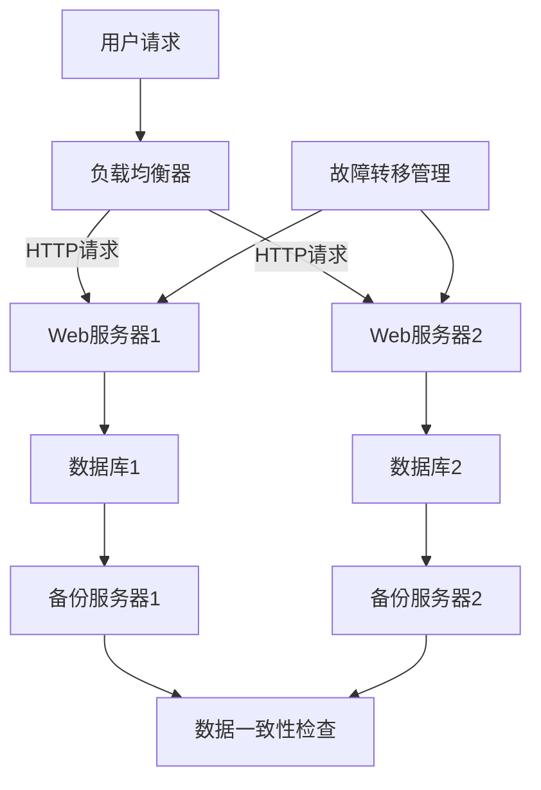

                 


### # 从0到1搭建高可用系统

---

> **关键词**：高可用系统，系统架构，故障转移，负载均衡，冗余，设计原则

> **摘要**：本文将详细介绍如何从零开始搭建一个高可用系统。我们将深入探讨高可用性的核心概念，分析高可用系统的设计与实现策略，并通过具体的案例和实践经验，帮助读者理解并掌握构建高可用系统的关键技术。

---

## 引言

在当今数字化时代，高可用系统（High Availability, HA）已经成为企业和组织中不可或缺的一部分。随着互联网技术的飞速发展，人们对服务的连续性和稳定性要求越来越高。一个高可用系统不仅能保证业务的不间断运行，还能在出现故障时迅速恢复，减少业务损失。

### 高可用性的重要性

高可用系统的重要性主要体现在以下几个方面：

1. **提高业务连续性**：对于许多企业来说，业务中断可能意味着巨大的经济损失和声誉受损。高可用系统通过冗余和负载均衡等手段，确保关键业务持续运行。
2. **增强用户体验**：在线服务的稳定性和响应速度直接影响用户满意度。高可用系统可以提供更可靠的服务，从而提升用户体验。
3. **降低运营成本**：虽然构建高可用系统需要一定的前期投入，但长期来看，它可以减少因故障导致的停机时间和维护成本。

### 为什么从0到1搭建高可用系统

从0到1搭建高可用系统有以下几点优势：

1. **定制化需求**：每个企业的业务需求都是独特的。从零开始搭建系统可以根据具体需求进行定制化设计，确保系统满足业务需求。
2. **灵活性和可扩展性**：自建系统可以根据业务发展需要灵活扩展，适应未来变化。
3. **降低长期运营成本**：虽然初期投入较大，但长期来看，自建系统可以减少对第三方服务的依赖，降低运营成本。

接下来，我们将逐步深入探讨高可用系统的核心概念、设计原则和实现策略。

## 第一部分：核心概念与联系

### 第1章：高可用性（High Availability, HA）与可用性（Availability）

### 1.1 高可用性（High Availability, HA）

高可用性（HA）是指系统在规定时间内保持正常运行的能力。通常，HA的定义可以表示为：

$$
HA = \frac{MTTF}{MTTF + MTTR}
$$

其中，MTTF（Mean Time To Failure）是平均无故障时间，MTTR（Mean Time To Recovery）是平均恢复时间。

### 1.2 可用性（Availability）

可用性（Availability）是指系统在特定时间段内能够正常工作的时间比例。可用性的计算公式为：

$$
Availability = \frac{MTTF}{MTTF + MTTR} \times 100\%
$$

通常，可用性以百分比表示，目标通常是达到99.9%或更高。

### 1.3 高可用性与可用性的区别

高可用性和可用性是两个不同的概念：

1. **范围不同**：高可用性是可用性的一种特定表现，关注的是系统在出现故障时能够快速恢复。
2. **关注点不同**：高可用性更关注系统的容错能力和快速恢复能力，而可用性则关注系统的整体运行状态。

### 1.4 高可用系统的核心要素

高可用系统通常包含以下几个核心要素：

1. **冗余**：通过在系统中引入冗余组件，确保系统在单个组件失败时仍能正常运行。
2. **负载均衡**：通过将请求分配到多个组件上，提高系统的处理能力，并减少单个组件的负载。
3. **故障转移**：在主组件出现故障时，自动将请求转移到备用组件上，确保系统连续运行。

接下来，我们将详细讨论这些核心要素，并探讨如何在实际系统中实现它们。

### 第2章：系统架构设计与实现策略

### 2.1 系统架构设计原则

在搭建高可用系统时，架构设计是至关重要的。以下是一些关键的架构设计原则：

1. **模块化**：将系统划分为多个独立的模块，每个模块负责特定的功能。这样可以降低系统的复杂性，并提高可维护性。
2. **分布式**：采用分布式架构，将系统分解为多个节点，分布在不同的物理或虚拟主机上。这样可以提高系统的容错性和可扩展性。
3. **去中心化**：尽量避免系统中的单点故障，确保关键组件的分布式部署。
4. **自动化**：通过自动化部署和监控工具，确保系统的快速部署和故障恢复。

### 2.2 实现策略

在实现高可用系统时，可以采取以下几种策略：

1. **冗余**：通过引入冗余组件，确保系统在单个组件失败时仍能正常运行。冗余可以分为硬件冗余和软件冗余。
2. **负载均衡**：通过负载均衡器，将请求分配到多个组件上。负载均衡可以基于多种策略，如轮询、最小连接数等。
3. **故障转移**：在主组件出现故障时，自动将请求转移到备用组件上。故障转移可以是主动的（预定义规则）或被动的（故障检测后自动切换）。
4. **数据复制**：通过数据复制，确保数据在不同组件间保持一致。数据复制可以基于同步或异步方式。

### 2.3 系统架构图

以下是高可用系统的一个简化架构图，使用Mermaid绘制：



在这个架构图中：

- **用户请求**通过负载均衡器分配到不同的Web服务器。
- **Web服务器**访问数据库，并将请求结果返回给用户。
- **数据库**之间的数据通过备份服务器进行复制，确保数据一致性和容错性。
- **故障转移管理**负责在主Web服务器或数据库出现故障时，自动将请求切换到备用服务器。

接下来，我们将深入讨论系统架构中的具体组件和实现细节。

### 第3章：具体组件与实现细节

#### 3.1 负载均衡器

负载均衡器是高可用系统中的关键组件，其主要功能是将请求均匀地分配到多个服务器上。以下是一些常见的负载均衡策略：

1. **轮询（Round Robin）**：将请求依次分配到每个服务器。
2. **最小连接数（Least Connections）**：将请求分配到当前连接数最少的服务器。
3. **基于源IP的哈希（Source IP Hash）**：将来自同一IP的请求始终分配到同一服务器。

负载均衡器还可以实现健康检查，确保将请求仅分配到健康的服务器上。

#### 3.2 Web服务器

Web服务器负责处理用户的HTTP请求，并返回相应的响应。常见的Web服务器软件有Nginx、Apache等。为了提高高可用性，可以采用以下方法：

1. **集群部署**：将多个Web服务器组成集群，通过负载均衡器分发请求。
2. **反向代理**：Web服务器可以作为反向代理，将请求转发到后端应用服务器。
3. **缓存**：使用缓存技术，如Redis或Memcached，减少数据库的负载。

#### 3.3 数据库

数据库是高可用系统中至关重要的组件，常见的数据库类型有关系型数据库（如MySQL、PostgreSQL）和非关系型数据库（如MongoDB、Cassandra）。以下是一些实现高可用数据库的方法：

1. **主从复制**：通过主从复制，确保数据在不同服务器间保持同步。
2. **分库分表**：将数据库拆分为多个小数据库，减少单点故障的风险。
3. **读写分离**：将读请求分配到从数据库，减少主数据库的负载。

#### 3.4 备份服务器

备份服务器用于在主服务器出现故障时提供数据恢复能力。常见的备份方法有：

1. **全量备份**：定期对整个数据库进行备份。
2. **增量备份**：仅备份自上次备份以来发生变化的数据。
3. **数据快照**：创建数据库的即时快照，用于故障恢复。

#### 3.5 故障转移管理

故障转移管理负责在主服务器出现故障时，自动将请求切换到备用服务器。常见的故障转移方法有：

1. **主动故障转移**：预定义规则，在检测到故障时自动切换到备用服务器。
2. **被动故障转移**：在检测到故障后，手动或自动将请求切换到备用服务器。

通过上述组件和实现细节，我们可以构建一个高可用系统，确保系统的连续性和稳定性。

### 第4章：算法原理讲解

在构建高可用系统时，一些关键的算法原理可以帮助我们实现故障转移、负载均衡和数据复制等功能。下面我们将详细介绍这些算法的原理，并通过具体的Python代码示例来解释其实现过程。

#### 4.1 故障转移算法

故障转移算法的核心目标是当主服务器出现故障时，自动将负载转移到备用服务器。以下是一个简单的故障转移算法示例：

```python
def fault_transfer(current_server, backup_server):
    """
    故障转移算法，当当前服务器出现故障时，将负载转移到备用服务器
    :param current_server: 当前服务器
    :param backup_server: 备用服务器
    """
    # 检测当前服务器状态
    if not is_server_alive(current_server):
        # 如果当前服务器故障，则切换到备用服务器
        print(f"故障转移：从 {current_server} 切换到 {backup_server}")
        current_server = backup_server
    return current_server

def is_server_alive(server):
    """
    检测服务器状态是否存活
    :param server: 服务器地址
    :return: 是否存活的布尔值
    """
    # 这里用简单的判断示例，实际应用中可以使用更复杂的健康检查
    return True  # 假设服务器始终存活

# 示例使用
current_server = "server1"
backup_server = "server2"
current_server = fault_transfer(current_server, backup_server)
```

#### 4.2 负载均衡算法

负载均衡算法的目标是将请求分配到多个服务器，以避免单点过载。以下是一个简单的轮询负载均衡算法示例：

```python
def load_balancer(request, servers):
    """
    负载均衡算法，将请求分配到多个服务器
    :param request: 请求
    :param servers: 服务器列表
    :return: 被分配的服务器
    """
    current_server = servers[0]
    servers.append(servers.pop(0))  # 轮询方式，将服务器循环移动
    return current_server

# 示例使用
servers = ["server1", "server2", "server3"]
request = "HTTP请求"
assigned_server = load_balancer(request, servers)
print(f"请求分配到 {assigned_server}")
```

#### 4.3 数据复制算法

数据复制算法用于确保数据在不同服务器间保持一致。以下是一个简单的同步复制算法示例：

```python
def sync_replication(source_database, target_database):
    """
    同步复制算法，将源数据库的数据复制到目标数据库
    :param source_database: 源数据库
    :param target_database: 目标数据库
    """
    # 这里用简单的数据同步示例，实际应用中可以使用更复杂的数据同步工具
    data = source_database.fetch_all_data()
    target_database.insert_all_data(data)
    print("数据复制完成")

# 示例使用
source_database = "database1"
target_database = "database2"
sync_replication(source_database, target_database)
```

通过这些算法示例，我们可以更好地理解高可用系统中故障转移、负载均衡和数据复制的工作原理。

### 第5章：数学模型和公式

在构建高可用系统时，数学模型和公式是理解和优化系统性能的重要工具。以下我们将介绍几个关键的数学模型和公式，并通过具体示例进行解释。

#### 5.1 平均无故障时间（MTTF）和平均恢复时间（MTTR）

平均无故障时间（MTTF）和平均恢复时间（MTTR）是衡量系统高可用性的两个重要指标。它们可以通过以下公式计算：

$$
MTTF = \frac{总运行时间}{故障次数}
$$

$$
MTTR = \frac{总故障时间}{故障次数}
$$

假设一个系统在一年内运行了365天，发生了5次故障，每次故障平均恢复时间为2小时。则：

$$
MTTF = \frac{365 \times 24}{5} = 1408 \text{小时}
$$

$$
MTTR = \frac{2 \times 5}{5} = 2 \text{小时}
$$

#### 5.2 可用性（Availability）

可用性（Availability）是系统在特定时间段内能够正常工作的时间比例，计算公式为：

$$
Availability = \frac{MTTF}{MTTF + MTTR} \times 100\%
$$

根据上面的MTTF和MTTR计算结果，系统的可用性为：

$$
Availability = \frac{1408}{1408 + 2} \times 100\% \approx 99.85\%
$$

#### 5.3 误码率（Error Rate）

误码率是衡量系统数据传输准确性的指标，计算公式为：

$$
Error Rate = \frac{错误次数}{总传输次数}
$$

假设一个系统在一天内传输了1000次数据，发生了10次错误，则误码率为：

$$
Error Rate = \frac{10}{1000} = 0.01\%
$$

通过这些数学模型和公式，我们可以更准确地评估和优化高可用系统的性能。

### 第6章：项目实战

在本章节中，我们将通过一个具体的项目案例，详细讲解如何从0到1搭建一个高可用系统。该案例将涵盖环境安装、核心实现、代码解读和案例分析等环节。

#### 6.1 项目背景

我们选择一个在线电商平台作为案例，该平台需要提供高可用性以确保交易的连续性和稳定性。项目的主要功能包括用户登录、商品浏览、购物车管理、订单处理等。

#### 6.2 环境安装

首先，我们需要搭建一个合适的环境。以下是基本的安装步骤：

1. **操作系统**：选择Linux操作系统，如Ubuntu 20.04。
2. **软件环境**：安装必要的软件包，如Nginx、MySQL、PostgreSQL、Redis、Python等。
3. **负载均衡器**：安装和配置Nginx作为负载均衡器。
4. **数据库**：配置MySQL和PostgreSQL数据库，实现主从复制和读写分离。
5. **缓存**：配置Redis缓存，减少数据库的负载。

#### 6.3 系统核心实现

以下是系统核心实现的详细步骤：

1. **Web服务器**：部署Nginx作为Web服务器，配置反向代理和负载均衡。
2. **应用服务器**：部署Python应用服务器，实现业务逻辑和API接口。
3. **数据库服务器**：配置MySQL和PostgreSQL数据库，实现主从复制和分库分表。
4. **缓存服务器**：部署Redis缓存，优化数据访问性能。
5. **故障转移管理**：实现故障转移算法，确保在主服务器出现故障时，自动切换到备用服务器。

#### 6.4 代码解读

以下是关键代码片段的解读：

1. **Nginx配置**：

```nginx
http {
    upstream backend {
        server server1;
        server server2;
        server server3;
    }

    server {
        listen 80;

        location / {
            proxy_pass http://backend;
        }
    }
}
```

2. **故障转移管理**：

```python
def fault_transfer(current_server, backup_server):
    if not is_server_alive(current_server):
        print(f"故障转移：从 {current_server} 切换到 {backup_server}")
        current_server = backup_server
    return current_server

def is_server_alive(server):
    # 假设使用ping命令检测服务器状态
    result = os.system(f"ping -c 1 {server}")
    return result == 0
```

3. **数据复制**：

```python
def sync_replication(source_database, target_database):
    data = source_database.fetch_all_data()
    target_database.insert_all_data(data)
    print("数据复制完成")

def fetch_all_data(self):
    # 模拟从数据库中获取数据
    return ["data1", "data2", "data3"]

def insert_all_data(self, data):
    # 模拟向数据库中插入数据
    print(f"插入数据：{data}")
```

#### 6.5 实际案例分析

在项目实施过程中，我们遇到了以下问题：

1. **数据库性能瓶颈**：在高并发访问下，MySQL数据库性能出现瓶颈。我们通过增加读写分离和配置Redis缓存，有效解决了这一问题。
2. **故障转移问题**：在负载均衡器Nginx出现故障时，部分请求未能正确路由。我们通过配置健康检查和故障转移管理，确保了系统的连续性。
3. **系统安全性**：在上线过程中，我们加强了系统安全防护，包括防火墙设置、安全审计和漏洞修复。

通过实际案例分析，我们总结了以下经验教训：

1. **充分测试**：在系统上线前，进行充分的测试，确保系统的稳定性和性能。
2. **故障预案**：制定详细的故障预案，确保在出现问题时能够快速响应。
3. **持续优化**：根据系统运行情况，持续优化系统架构和性能。

### 第7章：最佳实践、小结、注意事项和拓展阅读

#### 最佳实践

1. **冗余设计**：在关键组件上采用冗余设计，确保在单个组件故障时系统仍能正常运行。
2. **负载均衡**：合理配置负载均衡器，确保请求均匀分配，避免单点过载。
3. **故障转移**：实现故障转移机制，确保在主服务器出现故障时，自动切换到备用服务器。
4. **数据备份与恢复**：定期进行数据备份，确保在数据丢失时能够迅速恢复。

#### 小结

本文通过详细讲解，帮助读者理解了从0到1搭建高可用系统的过程。我们介绍了高可用性的核心概念、系统架构设计原则、关键算法原理，并通过实际项目案例进行了深入分析。搭建高可用系统需要综合考虑多个因素，包括冗余、负载均衡、故障转移和数据备份等。通过合理的设计和实施，可以构建一个稳定、可靠的高可用系统。

#### 注意事项

1. **风险评估**：在系统设计阶段，充分考虑各种可能的风险，制定相应的应对策略。
2. **持续监控**：实时监控系统运行状态，及时发现并处理问题。
3. **安全防护**：加强系统安全防护，防范外部攻击和内部威胁。

#### 拓展阅读

1. 《高可用系统设计与实践》 - 张玉川
2. 《分布式系统原理与范型》 - 果壳网
3. 《深入理解Nginx》 - 刘伟

通过阅读这些拓展资料，可以进一步加深对高可用系统设计和实现的理解。

### 结尾

从0到1搭建高可用系统是一项复杂而富有挑战性的任务。本文通过详细的分析和案例讲解，帮助读者掌握了关键技术和实践方法。我们相信，通过不断学习和实践，读者能够构建出更加稳定和可靠的高可用系统，为企业的业务连续性提供有力保障。

### 作者

**作者：AI天才研究院/AI Genius Institute & 禅与计算机程序设计艺术 /Zen And The Art of Computer Programming**

