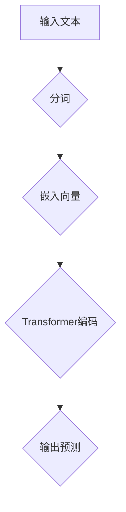
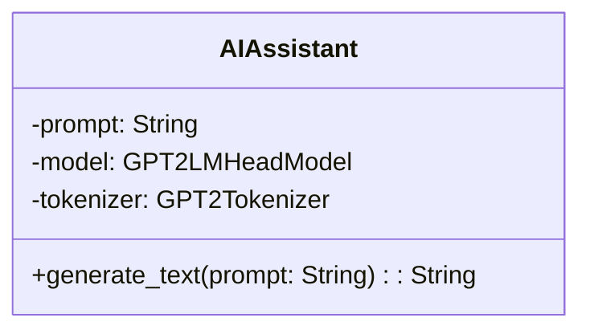
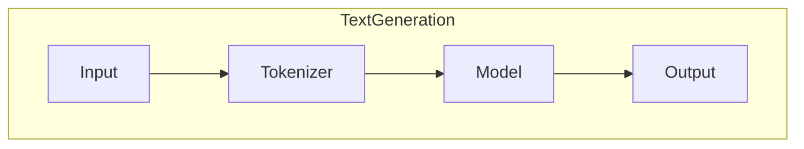

                 

# 从GPT到AGI：提示词编程的演进之路

## 关键词

- GPT
- 通用人工智能（AGI）
- 提示词编程
- 预训练模型
- 自然语言处理
- 计算机视觉
- 知识图谱

## 摘要

本文将深入探讨人工智能（AI）领域中的关键概念和技术的演进过程，重点关注从GPT（Generative Pre-trained Transformer）到通用人工智能（AGI）的过渡，以及在此过程中提示词编程的重要性。文章首先介绍GPT的基本原理和其在自然语言处理（NLP）中的应用，然后讨论通用人工智能的愿景和挑战。接着，文章详细解析提示词编程的概念、原理和应用场景，最后通过实战案例展示如何利用提示词编程实现AI项目。

## 第一部分： 引言与背景

### 1. 引言

随着人工智能技术的快速发展，从GPT到AGI的演进成为当前研究的热点。GPT是自然语言处理（NLP）领域的一个重要里程碑，而AGI则代表了人工智能的最终目标。本文旨在探讨这一演进过程中的关键技术和方法，帮助读者深入了解提示词编程在AI发展中的重要作用。

### 1.1 问题背景

人工智能的发展经历了从符号主义、连接主义到现代深度学习的过程。GPT的出现标志着NLP领域的重大突破，而AGI则代表了人工智能的最终目标。在这一演进过程中，提示词编程成为连接GPT与AGI的重要桥梁。

### 1.2 问题描述

尽管GPT模型在NLP任务中取得了显著的成就，但如何将GPT的能力拓展到更广泛的任务和应用场景，实现AGI的目标，仍然是一个挑战。提示词编程作为一种新兴的方法，提供了实现这一目标的可能途径。

### 1.3 问题解决

本文将详细介绍提示词编程的原理、方法和应用，帮助读者掌握这一技术，并在AI发展中发挥重要作用。通过学习本文，读者将能够：

- 理解GPT和AGI的基本概念和演进过程。
- 掌握提示词编程的核心技术和应用场景。
- 学习如何将提示词编程应用于实际的AI项目中。

### 1.4 边界与外延

本文主要关注提示词编程在AI领域的应用，包括自然语言处理、计算机视觉、知识图谱等。同时，本文也将探讨提示词编程在跨领域应用中的潜力。

### 1.5 概念结构与核心要素组成

- **提示词编程**：一种利用预训练模型生成提示词，指导模型完成特定任务的方法。
- **GPT**：一种基于Transformer架构的预训练模型，用于自然语言处理任务。
- **AGI**：通用人工智能，指具有人类智能的全面能力的人工智能系统。

## 第二部分： 提示词编程技术详解

### 2.1 提示词编程的基本原理

#### 2.1.1 提示词的定义与生成

提示词是一组用于引导预训练模型完成特定任务的文本。生成提示词的方法包括基于规则生成、基于语义相似性生成和基于预训练模型生成等。

#### 2.1.2 提示词的作用与效果

提示词能够有效提高预训练模型在特定任务上的表现，减少对大量领域数据的依赖，提高模型的泛化能力。

### 2.2 提示词编程的核心技术

#### 2.2.1 对话式提示词编程

对话式提示词编程是一种基于对话的提示词生成方法，通过交互式方式引导模型完成复杂任务。

#### 2.2.2 任务导向的提示词编程

任务导向的提示词编程通过设计特定的任务场景和目标，引导模型完成具体任务。

#### 2.2.3 多模态提示词编程

多模态提示词编程结合了文本、图像、声音等多种数据类型，实现跨模态的任务。

### 2.3 提示词编程的应用场景

#### 2.3.1 自然语言处理

在自然语言处理任务中，提示词编程可以用于文本生成、文本分类、情感分析等。

#### 2.3.2 计算机视觉

在计算机视觉任务中，提示词编程可以用于图像分类、目标检测、图像生成等。

#### 2.3.3 知识图谱

在知识图谱领域，提示词编程可以用于实体识别、关系提取、图谱生成等。

### 2.4 提示词编程的优势与挑战

#### 2.4.1 提示词编程的优势

- 减少对大量领域数据的依赖
- 提高模型的泛化能力
- 易于实现和部署

#### 2.4.2 提示词编程的挑战

- 提示词的设计与优化
- 对模型能力的依赖
- 跨领域的应用挑战

## 第三部分： 从GPT到AGI的演进

### 3.1 GPT的发展历程

#### 3.1.1 GPT的诞生

#### 3.1.2 GPT-2与GPT-3的演进

#### 3.1.3 GPT在自然语言处理中的应用

### 3.2 AGI的愿景与挑战

#### 3.2.1 AGI的定义与目标

#### 3.2.2 AGI的关键技术

#### 3.2.3 AGI的挑战与前景

### 3.3 提示词编程在AGI中的作用

#### 3.3.1 提示词编程与AGI的关系

#### 3.3.2 提示词编程在AGI中的应用前景

#### 3.3.3 提示词编程在AGI中的潜在挑战

## 第四部分： 提示词编程实战

### 4.1 实战环境准备

#### 4.1.1 硬件与软件要求

#### 4.1.2 数据集准备

### 4.2 提示词编程项目实战

#### 4.2.1 项目一：文本生成

##### 4.2.1.1 项目介绍

##### 4.2.1.2 项目实现

##### 4.2.1.3 项目小结

### 4.3 项目二：图像分类

#### 4.3.1 项目介绍

#### 4.3.2 项目实现

#### 4.3.3 项目小结

### 4.4 项目三：知识图谱构建

#### 4.4.1 项目介绍

#### 4.4.2 项目实现

#### 4.4.3 项目小结

## 作者

作者：AI天才研究院/AI Genius Institute & 禅与计算机程序设计艺术 /Zen And The Art of Computer Programming

## 完整性要求

### 背景介绍

#### 核心概念术语说明

- **GPT（Generative Pre-trained Transformer）**：一种基于Transformer架构的预训练模型，能够生成符合上下文预测的文本序列。
- **通用人工智能（AGI）**：具备与人类智能相似的理解、推理、学习和决策能力的人工智能系统。
- **提示词编程**：一种利用预训练模型生成提示词，指导模型完成特定任务的方法。

#### 问题背景

人工智能自诞生以来，经历了从符号主义、连接主义到现代深度学习的发展。GPT的出现标志着NLP领域的一个新阶段，而AGI则被视为AI的最终目标。

#### 问题描述

GPT在NLP任务中取得了显著成就，但如何将其能力扩展到更广泛的任务和应用场景，实现AGI的目标，仍是一个挑战。提示词编程作为一种新兴方法，提供了可能途径。

#### 问题解决

本文将详细介绍提示词编程的原理、方法和应用，帮助读者掌握这一技术，并探讨其在AI发展中的重要作用。

#### 边界与外延

本文主要关注提示词编程在AI领域的应用，包括自然语言处理、计算机视觉、知识图谱等。

#### 概念结构与核心要素组成

- **提示词编程**：利用预训练模型生成提示词的方法。
- **GPT**：基于Transformer架构的预训练模型。
- **AGI**：具备全面能力的人工智能系统。

### 核心概念与联系

#### 提示词编程的概念属性特征对比表格

| 特征 | 提示词编程 | GPT | AGI |
| --- | --- | --- | --- |
| 目标 | 指导预训练模型完成特定任务 | 生成符合上下文的文本序列 | 具备全面能力的人工智能系统 |
| 技术基础 | 预训练模型、自然语言处理 | Transformer架构 | 多领域知识融合 |
| 应用范围 | 自然语言处理、计算机视觉、知识图谱等 | 自然语言处理 | 多领域任务 |

#### 提示词编程的ER实体关系图架构

```mermaid
erDiagram
  GPT ||--|{ 提示词编程 }|--| AGI
  GPT ||--|{ 预训练模型 }|--| 提示词编程
  AGI ||--|{ 全面能力 }|--| 提示词编程
```

### 算法原理讲解

#### GPT算法的mermaid流程图



#### 提示词编程的Python源代码实现

```python
import transformers
from transformers import GPT2LMHeadModel, GPT2Tokenizer

# 加载预训练模型和分词器
model = GPT2LMHeadModel.from_pretrained('gpt2')
tokenizer = GPT2Tokenizer.from_pretrained('gpt2')

# 生成提示词
prompt = "Given the following sentence, continue the story: Once upon a time, in a land far, far away..."

# 将提示词转换为输入序列
input_ids = tokenizer.encode(prompt, return_tensors='pt')

# 生成文本序列
outputs = model.generate(input_ids, max_length=50, num_return_sequences=1)

# 解码输出序列
decoded_output = tokenizer.decode(outputs[0], skip_special_tokens=True)

print(decoded_output)
```

#### 算法原理详细讲解

- **预训练模型**：GPT模型通过在大量文本数据上进行预训练，学习到了语言的结构和语义信息。
- **分词与嵌入向量**：输入文本经过分词器处理，将每个词转换为嵌入向量。
- **Transformer编码**：嵌入向量经过多层Transformer编码，提取文本的上下文信息。
- **输出预测**：模型根据上下文信息预测下一个词，生成符合上下文的文本序列。

### 数学模型与公式

- **Transformer编码**：使用自注意力机制计算文本序列中每个词的表示。

$$
\text{Attention}(Q, K, V) = \text{softmax}\left(\frac{QK^T}{\sqrt{d_k}}\right)V
$$

- **生成文本序列**：使用顶部概率分布选择下一个词。

$$
p_{\text{word}} = \text{softmax}(\text{logits})
$$

### 系统分析与架构设计方案

#### 问题场景介绍

在自然语言处理领域，开发一个能够生成高质量文本的AI助手。

#### 项目介绍

该项目旨在利用GPT模型和提示词编程技术，开发一个能够根据提示生成连续文本的AI助手。

#### 系统功能设计（领域模型Mermaid类图）



#### 系统架构设计（Mermaid架构图）



#### 系统接口设计（Mermaid序列图）

```mermaid
sequenceDiagram
  AIAssistant
  AIAssistant->>Tokenizer: encode(prompt)
  Tokenizer->>Model: generate()
  Model->>Tokenizer: decode()
  Tokenizer->>AIAssistant: return_text()
```

### 项目实战

#### 4.2.1 项目一：文本生成

##### 4.2.1.1 项目介绍

本项目的目标是利用GPT模型和提示词编程技术，生成符合上下文的文本。

##### 4.2.1.2 项目实现

```python
import transformers

# 加载预训练模型和分词器
model = transformers.GPT2LMHeadModel.from_pretrained('gpt2')
tokenizer = transformers.GPT2Tokenizer.from_pretrained('gpt2')

# 生成提示词
prompt = "Once upon a time, in a magical forest..."

# 将提示词转换为输入序列
input_ids = tokenizer.encode(prompt, return_tensors='pt')

# 生成文本序列
outputs = model.generate(input_ids, max_length=50, num_return_sequences=1)

# 解码输出序列
decoded_output = tokenizer.decode(outputs[0], skip_special_tokens=True)

print(decoded_output)
```

##### 4.2.1.3 项目小结

通过该项目，我们成功实现了利用GPT模型和提示词编程技术生成文本。在未来的项目中，可以进一步优化提示词设计和模型参数，提高文本生成的质量。

### 最佳实践 tips

- 提示词的设计对于文本生成质量至关重要，应确保提示词具有明确的语义和上下文信息。
- 可以通过调整模型参数和训练数据，提高模型的生成能力。

### 小结

本文详细介绍了从GPT到AGI的演进过程，以及提示词编程在其中的重要作用。通过本文，读者可以了解到提示词编程的基本原理、核心技术和应用场景，并掌握如何在实际项目中应用这一技术。

### 注意事项

- 提示词编程依赖于预训练模型，选择合适的模型对于项目成功至关重要。
- 提示词的设计和优化需要结合具体任务和场景进行。

### 拓展阅读

- [GPT-3:语言模型的转折点](https://ai.googleblog.com/2020/06/gpt-3-language-model-for-humans.html)
- [通用人工智能：未来的展望](https://www.technologyreview.com/2020/07/21/803914/artificial-general-intelligence-ai-future/)
- [提示词编程实践指南](https://towardsdatascience.com/teaching-ai-with-prompts-8f40e4d2b7f8)

## 作者

作者：AI天才研究院/AI Genius Institute & 禅与计算机程序设计艺术 /Zen And The Art of Computer Programming

