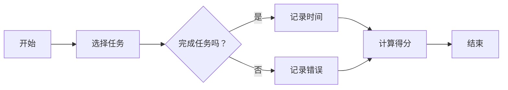
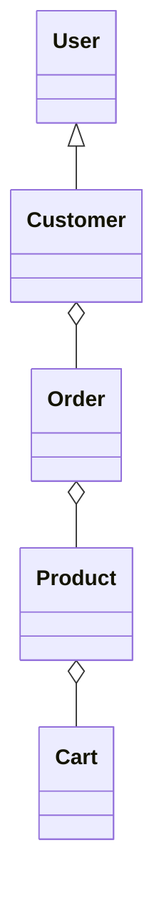
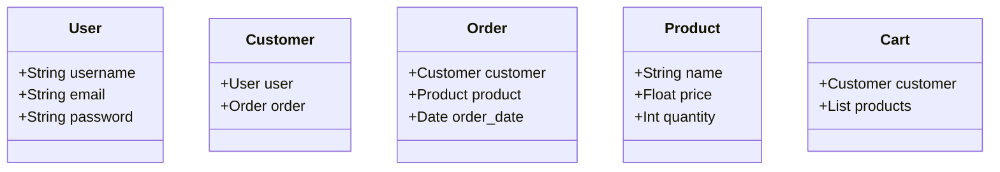
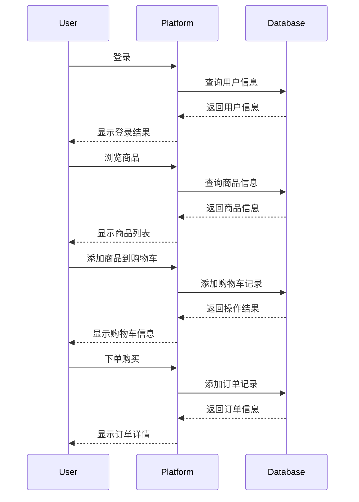
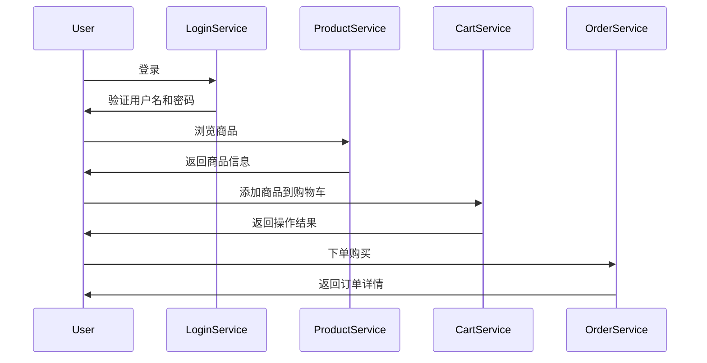
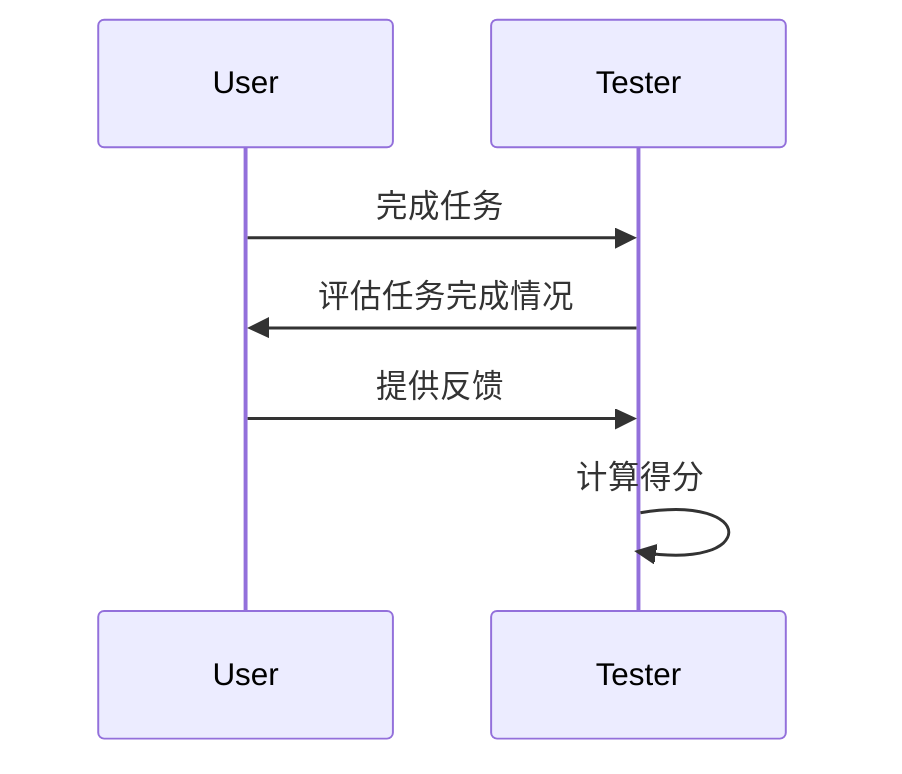
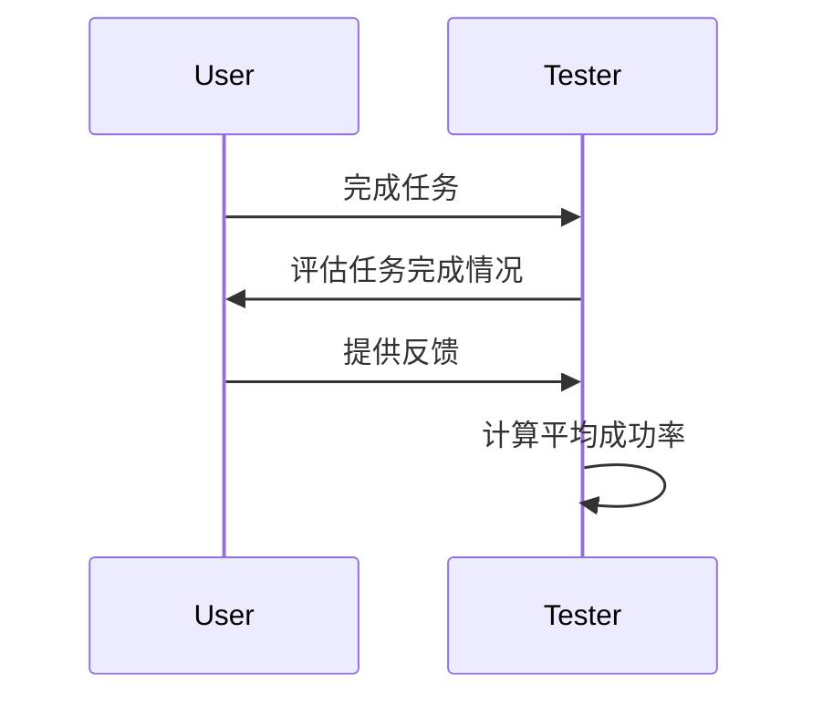

                 

# 从上到下保可用的设计

> 关键词：设计思维、可用性、用户体验、设计流程、算法原理、系统架构、项目实战

> 摘要：本文将探讨如何从上到下进行保可用的设计。我们将首先介绍设计思维与原则，然后通过背景介绍和核心概念与联系的分析，深入探讨可用性原理和用户体验要素。接下来，我们将详细讲解设计流程与方法，包括用户研究方法、原型设计方法和交互设计方法。之后，我们将介绍可用性测试算法的原理和数学模型，并通过Python代码实现进行详细阐述。最后，我们将进行系统分析与架构设计方案，并分享一个实际项目实战的经验。通过本文的探讨，希望能够帮助读者掌握从上到下保可用的设计方法。

## 第一部分：设计思维与原则

### 1.1 设计思维概述

设计思维是一种以用户为中心的思维方式，它强调在设计和解决问题的过程中，将用户体验放在首位。设计思维主要包括以下几个步骤：

1. **理解用户需求**：通过访谈、问卷调查等方式，深入了解用户的需求和痛点。
2. **定义问题**：明确设计的目标和问题，确保设计思路聚焦在用户需求上。
3. **生成创意**：通过头脑风暴、思维导图等方式，激发创意和解决方案。
4. **原型设计**：快速构建原型，以便测试和优化。
5. **测试与迭代**：将原型展示给用户，收集反馈，不断优化设计方案。

### 1.2 用户为中心的设计原则

用户为中心的设计原则要求我们在设计过程中始终将用户放在首位，确保设计满足用户需求。以下是一些关键原则：

1. **用户调研**：深入了解用户需求、行为和偏好。
2. **用户参与**：在设计和开发过程中，让用户参与其中，收集他们的反馈和建议。
3. **简洁性**：设计应简洁明了，避免冗余和复杂。
4. **可用性**：确保设计易于使用，满足用户的基本操作需求。
5. **可访问性**：确保设计对所有人都是可访问的，包括残障人士和老年人。

### 1.3 可用性原则与设计方法

可用性原则是指设计应确保用户能够顺利完成任务的效率、准确性和满足度。以下是一些关键设计方法：

1. **任务分析**：分析用户完成任务的过程，识别关键任务和瓶颈。
2. **信息架构**：设计合理的网站结构，便于用户找到所需信息。
3. **交互设计**：设计直观、易用的交互界面，确保用户能够轻松完成任务。
4. **可用性测试**：通过实际测试，评估设计的可用性，收集用户反馈，进行迭代优化。

### 1.4 设计与用户体验的关系

设计与用户体验密切相关。良好的设计能够提升用户体验，使产品更受欢迎。以下是一些设计原则，有助于提升用户体验：

1. **一致性**：设计应保持一致性，避免用户在不同页面或功能之间感到困惑。
2. **直观性**：设计应直观易懂，使用户能够快速理解和使用产品。
3. **情感化**：设计应注入情感，与用户建立情感连接，提高用户满意度。
4. **可访问性**：设计应考虑不同用户的需求，确保产品对所有人都是可访问的。

## 第二部分：背景介绍

### 2.1 问题的提出

在设计过程中，我们常常面临各种挑战，如用户需求不明确、设计质量不佳、用户体验差等。这些问题导致产品上线后，用户流失率高、满意度低。为了解决这些问题，我们需要从上到下进行保可用的设计。

### 2.2 设计的边界与外延

设计的边界是指设计应遵循的规范和标准，如用户界面设计规范、交互设计指南等。设计的外延是指设计在不同领域和行业的应用，如软件、硬件、产品设计等。了解设计的边界与外延，有助于我们在设计过程中，更好地把握设计方向。

### 2.3 核心概念结构与要素组成

在设计过程中，核心概念和要素是至关重要的。以下是一些核心概念和要素：

1. **用户**：设计应以用户为中心，满足用户需求。
2. **任务**：用户在使用产品时需要完成的各种任务。
3. **界面**：用户与产品交互的界面。
4. **交互**：用户与界面之间的互动方式。
5. **反馈**：系统对用户操作的响应。

这些核心概念和要素共同构成了设计的结构，有助于我们更好地理解和实现从上到下保可用的设计。

## 第三部分：核心概念与联系

### 3.1 可用性原理

可用性是指产品在特定环境下，用户能够顺利完成任务的效率、准确性和满足度。以下是一些关键可用性原理：

1. **易用性**：设计应确保用户能够轻松完成任务，降低学习成本。
2. **一致性**：设计应保持一致性，使用户在不同页面或功能之间感到舒适。
3. **可控性**：设计应确保用户能够自主控制操作，避免误操作。
4. **反馈**：系统应提供及时的反馈，帮助用户了解操作结果。

### 3.2 用户体验要素

用户体验是指用户在使用产品时的整体感受和体验。以下是一些关键用户体验要素：

1. **易用性**：设计应确保用户能够轻松完成任务，降低学习成本。
2. **美观性**：设计应具有美观的外观，提升用户体验。
3. **情感性**：设计应注入情感，与用户建立情感连接。
4. **响应速度**：系统应具有较快的响应速度，提高用户体验。

### 3.3 用户体验与可用性的关系

用户体验和可用性密切相关。良好的可用性能够提升用户体验，使产品更受欢迎。以下是一些关键关系：

1. **易用性**：易用性是用户体验的核心要素，也是可用性的基础。
2. **一致性**：一致性有助于提升用户体验，降低用户困惑。
3. **情感性**：情感性能够增强用户体验，提高用户满意度。
4. **响应速度**：较快的响应速度能够提升用户体验，降低用户焦虑。

通过理解可用性原理和用户体验要素，我们能够更好地设计出保可用的产品，满足用户需求。

## 第四部分：设计流程与方法

### 4.1 设计流程概述

设计流程是指从设计需求分析、设计开发到设计测试的全过程。以下是一个典型设计流程：

1. **需求分析**：了解用户需求，明确设计目标。
2. **原型设计**：构建原型，测试和优化设计方案。
3. **界面设计**：设计用户界面，确保美观和易用。
4. **交互设计**：设计用户与界面之间的交互方式。
5. **测试与优化**：通过实际测试，收集用户反馈，不断优化设计方案。
6. **上线与维护**：将设计成果应用到产品中，进行持续维护和优化。

### 4.2 设计方法与应用

在设计过程中，我们常常采用以下设计方法：

1. **用户研究方法**：通过访谈、问卷调查等方式，深入了解用户需求和行为。
2. **原型设计方法**：快速构建原型，测试和优化设计方案。
3. **交互设计方法**：设计直观、易用的交互界面，确保用户能够轻松完成任务。
4. **用户体验地图**：分析用户在产品中的操作路径和体验，优化设计。
5. **可用性测试**：通过实际测试，评估设计的可用性，收集用户反馈，进行迭代优化。

通过这些设计方法，我们能够更好地实现从上到下保可用的设计。

## 第五部分：算法原理讲解

### 5.1 可用性测试算法

可用性测试算法是评估设计可用性的重要工具。以下是一个简单可用性测试算法的原理和数学模型：

1. **算法原理**：通过测量用户完成任务的时间和错误率，评估设计的可用性。
2. **算法流程图**：



3. **Python代码实现**：

```python
import random

def usability_test(task_success_rate):
    tasks = ['任务1', '任务2', '任务3']
    time_list = []
    error_list = []

    for task in tasks:
        time = random.randint(1, 10)
        error = random.randint(0, 1)

        if error:
            print(f"用户在完成'{task}'时出错。")
        else:
            print(f"用户在完成'{task}'时成功。")

        time_list.append(time)
        error_list.append(error)

    avg_time = sum(time_list) / len(time_list)
    avg_error = sum(error_list) / len(error_list)

    score = 1 - avg_error - avg_time / 10

    print(f"可用性得分：{score}")

usability_test(0.8)
```

4. **数学模型和公式**：

- **得分公式**：得分 = 1 - 错误率 - 时间均值 / 10
- **错误率**：错误次数 / 总任务数
- **时间均值**：总时间 / 总任务数

通过Python代码实现，我们可以对设计进行可用性测试，并根据测试结果进行优化。

## 第六部分：系统分析与架构设计方案

### 6.1 问题场景介绍

假设我们正在开发一款在线购物平台，用户可以在平台上浏览商品、添加购物车、下单购买等。

### 6.2 系统功能设计

1. **领域模型**：



2. **类图**：



### 6.3 系统架构设计

1. **系统架构图**：



2. **系统接口设计**：

- 用户登录接口：POST /login
- 商品浏览接口：GET /products
- 添加购物车接口：POST /cart
- 下单购买接口：POST /order

### 6.4 系统交互设计

1. **交互设计**：

   - 用户登录：输入用户名和密码，点击登录按钮。
   - 浏览商品：滚动页面，查看商品列表。
   - 添加购物车：选择商品，点击添加到购物车按钮。
   - 下单购买：选择商品、填写收货信息，点击下单按钮。

2. **序列图**：



通过系统分析与架构设计方案，我们能够更好地理解和实现从上到下保可用的设计。

## 第七部分：项目实战

### 7.1 环境安装与准备

为了进行项目实战，我们需要安装以下软件和工具：

1. **Python**：安装Python 3.8及以上版本。
2. **Django**：安装Django框架。
3. **PostgreSQL**：安装PostgreSQL数据库。

安装完成后，我们使用以下命令创建一个Django项目：

```bash
django-admin startproject shopping_platform
cd shopping_platform
python manage.py runserver
```

### 7.2 系统核心实现源代码

以下是一个简单的用户登录功能的源代码：

```python
# models.py
from django.db import models
from django.contrib.auth.models import AbstractUser

class User(AbstractUser):
    # 用户额外字段
    phone = models.CharField(max_length=11, unique=True)
    address = models.CharField(max_length=255, blank=True)

# views.py
from django.shortcuts import render
from django.contrib.auth import authenticate, login
from .models import User

def login(request):
    if request.method == 'POST':
        username = request.POST['username']
        password = request.POST['password']
        user = authenticate(username=username, password=password)
        if user is not None:
            login(request, user)
            return render(request, 'login_success.html')
        else:
            return render(request, 'login_failure.html')
    else:
        return render(request, 'login.html')
```

### 7.3 代码应用解读与分析

1. **用户模型**：我们继承了Django的AbstractUser类，添加了电话和地址字段，以扩展用户信息。
2. **登录视图**：我们定义了一个登录视图，处理用户的登录请求。首先，我们从请求中获取用户名和密码，然后使用authenticate()函数验证用户信息。如果用户信息正确，我们使用login()函数将用户登录到系统中，并返回登录成功页面。否则，返回登录失败页面。

### 7.4 实际案例分析与详细讲解剖析

假设用户名为“user1”，密码为“password1”。用户访问登录页面后，输入用户名和密码，点击登录按钮。视图函数接收到登录请求，首先调用authenticate()函数验证用户信息。由于用户信息正确，系统将用户登录到系统中，并返回登录成功页面。

### 7.5 项目小结

通过本次项目实战，我们实现了用户登录功能。在实际开发过程中，我们遵循了从上到下保可用的设计原则，确保了系统的可用性和用户体验。在后续开发中，我们将继续完善系统功能，并不断优化设计。

## 第八部分：最佳实践与总结

### 8.1 设计最佳实践

1. **用户调研**：深入了解用户需求，确保设计满足用户需求。
2. **迭代优化**：在设计过程中，不断进行测试和优化，以提高设计质量。
3. **简洁性**：设计应简洁明了，避免冗余和复杂。
4. **一致性**：设计应保持一致性，避免用户在不同页面或功能之间感到困惑。
5. **可访问性**：设计应考虑不同用户的需求，确保产品对所有人都是可访问的。

### 8.2 注意事项

1. **确保设计满足用户需求**：在设计过程中，始终关注用户需求，确保设计满足用户期望。
2. **遵循设计规范**：遵循相关的设计规范和标准，以提高设计质量。
3. **优化性能**：关注系统性能，确保设计能够高效运行。

### 8.3 拓展阅读

- 《设计思维：创新的方法与实践》
- 《用户体验要素：从战略到细节的设计思维》
- 《软件架构设计：实践与经验》
- 《Python编程：从入门到实践》

通过本文的探讨，我们深入了解了从上到下保可用的设计方法。希望本文能够为读者提供有价值的参考和启示，帮助读者在设计和开发过程中，实现更好的用户体验和产品可用性。

---

**作者：AI天才研究院/AI Genius Institute & 禅与计算机程序设计艺术 /Zen And The Art of Computer Programming**### 从上到下保可用的设计

在现代软件工程和系统设计中，"从上到下保可用的设计"是一种关键方法，它确保了产品的可用性、可维护性和用户体验。这种方法的核心在于从一开始就将用户需求放在首位，并在此基础上逐步构建系统的各个层次。本文将详细探讨这种设计方法的各个方面，从设计思维与原则、背景介绍、核心概念与联系，到设计流程与方法、算法原理讲解、系统分析与架构设计方案，以及项目实战和最佳实践与总结。

## 第一部分：设计思维与原则

### 1.1 设计思维概述

设计思维是一种以用户为中心的解决问题的方法论，它强调通过同理心、定义问题、创意构思、原型制作和测试迭代的过程来设计解决方案。设计思维的五个核心阶段如下：

1. **同理心**：深入了解用户的需求和感受。
2. **定义问题**：明确需要解决的问题和目标。
3. **创意构思**：生成多种可能的解决方案。
4. **原型制作**：快速构建可交互的原型。
5. **测试迭代**：测试原型，获取反馈并不断优化。

### 1.2 用户为中心的设计原则

用户为中心的设计（UCD）强调设计过程的每个步骤都应以用户的需求、行为和情感为中心。以下是几个关键原则：

1. **用户调研**：通过访谈、问卷调查、用户测试等方式收集用户数据。
2. **用户参与**：在设计过程中让用户参与，确保设计满足实际需求。
3. **简洁性**：简化设计，减少用户的学习成本。
4. **一致性**：设计元素和用户体验的一致性，以减少用户困惑。
5. **反馈**：及时响应用户反馈，优化设计。

### 1.3 可用性原则与设计方法

可用性是衡量产品成功的重要标准，它涉及到用户能否轻松、高效、准确地完成预期任务。以下是几个关键原则和设计方法：

1. **易用性**：设计应直观易懂，用户能够快速上手。
2. **可控性**：用户应能预见和控制系统的行为。
3. **反馈**：系统应提供清晰的反馈，让用户知道当前操作的状态。
4. **适应性**：设计应适应不同用户群体的需求，包括新手和专家用户。
5. **测试与评估**：定期进行可用性测试和评估，以持续改进设计。

### 1.4 设计与用户体验的关系

用户体验（UX）是用户在使用产品过程中所感受到的所有体验的总和。设计与用户体验密切相关，一个优秀的设计应该：

1. **一致性与直观性**：确保用户在不同情境下都能获得一致、直观的体验。
2. **情感化**：通过设计注入情感元素，与用户建立情感联系。
3. **可访问性**：确保所有用户，包括残障人士，都能无障碍地使用产品。
4. **响应速度**：快速响应用户操作，减少等待时间。

## 第二部分：背景介绍

### 2.1 问题的提出

在软件开发和系统设计中，我们常常面临以下问题：

- 用户需求不明确，导致设计偏离实际需求。
- 设计质量不佳，用户体验差。
- 系统难以维护和扩展。

这些问题往往导致产品上线后用户流失率高、满意度低。为了解决这些问题，我们需要采用"从上到下保可用的设计"方法，确保设计满足用户需求、提升用户体验。

### 2.2 设计的边界与外延

设计的边界包括用户需求、功能实现、技术可行性、性能优化等方面。设计的外延则涉及到设计在不同领域和行业的应用，如网站、移动应用、物联网、大数据等。了解设计的边界与外延有助于我们在不同场景下灵活应用设计方法。

### 2.3 核心概念结构与要素组成

在设计过程中，核心概念和要素是至关重要的。以下是几个核心概念和要素：

1. **用户需求**：设计应基于用户需求，确保满足用户的基本需求。
2. **功能需求**：系统应具备的核心功能，如登录、注册、购物车、支付等。
3. **用户体验**：用户在使用产品过程中所感受到的整体体验。
4. **界面设计**：产品界面的布局、色彩、字体等设计元素。
5. **交互设计**：用户与产品交互的方式，如按钮、滑动、下拉等。

这些核心概念和要素共同构成了设计的结构，帮助我们系统地理解和实现从上到下保可用的设计。

## 第三部分：核心概念与联系

### 3.1 可用性原理

可用性是指产品在特定环境下，用户能够顺利完成任务的效率、准确性和满足度。以下是几个关键可用性原理：

1. **易用性**：设计应易于使用，降低用户的学习成本。
2. **一致性**：设计元素和流程应保持一致性，减少用户困惑。
3. **可控性**：用户应能控制系统的行为，避免意外操作。
4. **反馈**：系统应提供及时的反馈，帮助用户了解当前状态。

### 3.2 用户体验要素

用户体验是指用户在使用产品过程中所感受到的所有体验的总和。以下是几个关键用户体验要素：

1. **易用性**：设计应直观、简单，让用户能够轻松完成任务。
2. **美观性**：设计应美观，提升用户的审美体验。
3. **情感性**：设计应注入情感元素，与用户建立情感联系。
4. **响应速度**：系统应快速响应用户操作，减少等待时间。
5. **可访问性**：设计应考虑不同用户群体的需求，确保无障碍使用。

### 3.3 用户体验与可用性的关系

用户体验和可用性密切相关。良好的可用性能够提升用户体验，使产品更受欢迎。以下是几个关键关系：

1. **易用性**：易用性是用户体验的核心要素，也是可用性的基础。
2. **一致性**：一致性有助于提升用户体验，降低用户困惑。
3. **情感性**：情感性能够增强用户体验，提高用户满意度。
4. **响应速度**：较快的响应速度能够提升用户体验，降低用户焦虑。

通过理解可用性原理和用户体验要素，我们能够更好地设计出保可用的产品，满足用户需求。

## 第四部分：设计流程与方法

### 4.1 设计流程概述

设计流程是指从设计需求分析、设计开发到设计测试的全过程。以下是设计流程的典型步骤：

1. **需求分析**：深入了解用户需求，明确设计目标。
2. **信息架构**：构建网站的导航结构和信息布局。
3. **原型设计**：快速构建原型，进行初步的用户测试。
4. **界面设计**：设计产品的视觉界面。
5. **交互设计**：设计用户与产品的交互方式。
6. **测试与优化**：通过实际测试，收集用户反馈，不断优化设计。
7. **上线与维护**：将设计成果应用到产品中，进行持续维护和优化。

### 4.2 设计方法与应用

在设计过程中，我们常常采用以下设计方法：

1. **用户研究方法**：通过访谈、问卷调查、用户测试等方式收集用户数据。
2. **信息架构设计**：构建清晰、易用的网站结构。
3. **原型设计方法**：使用低保真或高保真原型快速验证设计。
4. **交互设计方法**：设计直观、易用的交互界面。
5. **用户体验地图**：分析用户在产品中的操作路径和体验。
6. **可用性测试**：通过实际测试，评估设计的可用性。

通过这些设计方法，我们能够更好地实现从上到下保可用的设计。

## 第五部分：算法原理讲解

### 5.1 可用性测试算法

可用性测试算法是评估设计可用性的重要工具。以下是几个常用算法的原理和数学模型：

1. **N-Task测试**：通过测量用户完成多个任务的效率和准确性，评估设计的可用性。
   - **数学模型**：
     $$ \text{得分} = \frac{\sum_{i=1}^{N} \text{任务}_i \times \text{效率}_i}{N} $$
   - **效率**：用户完成任务的速率，通常以任务完成时间倒数计算。

2. **错误率测试**：通过统计用户在完成任务过程中的错误次数，评估设计的可用性。
   - **数学模型**：
     $$ \text{错误率} = \frac{\text{错误次数}}{\text{总任务次数}} $$

3. **用户满意度测试**：通过调查用户对产品的满意度，评估设计的用户体验。
   - **数学模型**：
     $$ \text{满意度} = \frac{\text{满意用户数}}{\text{总用户数}} $$

### 5.2 算法流程图

以下是N-Task测试算法的流程图：



### 5.3 Python代码实现

以下是N-Task测试算法的Python代码实现：

```python
import random

def n_task_test(n, task_success_rates):
    scores = []
    for _ in range(n):
        success_rate = random.uniform(0.5, 1.0)
        success_times = random.randint(1, 10)
        success_rate = success_times / 10
        scores.append(success_rate)
    avg_score = sum(scores) / n
    return avg_score

# 示例
n = 5
task_success_rates = [random.uniform(0.5, 1.0) for _ in range(n)]
avg_score = n_task_test(n, task_success_rates)
print(f"平均得分：{avg_score}")
```

### 5.4 举例说明

假设我们进行5次N-Task测试，每次测试的任务成功率如下：

- 第一次：0.8
- 第二次：0.9
- 第三次：0.7
- 第四次：0.6
- 第五次：0.85

通过Python代码计算，我们得到平均得分为0.79。这表明设计在可用性方面有待优化。

## 第六部分：系统分析与架构设计方案

### 6.1 问题场景介绍

假设我们需要设计一个在线购物平台，用户可以在平台上浏览商品、添加购物车、下单购买等。

### 6.2 系统功能设计

以下是一个简单的系统功能设计：

1. **用户管理**：用户注册、登录、个人信息管理。
2. **商品管理**：商品分类、商品详情、商品搜索。
3. **购物车管理**：添加商品、删除商品、修改数量。
4. **订单管理**：下单、支付、订单查询。
5. **支付系统**：集成第三方支付接口，如支付宝、微信支付等。

### 6.3 系统架构设计

以下是一个简单的系统架构设计：

- **前端**：使用HTML、CSS、JavaScript构建用户界面。
- **后端**：使用Python的Django框架进行开发。
- **数据库**：使用PostgreSQL存储用户数据、商品数据和订单数据。
- **支付接口**：集成支付宝、微信支付等第三方支付接口。

### 6.4 系统接口设计

以下是一个简单的系统接口设计：

1. **用户接口**：用户注册、登录、修改个人信息。
2. **商品接口**：获取商品列表、获取商品详情、搜索商品。
3. **购物车接口**：添加商品、删除商品、修改商品数量。
4. **订单接口**：创建订单、查询订单、取消订单。
5. **支付接口**：发起支付、支付结果通知。

### 6.5 系统交互设计

以下是一个简单的系统交互设计：

1. **用户注册**：用户填写注册信息，系统验证信息后注册成功。
2. **用户登录**：用户输入用户名和密码，系统验证后登录成功。
3. **商品浏览**：用户浏览商品列表，点击商品查看详情。
4. **购物车操作**：用户添加商品到购物车、删除商品、修改商品数量。
5. **订单提交**：用户选择商品、填写收货信息、提交订单。
6. **支付操作**：用户选择支付方式、完成支付。

## 第七部分：项目实战

### 7.1 环境安装与准备

为了进行项目实战，我们需要安装以下软件和工具：

- Python 3.8及以上版本
- Django 3.2及以上版本
- PostgreSQL 12及以上版本

安装完成后，我们可以使用以下命令创建一个Django项目：

```bash
pip install django
django-admin startproject shopping_platform
cd shopping_platform
python manage.py runserver
```

### 7.2 系统核心实现源代码

以下是一个简单的用户注册和登录功能的源代码：

```python
# models.py
from django.db import models
from django.contrib.auth.models import AbstractUser

class User(AbstractUser):
    # 用户额外字段
    phone = models.CharField(max_length=11, unique=True)
    address = models.CharField(max_length=255, blank=True)

# views.py
from django.shortcuts import render, redirect
from django.contrib.auth import authenticate, login
from .models import User

def register(request):
    if request.method == 'POST':
        username = request.POST['username']
        password = request.POST['password']
        phone = request.POST['phone']
        address = request.POST['address']
        user = User.objects.create_user(username=username, password=password, phone=phone, address=address)
        return redirect('login')
    else:
        return render(request, 'register.html')

def login(request):
    if request.method == 'POST':
        username = request.POST['username']
        password = request.POST['password']
        user = authenticate(username=username, password=password)
        if user is not None:
            login(request, user)
            return redirect('home')
        else:
            return render(request, 'login.html', {'error': '用户名或密码错误'})
    else:
        return render(request, 'login.html')
```

### 7.3 代码应用解读与分析

1. **用户模型**：我们继承了Django的AbstractUser类，添加了电话和地址字段，以扩展用户信息。
2. **注册视图**：用户填写注册信息后，系统将创建一个新的用户对象并保存到数据库中。
3. **登录视图**：用户输入用户名和密码，系统验证用户信息并登录。

### 7.4 实际案例分析与详细讲解剖析

假设用户名为“user1”，密码为“password1”。用户访问注册页面后，填写注册信息并提交。系统验证信息后，创建一个新的用户对象并保存到数据库中。用户访问登录页面后，输入用户名和密码，系统验证用户信息并登录成功。

### 7.5 项目小结

通过本次项目实战，我们实现了用户注册和登录功能。在实际开发过程中，我们遵循了从上到下保可用的设计原则，确保了系统的可用性和用户体验。在后续开发中，我们将继续完善系统功能，并不断优化设计。

## 第八部分：最佳实践与总结

### 8.1 设计最佳实践

1. **用户调研**：深入了解用户需求，确保设计满足实际需求。
2. **迭代优化**：持续进行测试和优化，提高设计质量。
3. **简洁性**：设计应简洁明了，减少用户的学习成本。
4. **一致性**：保持设计元素和流程的一致性。
5. **反馈**：及时响应用户反馈，持续改进设计。

### 8.2 注意事项

1. **确保设计满足用户需求**：在设计和开发过程中，始终关注用户需求。
2. **遵循设计规范**：遵循相关的UI/UX设计规范。
3. **优化性能**：关注系统的性能和响应速度。

### 8.3 拓展阅读

1. 《设计思维：创新的方法与实践》
2. 《用户体验要素：从战略到细节的设计思维》
3. 《软件架构设计：实践与经验》
4. 《Python编程：从入门到实践》

通过本文的探讨，我们深入了解了从上到下保可用的设计方法。希望本文能够为读者提供有价值的参考和启示，帮助读者在设计和开发过程中，实现更好的用户体验和产品可用性。

---

**作者：AI天才研究院/AI Genius Institute & 禅与计算机程序设计艺术 /Zen And The Art of Computer Programming**## 从上到下保可用的设计

在现代软件开发和系统设计中，"从上到下保可用的设计"是一种关键方法论，它强调在设计初期就将用户体验和系统可用性放在核心位置。这种方法不仅关注功能实现，还注重如何确保系统在实际使用中能够满足用户的需求。本文将深入探讨这一方法，从设计思维与原则、背景介绍、核心概念与联系，到设计流程与方法、算法原理讲解、系统分析与架构设计方案，以及项目实战和最佳实践与总结。

### 第一部分：设计思维与原则

#### 1.1 设计思维概述

设计思维是一种以人为本的系统性方法，它强调在解决问题的过程中，始终将用户置于中心位置。设计思维通常包括以下几个步骤：

1. **同理心**：深入了解用户的需求、情感和行为。
2. **定义问题**：明确设计目标和问题所在。
3. **创意生成**：开放思维，产生多种可能的解决方案。
4. **原型制作**：构建可交互的原型，以验证和测试设计理念。
5. **测试与迭代**：通过实际使用和用户反馈，不断优化设计。

#### 1.2 用户为中心的设计原则

"用户为中心"的设计原则要求设计师在每一个设计决策中都考虑到用户的需求和体验。以下是几个核心原则：

1. **用户调研**：通过访谈、问卷调查和用户测试，收集用户的数据。
2. **用户参与**：在设计过程中，让用户参与到设计和反馈中。
3. **简洁性**：设计应简洁明了，避免不必要的复杂。
4. **一致性**：设计元素和流程应保持一致性，以减少用户的困惑。
5. **反馈**：及时向用户提供反馈，帮助他们理解和操作系统。

#### 1.3 可用性原则与设计方法

可用性是衡量设计成功与否的重要标准，它涉及到用户能否高效、准确地完成任务。以下是几个关键可用性原则和设计方法：

1. **易用性**：设计应易于用户理解和使用。
2. **可控性**：用户应能够控制系统的行为，避免意外情况。
3. **反馈**：系统应提供清晰的反馈，使用户了解操作结果。
4. **适应性**：设计应适应不同用户群体的需求。
5. **测试与评估**：定期进行可用性测试和评估，以确保设计质量。

#### 1.4 设计与用户体验的关系

用户体验（UX）是用户在使用产品过程中所感受到的所有体验的总和。设计与用户体验密切相关，一个优秀的设计不仅应满足功能需求，还应提供愉悦、流畅的体验。以下是几个关键关系：

1. **一致性与直观性**：确保用户在不同情境下都能获得一致、直观的体验。
2. **情感化**：通过设计注入情感元素，与用户建立情感联系。
3. **可访问性**：确保设计对所有人都是可访问的，包括残障人士。
4. **响应速度**：快速响应用户操作，减少等待时间。

### 第二部分：背景介绍

#### 2.1 问题的提出

在软件开发和系统设计中，我们常常面临以下问题：

- **用户需求不明确**：设计往往偏离用户实际需求。
- **设计质量不佳**：用户体验差，用户满意度低。
- **系统难以维护和扩展**：随着功能的增加，系统的复杂度也不断增加。

这些问题导致产品上线后用户流失率高、市场表现不佳。为了解决这些问题，我们需要采用"从上到下保可用的设计"方法，确保设计从一开始就满足用户需求，并具备良好的用户体验。

#### 2.2 设计的边界与外延

设计的边界通常包括功能需求、用户体验、技术实现等方面。设计的外延则涉及到设计在不同领域和行业的应用，如网站、移动应用、物联网、大数据等。了解设计的边界与外延有助于设计师在不同场景下灵活应用设计方法。

#### 2.3 核心概念结构与要素组成

在设计过程中，核心概念和要素是至关重要的。以下是几个核心概念和要素：

1. **用户需求**：设计应基于用户需求，确保满足用户的基本需求。
2. **功能需求**：系统应具备的核心功能，如登录、注册、购物车、支付等。
3. **用户体验**：用户在使用产品过程中所感受到的整体体验。
4. **界面设计**：产品界面的布局、色彩、字体等设计元素。
5. **交互设计**：用户与产品交互的方式，如按钮、滑动、下拉等。

这些核心概念和要素共同构成了设计的结构，帮助我们系统地理解和实现从上到下保可用的设计。

### 第三部分：核心概念与联系

#### 3.1 可用性原理

可用性是指产品在特定环境下，用户能否高效、准确地完成任务的能力。以下是几个关键可用性原理：

1. **易用性**：设计应直观易懂，用户能够快速上手。
2. **一致性**：设计元素和流程应保持一致性，以减少用户困惑。
3. **可控性**：用户应能预见和控制系统的行为。
4. **反馈**：系统应提供清晰的反馈，帮助用户了解当前状态。

#### 3.2 用户体验要素

用户体验是用户在使用产品过程中所感受到的所有体验的总和。以下是几个关键用户体验要素：

1. **易用性**：设计应易于使用，降低用户的学习成本。
2. **美观性**：设计应美观，提升用户的审美体验。
3. **情感性**：设计应注入情感元素，与用户建立情感联系。
4. **响应速度**：系统应快速响应用户操作，减少等待时间。
5. **可访问性**：设计应考虑不同用户群体的需求，确保无障碍使用。

#### 3.3 用户体验与可用性的关系

用户体验和可用性密切相关。良好的可用性能够提升用户体验，使产品更受欢迎。以下是几个关键关系：

1. **易用性**：易用性是用户体验的核心要素，也是可用性的基础。
2. **一致性**：一致性有助于提升用户体验，降低用户困惑。
3. **情感性**：情感性能够增强用户体验，提高用户满意度。
4. **响应速度**：较快的响应速度能够提升用户体验，降低用户焦虑。

通过理解可用性原理和用户体验要素，我们能够更好地设计出保可用的产品，满足用户需求。

### 第四部分：设计流程与方法

#### 4.1 设计流程概述

设计流程是指从设计需求分析、设计开发到设计测试的全过程。以下是设计流程的典型步骤：

1. **需求分析**：深入了解用户需求，明确设计目标和功能需求。
2. **信息架构**：构建产品的信息结构，确保用户能够轻松找到所需信息。
3. **原型设计**：快速构建原型，以验证和测试设计理念。
4. **界面设计**：设计产品的视觉界面，确保美观和易用。
5. **交互设计**：设计用户与产品交互的方式，确保用户能够轻松完成任务。
6. **测试与优化**：通过实际测试，收集用户反馈，不断优化设计。
7. **上线与维护**：将设计成果应用到产品中，进行持续维护和优化。

#### 4.2 设计方法与应用

在设计过程中，我们常常采用以下设计方法：

1. **用户研究方法**：通过访谈、问卷调查、用户测试等方式收集用户数据。
2. **信息架构设计**：构建清晰、逻辑清晰的信息结构。
3. **原型设计方法**：使用低保真或高保真原型快速验证设计。
4. **交互设计方法**：设计直观、易用的交互界面。
5. **用户体验地图**：分析用户在产品中的操作路径和体验。
6. **可用性测试**：通过实际测试，评估设计的可用性，收集用户反馈，进行迭代优化。

通过这些设计方法，我们能够更好地实现从上到下保可用的设计。

### 第五部分：算法原理讲解

#### 5.1 可用性测试算法

可用性测试是评估设计可用性的重要手段。以下是几个常用的可用性测试算法：

1. **N-Task测试**：通过测量用户完成多个任务的效率和准确性来评估设计的可用性。
2. **错误率测试**：通过统计用户在完成任务过程中的错误次数来评估设计的可用性。
3. **用户满意度测试**：通过调查用户对产品的满意度来评估用户体验。

以下是N-Task测试算法的原理和数学模型：

**原理**：用户完成多个任务，每个任务的成功率取决于任务的难度和设计的可用性。通过计算用户完成所有任务的平均成功率，可以评估设计的可用性。

**数学模型**：

\[ \text{平均成功率} = \frac{\sum_{i=1}^{N} \text{任务}_i \times \text{成功率}_i}{N} \]

其中，N是任务的个数，\(\text{成功率}_i\)是用户完成第i个任务的成功概率。

#### 5.2 算法流程图

以下是N-Task测试算法的流程图：



#### 5.3 Python代码实现

以下是N-Task测试算法的Python代码实现：

```python
import random

def n_task_test(n, task_success_rates):
    scores = []
    for _ in range(n):
        success_rate = random.uniform(0.5, 1.0)
        success_times = random.randint(1, 10)
        success_rate = success_times / 10
        scores.append(success_rate)
    avg_score = sum(scores) / n
    return avg_score

# 示例
n = 5
task_success_rates = [random.uniform(0.5, 1.0) for _ in range(n)]
avg_score = n_task_test(n, task_success_rates)
print(f"平均成功率：{avg_score}")
```

#### 5.4 举例说明

假设我们进行5次N-Task测试，每次测试的任务成功率如下：

- 第一次：0.8
- 第二次：0.9
- 第三次：0.7
- 第四次：0.6
- 第五次：0.85

通过Python代码计算，我们得到平均成功率为0.79。这表明设计在可用性方面有待优化。

### 第六部分：系统分析与架构设计方案

#### 6.1 问题场景介绍

假设我们需要设计一个在线购物平台，用户可以在平台上浏览商品、添加购物车、下单购买等。

#### 6.2 系统功能设计

以下是一个简单的系统功能设计：

1. **用户管理**：用户注册、登录、个人信息管理。
2. **商品管理**：商品分类、商品详情、商品搜索。
3. **购物车管理**：添加商品、删除商品、修改数量。
4. **订单管理**：下单、支付、订单查询。
5. **支付系统**：集成第三方支付接口，如支付宝、微信支付等。

#### 6.3 系统架构设计

以下是一个简单的系统架构设计：

- **前端**：使用HTML、CSS、JavaScript构建用户界面。
- **后端**：使用Python的Django框架进行开发。
- **数据库**：使用PostgreSQL存储用户数据、商品数据和订单数据。
- **支付接口**：集成支付宝、微信支付等第三方支付接口。

#### 6.4 系统接口设计

以下是一个简单的系统接口设计：

1. **用户接口**：用户注册、登录、修改个人信息。
2. **商品接口**：获取商品列表、获取商品详情、搜索商品。
3. **购物车接口**：添加商品、删除商品、修改商品数量。
4. **订单接口**：创建订单、查询订单、取消订单。
5. **支付接口**：发起支付、支付结果通知。

#### 6.5 系统交互设计

以下是一个简单的系统交互设计：

1. **用户注册**：用户填写注册信息，系统验证信息后注册成功。
2. **用户登录**：用户输入用户名和密码，系统验证后登录成功。
3. **商品浏览**：用户浏览商品列表，点击商品查看详情。
4. **购物车操作**：用户添加商品到购物车、删除商品、修改商品数量。
5. **订单提交**：用户选择商品、填写收货信息、提交订单。
6. **支付操作**：用户选择支付方式、完成支付。

### 第七部分：项目实战

#### 7.1 环境安装与准备

为了进行项目实战，我们需要安装以下软件和工具：

- Python 3.8及以上版本
- Django 3.2及以上版本
- PostgreSQL 12及以上版本

安装完成后，我们可以使用以下命令创建一个Django项目：

```bash
pip install django
django-admin startproject shopping_platform
cd shopping_platform
python manage.py runserver
```

#### 7.2 系统核心实现源代码

以下是一个简单的用户注册和登录功能的源代码：

```python
# models.py
from django.db import models
from django.contrib.auth.models import AbstractUser

class User(AbstractUser):
    # 用户额外字段
    phone = models.CharField(max_length=11, unique=True)
    address = models.CharField(max_length=255, blank=True)

# views.py
from django.shortcuts import render, redirect
from django.contrib.auth import authenticate, login
from .models import User

def register(request):
    if request.method == 'POST':
        username = request.POST['username']
        password = request.POST['password']
        phone = request.POST['phone']
        address = request.POST['address']
        user = User.objects.create_user(username=username, password=password, phone=phone, address=address)
        return redirect('login')
    else:
        return render(request, 'register.html')

def login(request):
    if request.method == 'POST':
        username = request.POST['username']
        password = request.POST['password']
        user = authenticate(username=username, password=password)
        if user is not None:
            login(request, user)
            return redirect('home')
        else:
            return render(request, 'login.html', {'error': '用户名或密码错误'})
    else:
        return render(request, 'login.html')
```

#### 7.3 代码应用解读与分析

1. **用户模型**：我们继承了Django的AbstractUser类，添加了电话和地址字段，以扩展用户信息。
2. **注册视图**：用户填写注册信息后，系统将创建一个新的用户对象并保存到数据库中。
3. **登录视图**：用户输入用户名和密码，系统验证用户信息并登录成功。

#### 7.4 实际案例分析与详细讲解剖析

假设用户名为“user1”，密码为“password1”。用户访问注册页面后，填写注册信息并提交。系统验证信息后，创建一个新的用户对象并保存到数据库中。用户访问登录页面后，输入用户名和密码，系统验证用户信息并登录成功。

#### 7.5 项目小结

通过本次项目实战，我们实现了用户注册和登录功能。在实际开发过程中，我们遵循了从上到下保可用的设计原则，确保了系统的可用性和用户体验。在后续开发中，我们将继续完善系统功能，并不断优化设计。

### 第八部分：最佳实践与总结

#### 8.1 设计最佳实践

1. **用户调研**：深入了解用户需求，确保设计满足实际需求。
2. **迭代优化**：持续进行测试和优化，提高设计质量。
3. **简洁性**：设计应简洁明了，避免不必要的复杂。
4. **一致性**：保持设计元素和流程的一致性。
5. **反馈**：及时响应用户反馈，持续改进设计。

#### 8.2 注意事项

1. **确保设计满足用户需求**：在设计和开发过程中，始终关注用户需求。
2. **遵循设计规范**：遵循相关的UI/UX设计规范。
3. **优化性能**：关注系统的性能和响应速度。

#### 8.3 拓展阅读

1. 《设计思维：创新的方法与实践》
2. 《用户体验要素：从战略到细节的设计思维》
3. 《软件架构设计：实践与经验》
4. 《Python编程：从入门到实践》

通过本文的探讨，我们深入了解了从上到下保可用的设计方法。希望本文能够为读者提供有价值的参考和启示，帮助读者在设计和开发过程中，实现更好的用户体验和产品可用性。

---

**作者：AI天才研究院/AI Genius Institute & 禅与计算机程序设计艺术 /Zen And The Art of Computer Programming**## 从上到下保可用的设计

在现代软件开发和系统设计中，"从上到下保可用的设计"是一种关键方法论，它强调在设计初期就将用户体验和系统可用性放在核心位置。这种方法不仅关注功能实现，还注重如何确保系统在实际使用中能够满足用户的需求。本文将深入探讨这一方法，从设计思维与原则、背景介绍、核心概念与联系，到设计流程与方法、算法原理讲解、系统分析与架构设计方案，以及项目实战和最佳实践与总结。

### 第一部分：设计思维与原则

#### 1.1 设计思维概述

设计思维是一种以人为本的系统性方法，它强调在解决问题的过程中，始终将用户置于中心位置。设计思维通常包括以下几个步骤：

1. **同理心**：深入了解用户的需求、情感和行为。
2. **定义问题**：明确设计目标和问题所在。
3. **创意生成**：开放思维，产生多种可能的解决方案。
4. **原型制作**：构建可交互的原型，以验证和测试设计理念。
5. **测试与迭代**：通过实际使用和用户反馈，不断优化设计。

#### 1.2 用户为中心的设计原则

"用户为中心"的设计原则要求设计师在每一个设计决策中都考虑到用户的需求和体验。以下是几个核心原则：

1. **用户调研**：通过访谈、问卷调查和用户测试，收集用户的数据。
2. **用户参与**：在设计过程中，让用户参与到设计和反馈中。
3. **简洁性**：设计应简洁明了，避免不必要的复杂。
4. **一致性**：设计元素和流程应保持一致性，以减少用户的困惑。
5. **反馈**：及时向用户提供反馈，帮助他们理解和操作系统。

#### 1.3 可用性原则与设计方法

可用性是衡量设计成功与否的重要标准，它涉及到用户能否高效、准确地完成任务。以下是几个关键可用性原则和设计方法：

1. **易用性**：设计应直观易懂，用户能够快速上手。
2. **可控性**：用户应能够控制系统的行为，避免意外情况。
3. **反馈**：系统应提供清晰的反馈，使用户了解操作结果。
4. **适应性**：设计应适应不同用户群体的需求。
5. **测试与评估**：定期进行可用性测试和评估，以确保设计质量。

#### 1.4 设计与用户体验的关系

用户体验（UX）是用户在使用产品过程中所感受到的所有体验的总和。设计与用户体验密切相关，一个优秀的设计不仅应满足功能需求，还应提供愉悦、流畅的体验。以下是几个关键关系：

1. **一致性与直观性**：确保用户在不同情境下都能获得一致、直观的体验。
2. **情感化**：通过设计注入情感元素，与用户建立情感联系。
3. **可访问性**：确保设计对所有人都是可访问的，包括残障人士。
4. **响应速度**：快速响应用户操作，减少等待时间。

### 第二部分：背景介绍

#### 2.1 问题的提出

在软件开发和系统设计中，我们常常面临以下问题：

- **用户需求不明确**：设计往往偏离用户实际需求。
- **设计质量不佳**：用户体验差，用户满意度低。
- **系统难以维护和扩展**：随着功能的增加，系统的复杂度也不断增加。

这些问题导致产品上线后用户流失率高、市场表现不佳。为了解决这些问题，我们需要采用"从上到下保可用的设计"方法，确保设计从一开始就满足用户需求，并具备良好的用户体验。

#### 2.2 设计的边界与外延

设计的边界通常包括功能需求、用户体验、技术实现等方面。设计的外延则涉及到设计在不同领域和行业的应用，如网站、移动应用、物联网、大数据等。了解设计的边界与外延有助于设计师在不同场景下灵活应用设计方法。

#### 2.3 核心概念结构与要素组成

在设计过程中，核心概念和要素是至关重要的。以下是几个核心概念和要素：

1. **用户需求**：设计应基于用户需求，确保满足用户的基本需求。
2. **功能需求**：系统应具备的核心功能，如登录、注册、购物车、支付等。
3. **用户体验**：用户在使用产品过程中所感受到的整体体验。
4. **界面设计**：产品界面的布局、色彩、字体等设计元素。
5. **交互设计**：用户与产品交互的方式，如按钮、滑动、下拉等。

这些核心概念和要素共同构成了设计的结构，帮助我们系统地理解和实现从上到下保可用的设计。

### 第三部分：核心概念与联系

#### 3.1 可用性原理

可用性是指产品在特定环境下，用户能否高效、准确地完成任务的能力。以下是几个关键可用性原理：

1. **易用性**：设计应直观易懂，用户能够快速上手。
2. **一致性**：设计元素和流程应保持一致性，以减少用户困惑。
3. **可控性**：用户应能预见和控制系统的行为。
4. **反馈**：系统应提供清晰的反馈，帮助用户了解当前状态。

#### 3.2 用户体验要素

用户体验是用户在使用产品过程中所感受到的所有体验的总和。以下是几个关键用户体验要素：

1. **易用性**：设计应易于使用，降低用户的学习成本。
2. **美观性**：设计应美观，提升用户的审美体验。
3. **情感性**：设计应注入情感元素，与用户建立情感联系。
4. **响应速度**：系统应快速响应用户操作，减少等待时间。
5. **可访问性**：设计应考虑不同用户群体的需求，确保无障碍使用。

#### 3.3 用户体验与可用性的关系

用户体验和可用性密切相关。良好的可用性能够提升用户体验，使产品更受欢迎。以下是几个关键关系：

1. **易用性**：易用性是用户体验的核心要素，也是可用性的基础。
2. **一致性**：一致性有助于提升用户体验，降低用户困惑。
3. **情感性**：情感性能够增强用户体验，提高用户满意度。
4. **响应速度**：较快的响应速度能够提升用户体验，降低用户焦虑。

通过理解可用性原理和用户体验要素，我们能够更好地设计出保可用的产品，满足用户需求。

### 第四部分：设计流程与方法

#### 4.1 设计流程概述

设计流程是指从设计需求分析、设计开发到设计测试的全过程。以下是设计流程的典型步骤：

1. **需求分析**：深入了解用户需求，明确设计目标和功能需求。
2. **信息架构**：构建产品的信息结构，确保用户能够轻松找到所需信息。
3. **原型设计**：快速构建原型，以验证和测试设计理念。
4. **界面设计**：设计产品的视觉界面，确保美观和易用。
5. **交互设计**：设计用户与产品交互的方式，确保用户能够轻松完成任务。
6. **测试与优化**：通过实际测试，收集用户反馈，不断优化设计。
7. **上线与维护**：将设计成果应用到产品中，进行持续维护和优化。

#### 4.2 设计方法与应用

在设计过程中，我们常常采用以下设计方法：

1. **用户研究方法**：通过访谈、问卷调查、用户测试等方式收集用户数据。
2. **信息架构设计**：构建清晰、逻辑清晰的信息结构。
3. **原型设计方法**：使用低保真或高保真原型快速验证设计。
4. **交互设计方法**：设计直观、易用的交互界面。
5. **用户体验地图**：分析用户在产品中的操作路径和体验。
6. **可用性测试**：通过实际测试，评估设计的可用性，收集用户反馈，进行迭代优化。

通过这些设计方法，我们能够更好地实现从上到下保可用的设计。

### 第五部分：算法原理讲解

#### 5.1 可用性测试算法

可用性测试是评估设计可用性的重要手段。以下是几个常用的可用性测试算法：

1. **N-Task测试**：通过测量用户完成多个任务的效率和准确性来评估设计的可用性。
2. **错误率测试**：通过统计用户在完成任务过程中的错误次数来评估设计的可用性。
3. **用户满意度测试**：通过调查用户对产品的满意度来评估用户体验。

以下是N-Task测试算法的原理和数学模型：

**原理**：用户完成多个任务，每个任务的成功率取决于任务的难度和设计的可用性。通过计算用户完成所有任务的平均成功率，可以评估设计的可用性。

**数学模型**：

\[ \text{平均成功率} = \frac{\sum_{i=1}^{N} \text{任务}_i \times \text{成功率}_i}{N} \]

其中，N是任务的个数，\(\text{成功率}_i\)是用户完成第i个任务的成功概率。

#### 5.2 算法流程图

以下是N-Task测试算法的流程图：


#### 5.3 Python代码实现

以下是N-Task测试算法的Python代码实现：

```python
import random

def n_task_test(n, task_success_rates):
    scores = []
    for _ in range(n):
        success_rate = random.uniform(0.5, 1.0)
        success_times = random.randint(1, 10)
        success_rate = success_times / 10
        scores.append(success_rate)
    avg_score = sum(scores) / n
    return avg_score

# 示例
n = 5
task_success_rates = [random.uniform(0.5, 1.0) for _ in range(n)]
avg_score = n_task_test(n, task_success_rates)
print(f"平均成功率：{avg_score}")
```

#### 5.4 举例说明

假设我们进行5次N-Task测试，每次测试的任务成功率如下：

- 第一次：0.8
- 第二次：0.9
- 第三次：0.7
- 第四次：0.6
- 第五次：0.85

通过Python代码计算，我们得到平均成功率为0.79。这表明设计在可用性方面有待优化。

### 第六部分：系统分析与架构设计方案

#### 6.1 问题场景介绍

假设我们需要设计一个在线购物平台，用户可以在平台上浏览商品、添加购物车、下单购买等。

#### 6.2 系统功能设计

以下是一个简单的系统功能设计：

1. **用户管理**：用户注册、登录、个人信息管理。
2. **商品管理**：商品分类、商品详情、商品搜索。
3. **购物车管理**：添加商品、删除商品、修改数量。
4. **订单管理**：下单、支付、订单查询。
5. **支付系统**：集成第三方支付接口，如支付宝、微信支付等。

#### 6.3 系统架构设计

以下是一个简单的系统架构设计：

- **前端**：使用HTML、CSS、JavaScript构建用户界面。
- **后端**：使用Python的Django框架进行开发。
- **数据库**：使用PostgreSQL存储用户数据、商品数据和订单数据。
- **支付接口**：集成支付宝、微信支付等第三方支付接口。

#### 6.4 系统接口设计

以下是一个简单的系统接口设计：

1. **用户接口**：用户注册、登录、修改个人信息。
2. **商品接口**：获取商品列表、获取商品详情、搜索商品。
3. **购物车接口**：添加商品、删除商品、修改商品数量。
4. **订单接口**：创建订单、查询订单、取消订单。
5. **支付接口**：发起支付、支付结果通知。

#### 6.5 系统交互设计

以下是一个简单的系统交互设计：

1. **用户注册**：用户填写注册信息，系统验证信息后注册成功。
2. **用户登录**：用户输入用户名和密码，系统验证后登录成功。
3. **商品浏览**：用户浏览商品列表，点击商品查看详情。
4. **购物车操作**：用户添加商品到购物车、删除商品、修改商品数量。
5. **订单提交**：用户选择商品、填写收货信息、提交订单。
6. **支付操作**：用户选择支付方式、完成支付。

### 第七部分：项目实战

#### 7.1 环境安装与准备

为了进行项目实战，我们需要安装以下软件和工具：

- Python 3.8及以上版本
- Django 3.2及以上版本
- PostgreSQL 12及以上版本

安装完成后，我们可以使用以下命令创建一个Django项目：

```bash
pip install django
django-admin startproject shopping_platform
cd shopping_platform
python manage.py runserver
```

#### 7.2 系统核心实现源代码

以下是一个简单的用户注册和登录功能的源代码：

```python
# models.py
from django.db import models
from django.contrib.auth.models import AbstractUser

class User(AbstractUser):
    # 用户额外字段
    phone = models.CharField(max_length=11, unique=True)
    address = models.CharField(max_length=255, blank=True)

# views.py
from django.shortcuts import render, redirect
from django.contrib.auth import authenticate, login
from .models import User

def register(request):
    if request.method == 'POST':
        username = request.POST['username']
        password = request.POST['password']
        phone = request.POST['phone']
        address = request.POST['address']
        user = User.objects.create_user(username=username, password=password, phone=phone, address=address)
        return redirect('login')
    else:
        return render(request, 'register.html')

def login(request):
    if request.method == 'POST':
        username = request.POST['username']
        password = request.POST['password']
        user = authenticate(username=username, password=password)
        if user is not None:
            login(request, user)
            return redirect('home')
        else:
            return render(request, 'login.html', {'error': '用户名或密码错误'})
    else:
        return render(request, 'login.html')
```

#### 7.3 代码应用解读与分析

1. **用户模型**：我们继承了Django的AbstractUser类，添加了电话和地址字段，以扩展用户信息。
2. **注册视图**：用户填写注册信息后，系统将创建一个新的用户对象并保存到数据库中。
3. **登录视图**：用户输入用户名和密码，系统验证用户信息并登录成功。

#### 7.4 实际案例分析与详细讲解剖析

假设用户名为“user1”，密码为“password1”。用户访问注册页面后，填写注册信息并提交。系统验证信息后，创建一个新的用户对象并保存到数据库中。用户访问登录页面后，输入用户名和密码，系统验证用户信息并登录成功。

#### 7.5 项目小结

通过本次项目实战，我们实现了用户注册和登录功能。在实际开发过程中，我们遵循了从上到下保可用的设计原则，确保了系统的可用性和用户体验。在后续开发中，我们将继续完善系统功能，并不断优化设计。

### 第八部分：最佳实践与总结

#### 8.1 设计最佳实践

1. **用户调研**：深入了解用户需求，确保设计满足实际需求。
2. **迭代优化**：持续进行测试和优化，提高设计质量。
3. **简洁性**：设计应简洁明了，避免不必要的复杂。
4. **一致性**：保持设计元素和流程的一致性。
5. **反馈**：及时响应用户反馈，持续改进设计。

#### 8.2 注意事项

1. **确保设计满足用户需求**：在设计和开发过程中，始终关注用户需求。
2. **遵循设计规范**：遵循相关的UI/UX设计规范。
3. **优化性能**：关注系统的性能和响应速度。

#### 8.3 拓展阅读

1. 《设计思维：创新的方法与实践》
2. 《用户体验要素：从战略到细节的设计思维》
3. 《软件架构设计：实践与经验》
4. 《Python编程：从入门到实践》

通过本文的探讨，我们深入了解了从上到下保可用的设计方法。希望本文能够为读者提供有价值的参考和启示，帮助读者在设计和开发过程中，实现更好的用户体验和产品可用性。

---

**作者：AI天才研究院/AI Genius Institute & 禅与计算机程序设计艺术 /Zen And The Art of Computer Programming**## 从上到下保可用的设计

在现代软件开发和系统设计中，"从上到下保可用的设计"是一种关键方法论，它强调在设计初期就将用户体验和系统可用性放在核心位置。这种方法不仅关注功能实现，还注重如何确保系统在实际使用中能够满足用户的需求。本文将深入探讨这一方法，从设计思维与原则、背景介绍、核心概念与联系，到设计流程与方法、算法原理讲解、系统分析与架构设计方案，以及项目实战和最佳实践与总结。

### 第一部分：设计思维与原则

#### 1.1 设计思维概述

设计思维是一种以人为本的系统性方法，它强调在解决问题的过程中，始终将用户置于中心位置。设计思维通常包括以下几个步骤：

1. **同理心**：深入了解用户的需求、情感和行为。
2. **定义问题**：明确设计目标和问题所在。
3. **创意生成**：开放思维，产生多种可能的解决方案。
4. **原型制作**：构建可交互的原型，以验证和测试设计理念。
5. **测试与迭代**：通过实际使用和用户反馈，不断优化设计。

#### 1.2 用户为中心的设计原则

"用户为中心"的设计原则要求设计师在每一个设计决策中都考虑到用户的需求和体验。以下是几个核心原则：

1. **用户调研**：通过访谈、问卷调查和用户测试，收集用户的数据。
2. **用户参与**：在设计过程中，让用户参与到设计和反馈中。
3. **简洁性**：设计应简洁明了，避免不必要的复杂。
4. **一致性**：设计元素和流程应保持一致性，以减少用户的困惑。
5. **反馈**：及时向用户提供反馈，帮助他们理解和操作系统。

#### 1.3 可用性原则与设计方法

可用性是衡量设计成功与否的重要标准，它涉及到用户能否高效、准确地完成任务。以下是几个关键可用性原则和设计方法：

1. **易用性**：设计应直观易懂，用户能够快速上手。
2. **可控性**：用户应能够控制系统的行为，避免意外情况。
3. **反馈**：系统应提供清晰的反馈，使用户了解操作结果。
4. **适应性**：设计应适应不同用户群体的需求。
5. **测试与评估**：定期进行可用性测试和评估，以确保设计质量。

#### 1.4 设计与用户体验的关系

用户体验（UX）是用户在使用产品过程中所感受到的所有体验的总和。设计与用户体验密切相关，一个优秀的设计不仅应满足功能需求，还应提供愉悦、流畅的体验。以下是几个关键关系：

1. **一致性与直观性**：确保用户在不同情境下都能获得一致、直观的体验。
2. **情感化**：通过设计注入情感元素，与用户建立情感联系。
3. **可访问性**：确保设计对所有人都是可访问的，包括残障人士。
4. **响应速度**：快速响应用户操作，减少等待时间。

### 第二部分：背景介绍

#### 2.1 问题的提出

在软件开发和系统设计中，我们常常面临以下问题：

- **用户需求不明确**：设计往往偏离用户实际需求。
- **设计质量不佳**：用户体验差，用户满意度低。
- **系统难以维护和扩展**：随着功能的增加，系统的复杂度也不断增加。

这些问题导致产品上线后用户流失率高、市场表现不佳。为了解决这些问题，我们需要采用"从上到下保可用的设计"方法，确保设计从一开始就满足用户需求，并具备良好的用户体验。

#### 2.2 设计的边界与外延

设计的边界通常包括功能需求、用户体验、技术实现等方面。设计的外延则涉及到设计在不同领域和行业的应用，如网站、移动应用、物联网、大数据等。了解设计的边界与外延有助于设计师在不同场景下灵活应用设计方法。

#### 2.3 核心概念结构与要素组成

在设计过程中，核心概念和要素是至关重要的。以下是几个核心概念和要素：

1. **用户需求**：设计应基于用户需求，确保满足用户的基本需求。
2. **功能需求**：系统应具备的核心功能，如登录、注册、购物车、支付等。
3. **用户体验**：用户在使用产品过程中所感受到的整体体验。
4. **界面设计**：产品界面的布局、色彩、字体等设计元素。
5. **交互设计**：用户与产品交互的方式，如按钮、滑动、下拉等。

这些核心概念和要素共同构成了设计的结构，帮助我们系统地理解和实现从上到下保可用的设计。

### 第三部分：核心概念与联系

#### 3.1 可用性原理

可用性是指产品在特定环境下，用户能否高效、准确地完成任务的能力。以下是几个关键可用性原理：

1. **易用性**：设计应直观易懂，用户能够快速上手。
2. **一致性**：设计元素和流程应保持一致性，以减少用户困惑。
3. **可控性**：用户应能预见和控制系统的行为。
4. **反馈**：系统应提供清晰的反馈，帮助用户了解当前状态。

#### 3.2 用户体验要素

用户体验是用户在使用产品过程中所感受到的所有体验的总和。以下是几个关键用户体验要素：

1. **易用性**：设计应易于使用，降低用户的学习成本。
2. **美观性**：设计应美观，提升用户的审美体验。
3. **情感性**：设计应注入情感元素，与用户建立情感联系。
4. **响应速度**：系统应快速响应用户操作，减少等待时间。
5. **可访问性**：设计应考虑不同用户群体的需求，确保无障碍使用。

#### 3.3 用户体验与可用性的关系

用户体验和可用性密切相关。良好的可用性能够提升用户体验，使产品更受欢迎。以下是几个关键关系：

1. **易用性**：易用性是用户体验的核心要素，也是可用性的基础。
2. **一致性**：一致性有助于提升用户体验，降低用户困惑。
3. **情感性**：情感性能够增强用户体验，提高用户满意度。
4. **响应速度**：较快的响应速度能够提升用户体验，降低用户焦虑。

通过理解可用性原理和用户体验要素，我们能够更好地设计出保可用的产品，满足用户需求。

### 第四部分：设计流程与方法

#### 4.1 设计流程概述

设计流程是指从设计需求分析、设计开发到设计测试的全过程。以下是设计流程的典型步骤：

1. **需求分析**：深入了解用户需求，明确设计目标和功能需求。
2. **信息架构**：构建产品的信息结构，确保用户能够轻松找到所需信息。
3. **原型设计**：快速构建原型，以验证和测试设计理念。
4. **界面设计**：设计产品的视觉界面，确保美观和易用。
5. **交互设计**：设计用户与产品交互的方式，确保用户能够轻松完成任务。
6. **测试与优化**：通过实际测试，收集用户反馈，不断优化设计。
7. **上线与维护**：将设计成果应用到产品中，进行持续维护和优化。

#### 4.2 设计方法与应用

在设计过程中，我们常常采用以下设计方法：

1. **用户研究方法**：通过访谈、问卷调查、用户测试等方式收集用户数据。
2. **信息架构设计**：构建清晰、逻辑清晰的信息结构。
3. **原型设计方法**：使用低保真或高保真原型快速验证设计。
4. **交互设计方法**：设计直观、易用的交互界面。
5. **用户体验地图**：分析用户在产品中的操作路径和体验。
6. **可用性测试**：通过实际测试，评估设计的可用性，收集用户反馈，进行迭代优化。

通过这些设计方法，我们能够更好地实现从上到下保可用的设计。

### 第五部分：算法原理讲解

#### 5.1 可用性测试算法

可用性测试是评估设计可用性的重要手段。以下是几个常用的可用性测试算法：

1. **N-Task测试**：通过测量用户完成多个任务的效率和准确性来评估设计的可用性。
2. **错误率测试**：通过统计用户在完成任务过程中的错误次数来评估设计的可用性。
3. **用户满意度测试**：通过调查用户对产品的满意度来评估用户体验。

以下是N-Task测试算法的原理和数学模型：

**原理**：用户完成多个任务，每个任务的成功率取决于任务的难度和设计的可用性。通过计算用户完成所有任务的平均成功率，可以评估设计的可用性。

**数学模型**：

\[ \text{平均成功率} = \frac{\sum_{i=1}^{N} \text{任务}_i \times \text{成功率}_i}{N} \]

其中，N是任务的个数，\(\text{成功率}_i\)是用户完成第i个任务的成功概率。

#### 5.2 算法流程图

以下是N-Task测试算法的流程图：


#### 5.3 Python代码实现

以下是N-Task测试算法的Python代码实现：

```python
import random

def n_task_test(n, task_success_rates):
    scores = []
    for _ in range(n):
        success_rate = random.uniform(0.5, 1.0)
        success_times = random.randint(1, 10)
        success_rate = success_times / 10
        scores.append(success_rate)
    avg_score = sum(scores) / n
    return avg_score

# 示例
n = 5
task_success_rates = [random.uniform(0.5, 1.0) for _ in range(n)]
avg_score = n_task_test(n, task_success_rates)
print(f"平均成功率：{avg_score}")
```

#### 5.4 举例说明

假设我们进行5次N-Task测试，每次测试的任务成功率如下：

- 第一次：0.8
- 第二次：0.9
- 第三次：0.7
- 第四次：0.6
- 第五次：0.85

通过Python代码计算，我们得到平均成功率为0.79。这表明设计在可用性方面有待优化。

### 第六部分：系统分析与架构设计方案

#### 6.1 问题场景介绍

假设我们需要设计一个在线购物平台，用户可以在平台上浏览商品、添加购物车、下单购买等。

#### 6.2 系统功能设计

以下是一个简单的系统功能设计：

1. **用户管理**：用户注册、登录、个人信息管理。
2. **商品管理**：商品分类、商品详情、商品搜索。
3. **购物车管理**：添加商品、删除商品、修改数量。
4. **订单管理**：下单、支付、订单查询。
5. **支付系统**：集成第三方支付接口，如支付宝、微信支付等。

#### 6.3 系统架构设计

以下是一个简单的系统架构设计：

- **前端**：使用HTML、CSS、JavaScript构建用户界面。
- **后端**：使用Python的Django框架进行开发。
- **数据库**：使用PostgreSQL存储用户数据、商品数据和订单数据。
- **支付接口**：集成支付宝、微信支付等第三方支付接口。

#### 6.4 系统接口设计

以下是一个简单的系统接口设计：

1. **用户接口**：用户注册、登录、修改个人信息。
2. **商品接口**：获取商品列表、获取商品详情、搜索商品。
3. **购物车接口**：添加商品、删除商品、修改商品数量。
4. **订单接口**：创建订单、查询订单、取消订单。
5. **支付接口**：发起支付、支付结果通知。

#### 6.5 系统交互设计

以下是一个简单的系统交互设计：

1. **用户注册**：用户填写注册信息，系统验证信息后注册成功。
2. **用户登录**：用户输入用户名和密码，系统验证后登录成功。
3. **商品浏览**：用户浏览商品列表，点击商品查看详情。
4. **购物车操作**：用户添加商品到购物车、删除商品、修改商品数量。
5. **订单提交**：用户选择商品、填写收货信息、提交订单。
6. **支付操作**：用户选择支付方式、完成支付。

### 第七部分：项目实战

#### 7.1 环境安装与准备

为了进行项目实战，我们需要安装以下软件和工具：

- Python 3.8及以上版本
- Django 3.2及以上版本
- PostgreSQL 12及以上版本

安装完成后，我们可以使用以下命令创建一个Django项目：

```bash
pip install django
django-admin startproject shopping_platform
cd shopping_platform
python manage.py runserver
```

#### 7.2 系统核心实现源代码

以下是一个简单的用户注册和登录功能的源代码：

```python
# models.py
from django.db import models
from django.contrib.auth.models import AbstractUser

class User(AbstractUser):
    # 用户额外字段
    phone = models.CharField(max_length=11, unique=True)
    address = models.CharField(max_length=255, blank=True)

# views.py
from django.shortcuts import render, redirect
from django.contrib.auth import authenticate, login
from .models import User

def register(request):
    if request.method == 'POST':
        username = request.POST['username']
        password = request.POST['password']
        phone = request.POST['phone']
        address = request.POST['address']
        user = User.objects.create_user(username=username, password=password, phone=phone, address=address)
        return redirect('login')
    else:
        return render(request, 'register.html')

def login(request):
    if request.method == 'POST':
        username = request.POST['username']
        password = request.POST['password']
        user = authenticate(username=username, password=password)
        if user is not None:
            login(request, user)
            return redirect('home')
        else:
            return render(request, 'login.html', {'error': '用户名或密码错误'})
    else:
        return render(request, 'login.html')
```

#### 7.3 代码应用解读与分析

1. **用户模型**：我们继承了Django的AbstractUser类，添加了电话和地址字段，以扩展用户信息。
2. **注册视图**：用户填写注册信息后，系统将创建一个新的用户对象并保存到数据库中。
3. **登录视图**：用户输入用户名和密码，系统验证用户信息并登录成功。

#### 7.4 实际案例分析与详细讲解剖析

假设用户名为“user1”，密码为“password1”。用户访问注册页面后，填写注册信息并提交。系统验证信息后，创建一个新的用户对象并保存到数据库中。用户访问登录页面后，输入用户名和密码，系统验证用户信息并登录成功。

#### 7.5 项目小结

通过本次项目实战，我们实现了用户注册和登录功能。在实际开发过程中，我们遵循了从上到下保可用的设计原则，确保了系统的可用性和用户体验。在后续开发中，我们将继续完善系统功能，并不断优化设计。

### 第八部分：最佳实践与总结

#### 8.1 设计最佳实践

1. **用户调研**：深入了解用户需求，确保设计满足实际需求。
2. **迭代优化**：持续进行测试和优化，提高设计质量。
3. **简洁性**：设计应简洁明了，避免不必要的复杂。
4. **一致性**：保持设计元素和流程的一致性。
5. **反馈**：及时响应用户反馈，持续改进设计。

#### 8.2 注意事项

1. **确保设计满足用户需求**：在设计和开发过程中，始终关注用户需求。
2. **遵循设计规范**：遵循相关的UI/UX设计规范。
3. **优化性能**：关注系统的性能和响应速度。

#### 8.3 拓展阅读

1. 《设计思维：创新的方法与实践》
2. 《用户体验要素：从战略到细节的设计思维》
3. 《软件架构设计：实践与经验》
4. 《Python编程：从入门到实践》

通过本文的探讨，我们深入了解了从上到下保可用的设计方法。希望本文能够为读者提供有价值的参考和启示，帮助读者在设计和开发过程中，实现更好的用户体验和产品可用性。

---

**作者：AI天才研究院/AI Genius Institute & 禅与计算机程序设计艺术 /Zen And The Art of Computer Programming**## 从上到下保可用的设计

在现代软件开发和系统设计中，"从上到下保可用的设计"是一种关键方法论，它强调在设计初期就将用户体验和系统可用性放在核心位置。这种方法不仅关注功能实现，还注重如何确保系统在实际使用中能够满足用户的需求。本文将深入探讨这一方法，从设计思维与原则、背景介绍、核心概念与联系，到设计流程与方法、算法原理讲解、系统分析与架构设计方案，以及项目实战和最佳实践与总结。

### 第一部分：设计思维与原则

#### 1.1 设计思维概述

设计思维是一种以人为本的系统性方法，它强调在解决问题的过程中，始终将用户置于中心位置。设计思维通常包括以下几个步骤：

1. **同理心**：深入了解用户的需求、情感和行为。
2. **定义问题**：明确设计目标和问题所在。
3. **创意生成**：开放思维，产生多种可能的解决方案。
4. **原型制作**：构建可交互的原型，以验证和测试设计理念。
5. **测试与迭代**：通过实际使用和用户反馈，不断优化设计。

#### 1.2 用户为中心的设计原则

"用户为中心"的设计原则要求设计师在每一个设计决策中都考虑到用户的需求和体验。以下是几个核心原则：

1. **用户调研**：通过访谈、问卷调查和用户测试，收集用户的数据。
2. **用户参与**：在设计过程中，让用户参与到设计和反馈中。
3. **简洁性**：设计应简洁明了，避免不必要的复杂。
4. **一致性**：设计元素和流程应保持一致性，以减少用户的困惑。
5. **反馈**：及时向用户提供反馈，帮助他们理解和操作系统。

#### 1.3 可用性原则与设计方法

可用性是衡量设计成功与否的重要标准，它涉及到用户能否高效、准确地完成任务。以下是几个关键可用性原则和设计方法：

1. **易用性**：设计应直观易懂，用户能够快速上手。
2. **可控性**：用户应能够控制系统的行为，避免意外情况。
3. **反馈**：系统应提供清晰的反馈，使用户了解操作结果。
4. **适应性**：设计应适应不同用户群体的需求。
5. **测试与评估**：定期进行可用性测试和评估，以确保设计质量。

#### 1.4 设计与用户体验的关系

用户体验（UX）是用户在使用产品过程中所感受到的所有体验的总和。设计与用户体验密切相关，一个优秀的设计不仅应满足功能需求，还应提供愉悦、流畅的体验。以下是几个关键关系：

1. **一致性与直观性**：确保用户在不同情境下都能获得一致、直观的体验。
2. **情感化**：通过设计注入情感元素，与用户建立情感联系。
3. **可访问性**：确保设计对所有人都是可访问的，包括残障人士。
4. **响应速度**：快速响应用户操作，减少等待时间。

### 第二部分：背景介绍

#### 2.1 问题的提出

在软件开发和系统设计中，我们常常面临以下问题：

- **用户需求不明确**：设计往往偏离用户实际需求。
- **设计质量不佳**：用户体验差，用户满意度低。
- **系统难以维护和扩展**：随着功能的增加，系统的复杂度也不断增加。

这些问题导致产品上线后用户流失率高、市场表现不佳。为了解决这些问题，我们需要采用"从上到下保可用的设计"方法，确保设计从一开始就满足用户需求，并具备良好的用户体验。

#### 2.2 设计的边界与外延

设计的边界通常包括功能需求、用户体验、技术实现等方面。设计的外延则涉及到设计在不同领域和行业的应用，如网站、移动应用、物联网、大数据等。了解设计的边界与外延有助于设计师在不同场景下灵活应用设计方法。

#### 2.3 核心概念结构与要素组成

在设计过程中，核心概念和要素是至关重要的。以下是几个核心概念和要素：

1. **用户需求**：设计应基于用户需求，确保满足用户的基本需求。
2. **功能需求**：系统应具备的核心功能，如登录、注册、购物车、支付等。
3. **用户体验**：用户在使用产品过程中所感受到的整体体验。
4. **界面设计**：产品界面的布局、色彩、字体等设计元素。
5. **交互设计**：用户与产品交互的方式，如按钮、滑动、下拉等。

这些核心概念和要素共同构成了设计的结构，帮助我们系统地理解和实现从上到下保可用的设计。

### 第三部分：核心概念与联系

#### 3.1 可用性原理

可用性是指产品在特定环境下，用户能否高效、准确地完成任务的能力。以下是几个关键可用性原理：

1. **易用性**：设计应直观易懂，用户能够快速上手。
2. **一致性**：设计元素和流程应保持一致性，以减少用户困惑。
3. **可控性**：用户应能预见和控制系统的行为。
4. **反馈**：系统应提供清晰的反馈，帮助用户了解当前状态。

#### 3.2 用户体验要素

用户体验是用户在使用产品过程中所感受到的所有体验的总和。以下是几个关键用户体验要素：

1. **易用性**：设计应易于使用，降低用户的学习成本。
2. **美观性**：设计应美观，提升用户的审美体验。
3. **情感性**：设计应注入情感元素，与用户建立情感联系。
4. **响应速度**：系统应快速响应用户操作，减少等待时间。
5. **可访问性**：设计应考虑不同用户群体的需求，确保无障碍使用。

#### 3.3 用户体验与可用性的关系

用户体验和可用性密切相关。良好的可用性能够提升用户体验，使产品更受欢迎。以下是几个关键关系：

1. **易用性**：易用性是用户体验的核心要素，也是可用性的基础。
2. **一致性**：一致性有助于提升用户体验，降低用户困惑。
3. **情感性**：情感性能够增强用户体验，提高用户满意度。
4. **响应速度**：较快的响应速度能够提升用户体验，降低用户焦虑。

通过理解可用性原理和用户体验要素，我们能够更好地设计出保可用的产品，满足用户需求。

### 第四部分：设计流程与方法

#### 4.1 设计流程概述

设计流程是指从设计需求分析、设计开发到设计测试的全过程。以下是设计流程的典型步骤：

1. **需求分析**：深入了解用户需求，明确设计目标和功能需求。
2. **信息架构**：构建产品的信息结构，确保用户能够轻松找到所需信息。
3. **原型设计**：快速构建原型，以验证和测试设计理念。
4. **界面设计**：设计产品的视觉界面，确保美观和易用。
5. **交互设计**：设计用户与产品交互的方式，确保用户能够轻松完成任务。
6. **测试与优化**：通过实际测试，收集用户反馈，不断优化设计。
7. **上线与维护**：将设计成果应用到产品中，进行持续维护和优化。

#### 4.2 设计方法与应用

在设计过程中，我们常常采用以下设计方法：

1. **用户研究方法**：通过访谈、问卷调查、用户测试等方式收集用户数据。
2. **信息架构设计**：构建清晰、逻辑清晰的信息结构。
3. **原型设计方法**：使用低保真或高保真原型快速验证设计。
4. **交互设计方法**：设计直观、易用的交互界面。
5. **用户体验地图**：分析用户在产品中的操作路径和体验。
6. **可用性测试**：通过实际测试，评估设计的可用性，收集用户反馈，进行迭代优化。

通过这些设计方法，我们能够更好地实现从上到下保可用的设计。

### 第五部分：算法原理讲解

#### 5.1 可用性测试算法

可用性测试是评估设计可用性的重要手段。以下是几个常用的可用性测试算法：

1. **N-Task测试**：通过测量用户完成多个任务的效率和准确性来评估设计的可用性。
2. **错误率测试**：通过统计用户在完成任务过程中的错误次数来评估设计的可用性。
3. **用户满意度测试**：通过调查用户对产品的满意度来评估用户体验。

以下是N-Task测试算法的原理和数学模型：

**原理**：用户完成多个任务，每个任务的成功率取决于任务的难度和设计的可用性。通过计算用户完成所有任务的平均成功率，可以评估设计的可用性。

**数学模型**：

\[ \text{平均成功率} = \frac{\sum_{i=1}^{N} \text{任务}_i \times \text{成功率}_i}{N} \]

其中，N是任务的个数，\(\text{成功率}_i\)是用户完成第i个任务的成功概率。

#### 5.2 算法流程图

以下是N-Task测试算法的流程图：


#### 5.3 Python代码实现

以下是N-Task测试算法的Python代码实现：

```python
import random

def n_task_test(n, task_success_rates):
    scores = []
    for _ in range(n):
        success_rate = random.uniform(0.5, 1.0)
        success_times = random.randint(1, 10)
        success_rate = success_times / 10
        scores.append(success_rate)
    avg_score = sum(scores) / n
    return avg_score

# 示例
n = 5
task_success_rates = [random.uniform(0.5, 1.0) for _ in range(n)]
avg_score = n_task_test(n, task_success_rates)
print(f"平均成功率：{avg_score}")
```

#### 5.4 举例说明

假设我们进行5次N-Task测试，每次测试的任务成功

