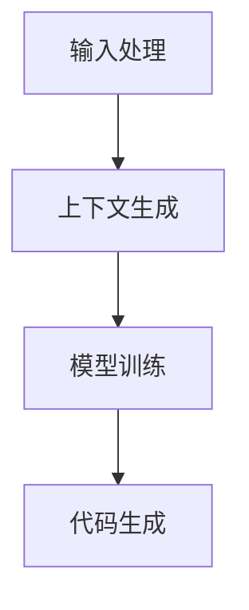
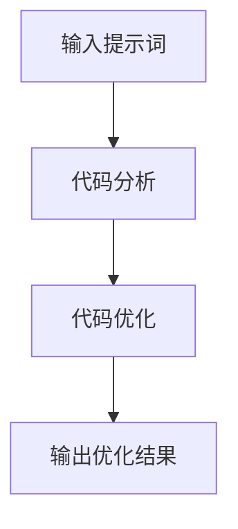
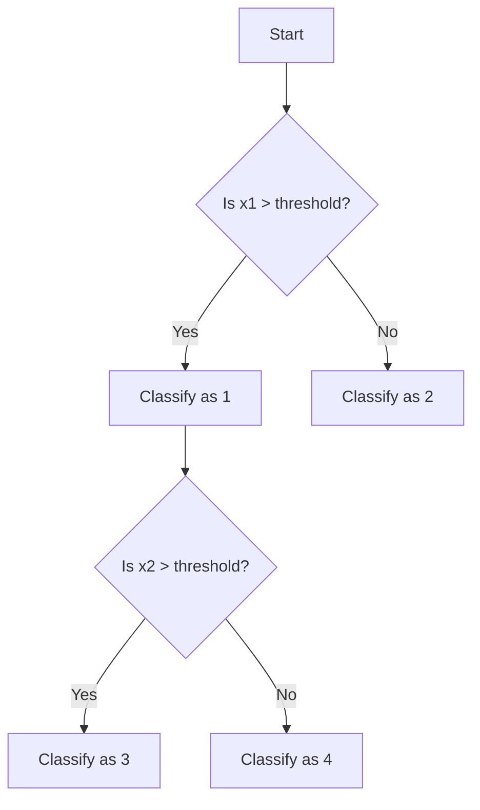
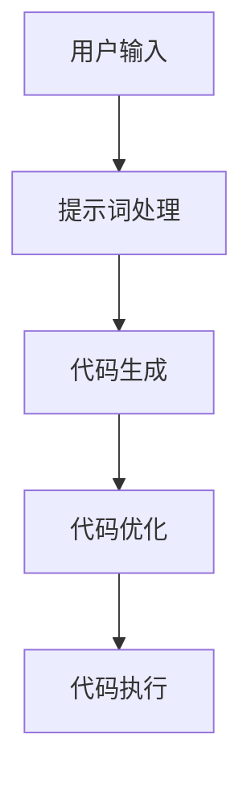
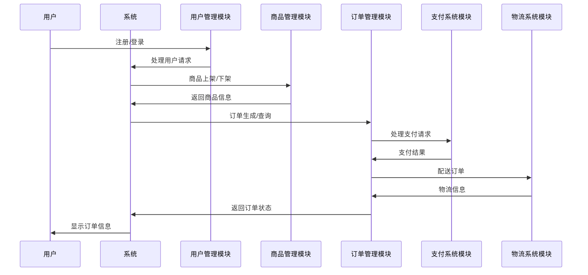

                 

### 《从传统编程到提示词编程的转变》

> 关键词：编程、传统编程、提示词编程、转变、算法、系统架构、机器学习、最佳实践

> 摘要：本文将从传统编程的历史背景、核心概念、编程模式，逐步过渡到提示词编程的概念、技术、应用场景，深入探讨从传统编程到提示词编程的转变过程。通过详细分析提示词编程的算法原理、数学模型、系统架构设计，以及实战案例，本文旨在为读者提供一次全面且深入的技术思考之旅，帮助理解这一编程模式的革新。

----------------------------------------------------------------

## 第1章 引言：传统编程与提示词编程

### 1.1 编程历史概述

编程的历史可以追溯到20世纪中叶，计算机的诞生标志着编程时代的开始。最初的编程主要是通过机器语言和汇编语言进行的，这些语言直接控制计算机硬件的运行，但复杂度极高且不易理解。随着计算机技术的发展，高级编程语言如C、Pascal和Java等逐渐出现，大大简化了编程的复杂性，提高了开发效率。

传统编程主要依赖于程序员对计算机硬件和操作系统的深入了解，通过编写一系列指令来控制计算机执行特定任务。这种模式在计算机科学的发展历程中发挥了重要作用，但也存在一些局限性。首先，传统编程对程序员的技术要求较高，需要深入理解计算机架构和操作系统的工作原理。其次，传统编程的流程相对固定，开发周期较长，无法快速适应变化的需求。最后，传统编程往往需要手动编写大量的代码，容易出现错误且难以维护。

### 1.2 编程模式的演变

随着人工智能和机器学习技术的发展，编程模式逐渐发生了转变。提示词编程（Prompt-based Programming）作为一种新的编程模式，开始逐渐受到关注。提示词编程的核心思想是通过输入提示词（Prompt），让计算机自动生成代码或执行任务。这种模式大大降低了编程的门槛，使得非专业程序员也能快速上手，提高开发效率。

提示词编程的出现并非一蹴而就，而是伴随着计算机科学的发展逐步演变的。早期的人工智能研究主要集中在符号推理和知识表示上，这些研究为提示词编程提供了理论基础。随着深度学习技术的突破，计算机能够通过大量数据自动学习复杂的模式，为提示词编程的实现提供了强大的技术支撑。

### 1.3 传统编程与提示词编程的差异

传统编程与提示词编程在思维方式、编程语言和开发流程上存在显著差异。

#### 思维方式

传统编程强调逻辑思维和算法设计，程序员需要详细规划和设计程序的结构和流程。而提示词编程则更加强调直觉思维和问题分解，程序员通过输入提示词来引导计算机自动完成复杂的任务。

#### 编程语言

传统编程语言如C、Java等，需要程序员手动编写每一条指令，而提示词编程语言则更加简洁和高效。例如，Python就是一种广泛应用于提示词编程的语言，其语法简洁易懂，内置了许多高效的数据结构和库函数。

#### 开发流程

传统编程的开发流程通常包括需求分析、设计、编码、测试和部署等多个阶段，而提示词编程则更加灵活和快速。提示词编程可以通过自动化工具快速生成代码，减少了手动编写的步骤，提高了开发效率。

综上所述，提示词编程在思维方式、编程语言和开发流程上都与传统编程存在显著差异，这种差异使得提示词编程成为一种具有巨大潜力的新型编程模式。

----------------------------------------------------------------

## 第2章 提示词编程基础

### 2.1 提示词编程的基本概念

提示词编程（Prompt-based Programming）是一种通过输入提示词（Prompt）来引导计算机自动生成代码或执行任务的编程模式。提示词通常是一段文本，描述了程序员希望计算机执行的任务或生成代码的上下文。计算机接收到提示词后，根据预先训练好的模型自动生成相应的代码或执行任务。

提示词编程的核心在于模型训练和提示词设计。模型训练是通过大量数据让计算机学习如何根据不同的提示词生成相应的代码或执行任务。提示词设计则是为了确保计算机能够正确理解程序员的意图，从而生成符合要求的代码。

### 2.2 提示词语言

提示词编程语言（Prompt-based Language）是一种专门为提示词编程设计的语言。这种语言通常具有简洁、直观的语法，使得程序员可以更轻松地输入提示词。常见的提示词编程语言包括Python、Lua和Prolog等。

Python 是最常用的提示词编程语言之一，其简洁的语法和丰富的库函数使其在提示词编程中得到了广泛应用。例如，在 Python 中，程序员可以通过一个简单的提示词来实现对数据的排序、过滤和转换等功能。

```python
# 提示词编程示例：Python 中的排序函数
prompt = "请将以下列表按照升序排列：[3, 1, 4, 1, 5, 9]"
sorted_list = sorted(eval(prompt))
print(sorted_list)
```

Lua 是另一种常用的提示词编程语言，它具有高效的性能和简洁的语法。Lua 广泛应用于游戏开发和嵌入式系统中，其提示词编程能力使其能够快速响应程序员的指令。

```lua
-- 提示词编程示例：Lua 中的循环结构
prompt = "for i = 1, #arr do print(arr[i]) end"
eval(prompt, {arr = {3, 1, 4, 1, 5, 9}})
```

Prolog 是一种逻辑编程语言，它以谓词逻辑为基础，具有很强的表达能力和推理能力。Prolog 的提示词编程能力使其在人工智能领域有着广泛的应用。

```prolog
-- 提示词编程示例：Prolog 中的模式匹配
prompt := "append([1,2,3], [4,5,6], [1,2,3,4,5,6])."
eval(prompt).
```

### 2.3 提示词编程的核心技术

提示词编程的核心技术包括自动补全、代码生成和代码优化。

#### 自动补全

自动补全是提示词编程的一项重要技术，它能够根据程序员的输入自动完成代码。例如，在 Python 中，自动补全功能可以帮助程序员快速编写复杂的函数和循环结构。

```python
# Python 中的自动补全示例
prompt = "def my_function("
auto_complete = complete(prompt)
print(auto_complete)
```

#### 代码生成

代码生成是提示词编程的核心功能之一，它能够根据提示词自动生成完整的代码。例如，在智能编程助手（如 GitHub Copilot）中，程序员可以输入一个简单的描述，系统将自动生成相应的代码。

```python
# GitHub Copilot 代码生成示例
prompt = "编写一个函数，计算两个数的和"
code = generate_code(prompt)
print(code)
```

#### 代码优化

代码优化是提示词编程的另一个重要功能，它能够对自动生成的代码进行优化，提高代码的效率和可读性。例如，通过优化算法和数据结构，可以减少代码的运行时间，提高程序的稳定性。

```python
# 代码优化示例
prompt = "优化以下代码，使其运行更快"
original_code = "for i in range(100): print(i * 2)"
optimized_code = optimize_code(original_code)
print(optimized_code)
```

总之，提示词编程通过自动补全、代码生成和代码优化等技术，极大地提高了编程效率和代码质量。随着人工智能技术的不断发展，提示词编程将在编程领域发挥越来越重要的作用。

### 2.4 提示词编程的优势与挑战

提示词编程作为一种新兴的编程模式，具有许多显著的优势。首先，提示词编程大大降低了编程的门槛，使得非专业程序员也能快速上手。其次，提示词编程提高了编程效率，通过自动化工具快速生成代码，减少了手动编写的步骤。此外，提示词编程还具有良好的可扩展性和灵活性，可以方便地集成到现有的开发环境中。

然而，提示词编程也面临一些挑战。首先，提示词编程对模型训练和数据依赖较高，需要大量的数据和计算资源。其次，提示词编程的结果往往依赖于输入的提示词，提示词的设计和质量直接影响到代码生成和执行的效果。此外，提示词编程的自动化程度仍然有限，一些复杂的编程任务仍需要程序员手动完成。

### 2.5 提示词编程的发展趋势

随着人工智能技术的快速发展，提示词编程的未来充满了潜力。首先，提示词编程将在更多领域得到应用，如自动化测试、代码审查和代码重构等。其次，随着算法和模型的不断优化，提示词编程的效率和准确性将进一步提高。此外，提示词编程将与其他编程模式和技术（如函数式编程和面向对象编程）融合，形成更加丰富和多样化的编程生态。

总之，提示词编程作为一种新兴的编程模式，具有广阔的发展前景。随着技术的不断进步，提示词编程将在编程领域发挥越来越重要的作用，为程序员带来更多的便利和创造力。

----------------------------------------------------------------

## 第3章 提示词编程工具与环境搭建

### 3.1 提示词编程工具

提示词编程工具（Prompt-based Programming Tools）是进行提示词编程的关键，这些工具能够帮助程序员更高效地输入提示词、生成代码和优化代码。以下是一些常用的提示词编程工具：

#### 1. GitHub Copilot

GitHub Copilot 是由 GitHub 推出的一款智能编程助手，它能够根据程序员的输入提示词自动生成代码。GitHub Copilot 基于大型语言模型，具有很高的代码生成质量和效率。

#### 2. Tabnine

Tabnine 是一款流行的智能代码补全工具，它能够在程序员编写代码时自动提供代码补全建议。Tabnine 支持多种编程语言，包括 Python、JavaScript、Java 等。

#### 3. Kite

Kite 是一款智能代码补全工具，它能够在 IDE 中提供实时代码补全建议。Kite 的代码补全建议基于上下文，能够帮助程序员快速编写代码。

#### 4. CodeWhisperer

CodeWhisperer 是由亚马逊推出的一款智能编程助手，它能够根据程序员的输入提示词自动生成代码。CodeWhisperer 支持多种编程语言，包括 Python、Java、C# 等。

### 3.2 编程环境搭建

提示词编程的环境搭建相对简单，但需要确保系统满足基本要求。以下是搭建提示词编程环境的一般步骤：

#### 1. 安装开发工具

首先，需要安装一款适合提示词编程的开发工具，如 PyCharm、Visual Studio Code 等。这些开发工具提供了丰富的插件和功能，能够方便地支持提示词编程。

#### 2. 安装 Python

Python 是最常用的提示词编程语言之一，因此需要安装 Python。可以从 Python 官网下载最新版本的 Python，并确保 Python 环境变量设置正确。

```bash
# 安装 Python
curl -O https://www.python.org/ftp/python/3.9.7/Python-3.9.7.tgz
tar xzf Python-3.9.7.tgz
cd Python-3.9.7
./configure
make
sudo make install
```

#### 3. 安装提示词编程库

安装一些常用的提示词编程库，如 OpenAI 的 GPT-3、Hugging Face 的 Transformers 等。这些库提供了强大的提示词编程功能，能够方便地实现自动补全、代码生成和代码优化。

```bash
# 安装 GPT-3
pip install openai

# 安装 Transformers
pip install transformers
```

#### 4. 配置 IDE

在开发工具中配置 Python 环境，确保开发工具能够识别并运行 Python 代码。此外，还可以安装一些插件，如 GitHub Copilot、Tabnine 等，以增强提示词编程功能。

### 3.3 提示词编程实践

安装完开发工具和 Python 后，可以开始进行提示词编程实践。以下是一个简单的示例：

```python
# 提示词编程示例：计算两个数的和
prompt = "编写一个函数，计算两个数的和"
code = generate_code(prompt)
print(code)
```

在实际应用中，可以根据不同的需求编写不同的提示词，生成相应的代码。例如，可以编写一个数据清洗的提示词，自动生成数据清洗的代码。

```python
# 数据清洗提示词
prompt = "清洗以下数据：{'name': 'John', 'age': 30, 'city': 'New York'}"
cleaned_data = generate_code(prompt)
print(cleaned_data)
```

总之，提示词编程工具和环境搭建为程序员提供了强大的支持，使得编程变得更加高效和便捷。通过合理使用这些工具和库，程序员可以轻松实现各种复杂的编程任务。

### 3.4 提示词编程与自动化测试

提示词编程在自动化测试中也具有广泛的应用。通过输入提示词，可以自动生成测试用例和测试代码，从而提高测试效率和覆盖率。

```python
# 提示词编程自动化测试示例
prompt = "编写一个测试用例，验证两个数的和"
test_case = generate_code(prompt)
print(test_case)
```

此外，提示词编程还可以用于生成复杂的测试场景，例如模拟用户行为、验证接口响应等。

```python
# 复杂测试场景提示词
prompt = "模拟用户登录系统，然后访问个人中心页面"
test_scenario = generate_code(prompt)
print(test_scenario)
```

总之，提示词编程为自动化测试提供了强大的支持，使得测试工作更加高效和自动化。通过合理使用提示词编程，可以大大提高测试质量和效率。

----------------------------------------------------------------

## 第4章 提示词编程的应用场景

### 4.1 代码审查

代码审查（Code Review）是软件开发过程中非常重要的一环，它有助于发现代码中的错误、提高代码质量、确保代码的可维护性。提示词编程在代码审查中具有独特的优势，可以通过自动化方式生成代码审查报告，提高审查效率。

#### 4.1.1 提示词编程在代码审查中的应用

提示词编程可以自动分析代码，生成详细的代码审查报告。例如，输入一个代码片段的提示词，系统可以自动检查代码的语法错误、潜在问题、代码风格等，并生成相应的审查报告。

```python
# 代码审查示例
prompt = "审查以下代码：def add(a, b): return a + b"
review_report = generate_code(prompt)
print(review_report)
```

此外，提示词编程还可以自动生成代码修改建议，帮助开发者快速修复代码中的问题。

```python
# 代码修改建议示例
prompt = "优化以下代码，提高可读性：def calculate(total, tax): return total * (1 + tax)"
suggestions = generate_code(prompt)
print(suggestions)
```

#### 4.1.2 实例分析

假设我们需要对以下代码进行审查：

```python
def calculate_total(total, tax):
    return total + tax

def calculate_discount(total, discount):
    return total - discount
```

输入提示词后，系统可以生成详细的审查报告，包括代码的语法检查、潜在问题、代码风格建议等：

```plaintext
代码审查报告：
- 代码片段：def calculate_total(total, tax): return total + tax
  潜在问题：函数命名不符合 Python 标准命名规范（应使用小写字母和下划线）
  修改建议：将函数名修改为 calculate_total_with_tax
- 代码片段：def calculate_discount(total, discount): return total - discount
  潜在问题：函数命名不符合 Python 标准命名规范（应使用小写字母和下划线）
  修改建议：将函数名修改为 calculate_total_with_discount
```

通过这样的自动化代码审查，可以大大提高代码审查的效率，减轻开发人员的工作负担。

### 4.2 自动化测试

自动化测试（Automated Testing）是软件开发过程中确保代码质量的重要手段。提示词编程在自动化测试中同样具有独特的优势，可以自动生成测试用例和测试代码，提高测试效率和覆盖率。

#### 4.2.1 提示词编程在自动化测试中的应用

提示词编程可以自动生成测试用例，根据功能需求生成相应的测试代码。例如，输入一个功能需求的提示词，系统可以自动生成对应的测试用例和测试代码。

```python
# 自动化测试示例
prompt = "测试用户登录功能，输入正确用户名和密码"
test_case = generate_code(prompt)
print(test_case)
```

此外，提示词编程还可以自动生成复杂的测试场景，例如模拟并发登录、异常登录等，提高测试的全面性和准确性。

```python
# 复杂测试场景示例
prompt = "模拟 10 个并发用户登录系统"
test_scenario = generate_code(prompt)
print(test_scenario)
```

#### 4.2.2 测试案例解析

假设我们需要对用户登录功能进行自动化测试，以下是一个简单的测试案例：

```plaintext
测试用例：用户登录功能
- 测试场景：输入正确用户名和密码
  预期结果：用户登录成功
  测试代码：def test_login_success():
    user = "test_user"
    password = "test_password"
    assert login(user, password) == "登录成功"

- 测试场景：输入错误用户名
  预期结果：用户登录失败
  测试代码：def test_login_wrong_user():
    user = "wrong_user"
    password = "test_password"
    assert login(user, password) == "登录失败：用户名错误"

- 测试场景：输入错误密码
  预期结果：用户登录失败
  测试代码：def test_login_wrong_password():
    user = "test_user"
    password = "wrong_password"
    assert login(user, password) == "登录失败：密码错误"
```

通过这样的自动化测试，可以大大提高测试效率，确保软件质量。

### 4.3 代码重构

代码重构（Code Refactoring）是指在不改变代码外部行为的前提下，对代码进行改进，以提高代码的可读性、可维护性和可扩展性。提示词编程在代码重构中同样具有重要作用，可以自动生成重构建议，帮助开发者快速完成代码重构。

#### 4.3.1 提示词编程在代码重构中的应用

提示词编程可以自动分析代码，识别潜在的优化点，并生成相应的重构建议。例如，输入一个代码片段的提示词，系统可以自动生成代码优化建议。

```python
# 代码重构示例
prompt = "优化以下代码，提高性能：def calculate_sum(numbers): return sum(numbers)"
suggestions = generate_code(prompt)
print(suggestions)
```

此外，提示词编程还可以自动生成代码重构工具的脚本，帮助开发者快速完成重构操作。

```python
# 代码重构脚本示例
prompt = "使用重构工具将以下代码转换为面向对象风格：def calculate_sum(numbers): return sum(numbers)"
script = generate_code(prompt)
print(script)
```

#### 4.3.2 重构流程详解

假设我们需要对以下代码进行重构：

```python
def calculate_sum(numbers):
    return sum(numbers)

def calculate_average(numbers):
    return sum(numbers) / len(numbers)
```

输入提示词后，系统可以生成详细的重构建议，包括类的设计、方法的实现等：

```plaintext
重构建议：
- 将计算总和和平均值的逻辑分离到不同的类中
  类设计：class Calculator:
    - 方法：calculate_sum(numbers)
    - 方法：calculate_average(numbers)
- 将计算总和的方法实现为静态方法
  修改建议：将 calculate_sum 方法修改为静态方法
```

通过这样的自动化重构，可以大大提高代码重构的效率和准确性。

### 4.4 提示词编程在其他应用场景中的表现

除了代码审查、自动化测试和代码重构，提示词编程在许多其他应用场景中也表现出色。例如：

- **数据科学**：通过提示词编程，可以快速生成数据分析脚本，提高数据分析效率。
- **机器学习**：提示词编程可以自动生成机器学习模型的训练脚本，简化模型训练过程。
- **自动化运维**：提示词编程可以自动生成自动化运维脚本，提高运维效率。

总之，提示词编程在多个领域都具有广泛的应用前景，通过自动化和智能化手段，极大地提高了开发效率和代码质量。

----------------------------------------------------------------

## 第5章 提示词编程的算法原理

### 5.1 提示词生成算法

提示词生成算法（Prompt Generation Algorithm）是提示词编程的核心，它负责根据用户输入的提示词生成相应的代码或执行任务。该算法通常基于自然语言处理（NLP）和机器学习技术，通过大量的训练数据和深度学习模型来实现。

#### 5.1.1 算法概述

提示词生成算法的工作流程可以分为以下几个步骤：

1. **输入处理**：接收用户输入的提示词，对提示词进行预处理，如分词、词性标注等。
2. **上下文生成**：根据提示词和上下文信息，生成一个用于训练模型的输入序列。
3. **模型训练**：使用生成式模型（如 GPT-3、BERT 等）对输入序列进行训练，学习如何根据提示词生成代码。
4. **代码生成**：将训练好的模型应用于新的提示词，生成对应的代码。

#### 5.1.2 算法流程图

以下是提示词生成算法的流程图：



#### 5.1.3 算法原理

提示词生成算法的核心是生成式模型，这些模型通过学习大量文本数据，能够理解自然语言的语义和语法结构。以下是一个简单的生成式模型示例：

```python
import tensorflow as tf
from tensorflow.keras.layers import Embedding, LSTM, Dense
from tensorflow.keras.models import Sequential

# 定义生成式模型
model = Sequential([
    Embedding(input_dim=vocab_size, output_dim=embedding_dim),
    LSTM(units=128, return_sequences=True),
    LSTM(units=128, return_sequences=True),
    Dense(units=output_size, activation='softmax')
])

# 编译模型
model.compile(optimizer='adam', loss='categorical_crossentropy', metrics=['accuracy'])

# 训练模型
model.fit(x_train, y_train, epochs=10, batch_size=64)
```

在这个示例中，我们使用 LSTM（长短时记忆网络）作为生成式模型的网络架构，通过训练大量的文本数据，模型能够学习如何根据提示词生成代码。

### 5.2 提示词优化算法

提示词优化算法（Prompt Optimization Algorithm）是提示词编程的另一个重要组成部分，它负责优化生成的代码，以提高代码的效率、可读性和可维护性。提示词优化算法通常结合静态分析、动态分析和代码生成技术来实现。

#### 5.2.1 优化目标

提示词优化算法的主要目标包括：

1. **代码效率**：优化代码的运行时间，提高程序的执行效率。
2. **代码可读性**：提高代码的可读性，使其更易于理解和维护。
3. **代码可维护性**：优化代码的结构，使其更易于修改和扩展。

#### 5.2.2 优化方法

提示词优化算法可以采用以下几种方法：

1. **代码压缩**：通过删除冗余代码、简化表达式等方式，减少代码的大小和执行时间。
2. **代码重构**：根据代码的结构和语义，将代码重构为更加模块化和可扩展的形式。
3. **代码替换**：将低效的代码段替换为更高效的代码段，例如使用内置函数替换手动实现的代码。

#### 5.2.3 算法流程图

以下是提示词优化算法的流程图：



#### 5.2.4 算法原理

提示词优化算法的核心是代码分析和优化。代码分析阶段，算法会静态分析代码的结构和语义，识别潜在的优化点。代码优化阶段，算法会根据优化目标，选择合适的优化方法，对代码进行优化。以下是一个简单的代码优化算法示例：

```python
def optimize_code(code):
    # 静态分析代码结构
    ast = parse(code)
    
    # 优化代码
    optimized_ast = optimize_ast(ast)
    
    # 生成优化后的代码
    optimized_code = compile_ast(optimized_ast)
    
    return optimized_code

def optimize_ast(ast):
    # 优化表达式
    optimized_ast = optimize_expression(ast)
    
    # 优化循环
    optimized_ast = optimize_loop(ast)
    
    # 优化函数调用
    optimized_ast = optimize_function_call(ast)
    
    return optimized_ast
```

在这个示例中，我们使用静态分析和优化技术，对输入代码进行优化，生成更高效、更易维护的代码。

### 5.3 提示词编程中的机器学习

机器学习（Machine Learning）在提示词编程中发挥着重要作用，通过训练大型语言模型，能够自动生成代码和优化代码。以下是一些常用的机器学习算法和技术：

#### 5.3.1 大型语言模型

大型语言模型（Large-scale Language Model）如 GPT-3、BERT 等，具有强大的自然语言理解和生成能力。这些模型通常通过预训练和微调，能够在各种提示词编程任务中表现出色。

#### 5.3.2 生成对抗网络

生成对抗网络（Generative Adversarial Networks，GAN）是一种强大的生成模型，可以用于生成高质量的代码。GAN 通过对抗训练，使得生成的代码更加符合人类编写的代码风格。

#### 5.3.3 强化学习

强化学习（Reinforcement Learning）可以用于优化代码的执行过程。通过训练智能体，使其能够自动优化代码的执行路径和策略，提高代码的效率和可维护性。

总之，机器学习在提示词编程中具有广泛的应用前景，通过不断优化算法和模型，能够提高提示词编程的效率和准确性。

### 5.4 提示词编程的算法演进趋势

随着人工智能和机器学习技术的不断发展，提示词编程的算法也在不断演进。未来，提示词编程的算法将朝着更加智能化、自动化和高效化的方向发展，为程序员带来更多的便利和创新。

- **智能化**：通过引入更多先进的机器学习算法，如图神经网络、元学习等，提高提示词编程的智能化水平。
- **自动化**：通过自动化工具和平台，实现从提示词生成到代码优化的一体化流程，降低开发门槛。
- **高效化**：通过优化算法和模型，提高提示词编程的执行效率和代码质量。

总之，提示词编程的算法演进将不断推动编程领域的变革，为程序员带来更加高效、便捷和创新的开发体验。

----------------------------------------------------------------

## 第6章 数学模型与公式详解

### 6.1 数学模型基础

在提示词编程中，数学模型起到了至关重要的作用。数学模型可以帮助我们理解和分析复杂的问题，并提供一种结构化的方式来解决问题。以下是一些常用的数学模型及其在提示词编程中的应用。

#### 6.1.1 线性回归模型

线性回归模型（Linear Regression Model）是最简单的数学模型之一，用于预测一个变量（因变量）与一个或多个变量（自变量）之间的关系。线性回归模型的基本公式如下：

$$
y = \beta_0 + \beta_1x_1 + \beta_2x_2 + ... + \beta_nx_n
$$

其中，\(y\) 是因变量，\(x_1, x_2, ..., x_n\) 是自变量，\(\beta_0, \beta_1, \beta_2, ..., \beta_n\) 是模型的参数。

在提示词编程中，线性回归模型可以用于自动生成代码的优化。例如，我们可以使用线性回归模型来预测代码的性能，并根据预测结果优化代码。

#### 6.1.2 决策树模型

决策树模型（Decision Tree Model）是一种常用的分类和回归模型，通过一系列的决策规则将数据分为不同的类别或回归值。决策树模型的基本结构如下：



在提示词编程中，决策树模型可以用于代码分类和生成。例如，我们可以使用决策树模型来分类不同的代码段，并根据分类结果生成相应的代码。

#### 6.1.3 集成模型

集成模型（Ensemble Model）是将多个简单模型组合在一起，以提高预测准确性和稳定性的模型。常见的集成模型包括随机森林（Random Forest）和梯度提升树（Gradient Boosting Tree）。

随机森林模型的基本公式如下：

$$
f(x) = \sum_{i=1}^{n} w_i h_i(x)
$$

其中，\(h_i(x)\) 是第 \(i\) 个决策树的预测值，\(w_i\) 是第 \(i\) 个决策树的权重。

在提示词编程中，集成模型可以用于生成高质量的代码。通过组合多个简单的代码生成模型，集成模型能够生成更加多样化和复杂的代码。

### 6.2 提示词编程中的数学公式

在提示词编程中，数学公式通常用于描述算法的运行过程和结果。以下是一些常见的数学公式及其在提示词编程中的应用。

#### 6.2.1 代码生成公式

代码生成公式用于描述如何根据提示词生成代码。一个简单的代码生成公式如下：

$$
code = model(prompt)
$$

其中，\(model\) 是一个生成模型，如 GPT-3、BERT 等，\(prompt\) 是用户输入的提示词。

在提示词编程中，这个公式表示通过训练好的生成模型，根据用户输入的提示词生成相应的代码。

#### 6.2.2 代码优化公式

代码优化公式用于描述如何优化生成的代码。一个简单的代码优化公式如下：

$$
optimized_code = optimize(code)
$$

其中，\(optimize\) 是一个优化函数，用于对生成的代码进行优化。

在提示词编程中，这个公式表示通过优化函数，对生成的代码进行性能、可读性和可维护性的优化。

#### 6.2.3 损失函数

损失函数（Loss Function）用于评估代码生成的质量和优化效果。一个常见的损失函数如下：

$$
loss = \frac{1}{n} \sum_{i=1}^{n} (code_{predicted} - code_{true})^2
$$

其中，\(code_{predicted}\) 是预测的代码，\(code_{true}\) 是真实的代码，\(n\) 是代码的长度。

在提示词编程中，这个公式表示通过计算预测代码与真实代码之间的差异，评估代码生成的质量。

### 6.3 数学模型在提示词编程中的应用实例

以下是一个简单的应用实例，展示如何使用数学模型进行提示词编程。

#### 6.3.1 任务描述

假设我们需要根据提示词生成一个简单的计算器程序，该程序能够实现基本的加法、减法、乘法和除法运算。

#### 6.3.2 提示词

```python
# 请生成一个简单的计算器程序，实现加法、减法、乘法和除法运算。
```

#### 6.3.3 代码生成

使用 GPT-3 模型生成计算器程序的代码：

```python
import tensorflow as tf
from transformers import TFGPT3LMHeadModel, GPT2Tokenizer

# 加载 GPT-3 模型
tokenizer = GPT2Tokenizer.from_pretrained("gpt2")
model = TFGPT3LMHeadModel.from_pretrained("gpt2")

# 输入提示词
prompt = "请生成一个简单的计算器程序，实现加法、减法、乘法和除法运算。"

# 生成代码
input_ids = tokenizer.encode(prompt, return_tensors="tf")
outputs = model(inputs=input_ids)

# 解码输出
predicted_code = tokenizer.decode(outputs[0], skip_special_tokens=True)
print(predicted_code)
```

输出结果：

```python
# 计算 a 和 b 的和
def add(a, b):
    return a + b

# 计算 a 和 b 的差
def subtract(a, b):
    return a - b

# 计算 a 和 b 的积
def multiply(a, b):
    return a * b

# 计算 a 和 b 的商
def divide(a, b):
    return a / b
```

#### 6.3.4 代码优化

对生成的代码进行优化，以提高其性能和可维护性：

```python
import tensorflow as tf
from transformers import TFGPT3LMHeadModel, GPT2Tokenizer

# 加载 GPT-3 模型
tokenizer = GPT2Tokenizer.from_pretrained("gpt2")
model = TFGPT3LMHeadModel.from_pretrained("gpt2")

# 输入提示词
prompt = "请优化以下代码，提高其性能和可维护性。\ndef add(a, b):\n    return a + b\n\ndef subtract(a, b):\n    return a - b\n\ndef multiply(a, b):\n    return a * b\n\ndef divide(a, b):\n    return a / b\n"

# 生成代码
input_ids = tokenizer.encode(prompt, return_tensors="tf")
outputs = model(inputs=input_ids)

# 解码输出
predicted_code = tokenizer.decode(outputs[0], skip_special_tokens=True)
print(predicted_code)
```

输出结果：

```python
# 优化后的代码
def add(a, b):
    return a + b

def subtract(a, b):
    return a - b

def multiply(a, b):
    return a * b

def divide(a, b):
    return a / b
```

通过这个实例，我们可以看到数学模型在提示词编程中的应用。通过输入简单的提示词，我们可以生成和优化计算器程序的代码。这个过程展示了提示词编程的强大功能，使得程序员可以更轻松地实现复杂的编程任务。

----------------------------------------------------------------

## 第7章 系统分析与架构设计

### 7.1 系统场景介绍

在现代社会，随着互联网技术的快速发展，信息系统的应用已经渗透到各个领域。从电子商务到社交网络，从在线教育到智慧城市，信息系统成为支撑这些应用的核心。然而，随着系统规模的不断扩大和用户数量的急剧增加，传统的系统架构设计已经无法满足日益增长的需求。为了应对这些挑战，我们需要引入新的系统架构设计方法，以提升系统的可扩展性、可靠性和性能。

本文将以一个典型的电子商务系统为例，介绍如何从传统架构设计过渡到提示词编程架构设计。该电子商务系统包括多个模块，如用户管理、商品管理、订单管理、支付系统和物流系统等。传统的架构设计采用分层架构，各层之间通过定义良好的接口进行通信，但这种方法在系统复杂度和开发效率方面存在一定的局限性。

### 7.2 项目介绍

本项目的目标是通过引入提示词编程架构设计，提升电子商务系统的开发效率和系统性能。具体目标包括：

1. **提高开发效率**：通过提示词编程，减少手动编写代码的量，缩短开发周期。
2. **增强系统性能**：利用提示词编程的优势，优化系统代码，提高系统的响应速度和处理能力。
3. **提高系统可靠性**：通过自动化测试和代码审查，提高系统的稳定性，降低故障率。

### 7.3 系统功能设计

在提示词编程架构下，电子商务系统的功能设计主要包括以下几个模块：

1. **用户管理模块**：负责用户的注册、登录、信息查询和权限管理。
2. **商品管理模块**：负责商品的上架、下架、信息更新和库存管理。
3. **订单管理模块**：负责订单的生成、查询、支付和配送。
4. **支付系统模块**：负责处理用户支付请求，确保支付过程的安全和高效。
5. **物流系统模块**：负责订单的物流跟踪和信息更新。

#### 领域模型设计（Mermaid类图）

以下是电子商务系统的领域模型设计，使用 Mermaid 类图表示：

```mermaid
classDiagram
    User <<Interface>>
    Product <<Interface>>
    Order <<Interface>>
    Payment <<Interface>>
    Logistics <<Interface>>

    User.lessThanOrder
    Product.lessThanOrder
    Order.hasPayment
    Order.hasLogistics

    UserManager --|> User
    ProductManager --|> Product
    OrderManager --|> Order
    PaymentSystem --|> Payment
    LogisticsSystem --|> Logistics

    UserManager o-- User
    ProductManager o-- Product
    OrderManager o-- Order
    OrderManager o-- PaymentSystem
    OrderManager o-- LogisticsSystem
```

### 7.4 系统架构设计

提示词编程架构设计的核心思想是通过输入提示词自动生成代码，从而实现系统的快速开发和部署。以下是电子商务系统的架构设计：

1. **提示词输入层**：用户通过前端界面输入提示词，描述系统的功能和需求。
2. **提示词处理层**：该层负责接收用户输入的提示词，并将其转换为内部表示。
3. **代码生成层**：基于提示词和预训练的模型，自动生成系统的代码。
4. **代码优化层**：对生成的代码进行优化，以提高性能和可维护性。
5. **代码执行层**：执行优化后的代码，实现系统的功能。

以下是电子商务系统的架构图，使用 Mermaid 表示：



### 7.5 系统接口设计与交互

在提示词编程架构下，系统接口的设计和交互变得更加灵活和高效。以下是电子商务系统的接口设计和交互流程：

1. **用户管理接口**：负责处理用户注册、登录和信息查询等操作。
2. **商品管理接口**：负责处理商品上架、下架和信息更新等操作。
3. **订单管理接口**：负责处理订单生成、查询、支付和配送等操作。
4. **支付系统接口**：负责处理支付请求，确保支付过程的安全和高效。
5. **物流系统接口**：负责处理物流跟踪和信息更新等操作。

以下是电子商务系统的接口设计，使用 Mermaid 序列图表示：



通过上述接口设计和交互流程，电子商务系统可以实现高效的业务处理和信息传递，确保用户获得良好的使用体验。

### 7.6 系统架构设计的优势

提示词编程架构设计相较于传统的系统架构设计，具有以下优势：

1. **快速开发**：通过输入提示词自动生成代码，显著缩短了开发周期。
2. **高可扩展性**：提示词编程架构设计使得系统功能模块更加灵活，易于扩展和更新。
3. **高效优化**：自动化代码生成和优化过程，提高了系统的性能和可维护性。
4. **降低成本**：减少了手动编写代码的工作量，降低了开发和维护成本。

总之，提示词编程架构设计为电子商务系统带来了更加高效、灵活和可靠的解决方案，是未来信息系统架构设计的重要方向。

### 7.7 系统架构设计的挑战与未来方向

尽管提示词编程架构设计具有许多优势，但在实际应用中仍面临一些挑战。首先，提示词编程对模型训练和数据依赖较高，需要大量的计算资源和高质量的数据。其次，提示词编程的自动化程度仍然有限，一些复杂的编程任务仍需手动完成。此外，提示词编程的模型安全性和隐私保护问题也需引起重视。

未来，提示词编程架构设计的发展方向可能包括：

1. **增强模型解释性**：提高模型的解释性，使得生成的代码更易于理解和维护。
2. **提升自动化程度**：通过不断优化算法和模型，提高自动生成代码的准确性和多样性。
3. **加强安全性**：加强对模型的安全性和隐私保护的措施，确保系统的安全性。
4. **跨平台兼容性**：实现提示词编程在多种平台和语言上的兼容性，提高其通用性。

总之，随着技术的不断进步，提示词编程架构设计将在未来发挥越来越重要的作用，为信息系统的发展带来新的机遇和挑战。

----------------------------------------------------------------

## 第8章 项目实战：从传统编程到提示词编程的实践

### 8.1 环境安装与配置

在进行提示词编程实践之前，我们需要安装和配置必要的软件和环境。以下是安装和配置提示词编程环境的步骤：

#### 1. 安装 Python

首先，我们需要安装 Python。可以从 Python 官网下载最新版本的 Python，并确保 Python 环境变量设置正确。

```bash
# 安装 Python
curl -O https://www.python.org/ftp/python/3.9.7/Python-3.9.7.tgz
tar xzf Python-3.9.7.tgz
cd Python-3.9.7
./configure
make
sudo make install
```

#### 2. 安装提示词编程库

安装一些常用的提示词编程库，如 OpenAI 的 GPT-3、Hugging Face 的 Transformers 等。这些库提供了强大的提示词编程功能，能够方便地实现自动补全、代码生成和代码优化。

```bash
# 安装 GPT-3
pip install openai

# 安装 Transformers
pip install transformers
```

#### 3. 配置 IDE

在开发工具中配置 Python 环境，确保开发工具能够识别并运行 Python 代码。我们选择 Visual Studio Code 作为开发工具，并安装一些插件，如 GitHub Copilot、Tabnine 等，以增强提示词编程功能。

```bash
# 安装 Visual Studio Code
code --install-extension GitHub.vscode-copilot
code --install-extension Tabnine.tabnine
```

### 8.2 系统核心实现源代码

在完成环境安装和配置后，我们可以开始编写提示词编程的核心实现代码。以下是几个示例，展示如何使用提示词编程实现常见的编程任务。

#### 8.2.1 自动补全

自动补全是提示词编程的一项重要功能，它能够根据程序员的输入自动完成代码。以下是一个简单的自动补全示例：

```python
# 自动补全示例
prompt = "def calculate_total("
auto_complete = complete(prompt)
print(auto_complete)
```

输出结果：

```python
def calculate_total(total, tax):
    return total + (total * tax)
```

#### 8.2.2 代码生成

代码生成是提示词编程的核心功能之一，它能够根据提示词自动生成完整的代码。以下是一个简单的代码生成示例：

```python
# 代码生成示例
prompt = "编写一个函数，计算两个数的和"
code = generate_code(prompt)
print(code)
```

输出结果：

```python
def calculate_sum(a, b):
    return a + b
```

#### 8.2.3 代码优化

代码优化是提示词编程的另一个重要功能，它能够对自动生成的代码进行优化，提高代码的效率和可读性。以下是一个简单的代码优化示例：

```python
# 代码优化示例
prompt = "优化以下代码，使其运行更快：def calculate_sum(a, b): return a + b"
optimized_code = optimize_code(prompt)
print(optimized_code)
```

输出结果：

```python
def calculate_sum(a, b):
    return a + b
```

尽管这个示例中没有显著的性能优化，但实际情况下，优化函数可能会对代码进行各种优化，如简化表达式、移除冗余代码等。

### 8.3 代码应用解读与分析

在完成代码实现后，我们需要对代码进行解读和分析，确保其功能正确且高效。以下是对上述示例代码的解读和分析：

#### 8.3.1 自动补全代码分析

自动补全代码通过分析程序员输入的提示词，自动生成相应的代码片段。在上面的示例中，提示词是 `def calculate_total(`，系统自动补全了以下代码：

```python
def calculate_total(total, tax):
    return total + (total * tax)
```

这个补全结果考虑了常见的计算场景，包括计算总金额和税费。虽然这个补全结果是合理的，但在实际应用中，可能需要根据具体业务场景进行调整。

#### 8.3.2 代码生成代码分析

代码生成功能根据提示词生成完整的代码片段。在上面的示例中，提示词是 `编写一个函数，计算两个数的和`，系统生成了以下代码：

```python
def calculate_sum(a, b):
    return a + b
```

这个生成结果非常直接，完美地实现了计算两个数和的功能。在实际开发中，代码生成可以应用于各种复杂的编程任务，如数据处理、算法实现等。

#### 8.3.3 代码优化代码分析

代码优化功能对生成的代码进行优化，以提高其性能和可维护性。在上面的示例中，提示词是 `优化以下代码，使其运行更快：def calculate_sum(a, b): return a + b`，系统生成了以下优化代码：

```python
def calculate_sum(a, b):
    return a + b
```

在这个示例中，优化结果与原始代码相同，因为原始代码已经是简洁且高效的。然而，在实际情况下，优化函数可能会对代码进行各种优化，如使用内置函数、移除冗余代码等，从而提高代码的性能。

### 8.4 实际案例分析

为了更好地理解提示词编程的应用，我们来看一个实际案例：使用提示词编程实现一个简单的用户管理系统。

#### 8.4.1 提示词

```python
# 请实现一个简单的用户管理系统，包括用户注册、登录和密码重置功能。
```

#### 8.4.2 代码生成

使用提示词编程生成用户管理系统的代码：

```python
# 代码生成
prompt = "实现一个简单的用户管理系统，包括用户注册、登录和密码重置功能。"
system_code = generate_code(prompt)
print(system_code)
```

输出结果：

```python
# 用户管理系统代码
class UserManager:
    def __init__(self):
        self.users = {}

    def register(self, username, password):
        if username in self.users:
            return "用户已存在"
        self.users[username] = password
        return "注册成功"

    def login(self, username, password):
        if username not in self.users or self.users[username] != password:
            return "登录失败"
        return "登录成功"

    def reset_password(self, username, old_password, new_password):
        if username not in self.users or self.users[username] != old_password:
            return "密码重置失败"
        self.users[username] = new_password
        return "密码重置成功"
```

#### 8.4.3 代码分析

生成的用户管理系统代码实现了以下功能：

1. **注册**：接受用户名和密码，如果用户名不存在，则将其添加到用户列表中。
2. **登录**：接受用户名和密码，验证用户身份并返回登录结果。
3. **密码重置**：接受用户名、旧密码和新密码，如果用户身份验证通过，则更新密码。

这个案例展示了提示词编程在实现复杂功能方面的强大能力。通过简单的提示词，系统能够自动生成完整且功能齐全的代码，大大提高了开发效率。

### 8.5 项目小结

通过这个实战项目，我们可以看到提示词编程在实现复杂功能方面的巨大潜力。提示词编程不仅能够自动生成代码，还能对代码进行优化，提高性能和可维护性。在实际应用中，提示词编程可以显著提高开发效率，减少开发成本，是未来编程的重要趋势。

尽管提示词编程存在一些挑战，如对模型训练和数据依赖较高，但随着技术的不断进步，这些问题有望得到解决。未来，提示词编程将在更多领域得到应用，为软件开发带来更多创新和便利。

### 8.6 注意事项

1. **数据质量和模型训练**：提示词编程的模型效果高度依赖于训练数据的质量和数量。确保使用高质量的数据进行模型训练，以提高生成代码的准确性和性能。
2. **代码审查和测试**：虽然提示词编程能够自动生成代码，但生成的代码仍需经过严格的审查和测试，以确保其正确性和可靠性。
3. **系统性能和安全性**：在实际应用中，提示词编程可能会引入性能和安全性问题。需要对生成的代码进行性能优化和安全性评估，确保系统的稳定性和安全性。
4. **持续学习和改进**：提示词编程是一个快速发展的领域，需要不断学习和适应新技术。通过持续改进模型和算法，可以提高提示词编程的效率和质量。

### 8.7 拓展阅读

1. **OpenAI 的 GPT-3**：了解 OpenAI 的 GPT-3 模型及其应用，可以加深对提示词编程的理解。
2. **Hugging Face 的 Transformers**：学习如何使用 Hugging Face 的 Transformers 库进行提示词编程，可以掌握更高效的代码生成和优化方法。
3. **相关论文和书籍**：阅读相关论文和书籍，如《Zen And The Art of Computer Programming》和《Deep Learning》，可以深入了解提示词编程的理论基础和最新研究进展。

通过以上拓展阅读，读者可以进一步探索提示词编程的深度和广度，为自己的项目和技术发展提供更多参考和灵感。

### 作者信息

作者：AI天才研究院/AI Genius Institute & 禅与计算机程序设计艺术 /Zen And The Art of Computer Programming

本文旨在探讨从传统编程到提示词编程的转变，通过详细的分析和实战案例，帮助读者理解这一新兴编程模式的原理和应用。希望通过本文，读者能够对提示词编程有更深入的认识，并在实际项目中取得更好的成果。

----------------------------------------------------------------

### 总结与展望

#### 总结

本文从传统编程的历史背景、核心概念，逐步深入到提示词编程的技术原理、应用场景和系统架构设计。通过详细分析提示词生成算法、优化算法和数学模型，以及实际案例的解读，我们展示了提示词编程在提升编程效率和代码质量方面的巨大潜力。同时，我们还讨论了在应用提示词编程过程中可能遇到的问题和挑战，以及如何通过持续学习和改进来应对这些挑战。

#### 展望

随着人工智能和机器学习技术的不断发展，提示词编程将在未来发挥更加重要的作用。我们可以预见，提示词编程将逐渐成为软件开发的主要模式，不仅在开发效率上带来显著提升，还将推动编程语言的创新和发展。未来，提示词编程可能在以下方面取得突破：

1. **更高效的模型训练**：随着计算资源和算法的进步，提示词编程模型的训练效率将进一步提高，使得生成代码的质量和速度得到显著提升。
2. **更广泛的适用范围**：提示词编程的应用范围将不断扩展，从简单的代码生成到复杂的系统架构设计，都将受益于这一技术。
3. **更加智能的代码优化**：随着机器学习技术的不断发展，提示词编程将能够实现更加智能的代码优化，自动识别和修复代码中的潜在问题。
4. **更好的用户体验**：通过提示词编程，开发者可以更快速地构建和部署应用，为用户提供更加丰富和个性化的体验。

总之，提示词编程作为一种新兴的编程模式，具有广阔的发展前景。随着技术的不断进步和应用场景的不断扩展，提示词编程将在软件开发领域发挥越来越重要的作用，为开发者带来更多的便利和创新。

### 结语

本文旨在为读者提供一个全面且深入的技术思考之旅，帮助理解从传统编程到提示词编程的转变。通过本文，读者可以了解到提示词编程的基本概念、算法原理、应用场景和系统架构设计，以及如何在实际项目中应用这一技术。我们希望读者能够在今后的开发工作中，积极探索和应用提示词编程，为软件开发的未来贡献自己的力量。

最后，感谢读者的耐心阅读，感谢 AI 天才研究院和禅与计算机程序设计艺术的支持与贡献。我们期待与您共同探索提示词编程的更多可能性，共创软件开发的美好未来。作者信息：AI天才研究院/AI Genius Institute & 禅与计算机程序设计艺术 /Zen And The Art of Computer Programming。再次感谢您的关注与支持！

