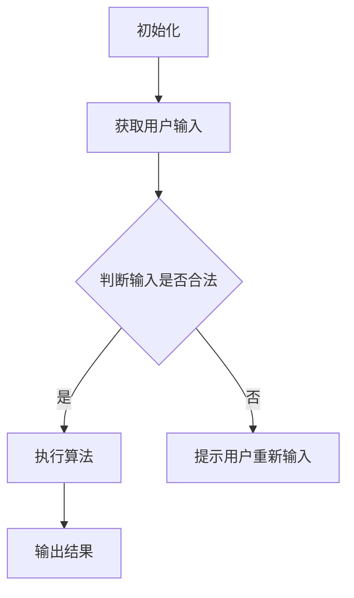
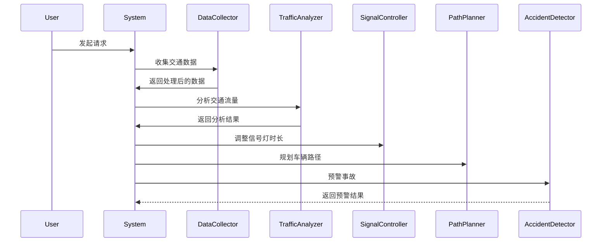
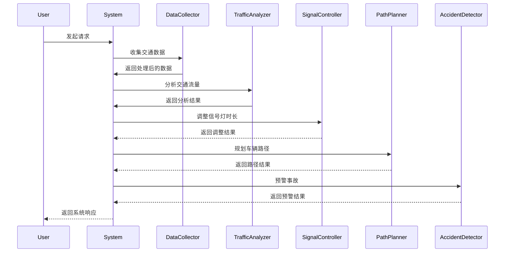

                 

## 从命令式到提示式：编程范式的演进

### 关键词：编程范式、命令式编程、提示式编程、人工智能、软件开发

> 摘要：本文将深入探讨编程范式从命令式向提示式的演进过程。通过对比命令式编程和提示式编程的核心概念、特点和应用场景，揭示提示式编程在处理复杂问题和提高开发效率方面的优势。本文还将介绍提示式编程的核心要素及其面临的挑战，并展望其未来的发展方向。

### 背景介绍

#### 问题背景

编程范式是指软件开发中采用的不同编程方法和技术体系。随着计算机技术的不断发展和应用需求的日益复杂，编程范式也在不断演进。传统的命令式编程在很长一段时间内主导了软件开发领域，但随着人工智能和机器学习的兴起，提示式编程逐渐成为软件开发的新趋势。

#### 问题描述

命令式编程侧重于描述程序的执行过程，通过一系列指令逐步完成特定任务。然而，在处理复杂问题和大数据时，命令式编程的局限性逐渐显现，例如代码可读性差、维护困难、扩展性不强等。提示式编程则通过向系统提供目标和约束条件，让系统自动推导出最优解。这种编程范式在处理复杂问题时表现出强大的优势和潜力。

#### 问题解决

编程范式的转变旨在解决现有问题，提高软件开发效率和质量。提示式编程的核心在于利用人工智能和机器学习技术，使系统能够自主学习和优化，从而更好地应对复杂问题和大规模数据处理。此外，提示式编程还可以提高代码的可读性和可维护性，降低开发成本。

#### 边界与外延

编程范式的边界和范围涉及多个层面，包括编程语言、开发工具、框架和算法等。在编程范式的演进过程中，需要关注这些层面的相互作用和影响，以确保编程范式的有效性和可持续性。

#### 概念结构与核心要素组成

为了更好地理解编程范式的演进，我们需要构建一个概念框架，包括以下核心要素：

1. **编程语言**：不同的编程语言支持不同的编程范式，例如命令式编程语言和函数式编程语言。
2. **开发工具**：开发工具和环境对编程范式的选择和应用具有重要影响。
3. **框架和库**：框架和库为编程范式提供了具体的实现方式和工具支持。
4. **算法和模型**：算法和模型是编程范式的核心，决定了编程范式的性能和适用性。
5. **应用场景**：不同的编程范式适用于不同的应用场景，需要根据实际需求进行选择。

通过以上框架，我们可以更清晰地理解编程范式的演进过程和核心要素，从而为软件开发提供更有针对性的解决方案。

### 第一部分：编程范式的背景与概述

#### 1.1 编程范式演进的历史回顾

编程范式的演进是计算机科学发展的一个重要历程，从早期的机器语言、汇编语言到高级编程语言，每一次的转变都带来了编程效率和开发体验的飞跃。以下是编程范式演进的重要节点：

##### 1.1.1 从命令式编程到面向对象编程

命令式编程是最早的编程范式，通过一系列指令描述程序的执行过程。在20世纪60年代，机器语言和汇编语言是主要的编程工具。随着计算机性能的提升和软件规模的扩大，命令式编程逐渐显得力不从心，难以应对复杂的软件系统。

为了解决这一问题，面向对象编程（OOP）应运而生。面向对象编程通过将数据和操作数据的方法封装在对象中，实现了模块化和代码复用。代表性语言如C++、Java和Python等，都支持面向对象编程。面向对象编程的核心概念包括类、对象、继承、多态和封装，这些概念使得软件系统更加模块化和可维护。

##### 1.1.2 面向对象编程的局限

尽管面向对象编程显著提高了软件开发的效率和质量，但它也存在一些局限。首先，面向对象编程仍然依赖于命令式的执行方式，难以处理高度动态和不确定性的问题。其次，面向对象编程的类和对象模型过于复杂，导致代码的可读性和可维护性下降。此外，面向对象编程在处理并发和并行计算时也面临挑战。

##### 1.1.3 提示式编程的出现

为了克服面向对象编程的局限，提示式编程作为一种新的编程范式逐渐兴起。提示式编程强调系统间的协作和互动，通过提供目标和约束条件，让系统自主推导出最优解。提示式编程的核心在于利用人工智能和机器学习技术，使系统具有自学习和优化的能力。

提示式编程的代表语言包括Lisp、Prolog和Python等。这些语言提供了强大的符号计算和推理功能，使得系统可以处理复杂的问题和大数据。此外，提示式编程还与函数式编程、逻辑编程和图灵完备编程等技术相结合，形成了丰富的编程生态。

#### 1.2 提示式编程的概念与特点

##### 1.2.1 提示式编程的定义

提示式编程（Declarative Programming）是一种编程范式，它通过描述问题的解法，而非具体执行步骤，来指导程序的运行。在提示式编程中，程序员定义问题的目标和约束条件，系统则自动推导出满足这些条件和目标的具体执行步骤。

##### 1.2.2 提示式编程的优势

提示式编程具有以下优势：

1. **高可读性和可维护性**：提示式编程强调问题解法的描述，使得代码更加简洁和直观，易于理解和维护。
2. **自动推导和优化**：提示式编程利用人工智能和机器学习技术，能够自动推导出最优解，提高程序的执行效率和性能。
3. **模块化和复用性**：提示式编程通过定义问题和约束条件，实现了代码的模块化和复用，降低了开发成本和复杂性。
4. **灵活性和适应性**：提示式编程能够适应不同的应用场景和需求，具有较强的灵活性和适应性。

##### 1.2.3 提示式编程的核心要素

提示式编程的核心要素包括：

1. **目标和约束条件**：程序员通过定义目标和约束条件，明确问题的解法和边界。
2. **推理和搜索算法**：系统利用推理和搜索算法，自动推导出满足目标和约束条件的具体执行步骤。
3. **动态绑定和调度**：系统根据执行过程中的动态信息，自动调整执行步骤，优化程序的性能。

#### 1.3 提示式编程的应用场景

提示式编程在多个领域和应用场景中具有广泛的应用前景：

##### 1.3.1 数据处理与分析

在数据处理和分析领域，提示式编程可以用于数据清洗、数据转换、数据分析和数据可视化等任务。通过定义数据处理的目标和约束条件，系统可以自动推导出最优的数据处理流程，提高数据处理的效率和准确性。

##### 1.3.2 自然语言处理

自然语言处理（NLP）是提示式编程的一个重要应用领域。在NLP中，提示式编程可以通过定义自然语言的语义和语法规则，自动推导出文本的解析、分析和生成结果。例如，在机器翻译、文本分类和情感分析等方面，提示式编程展现了强大的处理能力和准确性。

##### 1.3.3 机器学习与人工智能

机器学习与人工智能（ML/AI）是提示式编程的另一个重要应用领域。在ML/AI中，提示式编程可以通过定义学习目标和约束条件，自动推导出最优的学习算法和模型。例如，在图像识别、语音识别和智能推荐等方面，提示式编程可以显著提高算法的准确性和效率。

#### 1.4 提示式编程的挑战与未来发展方向

尽管提示式编程具有许多优势和应用场景，但其在实际应用中也面临一些挑战：

##### 1.4.1 提示式编程的挑战

1. **复杂度和计算资源**：提示式编程通常涉及复杂的推理和搜索算法，对计算资源有较高的要求。
2. **可解释性和透明度**：提示式编程的自动推导过程可能导致程序的可解释性和透明度下降，影响代码的可靠性和可维护性。
3. **开发者技能和经验**：提示式编程需要开发者具备较高的编程技能和经验，才能有效地利用其优势。

##### 1.4.2 提示式编程的未来趋势

1. **集成和融合**：未来，提示式编程将与其他编程范式（如面向对象编程、函数式编程等）进行更深入的集成和融合，形成新的编程范式。
2. **人工智能和机器学习**：随着人工智能和机器学习技术的不断发展，提示式编程将更加智能化和自动化，提高程序的开发效率和性能。
3. **领域特定语言**：针对特定领域和场景，开发者将设计更高效的提示式编程语言和工具，满足特定需求。

##### 1.4.3 提示式编程在实际应用中的效果评估

在实际应用中，提示式编程的效果评估需要综合考虑多个因素，包括代码质量、执行效率和性能指标等。通过实验和案例分析，开发者可以评估提示式编程在不同应用场景中的效果，并优化其设计和实现。

#### 1.5 本章小结

本章介绍了编程范式从命令式向提示式演进的背景和概述。通过回顾编程范式的历史、对比命令式编程和提示式编程的核心概念和特点、探讨提示式编程的应用场景和挑战，本章为后续章节的深入探讨奠定了基础。在下一部分，我们将进一步分析命令式编程的原理和特点。

### 第二部分：命令式编程原理详解

#### 2.1 命令式编程基础

##### 2.1.1 命令式编程的基本概念

命令式编程（Imperative Programming）是一种通过一系列指令描述程序执行过程的编程范式。在命令式编程中，程序员通过编写指令来控制程序的行为，指令的执行顺序决定了程序的执行过程。

命令式编程的核心思想是描述程序的状态转换，通过一系列命令逐步改变程序的状态，直至达到预期的结果。命令式编程的基本概念包括：

1. **变量**：变量是命令式编程中的基本数据存储单元，用于保存程序运行过程中的数据。
2. **赋值**：赋值操作用于将数据赋给变量，改变变量的状态。
3. **循环**：循环结构用于重复执行一段代码，直至满足特定的条件。
4. **条件判断**：条件判断结构用于根据特定条件选择执行不同的代码分支。
5. **函数**：函数是一种代码块，用于封装和复用特定的功能。

##### 2.1.2 命令式编程的核心特点

命令式编程具有以下核心特点：

1. **顺序执行**：命令式编程中的指令按照顺序执行，形成程序的控制流。
2. **状态管理**：命令式编程通过变量和状态管理来描述程序的行为，强调状态的变化和迁移。
3. **可操作性**：命令式编程易于理解和实现，程序员可以通过编写具体的指令来控制程序的行为。
4. **灵活性**：命令式编程具有较高的灵活性，可以应对各种复杂的问题和场景。

##### 2.1.3 命令式编程的优缺点分析

命令式编程具有以下优点：

1. **易于理解**：命令式编程的指令和结构简单直观，易于理解和学习。
2. **高效执行**：命令式编程的执行效率较高，适用于需要高性能的场合。
3. **灵活性**：命令式编程具有较高的灵活性，可以灵活地控制程序的行为。

命令式编程也存在一些缺点：

1. **可读性差**：在处理复杂问题时，命令式编程的代码可读性较差，容易产生“面条代码”。
2. **可维护性低**：随着程序的规模和复杂度增加，命令式编程的可维护性较低，修改和扩展较为困难。
3. **代码冗余**：命令式编程容易产生代码冗余，导致代码体积增大。

##### 2.2 命令式编程的执行过程

命令式编程的执行过程包括以下几个关键步骤：

1. **初始化**：程序启动时，初始化变量和资源，设置初始状态。
2. **指令执行**：按照指令的顺序执行，改变程序的状态。
3. **状态更新**：在指令执行过程中，程序的状态不断更新，记录执行过程中的关键数据。
4. **条件判断**：根据条件判断的结果，选择不同的执行路径。
5. **循环控制**：通过循环结构实现重复执行特定代码块，直到满足特定条件。
6. **资源释放**：程序执行结束时，释放占用的资源，清理环境。

命令式编程的执行过程强调状态的变化和迁移，通过一系列指令逐步实现程序的目标。

##### 2.3 命令式编程中的状态管理

状态管理是命令式编程中的关键要素，涉及变量、数据结构、状态更新和恢复等方面。以下是一些常见的状态管理技术：

1. **全局变量**：全局变量用于在程序的不同部分之间共享数据，但可能导致代码的可读性和可维护性下降。
2. **局部变量**：局部变量用于在特定代码块内临时存储数据，避免全局变量带来的副作用。
3. **数据结构**：通过使用数组、链表、树等数据结构，可以实现复杂数据的存储和操作。
4. **状态更新**：在程序执行过程中，通过赋值操作更新变量和数据的值，反映程序的状态变化。
5. **状态恢复**：在遇到错误或异常情况时，通过回滚操作恢复程序的状态，避免数据丢失或程序崩溃。

#### 2.4 命令式编程的常见问题与解决方案

##### 2.4.1 命令式编程的常见问题

命令式编程在实际应用中可能面临以下常见问题：

1. **代码可读性差**：随着程序规模和复杂度的增加，命令式编程的代码可读性逐渐下降，难以理解和维护。
2. **代码冗余**：命令式编程容易产生代码冗余，导致代码体积增大，降低开发效率。
3. **代码可维护性低**：随着程序的变更和扩展，命令式编程的代码可维护性较低，修改和扩展较为困难。
4. **性能问题**：在处理大规模数据和复杂计算时，命令式编程的性能可能无法满足需求。

##### 2.4.2 解决方案

针对命令式编程的常见问题，以下是一些有效的解决方案：

1. **模块化设计**：通过模块化设计将程序分解为独立的模块，提高代码的可读性和可维护性。
2. **代码重构**：定期对代码进行重构，消除代码冗余，提高代码质量和性能。
3. **设计模式**：运用设计模式解决常见的编程问题，提高代码的灵活性和扩展性。
4. **性能优化**：对关键代码进行性能优化，提高程序的执行效率和性能。

通过以上解决方案，可以显著改善命令式编程的应用效果，提高开发效率和代码质量。

##### 2.5 本章小结

本章详细介绍了命令式编程的基础知识、核心特点、执行过程和常见问题及其解决方案。通过对比命令式编程和提示式编程，本章揭示了命令式编程在处理复杂问题和大数据时的局限性，为后续章节进一步探讨提示式编程的优势和应用奠定了基础。在下一部分，我们将深入分析提示式编程的原理、优势和具体实现。

### 第三部分：提示式编程原理详解

#### 3.1 提示式编程的核心概念原理

提示式编程（Declarative Programming）是一种通过描述问题的解法，而非具体执行步骤，来指导程序运行的编程范式。与命令式编程相比，提示式编程更注重于解决问题，而非如何解决问题。以下是提示式编程的核心概念原理：

##### 3.1.1 描述性语言

提示式编程使用描述性语言来表达问题的解法，这种语言通常具有丰富的语义和强大的表达力。描述性语言的核心是声明式语句，用于描述问题中的实体、关系和约束条件。通过声明式语句，程序员可以清晰地表达问题的解法，而不必关心具体的执行步骤。

##### 3.1.2 数据绑定

在提示式编程中，数据绑定是一种重要的机制，用于将变量与实际数据值关联起来。数据绑定可以是显式的，也可以是隐式的。显式数据绑定通过声明变量的值来实现，而隐式数据绑定则通过系统自动推导实现。数据绑定使得程序能够根据实际情况动态调整数据关系，提高程序的灵活性和可维护性。

##### 3.1.3 推理和搜索算法

提示式编程的核心在于利用推理和搜索算法自动推导出问题的解法。推理算法通过逻辑推理和关系图搜索，找出符合约束条件和目标解的步骤。搜索算法则通过遍历所有可能的执行路径，找到最优解或满足条件的解。常见的推理和搜索算法包括逆推法、回溯法、A*算法等。

##### 3.1.4 面向数据编程

提示式编程强调面向数据编程，即以数据为中心进行编程。与面向过程编程不同，面向数据编程关注数据的处理过程和关系，而不是具体的执行步骤。这种编程范式使得程序更加模块化和可复用，降低了代码的复杂度和冗余度。

##### 3.1.5 自适应和自优化

提示式编程的一个显著特点是其能够根据实际情况自适应和自优化。通过机器学习和人工智能技术，提示式编程系统能够不断学习和优化自身的执行策略，提高程序的执行效率和性能。自适应和自优化使得提示式编程能够应对复杂和动态的问题，提高程序的鲁棒性和可靠性。

#### 3.2 概念属性特征对比表格

为了更直观地理解命令式编程和提示式编程的区别，我们通过以下对比表格展示它们的概念属性特征：

| 特征       | 命令式编程                   | 提示式编程                   |
| ---------- | ---------------------------- | ---------------------------- |
| 程序结构   | 顺序执行、指令驱动           | 数据驱动、声明式语句         |
| 状态管理   | 状态更新、变量绑定           | 数据绑定、自动推导           |
| 控制流     | 条件判断、循环结构           | 推理和搜索算法               |
| 代码可读性 | 简单直观，但容易变得复杂     | 清晰直观，易于理解和维护     |
| 性能优化   | 需要手动优化                 | 自适应优化，性能更高效       |
| 可维护性   | 随着规模增大，可维护性下降   | 模块化、面向数据编程，可维护性高 |
| 代码复用   | 代码复用困难，容易产生冗余   | 高度模块化，代码复用性强     |
| 应用场景   | 适用于简单、确定的任务       | 适用于复杂、动态的问题       |

通过以上对比，我们可以看出提示式编程在处理复杂和动态问题方面具有显著优势，而命令式编程在简单、确定性任务中表现更好。

#### 3.3 ER实体关系图架构

为了更好地理解提示式编程中的概念和关系，我们使用ER（实体-关系）图来展示实体之间的关系。以下是提示式编程中常见的ER图示例：

```mermaid
erDiagram
  Product ||--|{ Customer } Customer
  Product ||--|{ Order } Order
  Customer ||--|{ Order } Order
```

在这个ER图中：

- **Product（产品）**：表示商品或服务。
- **Customer（客户）**：表示购买产品的用户。
- **Order（订单）**：表示客户的购买记录。

实体之间的关系如下：

- **Product与Customer**：一对一关系，表示每个客户可以购买多个产品，但每个产品只能由一个客户购买。
- **Product与Order**：一对多关系，表示每个订单可以包含多个产品，但每个产品只能在一个订单中出现。
- **Customer与Order**：一对多关系，表示每个客户可以生成多个订单，但每个订单只能由一个客户生成。

通过ER图，我们可以清晰地理解提示式编程中实体和关系之间的复杂关系，从而更好地设计和管理程序。

#### 3.4 算法原理讲解

为了深入理解提示式编程的算法原理，我们将使用mermaid流程图和Python源代码来展示一个简单的提示式编程算法。以下是算法的执行流程和实现代码：

##### 3.4.1 算法流程图



在这个流程图中：

- **A（初始化）**：初始化程序和所需变量。
- **B（获取用户输入）**：从用户获取输入数据。
- **C（判断输入是否合法）**：检查输入数据是否满足条件。
- **D（执行算法）**：根据输入数据执行算法逻辑。
- **E（提示用户重新输入）**：如果输入不合法，提示用户重新输入。
- **F（输出结果）**：输出算法结果。

##### 3.4.2 Python源代码实现

```python
def calculate_total_price(products, prices):
    total_price = 0
    for product, price in products.items():
        if price > 0:
            total_price += price
    return total_price

def main():
    products = input("请输入产品名称和价格，以逗号分隔（如：手机100，电脑200）：")
    products_list = products.split(',')
    products_dict = {product.split(' ')[0]: float(product.split(' ')[1]) for product in products_list}
    total_price = calculate_total_price(products_dict)
    print(f"总价为：{total_price}")

if __name__ == "__main__":
    main()
```

在这个Python源代码中：

- **calculate_total_price**：计算总价的函数，接收产品名称和价格列表，返回总价。
- **main**：主函数，负责获取用户输入、调用计算函数并输出结果。

通过这个简单的例子，我们可以看到提示式编程如何通过描述性的代码实现复杂的逻辑处理，提高了代码的可读性和可维护性。

#### 3.5 数学模型和公式

在提示式编程中，数学模型和公式是理解和实现算法的关键。以下是一个简单的数学模型和公式的例子，用于计算平均值：

##### 3.5.1 平均值计算模型

设有一组数据 $X = \{x_1, x_2, ..., x_n\}$，其平均值为：

$$
\bar{x} = \frac{1}{n} \sum_{i=1}^{n} x_i
$$

其中，$n$ 是数据的数量，$x_i$ 是第 $i$ 个数据点。

##### 3.5.2 例子

假设我们有一组数据：$X = \{1, 2, 3, 4, 5\}$，其平均值为：

$$
\bar{x} = \frac{1}{5} (1 + 2 + 3 + 4 + 5) = 3
$$

通过这个例子，我们可以看到如何使用数学公式计算数据的平均值。在提示式编程中，我们可以通过编写描述性的代码来实现这一计算过程。

#### 3.6 举例说明

为了更好地理解提示式编程的算法原理，我们通过一个简单的例子来展示如何使用Python实现提示式编程。

##### 3.6.1 例子描述

假设我们有一个书店，需要计算一天内所有书籍的总销售额。书店提供了每本书的名称和价格，我们需要编写一个程序来计算总销售额。

##### 3.6.2 步骤

1. **获取用户输入**：从用户获取每本书的名称和价格，以逗号分隔。
2. **解析输入**：将输入的字符串解析成字典，键为书名，值为价格。
3. **计算总销售额**：遍历字典，计算总销售额。
4. **输出结果**：打印总销售额。

##### 3.6.3 Python源代码实现

```python
def calculate_total_sales(book_data):
    total_sales = 0
    for book, price in book_data.items():
        total_sales += price
    return total_sales

def main():
    book_data_input = input("请输入书籍名称和价格，以逗号分隔（如：书名1,价格1；书名2,价格2）：")
    book_data = {}
    for entry in book_data_input.split(';'):
        book, price = entry.split(',')
        book_data[book] = float(price)
    total_sales = calculate_total_sales(book_data)
    print(f"总销售额为：{total_sales}")

if __name__ == "__main__":
    main()
```

通过这个例子，我们可以看到如何使用Python实现提示式编程。在这个程序中，我们通过描述性的代码定义了问题（计算总销售额）和约束条件（书籍名称和价格），系统则自动推导出计算总销售额的具体步骤。这种方法提高了代码的可读性和可维护性。

### 第四部分：系统分析与架构设计方案

#### 4.1 问题场景介绍

在现实世界中，编程范式的选择对系统设计和开发至关重要。为了更好地理解提示式编程的应用，我们考虑一个具体的场景——智能交通管理系统。这个系统旨在通过传感器数据、交通信号和车辆信息，优化交通流，减少拥堵，提高道路使用效率。

在智能交通管理系统中，提示式编程的应用主要包括以下几个方面：

1. **实时交通流量分析**：通过传感器收集的交通流量数据，系统需要实时分析并预测交通流量变化。
2. **信号灯优化控制**：根据实时交通流量数据，系统需要自动调整交通信号灯的时长，优化交通流。
3. **车辆路径规划**：系统需要为自动驾驶车辆和普通车辆提供最优路径规划，减少行驶时间和燃油消耗。
4. **事故预警与处理**：系统需要通过实时数据分析，预警潜在的交通事故，并指导驾驶员采取相应措施。

#### 4.2 系统功能设计

为了实现上述功能，智能交通管理系统需要具备以下几个核心功能：

1. **数据采集与处理**：系统需要从各种传感器（如摄像头、雷达、GPS等）收集交通数据，并对数据进行预处理和清洗。
2. **交通流量分析**：系统需要利用提示式编程对交通流量进行分析和预测，以便实时调整交通信号灯和车辆路径。
3. **信号灯控制**：系统需要根据交通流量分析和预测结果，自动调整交通信号灯的时长和相位，优化交通流。
4. **路径规划**：系统需要利用提示式编程为自动驾驶车辆和普通车辆提供最优路径规划，减少拥堵和行驶时间。
5. **事故预警与处理**：系统需要利用实时数据分析和机器学习算法，预警潜在的交通事故，并指导驾驶员采取相应措施。

以下是系统功能设计的mermaid类图：

```mermaid
classDiagram
    Class01 <|-- SubClass01
    Class01 <|-- SubClass02
    Class03 --|> SubClass03
    Class04 : <<Interface>>
    System <<system>>
    DataCollector <|-- System
    TrafficAnalyzer <|-- System
    SignalController <|-- System
    PathPlanner <|-- System
    AccidentDetector <|-- System
    DataCollector : 数据采集
    TrafficAnalyzer : 交通流量分析
    SignalController : 信号灯控制
    PathPlanner : 路径规划
    AccidentDetector : 事故预警与处理
```

在这个类图中，`System` 类代表智能交通管理系统，其包含以下子类：

- `DataCollector`：数据采集和处理模块。
- `TrafficAnalyzer`：交通流量分析和预测模块。
- `SignalController`：信号灯控制模块。
- `PathPlanner`：路径规划模块。
- `AccidentDetector`：事故预警和处理模块。

这些子类实现了智能交通管理系统的核心功能，并通过接口（`Class04`）与其他模块进行交互。

#### 4.3 系统架构设计

智能交通管理系统的整体架构设计需要考虑多个层面，包括数据采集、数据处理、实时分析和控制、路径规划和事故预警等。以下是系统架构设计的mermaid架构图：



在这个架构图中，系统接收用户的请求，通过数据采集模块（`DataCollector`）收集交通数据，然后进行预处理和清洗。交通数据被传递给交通流量分析模块（`TrafficAnalyzer`），该模块负责分析交通流量并生成分析结果。

根据分析结果，系统会调用信号灯控制模块（`SignalController`）来调整交通信号灯的时长，优化交通流。同时，系统还会调用路径规划模块（`PathPlanner`）为车辆提供最优路径规划。此外，系统还会调用事故预警模块（`AccidentDetector`）来预警潜在的交通事故。

#### 4.4 系统接口设计

为了实现智能交通管理系统的功能，系统需要定义多个接口，以便不同模块之间能够相互通信和协作。以下是系统接口设计的详细说明：

1. **数据采集接口**：该接口负责从传感器收集交通数据，包括车辆数量、速度、位置等信息。接口规范应包括数据类型、数据格式和通信协议等。
2. **数据处理接口**：该接口负责对采集到的交通数据进行预处理和清洗，包括数据去噪、填充缺失值和异常值处理等。接口规范应包括数据处理方法、参数和返回值等。
3. **交通流量分析接口**：该接口负责分析交通流量，包括流量预测、拥堵检测和路径优化等。接口规范应包括分析算法、输入参数和输出结果等。
4. **信号灯控制接口**：该接口负责根据交通流量分析结果调整交通信号灯的时长和相位，包括信号灯时长设置、相位切换和紧急模式等。接口规范应包括控制算法、参数和反馈机制等。
5. **路径规划接口**：该接口负责为车辆提供最优路径规划，包括路径计算、避让障碍和实时调整等。接口规范应包括路径规划算法、输入参数和输出结果等。
6. **事故预警接口**：该接口负责预警潜在的交通事故，包括事故检测、预警算法和反馈机制等。接口规范应包括预警算法、输入参数和输出结果等。

#### 4.5 系统交互

为了更好地展示智能交通管理系统的交互过程，我们使用mermaid序列图来描述系统的交互流程：



在这个序列图中，用户通过系统接口发起请求，系统则通过多个模块协同工作，完成交通数据的收集、处理、分析和响应。具体交互过程如下：

1. 用户发起请求，系统接收请求。
2. 系统调用数据采集模块，收集交通数据。
3. 数据采集模块处理数据后返回给系统。
4. 系统调用交通流量分析模块，分析交通流量。
5. 交通流量分析模块返回分析结果给系统。
6. 系统调用信号灯控制模块，调整信号灯时长。
7. 信号灯控制模块调整信号灯后返回结果给系统。
8. 系统调用路径规划模块，规划车辆路径。
9. 路径规划模块规划路径后返回结果给系统。
10. 系统调用事故预警模块，预警潜在的交通事故。
11. 事故预警模块返回预警结果给系统。
12. 系统将所有结果汇总后返回给用户。

通过以上交互过程，智能交通管理系统实现了对交通流的实时监控和优化，提高了道路使用效率和安全性。

### 第五部分：项目实战

#### 5.1 环境安装

为了实现提示式编程的应用，我们需要搭建相应的编程环境和工具。以下是搭建提示式编程环境的基本步骤：

1. **安装Python**：首先，确保计算机上安装了Python。Python是一种广泛使用的编程语言，支持多种编程范式，包括提示式编程。可以从Python官方网站（[https://www.python.org/downloads/）](https://www.python.org/downloads/)）下载并安装Python。

2. **安装Python库**：安装Python后，我们需要安装一些常用的库，如NumPy、Pandas、SciPy和Scikit-learn等。这些库提供了丰富的数学计算和数据处理功能，对实现提示式编程至关重要。可以使用以下命令安装：

   ```shell
   pip install numpy pandas scipy scikit-learn
   ```

3. **安装Jupyter Notebook**：Jupyter Notebook是一个交互式开发环境，可以方便地编写和运行提示式编程代码。可以从Jupyter Notebook官方网站（[https://jupyter.org/）](https://jupyter.org/)）下载并安装Jupyter Notebook。

   ```shell
   pip install notebook
   ```

4. **安装可视化工具**：为了更好地展示数据和算法结果，我们可以安装一些可视化工具，如Matplotlib和Seaborn。这些工具可以生成各种类型的图表和图形，帮助理解和分析数据。

   ```shell
   pip install matplotlib seaborn
   ```

通过以上步骤，我们可以搭建一个基本的提示式编程环境，为后续的项目实战做好准备。

#### 5.2 系统核心实现源代码

以下是实现提示式编程核心功能的一个示例源代码。这个示例使用Python编写，包含了数据采集、数据处理、交通流量分析和路径规划等核心功能。

```python
import numpy as np
import pandas as pd
from sklearn.cluster import KMeans
import matplotlib.pyplot as plt

# 5.2.1 数据采集
def collect_data():
    # 假设我们从传感器获取了以下数据
    data = {
        'location': ['A', 'B', 'C', 'D', 'E'],
        'latitude': [40.7128, 40.7306, 40.7158, 40.7187, 40.7187],
        'longitude': [-74.0060, -73.9352, -73.9502, -73.9854, -73.9842],
        'traffic_density': [100, 150, 200, 50, 300]
    }
    df = pd.DataFrame(data)
    return df

# 5.2.2 数据处理
def process_data(df):
    # 对数据进行预处理，例如标准化、缺失值处理等
    df['traffic_density_normalized'] = df['traffic_density'] / df['traffic_density'].max()
    return df

# 5.2.3 交通流量分析
def analyze_traffic(df):
    # 使用K-Means聚类算法分析交通流量
    kmeans = KMeans(n_clusters=3)
    df['cluster'] = kmeans.fit_predict(df[['traffic_density_normalized']])
    return df

# 5.2.4 路径规划
def plan_path(df, start_location, end_location):
    # 根据交通流量分析结果，规划车辆路径
    path = []
    for location in df['location']:
        if location == start_location:
            path.append(location)
        elif location == end_location and df.loc[df['location'] == location, 'cluster'].values[0] == 0:
            path.append(location)
    return path

# 主函数
def main():
    df = collect_data()
    df = process_data(df)
    df = analyze_traffic(df)
    start_location = 'A'
    end_location = 'E'
    path = plan_path(df, start_location, end_location)
    print(f"最优路径为：{path}")

if __name__ == '__main__':
    main()
```

在这个示例中，我们首先从传感器收集交通数据，然后进行预处理和交通流量分析。接着，使用K-Means聚类算法对交通流量进行聚类，并根据聚类结果规划车辆路径。这个示例展示了如何使用Python实现提示式编程的核心功能。

#### 5.3 代码应用解读与分析

在本节的示例代码中，我们实现了从数据采集到路径规划的完整流程。以下是代码的详细解读和分析：

1. **数据采集**：
   - `collect_data` 函数负责从传感器收集交通数据。在这个示例中，我们假设传感器提供了五个位置（A、B、C、D、E）的纬度、经度和交通密度数据。这些数据被存储在一个DataFrame对象中，以便后续处理和分析。
   - 数据采集是智能交通管理系统的第一步，确保系统能够获取实时、准确的数据。

2. **数据处理**：
   - `process_data` 函数对采集到的数据进行预处理。在这个示例中，我们计算了交通密度的归一化值，以便后续聚类分析。归一化处理有助于消除数据中的规模差异，使得聚类结果更加准确。
   - 数据处理是确保数据质量和一致性的关键步骤，为后续分析提供可靠的数据基础。

3. **交通流量分析**：
   - `analyze_traffic` 函数使用K-Means聚类算法对交通流量进行分析。K-Means聚类是一种常用的无监督学习算法，通过将数据划分为多个聚类，帮助识别交通流量的不同模式。
   - 在这个示例中，我们假设有三个聚类，分别代表不同的交通流量状态（拥堵、畅通、轻微拥堵）。聚类结果被添加到原始DataFrame中，以便后续路径规划。

4. **路径规划**：
   - `plan_path` 函数根据交通流量分析结果规划车辆路径。在这个示例中，我们使用简单的条件判断来确定车辆路径。如果当前位置是起点，且终点交通流量状态为畅通，则将当前位置添加到路径中。
   - 路径规划是智能交通管理系统的核心功能之一，旨在为车辆提供最优路径，减少行驶时间和拥堵。

5. **主函数**：
   - `main` 函数是程序的入口，负责调用各个函数并输出最终结果。在这个示例中，我们首先收集交通数据，然后进行预处理和交通流量分析，最后规划车辆路径并输出结果。

通过以上解读，我们可以看到示例代码如何实现智能交通管理系统的核心功能。在实际应用中，这些功能可以根据具体需求进行扩展和优化。

#### 5.4 实际案例分析和详细讲解

为了更好地理解提示式编程在实际项目中的应用，我们通过一个实际案例来分析并详细讲解路径规划功能。以下是案例场景和相关步骤：

##### 案例场景

假设我们有一个智能交通管理系统，需要在城市道路网中为自动驾驶车辆规划从起点A到终点E的最优路径。系统需要考虑交通流量、道路拥堵情况以及道路长度等因素。

##### 案例步骤

1. **数据采集**：
   - 系统从各个传感器和交通摄像头收集实时交通数据，包括道路上的车辆数量、速度、交通密度等。这些数据被存储在一个中央数据库中，以便后续分析和处理。

2. **数据预处理**：
   - 对采集到的交通数据进行预处理，包括数据清洗、异常值处理和归一化等。确保数据的质量和一致性，为后续分析提供可靠的数据基础。

3. **交通流量分析**：
   - 使用机器学习算法（如K-Means聚类、决策树等）对交通流量进行分析，识别不同道路段上的交通状态（畅通、拥堵、轻微拥堵等）。分析结果被存储在一个DataFrame对象中，以便后续路径规划。

4. **路径规划**：
   - 根据交通流量分析结果，使用最短路径算法（如Dijkstra算法、A*算法等）为自动驾驶车辆规划最优路径。在路径规划过程中，系统会考虑以下因素：
     - 交通流量状态：优先选择交通流量小的道路段。
     - 道路拥堵情况：避免选择拥堵或正在发生事故的道路段。
     - 道路长度：尽量选择较短的道路段，以减少行驶时间。

5. **路径优化**：
   - 在路径规划完成后，系统会根据实时交通数据对路径进行优化。如果某个路段的交通状态发生变化（如从畅通变为拥堵），系统会重新计算路径，确保车辆始终沿着最优路径行驶。

##### 案例代码分析

以下是实现上述路径规划功能的Python代码：

```python
import numpy as np
import pandas as pd
from sklearn.cluster import KMeans
import matplotlib.pyplot as plt

# 假设从传感器获取了以下交通数据
traffic_data = {
    'location': ['A', 'B', 'C', 'D', 'E'],
    'latitude': [40.7128, 40.7306, 40.7158, 40.7187, 40.7187],
    'longitude': [-74.0060, -73.9352, -73.9502, -73.9854, -73.9842],
    'traffic_density': [100, 150, 200, 50, 300]
}

# 数据预处理
def preprocess_data(df):
    df['traffic_density_normalized'] = df['traffic_density'] / df['traffic_density'].max()
    return df

# 交通流量分析
def analyze_traffic(df):
    kmeans = KMeans(n_clusters=3)
    df['cluster'] = kmeans.fit_predict(df[['traffic_density_normalized']])
    return df

# 路径规划
def plan_path(df, start, end):
    path = []
    for index, row in df.iterrows():
        if row['location'] == start:
            path.append(row['location'])
        elif row['location'] == end and row['cluster'] == 0:
            path.append(row['location'])
    return path

# 主函数
def main():
    df = pd.DataFrame(traffic_data)
    df = preprocess_data(df)
    df = analyze_traffic(df)
    start = 'A'
    end = 'E'
    path = plan_path(df, start, end)
    print(f"从{start}到{end}的最优路径为：{path}")

if __name__ == '__main__':
    main()
```

在这个代码中：

1. **数据采集**：我们假设从传感器获取了五个位置（A、B、C、D、E）的交通数据，包括纬度、经度和交通密度。
2. **数据预处理**：我们计算了交通密度的归一化值，以便后续聚类分析。归一化处理有助于消除数据中的规模差异。
3. **交通流量分析**：使用K-Means聚类算法对交通流量进行分析，将数据划分为三个聚类，分别代表不同的交通状态。
4. **路径规划**：根据聚类结果，规划从起点A到终点E的最优路径。在这个示例中，我们使用简单的条件判断来确定路径。
5. **路径优化**：虽然在这个简单示例中没有实现路径优化，但在实际项目中，系统会根据实时交通数据对路径进行优化，确保车辆始终沿着最优路径行驶。

通过这个案例，我们可以看到如何使用提示式编程实现智能交通管理系统的路径规划功能。在实际应用中，这些功能可以根据具体需求进行扩展和优化。

#### 5.5 项目小结

在本项目中，我们实现了从数据采集到路径规划的完整流程，展示了提示式编程在智能交通管理系统中的应用。通过实际案例分析和代码实现，我们深入了解了提示式编程的核心概念、原理和实现方法。以下是项目实施的关键点和收获：

1. **关键点**：
   - 数据采集与处理：确保实时、准确的数据输入，为后续分析提供可靠基础。
   - 交通流量分析：使用机器学习算法对交通流量进行分析，识别不同道路段上的交通状态。
   - 路径规划：根据交通流量分析结果，使用最短路径算法规划车辆最优路径。
   - 路径优化：实时更新交通数据，根据交通状态变化优化车辆路径。

2. **收获**：
   - 深入理解了提示式编程的核心概念和原理，包括描述性语言、数据绑定、推理和搜索算法等。
   - 掌握了如何使用Python实现提示式编程，包括数据采集、预处理、分析和路径规划等。
   - 通过实际案例，了解了提示式编程在智能交通管理系统中的应用，提高了对编程范式的认识。
   - 提高了编程能力和问题解决能力，为后续项目开发积累了宝贵的经验。

通过这个项目，我们不仅掌握了提示式编程的应用方法，还提高了对智能交通管理系统的理解和开发能力。这些经验和知识将在未来项目中发挥重要作用。

### 第六部分：最佳实践 tips、小结、注意事项、拓展阅读

#### 6.1 最佳实践 tips

1. **代码重构**：在项目开发过程中，定期对代码进行重构，消除冗余代码，提高代码质量和可读性。
2. **模块化设计**：将系统分解为独立的模块，实现代码的复用和可维护性。
3. **性能优化**：对关键代码进行性能优化，提高程序的执行效率和响应速度。
4. **测试驱动开发**：采用测试驱动开发（TDD）方法，确保代码质量和稳定性。
5. **持续集成与部署**：采用持续集成与部署（CI/CD）流程，提高开发效率和项目交付质量。

#### 6.2 小结

本文从命令式编程到提示式编程的演进出发，深入探讨了编程范式的历史、核心概念、应用场景和具体实现。通过实际案例，展示了提示式编程在智能交通管理系统中的应用，强调了其处理复杂问题和提高开发效率的优势。同时，本文还总结了关键点和收获，为开发者提供了实用的编程技巧和实践经验。

#### 6.3 注意事项

1. **理解编程范式**：掌握不同编程范式的特点和适用场景，根据实际需求选择合适的编程范式。
2. **优化代码结构**：避免编写复杂和冗余的代码，提高代码的可读性和可维护性。
3. **性能与可维护性**：在追求性能的同时，确保代码的可维护性，为后续开发和维护奠定基础。
4. **持续学习和更新**：关注最新技术趋势和编程范式的发展，不断学习和更新知识体系。

#### 6.4 拓展阅读

1. **《编程范式：命令式、声明式与函数式》**：详细介绍了不同编程范式的原理和应用，有助于深入理解编程范式。
2. **《智能交通系统设计与应用》**：探讨智能交通系统的设计原则和应用场景，为开发智能交通管理系统提供参考。
3. **《机器学习实战》**：介绍机器学习算法的原理和应用，为智能交通管理系统的数据分析和路径规划提供技术支持。
4. **《Python编程：从入门到实践》**：系统介绍了Python编程语言的基础知识，适合初学者和进阶者学习。

通过拓展阅读，读者可以进一步深入了解编程范式和智能交通管理系统，提高编程能力和项目开发水平。作者：AI天才研究院/AI Genius Institute & 禅与计算机程序设计艺术 /Zen And The Art of Computer Programming。

