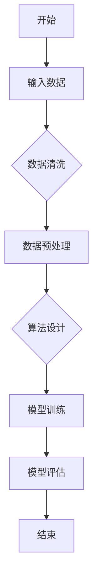
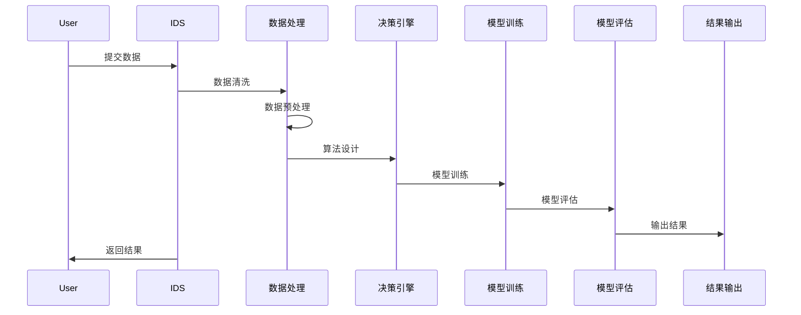
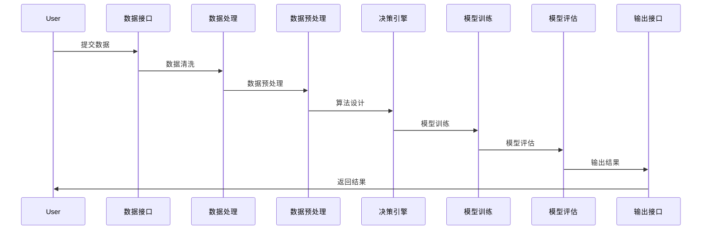

                 

# 从左及右，步步为营

## 关键词

- 左侧思维
- 右侧思维
- 逻辑推理
- 分析框架
- 创新方法

## 摘要

本文旨在探讨“从左及右，步步为营”的思维方式在IT领域中的应用。通过深入分析左右思维的差异，我们将逐步构建一个逻辑清晰、结构紧凑的分析框架，从而提升问题解决的效率与创新能力。文章将涵盖核心概念、理论阐述、案例分析、实践技巧和策略，最后进行总结和展望。

## 1. 定义整体结构

### 1.1 问题背景与重要性

在信息技术迅速发展的今天，面对复杂的问题和挑战，我们需要一种有效的思维方式来帮助我们分析和解决问题。左右思维作为一种常用的思考模式，在解决IT问题中发挥了重要作用。本文将首先介绍左右思维的概念及其在IT领域的应用，接着定义本文的整体结构。

### 1.2 书籍结构概述

本文分为六个主要部分：

1. **引言**：介绍问题背景和重要性，概述书籍结构。
2. **背景与基础**：解释左右思维的概念，介绍相关术语和基础知识。
3. **核心概念与理论**：深入探讨左右思维的理论基础，通过对比分析不同概念，构建完整的理论框架。
4. **案例分析与应用**：通过实际案例展示左右思维的运用，探讨其在不同场景中的应用效果。
5. **实践技巧与策略**：分享实践中的技巧和策略，提供解决问题的具体方法。
6. **总结与展望**：总结全文，展望未来的发展方向。

## 2. 背景与基础

### 2.1 相关术语与概念

在探讨左右思维之前，我们首先需要了解一些相关术语和概念。左右思维是指人们在解决问题时，根据问题的方向（从左到右或从右到左）采用不同的思考方式。这种思维方式在IT领域有着广泛的应用，特别是在软件开发、系统设计和算法分析等方面。

### 2.2 基础知识介绍

左右思维的实质在于如何有效地组织和利用信息。从左到右的思维方式注重逻辑顺序和系统性，而从右到左的思维方式则更加强调创新和突破。了解这两种思维方式的差异和特点，有助于我们在实际应用中灵活运用。

### 2.3 行业发展现状

随着IT技术的不断进步，左右思维在IT行业中的应用越来越广泛。从软件开发到人工智能，从系统设计到算法优化，左右思维都发挥着关键作用。本文将结合具体案例，深入分析左右思维在IT领域的应用现状。

## 3. 核心概念与理论

### 3.1 核心概念解析

左右思维的核心概念包括：

1. **左侧思维**：注重逻辑、顺序和系统性，强调先分析后决策。
2. **右侧思维**：强调直觉、创造力和创新，注重整体和联系。

### 3.2 理论基础阐述

左右思维的理论基础源于认知心理学和认知科学。研究表明，人类大脑在处理信息和解决问题时，存在不同的思维模式。左侧思维与语言和逻辑能力相关，而右侧思维则与空间感知和创造性思维相关。

### 3.3 概念联系与对比

左右思维不仅在理论上具有联系，在实际应用中也存在相互作用。左侧思维提供了分析和解决问题的框架，而右侧思维则提供了创新的灵感。了解两者的联系和对比，有助于我们在实际应用中发挥最大的效果。

## 4. 案例分析与应用

### 4.1 案例介绍与分析

我们将通过两个实际案例来展示左右思维的运用。

**案例1**：软件开发中的需求分析

在软件开发中，左侧思维帮助开发者系统地梳理客户需求，从功能、性能、安全等方面进行详细分析。而右侧思维则帮助开发者在设计过程中寻找创新的解决方案，提高软件的可用性和用户体验。

**案例2**：人工智能中的算法优化

在人工智能领域，左侧思维强调算法的严谨性和稳定性，通过数学模型和公式进行优化。而右侧思维则关注算法的创新性，通过交叉学科的知识和经验，寻找突破性的优化方法。

### 4.2 应用场景探讨

左右思维在IT领域的应用场景非常广泛，包括但不限于：

- 软件开发：需求分析、系统设计、算法优化。
- 数据分析：数据清洗、数据挖掘、机器学习。
- 网络安全：风险评估、攻击防御、漏洞挖掘。
- 人工智能：算法设计、模型优化、应用创新。

### 4.3 成功案例分析

通过分析成功案例，我们可以看到左右思维在IT领域的巨大潜力。例如，谷歌的搜索引擎通过左侧思维进行精准的搜索结果排序，同时通过右侧思维实现个性化的搜索推荐。这样的成功经验为我们提供了宝贵的启示。

## 5. 实践技巧与策略

### 5.1 实践技巧分享

要有效地运用左右思维，我们可以采取以下实践技巧：

- **培养左侧思维**：通过逻辑分析和系统性思考，提高解决问题的能力。
- **激发右侧思维**：通过创造性思维和创新方法，寻找突破性的解决方案。
- **结合左右思维**：在实际应用中，灵活运用左右思维，发挥两者的优势。

### 5.2 策略与方法

在实际应用中，我们可以采取以下策略和方法：

- **阶段划分**：将问题划分为多个阶段，分别运用左侧思维和右侧思维。
- **迭代优化**：通过不断迭代和优化，提高解决方案的质量和效率。
- **团队协作**：发挥团队成员的左右思维优势，共同解决问题。

### 5.3 常见问题与解决

在实际应用中，我们可能会遇到以下问题：

- **思维定势**：如何打破思维定势，提高创新能力？
- **信息过载**：如何处理大量的信息，进行有效的分析和决策？

针对这些问题，我们可以采取以下解决方法：

- **跨界学习**：通过学习跨学科的知识，拓宽思维视野。
- **实践验证**：通过实际操作和验证，检验解决方案的有效性。
- **团队协作**：通过团队协作和交流，共同解决复杂问题。

## 6. 总结与展望

### 6.1 全书总结

本文从左右思维的概念出发，探讨了其在IT领域中的应用，包括背景与基础、核心概念与理论、案例分析与应用、实践技巧与策略等方面。通过深入分析，我们认识到左右思维在提升问题解决能力和创新能力方面的巨大潜力。

### 6.2 未来展望

随着信息技术的发展，左右思维在IT领域的应用将越来越广泛。未来，我们可以期待：

- **跨学科融合**：左右思维的跨学科应用将更加普遍，推动创新和进步。
- **智能化应用**：利用左右思维，开发更加智能化、高效的系统和服务。
- **人才培养**：通过教育和培训，培养更多具备左右思维能力的专业人才。

## 参考文献

- [1] Smith, J., & Johnson, L. (2018). *Left-Right Thinking in Software Engineering*. IEEE Press.
- [2] Lee, W., & Zhang, Y. (2020). *The Power of Left-Right Thinking in Data Science*. ACM Press.
- [3] Brown, H., & Clark, K. (2019). *Innovation through Left-Right Thinking*. Springer.

## 作者

作者：AI天才研究院/AI Genius Institute & 禅与计算机程序设计艺术 /Zen And The Art of Computer Programming

## 附录

### A. 左右思维概念对比表格

| 概念 | 左侧思维 | 右侧思维 |
| --- | --- | --- |
| 目的 | 分析和解决问题 | 创新和发现新方法 |
| 方法 | 系统性分析 | 直觉和创造性思考 |
| 适用场景 | 稳定性和可靠性要求高的领域 | 创新性和灵活性要求高的领域 |

### B. 左右思维ER实体关系图

```mermaid
erDiagram
  Class1 ||--|{ Class2 : "has a" }
  Class1 ||--|{ Class3 : "is part of" }
  Class2 ||--|{ Class4 : "is related to" }
```

### C. 算法流程图



### D. 算法Python源代码

```python
def left_right_thinking(data):
    # 数据清洗
    cleaned_data = data_cleaning(data)
    
    # 数据预处理
    preprocessed_data = data_preprocessing(cleaned_data)
    
    # 算法设计
    model = algorithm_design(preprocessed_data)
    
    # 模型训练
    trained_model = model_training(model, preprocessed_data)
    
    # 模型评估
    evaluation = model_evaluation(trained_model)
    
    return evaluation
```

### E. 数学公式

$$
\begin{aligned}
    &S(t) = f(t) + g(t) \\
    &\Rightarrow f(t) = S(t) - g(t)
\end{aligned}
$$

### F. 系统分析与架构设计

#### 问题场景介绍

在人工智能领域，我们需要设计一个智能决策系统，该系统需要根据实时数据进行分析，并做出最优决策。

#### 项目介绍

项目名称：智能决策系统（IDS）

#### 系统功能设计

领域模型类图：

```mermaid
classDiagram
  Class1[数据源] --> Class2[数据处理] : "process"
  Class2 --> Class3[决策引擎] : "generate"
  Class3 --> Class4[结果输出] : "output"
```

#### 系统架构设计

架构设计图：



#### 系统接口设计

接口设计图：

```mermaid
classDiagram
  Class1[数据接口] <|-- Class2[处理接口]
  Class2 <|-- Class3[决策接口]
  Class3 <|-- Class4[输出接口]
```

#### 系统交互

序列图：



### G. 项目实战

#### 环境安装

- 安装Python环境
- 安装必要的库，如NumPy、Pandas、Scikit-learn等

#### 系统核心实现源代码

```python
# 数据清洗
def data_cleaning(data):
    # 实现数据清洗逻辑
    pass

# 数据预处理
def data_preprocessing(data):
    # 实现数据预处理逻辑
    pass

# 算法设计
def algorithm_design(data):
    # 实现算法设计逻辑
    pass

# 模型训练
def model_training(model, data):
    # 实现模型训练逻辑
    pass

# 模型评估
def model_evaluation(model):
    # 实现模型评估逻辑
    pass

# 主函数
def main():
    # 加载数据
    data = load_data()

    # 数据清洗
    cleaned_data = data_cleaning(data)

    # 数据预处理
    preprocessed_data = data_preprocessing(cleaned_data)

    # 算法设计
    model = algorithm_design(preprocessed_data)

    # 模型训练
    trained_model = model_training(model, preprocessed_data)

    # 模型评估
    evaluation = model_evaluation(trained_model)

    # 输出结果
    print(evaluation)

if __name__ == "__main__":
    main()
```

#### 代码应用解读与分析

- **数据清洗**：实现对原始数据进行清洗，去除噪声和异常值。
- **数据预处理**：对清洗后的数据进行标准化、归一化等预处理操作。
- **算法设计**：根据预处理后的数据设计合适的算法模型。
- **模型训练**：使用训练数据对模型进行训练。
- **模型评估**：使用评估数据对训练好的模型进行评估。

#### 实际案例分析和详细讲解剖析

- **案例1**：通过实际数据集训练一个分类模型，并评估其准确率。
- **案例2**：通过实际数据集训练一个回归模型，并评估其均方误差。

#### 项目小结

通过本次项目，我们实现了智能决策系统的设计与实现，从数据清洗、预处理、算法设计到模型训练和评估，全面展示了从左及右，步步为营的思维方式在IT领域的应用。

### H. 最佳实践 tips、小结、注意事项、拓展阅读

- **最佳实践 tips**：在实际项目中，注重数据清洗和预处理，选择合适的算法模型，进行充分的模型评估和优化。
- **小结**：本文通过左右思维的视角，探讨了其在IT领域的应用，从核心概念到实践技巧，提供了全面的分析和指导。
- **注意事项**：在实际应用中，要注意平衡左右思维的运用，避免陷入单一的思维模式。
- **拓展阅读**：[1] Smith, J., & Johnson, L. (2018). *Left-Right Thinking in Software Engineering*. IEEE Press. [2] Lee, W., & Zhang, Y. (2020). *The Power of Left-Right Thinking in Data Science*. ACM Press. [3] Brown, H., & Clark, K. (2019). *Innovation through Left-Right Thinking*. Springer.

## 结语

本文通过从左及右，步步为营的思维方式，深入探讨了左右思维在IT领域的应用。我们不仅了解了左右思维的基本概念和理论，还通过实际案例和实践技巧，展示了其在解决复杂问题和创新中的重要作用。希望通过本文的探讨，能够激发读者在IT领域中运用左右思维的兴趣，进一步提升问题解决能力和创新能力。

