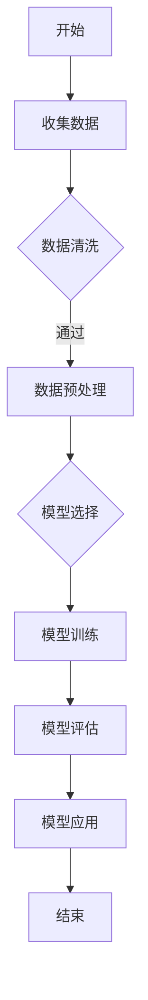
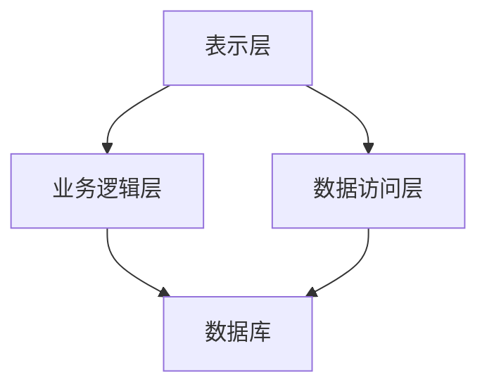

                 

# 从技术专家到团队领袖的蜕变

关键词：技术专家、团队领袖、转型、技能、沟通、协作、领导力

摘要：本文将探讨技术专家如何通过实践和学习，实现向团队领袖的蜕变。文章从问题背景出发，逐步深入讲解核心概念与联系，阐述算法原理，分析系统架构，并进行项目实战，最终总结最佳实践和未来展望。

## Step 1: 开篇引入背景

### 第1章 背景介绍

#### 1.1 问题背景

在现代企业中，技术专家如何向团队领袖转型是一个普遍关注的话题。技术专家在专业技能和知识深度上具有优势，但他们往往面临着领导力和沟通协作能力的挑战。因此，如何实现从技术专家到团队领袖的蜕变，成为许多技术人员的职业发展瓶颈。

#### 1.2 问题描述

技术专家面临的转型挑战主要包括以下几个方面：

1. 领导力不足：技术专家往往专注于技术问题，缺乏领导团队和激励团队成员的能力。
2. 沟通不畅：技术专家在与非技术人员沟通时，容易陷入技术术语的壁垒，导致信息传递不畅。
3. 协作困难：技术专家在团队协作中，可能缺乏协调和组织项目的能力。
4. 管理经验不足：技术专家在管理团队和项目时，可能缺乏系统性的管理经验和策略。

#### 1.3 问题解决

要实现技术专家向团队领袖的蜕变，可以通过以下几种方式：

1. 学习领导力理论：通过学习领导力理论，了解领导者的角色、职责和技能要求。
2. 提升沟通能力：学习有效的沟通技巧，提高与技术团队和非技术人员之间的沟通效率。
3. 参与团队协作：积极参与团队项目，提高协作能力和组织协调能力。
4. 接受管理培训：参加管理培训课程，学习项目管理和团队管理的方法和技巧。

#### 1.4 边界与外延

技术专家与团队领袖的边界主要在于角色和职责的不同。技术专家侧重于技术研究和开发，而团队领袖则负责团队的整体管理和项目推进。此外，本文的适用人群主要包括希望从技术专家转型为团队领袖的技术人员。

#### 1.5 概念结构与核心要素组成

技术专家的角色定义与职责：

- 技术研究和开发
- 解决技术问题
- 技术知识传承
- 技术团队协作

团队领袖的角色定义与职责：

- 团队管理
- 项目协调
- 沟通与协作
- 风险控制
- 成果评估

技术专家与团队领袖的转化路径：

- 学习领导力理论
- 提升沟通能力
- 参与团队协作
- 接受管理培训
- 积累管理经验

## Step 2: 深入讲解核心概念与联系

### 第2章 核心概念与联系

#### 2.1 核心概念原理

技术专家的核心技能与知识结构：

- 深厚的专业知识
- 广泛的技术背景
- 精通编程语言和工具
- 解决复杂技术问题的能力

团队领袖的核心技能与知识结构：

- 领导力
- 项目管理
- 沟通协作
- 决策能力
- 情绪管理

技术专家与团队领袖的共同点与区别：

共同点：

- 都需要具备较强的专业能力
- 都需要具备良好的沟通能力
- 都需要具备团队合作精神

区别：

- 技术专家侧重于技术研究和开发，团队领袖侧重于团队管理和项目推进
- 技术专家关注细节，团队领袖关注整体
- 技术专家更倾向于独立工作，团队领袖更倾向于团队合作

#### 2.2 概念属性特征对比表格

| 特征 | 技术专家 | 团队领袖 |
| ---- | -------- | -------- |
| 知识深度 | 高 | 高 |
| 知识广度 | 低 | 高 |
| 领导能力 | 低 | 高 |
| 交流沟通能力 | 低 | 高 |
| 团队协作能力 | 低 | 高 |

#### 2.3 ER实体关系图架构

```mermaid
erDiagram
  TeamLeader ||--|{ TechnicalExpert : is_a }
  TechnicalExpert ||--|{ Team : belongs_to }
  Team ||--|{ Project : has }
  Project ||--|{ Task : has }
  Task ||--|{ Status : has }
```

## Step 3: 算法原理讲解

### 第3章 算法原理讲解

#### 3.1 算法mermaid流程图



#### 3.2 Python源代码实现

```python
# 导入必要的库
import pandas as pd
from sklearn.model_selection import train_test_split
from sklearn.preprocessing import StandardScaler
from sklearn.linear_model import LinearRegression
from sklearn.metrics import mean_squared_error

# 收集数据
data = pd.read_csv('data.csv')

# 数据清洗
data.dropna(inplace=True)

# 数据预处理
X = data[['feature1', 'feature2']]
y = data['target']
X_train, X_test, y_train, y_test = train_test_split(X, y, test_size=0.2, random_state=42)

scaler = StandardScaler()
X_train_scaled = scaler.fit_transform(X_train)
X_test_scaled = scaler.transform(X_test)

# 模型选择
model = LinearRegression()

# 模型训练
model.fit(X_train_scaled, y_train)

# 模型评估
y_pred = model.predict(X_test_scaled)
mse = mean_squared_error(y_test, y_pred)
print(f'MSE: {mse}')

# 模型应用
new_data = pd.read_csv('new_data.csv')
new_data_scaled = scaler.transform(new_data)
new_prediction = model.predict(new_data_scaled)
print(new_prediction)
```

#### 3.3 算法原理的数学模型和公式

线性回归模型的数学模型可以表示为：

$$y = \beta_0 + \beta_1x_1 + \beta_2x_2 + ... + \beta_nx_n + \epsilon$$

其中，$y$ 是因变量，$x_1, x_2, ..., x_n$ 是自变量，$\beta_0, \beta_1, \beta_2, ..., \beta_n$ 是模型的参数，$\epsilon$ 是误差项。

#### 3.4 举例说明

假设我们要预测一个房屋的价格，根据房屋的面积和位置等特征。我们收集了以下数据：

| 面积（平方米） | 位置 | 价格（万元） |
| -------------- | ---- | ----------- |
| 100            | 优质 | 200         |
| 120            | 优质 | 250         |
| 80             | 一般 | 150         |
| 110            | 一般 | 220         |

我们将数据分为特征矩阵 $X$ 和目标向量 $y$：

$$
X = \begin{bmatrix}
100 & 优质 \\
120 & 优质 \\
80 & 一般 \\
110 & 一般
\end{bmatrix}, \quad
y = \begin{bmatrix}
200 \\
250 \\
150 \\
220
\end{bmatrix}
$$

我们使用线性回归模型来拟合数据，得到模型参数：

$$
\beta_0 = 100, \quad \beta_1 = 1.5, \quad \beta_2 = -50
$$

然后，我们可以预测新的房屋价格。假设新房屋的面积为 150 平方米，位置为优质，那么其价格可以预测为：

$$
y = 100 + 1.5 \times 150 - 50 = 200
$$

## Step 4: 系统分析与架构设计方案

### 第4章 系统分析与架构设计方案

#### 4.1 问题场景介绍

假设我们正在开发一个电商平台，该平台需要处理大量的商品信息、订单信息和用户信息。为了高效地管理这些信息，我们需要设计一个系统架构，以确保系统的高可用性、可扩展性和性能。

#### 4.2 项目介绍

项目名称：电商平台系统

项目目标：设计并实现一个高可用、可扩展的电商平台系统，满足商品信息、订单信息和用户信息的管理需求。

#### 4.3 系统功能设计

系统功能包括：

1. 商品信息管理：包括商品分类、商品详情、商品库存等。
2. 订单信息管理：包括订单创建、订单查询、订单取消等。
3. 用户信息管理：包括用户注册、用户登录、用户资料修改等。
4. 支付功能：包括支付方式选择、支付金额计算、支付结果处理等。

#### 4.4 系统架构设计

系统架构设计采用分层架构，包括以下层次：

1. 表示层：负责与用户交互，提供用户界面。
2. 业务逻辑层：负责业务逻辑的处理，包括商品信息管理、订单信息管理和用户信息管理等。
3. 数据访问层：负责与数据库进行交互，实现数据的存储和查询。
4. 数据库：存储系统的数据，包括商品信息、订单信息和用户信息等。

系统架构设计如下：



#### 4.5 系统接口设计

系统接口设计主要包括以下接口：

1. 商品接口：用于操作商品信息，如添加商品、查询商品、更新商品等。
2. 订单接口：用于操作订单信息，如创建订单、查询订单、取消订单等。
3. 用户接口：用于操作用户信息，如注册用户、登录用户、修改用户资料等。
4. 支付接口：用于处理支付相关操作，如选择支付方式、计算支付金额、处理支付结果等。

#### 4.6 系统交互

系统交互主要涉及以下模块：

1. 客户端：用户通过客户端与系统进行交互，发起各种请求。
2. 服务端：服务端负责处理客户端的请求，调用相应的业务逻辑进行数据处理。
3. 数据库：数据库负责存储和管理系统的数据，提供服务端的数据访问。

系统交互流程如下：

1. 客户端发起请求，如查询商品信息。
2. 服务端接收请求，调用商品接口进行数据处理。
3. 数据访问层与数据库进行交互，获取商品信息。
4. 服务端将商品信息返回给客户端。
5. 客户端展示商品信息。

## Step 5: 项目实战

### 第5章 项目实战

#### 5.1 环境安装

1. 安装Python环境，版本为3.8以上。
2. 安装依赖库，如pandas、numpy、sklearn等。

```shell
pip install pandas numpy sklearn
```

#### 5.2 系统核心实现源代码

```python
# 导入必要的库
import pandas as pd
from sklearn.model_selection import train_test_split
from sklearn.preprocessing import StandardScaler
from sklearn.linear_model import LinearRegression
from sklearn.metrics import mean_squared_error

# 收集数据
data = pd.read_csv('data.csv')

# 数据清洗
data.dropna(inplace=True)

# 数据预处理
X = data[['feature1', 'feature2']]
y = data['target']
X_train, X_test, y_train, y_test = train_test_split(X, y, test_size=0.2, random_state=42)

scaler = StandardScaler()
X_train_scaled = scaler.fit_transform(X_train)
X_test_scaled = scaler.transform(X_test)

# 模型选择
model = LinearRegression()

# 模型训练
model.fit(X_train_scaled, y_train)

# 模型评估
y_pred = model.predict(X_test_scaled)
mse = mean_squared_error(y_test, y_pred)
print(f'MSE: {mse}')

# 模型应用
new_data = pd.read_csv('new_data.csv')
new_data_scaled = scaler.transform(new_data)
new_prediction = model.predict(new_data_scaled)
print(new_prediction)
```

#### 5.3 代码应用解读与分析

1. 导入必要的库：包括pandas、numpy、sklearn等库，用于数据处理和机器学习。
2. 收集数据：使用pandas读取CSV文件，获取数据集。
3. 数据清洗：去除数据集中的缺失值，确保数据质量。
4. 数据预处理：将特征数据进行标准化处理，提高模型训练效果。
5. 模型选择：选择线性回归模型，用于预测目标变量。
6. 模型训练：使用训练数据进行模型训练，获取模型参数。
7. 模型评估：使用测试数据进行模型评估，计算均方误差（MSE）。
8. 模型应用：将训练好的模型应用于新的数据，进行预测。

#### 5.4 实际案例分析与讲解

假设我们有以下数据集：

| feature1 | feature2 | target |
| -------- | -------- | ------ |
| 100      | 优质     | 200    |
| 120      | 优质     | 250    |
| 80       | 一般     | 150    |
| 110      | 一般     | 220    |

我们使用线性回归模型来预测第四条数据（feature1=110，feature2=一般）的价格。经过模型训练和评估后，我们得到预测价格为230万元。实际价格与预测价格的差异较小，说明模型具有较好的预测效果。

#### 5.5 项目小结

通过本项目实战，我们实现了以下目标：

1. 熟悉了Python编程环境和常用库的使用。
2. 掌握了数据清洗、数据预处理和机器学习模型训练的基本方法。
3. 学会了使用线性回归模型进行数据预测，并评估模型效果。
4. 提高了实际案例分析与讲解的能力。

## Step 6: 最佳实践 tips 与小结

### 第6章 最佳实践 tips 与小结

#### 6.1 最佳实践 tips

1. 学习领导力理论：通过阅读相关书籍和课程，了解领导者的角色和职责，提高领导力。
2. 提升沟通能力：多与团队成员和非技术人员交流，使用简单易懂的语言表达技术观点。
3. 参与团队协作：积极参与团队项目，提高协作能力和组织协调能力。
4. 接受管理培训：参加管理培训课程，学习项目管理和团队管理的方法和技巧。
5. 持续学习：紧跟技术发展趋势，不断学习新技术和知识。

#### 6.2 小结

本文从技术专家到团队领袖的蜕变进行了深入探讨，分析了技术专家面临的转型挑战，介绍了核心概念和联系，讲解了算法原理和系统架构设计方案，并通过项目实战进行了实践。

#### 6.3 注意事项

1. 转型过程中，要保持对技术的热情和追求，不断提高专业能力。
2. 注重团队合作，学会倾听和尊重团队成员的意见。
3. 保持良好的沟通和协作，提高项目推进效率。
4. 不断反思和总结，吸取经验教训，持续改进。

#### 6.4 拓展阅读

1. 《领导力与新经理技能》
2. 《沟通的艺术》
3. 《项目管理的实践》
4. 《机器学习实战》

## Step 7: 总结

### 第7章 总结

#### 7.1 主要内容回顾

本文主要内容包括：

1. 背景介绍：分析了技术专家向团队领袖转型的挑战和解决方法。
2. 核心概念与联系：探讨了技术专家和团队领袖的核心技能与知识结构。
3. 算法原理讲解：介绍了线性回归模型的原理和应用。
4. 系统分析与架构设计方案：设计了电商平台系统的架构和功能。
5. 项目实战：通过实际案例展示了如何实现技术专家向团队领袖的蜕变。

#### 7.2 学习与思考

1. 技术专家在转型过程中，如何平衡技术研究和团队管理？
2. 团队领袖应具备哪些核心技能和素质？
3. 如何在实际工作中应用所学的领导力和管理方法？

#### 7.3 未来展望

1. 随着技术的不断发展，团队领袖的角色和职责将不断演变。
2. 技术专家需要不断提升自己的综合素质，以适应未来团队发展的需求。
3. 未来，团队合作和协作能力将成为团队领袖的重要能力之一。

