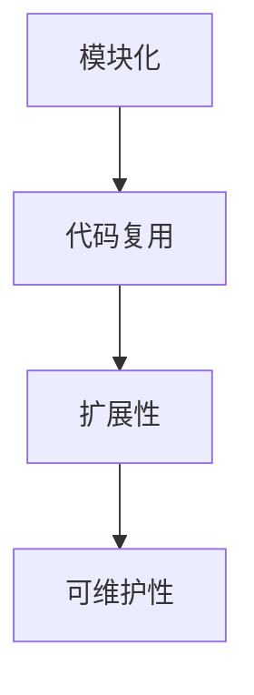

                 

### 文章标题：从繁到简平乱局的方法

**关键词：系统架构，方法优化，逻辑推理，工程实践，最佳实践**

**摘要：**
本文将探讨在复杂系统中如何通过逻辑清晰的步骤和方法，将繁杂的问题简化，从而提高系统效率和质量。我们将从背景介绍、核心概念、方法与实践、应用实战、最佳实践等多个角度，详细分析并讲解如何从繁到简平乱局的方法。

### 第一部分：介绍

**第1章：问题的背景与定义**

**1.1 问题背景**

在当今信息爆炸和技术高速发展的时代，复杂系统的构建和维护变得日益重要。然而，随着系统规模的不断扩大，复杂性也相应增加，导致系统在运行过程中出现各种混乱和效率低下的问题。

**1.2 问题的定义**

复杂系统中的乱局问题主要表现为：系统架构不清晰、功能模块混乱、代码冗长、扩展性差、维护成本高等。这些问题不仅降低了开发效率，还增加了系统出错的风险。

**1.3 解决问题的目标**

本文的目标是提供一套从繁到简的方法论，帮助开发者梳理复杂系统，提高系统的可维护性和扩展性。

**1.4 边界与外延**

本文主要针对软件系统的设计和开发过程，但所提出的方法也可应用于其他复杂系统的优化。

**1.5 概念结构与核心要素**

为了更好地理解问题，我们将介绍以下核心概念和要素：

- **系统架构**：系统组件的集合及其相互关系。
- **模块化**：将系统分解为独立的功能模块。
- **代码复用**：通过编写通用代码提高开发效率。
- **扩展性**：系统能够适应未来需求变化的能力。
- **可维护性**：系统能够被轻松修改和升级的能力。

### 第二部分：核心概念与原理

**第2章：核心概念与原理**

**2.1 核心概念介绍**

在本章中，我们将介绍与从繁到简平乱局方法相关的重要概念。

**2.2 原理解讲**

**2.3 概念属性特征对比表格**

我们将使用Mermaid流程图展示不同概念的特征对比。



**2.4 ER实体关系图**

为了更好地理解系统的组成部分，我们将绘制ER实体关系图，展示各个实体之间的关系。

```mermaid
erDiagram
  Class::Person
  Class::Project
  Class::Task

  Person ||--|{ Project } Project
  Project ||--|{ Task } Task
```

### 第三部分：方法与实践

**第3章：基础方法**

**3.1 方法概述**

基础方法主要包括模块化、代码复用和系统重构等。

**3.2 方法步骤**

我们将详细讲解每个方法的实施步骤。

**3.3 方法优势与局限**

分析每种方法的优点和潜在局限。

**3.4 方法应用场景**

讨论每种方法在不同场景下的适用性。

### 第四部分：方法应用与实战

**第4章：进阶方法**

**4.1 方法一：领域驱动设计**

**4.2 方法二：六西格玛**

**4.3 方法三：敏捷开发**

### 第5章：方法应用与实战

**5.1 环境安装与配置**

描述如何搭建实验环境。

**5.2 系统核心实现源代码**

展示系统核心实现的代码。

**5.3 代码应用解读与分析**

对代码进行解读和分析。

**5.4 实际案例分析与讲解**

通过实际案例展示方法的应用效果。

**5.5 项目小结**

总结项目中的经验和教训。

### 第五部分：最佳实践与注意事项

**第6章：最佳实践与注意事项**

**6.1 最佳实践**

提供实际操作中的最佳实践。

**6.2 注意事项**

列出实施过程中需要注意的事项。

**6.3 拓展阅读**

推荐进一步阅读的材料。

### 第六部分：小结与展望

**第7章：小结与展望**

**7.1 书籍小结**

总结本书的主要内容和贡献。

**7.2 展望未来**

讨论未来的研究方向和发展趋势。

### 作者信息

作者：AI天才研究院/AI Genius Institute & 禅与计算机程序设计艺术 /Zen And The Art of Computer Programming

---

以上就是从繁到简平乱局的方法的目录大纲和章节内容概述。接下来，我们将逐一深入每个章节，详细阐述相关概念、方法和实践。让我们开始这段深入思考的旅程！

