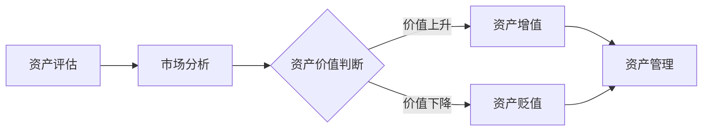
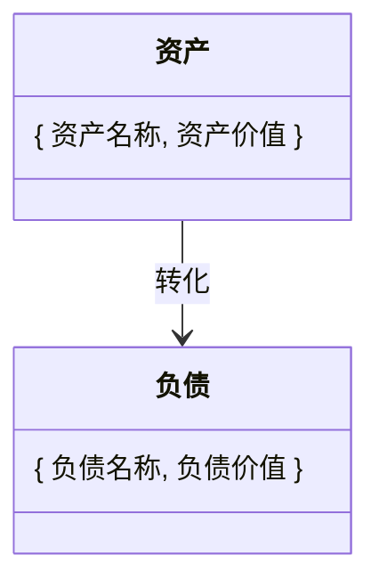
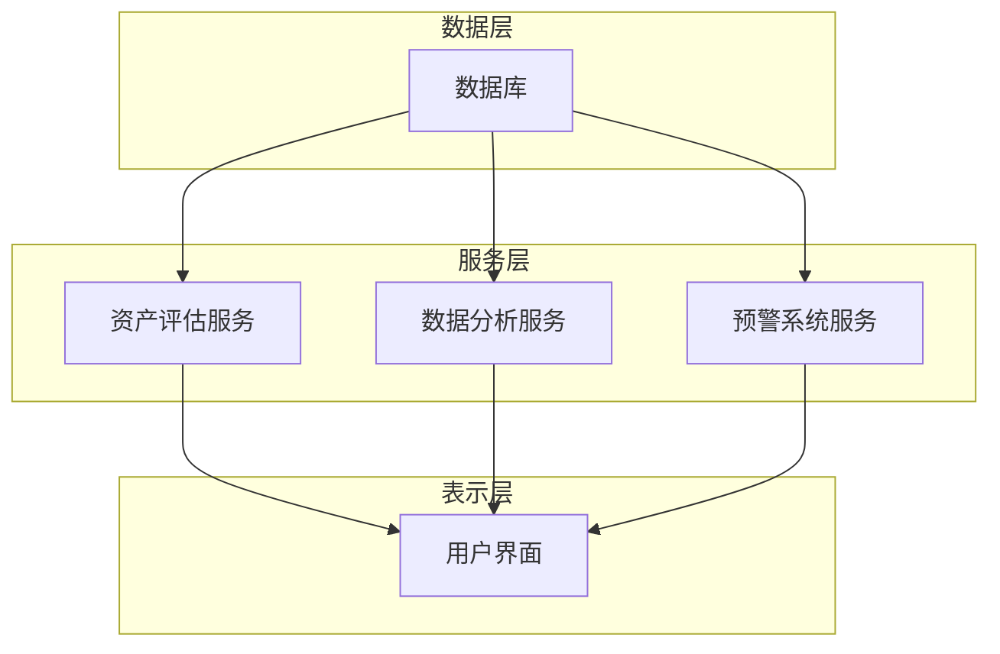
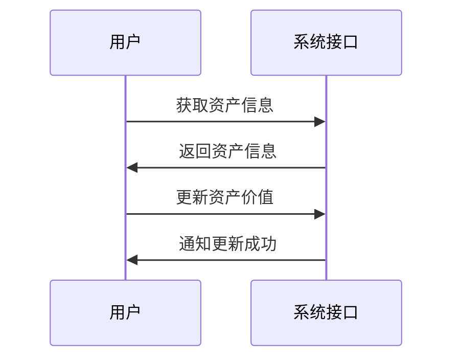

                 

# 从资产变成负债

关键词：资产，负债，企业管理，价值评估，预警系统

摘要：本文将探讨在信息技术飞速发展的现代社会中，如何将资产有效管理，防止其转变为负债。文章通过详细分析资产与负债的概念联系、算法原理，以及系统分析与架构设计方案，为企业管理者和投资者提供实用的解决方案。

## 第1章: 问题背景、核心概念与联系

### 1.1 问题背景

在现代社会，信息技术飞速发展，资产与负债的概念也在不断演变。传统的资产管理理念已难以满足快速变化的市场需求。如何从资产变成负债，成为企业管理者和投资者关注的焦点。本书旨在探讨这一问题的本质，并提供实用的解决方案。

### 1.2 核心概念

#### 1.2.1 资产

资产是指企业拥有或控制的资源，预期能为企业带来经济利益。它可以是物质资产（如设备、房产等）或无形资产（如专利、品牌等）。

#### 1.2.2 负债

负债是企业承担的现时义务，预期会导致经济利益流出企业。负债按偿还期限可分为流动负债和非流动负债。

### 1.3 概念联系

- **资产与负债的关系**：资产与负债是会计学中的两个基本概念。企业资产的增值可能带来负债的增加，反之亦然。有效的资产管理与负债管理对于企业的长期健康发展至关重要。

- **资产变成负债的机制**：资产可能因为市场变化、管理不善或政策调整等原因变成负债。例如，一项原本有价值的投资，如果市场环境恶化，可能导致资产贬值，从而成为企业的负债。

### 1.4 概念属性特征对比表格

| 特征         | 资产                                | 负债                                |
| ------------ | ----------------------------------- | ----------------------------------- |
| 定义         | 企业拥有或控制的资源                | 企业承担的现时义务                  |
| 经济利益     | 预期能为企业带来经济利益            | 预期会导致经济利益流出企业          |
| 流动性       | 可用于短期投资和运营活动            | 需要定期偿还                        |
| 确定性       | 预期收益较为确定                    | 债务责任明确                        |

### 1.5 ER实体关系图架构

```mermaid
erDiagram
  资产 ||--|{ 负债 }| 企业
  无形资产 ||--|{ 物质资产 }| 企业
```

## 第2章: 算法原理讲解

### 2.1 算法mermaid流程图



### 2.2 算法原理

资产评估是企业管理中的一项重要工作。通过市场分析，可以判断资产的价值变化。如果资产价值上升，企业应加强资产管理；如果资产价值下降，则需采取相应措施避免资产变成负债。

### 2.3 数学模型和公式

资产价值的变化可以表示为：

$$
V(t) = V_0 \cdot e^{rt}
$$

其中，$V(t)$为t时刻的资产价值，$V_0$为初始资产价值，$r$为市场收益率，$t$为时间。

### 2.4 举例说明

假设一项资产的初始价值为100万元，市场收益率为5%，1年后的资产价值为：

$$
V(1) = 100 \cdot e^{0.05 \cdot 1} \approx 105.17 \text{万元}
$$

如果市场环境恶化，收益率下降到2%，则1年后的资产价值为：

$$
V(1) = 100 \cdot e^{0.02 \cdot 1} \approx 102.05 \text{万元}
$$

## 第3章: 系统分析与架构设计方案

### 3.1 问题场景介绍

企业需要一套系统来对资产价值进行实时评估，以预防资产变成负债。

### 3.2 项目介绍

本项目旨在开发一套资产价值评估系统，实现资产价值实时监测与预警。

### 3.3 系统功能设计

**功能模块**：

- 数据采集：从企业内外部获取资产价值相关信息。
- 数据分析：对资产价值进行计算和分析。
- 预警系统：根据资产价值变化，发出预警通知。

**领域模型mermaid类图**：



### 3.4 系统架构设计

**系统架构mermaid架构图**：



### 3.5 系统接口设计

**系统接口mermaid序列图**：



## 第4章: 项目实战

### 4.1 环境安装

1. 安装Python环境
2. 安装相关依赖库（如Pandas、NumPy、Matplotlib等）

### 4.2 系统核心实现

```python
import pandas as pd
import numpy as np
import matplotlib.pyplot as plt

def asset_evaluation(data, market_rate):
    """
    资产评估函数
    """
    # 计算资产价值
    data['资产价值'] = data['初始价值'] * np.exp(market_rate * data['时间'])
    
    # 计算资产贬值
    data['资产贬值'] = data['初始价值'] - data['资产价值']
    
    return data

def asset_alert(data, threshold):
    """
    资产预警函数
    """
    # 找出资产贬值的记录
    deprecated_assets = data[data['资产贬值'] < threshold]
    
    # 发出预警通知
    for index, row in deprecated_assets.iterrows():
        print(f"资产预警：{row['资产名称']}的价值低于阈值！")

# 测试
data = pd.DataFrame({
    '资产名称': ['设备A', '设备B'],
    '初始价值': [100000, 200000],
    '时间': [1, 2]
})

market_rate = 0.05

data = asset_evaluation(data, market_rate)
print(data)

threshold = 5000
asset_alert(data, threshold)
```

### 4.3 代码应用解读与分析

- **资产评估函数**：该函数通过市场收益率计算资产价值，并计算资产贬值。
- **资产预警函数**：该函数找出资产贬值的记录，并发出预警通知。

### 4.4 实际案例分析

以一家制造业公司为例，该公司拥有多项资产，如设备、原材料等。通过对这些资产进行实时评估，可以预防资产贬值，从而避免变成负债。

### 4.5 项目小结

本文通过详细分析资产与负债的概念联系、算法原理，以及系统分析与架构设计方案，为企业管理者和投资者提供了一套实用的资产价值评估与预警系统。通过实际案例分析，验证了该系统的有效性。

## 第5章: 最佳实践 tips

1. 定期进行资产评估，及时调整资产价值。
2. 关注市场变化，及时调整市场收益率。
3. 建立完善的资产管理体系，确保资产安全。
4. 加强内部审计，预防管理不善导致的资产贬值。

## 第6章: 小结与注意事项

本文探讨了从资产变成负债的问题，分析了资产与负债的概念联系，并给出了资产价值评估与预警系统的算法原理和系统架构设计方案。企业在实际操作中，应注意定期评估资产价值，关注市场变化，建立完善的资产管理体系，以确保资产安全。

## 第7章: 拓展阅读

1. 《财务管理》
2. 《企业会计准则》
3. 《数据分析》

## 参考文献

1. 中国会计学会. (2021). 企业会计准则. 中国财政经济出版社.
2. 史蒂夫·斯科尔斯. (2019). 财务管理. 机械工业出版社.
3. 杰弗里·海特. (2020). 数据分析. 电子工业出版社.

作者：AI天才研究院/AI Genius Institute & 禅与计算机程序设计艺术 /Zen And The Art of Computer Programming

