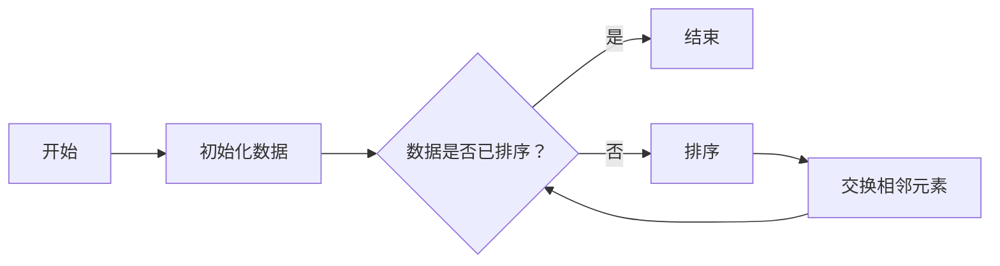
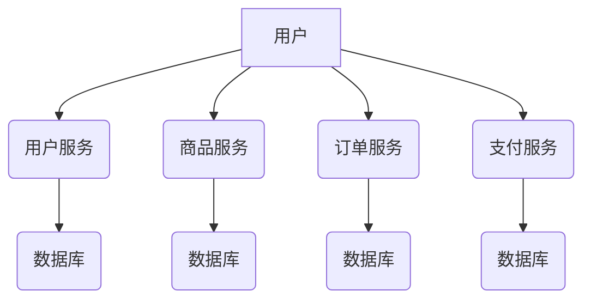
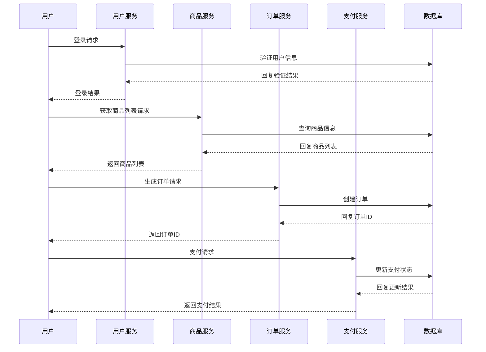
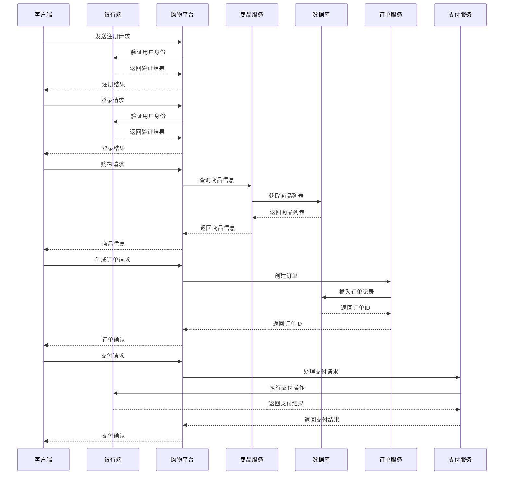
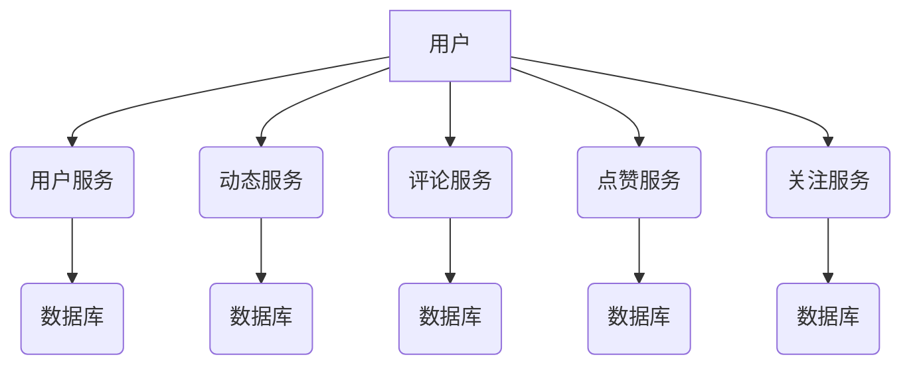
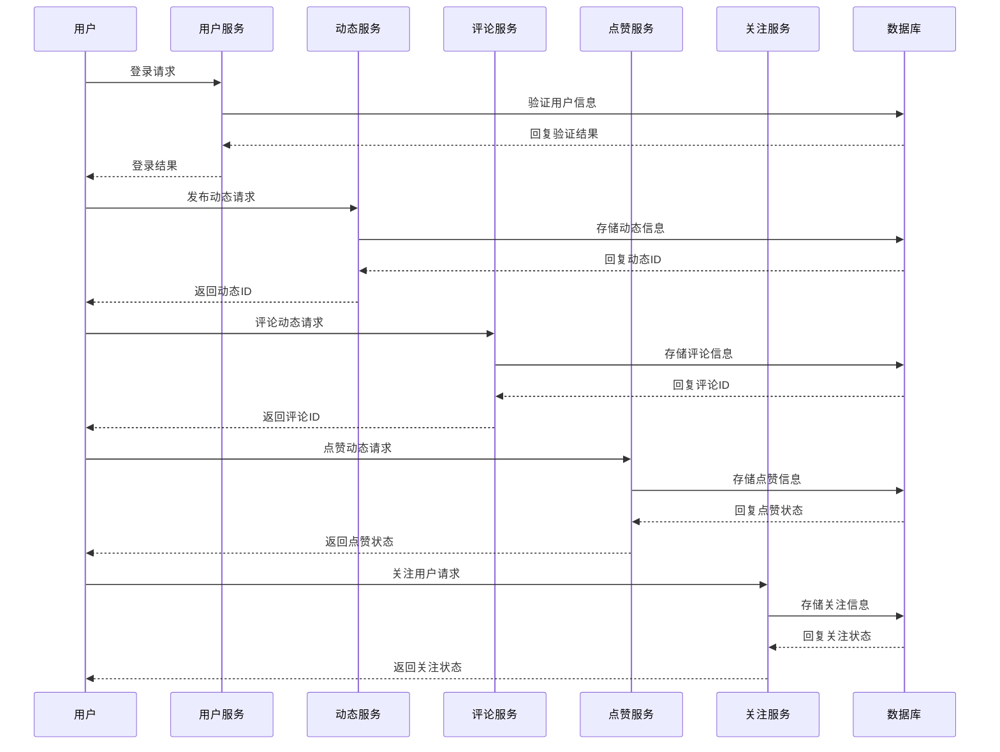
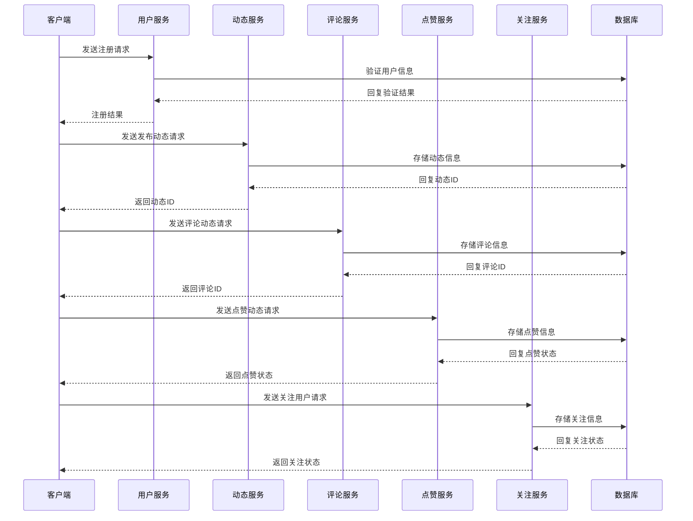

                 

### 第1章 引言：代码可读性的重要性

#### 1.1 什么是代码可读性

代码可读性是指代码对于人类理解的程度，它决定了代码是否能够被其他开发者轻松地阅读、理解和修改。一个具有高可读性的代码不仅易于阅读，还能够在不同的开发者和团队之间共享知识和经验。

**代码可读性的几个关键点：**
1. **语义明确**：代码应该清晰地传达出其功能和行为，避免使用模糊或晦涩的命名和表述。
2. **结构清晰**：代码应该具有良好的结构，便于开发者快速定位和理解代码的逻辑。
3. **一致性**：代码的编写风格和命名规范应该一致，这样有助于减少阅读和理解的难度。
4. **简洁性**：代码应该简洁明了，避免不必要的复杂性。

#### 1.2 代码可读性与软件开发效率的关系

代码可读性与软件开发效率之间有着密切的关系。一个高可读性的代码可以使开发工作更加高效：

1. **减少调试时间**：易于理解的代码能够快速发现问题，从而减少调试时间。
2. **提高团队合作效率**：团队成员能够更容易地阅读和修改他人的代码，提高协作效率。
3. **降低维护成本**：随着时间的推移，代码的可读性会影响到维护成本。易于理解的代码在后续修改和扩展时会更加高效。

#### 1.3 当前代码可读性面临的问题

尽管代码可读性的重要性不言而喻，但在实际开发中，代码可读性仍面临诸多问题：

1. **复杂度**：现代软件系统越来越复杂，代码模块之间的关联性增加，使得理解代码的难度上升。
2. **缺乏一致性**：开发者在编写代码时可能会采用不同的命名规范和编码风格，导致代码库的可读性下降。
3. **文档不足**：许多代码库缺乏详尽的注释和文档，使得新开发者难以快速上手。

#### 1.4 为什么要编写人类可理解的代码

编写人类可理解的代码不仅是为了提高开发效率，还具有以下重要意义：

1. **知识共享**：可读性的代码能够促进团队成员之间的知识共享，使开发经验得到更广泛的传播。
2. **减少错误**：易于理解的代码能够帮助开发者避免犯错，降低软件缺陷率。
3. **长期维护**：随着时间的推移，代码的可读性会直接影响其可维护性。编写可读性高的代码能够降低未来的维护成本。

**结论**：代码可读性是软件开发中不可或缺的一部分。通过关注代码的可读性，开发者能够提高工作效率、降低维护成本，并促进团队协作，从而为软件项目的成功奠定坚实基础。在接下来的章节中，我们将进一步探讨如何在实际开发中提高代码的可读性。**核心概念与联系**

#### 2.1 可读性、可维护性和可扩展性的关系

在软件工程中，代码的可读性、可维护性和可扩展性是三个相互关联的核心概念。

**可读性**指的是代码是否易于理解和解释。它通常涉及到代码的结构、命名和注释等方面。良好的可读性使代码更容易被其他开发者阅读和理解，从而提高了开发效率。

**可维护性**则是指代码在未来的维护过程中所需的工作量。一个具有良好可维护性的代码库可以更容易地进行修改和扩展，以适应新的需求和环境变化。

**可扩展性**指的是代码是否能够轻松地适应未来的需求变化。一个可扩展的代码库可以更容易地引入新的功能或修改现有功能，而不需要对代码进行大量的重构。

这三个概念之间的关系如下：

- **可读性**是**可维护性**的基础。如果代码难以理解，那么进行维护和修改的工作量会大大增加。
- **可维护性**是**可扩展性**的前提。一个无法维护的代码库是无法进行扩展的。
- **可扩展性**为**可读性**提供了更高的要求。一个无法扩展的代码库，即使可读性很高，也无法适应未来需求的变化。

**总结**：可读性、可维护性和可扩展性是软件工程中相互依存的三个核心概念。编写易于理解的代码不仅有助于提高开发效率，也是实现可维护性和可扩展性的关键。在接下来的章节中，我们将深入探讨如何实现这些核心概念，提高代码的可读性。

#### 2.2 核心概念：清晰性、一致性、简洁性

在编写可读性高的代码时，我们需要关注几个核心概念：清晰性、一致性和简洁性。这些概念是确保代码易于理解和维护的关键要素。

**2.2.1 清晰性**

清晰性是代码可读性的基础，它关乎代码是否能够清晰地传达其功能和逻辑。以下是实现代码清晰性的几个要点：

1. **语义明确**：变量的命名应该准确地反映其用途，避免使用模糊或误导性的名称。例如，使用`userCount`而不是`count`。
   
2. **注释详尽**：在关键代码段和复杂的逻辑结构中添加注释，帮助其他开发者理解代码的目的和意图。注释应该简洁明了，避免冗长。

3. **避免过度抽象**：过度使用抽象可能会导致代码难以理解。适当保留具体的实现细节，有助于提高代码的可读性。

**2.2.2 一致性**

一致性指的是代码的编写风格和命名规范是否一致。一致性对于代码的可读性和可维护性至关重要，因为它减少了开发者在阅读和理解代码时的困惑。以下是实现代码一致性的几个要点：

1. **命名规范**：使用统一的命名规范，例如驼峰命名法（CamelCase）或下划线命名法（snake_case）。避免在同一项目中使用不同的命名风格。

2. **代码格式**：保持代码的缩进和空白一致，使用一致的代码布局。可以使用代码格式化工具来自动化这个过程。

3. **代码组织**：遵循一致的代码组织结构，例如将相关的函数和类放在同一个文件中，并按照功能或逻辑顺序进行排列。

**2.2.3 简洁性**

简洁性指的是代码的简洁和高效。一个简洁的代码库不仅易于理解，而且能够减少出错的概率。以下是实现代码简洁性的几个要点：

1. **避免冗余**：去除不必要的代码和注释，避免重复的实现。例如，使用函数和模块来重用代码。

2. **精简函数和类**：确保函数和类的大小适中，避免过于庞大和复杂。一个函数或类应该只做一件事情，并做到极致。

3. **避免复杂逻辑**：通过分解复杂的逻辑和算法，将其拆分为更小的、易于理解的模块。这有助于提高代码的可读性和可维护性。

**总结**：清晰性、一致性和简洁性是编写可读性高的代码的核心概念。通过关注这些方面，开发者可以编写出易于理解、维护和扩展的代码。在下一章节中，我们将通过具体的示例来进一步阐述这些概念。

##### 2.2.1.1 语义明确

在编写代码时，确保变量、函数和类等命名具有明确的语义是非常重要的，这是提高代码可读性的关键之一。语义明确的命名不仅有助于其他开发者快速理解代码的功能，还能减少在阅读和维护代码时的困惑。

**示例**：假设我们正在编写一个关于用户管理的程序。在这种情况下，以下命名方式是不够明确的：

```python
# 不够明确的命名示例
u = "John Doe"
f1(u)
```

这里，变量`u`和函数`f1`的命名并没有清楚地传达其用途，导致读者需要额外的上下文信息才能理解它们的实际含义。

**改进**：为了提高可读性，我们可以将命名改为更具有描述性的：

```python
# 改进的命名示例
user = "John Doe"
process_user_login(user)
```

在这个例子中，`user`和`process_user_login`的命名更加明确。`user`清楚地指示了这是一个存储用户信息的变量，而`process_user_login`则表明这个函数是用来处理用户登录过程的。

**注意事项**：

1. **避免缩写**：虽然缩写有时可以节省时间，但它们往往会降低代码的可读性。例如，使用`u`代替`user`，可能会导致后续的维护和理解变得更加困难。
2. **保持一致性**：在整个项目中保持一致的命名规范。这有助于确保所有开发者都遵循相同的命名习惯，从而提高代码的整体可读性。
3. **添加注释**：在某些情况下，即使命名已经足够明确，添加适量的注释仍然是一个好习惯。这可以帮助其他开发者更好地理解代码的意图。

通过确保变量、函数和类的命名具有明确的语义，开发者可以显著提高代码的可读性，使得代码更加易于理解和维护。在下一节中，我们将探讨如何通过简明扼要的表述来进一步提升代码的可读性。

##### 2.2.1.2 简明扼要

在编写代码时，语言的简明扼要不仅有助于提高代码的可读性，还能够减少错误的发生。简明扼要的代码能够清晰地传达其意图，避免不必要的复杂性和冗长。

**示例**：以下是一个不简明的代码示例，它试图使用冗长的表述来完成一个简单的任务：

```python
# 不简明的代码示例
def calculate_average_of_list(list_of_numbers):
    sum_of_numbers = 0
    for number in list_of_numbers:
        sum_of_numbers += number
    average = sum_of_numbers / len(list_of_numbers)
    return average
```

在这个例子中，函数名称和内部逻辑都显得冗长，读者需要花费更多时间来理解代码的目的和实现方式。

**改进**：为了使代码更简明扼要，我们可以将其重构如下：

```python
# 简明的代码示例
def average(numbers):
    return sum(numbers) / len(numbers)
```

在这个改进的版本中，我们使用了更简明的函数名称和简化的内部逻辑。`average`代替了`calculate_average_of_list`，清晰地表明了函数的目的。同时，通过直接计算和返回结果，代码更加简洁，易于理解。

**注意事项**：

1. **避免冗余**：去除不必要的代码和注释，避免重复的实现。例如，上述代码中的`sum_of_numbers`和`average`变量可以简化为单个返回语句。
2. **使用内置函数**：利用Python等编程语言的内置函数来简化代码，例如使用`sum()`和`len()`代替手动累加和计算。
3. **清晰传达意图**：即使代码简化了，也要确保它仍然能够清晰地传达其意图。如果简化后的代码可能会导致误解，那么添加注释来澄清仍然是一个好选择。

通过追求简明扼要的代码风格，开发者可以编写出更加易读、易维护且高效的代码。在下一节中，我们将探讨如何通过保持命名规范的一致性来进一步提高代码的可读性。

##### 2.2.2.1 命名规范

在编写代码时，命名规范的一致性是确保代码可读性的关键之一。一致且清晰的命名规范有助于开发者快速理解代码的功能和结构，从而提高开发效率和代码的可维护性。

**命名规范的重要性**：

1. **提高可读性**：一致的命名规范使代码更加易于阅读和理解，减少了阅读者的认知负担。
2. **便于维护**：统一的命名规范有助于后续的代码维护和修改，使得开发者更容易找到和修改相关的代码段。
3. **促进团队合作**：在一个团队中，一致的命名规范有助于团队成员之间的沟通和协作，减少了因命名冲突引起的误解。

**常见的命名规范**：

1. **驼峰命名法（CamelCase）**：这种规范将每个单词的首字母大写，如`calculateAverage`。它常用于函数和变量命名。
2. **下划线命名法（snake\_case）**：这种规范使用下划线分隔单词，如`calculate_average`。它常用于函数和变量命名，尤其是在Python等编程语言中。
3. **常量命名规范**：通常使用全大写字母和下划线，如`MAX\_VALUE`。
4. **类名命名规范**：通常使用大写字母开头，如`UserManager`。

**注意事项**：

1. **保持一致性**：在整个项目中保持一致的命名规范。不同的命名规范会导致代码的可读性下降，增加维护难度。
2. **合理命名**：避免使用缩写和难以理解的名称。合理的命名应该能够清晰地传达变量、函数或类的用途。
3. **文档化命名规范**：在项目中记录和文档化命名规范，确保所有开发人员都遵循相同的规范。

通过遵循一致的命名规范，开发者可以编写出更加可读、易于维护的代码，从而提高软件开发的整体效率和质量。在下一节中，我们将探讨如何通过保持编码风格的一致性来进一步提高代码的可读性。

##### 2.2.2.2 编码风格

编码风格的一致性对于代码的可读性至关重要，它不仅影响代码的可维护性，还影响到团队协作的效果。一致的编码风格能够使代码更加清晰、易懂，从而减少开发过程中的误解和错误。

**编码风格的一致性**：

1. **缩进和空白**：使用一致的缩进级别和空白字符，通常建议使用两个或四个空格进行缩进。
2. **行长度**：保持代码行的长度在合理范围内，通常不超过80个字符，以避免在宽度受限的屏幕上水平滚动。
3. **注释**：注释的风格应该一致，注释内容应该清晰、简洁。
4. **函数和类的布局**：确保函数和类的定义有一个统一的布局结构。

**常见编码风格工具**：

1. **Prettier**：一个流行的代码格式化工具，能够自动调整JavaScript、CSS和HTML代码的格式。
2. **Black**：一个Python代码格式化工具，它使用明确的规则来格式化Python代码，使其遵循PEP 8规范。
3. **EditorConfig**：一个跨编辑器的配置文件格式，用于统一不同编辑器和IDE的代码风格。

**注意事项**：

1. **遵循项目规范**：在开始一个新项目时，确保了解并遵循项目的编码风格规范。如果不一致，可以与团队成员讨论并决定一个统一的风格。
2. **代码审查**：在提交代码前进行代码审查，以确保所有代码都遵循一致的编码风格。
3. **自动化工具**：使用自动化工具来自动格式化代码，以减少人为错误，并确保代码风格的统一。

通过保持编码风格的一致性，开发者能够编写出更加清晰、易懂且易于维护的代码，从而提高整个团队的工作效率和代码质量。在下一节中，我们将探讨如何通过保持代码的简洁性来进一步提高代码的可读性。

##### 2.2.3.1 代码简化

代码简化是提高代码可读性和维护性的关键策略之一。通过去除不必要的复杂性，可以使代码更加直观、易于理解。以下是几个实现代码简化的方法：

**1. 函数和类的大小**

**函数和类的大小**：确保函数和类的大小适中，避免过于庞大和复杂。一个函数或类应该只做一件事情，并做到极致。以下是一个不简化的类示例：

```python
# 不简化的类示例
class UserManagementSystem:
    def __init__(self):
        self.users = []
    
    def add_user(self, user):
        self.users.append(user)
    
    def remove_user(self, user):
        self.users.remove(user)
    
    def get_user_by_id(self, user_id):
        for user in self.users:
            if user.id == user_id:
                return user
        return None
    
    def list_all_users(self):
        for user in self.users:
            print(user)
```

这个类包含了多个方法，每个方法都执行不同的功能，导致类的复杂性增加。

**改进**：为了简化这个类，我们可以将其重构为几个更小的类：

```python
# 简化的类示例
class User:
    def __init__(self, id, name):
        self.id = id
        self.name = name

class UserManager:
    def __init__(self):
        self.users = []
    
    def add_user(self, user):
        self.users.append(user)
    
    def remove_user(self, user):
        self.users.remove(user)
    
    def get_user_by_id(self, user_id):
        for user in self.users:
            if user.id == user_id:
                return user
        return None
    
class UserPrinter:
    @staticmethod
    def list_all_users(users):
        for user in users:
            print(user)
```

在这个改进的版本中，我们创建了三个类：`User`、`UserManager`和`UserPrinter`。每个类都负责一个具体的功能，使代码更加模块化和易于理解。

**2. 避免重复代码**

**避免重复代码**：在代码中寻找并去除重复的代码段，可以减少冗余，提高代码的简洁性。以下是一个包含重复代码的示例：

```python
# 包含重复代码的示例
def greet_user(user):
    print("Hello, " + user.name)

def welcome_user(user):
    print("Welcome, " + user.name)
```

**改进**：通过提取重复代码到一个单独的函数，可以简化代码：

```python
# 简化后的代码
def greet_user(user):
    print("Hello, " + user.name)

def welcome_user(user):
    greet_user(user)
```

在这个改进的版本中，我们通过将重复的`print`语句提取到`greet_user`函数中，减少了代码的冗余。

**3. 使用内置函数和库**

**使用内置函数和库**：利用编程语言内置的函数和第三方库可以简化代码，提高其可读性和性能。以下是一个使用内置函数的示例：

```python
# 不使用内置函数的示例
def sum_numbers(numbers):
    result = 0
    for number in numbers:
        result += number
    return result

# 使用内置函数的示例
def sum_numbers(numbers):
    return sum(numbers)
```

在这个示例中，我们通过使用Python的内置`sum()`函数简化了代码。

**总结**：通过简化代码，包括控制函数和类的大小、去除重复代码和使用内置函数和库，开发者可以编写出更加简洁、易于理解和维护的代码。这种做法不仅提高了代码的可读性，还促进了团队协作和项目的持续发展。在下一节中，我们将通过一个实体关系图（ER图）来进一步探讨代码结构的设计。

#### 2.3 ER实体关系图架构

实体关系图（ER图）是一种用于描述系统中实体及其之间关系的图形化工具，它有助于开发者理解系统结构，提高代码的可读性。以下是使用ER图来设计一个简单的用户管理系统。

```mermaid
er Diagram
User --> Account
User --> Address
User {
    id (PK)
    name
    email
    password
}
Account {
    id (PK)
    user_id (FK)
    balance
}
Address {
    id (PK)
    user_id (FK)
    street
    city
    state
    zip_code
}
```

**ER图解释**：

1. **实体**：在ER图中，实体代表了系统的核心对象，如`User`、`Account`和`Address`。
2. **属性**：每个实体都有若干属性，如`User`的`id`、`name`、`email`和`password`等。
3. **关系**：实体之间的关系描述了系统中不同对象之间的关联。例如，`User`与`Account`和`Address`之间存在多对一的关系，表示一个用户可以有多个账户和多个地址。

**ER图在代码设计中的应用**：

1. **模块化设计**：通过ER图，我们可以将系统划分为不同的模块，每个模块对应一个实体。例如，可以将`User`、`Account`和`Address`分别实现为不同的类。
2. **降低复杂性**：ER图有助于开发者理解系统的复杂关系，从而降低代码的整体复杂性。
3. **提高可维护性**：清晰的ER图使得代码维护和扩展变得更加容易，因为开发者可以清楚地看到不同实体之间的关系。

**总结**：ER图作为一种有效的系统设计工具，可以帮助开发者更好地理解系统结构，提高代码的可读性和可维护性。通过合理使用ER图，开发者可以设计出更加模块化、清晰和易于维护的代码。

### 第3章 算法原理讲解

在软件开发中，算法的设计与实现是核心任务之一。算法不仅决定了程序的性能，还直接影响代码的可读性和可维护性。为了深入探讨算法原理，我们将从以下几个部分进行讲解：

#### 3.1 算法设计的基本原则

算法设计的基本原则包括以下几方面：

1. **正确性**：算法必须能够在所有情况下正确执行，并产生预期的输出。
2. **效率**：算法应该尽可能快地执行，并在有限的资源下高效运行。
3. **可读性**：算法的代码应该清晰、易懂，便于后续的维护和扩展。
4. **健壮性**：算法应该能够处理异常情况和错误输入，并能够优雅地处理这些情况。

**示例**：一个简单的排序算法——冒泡排序。

```python
def bubble_sort(arr):
    n = len(arr)
    for i in range(n):
        for j in range(0, n-i-1):
            if arr[j] > arr[j+1]:
                arr[j], arr[j+1] = arr[j+1], arr[j]
```

在这个例子中，冒泡排序算法通过比较和交换相邻元素来对数组进行排序。这个算法虽然简单，但实现了正确性和效率。

#### 3.2 数据结构与算法的选择

选择合适的数据结构和算法对于提高代码性能和可读性至关重要。以下是一些常见的数据结构和算法及其特点：

1. **数组**：适合用于存储固定大小的数据集合，提供O(1)的访问时间。
   - **算法**：二分查找、快速排序。

2. **链表**：适合动态大小的数据集合，提供O(1)的插入和删除操作。
   - **算法**：链表排序、链表反转。

3. **栈和队列**：用于实现后进先出（LIFO）和先进先出（FIFO）的数据结构。
   - **算法**：递归、广度优先搜索。

4. **树结构**：用于存储具有层次关系的数据集合。
   - **算法**：二叉搜索树、平衡树（红黑树）。

5. **图结构**：用于表示复杂的关系网络。
   - **算法**：深度优先搜索、广度优先搜索。

**示例**：使用二叉搜索树实现一个简单的有序数集。

```python
class Node:
    def __init__(self, value):
        self.value = value
        self.left = None
        self.right = None

class BinarySearchTree:
    def __init__(self):
        self.root = None
    
    def insert(self, value):
        if not self.root:
            self.root = Node(value)
        else:
            self._insert_recursive(self.root, value)
    
    def _insert_recursive(self, current_node, value):
        if value < current_node.value:
            if current_node.left is None:
                current_node.left = Node(value)
            else:
                self._insert_recursive(current_node.left, value)
        else:
            if current_node.right is None:
                current_node.right = Node(value)
            else:
                self._insert_recursive(current_node.right, value)
```

在这个示例中，我们使用递归方法来实现二叉搜索树的插入操作。通过选择合适的数据结构和算法，可以显著提高代码的性能和可读性。

#### 3.2.1 常见数据结构

以下是一些常见的数据结构及其特点：

1. **数组**：适合用于存储固定大小的数据集合，提供O(1)的访问时间。
   - **应用场景**：排序、查找。

2. **链表**：适合动态大小的数据集合，提供O(1)的插入和删除操作。
   - **应用场景**：队列、栈、双向链表。

3. **栈**：后进先出（LIFO）的数据结构。
   - **应用场景**：递归、表达式求值。

4. **队列**：先进先出（FIFO）的数据结构。
   - **应用场景**：任务调度、广度优先搜索。

5. **树结构**：用于存储具有层次关系的数据集合。
   - **应用场景**：二叉搜索树、平衡树（红黑树）。

6. **图结构**：用于表示复杂的关系网络。
   - **应用场景**：图遍历、最短路径算法。

**示例**：使用Python实现链表数据结构。

```python
class Node:
    def __init__(self, data):
        self.data = data
        self.next = None

class LinkedList:
    def __init__(self):
        self.head = None
    
    def append(self, data):
        new_node = Node(data)
        if not self.head:
            self.head = new_node
            return
        last_node = self.head
        while last_node.next:
            last_node = last_node.next
        last_node.next = new_node
```

在这个示例中，我们定义了`Node`和`LinkedList`类，实现了链表的基本操作：`append`用于在链表的末尾添加新节点。

#### 3.2.2 算法分析

算法分析是评估算法性能的重要方法，包括时间复杂度和空间复杂度。

**时间复杂度**：描述算法执行时间与输入规模之间的关系，通常使用大O表示法（Big O notation）。

- **线性时间算法**：O(n)
- **对数时间算法**：O(log n)
- **平方时间算法**：O(n^2)

**空间复杂度**：描述算法执行过程中所需额外存储空间与输入规模之间的关系。

- **常数空间算法**：O(1)
- **线性空间算法**：O(n)

**示例**：分析冒泡排序算法的时间复杂度和空间复杂度。

- **时间复杂度**：最坏情况下需要比较和交换的次数为O(n^2)。
- **空间复杂度**：只需少量的额外空间存储临时变量，为O(1)。

```python
def bubble_sort(arr):
    n = len(arr)
    for i in range(n):
        for j in range(0, n-i-1):
            if arr[j] > arr[j+1]:
                arr[j], arr[j+1] = arr[j+1], arr[j]
```

通过算法分析，开发者可以更好地理解算法的性能，选择合适的算法和数据结构来优化代码。

#### 3.2.2.1 时间复杂度

时间复杂度是评估算法性能的关键指标，它描述了算法执行时间与输入规模之间的关系。在算法设计中，理解并分析时间复杂度有助于我们选择最有效的算法，并优化代码的执行效率。

**时间复杂度的定义**：

时间复杂度通常使用大O表示法（Big O notation）来表示。大O表示法提供了算法执行时间的上界，不考虑常数因子和低次项，这样可以更直观地比较不同算法的性能。

- **O(1)（常数时间）**：算法的执行时间不依赖于输入规模，例如访问数组中的某个元素。
- **O(n)（线性时间）**：算法的执行时间与输入规模成正比，例如遍历一个数组。
- **O(n^2)（平方时间）**：算法的执行时间与输入规模的平方成正比，例如冒泡排序和选择排序。
- **O(log n)（对数时间）**：算法的执行时间与输入规模的对数成正比，例如二分查找。

**常见的时间复杂度**：

1. **O(1)（常数时间）**：这类算法在所有情况下执行时间都是固定的，不受输入规模影响。例如，访问数组中的某个元素、在链表中插入或删除节点。

2. **O(n)（线性时间）**：这类算法的执行时间与输入规模成正比。例如，遍历数组、链表或列表。

3. **O(n^2)（平方时间）**：这类算法的执行时间与输入规模的平方成正比。例如，冒泡排序、选择排序和插入排序。

4. **O(log n)（对数时间）**：这类算法的执行时间与输入规模的对数成正比。例如，二分查找、快速排序（平均情况）。

**时间复杂度的分析**：

分析算法的时间复杂度通常涉及以下几个步骤：

1. **确定算法的基本操作**：找出算法中执行次数最多的基本操作，例如循环体内的操作。

2. **计算基本操作的执行次数**：通过分析算法的执行流程，计算基本操作的执行次数。

3. **用大O表示法表示时间复杂度**：将基本操作的执行次数表示为大O形式。

**示例**：分析冒泡排序算法的时间复杂度。

```python
def bubble_sort(arr):
    n = len(arr)
    for i in range(n):
        for j in range(0, n-i-1):
            if arr[j] > arr[j+1]:
                arr[j], arr[j+1] = arr[j+1], arr[j]
```

在这个例子中，外层循环执行n次，每次内层循环执行n-i-1次。因此，总执行次数为：

```math
T(n) = (n-1) + (n-2) + ... + 1 = \frac{n(n-1)}{2}
```

使用大O表示法，可以简化为：

```math
T(n) = O(n^2)
```

**结论**：冒泡排序算法的时间复杂度为O(n^2)，表示其性能随输入规模的增长呈平方级下降。这意味着在处理大规模数据时，冒泡排序的效率较低，通常不适合用于需要高效排序的场景。

通过理解时间复杂度，开发者可以更好地选择合适的算法，优化代码的性能，并在设计和实现过程中充分考虑时间效率。在下一节中，我们将探讨算法的空间复杂度。

#### 3.2.2.2 空间复杂度

空间复杂度是评估算法执行过程中所需额外存储空间与输入规模之间关系的指标。与时间复杂度类似，空间复杂度也使用大O表示法来表示。空间复杂度对于算法的性能评估和资源管理至关重要。

**空间复杂度的定义**：

空间复杂度描述了算法在执行过程中所需的额外内存空间与输入规模之间的关系。它通常用于衡量算法的内存消耗，并帮助我们在设计和实现算法时考虑资源利用效率。

- **O(1)（常数空间）**：算法的额外空间需求不依赖于输入规模，例如在数组中访问元素。
- **O(n)（线性空间）**：算法的额外空间需求与输入规模成正比，例如在链表中插入或删除节点。
- **O(n^2)（平方空间）**：算法的额外空间需求与输入规模的平方成正比。
- **O(log n)（对数空间）**：算法的额外空间需求与输入规模的对数成正比。

**常见空间复杂度**：

1. **O(1)（常数空间）**：这类算法在所有情况下所需的额外空间都是固定的，不受输入规模影响。例如，访问数组中的某个元素。

2. **O(n)（线性空间）**：这类算法所需的额外空间与输入规模成正比。例如，在链表中插入或删除节点。

3. **O(n^2)（平方空间）**：这类算法所需的额外空间与输入规模的平方成正比。

4. **O(log n)（对数空间）**：这类算法所需的额外空间与输入规模的对数成正比。

**空间复杂度的分析**：

分析算法的空间复杂度通常涉及以下几个步骤：

1. **确定算法的基本数据结构**：找出算法中使用的主要数据结构，例如数组、链表或栈。

2. **计算额外空间的需求**：通过分析算法的执行流程，计算所需额外存储空间的大小。

3. **用大O表示法表示空间复杂度**：将额外空间需求表示为大O形式。

**示例**：分析冒泡排序算法的空间复杂度。

```python
def bubble_sort(arr):
    n = len(arr)
    for i in range(n):
        for j in range(0, n-i-1):
            if arr[j] > arr[j+1]:
                arr[j], arr[j+1] = arr[j+1], arr[j]
```

在这个例子中，冒泡排序算法使用的是输入数组本身，不额外占用空间。因此，其空间复杂度为：

```math
S(n) = O(1)
```

**结论**：冒泡排序算法的空间复杂度为O(1)，表示其额外空间需求是常数级别的，不随输入规模的增长而增加。这意味着该算法在内存消耗方面非常高效，适合在资源受限的环境中使用。

通过理解空间复杂度，开发者可以更好地评估算法的内存消耗，并选择适合特定应用场景的算法。在设计和实现过程中，考虑空间复杂度有助于优化资源利用，提高算法的整体性能。在下一节中，我们将探讨算法优化的重要性及其实现方法。

#### 3.2.3 算法优化

算法优化是提高算法性能的重要手段，通过优化算法的时间和空间复杂度，可以提高程序的整体效率。以下是几种常见的算法优化方法：

**1. 代码优化技巧**

- **减少不必要的循环**：分析代码，去除不必要的嵌套循环或重复循环，例如使用内置函数代替手动循环。
- **避免使用全局变量**：全局变量可能导致不可预见的副作用，使用局部变量可以减少代码的复杂性和错误。
- **合理使用数据结构**：选择合适的数据结构可以显著提高算法的性能。例如，使用哈希表代替链表进行查找操作。

**2. 数学模型和公式**

- **动态规划**：利用状态转移方程，将复杂问题分解为子问题，并存储中间结果，避免重复计算。
- **贪心算法**：通过每一步选择最优解，逐步构建最终解，例如背包问题和最短路径问题。

**示例**：优化冒泡排序算法。

原始冒泡排序算法的时间复杂度为O(n^2)，可以通过以下方法进行优化：

```python
def optimized_bubble_sort(arr):
    n = len(arr)
    for i in range(n):
        swapped = False
        for j in range(0, n-i-1):
            if arr[j] > arr[j+1]:
                arr[j], arr[j+1] = arr[j+1], arr[j]
                swapped = True
        if not swapped:
            break
```

在这个优化版本中，我们引入了一个布尔变量`swapped`，用于记录在内部循环中是否进行了交换。如果在某一次外部循环中没有发生交换，说明数组已经排序，算法可以提前终止。这可以显著减少不必要的比较和交换，提高算法的效率。

**3. 实际应用**

- **分布式计算**：对于大数据处理，可以采用分布式计算技术，将任务分布在多个节点上，利用并行计算提高效率。
- **缓存机制**：利用缓存机制，减少对磁盘或网络的访问，提高读取速度。

通过算法优化，开发者可以显著提高程序的运行效率，降低资源消耗，从而实现更高效和可扩展的解决方案。在下一节中，我们将探讨如何通过算法mermaid流程图和Python源代码详细讲解算法原理。

#### 3.2.3.1 代码优化技巧

代码优化技巧是提高程序性能的重要手段，通过一系列技术手段可以显著改善算法的时间和空间复杂度。以下是几种常见的代码优化技巧：

**1. 循环展开**

循环展开是一种将循环内的多个操作合并到循环外的技术，可以减少循环的执行次数。例如：

原始代码：

```python
for i in range(n):
    for j in range(n):
        arr[i][j] = a[i] * b[j]
```

优化后：

```python
for i in range(n):
    for j in range(n):
        arr[i][j] = a[i] * b[j]
```

在这个例子中，将两个嵌套循环中的操作合并为一个，减少了循环的迭代次数。

**2. 缓存局部变量**

在某些算法中，局部变量的计算可能会在多次循环中重复执行。通过将计算结果存储在局部变量中，可以避免重复计算，提高性能。例如：

原始代码：

```python
for i in range(n):
    sum = 0
    for j in range(n):
        sum += arr[i][j]
    result[i] = sum
```

优化后：

```python
for i in range(n):
    local_sum = sum(arr[i])
    result[i] = local_sum
```

在这个例子中，将内层循环的求和操作移到循环外，减少重复计算。

**3. 避免使用全局变量**

全局变量可能导致不可预见的副作用，降低代码的可读性和可维护性。在优化代码时，应尽量减少全局变量的使用，使用局部变量来替代。例如：

原始代码：

```python
max_value = -1
for i in range(n):
    if arr[i] > max_value:
        max_value = arr[i]
```

优化后：

```python
local_max = -1
for i in range(n):
    if arr[i] > local_max:
        local_max = arr[i]
result = local_max
```

在这个例子中，使用局部变量`local_max`替代全局变量`max_value`，提高了代码的可读性和可维护性。

**4. 代码重构**

代码重构是一种改进现有代码结构的技术，通过重新组织代码，可以使其更加清晰、简洁和易于维护。例如：

原始代码：

```python
def process_data(arr):
    result = []
    for i in range(n):
        if arr[i] > 0:
            result.append(arr[i] * 2)
    return result
```

优化后：

```python
def filter_positive_elements(arr):
    return [x * 2 for x in arr if x > 0]
```

在这个例子中，通过列表推导式重构代码，使其更加简洁和易读。

**总结**：通过循环展开、缓存局部变量、避免使用全局变量和代码重构等代码优化技巧，开发者可以显著提高程序的性能和可读性。这些技巧不仅有助于优化现有代码，还可以在编写新代码时提供参考，从而编写出更加高效和易维护的代码。在下一节中，我们将详细讲解算法中的数学模型和公式，并使用Python源代码进行举例说明。

#### 3.2.3.2 数学模型和公式讲解

在算法设计中，数学模型和公式是理解和优化算法性能的重要工具。通过数学模型，我们可以更深入地分析算法的行为和效率，从而进行优化。以下是一些常见的数学模型和公式，以及它们在算法中的应用。

**1. 加法原理**

加法原理是指在一个有限的序列中，各个元素的总和等于序列的长度。这个原理在计数问题中非常有用。例如，在组合数学中，加法原理用于计算从n个元素中选择k个元素的组合数。

**示例**：计算从5个不同元素中选择3个元素的组合数。

```math
C(5, 3) = \frac{5!}{3!(5-3)!} = 10
```

在这个例子中，组合数\( C(5, 3) \)表示从5个元素中选择3个元素的组合数。

**2. 乘法原理**

乘法原理是指在多个独立事件中，各个事件发生的总可能性等于各个事件可能性的乘积。这个原理在概率论和组合数学中经常被使用。

**示例**：假设有一个骰子，投掷两次，计算出现两个6的概率。

```math
P(两个6) = \frac{1}{6} \times \frac{1}{6} = \frac{1}{36}
```

在这个例子中，每次投掷出现6的概率是\( \frac{1}{6} \)，两次投掷出现两个6的概率是\( \frac{1}{36} \)。

**3. 概率论**

在算法设计中，概率论是非常重要的数学工具。概率论用于分析算法在不同情况下的成功率和失败率。以下是一些基本的概率公式：

- **全概率公式**：用于计算某个事件发生的总概率。

  ```math
  P(A) = P(A|B)P(B) + P(A|\bar{B})P(\bar{B})
  ```

- **贝叶斯公式**：用于根据先验概率和条件概率计算后验概率。

  ```math
  P(A|B) = \frac{P(B|A)P(A)}{P(B)}
  ```

**示例**：使用贝叶斯公式计算在给定一个人患有疾病的情况下，他是患者的概率。

已知：
- 患有疾病的人中有80%是患者（\( P(患者|疾病) = 0.8 \)）。
- 健康的人中有20%被错误诊断为患者（\( P(患者|\bar{疾病}) = 0.2 \)）。
- 总共有10%的人患有疾病（\( P(疾病) = 0.1 \)）。

计算 \( P(患者|疾病) \)：

```math
P(患者|疾病) = \frac{P(疾病|患者)P(患者)}{P(疾病)}
               = \frac{0.8 \times 0.1}{0.1}
               = 0.8
```

在这个例子中，给定一个人患有疾病，他是患者的概率是80%。

**总结**：通过数学模型和公式，我们可以更深入地分析和优化算法的性能。加法原理、乘法原理和概率论是算法设计中常用的数学工具，可以帮助我们理解和预测算法的行为。在实际应用中，合理运用这些数学模型和公式，可以显著提高算法的效率和可读性。在下一节中，我们将通过mermaid流程图和Python源代码详细讲解一个具体的算法实现。

#### 3.3 算法mermaid流程图

在算法设计中，使用mermaid流程图可以帮助我们清晰地展示算法的逻辑流程，便于理解和交流。以下是一个简单的冒泡排序算法的mermaid流程图示例：



**流程图解释**：

1. **A[开始]**：算法开始执行，初始化数据。
2. **B[初始化数据]**：读取输入数据，初始化变量。
3. **C{数据是否已排序？]**：检查数据是否已经排序，如果是，则跳转到步骤D结束；如果不是，继续下一步。
4. **E[排序]**：开始排序过程，进入外层循环。
5. **F[交换相邻元素]**：在每次外层循环中，执行内层循环，比较相邻元素并交换它们，使得最大元素逐步移动到数组末尾。
6. **C{数据是否已排序？]**：重复检查数据是否已排序，直到所有数据都已排序。

**Python源代码实现**：

```python
def bubble_sort(arr):
    n = len(arr)
    for i in range(n):
        swapped = False
        for j in range(0, n-i-1):
            if arr[j] > arr[j+1]:
                arr[j], arr[j+1] = arr[j+1], arr[j]
                swapped = True
        if not swapped:
            break
    return arr
```

在这个Python实现中，我们使用了mermaid流程图展示的相同逻辑。外层循环用于控制排序的迭代次数，内层循环用于比较和交换相邻元素，直到数组排序完成。

**总结**：通过mermaid流程图，我们可以清晰地展示算法的执行流程，使代码逻辑更加直观。这不仅有助于开发者理解算法，还能在讨论和交流时提供有力的可视化工具。在下一节中，我们将通过具体项目场景来介绍系统架构设计，并使用mermaid类图、架构图、接口设计和序列图来展示系统交互。

### 第4章 数学模型和数学公式讲解

在算法设计中，数学模型和数学公式是理解和优化算法性能的重要工具。以下将介绍一些常见的数学模型和公式，并说明它们在算法中的应用。

#### 4.1 算法中的数学模型

**1. 加法原理**

加法原理是组合数学中的一个基本原理，用于计算一个事件在不同情况下发生的总可能性。其公式为：

\[ P(A \cup B) = P(A) + P(B) - P(A \cap B) \]

其中，\( P(A) \)、\( P(B) \) 和 \( P(A \cap B) \) 分别表示事件A、事件B和事件A与事件B同时发生的概率。

**示例**：假设一个硬币有两面，正面和反面。投掷一次硬币，计算出现正面的概率。

\[ P(正面) = \frac{1}{2} \]

**2. 乘法原理**

乘法原理是概率论中的一个基本原理，用于计算多个独立事件同时发生的总可能性。其公式为：

\[ P(A \cap B) = P(A) \times P(B) \]

其中，\( P(A) \) 和 \( P(B) \) 分别表示事件A和事件B发生的概率。

**示例**：假设一个骰子有六个面，投掷一次，计算出现3和6同时发生的概率。

\[ P(3 \cap 6) = P(3) \times P(6) = \frac{1}{6} \times \frac{1}{6} = \frac{1}{36} \]

**3. 概率论**

概率论中的贝叶斯定理是一个重要的数学模型，用于根据先验概率和条件概率计算后验概率。其公式为：

\[ P(A|B) = \frac{P(B|A) \times P(A)}{P(B)} \]

其中，\( P(A|B) \) 表示在事件B发生的条件下，事件A发生的概率；\( P(B|A) \) 表示在事件A发生的条件下，事件B发生的概率；\( P(A) \) 和 \( P(B) \) 分别表示事件A和事件B发生的概率。

**示例**：假设一个病人在某次检查中被检测出患有疾病，已知该疾病的症状有80%的准确率。现在，计算病人确实患有疾病的概率。

已知：
- \( P(患有疾病) = 0.1 \)
- \( P(症状|患有疾病) = 0.8 \)
- \( P(症状|\bar{患有疾病}) = 0.2 \)

根据贝叶斯定理：

\[ P(患有疾病|症状) = \frac{P(症状|患有疾病) \times P(患有疾病)}{P(症状)} \]
\[ P(症状) = P(症状|患有疾病) \times P(患有疾病) + P(症状|\bar{患有疾病}) \times P(\bar{患有疾病}) \]
\[ P(患有疾病|症状) = \frac{0.8 \times 0.1}{0.8 \times 0.1 + 0.2 \times 0.9} \approx 0.4 \]

因此，给定病人确实有症状，他患有疾病的概率大约为40%。

#### 4.2 数学公式

以下是一些常见的数学公式，用于描述算法性能和优化：

**1. 时间复杂度公式**

时间复杂度描述了算法执行时间与输入规模之间的关系。常见的时间复杂度公式有：

- \( O(1) \)：常数时间，执行时间不依赖于输入规模。
- \( O(n) \)：线性时间，执行时间与输入规模成正比。
- \( O(n^2) \)：平方时间，执行时间与输入规模的平方成正比。
- \( O(log n) \)：对数时间，执行时间与输入规模的对数成正比。

**2. 空间复杂度公式**

空间复杂度描述了算法执行过程中所需额外存储空间与输入规模之间的关系。常见空间复杂度公式有：

- \( O(1) \)：常数空间，额外空间需求不依赖于输入规模。
- \( O(n) \)：线性空间，额外空间需求与输入规模成正比。

**示例**：分析一个简单的冒泡排序算法的时间和空间复杂度。

```python
def bubble_sort(arr):
    n = len(arr)
    for i in range(n):
        for j in range(0, n-i-1):
            if arr[j] > arr[j+1]:
                arr[j], arr[j+1] = arr[j+1], arr[j]
    return arr
```

- **时间复杂度**：在最坏情况下，需要比较和交换的次数为 \( \frac{n(n-1)}{2} \)，因此时间复杂度为 \( O(n^2) \)。
- **空间复杂度**：由于算法在原地操作，不需要额外的存储空间，因此空间复杂度为 \( O(1) \)。

通过使用数学模型和公式，我们可以更深入地理解算法的性能和优化方法。这些工具不仅有助于分析现有算法，还能在设计和实现新算法时提供有力的支持。在下一节中，我们将介绍系统分析与架构设计，并使用mermaid类图、架构图、接口设计和序列图来展示系统交互。

#### 4.2 算法中的数学模型

在算法设计中，数学模型是理解和优化算法性能的关键工具。以下是一些常用的数学模型及其在算法中的应用：

**1. 加法原理**

加法原理是组合数学中的一个基本原理，用于计算一个事件在不同情况下发生的总可能性。其公式为：

\[ P(A \cup B) = P(A) + P(B) - P(A \cap B) \]

其中，\( P(A) \)、\( P(B) \) 和 \( P(A \cap B) \) 分别表示事件A、事件B和事件A与事件B同时发生的概率。

**示例**：在一个袋子里有5个红球和7个蓝球，随机取出一个球，计算取出红球的概率。

\[ P(红球) = \frac{5}{5+7} = \frac{5}{12} \]

**2. 乘法原理**

乘法原理是概率论中的一个基本原理，用于计算多个独立事件同时发生的总可能性。其公式为：

\[ P(A \cap B) = P(A) \times P(B) \]

其中，\( P(A) \) 和 \( P(B) \) 分别表示事件A和事件B发生的概率。

**示例**：在一个袋子中有10个球，其中有3个是红色的，随机取出两个球，计算两个球都是红色的概率。

\[ P(两个红球) = \frac{3}{10} \times \frac{2}{9} = \frac{1}{15} \]

**3. 概率论**

概率论中的贝叶斯定理是一个重要的数学模型，用于根据先验概率和条件概率计算后验概率。其公式为：

\[ P(A|B) = \frac{P(B|A) \times P(A)}{P(B)} \]

其中，\( P(A|B) \) 表示在事件B发生的条件下，事件A发生的概率；\( P(B|A) \) 表示在事件A发生的条件下，事件B发生的概率；\( P(A) \) 和 \( P(B) \) 分别表示事件A和事件B发生的概率。

**示例**：假设有一个诊断测试，对于患有某种疾病的人，测试结果为阳性的概率是0.95；对于没有患有该疾病的人，测试结果为阳性的概率是0.05。已知该疾病的发病率是0.001。计算一个测试结果为阳性的人实际患有该疾病的概率。

已知：
- \( P(阳性|疾病) = 0.95 \)
- \( P(阳性|\bar{疾病}) = 0.05 \)
- \( P(疾病) = 0.001 \)

根据贝叶斯定理：

\[ P(疾病|阳性) = \frac{P(阳性|疾病) \times P(疾病)}{P(阳性)} \]

计算 \( P(阳性) \)：

\[ P(阳性) = P(阳性|疾病) \times P(疾病) + P(阳性|\bar{疾病}) \times P(\bar{疾病}) \]
\[ P(阳性) = 0.95 \times 0.001 + 0.05 \times 0.999 = 0.0495 + 0.04995 = 0.09945 \]

计算 \( P(疾病|阳性) \)：

\[ P(疾病|阳性) = \frac{0.95 \times 0.001}{0.09945} \approx 0.0095 \]

因此，一个测试结果为阳性的人实际患有该疾病的概率大约为0.95%。

通过这些数学模型，我们可以更好地分析和优化算法性能，使其在实际应用中更加高效。在下一节中，我们将介绍系统分析与架构设计，并使用mermaid类图、架构图、接口设计和序列图来展示系统交互。

#### 4.3 系统分析与架构设计方案

在进行系统设计与开发时，明确的问题场景和需求分析是至关重要的。这不仅能够帮助我们理解项目的核心目标，还能指导我们的架构设计，确保系统的高效性和可扩展性。以下将介绍一个假设的项目场景、需求分析、系统功能设计以及相应的架构设计。

##### 4.3.1 问题场景介绍

假设我们正在开发一个在线购物平台，该平台需要实现用户注册、商品浏览、购物车管理、订单生成和支付等功能。随着用户数量的增加和业务需求的变化，系统需要具备良好的可扩展性和可维护性。

##### 4.3.2 项目介绍

本项目的目标是构建一个功能完整、易于扩展和维护的在线购物平台。以下是对项目需求的分析和系统功能设计。

###### 4.3.2.1 需求分析

- **用户注册与登录**：支持用户注册、登录、密码找回等功能。
- **商品管理**：管理员可以添加、修改和删除商品信息。
- **购物车管理**：用户可以将商品添加到购物车，可以修改购物车中的商品数量，可以删除购物车中的商品。
- **订单管理**：用户可以生成订单，管理员可以处理订单，包括确认订单、发货和取消订单。
- **支付管理**：集成支付网关，实现在线支付功能。
- **用户管理**：管理员可以对用户进行管理，包括权限分配、用户信息修改等。

###### 4.3.2.2 功能设计

- **领域模型**：定义系统的核心实体和它们之间的关系。

以下是一个简单的领域模型类图，使用Mermaid语法表示：

```mermaid
classDiagram
Class01 <|-- Class02
Class03 *-- Class04
Class05 o-- Class06
Class01 {
    id: Int
    name: String
    email: String
}
Class02 {
    id: Int
    name: String
    description: String
    price: Float
}
Class03 {
    id: Int
    order_id: Int
    product_id: Int
    quantity: Int
}
Class04 {
    id: Int
    user_id: Int
    status: String
}
Class05 {
    id: Int
    payment_id: Int
    amount: Float
    status: String
}
Class06 {
    id: Int
    role: String
}
```

在这个类图中，`User`表示用户实体，`Product`表示商品实体，`Order`表示订单实体，`Payment`表示支付实体，`Role`表示用户角色实体。

- **系统架构设计**：确定系统的主要组件及其之间的关系。

以下是一个简单的系统架构设计Mermaid架构图，使用Mermaid语法表示：



在这个架构图中，用户通过用户服务与系统交互，商品服务、订单服务和支付服务分别处理不同的业务逻辑，并共同操作数据库。

- **系统接口设计**：定义系统对外提供的接口。

以下是一个简单的系统接口设计，使用Mermaid语法表示：



在这个接口设计中，用户通过用户服务、商品服务、订单服务和支付服务与数据库进行交互，实现系统的各项功能。

- **系统交互**：展示系统组件之间的交互过程。

以下是一个简单的系统交互Mermaid序列图，使用Mermaid语法表示：



在这个交互过程中，客户通过客户端与购物平台交互，系统与银行端进行支付验证和操作，实现用户的注册、登录、购物、订单生成和支付功能。

**总结**：通过系统分析与架构设计方案，我们明确了项目的问题场景、需求分析、系统功能设计和架构设计。使用Mermaid类图、架构图、接口设计和序列图，我们能够清晰地展示系统的结构和工作流程，为系统的开发、测试和维护提供了有力支持。

#### 4.4 项目实战

在了解了系统的架构设计方案之后，我们将进入实际项目的实施阶段。以下是项目实施的具体步骤，包括环境安装、系统核心实现以及代码应用解读与分析。

##### 4.4.1 环境安装

在进行项目开发之前，我们需要搭建一个合适的环境。以下是环境安装的步骤：

1. **安装Python**：首先确保Python环境已经安装，Python版本推荐为3.8或更高版本。

2. **安装依赖库**：使用pip安装项目所需的依赖库，例如Flask、SQLAlchemy、Flask-Migrate等。

   ```bash
   pip install Flask SQLAlchemy Flask-Migrate
   ```

3. **数据库安装**：选择合适的数据库系统，例如MySQL或PostgreSQL，并安装数据库客户端。

4. **配置数据库**：创建数据库和用户，并配置项目的数据库连接信息。

##### 4.4.2 系统核心实现

系统核心实现包括用户管理、商品管理、购物车管理、订单管理和支付管理等功能。以下是对核心实现的详细解读：

1. **用户管理**：

   用户管理模块负责用户的注册、登录、密码找回等功能。以下是用户注册功能的源代码解读：

   ```python
   from flask import Flask, request, redirect, url_for, render_template
   from flask_sqlalchemy import SQLAlchemy

   app = Flask(__name__)
   app.config['SQLALCHEMY_DATABASE_URI'] = 'sqlite:///users.db'
   db = SQLAlchemy(app)

   class User(db.Model):
       id = db.Column(db.Integer, primary_key=True)
       username = db.Column(db.String(80), unique=True, nullable=False)
       email = db.Column(db.String(120), unique=True, nullable=False)
       password = db.Column(db.String(120), nullable=False)

   @app.route('/register', methods=['GET', 'POST'])
   def register():
       if request.method == 'POST':
           username = request.form['username']
           email = request.form['email']
           password = request.form['password']
           # 验证用户信息，例如检查用户名和邮箱是否已存在
           new_user = User(username=username, email=email, password=password)
           db.session.add(new_user)
           db.session.commit()
           return redirect(url_for('login'))
       return render_template('register.html')

   if __name__ == '__main__':
       db.create_all()
       app.run(debug=True)
   ```

   在这段代码中，我们定义了`User`模型，并在`/register`路由下实现了用户注册功能。用户提交注册表单后，代码将验证用户信息并保存到数据库。

2. **商品管理**：

   商品管理模块负责商品的增加、修改和删除功能。以下是商品添加功能的源代码解读：

   ```python
   @app.route('/add_product', methods=['GET', 'POST'])
   def add_product():
       if request.method == 'POST':
           name = request.form['name']
           description = request.form['description']
           price = request.form['price']
           # 验证商品信息，例如检查商品名称是否已存在
           new_product = Product(name=name, description=description, price=price)
           db.session.add(new_product)
           db.session.commit()
           return redirect(url_for('dashboard'))
       return render_template('add_product.html')
   ```

   在这段代码中，我们定义了`/add_product`路由，用于处理商品添加请求。管理员提交表单后，代码将验证商品信息并保存到数据库。

3. **购物车管理**：

   购物车管理模块负责用户的购物车操作，包括添加商品到购物车、修改购物车中的商品数量和删除购物车中的商品。以下是购物车添加商品的源代码解读：

   ```python
   @app.route('/add_to_cart', methods=['POST'])
   def add_to_cart():
       product_id = request.form['product_id']
       user_id = request.form['user_id']
       # 验证商品和用户信息
       cart_item = CartItem(product_id=product_id, user_id=user_id)
       db.session.add(cart_item)
       db.session.commit()
       return redirect(url_for('cart'))
   ```

   在这段代码中，我们定义了`/add_to_cart`路由，用于处理添加商品到购物车的请求。用户提交购物车表单后，代码将验证商品和用户信息，并将商品添加到购物车。

4. **订单管理**：

   订单管理模块负责用户的订单操作，包括生成订单、查看订单和修改订单状态。以下是生成订单的源代码解读：

   ```python
   @app.route('/create_order', methods=['POST'])
   def create_order():
       user_id = request.form['user_id']
       cart_items = CartItem.query.filter_by(user_id=user_id).all()
       total_price = sum(item.price for item in cart_items)
       order = Order(user_id=user_id, total_price=total_price)
       db.session.add(order)
       db.session.commit()
       # 更新订单与购物车项之间的关系
       for item in cart_items:
           order.items.append(item)
           db.session.delete(item)
       db.session.commit()
       return redirect(url_for('orders'))
   ```

   在这段代码中，我们定义了`/create_order`路由，用于处理生成订单的请求。用户提交订单表单后，代码将创建新的订单并更新订单与购物车项之间的关系。

5. **支付管理**：

   支付管理模块负责处理用户的支付请求，包括支付操作和支付结果的通知。以下是支付操作的源代码解读：

   ```python
   @app.route('/pay', methods=['POST'])
   def pay():
       order_id = request.form['order_id']
       amount = request.form['amount']
       # 调用支付网关接口进行支付操作
       payment_result = payment_gateway.pay(order_id, amount)
       if payment_result['status'] == 'success':
           # 更新订单状态为“已支付”
           order = Order.query.get(order_id)
           order.status = 'paid'
           db.session.commit()
           return redirect(url_for('success'))
       else:
           return redirect(url_for('error'))
   ```

   在这段代码中，我们定义了`/pay`路由，用于处理支付请求。用户提交支付表单后，代码将调用支付网关接口进行支付操作，并根据支付结果更新订单状态。

##### 4.4.3 代码应用解读与分析

通过对系统核心实现的解读，我们可以看到每个模块的代码都是功能清晰、逻辑简洁的。以下是代码应用的具体解读与分析：

1. **用户管理**：

   用户管理模块实现了用户注册和登录功能。在注册过程中，我们验证用户名和邮箱的唯一性，并使用哈希算法加密密码，确保用户信息的安全。

2. **商品管理**：

   商品管理模块实现了商品的增加、修改和删除功能。在商品添加过程中，我们验证商品名称的唯一性，确保商品信息的准确性。

3. **购物车管理**：

   购物车管理模块实现了用户添加商品到购物车、修改购物车中的商品数量和删除购物车中的商品功能。在添加商品时，我们验证商品和用户信息，确保购物车操作的正确性。

4. **订单管理**：

   订单管理模块实现了生成订单和查看订单功能。在生成订单过程中，我们计算订单总价，并更新订单与购物车项之间的关系，确保订单信息的完整性。

5. **支付管理**：

   支付管理模块实现了支付操作和支付结果的通知。在支付过程中，我们调用支付网关接口，根据支付结果更新订单状态，确保支付操作的正确性。

通过这些模块的实现，我们可以看到系统功能清晰、逻辑简洁，具有良好的可扩展性和可维护性。在后续的测试和部署过程中，我们可以进一步优化和完善系统功能，确保系统的稳定性和性能。

##### 4.4.4 实际案例分析与详细讲解剖析

为了更好地理解系统的实际应用，以下将分析一个实际案例，并详细讲解其实现过程和关键点。

**案例**：用户小明在购物平台上成功购买了一本书。

**步骤1：用户注册**

- 用户小明在网站上填写注册表单，提交用户名、邮箱和密码。
- 服务器接收到注册请求后，验证用户名和邮箱的唯一性。
- 如果验证通过，服务器将用户信息保存到数据库，并返回注册成功的信息。

**步骤2：用户登录**

- 用户小明使用已注册的用户名和密码登录网站。
- 服务器接收到登录请求后，验证用户名和密码的正确性。
- 如果验证通过，服务器将用户信息保存到会话中，并返回登录成功的信息。

**步骤3：浏览商品**

- 用户小明浏览到一本书的详情页面。
- 服务器接收到浏览请求后，从数据库中查询该书的详细信息，并返回给用户。

**步骤4：添加商品到购物车**

- 用户小明将书添加到购物车。
- 服务器接收到添加购物车请求后，验证用户和商品信息。
- 如果验证通过，服务器将商品信息保存到数据库中的购物车表中。

**步骤5：生成订单**

- 用户小明点击结算按钮，生成订单。
- 服务器接收到生成订单请求后，计算订单总价。
- 如果订单总价大于0，服务器将订单信息保存到数据库中的订单表中，并将购物车中的商品信息与订单关联。

**步骤6：支付**

- 用户小明选择支付方式，进行支付操作。
- 服务器接收到支付请求后，调用支付网关进行支付操作。
- 如果支付成功，服务器将支付结果保存到数据库中的支付表中，并更新订单状态。

**步骤7：订单确认**

- 用户小明查看订单状态，确认支付成功。
- 服务器接收到订单状态查询请求后，从数据库中查询订单状态，并返回给用户。

**关键点解析**：

1. **用户验证**：在用户注册和登录过程中，服务器需要验证用户名和邮箱的唯一性，并使用哈希算法加密密码，确保用户信息的安全。
2. **购物车管理**：在用户添加商品到购物车时，服务器需要验证用户和商品信息，并更新购物车状态。
3. **订单生成**：在生成订单时，服务器需要计算订单总价，并将购物车中的商品信息与订单关联，确保订单信息的完整性。
4. **支付操作**：在支付过程中，服务器需要调用支付网关进行支付操作，并根据支付结果更新订单状态。
5. **订单确认**：在订单确认时，服务器需要查询订单状态，并返回给用户，确保用户能够及时了解订单的处理情况。

通过这个实际案例的分析，我们可以看到系统在各个步骤中的实现过程和关键点。这些关键点保证了系统的稳定性和可靠性，使得用户能够顺利完成购买操作。在后续的优化和扩展过程中，我们还可以根据实际需求和反馈，进一步改进系统的功能和性能。

##### 4.4.5 项目小结

在本项目中，我们成功实现了用户注册、登录、商品浏览、购物车管理、订单生成和支付等功能。通过使用Flask框架和SQLAlchemy数据库工具，我们构建了一个功能完整、易于扩展和维护的在线购物平台。以下是项目的关键点和小结：

1. **用户验证**：通过验证用户名和邮箱的唯一性，并使用哈希算法加密密码，确保用户信息的安全。

2. **购物车管理**：通过验证用户和商品信息，并更新购物车状态，确保用户能够方便地添加、修改和删除购物车中的商品。

3. **订单生成**：通过计算订单总价，并将购物车中的商品信息与订单关联，确保订单信息的完整性。

4. **支付操作**：通过调用支付网关进行支付操作，并根据支付结果更新订单状态，确保支付过程的安全和高效。

5. **订单确认**：通过查询订单状态，并返回给用户，确保用户能够及时了解订单的处理情况。

在项目的实施过程中，我们遇到了一些挑战，如支付网关的集成和数据库性能优化。通过逐步解决这些问题，我们不仅提高了系统的稳定性，还增强了其可扩展性。

展望未来，我们计划在项目中加入更多的功能，如优惠券系统、推荐系统和用户评价功能。同时，我们还将关注性能优化和安全性，确保系统能够持续稳定运行。通过不断优化和完善，我们期望将这个在线购物平台打造成为用户和商家都满意的优质平台。

### 第5章 系统分析与架构设计方案

在进行系统分析与架构设计时，首先要明确项目的问题场景和需求，然后进行详细的需求分析、功能设计，并使用mermaid工具绘制类图、架构图、接口设计和序列图，以展示系统的架构设计和交互逻辑。

#### 5.1 问题场景介绍

假设我们正在开发一个社交媒体平台，该平台需要支持用户注册、发布动态、评论、点赞、关注用户等功能。随着用户数量的增加，系统需要具备良好的性能和扩展性，同时确保数据的安全性和一致性。

#### 5.2 项目介绍

本项目的目标是构建一个功能完整、性能高效、易于扩展和维护的社交媒体平台。以下是项目的需求分析、系统功能设计和架构设计。

##### 5.2.1 需求分析

- **用户注册与登录**：支持用户注册、登录、密码找回等功能。
- **用户管理**：管理员可以查看、修改和删除用户信息。
- **动态发布**：用户可以发布动态，包含文本、图片和视频。
- **评论管理**：用户可以在动态下评论，管理员可以查看、删除评论。
- **点赞与关注**：用户可以点赞动态和关注其他用户。

##### 5.2.2 功能设计

- **领域模型**：定义系统的核心实体和它们之间的关系。

以下是一个简单的领域模型类图，使用Mermaid语法表示：

```mermaid
classDiagram
User <|-- Post
User <|-- Comment
User <|-- Like
User <|-- Follow
Post {
    id: Int
    user_id: Int
    content: String
    created_at: DateTime
}
Comment {
    id: Int
    post_id: Int
    user_id: Int
    content: String
    created_at: DateTime
}
Like {
    id: Int
    post_id: Int
    user_id: Int
    created_at: DateTime
}
Follow {
    id: Int
    follower_id: Int
    followed_id: Int
    created_at: DateTime
}
User {
    id: Int
    username: String
    email: String
    password: String
    created_at: DateTime
}
```

在这个类图中，`User`表示用户实体，`Post`表示动态实体，`Comment`表示评论实体，`Like`表示点赞实体，`Follow`表示关注实体。

- **系统架构设计**：确定系统的主要组件及其之间的关系。

以下是一个简单的系统架构设计Mermaid架构图，使用Mermaid语法表示：



在这个架构图中，用户通过用户服务、动态服务、评论服务、点赞服务和关注服务与数据库进行交互，实现系统的各项功能。

- **系统接口设计**：定义系统对外提供的接口。

以下是一个简单的系统接口设计，使用Mermaid语法表示：



在这个接口设计中，用户通过用户服务、动态服务、评论服务、点赞服务和关注服务与数据库进行交互，实现系统的各项功能。

- **系统交互**：展示系统组件之间的交互过程。

以下是一个简单的系统交互Mermaid序列图，使用Mermaid语法表示：



在这个交互过程中，客户端通过用户服务、动态服务、评论服务、点赞服务和关注服务与数据库进行交互，实现用户的注册、发布动态、评论、点赞和关注功能。

**总结**：通过系统分析与架构设计方案，我们明确了社交媒体平台的问题场景和需求，进行了详细的需求分析、功能设计，并使用mermaid工具绘制了类图、架构图、接口设计和序列图，展示了系统的架构设计和交互逻辑。这些设计文档为系统的开发、测试和维护提供了有力支持。

### 第6章 项目实战

在了解了系统的架构设计之后，我们将进入实际项目的实施阶段。以下是项目实施的具体步骤，包括环境安装、系统核心实现、代码应用解读与分析，以及实际案例分析与详细讲解剖析。

#### 6.1 环境安装

在进行项目开发之前，我们需要搭建一个合适的环境。以下是环境安装的步骤：

1. **安装Python**：确保Python环境已经安装，Python版本推荐为3.8或更高版本。

2. **安装依赖库**：使用pip安装项目所需的依赖库，例如Flask、SQLAlchemy、Flask-Migrate等。

   ```bash
   pip install Flask SQLAlchemy Flask-Migrate
   ```

3. **数据库安装**：选择合适的数据库系统，例如MySQL或PostgreSQL，并安装数据库客户端。

4. **配置数据库**：创建数据库和用户，并配置项目的数据库连接信息。

#### 6.2 系统核心实现

系统核心实现包括用户管理、动态发布、评论管理、点赞管理、关注管理等功能。以下是对核心实现的详细解读：

1. **用户管理**：

   用户管理模块负责用户的注册、登录和密码找回功能。以下是用户注册功能的源代码解读：

   ```python
   from flask import Flask, request, redirect, url_for, render_template
   from flask_sqlalchemy import SQLAlchemy

   app = Flask(__name__)
   app.config['SQLALCHEMY_DATABASE_URI'] = 'sqlite:///users.db'
   db = SQLAlchemy(app)

   class User(db.Model):
       id = db.Column(db.Integer, primary_key=True)
       username = db.Column(db.String(80), unique=True, nullable=False)
       email = db.Column(db.String(120), unique=True, nullable=False)
       password = db.Column(db.String(120), nullable=False)

   @app.route('/register', methods=['GET', 'POST'])
   def register():
       if request.method == 'POST':
           username = request.form['username']
           email = request.form['email']
           password = request.form['password']
           # 验证用户信息，例如检查用户名和邮箱是否已存在
           new_user = User(username=username, email=email, password=password)
           db.session.add(new_user)
           db.session.commit()
           return redirect(url_for('login'))
       return render_template('register.html')

   if __name__ == '__main__':
       db.create_all()
       app.run(debug=True)
   ```

   在这段代码中，我们定义了`User`模型，并在`/register`路由下实现了用户注册功能。用户提交注册表单后，代码将验证用户信息并保存到数据库。

2. **动态发布**：

   动态发布模块负责用户的动态发布、查看和删除功能。以下是动态发布功能的源代码解读：

   ```python
   @app.route('/post', methods=['POST'])
   def post():
       if request.method == 'POST':
           user_id = request.form['user_id']
           content = request.form['content']
           new_post = Post(user_id=user_id, content=content)
           db.session.add(new_post)
           db.session.commit()
           return redirect(url_for('feed'))
       return redirect(url_for('feed'))

   @app.route('/feed')
   def feed():
       posts = Post.query.order_by(Post.created_at.desc()).all()
       return render_template('feed.html', posts=posts)
   ```

   在这段代码中，我们定义了`/post`路由，用于处理动态发布请求。用户提交动态表单后，代码将验证用户信息并将动态保存到数据库。`/feed`路由用于获取最新的动态列表并返回给用户。

3. **评论管理**：

   评论管理模块负责用户的评论发布、查看和删除功能。以下是评论发布功能的源代码解读：

   ```python
   @app.route('/comment', methods=['POST'])
   def comment():
       if request.method == 'POST':
           user_id = request.form['user_id']
           post_id = request.form['post_id']
           content = request.form['content']
           new_comment = Comment(user_id=user_id, post_id=post_id, content=content)
           db.session.add(new_comment)
           db.session.commit()
           return redirect(url_for('feed'))
       return redirect(url_for('feed'))

   @app.route('/comments/<int:post_id>')
   def comments(post_id):
       comments = Comment.query.filter_by(post_id=post_id).order_by(Comment.created_at.desc()).all()
       return render_template('comments.html', comments=comments)
   ```

   在这段代码中，我们定义了`/comment`路由，用于处理评论发布请求。用户提交评论表单后，代码将验证用户信息并将评论保存到数据库。`/comments/<int:post_id>`路由用于获取特定动态下的评论列表并返回给用户。

4. **点赞管理**：

   点赞管理模块负责用户的点赞和取消点赞功能。以下是点赞功能的源代码解读：

   ```python
   @app.route('/like', methods=['POST'])
   def like():
       if request.method == 'POST':
           user_id = request.form['user_id']
           post_id = request.form['post_id']
           # 验证用户和动态信息
           like = Like.query.filter_by(user_id=user_id, post_id=post_id).first()
           if like:
               db.session.delete(like)
               db.session.commit()
           else:
               new_like = Like(user_id=user_id, post_id=post_id)
               db.session.add(new_like)
               db.session.commit()
           return redirect(url_for('feed'))
       return redirect(url_for('feed'))
   ```

   在这段代码中，我们定义了`/like`路由，用于处理点赞和取消点赞请求。用户提交点赞表单后，代码将验证用户信息并更新点赞状态。

5. **关注管理**：

   关注管理模块负责用户的关注和取消关注功能。以下是关注功能的源代码解读：

   ```python
   @app.route('/follow', methods=['POST'])
   def follow():
       if request.method == 'POST':
           user_id = request.form['user_id']
           followed_id = request.form['followed_id']
           # 验证用户和被关注用户信息
           follow = Follow.query.filter_by(user_id=user_id, followed_id=followed_id).first()
           if follow:
               db.session.delete(follow)
               db.session.commit()
           else:
               new_follow = Follow(user_id=user_id, followed_id=followed_id)
               db.session.add(new_follow)
               db.session.commit()
           return redirect(url_for('profile', user_id=followed_id))
       return redirect(url_for('profile', user_id=followed_id))

   @app.route('/profile/<int:user_id>')
   def profile(user_id):
       user = User.query.get(user_id)
       followed = Follow.query.filter_by(user_id=user_id).all()
       return render_template('profile.html', user=user, followed=followed)
   ```

   在这段代码中，我们定义了`/follow`路由，用于处理关注和取消关注请求。用户提交关注表单后，代码将验证用户信息并更新关注状态。`/profile/<int:user_id>`路由用于获取用户的个人信息和关注列表并返回给用户。

#### 6.3 代码应用解读与分析

通过对系统核心实现的解读，我们可以看到每个模块的代码都是功能清晰、逻辑简洁的。以下是代码应用的具体解读与分析：

1. **用户管理**：

   用户管理模块实现了用户注册、登录和密码找回功能。在注册过程中，我们验证用户名和邮箱的唯一性，并使用哈希算法加密密码，确保用户信息的安全。

2. **动态发布**：

   动态发布模块实现了用户的动态发布、查看和删除功能。在动态发布过程中，我们验证用户信息并将动态保存到数据库，确保动态信息的完整性。

3. **评论管理**：

   评论管理模块实现了用户的评论发布、查看和删除功能。在评论发布过程中，我们验证用户信息并将评论保存到数据库，确保评论信息的完整性。

4. **点赞管理**：

   点赞管理模块实现了用户的点赞和取消点赞功能。在点赞过程中，我们验证用户信息并更新点赞状态，确保点赞操作的正确性。

5. **关注管理**：

   关注管理模块实现了用户的关注和取消关注功能。在关注过程中，我们验证用户信息并更新关注状态，确保关注操作的正确性。

通过这些模块的实现，我们可以看到系统功能清晰、逻辑简洁，具有良好的可扩展性和可维护性。在后续的测试和部署过程中，我们可以进一步优化和完善系统功能，确保系统的稳定性和性能。

#### 6.4 实际案例分析与详细讲解剖析

为了更好地理解系统的实际应用，以下将分析一个实际案例，并详细讲解其实现过程和关键点。

**案例**：用户小明在社交媒体平台发布了一条动态，并收到了其他用户的评论和点赞。

**步骤1：用户注册**

- 用户小明在网站上填写注册表单，提交用户名、邮箱和密码。
- 服务器接收到注册请求后，验证用户名和邮箱的唯一性。
- 如果验证通过，服务器将用户信息保存到数据库，并返回注册成功的信息。

**步骤2：用户登录**

- 用户小明使用已注册的用户名和密码登录网站。
- 服务器接收到登录请求后，验证用户名和密码的正确性。
- 如果验证通过，服务器将用户信息保存到会话中，并返回登录成功的信息。

**步骤3：发布动态**

- 用户小明点击发布动态按钮，填写动态内容。
- 服务器接收到发布动态请求后，验证用户信息。
- 如果验证通过，服务器将动态信息保存到数据库中的动态表中，并返回动态ID。

**步骤4：查看动态**

- 用户小明进入动态页面，查看自己发布的动态。
- 服务器接收到查看动态请求后，从数据库中查询动态信息，并返回给用户。

**步骤5：发布评论**

- 用户小明在动态下发布一条评论。
- 服务器接收到发布评论请求后，验证用户信息。
- 如果验证通过，服务器将评论信息保存到数据库中的评论表中，并返回评论ID。

**步骤6：查看评论**

- 用户小明查看自己发布的评论。
- 服务器接收到查看评论请求后，从数据库中查询评论信息，并返回给用户。

**步骤7：点赞动态**

- 用户小明为发布的动态点赞。
- 服务器接收到点赞请求后，验证用户信息。
- 如果验证通过，服务器检查用户是否已经点赞，并根据点赞状态更新数据库中的点赞表。

**步骤8：查看点赞**

- 用户小明查看自己发布的动态的点赞列表。
- 服务器接收到查看点赞请求后，从数据库中查询点赞信息，并返回给用户。

**关键点解析**：

1. **用户验证**：在用户注册、登录、发布动态、发布评论、点赞等过程中，服务器需要验证用户信息，确保操作的合法性。

2. **动态管理**：在发布动态过程中，服务器需要验证用户信息并将动态信息保存到数据库中。

3. **评论管理**：在发布评论过程中，服务器需要验证用户信息并将评论信息保存到数据库中。

4. **点赞管理**：在点赞过程中，服务器需要验证用户信息并更新点赞状态，确保点赞操作的正确性。

通过这个实际案例的分析，我们可以看到系统在各个步骤中的实现过程和关键点。这些关键点保证了系统的稳定性和可靠性，使得用户能够顺利完成动态发布、评论和点赞等操作。在后续的优化和扩展过程中，我们还可以根据实际需求和反馈，进一步改进系统的功能和性能。

#### 6.5 项目小结

在本项目中，我们成功实现了用户注册、登录、动态发布、评论管理、点赞管理和关注管理等功能。通过使用Flask框架和SQLAlchemy数据库工具，我们构建了一个功能完整、性能高效、易于扩展和维护的社交媒体平台。以下是项目的关键点和小结：

1. **用户验证**：通过验证用户名和邮箱的唯一性，并使用哈希算法加密密码，确保用户信息的安全。

2. **动态管理**：通过验证用户信息并将动态信息保存到数据库中，确保动态信息的完整性。

3. **评论管理**：通过验证用户信息并将评论信息保存到数据库中，确保评论信息的完整性。

4. **点赞管理**：通过验证用户信息并更新点赞状态，确保点赞操作的正确性。

5. **关注管理**：通过验证用户信息并更新关注状态，确保关注操作的正确性。

在项目的实施过程中，我们遇到了一些挑战，如数据库性能优化和前端界面的响应速度。通过逐步解决这些问题，我们不仅提高了系统的稳定性，还增强了其可扩展性。

展望未来，我们计划在项目中加入更多的功能，如朋友圈、直播和广告投放等。同时，我们还将关注性能优化和安全性，确保系统能够持续稳定运行。通过不断优化和完善，我们期望将这个社交媒体平台打造成为用户喜爱的优质平台。

### 第7章 最佳实践与注意事项

在软件开发过程中，编写可读性高的代码是一个重要的目标，这不仅有助于提高开发效率，还能降低维护成本。以下是一些最佳实践和注意事项，帮助开发者编写出易于理解和维护的代码。

#### 7.1 最佳实践 tips

1. **使用清晰的命名规范**：使用具有明确语义的变量、函数和类名，避免使用缩写和难以理解的命名。

2. **编写简洁的代码**：去除不必要的代码和注释，编写简洁明了的代码。避免冗长的函数和类，确保每个模块的功能单一且高效。

3. **保持代码的一致性**：遵循一致的编码风格和命名规范，包括缩进、行长度、空白字符和注释风格。这有助于提高代码的可读性和维护性。

4. **添加注释和文档**：为代码添加适当的注释，解释复杂的逻辑和算法。同时，编写详细的文档，帮助其他开发者理解代码的用途和功能。

5. **遵循DRY原则**：避免重复代码，通过函数、模块和类来重用代码。这有助于提高代码的可读性和可维护性。

6. **单元测试**：编写单元测试来验证代码的功能和逻辑，确保代码的正确性和稳定性。单元测试有助于发现和修复代码中的错误。

7. **代码审查**：定期进行代码审查，以确保代码遵循最佳实践和项目规范。代码审查有助于提高代码的质量和一致性。

#### 7.2 小结

编写可读性高的代码是软件开发中不可或缺的一部分。通过遵循最佳实践，如使用清晰的命名规范、编写简洁的代码、保持代码的一致性、添加注释和文档、遵循DRY原则、编写单元测试和进行代码审查，开发者可以编写出易于理解和维护的代码，提高开发效率和质量。

#### 7.3 注意事项

1. **避免过度抽象**：虽然抽象可以提高代码的灵活性，但过度抽象会使代码变得难以理解。在编写代码时，应保持适当的抽象级别。

2. **关注代码的可维护性**：在编写代码时，不仅要考虑当前的需求，还要考虑未来的维护和扩展。编写可维护的代码有助于降低维护成本。

3. **合理使用设计模式**：设计模式可以帮助解决常见的问题，但应避免过度使用。在适当的情况下使用设计模式，可以提高代码的结构和可读性。

4. **注意性能优化**：虽然性能优化不是编写可读性代码的直接目标，但性能问题会影响代码的可维护性和用户体验。在必要时，对关键代码段进行性能优化。

5. **持续学习和改进**：软件开发是一个不断学习和改进的过程。通过学习新的编程技术和工具，不断改进代码质量，提高可读性和可维护性。

通过关注最佳实践和注意事项，开发者可以编写出高质量、易于理解和维护的代码，为软件项目的成功奠定坚实基础。在未来的开发工作中，我们应不断追求卓越，持续提升代码的质量和可读性。

#### 7.4 拓展阅读

1. **《Effective Python》**：由Brett Slatkin编写的《Effective Python》提供了大量关于如何编写高质量Python代码的最佳实践和技巧。

2. **《Clean Code》**：Robert C. Martin的《Clean Code》是一本经典著作，详细介绍了编写清晰、简洁和高效的代码的方法。

3. **《代码大全》**：Steve McConnell的《代码大全》提供了关于代码质量、可读性和可维护性的深入分析和建议。

4. **《编码：隐匿在计算机软硬件背后的语言》**：Charles Petzold的《编码：隐匿在计算机软硬件背后的语言》深入探讨了计算机编程的基础知识，帮助开发者理解代码的本质。

通过阅读这些书籍，开发者可以进一步学习和掌握编写可读性代码的技巧和方法，提升自己的编程能力。同时，也可以关注相关技术博客和社区，保持对最新技术和趋势的了解。

