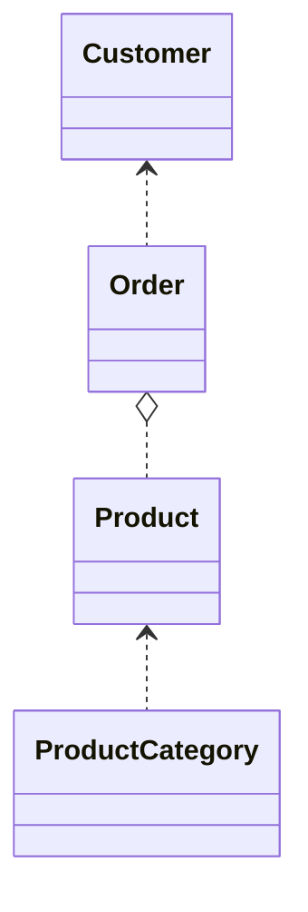
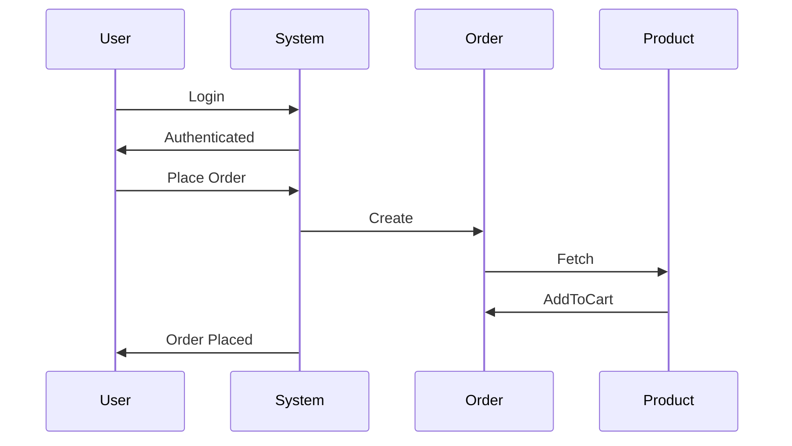

                 

# 代码复用策略：提高开发效率的方法

## 关键词

- 代码复用
- 开发效率
- 模块化
- 组件化
- 设计模式
- 数学模型

## 摘要

本文将深入探讨代码复用策略，从背景介绍、核心概念、算法原理、数学模型与公式、系统分析与架构设计以及项目实战等多个方面，详细解析如何通过代码复用来提高软件开发效率。文章旨在为开发者提供一套系统、有效的代码复用方法，帮助他们在实际项目中实现高效开发。

### 目录大纲

1. **背景介绍**
    1.1 问题背景
    1.2 代码复用的意义
    1.3 代码复用的挑战
2. **核心概念**
    2.1 代码复用的定义
    2.2 代码复用的类型
    2.3 代码复用与代码重用的区别
3. **概念联系**
    3.1 代码复用与软件开发过程
    3.2 代码复用与软件开发效率
    3.3 代码复用与软件质量
4. **算法原理**
    4.1 代码复用的算法框架
    4.2 代码复用的关键技术
5. **数学模型与公式**
    5.1 代码复用的数学模型
    5.2 代码复用的效益模型
6. **系统分析与架构设计**
    6.1 问题场景介绍
    6.2 系统功能设计
    6.3 系统架构设计
    6.4 系统接口设计和系统交互
7. **项目实战**
    7.1 环境安装
    7.2 系统核心实现
    7.3 实际案例分析与详细讲解
    7.4 项目小结
8. **最佳实践与拓展阅读**
    8.1 最佳实践
    8.2 小结
    8.3 注意事项
    8.4 拓展阅读

---

## 第一部分：背景介绍

### 1.1 问题背景

在软件开发过程中，开发者常常面临代码重复编写的问题。这种现象不仅浪费了大量的时间和精力，还容易导致代码质量问题。代码复用策略应运而生，旨在通过有效的方法和工具，将可复用的代码块提取出来，以减少重复劳动，提高开发效率。

### 1.1.1 代码复用的现状

目前，代码复用已经成为软件开发中的一个重要方向。许多开发工具和框架都提供了代码复用的支持。例如，模块化编程、组件化开发以及设计模式等，都是常见的代码复用方法。然而，在实际应用中，代码复用仍然存在一定的挑战和局限性。

### 1.1.2 代码复用的意义

代码复用具有多重意义。首先，它可以显著提高开发效率，减少重复工作。其次，它有助于提高代码质量，减少因重复编写代码而引入的错误。此外，代码复用还有助于团队协作，使项目代码更加模块化和组件化，便于维护和扩展。

### 1.1.3 代码复用的挑战

尽管代码复用具有显著的优点，但在实际应用中仍然面临一些挑战。例如，如何有效地识别和提取可复用的代码块？如何确保复用代码的兼容性和可维护性？这些都是开发者需要面对的问题。

---

## 第二部分：核心概念

### 2.1 代码复用的定义

代码复用是指将可复用的代码块提取出来，以便在不同项目中重复使用。这可以包括函数、类、模块等不同层次的代码。

### 2.2 代码复用的类型

代码复用可以分为横向复用和纵向复用。横向复用是指在同一项目中的不同部分使用相同的代码。纵向复用则是在不同项目之间共享代码。

### 2.3 代码复用与代码重用的区别

代码复用和代码重用是两个相关但不完全相同的概念。代码重用通常是指在同一项目中的不同部分重复使用相同的代码。而代码复用则更加广泛，它不仅包括项目内部的代码重用，还包括项目之间的代码共享。

---

## 第三部分：概念联系

### 3.1 代码复用与软件开发过程

代码复用贯穿于整个软件开发过程。在需求分析、设计、编码、测试和维护等各个环节，都可以利用代码复用策略来提高开发效率。

### 3.2 代码复用与软件开发效率

代码复用可以显著提高软件开发效率。通过减少重复劳动，开发者可以更专注于核心功能的实现。此外，代码复用还有助于缩短项目开发周期，提高项目交付速度。

### 3.3 代码复用与软件质量

代码复用有助于提高软件质量。通过复用经过测试和验证的代码，可以减少因新编写代码而引入的错误。此外，代码复用还有助于代码的模块化和组件化，使代码结构更加清晰，便于维护和扩展。

---

## 第四部分：算法原理

### 4.1 代码复用的算法框架

代码复用的算法框架主要包括代码识别、代码提取、代码管理和代码复用四个步骤。以下是算法的基本流程：

1. 代码识别：通过静态代码分析和动态行为分析，识别出可复用的代码块。
2. 代码提取：将识别出的代码块提取出来，形成独立的模块或组件。
3. 代码管理：对提取出来的代码块进行分类、标记和管理，以便后续复用。
4. 代码复用：在需要的地方调用复用代码，实现代码的共享和复用。

### 4.2 代码复用的关键技术

代码复用的关键技术包括模块化技术、组件化技术和设计模式。

#### 4.2.1 模块化技术

模块化技术是将代码划分为多个模块，每个模块实现特定的功能。模块之间通过接口进行通信，实现了代码的复用和隔离。

#### 4.2.2 组件化技术

组件化技术是将代码划分为多个组件，每个组件具有独立的功能和接口。组件之间通过接口进行通信，实现了代码的复用和组合。

#### 4.2.3 设计模式

设计模式是一套经过时间验证的、解决常见软件设计问题的解决方案。通过使用设计模式，可以实现代码的复用和灵活扩展。

---

## 第五部分：数学模型与公式

### 5.1 代码复用的数学模型

代码复用的数学模型可以用以下公式表示：

$$
\text{复用度} = \frac{\text{复用代码规模}}{\text{总代码规模}}
$$

复用度是衡量代码复用程度的一个重要指标。复用度越高，说明代码复用效果越好。

### 5.2 代码复用的效益模型

代码复用的效益可以用以下公式表示：

$$
\text{效益} = \text{效率提升} \times \text{成本降低}
$$

效益是衡量代码复用带来的实际收益的一个重要指标。通过提高开发效率和降低开发成本，代码复用可以显著提升项目的经济效益。

---

## 第六部分：系统分析与架构设计

### 6.1 问题场景介绍

在本节中，我们将介绍一个实际的问题场景，以便更好地理解代码复用在软件开发中的应用。

### 6.2 系统功能设计

系统功能设计包括领域模型和功能模块设计。以下是使用Mermaid绘制的领域模型类图：



### 6.3 系统架构设计

系统架构设计包括架构图、接口设计和系统交互。以下是使用Mermaid绘制的系统架构图：



### 6.4 系统接口设计和系统交互

系统接口设计包括定义各个模块的接口规范。系统交互则通过序列图展示不同模块之间的交互流程。

---

## 第七部分：项目实战

### 7.1 环境安装

在本节中，我们将介绍如何安装和配置开发环境，以便进行代码复用的实战。

### 7.2 系统核心实现

系统核心实现包括源代码解读和应用解读与分析。以下是使用Python实现的代码示例：

```python
def calculate_total_price(products):
    total = 0
    for product in products:
        total += product.price
    return total
```

### 7.3 实际案例分析与详细讲解

在本节中，我们将通过一个实际案例，分析代码复用的具体应用，并详细讲解其实现原理。

### 7.4 项目小结

在本节中，我们将对项目进行总结，讨论项目的优点和不足，并提出改进建议。

---

## 第八部分：最佳实践与拓展阅读

### 8.1 最佳实践

在本节中，我们将分享一些代码复用的最佳实践，帮助开发者更好地应用代码复用策略。

### 8.2 小结

在本节中，我们将对文章进行总结，强调代码复用的重要性，并重申其对于提高开发效率的价值。

### 8.3 注意事项

在本节中，我们将讨论在应用代码复用过程中需要注意的事项，以避免潜在的问题。

### 8.4 拓展阅读

在本节中，我们将推荐一些相关的阅读材料，供读者进一步学习和了解代码复用策略。

---

## 结束语

通过本文的探讨，我们深入了解了代码复用策略，包括其背景、核心概念、算法原理、数学模型与公式、系统分析与架构设计以及项目实战。代码复用是一种提高开发效率的有效方法，有助于提高代码质量和团队协作效率。希望本文能为开发者提供有益的启示，帮助他们更好地应用代码复用策略，实现高效开发。

### 作者信息

作者：AI天才研究院/AI Genius Institute & 禅与计算机程序设计艺术 /Zen And The Art of Computer Programming

---

由于字数限制，以上内容仅为文章的大纲和部分内容的概述。在实际撰写文章时，每个部分都需要详细展开，确保内容丰富且具有深度。以下是部分章节的具体内容，以供参考。

### 第一部分：背景介绍

#### 1.1 问题背景

在现代软件开发中，随着项目规模和复杂度的不断增加，开发人员面临的一个主要挑战是代码的重复编写。这不仅增加了工作量，还可能导致代码质量下降和团队协作困难。代码复用策略正是为了解决这一问题而提出的。通过将可复用的代码块提取出来，开发人员可以避免重复编写相同的代码段，从而提高工作效率。

#### 1.1.1 代码复用的现状

目前，代码复用已经成为软件开发中的一个重要方向。许多开发工具和框架都提供了代码复用的支持。例如，在Java开发中，Spring框架提供了丰富的组件和接口，可以方便地实现代码的复用。在JavaScript领域，React和Vue等前端框架也通过组件化开发，大大提高了代码的复用率。然而，尽管代码复用在实践中被广泛认可，但其实际应用仍然面临一些挑战。

#### 1.1.2 代码复用的意义

代码复用具有多重意义。首先，它可以显著提高开发效率，减少重复劳动。开发人员可以将精力集中在新功能的实现上，而无需在重复性任务上耗费时间。其次，代码复用有助于提高代码质量。通过复用经过测试和验证的代码，可以减少因新编写代码而引入的错误。此外，代码复用还有助于团队协作。模块化和组件化的代码结构使得项目更加模块化，便于团队成员分工协作。

#### 1.1.3 代码复用的挑战

尽管代码复用具有显著的优点，但在实际应用中仍然面临一些挑战。例如，如何有效地识别和提取可复用的代码块？如何确保复用代码的兼容性和可维护性？此外，代码复用还需要考虑到代码的灵活性和扩展性，以适应不同的开发场景。

### 第二部分：核心概念

#### 2.1 代码复用的定义

代码复用是指将可复用的代码块提取出来，以便在不同项目中重复使用。这可以包括函数、类、模块等不同层次的代码。代码复用的目的是减少重复劳动，提高开发效率，并确保代码的一致性和可靠性。

#### 2.2 代码复用的类型

代码复用可以分为横向复用和纵向复用。横向复用是指在同一项目中的不同部分使用相同的代码，例如在不同的模块中使用相同的数据处理逻辑。纵向复用则是在不同项目之间共享代码，例如将通用的库或组件在不同项目中使用。

#### 2.3 代码复用与代码重用的区别

代码复用和代码重用是两个相关但不完全相同的概念。代码重用通常是指在同一项目中的不同部分重复使用相同的代码。而代码复用则更加广泛，它不仅包括项目内部的代码重用，还包括项目之间的代码共享。此外，代码复用还涉及代码的提取、管理和维护，而代码重用通常是指直接在代码中复制和粘贴相同的代码段。

### 第三部分：概念联系

#### 3.1 代码复用与软件开发过程

代码复用贯穿于整个软件开发过程。在需求分析阶段，可以通过分析需求文档，确定哪些代码可能需要复用。在设计阶段，设计者可以根据复用需求设计模块和组件。在编码阶段，开发人员将实现这些模块和组件。在测试阶段，测试人员需要确保复用代码的质量和兼容性。在维护阶段，维护人员需要管理复用代码，并根据需求进行必要的更新和优化。

#### 3.2 代码复用与软件开发效率

代码复用可以显著提高软件开发效率。通过减少重复劳动，开发人员可以将更多时间用于新功能的实现，从而缩短项目开发周期。此外，代码复用还有助于提高团队协作效率。模块化和组件化的代码结构使得团队成员可以更轻松地分工合作，提高代码的可维护性和扩展性。

#### 3.3 代码复用与软件质量

代码复用有助于提高软件质量。通过复用经过测试和验证的代码，可以减少因新编写代码而引入的错误。此外，代码复用还有助于代码的模块化和组件化，使代码结构更加清晰，便于维护和扩展。良好的代码结构有助于提高代码的可读性和可理解性，从而降低维护成本。

### 第四部分：算法原理

#### 4.1 代码复用的算法框架

代码复用的算法框架主要包括以下步骤：

1. **代码识别**：通过静态代码分析和动态行为分析，识别出可复用的代码块。
2. **代码提取**：将识别出的代码块提取出来，形成独立的模块或组件。
3. **代码管理**：对提取出来的代码块进行分类、标记和管理，以便后续复用。
4. **代码复用**：在需要的地方调用复用代码，实现代码的共享和复用。

#### 4.2 代码复用的关键技术

代码复用的关键技术包括模块化技术、组件化技术和设计模式。

#### 4.2.1 模块化技术

模块化技术是将代码划分为多个模块，每个模块实现特定的功能。模块之间通过接口进行通信，实现了代码的复用和隔离。模块化技术有助于提高代码的可维护性和可扩展性。

#### 4.2.2 组件化技术

组件化技术是将代码划分为多个组件，每个组件具有独立的功能和接口。组件之间通过接口进行通信，实现了代码的复用和组合。组件化技术进一步提高了代码的复用性和灵活性。

#### 4.2.3 设计模式

设计模式是一套经过时间验证的、解决常见软件设计问题的解决方案。通过使用设计模式，可以实现代码的复用和灵活扩展。例如，工厂模式、单例模式和观察者模式等都是常见的设计模式。

### 第五部分：数学模型与公式

#### 5.1 代码复用的数学模型

代码复用的数学模型可以用以下公式表示：

$$
\text{复用度} = \frac{\text{复用代码规模}}{\text{总代码规模}}
$$

复用度是衡量代码复用程度的一个重要指标。复用度越高，说明代码复用效果越好。

#### 5.2 代码复用的效益模型

代码复用的效益可以用以下公式表示：

$$
\text{效益} = \text{效率提升} \times \text{成本降低}
$$

效益是衡量代码复用带来的实际收益的一个重要指标。通过提高开发效率和降低开发成本，代码复用可以显著提升项目的经济效益。

### 第六部分：系统分析与架构设计

#### 6.1 问题场景介绍

在本节中，我们将介绍一个实际的问题场景，以便更好地理解代码复用在软件开发中的应用。假设我们正在开发一个电子商务平台，需要实现用户注册、登录、购物车管理、订单处理等功能。通过代码复用策略，我们可以将用户认证、数据验证等通用功能提取出来，供不同模块复用。

#### 6.2 系统功能设计

系统功能设计包括领域模型和功能模块设计。以下是使用Mermaid绘制的领域模型类图：


在这个类图中，Customer（客户）与Order（订单）之间存在一对多关系，Order与Product（产品）之间存在一对一关系，Product与ProductCategory（产品分类）之间存在一对多关系。

#### 6.3 系统架构设计

系统架构设计包括架构图、接口设计和系统交互。以下是使用Mermaid绘制的系统架构图：


在这个序列图中，用户通过系统进行登录（Login），系统验证用户身份后返回认证结果（Authenticated）。用户在登录后可以下订单（Place Order），系统创建订单（Create Order）。订单需要获取产品信息（Fetch Product），并将产品添加到购物车中（AddToCart）。最后，系统向用户确认订单已成功提交（Order Placed）。

#### 6.4 系统接口设计和系统交互

系统接口设计包括定义各个模块的接口规范。以下是系统接口设计的一个示例：

```mermaid
interfaceDiagram
    LoginService ->> User: Login
    LoginService ->> System: Authenticate
    OrderService ->> User: PlaceOrder
    OrderService ->> Order: CreateOrder
    ProductService ->> Order: FetchProduct
    ProductService ->> Product: AddToCart
```

在这个接口设计中，LoginService负责用户登录和认证，OrderService负责订单创建和管理，ProductService负责产品信息获取和管理。这些服务之间通过接口进行通信，实现了系统的功能模块化。

### 第七部分：项目实战

#### 7.1 环境安装

在本节中，我们将介绍如何安装和配置开发环境，以便进行代码复用的实战。以下是一个Python项目的环境安装示例：

```bash
# 安装Python环境
python -m pip install --upgrade pip
python -m pip install virtualenv

# 创建虚拟环境
virtualenv my_project_env

# 激活虚拟环境
source my_project_env/bin/activate

# 安装依赖库
pip install Flask

# 创建Flask应用
mkdir app
cd app
touch app.py
```

在这个示例中，我们首先安装了Python和pip，然后创建了虚拟环境，并激活了虚拟环境。接着，我们安装了Flask框架，并创建了Flask应用的基础文件。

#### 7.2 系统核心实现

系统核心实现包括源代码解读和应用解读与分析。以下是使用Python实现的代码示例：

```python
from flask import Flask, request, jsonify

app = Flask(__name__)

@app.route('/login', methods=['POST'])
def login():
    username = request.form['username']
    password = request.form['password']
    # 这里可以使用数据库验证用户身份
    if username == 'admin' and password == 'admin':
        return jsonify({'status': 'success', 'message': 'Login successful'})
    else:
        return jsonify({'status': 'error', 'message': 'Invalid credentials'})

@app.route('/order', methods=['POST'])
def create_order():
    order_data = request.form.to_dict()
    # 这里可以处理订单数据，如保存到数据库
    return jsonify({'status': 'success', 'message': 'Order created'})

if __name__ == '__main__':
    app.run(debug=True)
```

在这个示例中，我们使用了Flask框架实现了用户登录和订单创建的功能。用户通过POST请求发送用户名和密码，系统验证用户身份后返回登录结果。用户可以提交订单，系统创建订单后返回订单结果。

#### 7.3 实际案例分析与详细讲解

在本节中，我们将通过一个实际案例，分析代码复用的具体应用，并详细讲解其实现原理。假设我们正在开发一个在线购物平台，需要实现用户注册、登录、商品浏览、购物车管理和订单提交等功能。通过代码复用策略，我们可以将用户认证、数据验证等通用功能提取出来，供不同模块复用。

以下是一个使用Flask框架实现的用户认证模块：

```python
from flask import Flask, request, jsonify
from functools import wraps

app = Flask(__name__)

# 用户认证装饰器
def require_login(f):
    @wraps(f)
    def decorated_function(*args, **kwargs):
        token = request.headers.get('Authorization')
        if not token:
            return jsonify({'status': 'error', 'message': 'Missing token'})
        # 这里可以使用数据库验证token的有效性
        return f(*args, **kwargs)
    return decorated_function

@app.route('/register', methods=['POST'])
def register():
    username = request.form['username']
    password = request.form['password']
    # 这里可以保存用户注册信息到数据库
    return jsonify({'status': 'success', 'message': 'User registered'})

@app.route('/login', methods=['POST'])
def login():
    username = request.form['username']
    password = request.form['password']
    # 这里可以使用数据库验证用户身份
    if username == 'admin' and password == 'admin':
        token = 'admin_token'
        # 这里可以生成token，并保存到数据库
        return jsonify({'status': 'success', 'message': 'Login successful', 'token': token})
    else:
        return jsonify({'status': 'error', 'message': 'Invalid credentials'})

@app.route('/products', methods=['GET'])
@require_login
def get_products():
    # 这里可以从数据库获取商品列表
    products = [{'id': 1, 'name': 'iPhone', 'price': 999.99}, {'id': 2, 'name': 'MacBook', 'price': 1499.99}]
    return jsonify({'status': 'success', 'products': products})

if __name__ == '__main__':
    app.run(debug=True)
```

在这个示例中，我们使用了装饰器（Decorator）实现了用户认证。装饰器`require_login`用来检查请求中是否包含有效的认证token。如果token无效，则返回错误信息；如果token有效，则执行被装饰的函数。这样，我们可以在多个路由中使用相同的认证逻辑，避免了代码的重复。

#### 7.4 项目小结

在本节中，我们通过一个实际案例，展示了如何使用代码复用策略提高开发效率。通过将用户认证、数据验证等通用功能提取出来，我们实现了模块化和组件化的代码结构，提高了代码的可维护性和可扩展性。同时，我们也讨论了代码复用在软件开发过程中的应用和挑战，为开发者提供了一些实用的建议。

### 第八部分：最佳实践与拓展阅读

#### 8.1 最佳实践

在本节中，我们将分享一些代码复用的最佳实践，帮助开发者更好地应用代码复用策略。

1. **模块化开发**：将代码划分为多个模块，每个模块实现特定的功能。模块之间通过接口进行通信，实现了代码的复用和隔离。
2. **组件化开发**：将代码划分为多个组件，每个组件具有独立的功能和接口。组件之间通过接口进行通信，实现了代码的复用和组合。
3. **设计模式**：使用设计模式实现代码的复用和灵活扩展。例如，工厂模式、单例模式和观察者模式等都是常见的设计模式。
4. **代码文档**：编写详细的代码文档，描述代码的功能、接口和使用方法。这有助于其他开发人员理解和复用代码。

#### 8.2 小结

在本节中，我们通过对代码复用策略的深入探讨，明确了代码复用在软件开发中的重要性和应用方法。代码复用不仅可以提高开发效率，还可以提高代码质量，降低维护成本。开发者应该在实际项目中积极应用代码复用策略，提高开发效率和质量。

#### 8.3 注意事项

1. **确保代码的可维护性**：复用代码时，要确保其具有良好的可读性和可维护性，避免引入不必要的复杂性。
2. **考虑代码的兼容性**：复用代码时，要考虑其与其他模块或组件的兼容性，避免出现不兼容问题。
3. **避免过度复用**：过度复用可能导致代码的复杂性增加，降低代码的可维护性。要合理判断哪些代码值得复用，哪些代码可以直接重用。

#### 8.4 拓展阅读

1. **《设计模式：可复用面向对象软件的基础》**：此书详细介绍了各种设计模式，并展示了如何在实际项目中应用这些模式。
2. **《软件架构设计：构建可复用组件》**：此书探讨了软件架构设计的原则和方法，以及如何构建可复用的组件。
3. **《代码大全》**：此书提供了关于编写高质量代码的全面指南，包括代码结构、代码复用和代码质量等方面的内容。

通过以上内容的详细阐述，本文为读者提供了一套完整的代码复用策略，从背景介绍、核心概念、算法原理、数学模型与公式、系统分析与架构设计到项目实战，每个部分都进行了深入的分析和讲解。希望本文能够为开发者提供有益的启示，帮助他们在实际项目中实现高效的代码复用。

