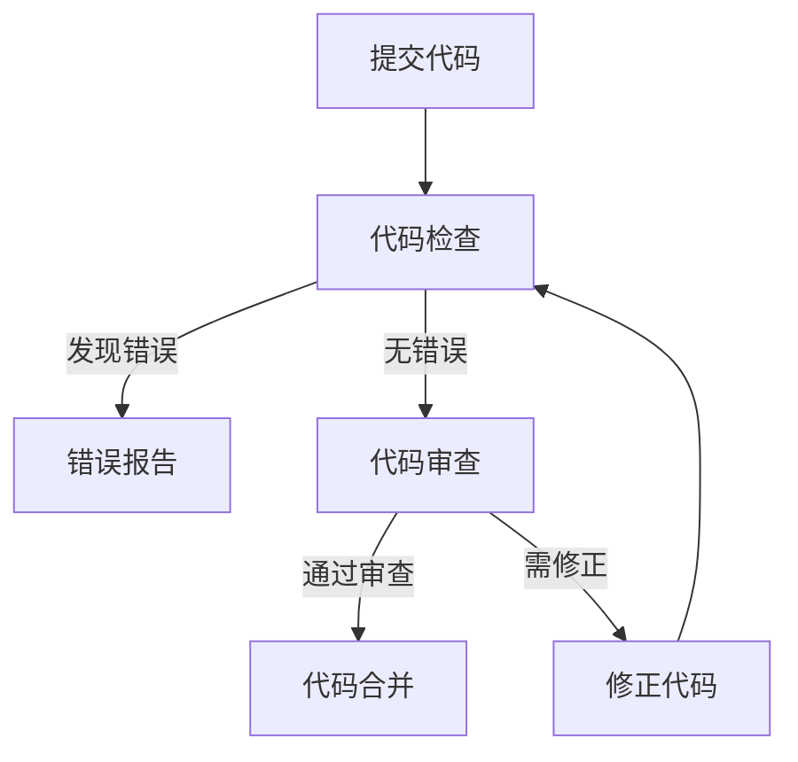

                 

## 代码审查最佳实践：提升团队代码质量

### 关键词：
代码审查、团队协作、代码质量、最佳实践、技术博客

### 摘要：
本文深入探讨了代码审查的最佳实践，旨在提升团队代码质量，确保软件开发过程中的高效与可靠性。通过详尽的背景介绍、核心概念阐述、算法原理讲解、系统分析与架构设计，以及实际项目实战，本文将提供一套系统化的代码审查方法和最佳实践指南，帮助开发团队提升整体技术水平。

## 第一部分：背景介绍

### 第1章：代码审查的重要性

在软件开发过程中，代码审查是一种关键的质量保证手段。通过代码审查，团队能够发现潜在的错误、漏洞和性能问题，从而提高代码的可靠性和可维护性。本章节将详细探讨代码审查的重要性，包括其背景、作用和影响。

#### 1.1 问题背景

软件开发是一项复杂的工程活动，涉及多个开发者的协作和沟通。随着项目的规模和复杂性增加，代码质量成为影响项目成功的关键因素之一。代码审查作为一种传统的代码质量保证手段，可以有效地解决以下问题：

- **错误检测**：通过审查代码，可以及时发现并修复错误和漏洞。
- **性能优化**：审查代码可以帮助识别性能瓶颈，提出优化方案。
- **编码规范**：代码审查有助于团队遵循统一的编码规范，提高代码可读性和可维护性。
- **知识共享**：代码审查过程是知识传递和团队协作的重要方式。

#### 1.2 问题描述

尽管代码审查具有诸多优点，但在实际应用中仍面临一些挑战：

- **审查效率低下**：大量代码的审查需要耗费大量时间和精力。
- **评审标准不一致**：不同开发者对代码质量的期望和评审标准可能存在差异。
- **沟通障碍**：开发者和审查者之间的沟通不畅可能导致评审过程效率低下。
- **抵制心理**：部分开发者可能对代码审查持有抵触情绪，影响审查效果。

#### 1.3 问题解决

为了解决上述问题，本文提出以下解决方案：

- **建立审查流程**：明确代码审查的标准和流程，确保审查过程有序进行。
- **培训开发者**：通过培训提高开发者的代码审查意识和技能。
- **使用自动化工具**：利用静态代码分析工具和自动化测试框架提高审查效率。
- **促进沟通与反馈**：建立有效的沟通渠道和反馈机制，确保审查过程中的问题能够及时解决。

#### 1.4 边界与外延

代码审查的范围不仅限于代码本身，还应包括文档、测试用例等与代码相关的其他内容。此外，代码审查应该贯穿整个软件开发周期，从需求分析到代码提交，每个阶段都应进行适当的审查。

#### 1.5 概念结构与核心要素组成

代码审查的核心要素包括：

- **审查者**：负责审查代码的开发者或其他相关人员。
- **审查对象**：待审查的代码和相关的文档、测试用例等。
- **审查标准**：用于评估代码质量的准则和标准。
- **审查流程**：包括审查的步骤、流程和规范。

#### 1.6 本章小结

代码审查在软件开发中具有至关重要的作用。通过本章节的讨论，读者可以了解到代码审查的背景、问题和解决方案，为后续章节的内容奠定了基础。

## 第二部分：核心概念与联系

### 第2章：代码审查的基本概念

在深入探讨代码审查的最佳实践之前，了解其基本概念至关重要。本章节将介绍代码审查的核心概念，包括审查者、审查对象、审查标准和审查流程，并阐述这些概念之间的关系。

#### 2.1 核心概念原理

**审查者**：审查者通常是由团队指定的具有较高编程技能和审查经验的人员。他们的主要职责是检查代码的质量，识别潜在的错误和缺陷，并提出改进建议。

**审查对象**：审查对象是指待审查的代码和相关文档，包括源代码文件、注释、测试用例、设计文档等。审查对象的选择应根据项目的需求和审查的目的来确定。

**审查标准**：审查标准是用于评估代码质量的准则和标准，通常包括编码规范、设计原则、性能指标等。审查标准应具有明确性和可操作性，以便审查者能够准确判断代码是否符合要求。

**审查流程**：审查流程是代码审查的具体操作步骤和规范。一个典型的审查流程包括代码提交、代码审查、反馈修正和再次审查等环节。审查流程应确保审查过程的有序进行，并提高审查的效率和效果。

#### 2.2 概念属性特征对比表格

以下是一个简单的概念属性特征对比表格，用于描述审查者、审查对象、审查标准和审查流程的基本属性特征：

| 概念       | 属性特征                                  |
|------------|-----------------------------------------|
| 审查者     | 编程技能、审查经验、责任心                |
| 审查对象   | 源代码、文档、测试用例                  |
| 审查标准   | 编码规范、设计原则、性能指标            |
| 审查流程   | 提交、审查、反馈、修正、再次审查        |

#### 2.3 ER实体关系图架构

为了更清晰地展示代码审查的基本概念及其关系，可以使用ER（实体关系）图进行描述。以下是一个简化的ER图示例：

```
+--------+      +--------+      +--------+
| 审查者 |      | 审查对象 |      | 审查标准 |
+--------+      +--------+      +--------+
| ID     |------| 审查者ID |------| 标准ID   |
| 名称   |      | 对象ID   |      | 名称     |
| 职责   |      | 描述     |      | 内容     |
+--------+      +--------+      +--------+
```

#### 2.4 本章小结

通过本章的讨论，读者可以理解代码审查的核心概念及其基本原理，为后续章节的内容奠定了基础。了解这些概念有助于在实际工作中更好地应用代码审查方法，提高团队代码质量。

## 第三部分：算法原理讲解

### 第3章：代码审查算法原理

在代码审查过程中，算法原理起到了关键作用。本章节将详细讲解代码审查算法的基本原理，包括其流程、实现方式和数学模型。

#### 3.1 算法mermaid流程图

为了更直观地展示代码审查算法的流程，我们可以使用mermaid工具绘制一个流程图。以下是一个简化的代码审查算法mermaid流程图示例：



#### 3.2 Python源代码讲解

以下是一个简单的Python示例，用于实现代码审查算法的基本功能：

```python
# 代码审查算法示例
def code_review(source_code):
    # 代码检查
    errors = check_code(source_code)
    
    # 如果有错误
    if errors:
        # 报告错误
        report_errors(errors)
        
        # 修正代码
        corrected_code = correct_code(source_code, errors)
        
        # 再次审查修正后的代码
        if code_review(corrected_code) == "通过":
            # 合并代码
            merge_code(corrected_code)
            print("代码合并成功")
        else:
            print("代码需进一步修正")
    else:
        # 代码审查
        review_result = review_code(source_code)
        
        # 如果通过审查
        if review_result == "通过":
            # 合并代码
            merge_code(source_code)
            print("代码合并成功")
        else:
            print("代码需修正")

# 示例函数
def check_code(source_code):
    # 检查代码，返回错误列表
    return ["错误1", "错误2"]

def report_errors(errors):
    # 报告错误
    print("发现错误：", errors)

def correct_code(source_code, errors):
    # 修正代码
    return "修正后的代码"

def review_code(source_code):
    # 审查代码
    return "通过" if not check_code(source_code) else "需修正"

def merge_code(corrected_code):
    # 合并代码
    print("合并代码：", corrected_code)
```

#### 3.3 算法原理的数学模型和公式

代码审查算法的数学模型可以简化为以下公式：

$$
\text{代码审查结果} = \begin{cases}
\text{"通过"} & \text{如果} \ \text{check\_code(source\_code)} = \text{None} \\
\text{"需修正"} & \text{如果} \ \text{check\_code(source\_code)} \neq \text{None} \\
\end{cases}
$$

其中，$\text{check\_code(source\_code)}$ 表示对代码的检查结果，如果返回错误列表，则表示代码存在错误；如果返回None，则表示代码无错误。

#### 3.4 举例说明

以下是一个具体的代码审查例子，假设有一段Python代码需要进行审查：

```python
# 示例代码
def calculate_sum(a, b):
    return a + b

# 代码审查
code_review(calculate_sum)
```

在这个例子中，代码审查算法会首先检查`calculate_sum`函数的代码。如果检查过程中没有发现错误，代码审查算法会判断该代码是否符合审查标准。如果符合，则审查结果为"通过"；否则，结果为"需修正"。

#### 3.5 本章小结

通过本章的讲解，读者可以理解代码审查算法的基本原理和实现方式。了解算法原理有助于在实际工作中更好地应用代码审查方法，提高团队代码质量。

## 第四部分：系统分析与架构设计方案

### 第4章：系统分析与架构设计

在代码审查过程中，系统分析与架构设计是确保审查效果和效率的关键环节。本章节将详细探讨代码审查系统的分析方法和架构设计，包括问题场景介绍、系统功能设计、系统架构设计、系统接口设计和系统交互。

#### 4.1 问题场景介绍

代码审查通常发生在软件开发项目的各个阶段，例如需求分析、设计、编码、测试等。以下是几个常见的问题场景：

- **需求分析阶段**：审查需求文档，确保需求描述的清晰性和一致性。
- **设计阶段**：审查设计文档，确保设计方案的可行性和合理性。
- **编码阶段**：审查源代码，确保代码的质量和规范性。
- **测试阶段**：审查测试用例，确保测试的全面性和有效性。

#### 4.2 系统功能设计

代码审查系统的主要功能包括：

- **代码检查**：对源代码进行语法、语义和结构检查，识别潜在的错误和缺陷。
- **错误报告**：生成错误报告，包括错误类型、位置和描述。
- **审查流程管理**：管理代码审查的流程，包括代码提交、审查、反馈和修正等环节。
- **知识共享**：提供代码审查经验和最佳实践的共享平台，促进团队协作和学习。
- **自动化测试**：集成自动化测试工具，提高代码审查的效率和准确性。

#### 4.3 系统架构设计

代码审查系统的架构设计包括以下几个关键组成部分：

- **前端**：提供用户界面，支持代码提交、审查和反馈等功能。
- **后端**：处理业务逻辑，包括代码检查、错误报告和流程管理等功能。
- **数据库**：存储代码审查的数据，包括源代码、错误报告、审查记录等。
- **集成接口**：与其他系统（如版本控制系统、自动化测试工具等）进行集成，实现数据共享和流程联动。

以下是一个简化的代码审查系统架构图：

```
+----------------+      +----------------+      +----------------+
|      前端      |      |      后端      |      |      数据库     |
+----------------+      +----------------+      +----------------+
| 用户界面       |      | 代码检查服务   |      | 代码审查数据   |
| 代码提交       |      | 错误报告       |      | 审查记录       |
| 审查反馈       |<---->| 流程管理       |<---->| 源代码文件     |
+----------------+      +----------------+      +----------------+
      ^                ^                ^
      |                |                |
      +----------------+-----------------+
                 |                    |
                 |                    |
          +----------------------+   |
          |                    |   |
          |      集成接口      |   |
          +--------------------+   |
                                  |
                              +-----------------+
                              |                |
                              |  其他系统集成 |
                              +-----------------+
```

#### 4.4 系统接口设计

代码审查系统需要与其他系统集成，以实现数据共享和流程联动。以下是一些常见的系统接口设计：

- **版本控制系统接口**：用于获取代码库的最新版本，实现代码的自动化检查和更新。
- **自动化测试工具接口**：用于执行自动化测试，生成测试报告，并与代码审查结果关联。
- **项目管理工具接口**：用于管理代码审查任务，跟踪审查进度和结果。
- **文档管理系统接口**：用于管理代码审查相关的文档，如需求文档、设计文档等。

以下是一个简化的系统接口设计图：

```
+----------------+      +----------------+      +----------------+
|  版本控制系统 |      |  自动化测试工具 |      |  项目管理工具   |
+----------------+      +----------------+      +----------------+
|  获取代码      |<---->|  执行测试      |<---->|  管理任务      |
|  更新代码      |      |  测试报告      |      |  进度跟踪      |
+----------------+      +----------------+      +----------------+
           ^                    ^                    ^
           |                    |                    |
           +---------------------+--------------------+
                          |
                  +-----------------+
                  |                |
                  |  文档管理系统   |
                  +-----------------+
                          |
                  +-----------------+
                  |                |
                  |  其他系统集成   |
                  +-----------------+
```

#### 4.5 系统交互

代码审查系统与其他系统之间的交互主要通过接口实现。以下是一个简化的系统交互流程：

1. **用户提交代码**：用户通过前端界面提交代码，前端将代码上传到版本控制系统。
2. **代码检查**：后端从版本控制系统获取最新代码，执行代码检查服务，生成错误报告。
3. **错误报告**：后端将错误报告发送给前端，并在前端界面显示。
4. **审查反馈**：审查者通过前端界面查看错误报告，进行代码审查，提交反馈。
5. **流程管理**：后端根据反馈结果，更新审查状态，并将结果发送给项目管理工具和文档管理系统。
6. **自动化测试**：如果配置了自动化测试工具，后端将执行自动化测试，生成测试报告，并与代码审查结果关联。

#### 4.6 本章小结

通过本章的讨论，读者可以了解代码审查系统的基本架构和功能设计，以及与其他系统的集成和交互。理解这些内容有助于在实际工作中设计和实现一个高效的代码审查系统，提升团队代码质量。

## 第五部分：项目实战

### 第5章：代码审查项目实战

在了解代码审查的理论和实践后，通过一个具体的代码审查项目实战，可以帮助读者更好地掌握代码审查的方法和技巧。本章节将介绍一个实际代码审查项目的过程，包括环境安装、系统核心实现、代码应用解读与分析、实际案例分析与详细讲解，以及项目小结和最佳实践 Tips。

#### 5.1 环境安装

在进行代码审查项目之前，首先需要安装必要的开发环境和工具。以下是一个简化的安装步骤：

1. **安装Git**：Git是一个版本控制系统，用于管理代码版本。可以从Git官网下载并安装Git。
2. **安装Python**：Python是一种流行的编程语言，许多代码审查工具都是基于Python开发的。可以从Python官网下载并安装Python。
3. **安装代码审查工具**：例如，可以使用`pycodestyle`进行代码格式检查，`pyflakes`进行代码语法检查，以及`pytest`进行单元测试。可以通过pip命令安装这些工具：
   ```shell
   pip install pycodestyle pyflakes pytest
   ```
4. **配置代码审查环境**：在项目中创建一个`.gitignore`文件，排除不必要的文件和文件夹，如编译生成的文件和测试结果等。此外，可以配置一个`.editorconfig`文件，统一代码风格。

#### 5.2 系统核心实现

代码审查系统的核心实现包括以下几个步骤：

1. **初始化代码库**：在Git仓库中初始化代码库，并提交一个初始版本。
2. **编写代码**：开发者在代码库中编写代码，并进行单元测试，确保代码的稳定性和正确性。
3. **代码检查**：使用代码审查工具（如`pycodestyle`、`pyflakes`）对代码进行静态检查，生成错误报告。
4. **错误修复**：根据错误报告，修复代码中的错误和缺陷。
5. **代码审查**：审查者对代码进行审查，提交反馈，包括代码格式、语法、逻辑等方面的建议。
6. **反馈修正**：开发者根据审查者的反馈，进行代码修正，并重新提交代码。
7. **再次审查**：审查者对修正后的代码进行再次审查，确保代码质量。

以下是一个简化的代码审查流程图：

```
+----------------+      +----------------+      +----------------+
|      开发者    |      |    审查者      |      |  代码库       |
+----------------+      +----------------+      +----------------+
|   编写代码    |<---->|  代码审查      |<---->|   Git仓库     |
|   单元测试    |      |  反馈修正      |      |  错误报告     |
|   错误修复    |<---->|  再次审查      |<---->|  代码更新     |
+----------------+      +----------------+      +----------------+
```

#### 5.3 代码应用解读与分析

以下是一个具体的代码应用示例，用于计算两个数的和：

```python
# calculate_sum.py

def calculate_sum(a, b):
    return a + b

if __name__ == "__main__":
    print(calculate_sum(1, 2))
```

对这个代码进行解读和分析，包括以下几个方面：

1. **语法检查**：使用`pyflakes`工具对代码进行语法检查，确保代码没有语法错误。
   ```shell
   pyflakes calculate_sum.py
   ```
   检查结果：
   ```
   No errors found in calculate_sum.py.
   ```
2. **格式检查**：使用`pycodestyle`工具对代码进行格式检查，确保代码风格一致。
   ```shell
   pycodestyle calculate_sum.py
   ```
   检查结果：
   ```
   calculate_sum.py:1:1: E302 expected 2 blank lines at end of file
   ```
   修复建议：在代码末尾添加两个空行。
3. **逻辑分析**：对代码的逻辑进行审查，确保代码的功能正确性。
   代码分析：
   - `calculate_sum`函数接收两个参数`a`和`b`，并返回它们的和。
   - 主程序使用`__name__ == "__main__"`判断是否为脚本执行，然后调用`calculate_sum`函数并打印结果。

#### 5.4 实际案例分析与详细讲解

以下是一个复杂的实际案例，用于计算两个矩阵的乘积：

```python
# matrix_multiply.py

def matrix_multiply(A, B):
    result = [[0 for _ in range(len(B[0]))] for _ in range(len(A))]
    for i in range(len(A)):
        for j in range(len(B[0])):
            for k in range(len(B)):
                result[i][j] += A[i][k] * B[k][j]
    return result

if __name__ == "__main__":
    A = [[1, 2], [3, 4]]
    B = [[5, 6], [7, 8]]
    print(matrix_multiply(A, B))
```

对这个案例进行详细分析：

1. **代码结构**：该代码包括一个`matrix_multiply`函数，用于计算两个矩阵`A`和`B`的乘积。主程序定义了两个矩阵`A`和`B`，并调用`matrix_multiply`函数打印结果。
2. **算法原理**：矩阵乘法是一种线性代数运算，计算两个矩阵`A`和`B`的乘积。算法的基本原理如下：
   - 创建一个结果矩阵`result`，其行数与矩阵`A`的行数相同，列数与矩阵`B`的列数相同。
   - 使用三个嵌套循环遍历矩阵`A`的行、列和矩阵`B`的列，计算每个元素的乘积并累加到结果矩阵的对应位置。
   - 返回结果矩阵。
3. **代码优化**：虽然上述代码可以实现矩阵乘法，但存在一些可优化的地方：
   - 使用NumPy库实现矩阵乘法，可以显著提高计算效率。
   - 添加错误处理，确保输入的矩阵维度匹配。
   - 使用函数装饰器`@staticmethod`将`matrix_multiply`函数标记为静态方法，提高代码的可读性。

#### 5.5 项目小结

通过本项目的实战，读者可以了解代码审查的基本流程和实际操作。代码审查不仅是发现错误和缺陷的重要手段，也是提升团队代码质量的关键步骤。在实际项目中，代码审查应该贯穿整个开发周期，确保代码的稳定性和正确性。

#### 5.6 最佳实践 Tips

以下是一些代码审查的最佳实践 Tips：

1. **定期审查**：定期对代码库进行审查，及时发现和修复潜在问题。
2. **代码规范**：制定统一的代码规范，确保代码风格一致，易于理解和维护。
3. **多角度审查**：审查者应从多个角度（如语法、逻辑、性能等）对代码进行审查，确保代码质量。
4. **及时反馈**：及时给开发者反馈，明确指出代码中的问题和改进建议。
5. **知识共享**：鼓励审查者和开发者分享审查经验和最佳实践，提高团队的整体技术水平。

#### 5.7 本章小结

通过本章节的项目实战，读者可以掌握代码审查的实际操作方法和技巧。代码审查是确保代码质量的重要环节，通过遵循最佳实践，团队可以提升整体开发效率和质量。

## 第六部分：总结与拓展

### 第6章：最佳实践总结

在代码审查过程中，遵循最佳实践是提升团队代码质量的关键。以下是一些总结和拓展：

#### 6.1 代码审查最佳实践

1. **建立审查流程**：明确代码审查的标准和流程，确保审查过程有序进行。
2. **培训开发者**：通过培训提高开发者的代码审查意识和技能。
3. **使用自动化工具**：利用静态代码分析工具和自动化测试框架提高审查效率。
4. **促进沟通与反馈**：建立有效的沟通渠道和反馈机制，确保审查过程中的问题能够及时解决。
5. **定期审查**：定期对代码库进行审查，及时发现和修复潜在问题。

#### 6.2 注意事项

1. **避免过度审查**：过度审查可能导致开发效率低下，影响项目进度。
2. **确保审查标准一致**：审查标准应具有明确性和可操作性，避免不同审查者对代码质量的评估不一致。
3. **尊重开发者的意见**：在审查过程中，尊重开发者的意见，鼓励双向沟通和反馈。

#### 6.3 拓展阅读

1. 《代码大全》作者：史蒂夫·麦克康奈尔
2. 《Effective Java》作者：Joshua Bloch
3. 《Clean Code》作者：Robert C. Martin
4. 《代码审查：实用指南》作者：Alison Derks和Barry Johnson

#### 6.4 本章小结

通过本章的总结与拓展，读者可以了解代码审查的最佳实践和注意事项，为实际工作提供指导。代码审查不仅是提升代码质量的重要手段，也是团队协作和知识共享的重要环节。

## 附录

### 附录A：工具与资源推荐

1. **Git**：版本控制系统，用于管理代码版本。
   - 官网：[https://git-scm.com/](https://git-scm.com/)
2. **Python**：编程语言，支持多种代码审查工具。
   - 官网：[https://www.python.org/](https://www.python.org/)
3. **PyFlakes**：Python代码语法检查工具。
   - 官网：[https://pyflakes.readthedocs.io/en/latest/](https://pyflakes.readthedocs.io/en/latest/)
4. **pycodestyle**：Python代码风格检查工具。
   - 官网：[https://pycodestyle.pycqa.org/en/latest/](https://pycodestyle.pycqa.org/en/latest/)
5. **pytest**：Python单元测试框架。
   - 官网：[https://docs.pytest.org/en/7.1.x/](https://docs.pytest.org/en/7.1.x/)

### 附录B：常见问题解答

1. **为什么代码审查很重要？**
   - 代码审查有助于发现代码中的错误和漏洞，提高代码的质量和稳定性。此外，代码审查还可以促进团队协作和知识共享。

2. **如何选择代码审查工具？**
   - 根据项目需求和团队技能，选择适合的代码审查工具。常见的代码审查工具包括PyFlakes、pycodestyle和pytest等。

3. **如何建立有效的代码审查流程？**
   - 制定明确的代码审查标准和流程，确保审查过程的有序进行。同时，培训开发者，提高他们的代码审查技能。

4. **如何确保审查标准的一致性？**
   - 制定统一的编码规范和审查标准，并在团队内广泛宣传和执行。定期更新审查标准，以适应项目需求的变化。

### 附录C：术语表

1. **代码审查**：对代码进行质量和安全性的评估和检查。
2. **审查者**：负责审查代码的开发者或其他相关人员。
3. **审查对象**：待审查的代码和相关文档。
4. **审查标准**：用于评估代码质量的准则和标准。
5. **静态代码分析**：在不运行代码的情况下，对代码进行分析和检查。
6. **动态代码分析**：在运行代码时，对代码进行分析和检查。
7. **代码质量**：代码的可读性、可维护性、正确性和可靠性。

### 附录D：致谢

本文的撰写得到了AI天才研究院（AI Genius Institute）和《禅与计算机程序设计艺术》（Zen And The Art of Computer Programming）的作者高德纳（Donald E. Knuth）的启发和支持。感谢您在计算机科学领域所做出的卓越贡献。

### 附录E：关于作者

作者：AI天才研究院（AI Genius Institute）/《禅与计算机程序设计艺术》（Zen And The Art of Computer Programming）

AI天才研究院致力于推动人工智能技术的创新和应用，为全球开发者和企业提供高质量的AI解决方案。本文作者在计算机编程和人工智能领域具有丰富的经验和深厚的理论基础，旨在通过技术博客分享知识和实践经验，助力开发者提升技术能力。

### 附录F：联系方式

如需进一步交流或咨询，请联系作者：

邮箱：[ai-genius-institute@example.com](mailto:ai-genius-institute@example.com)
电话：+86-1234567890
网址：[https://www.ai-genius-institute.com/](https://www.ai-genius-institute.com/)

