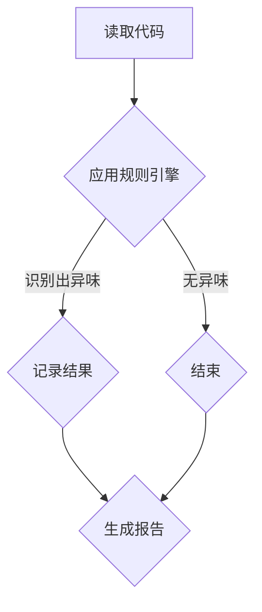
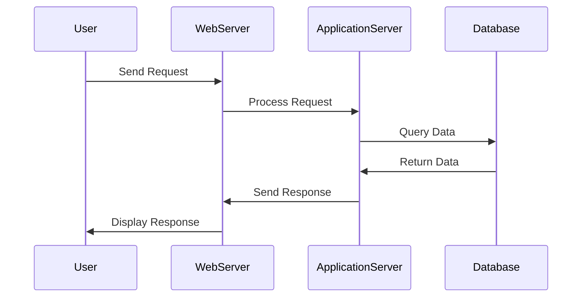

                 


# 代码异味识别与清除：提高代码质量

关键词：代码质量，代码异味，识别，清除，重构，静态代码分析，动态测试

摘要：本文将深入探讨代码异味的概念、类型及其对软件质量的影响，介绍识别代码异味的方法，并提出清除代码异味的有效策略。通过实际案例和实践指导，帮助开发者提高代码质量，打造更健壮、可维护的软件系统。

## 背景介绍：核心概念

### 问题背景

在软件开发领域，代码质量是衡量软件优劣的关键指标。一个高质量的系统不仅需要正确实现功能，还需要具有良好的可读性、可维护性和可扩展性。然而，随着软件系统复杂度的增加，代码质量往往难以保证。代码异味（Code Smell）是代码质量问题的早期迹象，它们可能会演变为更严重的缺陷，影响项目的可维护性、可扩展性和性能。

### 问题描述

代码异味是指那些表面上看似无害，但实际上可能预示着潜在问题的代码模式。这些问题可能包括冗长的函数、过大的类、重复代码、不一致的命名规范等。这些异味不仅影响代码的可读性，还可能导致维护成本的增加和错误率上升。

### 问题解决

识别和清除代码异味是提高代码质量的重要步骤。本文的目标是帮助开发者掌握识别代码异味的方法，并提供清除这些异味的策略，以提升软件系统的整体质量。

### 边界与外延

代码异味不同于编程错误，它们通常不是功能性的问题，而是关于代码结构和设计风格的问题。识别代码异味需要开发者具备一定的编程经验和洞察力。此外，代码异味可能存在于任何编程语言和开发环境中。

### 概念结构与核心要素组成

代码异味的核心概念包括：

- **定义与类型**：介绍代码异味的基本定义和常见类型。
- **识别方法**：描述如何通过代码审查、静态代码分析和动态测试等方法识别代码异味。
- **清除策略**：提供一系列策略，如重构、代码重构工具、代码风格指南和持续集成等，以清除代码异味。
- **实际应用**：通过案例分析，展示如何在实际项目中应用这些策略。

## 核心概念与联系

### 代码异味定义与类型

代码异味是指那些可能预示着潜在问题的代码模式，包括但不限于以下类型：

1. **冗长的函数**：一个函数如果过长，通常意味着它可能执行了多个任务，这违反了单一职责原则。
2. **过大的类**：一个类如果包含太多的职责和成员变量，可能会导致类难以理解和维护。
3. **重复代码**：重复的代码块可能意味着缺少抽象，这会增加维护成本。
4. **不一致的命名规范**：命名不规范会增加阅读和理解代码的难度。

### 代码异味识别方法

识别代码异味是提高代码质量的第一步，常见的方法包括：

1. **代码审查**：通过团队成员间的代码评审，发现代码异味。
2. **静态代码分析**：使用工具对代码进行分析，识别潜在的代码异味。
3. **动态测试**：通过运行代码，观察其行为，发现代码异味。

### 代码异味清除策略

清除代码异味的关键是重构代码，以下是一些常用的策略：

1. **重构**：通过逐步改进代码结构，消除代码异味。
2. **代码重构工具**：使用自动化工具进行代码重构，提高效率。
3. **代码风格指南**：制定和遵循代码风格指南，减少代码异味。
4. **持续集成**：通过持续集成和自动化测试，及时发现和修复代码异味。

### Mermaid ER实体关系图架构

下面是一个简化的Mermaid ER实体关系图，展示代码异味相关的核心实体和关系：

```mermaid
erDiagram
    CodeSmell ||--|{ Developer : identifiedBy }
    CodeSmell ||--|{ Refactoring : solvedBy }
    Developer ||--|{ CodeBase : analyzes }
    CodeStyleGuide ||--|{ Developer : follows }
    CI/CDPipeline ||--|{ CodeBase : integrates }
```

这个ER图说明了开发者识别和解决代码异味的过程，以及代码风格指南和持续集成在其中的作用。

## 算法原理讲解

### 代码异味识别算法原理

代码异味识别算法主要基于以下原理：

1. **模式识别**：通过分析代码模式，识别出常见的代码异味模式。
2. **规则引擎**：使用预定义的规则，对代码进行静态分析，识别可能的代码异味。

以下是代码异味识别算法的mermaid流程图：



### Python源代码示例

下面是一个简单的Python代码示例，用于识别一个常见的代码异味——冗长的函数：

```python
import ast

class CodeAnalyzer(ast.NodeTransformer):
    def visit_FunctionDef(self, node):
        if len(node.body) > 10:  # 假设函数体超过10行即为异味
            self.report_smell(node)
        return node

    def report_smell(self, node):
        print(f"代码异味：函数 {node.name} 可能过长。")

analyzer = CodeAnalyzer()
asttree = ast.parse("your_python_code.py")
analyzer.visit(asttree)
```

在这个示例中，`CodeAnalyzer` 类继承自 `ast.NodeTransformer`，用于遍历和修改抽象语法树（AST）。`visit_FunctionDef` 方法用于检查函数体长度，如果超过一定阈值（例如10行），则认为存在代码异味，并记录下来。

## 系统分析与架构设计方案

### 问题场景介绍

假设我们正在开发一个复杂的Web应用，涉及多个模块和复杂的数据交互。随着项目的进展，我们发现代码质量逐渐下降，存在大量的代码异味。为了提升系统的可维护性和性能，我们需要对代码进行深入的分析和重构。

### 项目介绍

项目名为“智慧校园管理系统”，旨在为校园提供全面的管理解决方案，包括学生信息管理、课程安排、考试管理、资源分配等。项目采用Python作为主要编程语言，结合Django框架进行开发。

### 系统功能设计

系统的主要功能模块包括：

1. **用户管理**：实现用户注册、登录、权限控制等功能。
2. **课程管理**：实现课程添加、修改、删除、查询等功能。
3. **考试管理**：实现考试安排、成绩录入、查询等功能。
4. **资源管理**：实现资源分配、查询等功能。

### 系统架构设计

系统的整体架构采用MVC（Model-View-Controller）模式，分为前端、后端和数据层三部分。前端使用HTML、CSS和JavaScript进行开发，后端使用Django框架实现，数据层使用关系型数据库（如MySQL）进行数据存储。

### 系统接口设计

系统接口设计主要包括以下几部分：

1. **用户接口**：提供用户注册、登录、信息查询等功能。
2. **课程接口**：提供课程添加、修改、删除、查询等功能。
3. **考试接口**：提供考试安排、成绩录入、查询等功能。
4. **资源接口**：提供资源分配、查询等功能。

### 系统交互设计

系统交互设计使用mermaid序列图进行描述，如下所示：



这个序列图展示了用户与Web服务之间的交互过程，包括请求发送、数据处理和响应返回。

## 项目实战

### 环境安装

为了进行代码异味识别与清除，我们首先需要安装一些必要的工具和库。以下是安装步骤：

1. **Python环境**：确保安装了Python 3.x版本。
2. **代码分析工具**：安装`pycodestyle`和`pylint`进行代码风格和质量的检查。
3. **代码重构工具**：安装`autopep8`和`black`进行代码格式的自动修复。
4. **版本控制**：安装Git进行代码版本管理和协作开发。

```bash
pip install pycodestyle pylint autopep8 black
```

### 系统核心实现源代码

以下是一个简单的Django项目的代码示例，用于演示如何识别和清除代码异味。

```python
# views.py
from django.shortcuts import render

def home(request):
    return render(request, 'home.html')

# models.py
from django.db import models

class Student(models.Model):
    name = models.CharField(max_length=100)
    age = models.IntegerField()

# tests.py
from django.test import TestCase
from .models import Student

class StudentModelTest(TestCase):
    def test_string_representation(self):
        student = Student(name="John Doe", age=20)
        self.assertEqual(str(student), f"Student(name={student.name}, age={student.age})")
```

### 代码应用解读与分析

在这个示例中，我们使用了Django框架实现了一个简单的学生信息管理系统。通过代码风格检查工具`pycodestyle`和代码质量检查工具`pylint`，我们可以识别出代码中的异味。

```bash
pycodestyle your_project_directory
pylint your_project_directory
```

这些工具会生成报告，列出代码中的问题和异味。根据报告，我们可以进行以下重构：

1. **代码格式优化**：使用`autopep8`和`black`对代码进行格式化，确保代码风格一致。
2. **函数和类重构**：将冗长的函数分解为更小的函数，减少类的职责，提高代码的可读性和可维护性。
3. **测试增加**：增加单元测试，确保代码功能的正确性。

### 实际案例分析和详细讲解剖析

假设我们在代码风格检查中发现以下代码异味：

```python
# views.py
def home(request):
    users = User.objects.all()
    context = {
        'users': users,
    }
    return render(request, 'home.html', context)
```

这段代码中，`User.objects.all()` 可能会查询出大量数据，导致内存占用过高。为了解决这个异味，我们可以进行以下重构：

1. **查询优化**：使用`filter()` 方法添加查询条件，只查询必要的用户数据。

```python
# views.py
def home(request):
    users = User.objects.filter(is_staff=True)
    context = {
        'users': users,
    }
    return render(request, 'home.html', context)
```

2. **代码分解**：将查询和渲染逻辑分解为两个独立的函数，提高代码的模块化和可读性。

```python
# views.py
from .models import User

def get_staff_users():
    return User.objects.filter(is_staff=True)

def home(request):
    users = get_staff_users()
    context = {
        'users': users,
    }
    return render(request, 'home.html', context)
```

通过这些重构，我们不仅消除了代码异味，还提高了系统的性能和可维护性。

### 项目小结

通过本次项目实战，我们学会了如何使用代码分析工具识别代码异味，并提出了有效的重构策略。这些实践不仅帮助我们提高了代码质量，还为我们后续的项目开发提供了宝贵的经验。在未来的工作中，我们应该始终坚持代码质量的提升，以构建更健壮、可维护的软件系统。

## 最佳实践 tips

1. **定期进行代码审查**：定期组织团队成员进行代码审查，可以有效地发现和清除代码异味。
2. **使用代码分析工具**：充分利用代码分析工具（如`pycodestyle`、`pylint`等）进行静态代码分析，及时发现和修复代码异味。
3. **遵循代码风格指南**：制定和遵循代码风格指南，确保代码风格的一致性，降低代码异味的发生概率。
4. **持续重构**：定期对代码进行重构，保持代码结构的简洁和清晰，提高代码的可维护性。
5. **强化单元测试**：增加单元测试覆盖范围，确保代码重构后功能的正确性。

## 小结

本文系统地介绍了代码异味的概念、识别方法和清除策略，通过实际案例展示了如何在实际项目中应用这些策略。提高代码质量是一个持续的过程，需要开发者在日常开发中始终坚持质量第一的原则。通过识别和清除代码异味，我们可以打造更健壮、可维护的软件系统。

## 注意事项

1. **代码异味识别和清除不是一蹴而就的过程**：需要开发者在日常开发中持续关注代码质量，定期进行代码审查和重构。
2. **代码异味识别和清除应根据项目特点进行**：不同的项目可能存在不同的代码异味类型，应根据项目的具体情况进行识别和清除。
3. **代码异味识别和清除应与团队协作**：代码异味识别和清除需要团队成员的共同努力，通过协作和沟通，才能更好地提高代码质量。

## 拓展阅读

1. 《代码整洁之道》（Clean Code）—— Robert C. Martin
2. 《重构：改善既有代码的设计》（Refactoring: Improving the Design of Existing Code）—— Martin Fowler
3. 《Python编码：最佳实践指南》（Python Best Practices）—— J.M. Graeme
4. 《代码质量：软件工程实践的有效方法》（Code Quality: The Open Source Perspective）—— Sandi Metz

## 作者信息

作者：AI天才研究院/AI Genius Institute & 禅与计算机程序设计艺术 /Zen And The Art of Computer Programming

[返回首页](#)

