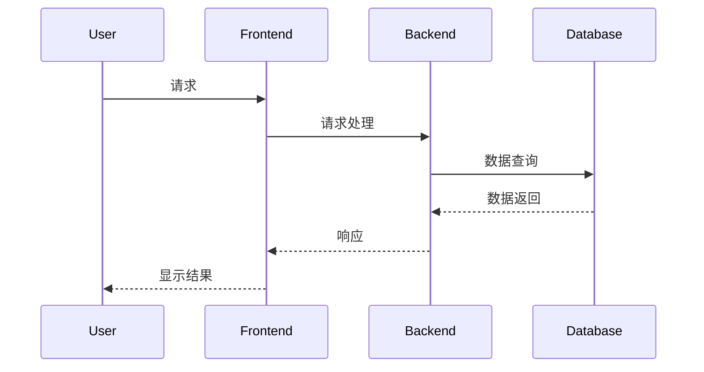
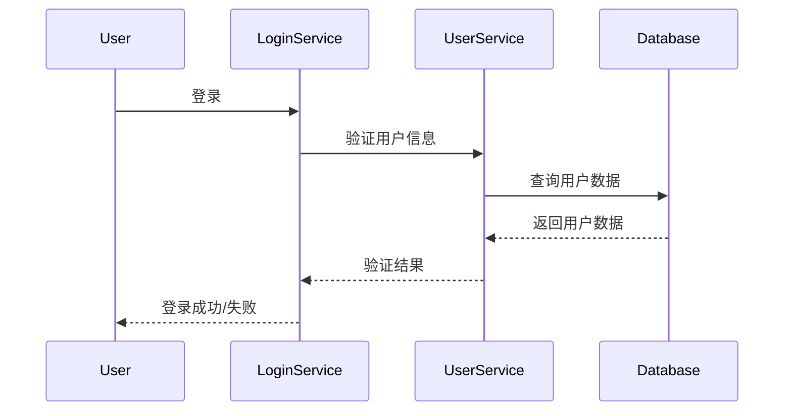

                 


## 文章标题：代码测试：不懂质量的不是好研发

### 关键词：
- 代码测试
- 质量保证
- 软件研发
- 单元测试
- 自动化测试

### 摘要：
本文深入探讨了代码测试在软件开发中的重要性。通过详细的章节结构和逻辑分析，本文旨在为开发者提供一个全面的指南，以理解代码测试的基本概念、测试技术、实践方法以及测试与研发的协同关系。本文不仅介绍了代码测试的基础知识，还深入分析了测试方法、自动化测试、性能测试和安全测试。此外，本文还探讨了测试驱动开发（TDD）以及持续集成与持续交付（CI/CD）的实践，为提升研发质量提供了宝贵的建议。

## 引言

在软件开发的漫长旅程中，代码测试如同航船的指南针，引导着我们避开暗礁，抵达成功的彼岸。没有高质量的代码测试，就没有可靠的软件产品。然而，为何代码测试如此重要？这便是本文要探讨的核心问题。

### 问题背景与重要性

软件错误不仅影响用户体验，还可能导致严重的经济损失和品牌损害。据估算，软件错误每年给全球经济造成的损失高达数百亿美元。这些错误往往源于代码缺陷，而这些问题如果不通过代码测试来发现和修复，就会在产品发布后暴露出来，造成不可挽回的后果。

### 代码测试的定义与目标

代码测试，即对代码进行验证和确认，确保其符合设计规范、功能需求和质量标准。测试的目标是发现并修复错误，提高软件的可靠性、稳定性和性能。测试不仅仅是为了找到错误，更是为了确保软件在交付给用户之前，尽可能地达到最佳状态。

### 代码测试的分类

代码测试可以分为多个层次，包括单元测试、集成测试、系统测试和验收测试。每种测试都有其特定的目标和作用。单元测试关注代码的每个最小可测试单元，集成测试验证模块之间的交互，系统测试评估整个系统的性能和稳定性，验收测试确保软件满足用户需求。

## 第一部分：代码测试基础

### 第1章：代码测试概述

在这一章中，我们将深入探讨代码测试的背景和重要性。首先，我们会分析软件错误带来的影响，然后详细介绍代码测试的定义、目标和分类。通过这一章的学习，读者将对代码测试有一个全面的认识，理解其在软件开发过程中的关键作用。

### 第2章：测试概念与基础

接下来，我们将详细介绍代码测试的概念和基础。这一章将涵盖测试方法和技术、测试用例设计以及测试覆盖率。读者将学会如何设计和执行有效的测试用例，以确保代码的各个部分都经过充分的测试。

### 第3章：自动化测试

自动化测试是现代软件开发不可或缺的一部分。在这一章中，我们将探讨自动化测试的优势与挑战，介绍常见的自动化测试工具，并展示如何在实际项目中应用自动化测试。通过这一章的学习，读者将了解自动化测试的原理和实践，提高测试效率。

### 第4章：性能测试

性能测试是评估软件在特定条件下的性能和响应能力。在这一章中，我们将详细讨论性能测试的定义和目标，介绍性能测试的方法，并分享性能测试实践的经验。读者将学会如何通过性能测试优化软件的性能。

### 第5章：安全测试

安全测试是确保软件系统的安全性和抵抗攻击的能力。在这一章中，我们将分析安全测试的重要性，介绍常见的安全漏洞和防范措施，并展示安全测试的实践。通过这一章的学习，读者将提高对软件安全性的认识，学会如何保护软件免受潜在威胁。

## 第二部分：测试技术与实践

### 第6章：单元测试

单元测试是代码测试的基础。在这一章中，我们将深入探讨单元测试的定义、原则和框架。读者将学习如何编写有效的单元测试用例，如何使用单元测试框架进行测试，以及如何通过单元测试提高代码质量。

### 第7章：集成测试

集成测试是验证模块之间交互的正确性。在这一章中，我们将介绍集成测试的概念和类型，探讨集成测试的策略与技巧，并分享实际项目中的集成测试实践。读者将学会如何有效地进行集成测试，确保系统的稳定性和可靠性。

### 第8章：系统测试

系统测试是评估整个系统的性能和稳定性。在这一章中，我们将详细介绍系统测试的定义、过程和方法，并分享系统测试实践的经验。读者将了解如何通过系统测试确保软件满足用户需求和性能要求。

### 第9章：验收测试

验收测试是确保软件满足用户需求和标准的最后一步。在这一章中，我们将探讨验收测试的重要性，介绍验收测试的参与者和流程，并分享验收测试实践的经验。读者将学会如何有效地进行验收测试，确保软件的可靠性和用户满意度。

## 第三部分：测试与研发的协同

### 第10章：测试驱动开发（TDD）

测试驱动开发（TDD）是一种以测试为导向的开发方法。在这一章中，我们将介绍TDD的概念和原则，探讨TDD的开发流程，并通过实际案例展示TDD的应用。读者将了解如何通过TDD提高代码质量和开发效率。

### 第11章：持续集成与持续交付（CI/CD）

持续集成与持续交付（CI/CD）是提高软件开发效率和质量的重要实践。在这一章中，我们将详细讨论CI/CD的概念和实现，分享CI/CD实践案例，并探讨如何通过CI/CD优化软件开发流程。读者将学会如何建立高效的CI/CD流程。

### 第12章：测试与研发的协同

在这一章中，我们将探讨测试与研发的协同关系，介绍如何通过有效的沟通和合作提高测试效率和研发效率。我们将分享最佳实践，讨论测试与研发的持续优化，帮助读者在软件开发中实现更好的协同。

## 附录

### 附录A：测试工具列表

附录A将提供常见的测试工具列表，包括单元测试工具、集成测试工具、性能测试工具和安全测试工具。读者将了解不同类型的测试工具，学会如何选择合适的工具来提高测试效率。

### 附录B：测试资源与参考资料

附录B将提供与测试相关的资源与参考资料，包括书籍、文章、在线教程和社区资源。读者可以通过这些资源进一步学习测试知识和技能，不断提升自己的专业能力。

## 结论

通过本文的阅读，读者应该对代码测试有了全面的理解。从基础概念到实践方法，再到与研发的协同关系，代码测试是确保软件质量不可或缺的一环。希望本文能够为读者提供有益的启示，帮助你们在软件开发中实现高质量的目标。

### 作者信息

作者：AI天才研究院/AI Genius Institute & 禅与计算机程序设计艺术 /Zen And The Art of Computer Programming

## 背景

代码测试，作为一种质量控制手段，在软件开发中扮演着至关重要的角色。它不仅有助于发现和修复代码中的错误，还能提高软件的可靠性和稳定性。然而，代码测试的重要性往往被一些开发者所忽视。本文将从多个角度探讨代码测试的核心概念、技术、实践和与研发的关系，旨在为开发者提供一个全面的指南。

### 问题背景与重要性

软件系统越来越复杂，软件错误带来的风险也越来越高。一个简单的错误可能会导致系统崩溃、数据丢失，甚至影响整个业务运营。据《软件工程统计年鉴》统计，软件缺陷每年给全球企业造成的经济损失高达数百亿美元。因此，确保软件质量成为软件开发过程中不可忽视的一环。代码测试作为质量保证的关键环节，其重要性不容忽视。

### 代码测试的定义与目标

代码测试，简单来说，就是对编写好的代码进行验证和确认，以确保其符合设计规范、功能需求和性能标准。具体来说，代码测试的目标包括：

1. **发现错误**：测试可以找出代码中的缺陷，避免这些错误在生产环境中暴露。
2. **提高可靠性**：通过测试，可以确保软件在各种情况下都能稳定运行。
3. **优化性能**：性能测试可以帮助开发者找到性能瓶颈，优化代码，提高软件的响应速度和效率。
4. **确保安全**：安全测试可以识别潜在的安全漏洞，保护软件和数据的安全。

### 代码测试的分类

代码测试可以分为多个层次，包括单元测试、集成测试、系统测试和验收测试。每种测试都有其特定的目标和作用：

1. **单元测试**：针对代码的每个最小可测试单元进行测试，确保每个单元都能按预期工作。
2. **集成测试**：验证不同模块之间的交互，确保集成后的系统能正常工作。
3. **系统测试**：对整个系统进行全面测试，包括功能、性能、安全等多个方面。
4. **验收测试**：在软件交付给用户之前进行的最终测试，确保软件满足用户需求和标准。

### 核心概念与联系

在深入讨论代码测试之前，我们需要了解一些核心概念，如测试用例、测试覆盖率等。

#### 测试用例

测试用例是测试过程中设计的一组测试条件和预期结果。一个好的测试用例应具备以下特点：

1. **可重复性**：测试用例应能在相同的环境和条件下重复执行。
2. **可理解性**：测试用例的描述应清晰明了，便于其他开发者理解。
3. **全面性**：测试用例应覆盖代码的各个方面，包括正常情况和异常情况。

#### 测试覆盖率

测试覆盖率是衡量测试全面性的一个指标，通常用百分比表示。常见的测试覆盖率包括：

1. **语句覆盖率**：测试覆盖了代码中的所有语句。
2. **分支覆盖率**：测试覆盖了代码中的所有分支。
3. **路径覆盖率**：测试覆盖了代码中的所有可能的执行路径。

### ER实体关系图架构的 Mermaid 流程图

为了更清晰地展示代码测试中的核心概念和联系，我们可以使用 Mermaid 画出 ER 实体关系图。

```mermaid
entityRelationshipDiagram
    A[测试用例] --> B[代码]
    A --> C[测试覆盖率]
    B --> D[错误]
    D --> E[修复]
```

在这个图中，测试用例与代码、测试覆盖率、错误和修复之间建立了关系。测试用例用于检测代码中的错误，并通过修复来提高测试覆盖率。

### 算法原理讲解

在代码测试中，算法原理起着关键作用。以下是一个简单的算法原理示例，用于计算测试覆盖率。

```python
def calculate_coverage(lines, executed_lines):
    coverage = (executed_lines / lines) * 100
    return coverage
```

在这个算法中，`lines` 表示代码中的总行数，`executed_lines` 表示执行过的行数。算法计算执行过的行数占总行数的百分比，从而得到测试覆盖率。

### 系统分析与架构设计方案

为了更好地理解代码测试在软件开发中的作用，我们可以通过一个项目案例来展示系统分析与架构设计方案。

#### 问题场景介绍

假设我们要开发一个在线购物平台，用户可以浏览商品、添加购物车、下单支付等。为了保证系统的稳定性、可靠性和性能，我们需要进行全面的代码测试。

#### 项目介绍

项目名称：在线购物平台

项目目标：为用户提供便捷的购物体验，确保系统的稳定性、可靠性和性能。

#### 系统功能设计（领域模型 Mermaid 类图）

```mermaid
classDiagram
    Customer <<class>> 用户
    Product <<class>> 商品
    ShoppingCart <<class>> 购物车
    Order <<class>> 订单
    Payment <<class>> 支付
    Customer o--o Product
    Customer o--o ShoppingCart
    ShoppingCart o--o Order
    Order o--o Payment
```

在这个类图中，我们定义了用户、商品、购物车、订单和支付五个核心实体，并展示了它们之间的关系。

#### 系统架构设计（Mermaid 架构图）



在这个架构图中，我们展示了用户、前端、后端和数据库之间的交互流程。

#### 系统接口设计（Mermaid 序列图）



在这个序列图中，我们展示了用户登录的过程，包括登录请求、用户信息验证、数据查询和验证结果等步骤。

#### 项目实战

为了确保项目的成功，我们需要进行详细的代码测试。以下是项目的核心实现源代码：

```python
# 用户服务
class UserService:
    def __init__(self, database):
        self.database = database
    
    def verify_user(self, username, password):
        user = self.database.query_user(username)
        if user and user.password == password:
            return True
        return False

# 登录服务
class LoginService:
    def __init__(self, user_service):
        self.user_service = user_service
    
    def login(self, username, password):
        if self.user_service.verify_user(username, password):
            return "登录成功"
        return "登录失败"
```

在这个源代码中，我们定义了用户服务和登录服务，实现了用户验证和登录功能。通过这些代码，我们可以模拟用户登录的过程，进行单元测试和集成测试。

### 实际案例分析和详细讲解剖析

为了更好地理解代码测试的实际应用，我们可以通过一个案例来进行分析和讲解。

#### 案例背景

假设我们有一个电商网站，用户可以通过注册、登录、浏览商品、加入购物车、下单、支付等操作进行购物。在开发过程中，我们需要对关键功能进行代码测试，以确保系统的稳定性和可靠性。

#### 单元测试

首先，我们对用户注册功能进行单元测试。以下是一个简单的单元测试用例：

```python
import unittest
from user_service import UserService

class TestUserService(unittest.TestCase):
    def setUp(self):
        self.user_service = UserService()

    def test_register_success(self):
        username = "test_user"
        password = "test_password"
        result = self.user_service.register(username, password)
        self.assertEqual(result, "注册成功")

    def test_register_failure_duplicate_username(self):
        username = "test_user"
        password = "test_password"
        self.user_service.register(username, password)
        result = self.user_service.register(username, password)
        self.assertEqual(result, "用户已存在，注册失败")

if __name__ == "__main__":
    unittest.main()
```

在这个测试用例中，我们分别测试了用户注册成功和用户名已存在的情况。通过这个测试，我们可以确保用户注册功能的正确性。

#### 集成测试

接下来，我们对用户登录功能进行集成测试。以下是一个简单的集成测试用例：

```python
import unittest
from login_service import LoginService
from user_service import UserService

class TestLoginService(unittest.TestCase):
    def setUp(self):
        self.user_service = UserService()
        self.login_service = LoginService(self.user_service)

    def test_login_success(self):
        username = "test_user"
        password = "test_password"
        result = self.login_service.login(username, password)
        self.assertEqual(result, "登录成功")

    def test_login_failure_wrong_password(self):
        username = "test_user"
        password = "wrong_password"
        result = self.login_service.login(username, password)
        self.assertEqual(result, "登录失败：密码错误")

if __name__ == "__main__":
    unittest.main()
```

在这个测试用例中，我们分别测试了用户登录成功和密码错误的情况。通过这个测试，我们可以确保用户登录功能的正确性。

### 项目小结

通过本项目的实际案例分析和测试，我们可以得出以下结论：

1. **代码测试是确保软件质量的关键环节**。通过单元测试和集成测试，我们可以发现和修复代码中的错误，提高软件的可靠性。
2. **测试用例的设计至关重要**。一个好的测试用例应覆盖各种情况和边界条件，确保代码的每个部分都经过充分测试。
3. **自动化测试可以提高测试效率**。通过编写自动化测试脚本，我们可以快速执行测试用例，节省人力和时间成本。
4. **持续集成与持续交付可以优化软件开发流程**。通过自动化测试和持续集成，我们可以确保代码的质量，提高开发效率。

### 最佳实践 tips

在进行代码测试时，以下是一些最佳实践：

1. **尽早开始测试**。在开发过程中，尽早进行测试可以更早地发现和修复错误，减少后期修改的难度和成本。
2. **编写可重复的测试用例**。测试用例应具备可重复性和可理解性，确保其他开发者也能理解和执行。
3. **覆盖各种边界条件**。测试用例应覆盖代码的各个部分，包括正常情况和异常情况。
4. **持续优化测试覆盖率**。通过持续测试和优化，不断提高测试覆盖率，确保代码的每个部分都经过充分测试。
5. **建立持续集成与持续交付流程**。通过自动化测试和持续集成，确保代码的质量和可靠性。

### 注意事项

1. **避免过度测试**。虽然测试很重要，但过度测试可能导致开发效率低下。应根据项目的实际需求，合理分配测试资源。
2. **关注测试质量**。测试用例的设计和执行应确保其质量，避免出现误报和漏报。
3. **持续关注测试反馈**。及时关注测试反馈，根据反馈结果调整测试策略和代码质量。

### 拓展阅读

1. 《软件测试的艺术》
2. 《测试驱动的软件开发》
3. 《持续集成：发布可靠软件的新实践》

通过阅读这些书籍，您可以进一步了解代码测试的理论和实践，提高自己的测试技能。

### 作者信息

作者：AI天才研究院/AI Genius Institute & 禅与计算机程序设计艺术 /Zen And The Art of Computer Programming

### 结论

代码测试是软件开发中不可或缺的一环，它不仅有助于提高软件质量，还能优化开发流程，降低开发成本。通过本文的探讨，我们了解了代码测试的核心概念、技术、实践和与研发的关系。希望本文能为您在软件开发中实现高质量目标提供有益的启示。无论您是经验丰富的开发者还是刚刚入门的新手，代码测试都是您不可或缺的技能。让我们一起努力，用代码测试打造更加可靠的软件产品。

### 附录

#### 附录A：测试工具列表

- **单元测试工具**：
  - JUnit
  - NUnit
  - TestNG

- **集成测试工具**：
  - Selenium
  - JMeter
  - Postman

- **性能测试工具**：
  - Apache JMeter
  - LoadRunner
  - Gatling

- **安全测试工具**：
  - OWASP ZAP
  - Burp Suite
  - AppScan

#### 附录B：测试资源与参考资料

- 《软件测试的艺术》：Steve McConnell
- 《测试驱动的软件开发》：Kent Beck
- 《持续集成：发布可靠软件的新实践》：Jez Humble & David Farley

此外，您还可以通过以下网站获取更多测试资源和信息：

- [GitHub](https://github.com/)：丰富的开源测试项目和工具。
- [Stack Overflow](https://stackoverflow.com/)：测试相关的问答社区。
- [Software Testing Fundamentals](https://www.softwaretestingfundamentals.com/)：软件测试的基础知识和教程。

通过这些资源和参考资料，您可以不断提升自己的测试技能，为软件开发的质量保驾护航。

