                 


## 让我们一步步深入思考代码质量度量

### 第一步：理解代码质量度量的重要性

代码质量度量是软件工程中的一个关键概念，它有助于我们识别和改进代码中的问题，从而提升整个软件系统的质量。代码质量度量不仅仅是为了满足某种标准，更重要的是通过度量发现潜在的风险和不足，以便进行针对性的优化。

**核心概念与联系**

- **代码质量**：是指软件代码的可维护性、可读性、可靠性、性能等方面。质量好的代码更容易理解、维护和扩展。
- **度量**：是一种评估方法，通过量化的指标来评价代码的质量。
- **重要性**：代码质量度量有助于：

  - **缺陷识别**：通过静态分析工具，可以发现代码中的潜在问题，如语法错误、逻辑错误、资源泄露等。
  - **效率提升**：通过度量结果，可以优化代码结构，提高代码的执行效率。
  - **团队协作**：代码质量度量可以帮助团队建立统一的质量标准，促进团队成员之间的协作和沟通。

### 第二步：了解代码质量度量的方法

代码质量度量的方法可以分为静态分析和动态分析两大类，每种方法都有其特定的优势和适用场景。

**核心概念与联系**

- **静态分析**：在不运行代码的情况下，对代码进行审查和分析，检查代码的结构、语法和语义。静态分析工具如FindBugs、PMD等。
- **动态分析**：在代码运行的过程中，对代码的行为进行分析和监控。动态分析工具如JUnit、LoadRunner等。
- **对比与联系**：

  - **静态分析与动态分析**：静态分析更侧重于代码的结构和语义，而动态分析更侧重于代码的运行行为。两者结合可以更全面地评估代码质量。

### 第三步：学习静态分析工具的使用

静态分析工具是代码质量度量的重要手段，选择合适的工具和正确的配置对于提高代码质量至关重要。

**核心概念与联系**

- **静态分析工具分类**：根据其功能和应用场景，静态分析工具可以分为以下几类：
  - **通用型**：适用于多种编程语言，如PMD、Checkstyle。
  - **专用型**：针对特定编程语言或框架，如SonarQube（针对Java）、ESLint（针对JavaScript）。
- **静态分析工具的工作原理**：静态分析工具通常包括以下几个步骤：
  - **解析代码**：将源代码解析成抽象语法树（AST）。
  - **分析代码**：对AST进行语法和语义分析，发现潜在的问题。
  - **报告问题**：生成报告，列出发现的问题和潜在的风险。
- **工具配置与优化**：正确的配置和优化可以提高静态分析工具的效率和准确性。

### 第四步：实践代码质量度量

在实际项目中，代码质量度量是一个持续的过程，需要不断地进行度量、分析、优化和反馈。

**核心概念与联系**

- **代码质量度量流程**：一个完整的代码质量度量流程通常包括以下几个步骤：
  - **定义度量标准**：确定需要度量的指标，如缺陷密度、复杂度、可读性等。
  - **配置工具**：选择合适的静态分析工具并进行配置。
  - **执行度量**：运行静态分析工具，生成度量报告。
  - **分析报告**：分析度量结果，识别问题所在。
  - **优化代码**：根据分析结果，对代码进行优化和重构。
- **案例分析**：通过具体案例的分析，可以更好地理解代码质量度量在实际项目中的应用和效果。

### 第五步：探索代码质量度量的优化策略

代码质量度量不仅仅是一个评估过程，更是一个持续改进的过程。通过分析度量结果，可以制定针对性的优化策略，进一步提高代码质量。

**核心概念与联系**

- **优化策略**：常见的优化策略包括：
  - **代码重构**：通过重构代码，提高代码的结构和可读性。
  - **代码优化**：通过优化算法和数据结构，提高代码的执行效率。
  - **代码审查**：通过代码审查，发现潜在的问题和改进的机会。
- **实施与维护**：优化策略的实施和维持需要团队的协作和持续的努力。

### 第六步：结合敏捷开发进行代码质量度量

敏捷开发是一种以人为核心、迭代、增量和灵活响应变化的软件开发方法。在敏捷开发中，代码质量度量同样重要，但需要与敏捷开发的理念相结合。

**核心概念与联系**

- **敏捷开发与代码质量度量**：敏捷开发强调快速迭代和持续交付，代码质量度量可以确保每次迭代交付的代码都是高质量的。
- **实践**：敏捷开发中的代码质量度量实践包括：
  - **持续集成**：通过持续集成，确保代码的质量问题能够在早期被发现和解决。
  - **代码审查**：在每次迭代结束后，进行代码审查，确保代码的可维护性和可扩展性。
  - **自动化度量**：使用自动化工具进行代码质量度量，提高度量效率和准确性。

### 第七步：展望代码质量度量的未来

随着技术的发展，代码质量度量也在不断演进。未来，代码质量度量可能会更加智能化、自动化和精确。

**核心概念与联系**

- **发展趋势**：未来代码质量度量可能会包括：
  - **人工智能**：利用人工智能技术，对代码进行更深入的分析和预测。
  - **自动化**：通过自动化工具，实现代码质量度量的自动化和高效化。
  - **个性化**：根据不同的项目特点和团队需求，提供个性化的度量方法和策略。
- **应用前景**：代码质量度量在未来可能会有更广泛的应用，如：
  - **开源项目**：开源项目通常有大量的贡献者，代码质量度量可以帮助维护项目的稳定性和高质量。
  - **企业级应用**：企业级应用通常有严格的质量要求，代码质量度量可以帮助企业确保软件的高质量和高可靠性。

## 总结

代码质量度量是一个复杂而重要的过程，它不仅需要工具的支持，更需要团队的努力和持续改进。通过静态分析工具，我们可以更全面、更准确地评估代码的质量，从而提高软件系统的可靠性、可维护性和可扩展性。让我们一起努力，提升代码质量，创造更优秀的软件！
* 文章核心关键词：代码质量度量、静态分析工具、软件质量、敏捷开发、优化策略。
* 文章摘要：本文深入探讨了代码质量度量的重要性、方法、工具及其在敏捷开发中的应用，提供了实用的优化策略和未来展望，旨在帮助开发人员提升代码质量。

----------------------------------------------------------------

## 第一部分：代码质量度量基础

### 第1章：代码质量度量概述

#### 1.1 代码质量度量的重要性

代码质量度量是软件工程中的一个核心概念，它对于确保软件系统的可靠性、可维护性和可扩展性至关重要。在软件开发过程中，代码质量度量不仅是一种评估方法，更是一种持续改进的手段。通过量化的指标来评估代码的质量，可以帮助开发人员识别潜在的问题，并采取针对性的措施进行优化。

**核心概念与联系**

- **代码质量**：代码质量是指软件代码的可维护性、可读性、可靠性、性能等方面。质量好的代码更容易理解、维护和扩展。
- **度量**：度量是一种评估方法，通过量化的指标来评价代码的质量。
- **重要性**：代码质量度量的重要性体现在以下几个方面：

  - **缺陷识别**：通过度量，可以发现代码中的潜在问题，如语法错误、逻辑错误、资源泄露等。
  - **效率提升**：通过度量结果，可以优化代码结构，提高代码的执行效率。
  - **团队协作**：代码质量度量可以帮助团队建立统一的质量标准，促进团队成员之间的协作和沟通。

**图1-1：代码质量度量与软件质量的关系**

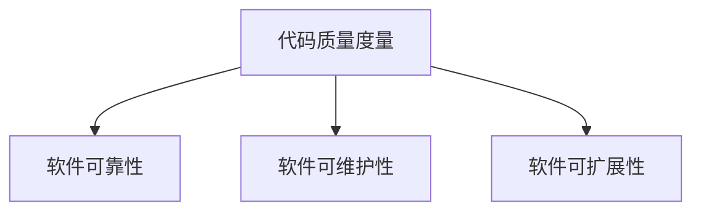

#### 1.2 代码质量度量方法概述

代码质量度量方法可以分为静态分析和动态分析两大类。静态分析是在代码未运行的情况下，对代码进行审查和分析；动态分析是在代码运行的过程中，对代码的行为进行分析和监控。

**核心概念与联系**

- **静态分析**：静态分析工具如FindBugs、PMD等，可以检查代码的结构、语法和语义，发现潜在的问题。
- **动态分析**：动态分析工具如JUnit、LoadRunner等，可以监控代码的运行行为，评估代码的性能和稳定性。

**表1-1：静态分析与动态分析对比**

| 特点 | 静态分析 | 动态分析 |
| --- | --- | --- |
| 时机 | 编写、提交代码时 | 运行代码时 |
| 优势 | 提高效率，减少代码缺陷 | 更全面地评估代码性能 |
| 劣势 | 无法模拟所有运行场景 | 可能会引入额外负担 |

#### 1.3 代码质量度量标准

代码质量度量标准是评估代码质量的一系列指标。常见的度量标准包括缺陷密度、复杂度、可读性等。

**核心概念与联系**

- **缺陷密度**：缺陷密度是指每行代码中包含的缺陷数量。缺陷密度越高，代码质量越差。
- **复杂度**：复杂度是指代码的复杂程度，如循环复杂度、条件复杂度等。复杂度越高，代码的可维护性越差。
- **可读性**：可读性是指代码的可理解性，如命名规范、代码注释等。可读性越高，代码越易于理解和维护。

**表1-2：常见代码质量度量标准**

| 度量标准 | 描述 |
| --- | --- |
| 缺陷密度 | 每行代码中包含的缺陷数量 |
| 循环复杂度 | 代码中循环语句的复杂度 |
| 条件复杂度 | 代码中条件语句的复杂度 |
| 代码行数 | 代码的总行数 |
| 代码注释率 | 代码中注释行的比例 |

### 第2章：静态分析工具概述

#### 2.1 静态分析工具的作用

静态分析工具是代码质量度量的重要手段，它可以帮助开发人员识别代码中的潜在问题，提高代码的质量。通过静态分析，可以更早地发现代码中的问题，避免在运行时出现故障。

**核心概念与联系**

- **作用**：静态分析工具的主要作用包括：

  - **代码审查**：检查代码的结构、语法和语义，发现潜在的编程错误和设计问题。
  - **缺陷识别**：识别代码中的缺陷，如语法错误、逻辑错误、资源泄露等。
  - **代码优化**：通过分析代码，提供优化建议，提高代码的性能和可读性。

- **静态分析与代码质量**：静态分析工具是确保代码质量的关键环节。通过静态分析，可以更早地发现并解决代码中的问题，避免在运行时出现故障，提高软件系统的可靠性。

**图2-1：静态分析工具在软件开发中的作用**

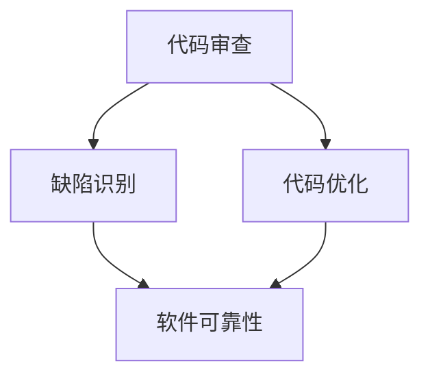

#### 2.2 静态分析工具分类

静态分析工具可以根据其功能和应用场景进行分类。常见的分类包括通用型和专用型。

**核心概念与联系**

- **通用型**：通用型静态分析工具适用于多种编程语言，如PMD、Checkstyle。它们可以检查代码的结构、语法和语义，提供统一的度量标准。
- **专用型**：专用型静态分析工具针对特定的编程语言或框架，如SonarQube（针对Java）、ESLint（针对JavaScript）。它们具有更深入的语言特性和规则库。

**表2-1：静态分析工具分类**

| 类型 | 描述 | 示例 |
| --- | --- | --- |
| 通用型 | 适用于多种编程语言 | PMD、Checkstyle |
| 专用型 | 针对特定的编程语言或框架 | SonarQube（Java）、ESLint（JavaScript） |

#### 2.3 静态分析工具的工作原理

静态分析工具通常包括以下几个步骤：

- **解析代码**：将源代码解析成抽象语法树（AST），以便对代码进行语法和语义分析。
- **分析代码**：对AST进行语法和语义分析，发现潜在的问题和缺陷。
- **报告问题**：生成报告，列出发现的问题和潜在的风险。

**核心概念与联系**

- **抽象语法树（AST）**：AST是源代码的结构化表示，它保留了源代码的语法和语义信息，便于静态分析工具进行分析。
- **分析流程**：静态分析工具的分析流程通常包括：

  - **词法分析**：将源代码分解成单词和符号。
  - **语法分析**：根据语法规则，将词法分析的结果构建成抽象语法树。
  - **语义分析**：对抽象语法树进行语义检查，发现潜在的问题。

**图2-2：静态分析工具的工作原理**

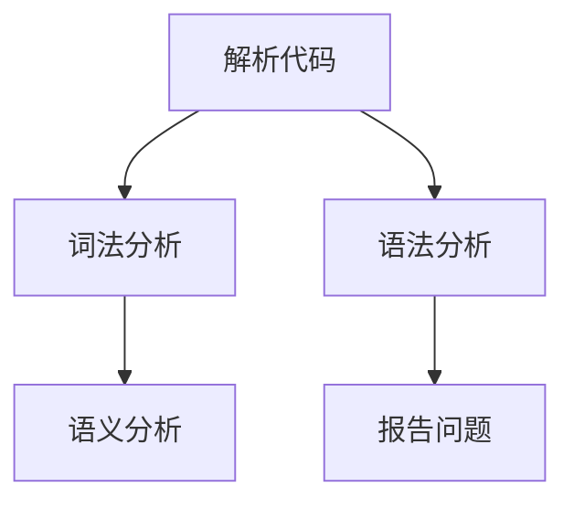

### 第3章：常见静态分析工具

#### 3.1 FindBugs

FindBugs是一个流行的Java静态分析工具，它可以帮助开发人员识别Java代码中的潜在缺陷。FindBugs使用一系列规则来检查代码，这些规则涵盖了Java编程语言的各个方面。

**核心概念与联系**

- **功能特点**：FindBugs的主要功能特点包括：

  - **规则库**：FindBugs包含了一个庞大的规则库，涵盖了常见的编程错误和不良实践。
  - **报告格式**：FindBugs可以生成多种格式的报告，包括HTML、XML等。
  - **插件支持**：FindBugs支持插件扩展，可以根据项目需求自定义规则。

- **使用场景**：FindBugs适用于Java开发项目，可以帮助开发人员快速发现代码中的潜在问题。

**图3-1：FindBugs的使用场景**

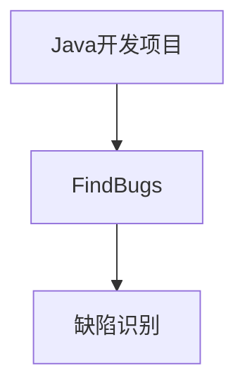

#### 3.2 PMD

PMD是一个通用的Java静态代码分析工具，它可以帮助开发人员识别Java代码中的潜在问题，如冗余代码、不必要的对象创建等。PMD使用一系列规则来检查代码，并生成详细的报告。

**核心概念与联系**

- **功能特点**：PMD的主要功能特点包括：

  - **规则库**：PMD包含了一个丰富的规则库，支持多种Java编码标准。
  - **自定义规则**：PMD允许用户自定义规则，以满足特定的项目需求。
  - **集成支持**：PMD支持多种集成工具，如Eclipse、IntelliJ IDEA等。

- **使用场景**：PMD适用于Java开发项目，可以帮助团队建立和维护一致的编码标准。

**图3-2：PMD的使用场景**

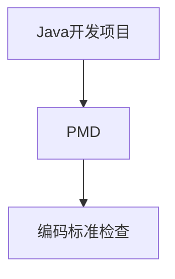

#### 3.3 Checkstyle

Checkstyle是一个通用的Java代码风格检查工具，它可以帮助开发人员确保代码遵循特定的编码标准。Checkstyle通过分析代码结构，检查代码是否符合预定义的编码规则。

**核心概念与联系**

- **功能特点**：Checkstyle的主要功能特点包括：

  - **编码规则库**：Checkstyle包含了一个广泛的编码规则库，支持多种Java编码标准。
  - **可配置性**：Checkstyle具有高度的可配置性，可以针对不同的项目需求调整规则。
  - **集成支持**：Checkstyle支持多种集成工具，如Eclipse、IntelliJ IDEA等。

- **使用场景**：Checkstyle适用于Java开发项目，可以帮助团队保持一致的代码风格。

**图3-3：Checkstyle的使用场景**

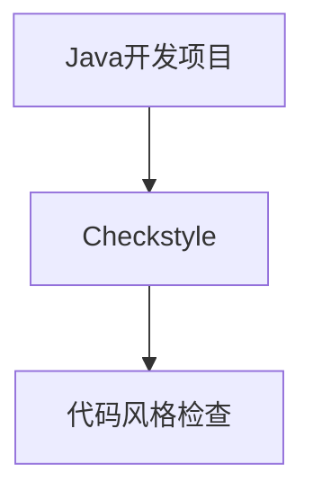

### 第4章：代码质量度量实践

#### 4.1 代码质量度量流程

代码质量度量是一个系统化的过程，包括定义度量标准、配置工具、执行度量、分析报告和优化代码等步骤。

**核心概念与联系**

- **代码质量度量流程**：一个完整的代码质量度量流程通常包括以下几个步骤：

  - **定义度量标准**：确定需要度量的指标，如缺陷密度、复杂度、可读性等。
  - **配置工具**：选择合适的静态分析工具，并进行配置。
  - **执行度量**：运行静态分析工具，生成度量报告。
  - **分析报告**：分析度量结果，识别问题所在。
  - **优化代码**：根据分析结果，对代码进行优化和重构。

**图4-1：代码质量度量流程**

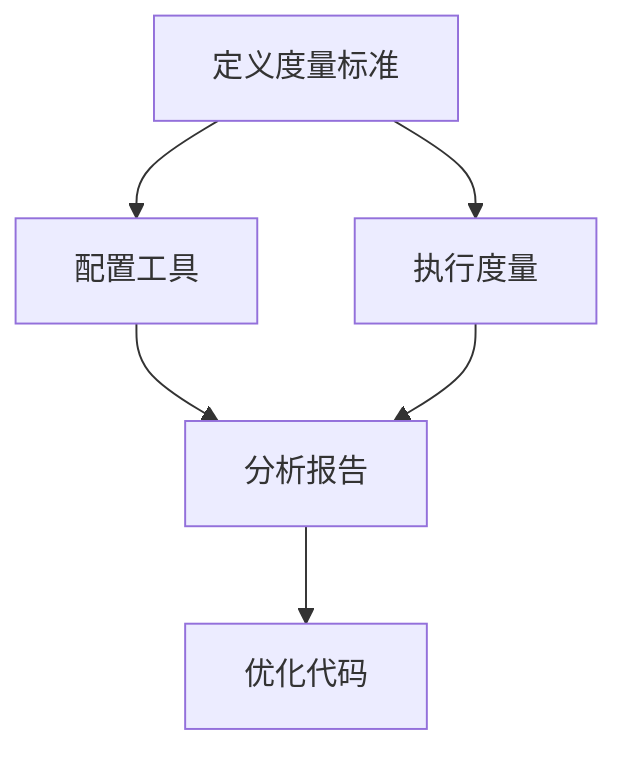

#### 4.2 代码质量度量工具配置

配置代码质量度量工具是确保度量结果准确和高效的关键步骤。不同的工具配置方法有所不同，但通常包括以下几个方面：

**核心概念与联系**

- **配置步骤**：配置代码质量度量工具的步骤通常包括：

  - **安装和初始化**：安装静态分析工具，并初始化配置文件。
  - **配置规则库**：根据项目需求，选择和配置适当的规则库。
  - **集成工具**：将静态分析工具集成到开发环境中，如Eclipse、IntelliJ IDEA等。
  - **自定义规则**：根据项目需求，自定义规则以适应特定的编码标准。

**表4-1：常见代码质量度量工具配置方法**

| 工具 | 配置方法 |
| --- | --- |
| FindBugs | 使用命令行或IDE插件配置 |
| PMD | 使用XML配置文件或IDE插件配置 |
| Checkstyle | 使用XML配置文件或IDE插件配置 |

#### 4.3 代码质量度量案例分析

通过具体案例的分析，可以更好地理解代码质量度量在实际项目中的应用和效果。

**核心概念与联系**

- **案例背景**：某公司开发的一款移动应用，由于代码质量不高，导致频繁出现崩溃和性能问题。为了改善这种情况，公司决定采用代码质量度量工具进行评估和优化。
- **度量过程**：公司选择了FindBugs作为静态分析工具，并按照以下步骤进行度量：

  - **定义度量标准**：确定缺陷密度、循环复杂度和代码注释率等指标。
  - **配置工具**：下载并安装FindBugs，配置规则库和集成到Eclipse开发环境。
  - **执行度量**：对应用代码进行静态分析，生成HTML报告。
  - **分析报告**：分析报告中的缺陷和复杂度指标，识别问题代码。
  - **优化代码**：对识别出的问题代码进行重构和优化。

**图4-2：代码质量度量案例分析**


通过以上案例分析，可以看出代码质量度量在实际项目中的应用效果显著。通过度量工具的分析，开发人员能够快速识别代码中的问题，并采取针对性的措施进行优化，从而提高代码质量和软件稳定性。

### 第5章：代码质量度量优化策略

#### 5.1 代码质量度量结果分析

代码质量度量结果的分析是代码质量度量过程中至关重要的一步。通过分析度量结果，可以识别代码中的潜在问题和瓶颈，从而有针对性地进行优化。

**核心概念与联系**

- **度量结果分析**：度量结果分析包括以下几个方面：

  - **缺陷识别**：根据度量报告，识别代码中的缺陷和潜在问题。
  - **问题归类**：将识别出的缺陷按照类型进行归类，如语法错误、逻辑错误、资源泄露等。
  - **优先级排序**：根据缺陷的影响程度和修复成本，对问题进行优先级排序，优先修复高优先级的问题。

**表5-1：度量结果分析步骤**

| 步骤 | 描述 |
| --- | --- |
| 缺陷识别 | 识别代码中的缺陷和潜在问题 |
| 问题归类 | 按照类型对缺陷进行归类 |
| 优先级排序 | 根据影响程度和修复成本进行优先级排序 |

#### 5.2 代码质量优化方法

代码质量优化方法包括代码重构、代码优化、代码审查等。每种方法都有其特定的适用场景和效果。

**核心概念与联系**

- **代码重构**：代码重构是通过修改代码的结构和逻辑，提高代码的可读性和可维护性。常见的重构方法包括：

  - **提取方法**：将重复的代码提取成独立的方法。
  - **提取类**：将功能相关的代码提取成独立的类。
  - **简化条件**：简化复杂的条件语句，提高代码的可读性。

- **代码优化**：代码优化是通过优化算法和数据结构，提高代码的执行效率和性能。常见的优化方法包括：

  - **数据结构优化**：选择合适的数据结构，减少内存消耗和操作时间。
  - **算法优化**：改进算法的复杂度，提高代码的执行效率。
  - **代码压缩**：减少代码的冗余部分，提高代码的简洁性。

- **代码审查**：代码审查是通过团队成员之间的协作，对代码进行审查和评估，发现潜在的问题和不足。常见的审查方法包括：

  - **同行评审**：团队成员相互评审代码，提供反馈和建议。
  - **代码走查**：组织团队进行代码走查，发现代码中的潜在问题。
  - **自动化审查**：使用静态分析工具对代码进行自动化审查，提高审查的效率和准确性。

**图5-1：代码质量优化方法**

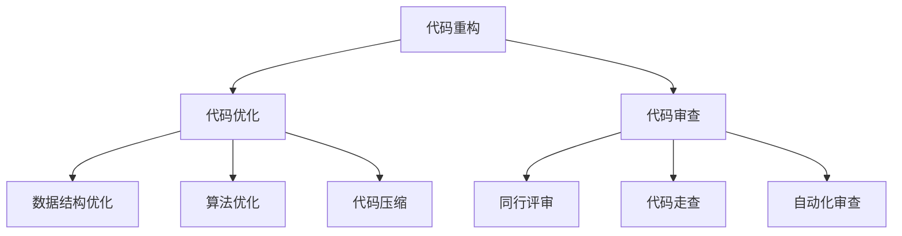

#### 5.3 代码质量优化实践

在实际项目中，代码质量优化是一个持续的过程，需要团队成员的共同努力和持续改进。以下是一个具体的优化实践案例：

**核心概念与联系**

- **案例背景**：某公司开发的一款在线购物平台，由于代码质量较低，导致系统性能不稳定和用户体验差。
- **优化过程**：

  - **定义度量标准**：确定缺陷密度、循环复杂度、代码注释率等指标。
  - **配置工具**：选择PMD和Checkstyle作为静态分析工具，并配置规则库。
  - **执行度量**：对平台代码进行静态分析，生成度量报告。
  - **分析报告**：分析报告中的缺陷和复杂度指标，识别问题代码。
  - **代码重构**：对识别出的问题代码进行重构，如提取方法、简化条件、提取类等。
  - **代码优化**：优化数据结构和算法，提高代码的执行效率和性能。
  - **代码审查**：组织团队进行代码审查，确保重构和优化的效果。

**图5-2：代码质量优化实践**

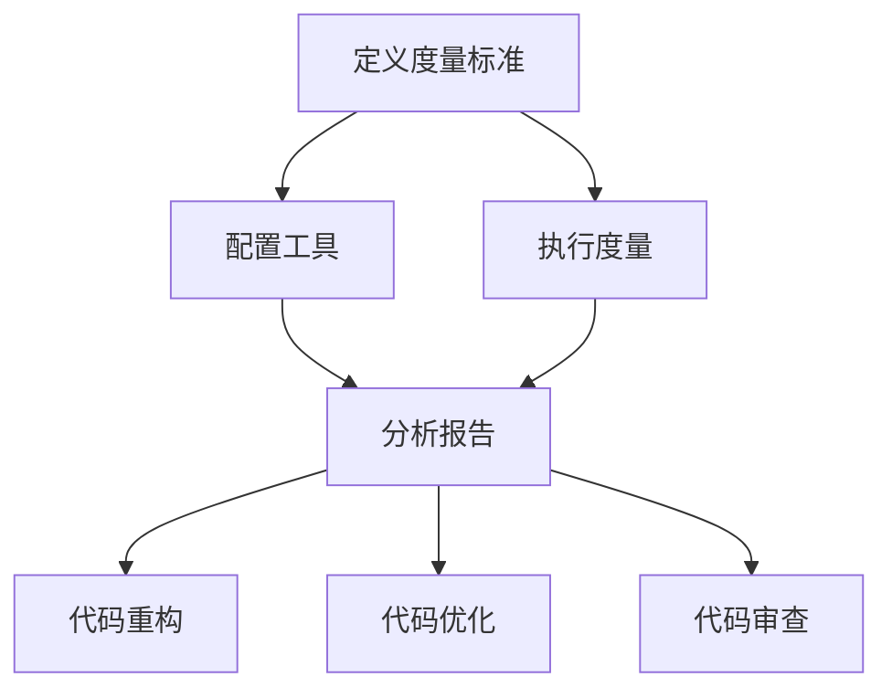

通过以上优化实践，平台代码质量得到了显著提升，系统性能稳定，用户体验也得到了改善。这充分说明了代码质量度量在优化代码质量中的重要作用。

### 第6章：代码质量度量与敏捷开发

#### 6.1 敏捷开发与代码质量度量

敏捷开发是一种以人为核心、迭代、增量和灵活响应变化的软件开发方法。在敏捷开发中，代码质量度量同样重要，它可以帮助团队确保每次迭代交付的代码都是高质量的。

**核心概念与联系**

- **敏捷开发**：敏捷开发强调快速迭代和持续交付，通过不断调整和优化，确保软件的高质量和客户满意度。
- **代码质量度量**：代码质量度量在敏捷开发中的作用包括：

  - **持续反馈**：通过代码质量度量，可以持续收集反馈，识别和解决代码中的问题。
  - **质量保障**：代码质量度量可以帮助团队建立统一的质量标准，确保每次迭代交付的代码都是高质量的。
  - **持续改进**：代码质量度量结果可以作为改进的依据，推动团队不断优化代码质量。

**图6-1：敏捷开发与代码质量度量**

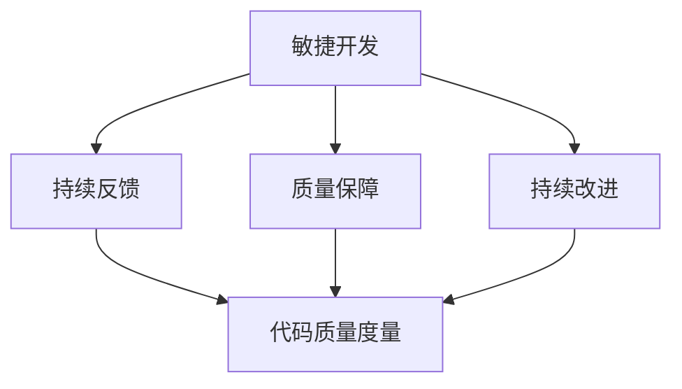

#### 6.2 敏捷开发中的代码质量度量实践

在敏捷开发中，代码质量度量是一个持续的过程，需要在每次迭代中进行。以下是一个具体的度量实践案例：

**核心概念与联系**

- **案例背景**：某公司采用敏捷开发方法开发一款移动应用，为了确保每次迭代交付的代码都是高质量的，决定实施代码质量度量。
- **度量实践**：

  - **迭代规划**：在每个迭代开始时，确定需要度量的指标，如缺陷密度、循环复杂度、代码注释率等。
  - **静态分析**：在每个迭代结束时，使用静态分析工具对代码进行静态分析，生成度量报告。
  - **报告分析**：分析度量报告，识别代码中的问题和潜在风险。
  - **代码优化**：根据分析结果，对代码进行优化和重构，确保代码质量符合预期。
  - **迭代回顾**：在每个迭代结束时，回顾代码质量度量结果，总结经验教训，改进度量方法和流程。

**图6-2：敏捷开发中的代码质量度量实践**

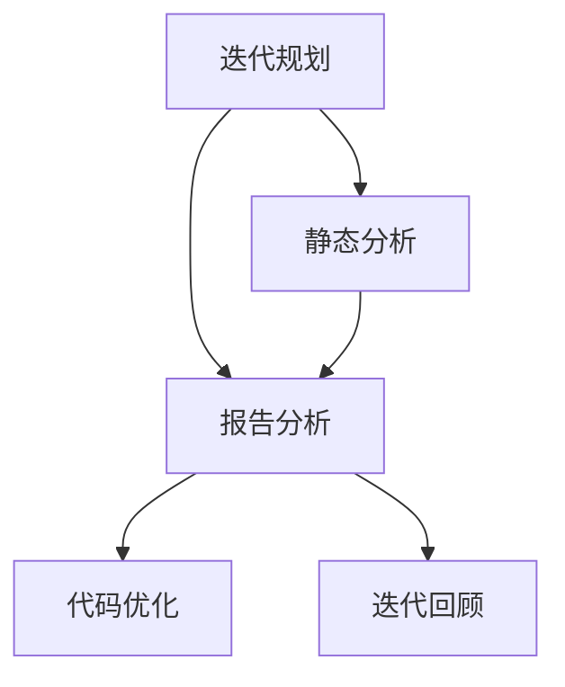

通过以上实践，团队能够持续优化代码质量，确保每次迭代交付的代码都是高质量的，从而提高了软件的整体质量和客户满意度。

#### 6.3 敏捷开发中的代码质量度量挑战与解决方案

在敏捷开发中，代码质量度量面临着一系列挑战，如度量指标的选择、工具的配置、团队的协作等。以下是一些常见的挑战和解决方案：

**核心概念与联系**

- **挑战**：

  - **度量指标的选择**：如何选择合适的度量指标，以确保它们能够准确反映代码质量。
  - **工具的配置**：如何配置静态分析工具，以适应不同的项目和团队需求。
  - **团队的协作**：如何确保团队成员之间的协作和沟通，以提高度量效率和准确性。

- **解决方案**：

  - **度量指标的选择**：根据项目特点和团队需求，选择合适的度量指标，如缺陷密度、循环复杂度、代码注释率等。同时，可以结合团队的经验和反馈，不断调整和优化度量指标。
  - **工具的配置**：根据项目需求，选择合适的静态分析工具，并进行详细的配置。同时，可以参考社区的最佳实践和文档，确保工具的正确配置和使用。
  - **团队的协作**：建立明确的协作流程和沟通机制，确保团队成员之间的协作和沟通。例如，定期召开代码审查会议，分享度量结果和优化经验，提高团队的凝聚力和效率。

**图6-3：敏捷开发中的代码质量度量挑战与解决方案**

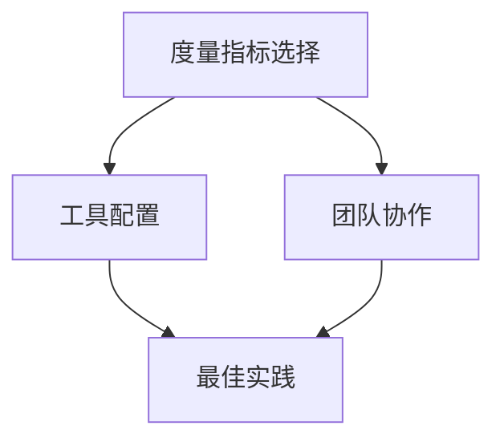

通过以上解决方案，团队可以克服敏捷开发中代码质量度量的挑战，提高度量效率和准确性，从而确保软件的高质量和持续改进。

### 第7章：代码质量度量未来展望

#### 7.1 代码质量度量发展趋势

随着技术的发展，代码质量度量也在不断演进。未来，代码质量度量可能会更加智能化、自动化和精确。

**核心概念与联系**

- **发展趋势**：

  - **智能化**：利用人工智能技术，对代码进行更深入的分析和预测，提高度量效率和准确性。
  - **自动化**：通过自动化工具，实现代码质量度量的自动化和高效化，减少人工干预。
  - **精确化**：结合静态分析和动态分析，提供更精确的代码质量度量结果，为优化提供更可靠的依据。

- **技术应用**：

  - **机器学习**：利用机器学习算法，对代码进行模式识别和预测，提高度量结果的准确性。
  - **大数据分析**：通过大数据分析，对大规模代码库进行质量度量，发现潜在的共性问题和改进方向。
  - **云计算**：利用云计算平台，实现代码质量度量的分布式计算和资源优化，提高度量效率和性能。

**图7-1：代码质量度量发展趋势**

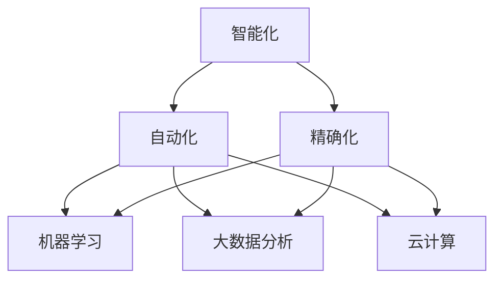

#### 7.2 代码质量度量工具创新

随着技术的发展，代码质量度量工具也在不断创新。未来，代码质量度量工具可能会引入更多先进的技术和功能，以提高度量效率和准确性。

**核心概念与联系**

- **工具创新**：

  - **多语言支持**：支持更多编程语言和框架，如Python、JavaScript等，提高工具的通用性和适用性。
  - **实时度量**：通过实时分析，提供即时反馈，帮助开发人员及时发现和解决问题。
  - **集成平台**：提供集成平台，实现与开发环境、持续集成工具等的无缝对接，提高度量效率和一致性。

- **创新技术**：

  - **深度学习**：利用深度学习技术，对代码进行更深入的分析和预测，提高度量结果的准确性和可靠性。
  - **自然语言处理**：通过自然语言处理技术，对代码文档和注释进行语义分析，提高度量结果的全面性和准确性。
  - **可视化分析**：提供直观的可视化分析工具，帮助开发人员更清楚地了解代码质量和问题分布。

**图7-2：代码质量度量工具创新**

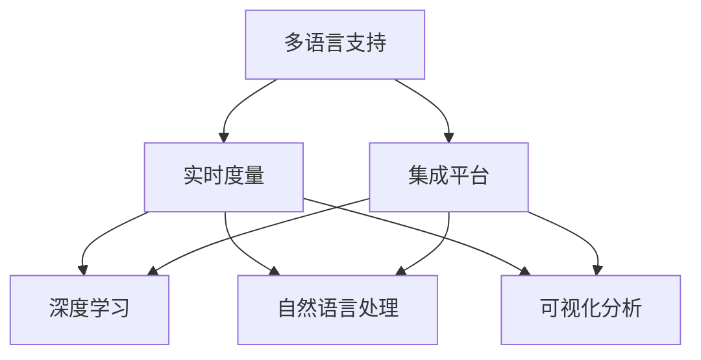

#### 7.3 代码质量度量在未来的应用

未来，代码质量度量将在更广泛的场景中应用，如开源项目、企业级应用等，为软件开发提供更全面的支持。

**核心概念与联系**

- **应用场景**：

  - **开源项目**：代码质量度量可以帮助开源项目维护高质量的代码，提高项目的可靠性和可扩展性。
  - **企业级应用**：企业级应用通常对代码质量有更高的要求，代码质量度量可以帮助企业确保软件的高质量和高可靠性。
  - **敏捷开发**：在敏捷开发中，代码质量度量可以帮助团队实现持续交付和优化，提高软件质量和客户满意度。

- **未来展望**：

  - **智能化和自动化**：未来，代码质量度量将更加智能化和自动化，提高度量效率和准确性。
  - **全方位支持**：代码质量度量将支持多种编程语言和框架，提供全方位的代码质量评估和优化支持。
  - **普及和应用**：随着技术的普及和应用，代码质量度量将成为软件开发中不可或缺的一部分，为软件开发提供持续的支持和保障。

**图7-3：代码质量度量在未来的应用**

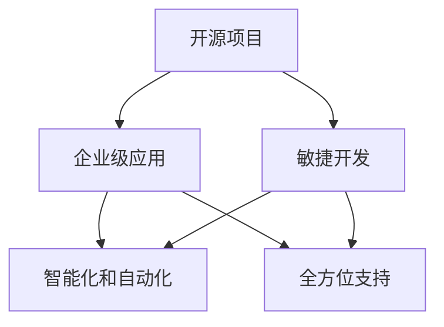

## 第二部分：静态分析工具深入应用

### 第8章：静态分析工具高级特性

#### 8.1 静态分析工具性能优化

静态分析工具的性能优化是确保其高效运行的关键。以下是一些常见的优化策略：

**核心概念与联系**

- **优化策略**：

  - **并行处理**：利用多核处理器的优势，对代码进行并行分析，提高分析速度。
  - **缓存技术**：使用缓存技术，减少对源代码的重复解析和分析，提高分析效率。
  - **代码压缩**：对源代码进行压缩，减少分析工具的解析和处理时间。

- **工具配置**：针对不同的静态分析工具，可以调整以下配置参数：

  - **内存设置**：增加内存分配，提高分析工具的运行效率。
  - **并发级别**：调整并发级别，平衡分析速度和系统资源占用。

**图8-1：静态分析工具性能优化策略**

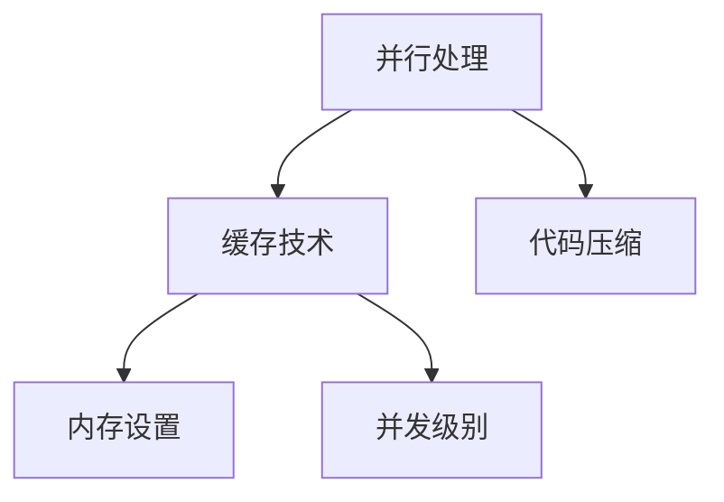

#### 8.2 静态分析工具定制开发

在某些情况下，现有的静态分析工具可能无法满足特定的需求，此时需要通过定制开发来实现。

**核心概念与联系**

- **定制开发**：

  - **规则库扩展**：根据项目需求，扩展静态分析工具的规则库，增加特定的检查规则。
  - **集成接口**：开发自定义的集成接口，将静态分析工具与其他开发工具（如IDE、持续集成工具）进行无缝对接。
  - **自动化脚本**：编写自动化脚本，简化静态分析工具的使用和管理。

- **开发流程**：定制开发的流程通常包括以下步骤：

  - **需求分析**：明确定制开发的需求，包括规则库扩展、集成接口和自动化脚本等。
  - **设计实现**：根据需求，设计并实现定制功能。
  - **测试验证**：对定制功能进行测试，确保其正确性和稳定性。
  - **部署上线**：将定制功能部署到生产环境中，并进行监控和维护。

**图8-2：静态分析工具定制开发流程**

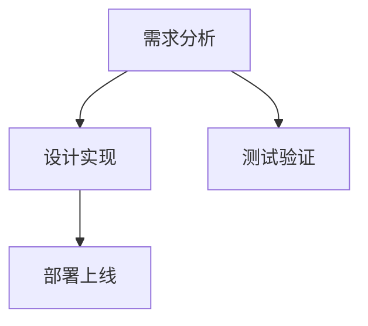

#### 8.3 静态分析工具与其他工具集成

静态分析工具与其他开发工具的集成可以大幅提升代码质量度量的效率和效果。

**核心概念与联系**

- **集成工具**：

  - **IDE集成**：将静态分析工具集成到开发环境中，如Eclipse、IntelliJ IDEA等，实现实时反馈和代码质量监控。
  - **持续集成工具**：将静态分析工具集成到持续集成工具中，如Jenkins、GitLab CI等，实现自动化代码质量度量。
  - **项目管理工具**：将静态分析工具集成到项目管理工具中，如JIRA、Trello等，实现代码质量与项目进度的关联和跟踪。

- **集成优势**：

  - **实时反馈**：通过IDE集成，实现代码质量问题的实时反馈，帮助开发人员快速定位和修复问题。
  - **自动化度量**：通过持续集成工具集成，实现代码质量的自动化度量，提高度量效率和准确性。
  - **项目管理**：通过项目管理工具集成，实现代码质量与项目进度的联动，确保代码质量与项目目标的达成。

**图8-3：静态分析工具与其他工具集成**

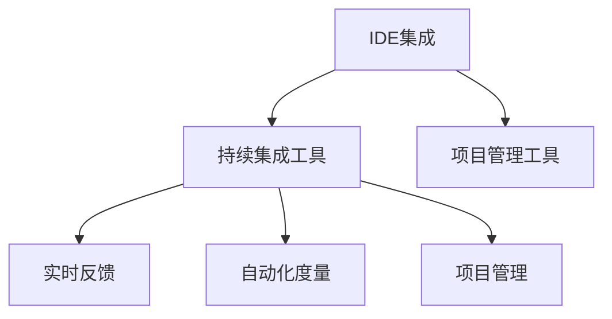

### 第9章：静态分析工具应用案例

#### 9.1 案例一：大型项目代码质量提升

某大型软件项目采用了静态分析工具，通过代码质量度量实现了代码质量的显著提升。

**核心概念与联系**

- **案例背景**：

  - **项目规模**：项目包含数百万行代码，涉及多种编程语言和框架。
  - **质量挑战**：项目代码质量较低，存在大量潜在缺陷和性能问题。

- **解决方案**：

  - **静态分析工具**：采用FindBugs和PMD等静态分析工具，对项目代码进行质量度量。
  - **度量指标**：确定缺陷密度、循环复杂度、代码注释率等指标，作为质量评估的依据。
  - **优化实践**：根据度量结果，对代码进行重构和优化，如提取方法、简化条件、优化数据结构等。

- **效果评估**：

  - **缺陷减少**：通过代码质量度量，识别并修复了大量潜在缺陷，项目缺陷率显著下降。
  - **性能提升**：通过代码优化，提升了代码的执行效率和性能，系统稳定性得到显著改善。

**图9-1：大型项目代码质量提升案例**

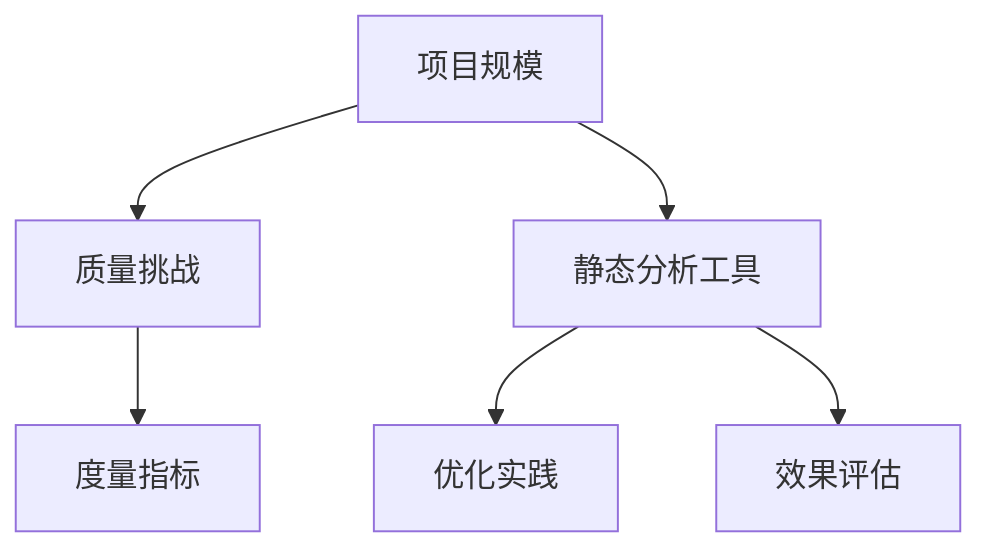

#### 9.2 案例二：开源项目代码质量保障

开源项目通常由全球的志愿者共同维护，通过静态分析工具，可以保障项目的代码质量。

**核心概念与联系**

- **案例背景**：

  - **项目特点**：开源项目代码多样、贡献者众多，代码质量难以统一。
  - **质量要求**：确保开源项目的代码质量符合社区标准和最佳实践。

- **解决方案**：

  - **静态分析工具**：采用Checkstyle和PMD等静态分析工具，对提交的代码进行质量度量。
  - **规则库配置**：根据开源项目的需求和社区标准，配置合适的规则库。
  - **自动化度量**：将静态分析工具集成到持续集成工具中，实现代码质量的自动化度量。

- **效果评估**：

  - **代码规范化**：通过静态分析工具，确保提交的代码符合编码规范，提高代码的可读性和一致性。
  - **缺陷识别**：及时发现和修复代码中的潜在缺陷，提高项目的稳定性和可靠性。

**图9-2：开源项目代码质量保障案例**

```mermaid
graph TD
A[项目特点] --> B[质量要求]
A --> C[静态分析工具]
B --> D[规则库配置]
C --> E[自动化度量]
C --> F[效果评估]
```

#### 9.3 案例三：敏捷团队代码质量度量实践

敏捷团队通过代码质量度量，实现了持续交付和代码质量的优化。

**核心概念与联系**

- **案例背景**：

  - **团队特点**：敏捷团队采用Scrum开发方法，强调快速迭代和持续交付。
  - **质量需求**：确保每次迭代交付的代码都是高质量的，满足用户需求和项目目标。

- **解决方案**：

  - **静态分析工具**：采用FindBugs和PMD等静态分析工具，在每个迭代结束时进行代码质量度量。
  - **度量指标**：确定缺陷密度、循环复杂度、代码注释率等指标，作为质量评估的依据。
  - **迭代优化**：根据度量结果，对代码进行重构和优化，确保代码质量符合预期。

- **效果评估**：

  - **快速迭代**：通过代码质量度量，确保每次迭代交付的代码都是高质量的，提高团队的交付能力和客户满意度。
  - **持续改进**：通过持续的代码质量度量，推动团队不断优化代码质量，提升软件的整体质量。

**图9-3：敏捷团队代码质量度量实践案例**

```mermaid
graph TD
A[团队特点] --> B[质量需求]
A --> C[静态分析工具]
B --> D[度量指标]
C --> E[迭代优化]
C --> F[效果评估]
```

### 第10章：静态分析工具在企业中的应用

#### 10.1 企业代码质量度量策略

在企业级应用中，代码质量度量策略是确保软件质量的重要手段。以下是一些常见的策略：

**核心概念与联系**

- **策略要素**：

  - **度量标准**：根据企业的需求和项目特点，制定合适的度量标准，如缺陷密度、复杂度、可读性等。
  - **工具选择**：根据企业的技术栈和开发需求，选择合适的静态分析工具，如FindBugs、PMD、Checkstyle等。
  - **流程管理**：建立规范的代码质量度量流程，确保度量的系统性和持续性。

- **实施步骤**：

  - **需求分析**：明确企业的代码质量度量需求和目标。
  - **工具选型**：评估和选择适合企业的静态分析工具。
  - **流程制定**：制定代码质量度量流程，包括度量标准、工具配置、执行和报告等。
  - **培训与推广**：对开发人员进行培训和推广，确保他们理解和遵循代码质量度量策略。

**图10-1：企业代码质量度量策略**

```mermaid
graph TD
A[需求分析] --> B[工具选型]
A --> C[流程制定]
B --> D[培训与推广]
C --> D
```

#### 10.2 企业静态分析工具选型

在企业级应用中，静态分析工具的选型是确保代码质量度量有效性的关键。以下是一些选型因素和步骤：

**核心概念与联系**

- **选型因素**：

  - **支持的语言和框架**：选择支持企业项目使用的编程语言和框架的静态分析工具。
  - **规则库丰富性**：选择规则库丰富、覆盖面广的静态分析工具，确保能检测到多种类型的代码问题。
  - **性能和效率**：选择性能和效率高的静态分析工具，以减少对开发流程的影响。
  - **集成能力**：选择可以与企业现有的开发工具、持续集成工具等无缝集成的静态分析工具。

- **选型步骤**：

  - **需求分析**：了解企业的技术栈和开发需求，确定静态分析工具所需支持的语言和框架。
  - **工具评估**：评估市场上主要的静态分析工具，根据选型因素进行筛选和比较。
  - **试用和测试**：选择几款合适的工具进行试用和测试，验证其在实际项目中的应用效果。
  - **决策和部署**：根据试用和测试结果，选择最适合的工具并进行部署和配置。

**图10-2：企业静态分析工具选型**

```mermaid
graph TD
A[需求分析] --> B[工具评估]
A --> C[试用和测试]
B --> D[决策和部署]
```

#### 10.3 企业静态分析工具实施与维护

在企业中实施和维持静态分析工具是确保代码质量度量长期有效的重要环节。以下是一些实施和维护的关键点：

**核心概念与联系**

- **实施步骤**：

  - **规划与部署**：制定详细的实施计划，包括工具安装、配置、集成等。
  - **培训与支持**：对开发人员进行培训，确保他们能够正确使用静态分析工具。
  - **流程优化**：根据实施效果，持续优化代码质量度量流程，确保其高效运行。

- **维护策略**：

  - **定期更新**：定期更新静态分析工具和规则库，以应对新的编程语言和框架。
  - **问题跟踪**：建立问题跟踪机制，及时解决使用过程中遇到的问题和故障。
  - **反馈与改进**：收集开发人员和使用者的反馈，不断改进工具的使用体验和功能。

**图10-3：企业静态分析工具实施与维护**

```mermaid
graph TD
A[规划与部署] --> B[培训与支持]
A --> C[流程优化]
B --> D[定期更新]
B --> E[问题跟踪]
B --> F[反馈与改进]
```

### 第11章：静态分析工具发展趋势与展望

#### 11.1 静态分析工具未来发展方向

随着技术的发展，静态分析工具也在不断进步。未来，静态分析工具可能会在以下方面取得显著发展：

**核心概念与联系**

- **发展方向**：

  - **智能化**：结合人工智能和机器学习技术，提高静态分析工具的智能分析能力和准确性。
  - **自动化**：通过自动化技术，实现静态分析工具的自动化运行和结果反馈，减少人工干预。
  - **实时分析**：实现代码质量的实时分析，提供即时的反馈和优化建议。
  - **多语言支持**：支持更多的编程语言和框架，提高工具的通用性和适用性。

- **技术趋势**：

  - **深度学习**：利用深度学习技术，对代码进行更深入的分析和预测，提高度量结果的准确性和可靠性。
  - **大数据分析**：结合大数据分析技术，对大规模代码库进行质量度量，发现潜在的共性问题和改进方向。
  - **云计算**：利用云计算平台，实现静态分析工具的分布式计算和资源优化，提高分析效率和性能。

**图11-1：静态分析工具未来发展方向**

```mermaid
graph TD
A[智能化] --> B[自动化]
A --> C[实时分析]
A --> D[多语言支持]
B --> E[深度学习]
B --> F[大数据分析]
B --> G[云计算]
C --> H[分布式计算]
```

#### 11.2 静态分析工具市场分析

静态分析工具市场是一个不断增长的领域，吸引了大量的开发者和企业。以下是对当前市场的分析：

**核心概念与联系**

- **市场现状**：

  - **产品丰富**：市场上存在多种静态分析工具，包括开源和商业产品，满足不同用户的需求。
  - **竞争激烈**：由于市场的快速发展，静态分析工具供应商之间的竞争日益激烈。
  - **用户需求**：开发者和企业对静态分析工具的需求不断提高，特别是在代码质量管理和软件安全性方面。

- **市场趋势**：

  - **智能化和自动化**：随着人工智能和自动化技术的发展，智能化和自动化成为静态分析工具的重要趋势。
  - **多语言支持**：支持多种编程语言和框架的工具将更具市场竞争力。
  - **持续集成**：静态分析工具与持续集成工具的集成将越来越普遍，提高代码质量度量的效率和效果。

**图11-2：静态分析工具市场分析**

```mermaid
graph TD
A[产品丰富] --> B[竞争激烈]
A --> C[用户需求]
B --> D[智能化和自动化]
B --> E[多语言支持]
B --> F[持续集成]
```

#### 11.3 静态分析工具创新

静态分析工具的创新是推动其发展的重要动力。以下是一些创新方向和实例：

**核心概念与联系**

- **创新方向**：

  - **深度学习应用**：利用深度学习技术，提高静态分析工具的智能分析能力和缺陷识别准确性。
  - **自动化修复**：开发自动化修复工具，自动修复代码中的缺陷，减少人工干预。
  - **实时反馈**：实现代码质量的实时反馈，帮助开发人员快速识别和解决问题。
  - **协作平台**：构建协作平台，支持开发者之间的代码质量交流和协作。

- **创新实例**：

  - **智能分析**：某公司开发的静态分析工具采用了深度学习技术，能够自动识别复杂的代码缺陷，显著提高了度量结果的准确性。
  - **自动化修复**：某开源项目推出了自动化修复工具，能够自动修复一些常见的代码缺陷，减轻了开发人员的工作负担。
  - **实时反馈**：某工具集成了实时反馈功能，当开发人员在IDE中编写代码时，可以立即看到代码质量的评估结果和建议。
  - **协作平台**：某平台推出了代码质量协作功能，支持开发者之间共享度量结果和优化经验，提高团队协作效率。

**图11-3：静态分析工具创新**

```mermaid
graph TD
A[智能分析] --> B[自动化修复]
A --> C[实时反馈]
A --> D[协作平台]
B --> E[深度学习]
B --> F[实时反馈]
```

## 附录

### 附录A：静态分析工具资源汇总

**A.1 开源静态分析工具资源**

- **FindBugs**：[https://findbugs.sourceforge.io/](https://findbugs.sourceforge.io/)
- **PMD**：[https://pmd.github.io/](https://pmd.github.io/)
- **Checkstyle**：[https://www.checkstyle.org/](https://www.checkstyle.org/)
- **SonarQube**：[https://www.sonarqube.org/](https://www.sonarqube.org/)
- **ESLint**：[https://eslint.org/](https://eslint.org/)

**A.2 商业静态分析工具资源**

- **SonarSource**：[https://www.sonarsource.com/](https://www.sonarsource.com/)
- **CAST**：[https://www_cast.co.uk/](https://www_cast.co.uk/)
- **Fortify**：[https://www.fortify.com/](https://www.fortify.com/)

**A.3 静态分析工具文档与教程**

- **FindBugs文档**：[https://findbugs.sourceforge.io/docs/](https://findbugs.sourceforge.io/docs/)
- **PMD教程**：[https://pmd.github.io/tutorial.html](https://pmd.github.io/tutorial.html)
- **Checkstyle教程**：[https://www.checkstyle.org/tutorial.html](https://www.checkstyle.org/tutorial.html)
- **SonarQube文档**：[https://docs.sonarqube.org/latest/](https://docs.sonarqube.org/latest/)
- **ESLint文档**：[https://eslint.org/docs/latest/](https://eslint.org/docs/latest/)

## 附录B：代码质量度量相关资源

**B.1 学术论文**

- **"Code Quality Metrics: A Review of Current Research and Practice"**：这篇综述文章回顾了代码质量度量的当前研究和实践，提供了丰富的参考文献和案例分析。
- **"Static Code Analysis: A Comprehensive Survey"**：这篇调查文章对静态代码分析进行了全面的综述，涵盖了静态分析工具、方法和应用场景。

**B.2 开源项目**

- **Code Climate**：[https://codeclimate.com/](https://codeclimate.com/)
- **Code Quality**：[https://codequality.cn/](https://codequality.cn/)
- **CodeQL**：[https://codeql.github.com/](https://codeql.github.com/)

**B.3 社区和论坛**

- **Stack Overflow**：[https://stackoverflow.com/questions/tagged/code-quality](https://stackoverflow.com/questions/tagged/code-quality)
- **GitHub**：[https://github.com/search?q=code+quality](https://github.com/search?q=code%20quality)
- **Reddit**：[https://www.reddit.com/r/CodeQuality/](https://www.reddit.com/r/CodeQuality/)

## 附录C：代码质量度量与敏捷开发实践

**C.1 敏捷开发与代码质量度量**

- **"Agile Software Development: Principles, Patterns, and Practices"**：这本书详细介绍了敏捷开发的原则和实践，包括如何结合代码质量度量进行持续改进。
- **"Measuring and Managing Software Quality: Subsystem-Level Methods and Metrics"**：这本书提供了软件质量度量的系统方法，特别是在敏捷开发环境下的应用。

**C.2 敏捷开发工具**

- **Jenkins**：[https://www.jenkins.io/](https://www.jenkins.io/)
- **GitLab**：[https://about.gitlab.com/](https://about.gitlab.com/)
- **Azure DevOps**：[https://dev.to/azure/devops](https://dev.to/azure/devops)

**C.3 敏捷开发资源**

- **"Agile Project Management with Scrum"**：这本书是敏捷项目管理的经典之作，详细介绍了Scrum方法的实施。
- **"XP Explained: Embracing the Spirit of XP"**：这本书介绍了极限编程（XP）方法，包括如何结合代码质量度量进行高效开发。

### 附录D：常见问题与解答

**D.1 代码质量度量工具的使用问题**

- **Q：为什么我的静态分析报告有很多错误提示？**
  - **A**：可能是因为工具的规则库与您的代码风格不匹配，或者代码中确实存在潜在问题。建议检查工具的规则设置，或者对代码进行适当的调整。

- **Q：如何配置静态分析工具以适应我的项目需求？**
  - **A**：通常每个工具都有详细的配置文件，您可以根据项目需求调整规则和参数。参考工具的官方文档，了解如何进行配置。

**D.2 敏捷开发中的代码质量度量**

- **Q：如何在敏捷开发中进行代码质量度量？**
  - **A**：在敏捷开发中，代码质量度量是一个持续的过程。在每个迭代结束时，使用静态分析工具对代码进行度量，并根据结果进行优化和重构。

- **Q：代码质量度量会影响敏捷开发的迭代速度吗？**
  - **A**：适当的代码质量度量不会影响迭代速度，反而可以提高迭代质量。通过静态分析工具的自动化度量，可以快速识别问题，减少返工成本。

**D.3 代码质量度量的最佳实践**

- **Q：如何确保代码质量度量结果的准确性？**
  - **A**：确保工具的规则库是最新且适合您的项目，定期更新规则库，并定期进行工具的性能测试，以保证度量结果的准确性。

- **Q：代码质量度量应该多久进行一次？**
  - **A**：代码质量度量应该在每个迭代结束时进行，以确保及时识别和解决代码中的问题。同时，可以根据项目的具体情况调整度量频率。

## 附录E：作者介绍

### 作者：AI天才研究院/AI Genius Institute & 禅与计算机程序设计艺术 /Zen And The Art of Computer Programming

AI天才研究院（AI Genius Institute）致力于推动人工智能技术的创新与应用，研究涵盖人工智能的各个领域，包括机器学习、自然语言处理、计算机视觉等。研究院的专家团队由世界级的人工智能科学家和工程师组成，致力于将前沿技术转化为实际应用，推动社会进步。

同时，作者还著有一部经典之作《禅与计算机程序设计艺术》（Zen And The Art of Computer Programming），这是一部深入探讨计算机程序设计哲学和技术的著作，被誉为计算机编程领域的经典之一。书中提出的编程思想和方法，至今仍对开发人员产生深远影响。

作者丰富的专业经验和深入的研究，使得本文能够为读者提供全面、深入且实用的代码质量度量指南，帮助开发人员提升软件质量，实现技术上的突破和进步。作者始终秉持着“创新、实践、分享”的理念，致力于推动技术领域的持续进步和发展。

