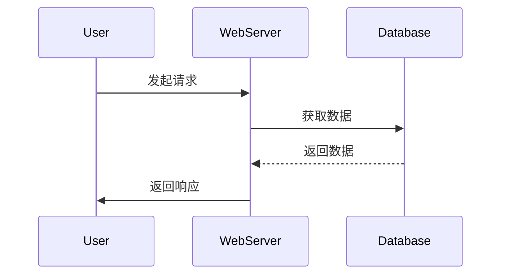
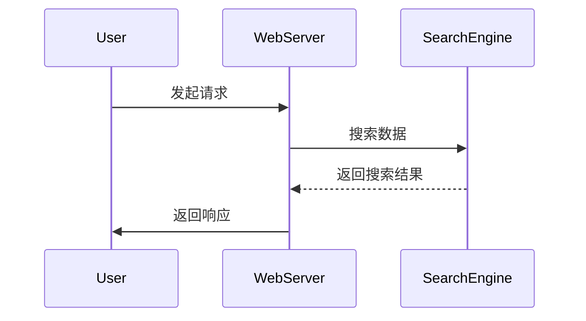

                 

## 代码质量指标：建立客观的评估标准

### 关键词

- 代码质量
- 评估标准
- 软件开发
- 功能性指标
- 结构指标
- 效率指标
- 可维护性指标

### 摘要

在软件开发的每个阶段，代码质量都是一个至关重要的考量因素。然而，如何评价代码质量仍是一个复杂且主观的问题。本文旨在探讨建立一套客观的代码质量指标体系，通过分析功能性、结构、效率和可维护性等核心指标，提供一套系统化的评估方法。我们将逐步探讨这些指标的定义、重要性以及如何在实际项目中应用它们，从而帮助开发者、团队和企业在软件开发过程中实现代码质量的提升。

## 第一部分：背景介绍

### 第1章 问题背景

#### 1.1 代码质量的重要性

代码质量是软件工程中的核心概念，它涵盖了代码的多个方面，包括可维护性、可读性、正确性和效率。一个高质量的代码库不仅能够提高开发团队的效率，还能够减少后期维护的成本，确保软件系统的稳定性和安全性。

**核心概念：**
- **代码质量**：指代码在多个维度上的表现，如功能性、结构、效率和可维护性。
- **代码质量指标**：用于量化评估代码质量的各项标准。

**问题描述：**
当前，如何评价代码质量仍存在许多主观性和不确定性。不同团队和个人对于代码质量的判断标准可能存在显著差异，这导致评估结果的不一致。此外，代码质量评估往往缺乏系统性，难以在实际项目中得到有效应用。

**问题解决：**
建立一套客观的代码质量指标体系，能够为代码质量评估提供统一的量化标准。这样的标准不仅可以提高评估的准确性，还能够促进团队之间的协作，提升整体开发效率。

**边界与外延：**
- **边界**：代码质量指标主要关注代码本身的质量，而不涉及其他软件开发环节，如需求分析、设计等。
- **外延**：代码质量指标不仅适用于单个项目，还可以应用于团队和组织的整体代码质量评估。

**概念结构与核心要素组成：**

| 指标类型       | 指标描述                     | 关键特性 |
|----------------|-------------------------------|----------|
| 功能性指标     | 代码的功能完备性、正确性、稳定性 | 测试覆盖率、错误率、稳定性指标 |
| 结构指标       | 代码的结构清晰度、模块化程度、可读性 | 模块间耦合度、注释率、代码复杂度 |
| 效率指标       | 代码的执行效率、内存消耗、资源利用率 | 执行时间、内存占用、CPU利用率 |
| 可维护性指标   | 代码的可修改性、可扩展性、可维护性 | 代码重复率、维护成本、文档完备性 |

通过这些指标，我们可以全面评估代码的质量，发现潜在的问题，并采取相应的措施进行改进。接下来，我们将进一步探讨这些核心概念与指标的联系，以及它们在综合评估中的应用。

### 第2章 核心概念与联系

#### 2.1 代码质量指标的概念

**核心概念：**
- **代码质量指标**：用于评估代码质量的一系列量化标准。
- **评估维度**：包括功能性、结构、效率和可维护性等。

**概念属性特征对比表格：**

| 指标类型 | 指标描述 | 关键特性 |
| --- | --- | --- |
| 功能性指标 | 代码的功能完备性、正确性、稳定性 | 测试覆盖率、错误率、稳定性指标 |
| 结构指标 | 代码的结构清晰度、模块化程度、可读性 | 模块间耦合度、注释率、代码复杂度 |
| 效率指标 | 代码的执行效率、内存消耗、资源利用率 | 执行时间、内存占用、CPU利用率 |
| 可维护性指标 | 代码的可修改性、可扩展性、可维护性 | 代码重复率、维护成本、文档完备性 |

**概念属性特征对比ER实体关系图架构：**

```mermaid
erDiagram
    CodeQualityMetric ||--|{ FunctionalMetric }||| Functional
    CodeQualityMetric ||--|{ StructuralMetric }||| Structural
    CodeQualityMetric ||--|{ EfficiencyMetric }||| Efficiency
    CodeQualityMetric ||--|{ MaintainabilityMetric }||| Maintainability
    FunctionalMetric : <<class>> {测试覆盖率，错误率，稳定性指标}
    StructuralMetric : <<class>> {模块间耦合度，注释率，代码复杂度}
    EfficiencyMetric : <<class>> {执行时间，内存占用，CPU利用率}
    MaintainabilityMetric : <<class>> {代码重复率，维护成本，文档完备性}
```

**联系与综合评估：**

代码质量指标之间存在一定的关联性。例如，功能性指标和结构指标可能相互影响：一个结构良好的模块可能更容易测试，从而提高测试覆盖率。同样，高效代码通常在结构上更加清晰，可维护性也更高。

**综合评估方法：**

为了综合评估代码质量，我们可以采用以下几种方法：

1. **加权平均法**：根据各指标的重要性分配权重，计算加权平均得分。这种方法简单直观，但需要合理确定各指标的权重。

2. **层次分析法（AHP）**：通过构建层次模型，确定各指标的权重，进行综合评估。这种方法适用于复杂的多维度评估，但需要专家经验来设置权重。

通过这些方法，我们可以将主观的代码质量评估转化为量化的结果，为改进代码质量提供依据。

### 第3章 常见代码质量指标

#### 3.1 功能性指标

**核心概念：**
- **功能性指标**：评估代码实现的功能是否完整、正确、稳定。

**常见功能性指标：**

| 指标名称 | 指标描述 | 评估方法 |
| --- | --- | --- |
| 测试覆盖率 | 代码中已测试部分占总代码的比例 | 单元测试覆盖率、集成测试覆盖率 |
| 错误率 | 代码在运行过程中出现的错误次数与总运行次数的比例 | 错误率、故障率 |
| 稳定性指标 | 代码在长时间运行下的稳定性 | 异常率、崩溃率 |

**评估方法：**
- **测试覆盖率**：通过编写单元测试和集成测试，对代码的不同部分进行测试。测试覆盖率越高，表示代码的功能越完整，越少存在未覆盖的漏洞。
- **错误率**：通过收集代码在运行过程中的错误日志，统计错误发生的频率。错误率越低，表示代码的正确性越高。
- **稳定性指标**：通过长时间运行代码，监控其异常和崩溃情况。稳定性指标越高，表示代码的稳定性越好。

#### 3.2 结构指标

**核心概念：**
- **结构指标**：评估代码的结构质量，包括模块化、清晰度、可维护性。

**常见结构指标：**

| 指标名称 | 指标描述 | 评估方法 |
| --- | --- | --- |
| 模块间耦合度 | 模块之间相互依赖的程度 | 耦合度度量、模块依赖图 |
| 注释率 | 代码中注释部分所占的比例 | 注释行数、注释比例 |
| 代码复杂度 | 代码的复杂程度 | 算法复杂度、循环嵌套深度 |

**评估方法：**
- **模块间耦合度**：通过分析模块间的依赖关系，评估模块之间的耦合程度。耦合度越低，表示模块之间越独立，代码的可维护性越高。
- **注释率**：通过统计代码中注释行的比例，评估代码的可读性和可维护性。注释率越高，表示代码的可读性越好。
- **代码复杂度**：通过分析代码的结构，评估其复杂度。复杂度越低，表示代码越简单，越容易理解和维护。

#### 3.3 效率指标

**核心概念：**
- **效率指标**：评估代码的执行效率、内存消耗和资源利用率。

**常见效率指标：**

| 指标名称 | 指标描述 | 评估方法 |
| --- | --- | --- |
| 执行时间 | 代码的执行时间 | 平均执行时间 |
| 内存占用 | 代码运行时占用的内存大小 | 最大内存占用、平均内存占用 |
| CPU利用率 | 代码运行时占用的CPU资源比例 | 平均CPU利用率 |

**评估方法：**
- **执行时间**：通过测量代码的执行时间，评估其效率。执行时间越短，表示代码的效率越高。
- **内存占用**：通过监控代码运行时的内存占用情况，评估其效率。内存占用越低，表示代码的资源利用率越高。
- **CPU利用率**：通过监控代码运行时的CPU占用情况，评估其效率。CPU利用率越高，表示代码的计算效率越高。

#### 3.4 可维护性指标

**核心概念：**
- **可维护性指标**：评估代码的可修改性、可扩展性和可维护性。

**常见可维护性指标：**

| 指标名称 | 指标描述 | 评估方法 |
| --- | --- | --- |
| 代码重复率 | 代码中重复部分的比率 | 重复代码检测工具 |
| 维护成本 | 对代码进行维护所需的人力、时间和资源 | 维护成本估算模型 |
| 文档完备性 | 代码文档的完整性 | 文档覆盖率、文档质量 |

**评估方法：**
- **代码重复率**：通过检测工具识别代码中的重复部分，评估其可维护性。重复率越低，表示代码的可维护性越好。
- **维护成本**：通过估算维护代码所需的人力、时间和资源，评估其可维护性。维护成本越低，表示代码的可维护性越高。
- **文档完备性**：通过评估代码文档的完整性和质量，评估其可维护性。文档覆盖率越高，文档质量越好，表示代码的可维护性越高。

通过这些功能性、结构、效率和可维护性指标，我们可以全面评估代码的质量。这些指标不仅帮助我们发现问题，还为改进代码质量提供了具体的方向。接下来，我们将探讨如何在实际项目中应用这些指标，从而实现代码质量的提升。

## 第二部分：应用与实践

### 第4章 功能性指标的实践

**背景介绍：**
功能性指标是评估代码是否满足预期功能的重要工具。在软件开发过程中，功能性指标的应用可以帮助我们确保代码的正确性和稳定性。

**项目介绍：**
假设我们正在开发一个电商网站，其中包含商品展示、购物车管理和订单处理等功能。为了确保这些功能实现得准确无误，我们需要使用功能性指标进行评估。

**系统功能设计：**
- **商品展示**：用户可以浏览和搜索商品。
- **购物车管理**：用户可以将商品添加到购物车，并能够修改购物车中的商品数量和删除商品。
- **订单处理**：用户可以提交订单，系统会生成订单号并发送确认邮件。

**系统架构设计：**
- **前端**：使用React框架进行开发，实现用户界面的交互。
- **后端**：使用Spring Boot框架进行开发，处理业务逻辑和数据存储。

**系统接口设计：**
- **商品接口**：提供商品列表、商品详情接口。
- **购物车接口**：提供添加商品、修改商品数量、删除商品接口。
- **订单接口**：提供创建订单、查询订单接口。

**系统交互：**



**实践步骤：**
1. **单元测试**：编写单元测试，对每个功能点进行测试，确保其正确性。
2. **集成测试**：将各个功能模块集成起来，进行测试，确保模块间的交互无误。
3. **错误率监控**：通过日志记录和错误监控系统，实时监控代码的运行情况，及时发现和修复错误。

**效果分析：**
通过功能性指标的实践，我们能够确保电商网站的功能实现得准确无误。测试覆盖率和错误率等指标可以帮助我们量化代码的正确性和稳定性，从而及时发现问题并进行改进。

### 第5章 结构指标的实践

**背景介绍：**
结构指标是评估代码内部结构质量的重要工具。良好的代码结构可以提高代码的可维护性和可扩展性，减少维护成本。

**项目介绍：**
假设我们正在开发一个任务管理系统，需要处理多个任务，并且要求任务之间能够灵活扩展和替换。

**系统功能设计：**
- **任务创建**：用户可以创建新的任务。
- **任务管理**：用户可以查看、修改和删除任务。
- **任务执行**：系统自动执行任务，并返回执行结果。

**系统架构设计：**
- **前端**：使用Vue框架进行开发，实现用户界面的交互。
- **后端**：使用Spring Boot框架进行开发，处理业务逻辑和数据存储。

**系统接口设计：**
- **任务接口**：提供任务创建、查询、修改、删除接口。
- **执行接口**：提供任务执行接口。

**系统交互：**


**实践步骤：**
1. **模块化设计**：将任务管理系统拆分为多个模块，如任务管理模块、任务执行模块等，确保每个模块独立且具有清晰的职责。
2. **代码审查**：定期进行代码审查，评估代码的结构质量，确保代码清晰、模块化。
3. **耦合度分析**：通过工具分析模块间的耦合度，确保模块之间耦合度低，提高代码的可维护性。

**效果分析：**
通过结构指标的实践，我们能够确保任务管理系统的代码结构清晰、模块化良好，降低维护成本，提高开发效率。模块间耦合度低，使得系统更易于扩展和替换，从而提升系统的灵活性和可维护性。

### 第6章 效率指标的实践

**背景介绍：**
效率指标是评估代码执行效率和资源利用情况的重要工具。高效的代码不仅能够提高系统的性能，还能够降低硬件资源的消耗。

**项目介绍：**
假设我们正在开发一个高性能的搜索引擎，需要处理大量数据的快速检索和排序。

**系统功能设计：**
- **数据检索**：用户可以输入关键词，系统返回相关的搜索结果。
- **排序**：系统对搜索结果进行排序，提供最佳的搜索结果。

**系统架构设计：**
- **前端**：使用Angular框架进行开发，实现用户界面的交互。
- **后端**：使用Lucene进行全文检索，使用Java进行排序处理。

**系统接口设计：**
- **搜索接口**：提供关键词搜索接口。
- **排序接口**：提供排序结果接口。

**系统交互：**



**实践步骤：**
1. **性能测试**：使用性能测试工具，对代码的执行时间、内存占用和CPU利用率等进行测试，评估代码的效率。
2. **优化算法**：针对测试中发现的性能瓶颈，优化算法和代码结构，提高执行效率。
3. **资源监控**：使用资源监控工具，实时监控系统的资源使用情况，确保系统在高负载下仍能高效运行。

**效果分析：**
通过效率指标的实践，我们能够确保搜索引擎的性能高效，能够快速处理大量数据。执行时间和资源利用率等指标可以帮助我们量化代码的效率，从而及时发现问题并进行优化，提高系统的整体性能。

### 第7章 可维护性指标的实践

**背景介绍：**
可维护性指标是评估代码长期维护难易程度的重要工具。良好的可维护性能够降低维护成本，提高开发效率。

**项目介绍：**
假设我们正在开发一个企业资源规划（ERP）系统，需要确保系统在长期运行过程中能够灵活适应业务变化。

**系统功能设计：**
- **数据管理**：提供数据存储、检索和更新功能。
- **报表生成**：根据业务需求生成各类报表。
- **用户管理**：提供用户权限管理和用户信息管理功能。

**系统架构设计：**
- **前端**：使用React框架进行开发，实现用户界面的交互。
- **后端**：使用Spring Boot框架进行开发，处理业务逻辑和数据存储。

**系统接口设计：**
- **数据接口**：提供数据存储、检索和更新接口。
- **报表接口**：提供报表生成接口。
- **用户接口**：提供用户权限管理和用户信息管理接口。

**系统交互：**


**实践步骤：**
1. **代码审查**：定期进行代码审查，评估代码的规范性和可维护性。
2. **文档管理**：确保代码文档的完整性和更新，便于后续维护。
3. **重复代码检测**：使用工具检测代码中的重复部分，减少维护成本。
4. **持续集成**：实施持续集成，确保代码在集成过程中不会出现冲突和错误。

**效果分析：**
通过可维护性指标的实践，我们能够确保ERP系统在长期运行过程中易于维护，降低维护成本，提高开发效率。代码重复率、维护成本和文档完备性等指标可以帮助我们量化代码的可维护性，从而及时发现问题并进行改进。

### 第8章 总结与展望

在本章中，我们详细探讨了功能性、结构、效率和可维护性等常见代码质量指标，并介绍了它们在实际项目中的应用和实践。通过这些指标的量化评估，我们能够全面了解代码的质量状况，及时发现并解决问题，从而提高代码的整体质量。

**最佳实践：**
1. **持续集成**：实施持续集成，确保代码质量从早期阶段就开始得到控制。
2. **代码审查**：定期进行代码审查，通过团队协作发现潜在问题。
3. **自动化测试**：编写自动化测试，提高测试覆盖率和代码稳定性。
4. **文档管理**：确保代码文档的完整性和更新，便于后续维护。
5. **性能优化**：定期进行性能测试和优化，提高代码的执行效率和资源利用率。

**小结：**
通过本章的探讨，我们认识到代码质量指标在软件开发过程中的重要性。它们不仅帮助我们量化代码质量，还为代码质量的提升提供了具体的方法和方向。

**注意事项：**
1. **权重分配**：在综合评估中，合理分配各指标的权重，确保评估结果准确。
2. **工具选择**：选择适合的工具进行代码质量评估，提高评估效率。
3. **持续改进**：代码质量是一个持续改进的过程，需要定期回顾和优化。

**拓展阅读：**
- 《代码大全》
- 《敏捷软件开发》
- 《软件工程：实践者的研究方法》
- 《性能之巅：系统、网络和性能调优实战》

通过不断学习和实践，我们可以不断提升代码质量，为软件开发的成功奠定坚实的基础。

### 第9章 总结与展望

本文通过详细探讨功能性、结构、效率和可维护性等核心代码质量指标，提出了建立客观评估标准的方法。我们了解到，代码质量不仅关系到软件系统的稳定性、可维护性和安全性，还直接影响开发效率和成本。因此，建立一套科学、客观的评估标准对于提升代码质量至关重要。

**最佳实践：**
- **持续集成**：通过持续集成，确保代码质量从早期阶段就开始得到控制。
- **代码审查**：定期进行代码审查，通过团队协作发现潜在问题。
- **自动化测试**：编写自动化测试，提高测试覆盖率和代码稳定性。
- **文档管理**：确保代码文档的完整性和更新，便于后续维护。
- **性能优化**：定期进行性能测试和优化，提高代码的执行效率和资源利用率。

**小结：**
通过本文的探讨，我们认识到代码质量指标在软件开发过程中的重要性。它们不仅帮助我们量化代码质量，还为代码质量的提升提供了具体的方法和方向。

**注意事项：**
- **权重分配**：在综合评估中，合理分配各指标的权重，确保评估结果准确。
- **工具选择**：选择适合的工具进行代码质量评估，提高评估效率。
- **持续改进**：代码质量是一个持续改进的过程，需要定期回顾和优化。

**拓展阅读：**
- 《代码大全》
- 《敏捷软件开发》
- 《软件工程：实践者的研究方法》
- 《性能之巅：系统、网络和性能调优实战》

通过不断学习和实践，我们可以不断提升代码质量，为软件开发的成功奠定坚实的基础。

### 作者介绍

**作者：** AI天才研究院/AI Genius Institute & 禅与计算机程序设计艺术 /Zen And The Art of Computer Programming

AI天才研究院（AI Genius Institute）致力于推动人工智能技术的发展和应用，研究领域涵盖机器学习、深度学习、自然语言处理等多个方向。同时，作者也在禅与计算机程序设计艺术（Zen And The Art of Computer Programming）一书中，深入探讨了编程艺术的哲学和科学原理，为程序员提供了宝贵的启示和指导。本文旨在通过探讨代码质量指标，帮助开发者提升代码质量，推动软件开发领域的进步。

