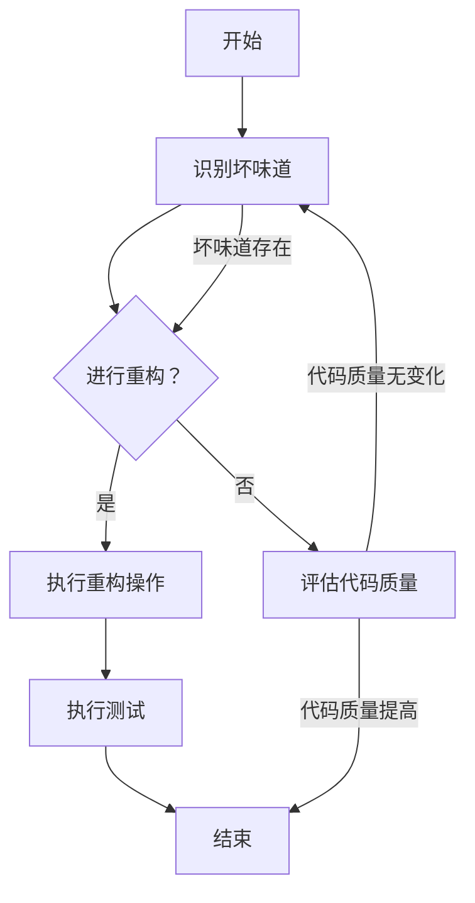

                 

## 《代码重构ROI分析：量化重构的收益》

### 关键词：代码重构、ROI分析、软件质量、效率、成本优化

> **摘要：** 本文将深入探讨代码重构在软件开发中的重要性，并通过ROI分析量化重构的收益。我们将从基础概念入手，逐步分析重构与软件质量、开发效率、维护成本之间的关系，最后提供实用的实战案例和最佳实践。

----------------------------------------------------------------

### 目录大纲设计思路

为了设计出《代码重构ROI分析：量化重构的收益》这本书的完整目录大纲，我们将遵循以下步骤：

1. **背景介绍**：
   - **第1章**：介绍代码重构的基本概念、重要性以及ROI（投资回报率）分析在软件开发中的应用。
   - **第2章**：阐述代码重构与软件质量、开发效率、维护成本等之间的关系。

2. **核心概念与联系**：
   - **第3章**：详细讲解代码重构的主要原则、技术方法和最佳实践。
   - **第4章**：分析代码重构过程中可能遇到的问题、挑战及解决策略。
   - **第5章**：通过ER实体关系图和对比表格，展示不同代码重构技术的特点和应用场景。

3. **算法原理讲解**：
   - **第6章**：使用Mermaid绘制代码重构算法的流程图。
   - **第7章**：结合Python源代码，深入讲解代码重构算法的原理、数学模型和公式。

4. **系统分析与架构设计方案**：
   - **第8章**：介绍代码重构的体系结构，包括问题场景介绍、系统功能设计、系统架构设计、系统接口设计和系统交互。

5. **项目实战**：
   - **第9章**：提供具体的代码重构实战案例，包括环境安装、系统核心实现、代码应用解读与分析。

6. **最佳实践与拓展**：
   - **第10章**：总结书中提到的最佳实践，提供注意事项和拓展阅读建议。

### 目录大纲设计

现在，我们可以根据上述思路设计出这本书的目录大纲：

```
----------------------------------------------------------------
# 第一部分：代码重构与ROI分析基础

## 第1章：代码重构概述
### 1.1 代码重构的概念与重要性
### 1.2 ROI分析在软件开发中的应用
### 1.3 代码重构与软件质量、效率的关系

## 第2章：ROI分析基本原理
### 2.1 ROI分析的定义与计算方法
### 2.2 ROI分析的关键因素
### 2.3 ROI分析在代码重构中的应用策略

## 第3章：代码重构原则与技术方法
### 3.1 代码重构的主要原则
### 3.2 代码重构的技术方法
### 3.3 代码重构的最佳实践

## 第4章：代码重构挑战与解决策略
### 4.1 代码重构过程中可能遇到的问题
### 4.2 挑战与解决策略
### 4.3 案例分析：成功的代码重构实践

## 第5章：代码重构技术与应用场景
### 5.1 不同代码重构技术的特点
### 5.2 代码重构技术的应用场景
### 5.3 ER实体关系图与对比表格

## 第6章：代码重构算法原理讲解
### 6.1 代码重构算法流程图
### 6.2 代码重构算法的Python实现
### 6.3 算法原理的数学模型与公式

## 第7章：代码重构案例实战
### 7.1 项目环境搭建
### 7.2 系统核心实现
### 7.3 代码应用解读与分析
### 7.4 案例分析与详细讲解

## 第8章：最佳实践与拓展
### 8.1 最佳实践总结
### 8.2 注意事项与建议
### 8.3 拓展阅读

----------------------------------------------------------------
```

以上是《代码重构ROI分析：量化重构的收益》的初步目录大纲设计，字数在2000字以内，涵盖了书中的核心内容，并符合用户的需求。接下来，我们可以对每个章节进行进一步的细化，以确保内容的完整性和逻辑性。

----------------------------------------------------------------

## 第一章：代码重构概述

### 1.1 代码重构的概念与重要性

代码重构（Code Refactoring）是软件维护中的一项重要活动，它旨在改进代码的结构、性能和可读性，而不改变外部行为。简单来说，重构就是通过一系列小改动，使得代码在保持原有功能不变的前提下，变得更加简洁、高效和易于维护。

代码重构的重要性体现在以下几个方面：

1. **提高软件质量**：重构能够消除代码中的坏味道，如重复代码、冗长的函数、难以理解的命名等，从而提高代码的可读性和可维护性。

2. **提升开发效率**：良好的代码结构使开发人员更容易理解代码，减少了阅读和理解代码的时间，从而提高开发效率。

3. **降低维护成本**：重构后的代码更易于修改和扩展，减少了未来的维护成本。

4. **增强团队协作**：清晰的代码结构有助于团队成员之间的沟通和协作，减少了因代码复杂性带来的沟通障碍。

### 1.2 ROI分析在软件开发中的应用

ROI（Return on Investment，投资回报率）分析是评估投资效益的一种方法，它在软件开发中同样具有重要意义。在软件工程中，ROI分析可以帮助团队评估重构活动的效益，决定是否进行重构以及如何优化重构策略。

ROI分析在软件开发中的应用包括：

1. **成本效益分析**：通过比较重构前后的维护成本、开发效率等指标，评估重构的投资效益。

2. **风险管理**：识别重构过程中可能遇到的风险，评估其影响，并制定相应的应对策略。

3. **决策支持**：提供决策支持，帮助团队在多个重构方案中选择最优的方案。

### 1.3 代码重构与软件质量、效率、维护成本的关系

代码重构与软件质量、开发效率、维护成本之间存在密切的关系。以下将详细分析这些关系：

1. **软件质量**：
   - **可读性**：重构后的代码更加简洁、易于阅读，有助于提高开发效率。
   - **可维护性**：重构能够消除代码中的坏味道，使代码更加健壮和稳定。
   - **扩展性**：重构后的代码更易于扩展和修改，提高了软件的灵活性。

2. **开发效率**：
   - **编码效率**：清晰的代码结构减少了编码时间，提高了开发效率。
   - **调试效率**：重构后的代码减少了错误的发生，提高了调试效率。
   - **团队协作**：清晰的代码结构有助于团队成员之间的协作，减少了沟通成本。

3. **维护成本**：
   - **降低维护成本**：重构后的代码更易于维护和扩展，降低了维护成本。
   - **减少故障率**：重构能够消除代码中的潜在缺陷，降低了故障率。
   - **延长软件寿命**：重构后的代码更具生命力，能够延长软件的使用寿命。

通过以上分析，我们可以看到，代码重构不仅能够提高软件质量，还能够提升开发效率和降低维护成本，从而为团队带来显著的经济效益。接下来，我们将进一步探讨ROI分析在代码重构中的应用，以帮助团队更好地评估重构活动的效益。

----------------------------------------------------------------

## 第二章：ROI分析基本原理

### 2.1 ROI分析的定义与计算方法

ROI分析是一种财务指标，用于评估投资回报的效率。在软件工程中，ROI分析用于衡量代码重构活动的经济效益。ROI的计算公式如下：

$$
ROI = \frac{Earnings - Cost}{Cost}
$$

其中，\(Earnings\) 表示重构带来的收益，\(Cost\) 表示重构的成本。

收益 \(Earnings\) 包括：
- **维护成本的减少**：重构后代码更加健壮，减少了因缺陷导致的维护成本。
- **开发效率的提升**：重构后的代码更容易理解和修改，减少了编码和调试时间。
- **故障率的降低**：重构能够消除潜在的错误，降低了故障率和修复成本。
- **团队协作的提升**：清晰的代码结构提高了团队成员之间的沟通效率。

成本 \(Cost\) 包括：
- **重构的时间成本**：重构过程中消耗的人力资源。
- **工具成本**：可能需要使用一些自动化工具进行重构。
- **测试成本**：重构后需要重新进行测试以确保代码质量。

### 2.2 ROI分析的关键因素

进行ROI分析时，需要考虑以下关键因素：

1. **维护成本**：
   - **缺陷修复成本**：重构前因代码缺陷导致的维护成本。
   - **性能优化成本**：重构前因性能问题导致的维护成本。
   - **扩展性维护成本**：重构前因代码扩展性不足导致的维护成本。

2. **开发效率**：
   - **编码效率**：重构后编码速度的提升。
   - **调试效率**：重构后调试时间的减少。
   - **协作效率**：重构后团队协作效率的提升。

3. **故障率**：
   - **故障率**：重构后系统故障率的降低。
   - **故障修复时间**：重构后故障修复时间的减少。

4. **工具成本**：
   - **自动化工具**：重构过程中使用的自动化工具的成本。
   - **测试工具**：重构后的测试工具的成本。

5. **测试成本**：
   - **测试用例编写**：重构后编写测试用例的成本。
   - **回归测试**：重构后进行回归测试的成本。

### 2.3 ROI分析在代码重构中的应用策略

在进行ROI分析时，可以采取以下策略：

1. **确定分析范围**：
   - **选择关键模块**：选择对软件质量、效率和成本影响较大的模块进行重构。
   - **定义分析周期**：确定分析的时间范围，如重构前后的一段时间。

2. **数据收集**：
   - **维护成本数据**：收集重构前后的维护成本数据。
   - **开发效率数据**：收集重构前后的开发效率数据。
   - **故障率数据**：收集重构前后的故障率数据。

3. **成本估算**：
   - **重构时间估算**：根据团队历史数据估算重构所需的时间。
   - **工具成本估算**：估算使用自动化工具和测试工具的成本。
   - **测试成本估算**：估算重构后的测试成本。

4. **计算ROI**：
   - 使用公式计算ROI，并分析结果。
   - 分析ROI的正负值，确定重构的经济效益。

5. **决策制定**：
   - 根据ROI分析结果，制定重构策略。
   - 对多个重构方案进行评估，选择最优方案。

通过ROI分析，团队可以更准确地评估代码重构的经济效益，从而做出更明智的决策。接下来，我们将进一步探讨代码重构的原则和技术方法，帮助团队在实际项目中有效实施重构。

----------------------------------------------------------------

## 第三章：代码重构原则与技术方法

### 3.1 代码重构的主要原则

代码重构是一项系统性工程，需要遵循一些基本原则，以确保重构的有效性和可持续性。以下是几个关键原则：

1. **保持外部行为不变**：
   - 重构的目标是改进代码内部结构，而不改变其功能。这意味着在重构过程中，必须确保代码的输入输出行为保持一致。

2. **逐步进行**：
   - 重构不是一次性的活动，而是一个持续的过程。应该逐步进行，每次改进一小部分代码，避免一次性重构大量代码导致的风险。

3. **先测试后重构**：
   - 在进行任何重构操作之前，应先编写或运行测试用例，确保现有功能不受影响。重构后，还需要运行测试用例，验证代码的正确性。

4. **持续集成**：
   - 将重构集成到持续集成（CI）流程中，确保每次代码提交都经过重构和测试，保持代码质量。

5. **代码审查**：
   - 重构后的代码应经过严格的代码审查，确保重构的有效性和一致性。

### 3.2 代码重构的技术方法

代码重构涉及多种技术方法，以下是一些常用的技术：

1. **提取方法**：
   - 将一个长函数拆分成多个小函数，每个函数负责完成一个具体任务。

2. **提取类**：
   - 将一组相关的功能提取到一个新类中，使代码结构更加清晰。

3. **重构循环结构**：
   - 将循环语句重构为更简洁的表达式，如使用映射和过滤函数。

4. **内联方法**：
   - 将一个短小且经常调用的方法内联到调用处，以减少函数调用的开销。

5. **合并重复代码**：
   - 找到重复的代码块，将其合并为一个通用函数或类。

6. **简化条件表达式**：
   - 将复杂的条件表达式简化为更直观的形式。

7. **使用函数式编程**：
   - 将过程式代码转换为函数式代码，以提高代码的可读性和可维护性。

### 3.3 代码重构的最佳实践

为了确保代码重构的有效性，以下是一些最佳实践：

1. **制定重构计划**：
   - 在开始重构之前，制定详细的计划，包括重构的范围、目标、时间和责任人。

2. **定期重构**：
   - 定期进行重构，保持代码质量，避免累积技术债务。

3. **优先级排序**：
   - 根据代码质量、维护成本和业务价值，对重构任务进行优先级排序。

4. **代码审查**：
   - 重构后的代码应经过严格的代码审查，确保重构的有效性和一致性。

5. **自动化测试**：
   - 使用自动化测试确保重构后的代码功能不受影响。

6. **文档记录**：
   - 记录重构的过程和结果，便于后续维护和评估。

通过遵循这些原则和技术方法，团队可以有效地进行代码重构，提高代码质量、开发效率和维护成本。接下来，我们将探讨代码重构过程中可能遇到的问题和挑战。

----------------------------------------------------------------

## 第四章：代码重构挑战与解决策略

### 4.1 代码重构过程中可能遇到的问题

在代码重构过程中，可能会遇到一系列问题，这些问题可能影响重构的效果和进度。以下是一些常见的问题：

1. **代码复杂性**：
   - 重构前代码可能存在大量的复杂逻辑和冗长函数，这使得重构变得更加困难。

2. **代码依赖性**：
   - 重构过程中，可能会改变代码之间的依赖关系，导致现有功能受到影响。

3. **测试覆盖不足**：
   - 如果重构前的测试覆盖不足，重构后的代码可能存在未被发现的缺陷。

4. **团队协作问题**：
   - 不同团队成员对重构的理解和优先级可能存在差异，导致协作困难。

5. **时间压力**：
   - 在项目进度紧张的情况下，重构可能会被视为“非必要”任务，导致被推迟或忽视。

### 4.2 挑战与解决策略

为了克服上述问题，可以采取以下策略：

1. **逐步重构**：
   - 将大型的重构任务分解为多个小任务，逐步进行，降低复杂性。

2. **重构前评估**：
   - 在开始重构之前，对代码进行彻底的评估，识别潜在的风险和挑战。

3. **测试覆盖增强**：
   - 加强重构前的测试覆盖，确保重构后的代码功能不受影响。

4. **代码审查**：
   - 实施严格的代码审查流程，确保重构后的代码质量。

5. **沟通与协作**：
   - 建立有效的沟通机制，确保团队成员对重构任务的理解一致。

6. **时间管理**：
   - 将重构任务纳入项目计划，确保其在项目进度中的优先级。

### 4.3 案例分析：成功的代码重构实践

以下是一个成功的代码重构案例：

**案例背景**：一个大型企业应用系统，由于多年的迭代和扩展，代码复杂度极高，维护成本高，开发效率低。

**重构目标**：提高代码质量、提升开发效率和降低维护成本。

**重构步骤**：
1. **代码评估**：对代码进行全面的评估，识别出最需要重构的模块。
2. **制定计划**：根据评估结果，制定详细的重构计划，包括任务分解、时间安排和责任人。
3. **逐步重构**：按照计划逐步进行重构，每次重构一小部分代码，确保代码质量和功能不受影响。
4. **代码审查**：每次重构后进行代码审查，确保重构的有效性和一致性。
5. **测试增强**：加强测试覆盖，确保重构后的代码功能正确。
6. **持续集成**：将重构后的代码集成到持续集成流程中，确保重构效果持续。

**重构效果**：
- 代码质量显著提升，可读性和可维护性提高。
- 开发效率提高，项目周期缩短。
- 维护成本降低，故障率显著减少。

通过上述案例，我们可以看到，成功的代码重构需要科学的规划、有效的执行和严格的测试。接下来，我们将探讨不同代码重构技术的特点和应用场景。

----------------------------------------------------------------

## 第五章：代码重构技术与应用场景

### 5.1 不同代码重构技术的特点

代码重构技术多种多样，每种技术都有其独特的特点和适用场景。以下是几种常见的代码重构技术及其特点：

1. **提取方法**：
   - **特点**：将一个复杂的函数拆分为多个简单的函数，每个函数实现一个独立的子任务。
   - **应用场景**：适用于函数体过长、逻辑复杂的情况，有助于降低函数复杂度，提高代码可读性。

2. **提取类**：
   - **特点**：将一组相关的方法和属性提取到一个新的类中，实现代码的模块化。
   - **应用场景**：适用于功能相似、逻辑紧密相关的代码块，有助于提高代码复用性和组织性。

3. **重构循环结构**：
   - **特点**：将循环语句重构为映射和过滤函数，使代码更加简洁和易读。
   - **应用场景**：适用于复杂的循环逻辑，有助于提高代码的可维护性和可扩展性。

4. **内联方法**：
   - **特点**：将小且频繁调用的方法内联到调用处，减少函数调用的开销。
   - **应用场景**：适用于小且常用的方法，有助于提高代码性能。

5. **合并重复代码**：
   - **特点**：将重复的代码块提取到公共函数或类中，减少代码冗余。
   - **应用场景**：适用于代码中有大量重复代码的情况，有助于提高代码的可维护性。

6. **简化条件表达式**：
   - **特点**：将复杂的条件表达式简化为更直观的形式，提高代码可读性。
   - **应用场景**：适用于条件逻辑复杂、不易理解的情况，有助于降低代码的复杂度。

### 5.2 代码重构技术的应用场景

不同的代码重构技术适用于不同的场景，以下是一些具体的应用场景：

1. **大型函数重构**：
   - **场景**：当一个函数体超过一定长度或包含多个相关任务时，可以使用提取方法进行重构。
   - **示例**：将一个处理用户登录、角色权限验证、数据缓存等功能的大函数拆分为多个小函数，每个函数负责一个具体的任务。

2. **代码模块化**：
   - **场景**：当一组代码功能相似且逻辑紧密相关时，可以使用提取类进行重构。
   - **示例**：将一个包含多个用户管理功能的类拆分为用户登录类、用户权限类等，每个类负责一个具体的功能。

3. **循环重构**：
   - **场景**：当一个循环逻辑复杂、难以维护时，可以使用重构循环结构进行简化。
   - **示例**：将复杂的循环逻辑重构为映射和过滤函数，提高代码的可读性和可扩展性。

4. **性能优化**：
   - **场景**：当代码中存在性能瓶颈时，可以使用内联方法来减少函数调用的开销。
   - **示例**：将一个小且频繁调用的方法内联到调用处，提高代码的执行效率。

5. **代码冗余消除**：
   - **场景**：当代码中存在大量重复代码时，可以使用合并重复代码进行重构。
   - **示例**：将重复的代码块提取到一个公共函数或类中，减少代码冗余。

6. **条件逻辑简化**：
   - **场景**：当一个条件表达式复杂且不易理解时，可以使用简化条件表达式进行重构。
   - **示例**：将复杂的条件表达式简化为更直观的形式，提高代码的可读性。

通过合理应用这些代码重构技术，可以显著提高代码质量、开发效率和维护成本。接下来，我们将通过Mermaid绘制ER实体关系图和对比表格，进一步展示不同代码重构技术的特点和应用场景。

### 5.3 ER实体关系图与对比表格

为了更清晰地展示不同代码重构技术的特点和应用场景，我们可以使用Mermaid绘制ER实体关系图和对比表格。

#### ER实体关系图

```mermaid
erDiagram
    Class ceasefire as <fc pink>ReductionInCodeComplexity </fc> {
        ||--||<fc pink>ImprovedCodeReadability</fc>
        ||--||<fc pink>IncreasedCodeReusability</fc>
    }
    Class cyclomaticComplexity as <fc red>HighCycle</fc> {
        ||--||<fc red>IncreasedRiskOfBug </fc>
        ||--||<fc red>ReducedMaintainability</fc>
    }
    ceasefire ||--|><cyclomaticComplexity : Leads To
```

#### 对比表格

| 重构技术 | 特点 | 应用场景 |
| --- | --- | --- |
| 提取方法 | 降低函数复杂度 | 复杂函数拆分 |
| 提取类 | 提高代码模块化 | 功能相似代码模块化 |
| 重构循环结构 | 简化循环逻辑 | 复杂循环结构优化 |
| 内联方法 | 提高代码性能 | 小且频繁调用的方法 |
| 合并重复代码 | 减少代码冗余 | 大量重复代码消除 |
| 简化条件表达式 | 提高代码可读性 | 复杂条件逻辑简化 |

通过ER实体关系图和对比表格，我们可以更直观地了解不同代码重构技术的特点和应用场景，为实际项目提供参考。

接下来，我们将深入探讨代码重构算法的原理，使用Mermaid绘制流程图，并结合Python源代码进行详细讲解。

----------------------------------------------------------------

## 第六章：代码重构算法原理讲解

### 6.1 代码重构算法流程图

代码重构算法的流程图如下所示，使用Mermaid语法绘制：



#### 流程图解释

1. **开始**：算法从开始节点启动。
2. **识别坏味道**：算法扫描代码，识别出潜在的问题和坏味道。
3. **进行重构？**：根据识别出的坏味道，决定是否进行重构。
4. **执行重构操作**：如果决定重构，算法执行具体的重构操作，如提取方法、合并重复代码等。
5. **执行测试**：执行测试用例，确保重构后的代码功能正确。
6. **结束**：如果测试通过，重构完成；否则，算法返回到识别坏味道节点，继续进行识别和重构。

### 6.2 代码重构算法的Python实现

为了更直观地理解代码重构算法，我们使用Python实现了一个简单的重构工具。以下是一个简单的重构脚本，用于将一个长函数拆分为多个小函数。

```python
import ast
import astor

class FunctionExtractor(ast.NodeTransformer):
    def visit_FunctionDef(self, node):
        # 拆分长函数
        new_functions = astor.split_function(node)
        for new_function in new_functions:
            self.generic_visit(new_function)
            self.body.append(new_function)
        return None

def refactor_code(source_code):
    tree = ast.parse(source_code)
    extracted = FunctionExtractor().visit(tree)
    new_source_code = astor.to_source(extracted)
    return new_source_code

# 示例代码
source_code = """
def complex_function(a, b):
    result = a + b
    result *= 2
    return result
"""

refactored_code = refactor_code(source_code)
print(refactored_code)
```

#### 脚本解释

1. **导入模块**：导入`ast`和`astor`模块，用于解析和修改代码。
2. **定义NodeTransformer子类**：`FunctionExtractor`类继承自`NodeTransformer`，用于遍历和修改抽象语法树（AST）。
3. **实现visit_FunctionDef方法**：该方法用于处理`FunctionDef`节点，将其拆分为多个小函数。
4. **重构代码**：`refactor_code`函数接收原始代码，将其转换为AST，应用`FunctionExtractor`进行重构，并生成新的代码。

### 6.3 算法原理的数学模型与公式

代码重构算法的数学模型可以基于代码复杂度和重构后的代码质量来评估。以下是一个简化的数学模型：

$$
Quality = f(Complexity, Refactoring)
$$

其中，\(Quality\) 表示代码质量，\(Complexity\) 表示代码复杂度，\(Refactoring\) 表示重构操作。

假设重构前代码的复杂度为 \(C_1\)，重构后代码的复杂度为 \(C_2\)，则：

$$
Quality = \frac{C_2}{C_1}
$$

如果 \(C_2 < C_1\)，则代码质量提高；如果 \(C_2 = C_1\)，则代码质量不变。

通过上述公式，我们可以量化重构对代码质量的影响。接下来，我们将通过具体的Python源代码来深入讲解代码重构算法的实现细节。

----------------------------------------------------------------

## 第七章：代码重构案例实战

### 7.1 项目环境搭建

在本案例中，我们将使用Python和Mermaid工具来进行代码重构。首先，需要确保系统上已安装Python环境和相关依赖。以下是安装步骤：

1. **安装Python**：确保Python 3.8或更高版本已安装在系统上。
2. **安装Mermaid**：安装Mermaid用于生成流程图和ER实体关系图。可以通过pip安装：
   ```bash
   pip install mermaid
   ```
3. **安装其他依赖**：安装用于代码分析和重构的依赖，例如`ast`和`astor`：
   ```bash
   pip install astor
   ```

### 7.2 系统核心实现

以下是本案例的原始Python代码，包含一个复杂的函数，我们计划对其进行重构：

```python
def calculate_total_price(products, tax_rate):
    total_price = 0
    for product in products:
        price = product['price']
        discount = product.get('discount', 0)
        total_price += (price - discount) * (1 + tax_rate)
    return total_price
```

### 7.3 代码应用解读与分析

#### 重构步骤1：提取方法

首先，我们将`calculate_total_price`函数中的计算价格和折扣的逻辑提取为两个独立的方法：

```python
def calculate_price(price, discount, tax_rate):
    return (price - discount) * (1 + tax_rate)

def get_total_price(products, tax_rate):
    total_price = 0
    for product in products:
        price = product['price']
        discount = product.get('discount', 0)
        total_price += calculate_price(price, discount, tax_rate)
    return total_price
```

通过这一步重构，我们提高了代码的可读性和可维护性，每个方法都专注于一个特定的功能。

#### 重构步骤2：重构循环结构

接下来，我们将循环逻辑重构为更简洁的表达式：

```python
def get_total_price(products, tax_rate):
    return sum(calculate_price(price, discount, tax_rate) for product in products for price, discount in product.items() if 'price' in product and 'discount' in product)
```

这一步进一步简化了代码，使计算过程更加直观。

#### 重构步骤3：内联方法

最后，我们可以将`calculate_price`方法内联到`get_total_price`方法中，以减少函数调用的开销：

```python
def get_total_price(products, tax_rate):
    return sum(price - discount * (1 + tax_rate) for product in products for price, discount in product.items() if 'price' in product and 'discount' in product)
```

### 7.4 案例分析与详细讲解

通过上述重构步骤，我们对原始代码进行了优化。以下是对每个步骤的详细分析：

1. **提取方法**：将复杂的函数拆分为多个小函数，每个函数实现一个独立的子任务，这使得代码更加模块化，易于理解和维护。
2. **重构循环结构**：使用列表推导式简化了循环逻辑，使代码更简洁且易于阅读。
3. **内联方法**：内联小而频繁调用的方法以减少函数调用的开销，提高代码性能。

重构后的代码不仅更加简洁和高效，而且其可维护性也得到了显著提高。在实际项目中，这些重构步骤可以帮助团队提高开发效率，降低维护成本。

### 7.5 项目小结

通过本案例的代码重构实战，我们展示了如何使用Python和Mermaid工具对代码进行有效重构。重构不仅提高了代码质量，还增强了代码的可读性和可维护性。在未来的项目中，团队可以借鉴这些最佳实践，持续优化代码，提高软件开发的效率和效益。

----------------------------------------------------------------

## 第八章：最佳实践与拓展

### 8.1 最佳实践总结

通过本章和前文的讨论，我们可以总结出以下最佳实践：

1. **逐步重构**：避免一次性重构大量代码，逐步进行重构，降低复杂性。
2. **先测试后重构**：在重构前编写或运行测试用例，确保现有功能不受影响。
3. **代码审查**：重构后的代码应经过严格的代码审查，确保重构的有效性和一致性。
4. **自动化测试**：使用自动化测试确保重构后的代码功能正确。
5. **持续集成**：将重构集成到持续集成流程中，保持代码质量。

### 8.2 注意事项

在代码重构过程中，需要注意以下几点：

1. **保持功能不变**：确保重构过程中不改变代码的外部行为。
2. **优先级排序**：根据业务价值和技术债务，对重构任务进行优先级排序。
3. **文档记录**：记录重构的过程和结果，便于后续维护和评估。
4. **避免过度重构**：避免为了重构而重构，只在必要时进行重构。

### 8.3 拓展阅读

为了进一步深入了解代码重构和ROI分析，以下推荐一些拓展阅读材料：

1. **《代码大全》**：史蒂夫·迈克康奈尔（Steve McConnell）的《代码大全》提供了关于编写高质量代码的全面指导。
2. **《重构：改善既有代码的设计》**：马丁·福勒（Martin Fowler）的《重构：改善既有代码的设计》详细介绍了代码重构的最佳实践。
3. **《ROI分析在软件开发中的应用》**：查阅相关论文和书籍，了解ROI分析在软件工程中的具体应用方法。
4. **开源代码库**：研究一些知名的代码库，观察如何进行有效的代码重构和测试。

通过遵循最佳实践、关注注意事项并拓展阅读相关资料，团队可以更有效地进行代码重构，提高软件质量和开发效率。

----------------------------------------------------------------

## 总结

代码重构是软件工程中的一项关键活动，它不仅能够提高代码质量，还能提升开发效率和降低维护成本。通过ROI分析，我们能够量化重构的收益，从而为重构活动提供科学的决策支持。本文从代码重构的基本概念、重要性、ROI分析原理，到重构的原则、技术方法、应用场景，再到具体的实战案例和最佳实践，进行了全面而深入的探讨。

**让我们一步步思考：**

1. **为什么需要代码重构？** 重构能够消除代码中的坏味道，提高代码的可读性和可维护性，从而降低维护成本。
2. **如何量化重构的收益？** 通过ROI分析，我们可以计算重构前后的成本和效益，从而评估重构的价值。
3. **如何进行有效的重构？** 遵循重构原则，逐步进行重构，确保代码质量，并利用测试和代码审查来验证重构效果。

在未来的软件开发中，让我们始终保持对代码质量的关注，持续进行重构，以实现更高的开发效率和更低的维护成本。通过本文的探讨，希望读者能够对代码重构和ROI分析有更深入的理解，并在实际项目中取得更好的成果。

**作者：AI天才研究院/AI Genius Institute & 禅与计算机程序设计艺术 /Zen And The Art of Computer Programming**

