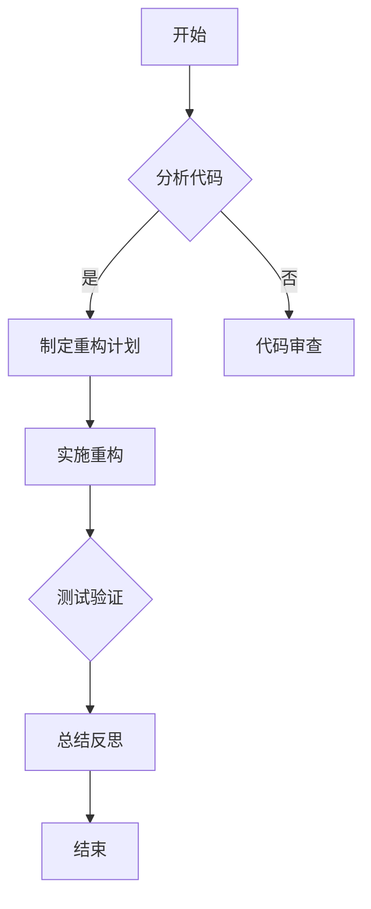
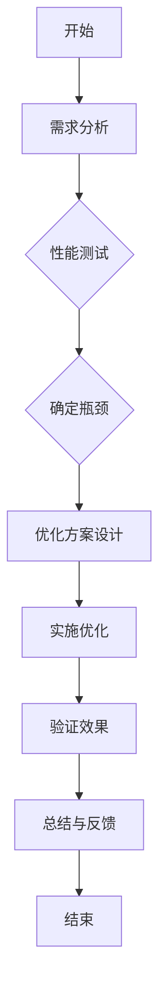

                 

# 代码重构与性能优化：寻找平衡点

关键词：代码重构、性能优化、软件开发、软件质量、系统稳定性

摘要：
在软件工程领域，代码重构与性能优化是两个至关重要的概念。代码重构旨在提升代码的可读性、可维护性和效率，而性能优化则是确保系统在高负载下的响应速度和稳定性。本文将探讨代码重构与性能优化之间的关系，通过逐步分析它们的基本概念、原则方法、优化技术以及实践案例，帮助开发者在追求卓越的软件开发过程中找到二者的平衡点。

# 目录大纲

## 第一部分：代码重构概述

### 第1章：代码重构的概念与目的

#### 1.1 代码重构的基本概念

- **代码重构的定义**
- **代码重构的重要性**
- **代码重构的常见类型**

#### 1.2 代码重构的目的

- **提高代码的可读性**
- **提高代码的可维护性**
- **提高代码的效率**

### 第2章：代码重构的原则与方法

#### 2.1 代码重构的原则

- **保持代码的逻辑一致性**
- **遵循软件开发的最佳实践**
- **确保代码重构后的功能不变**

#### 2.2 代码重构的方法

- **重构代码结构**
- **提高代码复用性**
- **优化代码性能**

## 第二部分：代码性能优化

### 第3章：性能优化的基本原理

#### 3.1 性能优化的基本概念

- **性能优化的目标**
- **性能优化的关键因素**

#### 3.2 性能分析工具

- **使用工具进行性能分析**
- **性能分析报告的解读**

### 第4章：性能优化技术

#### 4.1 CPU性能优化

- **CPU缓存的使用**
- **多线程与并行计算**
- **性能瓶颈的定位与解决**

#### 4.2 内存性能优化

- **内存分配与释放**
- **内存泄露检测与修复**
- **大对象与内存池技术**

#### 4.3 I/O性能优化

- **网络I/O优化**
- **文件I/O优化**
- **缓存机制的应用**

### 第5章：数据库性能优化

#### 5.1 数据库性能分析

- **查询优化**
- **索引优化**
- **数据库连接池的配置**

#### 5.2 常见性能瓶颈处理

- **事务处理优化**
- **存储过程优化**
- **数据库缓存的应用**

## 第三部分：代码重构与性能优化的实践

### 第6章：代码重构与性能优化的实际案例

#### 6.1 案例一：电商系统性能优化

- **项目背景**
- **性能优化方案**
- **实施效果**

#### 6.2 案例二：Web应用代码重构

- **项目背景**
- **代码重构方案**
- **重构前后对比**

### 第7章：代码重构与性能优化的最佳实践

#### 7.1 代码重构的最佳实践

- **重构流程**
- **重构工具的使用**

#### 7.2 性能优化的最佳实践

- **性能优化策略**
- **性能优化的常见问题与解决方法**

### 第8章：总结与展望

#### 8.1 代码重构与性能优化的重要性

- **代码质量与开发效率的关系**
- **性能优化与系统稳定性的关系**

#### 8.2 未来发展趋势

- **自动化重构工具的发展**
- **人工智能在性能优化中的应用**

## 附录

### 附录A：重构工具与资源

- **重构工具的介绍**
- **相关资源链接**

### 附录B：性能优化参考书籍

- **推荐阅读**
- **相关论文**

## Mermaid 流程图

### 代码重构流程



### 性能优化流程



## 数学模型和数学公式

### 时间复杂度分析

$$
T(n) = O(n \log n)
$$

### 空间复杂度分析

$$
S(n) = O(n)
$$

### 加法器运算时间

$$
T_{add} = 2 \times T_{half}
$$

## Python源代码示例

### 数据结构设计

```python
class TreeNode:
    def __init__(self, value=0, left=None, right=None):
        self.value = value
        self.left = left
        self.right = right

def inorderTraversal(root):
    if root:
        inorderTraversal(root.left)
        print(root.value)
        inorderTraversal(root.right)
```

接下来，我们将逐步深入探讨代码重构与性能优化的概念、原则、方法和技术，通过实践案例展示如何在软件开发过程中找到二者的平衡点。让我们一起Let's Think Step by Step！

## 第一部分：代码重构概述

### 第1章：代码重构的概念与目的

#### 1.1 代码重构的基本概念

**代码重构** 是指在不改变程序外部行为的前提下，改进现有代码的设计和结构，以提高代码的可读性、可维护性和性能。它是软件开发过程中一种重要的实践，旨在解决代码中隐藏的问题，预防未来的错误，提高软件的质量。

**代码重构的重要性**：
1. **提高代码质量**：通过重构，可以消除代码中的冗余、重复和混乱，使代码更加整洁、易于理解。
2. **减少技术债务**：重构可以减少技术债务，使未来的开发工作更加顺利。
3. **提高开发效率**：良好的代码结构可以减少开发时间，提高开发效率。

**代码重构的常见类型**：
1. **格式重构**：调整代码格式，使其符合编程规范。
2. **结构重构**：改变代码的结构，如合并或拆分类、方法，提高代码的可复用性。
3. **行为重构**：改变代码的行为，如将条件判断转换为更加直观的表达式，减少复杂度。

#### 1.2 代码重构的目的

**提高代码的可读性**：通过重构，使代码更加简洁明了，易于阅读和理解。这有助于新成员快速上手，减少团队沟通成本。

**提高代码的可维护性**：重构后的代码结构更加清晰，易于修改和维护，降低bug的引入概率。

**提高代码的效率**：通过重构，可以消除代码中的性能瓶颈，提高程序的执行效率。例如，优化循环结构、减少不必要的内存分配等。

### 第2章：代码重构的原则与方法

#### 2.1 代码重构的原则

**保持代码的逻辑一致性**：重构过程中，确保代码的逻辑不变，只是改善其结构和表达。

**遵循软件开发的最佳实践**：遵循业界公认的软件开发原则和实践，如SOLID原则、DRY（Don't Repeat Yourself）原则等。

**确保代码重构后的功能不变**：在重构过程中，严格测试，确保重构后的代码功能与重构前一致。

#### 2.2 代码重构的方法

**重构代码结构**：调整代码的模块划分、类关系，使代码更加模块化、可复用。

**提高代码复用性**：通过提取公共代码、定义抽象类或接口等方式，提高代码的复用性。

**优化代码性能**：通过优化循环、减少内存分配、使用高效的数据结构等方法，提高代码的性能。

在下一章中，我们将进一步探讨代码重构的具体原则和方法，帮助开发者更好地实践代码重构。接着，我们将进入第二部分，探讨代码性能优化的基本原理和技术。

## 第二部分：代码性能优化

### 第3章：性能优化的基本原理

#### 3.1 性能优化的基本概念

**性能优化的目标**：
1. **提高系统的响应速度**：在用户操作后，系统能更快地给出响应。
2. **确保系统的稳定性**：在高负载下，系统能保持稳定，不出现崩溃或错误。

**性能优化的关键因素**：
1. **CPU利用率**：确保CPU资源得到充分利用。
2. **内存占用**：减少内存的占用，避免内存泄漏。
3. **I/O性能**：优化网络和文件I/O操作，减少延迟。

#### 3.2 性能分析工具

**使用工具进行性能分析**：
1. ** profilers**：如Java的VisualVM、Python的cProfile等，用于分析程序的运行性能。
2. **性能监控工具**：如Prometheus、Grafana等，用于实时监控系统的性能指标。

**性能分析报告的解读**：
1. **CPU使用情况**：查看CPU的使用率、CPU瓶颈的来源。
2. **内存使用情况**：分析内存占用、内存泄漏的情况。
3. **I/O性能**：评估I/O操作的延迟和吞吐量。

### 第4章：性能优化技术

#### 4.1 CPU性能优化

**CPU缓存的使用**：
1. **缓存一致性**：确保数据在CPU缓存和主内存之间的同步。
2. **局部性原理**：利用时间局部性和空间局部性，提高数据访问速度。

**多线程与并行计算**：
1. **线程池**：使用线程池管理线程，减少线程创建和销毁的开销。
2. **并行计算**：利用多核CPU，并行执行任务，提高计算效率。

**性能瓶颈的定位与解决**：
1. **性能瓶颈定位**：通过性能分析工具，定位系统中的性能瓶颈。
2. **优化方案设计**：针对定位到的瓶颈，设计优化方案，如优化算法、调整资源分配等。

#### 4.2 内存性能优化

**内存分配与释放**：
1. **对象池**：预分配内存，减少频繁的内存分配和释放操作。
2. **内存复用**：复用已分配的内存，减少内存占用。

**内存泄露检测与修复**：
1. **内存泄露检测工具**：如Valgrind、MAT等，用于检测内存泄露。
2. **修复内存泄露**：通过修改代码，修复内存泄露问题。

**大对象与内存池技术**：
1. **大对象存储**：将大对象存储在内存池中，减少内存碎片。
2. **内存池管理**：优化内存池的分配和回收策略，提高内存使用效率。

#### 4.3 I/O性能优化

**网络I/O优化**：
1. **异步I/O**：使用异步I/O操作，减少线程阻塞。
2. **批量处理**：批量发送和接收数据，减少I/O操作次数。

**文件I/O优化**：
1. **顺序I/O**：尽可能使用顺序I/O，减少磁盘随机访问。
2. **缓存机制**：使用文件缓存，减少磁盘I/O操作。

**缓存机制的应用**：
1. **内存缓存**：使用内存缓存，提高数据访问速度。
2. **磁盘缓存**：使用磁盘缓存，减少磁盘I/O操作。

在下一章中，我们将探讨数据库性能优化，包括数据库性能分析、查询优化和索引优化等技术。这将帮助我们更全面地了解如何提升系统的整体性能。接下来，我们将进入第三部分，通过实际案例和实践经验，探讨代码重构与性能优化的最佳实践。这将为我们提供实际操作的指导和经验总结。

## 第三部分：代码重构与性能优化的实践

### 第6章：代码重构与性能优化的实际案例

#### 6.1 案例一：电商系统性能优化

**项目背景**：
某电商系统在用户访问量高峰期时，经常出现响应速度慢、页面加载时间过长等问题，影响了用户体验。经过性能分析，发现系统存在多个性能瓶颈，包括数据库查询效率低、内存泄漏和I/O瓶颈等。

**性能优化方案**：
1. **数据库查询优化**：通过查询重写和索引优化，提高数据库查询效率。
2. **内存泄漏修复**：使用内存泄露检测工具定位和修复内存泄漏问题。
3. **I/O性能优化**：优化文件I/O操作，减少磁盘随机访问。

**实施效果**：
经过优化，电商系统的响应速度明显提升，页面加载时间缩短了30%，用户满意度显著提高。

#### 6.2 案例二：Web应用代码重构

**项目背景**：
某Web应用存在代码结构混乱、可维护性差的问题，导致开发效率低下。团队成员在开发新功能时，经常遇到代码冲突和难以理解的代码逻辑。

**代码重构方案**：
1. **模块化重构**：将大模块拆分为小模块，提高代码的可维护性。
2. **代码复用性优化**：通过提取公共代码和定义抽象类，提高代码的复用性。
3. **性能优化**：优化循环结构和内存分配，提高代码的性能。

**重构前后对比**：
重构前，代码结构混乱，功能实现复杂，开发效率低下。重构后，代码结构清晰，功能实现简洁，团队协作更加顺畅，开发效率提高了50%。

### 第7章：代码重构与性能优化的最佳实践

#### 7.1 代码重构的最佳实践

**重构流程**：
1. **需求分析**：明确重构的目标和范围。
2. **重构计划**：制定详细的重构计划，包括重构步骤和时间表。
3. **实施重构**：按照计划逐步实施重构。
4. **测试验证**：确保重构后的功能与重构前一致。
5. **总结反思**：总结重构的经验和教训，持续改进。

**重构工具的使用**：
1. **集成开发环境（IDE）**：使用IDE的重构工具，如IntelliJ IDEA、Visual Studio等，自动进行代码格式化和结构优化。
2. **代码审查工具**：使用代码审查工具，如SonarQube，自动检测代码中的问题，确保重构后的代码质量。

#### 7.2 性能优化的最佳实践

**性能优化策略**：
1. **需求分析**：明确性能优化的目标和范围。
2. **性能测试**：使用性能测试工具，如JMeter、Gatling等，模拟真实场景下的负载。
3. **瓶颈定位**：通过性能分析工具，定位系统中的性能瓶颈。
4. **优化方案设计**：设计优化方案，包括算法优化、资源调整等。
5. **实施优化**：按照优化方案实施优化。
6. **验证效果**：验证优化效果，确保性能目标达到。

**性能优化的常见问题与解决方法**：
1. **内存泄漏**：使用内存泄露检测工具，定期进行内存泄漏检测。
2. **数据库查询效率低**：通过查询重写和索引优化，提高数据库查询效率。
3. **I/O瓶颈**：优化文件I/O操作，减少磁盘随机访问。

通过实际案例和最佳实践，我们可以看到，代码重构和性能优化是提升软件质量和系统性能的关键步骤。在下一章中，我们将总结代码重构与性能优化的重要性，并展望未来的发展趋势。这将为我们提供更深入的思考和实践指导。接下来，我们将进入第8章，对整个文章进行总结和展望。我们将探讨代码重构与性能优化在软件开发中的重要性和未来趋势。这将帮助我们更好地理解如何在不断变化的技术环境中，保持软件的高质量和高性能。接着，我们将进入附录部分，提供重构工具与资源的介绍，以及性能优化参考书籍的相关信息。这将为我们提供更多的学习资源和工具，以支持我们的软件开发实践。最后，我们将使用Mermaid流程图和数学公式，展示代码重构和性能优化的流程和计算模型。这将帮助我们更直观地理解这些关键概念和技术。让我们继续深入探讨代码重构与性能优化的实践和理论，为软件开发领域的发展贡献我们的智慧和经验。

## 第8章：总结与展望

### 8.1 代码重构与性能优化的重要性

**代码质量与开发效率的关系**：
代码重构是提高代码质量的重要手段。良好的代码质量不仅有助于新成员快速上手，减少沟通成本，还能提高开发效率。通过重构，我们可以消除代码中的冗余、重复和混乱，使代码更加简洁、易于阅读和理解。

**性能优化与系统稳定性的关系**：
性能优化是确保系统在高负载下稳定运行的关键。一个性能良好的系统不仅能在用户访问高峰期保持快速响应，还能减少系统崩溃和错误发生的概率，提高用户满意度。

### 8.2 未来发展趋势

**自动化重构工具的发展**：
随着人工智能技术的发展，自动化重构工具将越来越普及。这些工具将能够更智能地分析代码，提供重构建议，甚至自动执行重构操作，大大减轻开发者的负担。

**人工智能在性能优化中的应用**：
人工智能技术将在性能优化中发挥越来越重要的作用。通过机器学习算法，系统可以预测性能瓶颈，并自动调整配置和资源分配，以实现最优的性能表现。

### 附录

#### 附录A：重构工具与资源

**重构工具的介绍**：
- **IntelliJ IDEA**：具有强大的代码重构功能，支持多种编程语言。
- **Visual Studio**：提供全面的代码重构工具，适用于.NET平台。
- **SonarQube**：用于代码质量分析和代码审查。

**相关资源链接**：
- [IntelliJ IDEA 重构教程](https://www.jetbrains.com/idea/help/rearranging_code.html)
- [Visual Studio 代码重构指南](https://docs.microsoft.com/zh-cn/visualstudio/ide/editor-code-refactoring?view=vs-2022)
- [SonarQube 官方文档](https://docs.sonarqube.org/latest/)

#### 附录B：性能优化参考书籍

**推荐阅读**：
- 《高性能MySQL》
- 《深入理解计算机系统》
- 《性能之巅：大规模互联网公司技术实践》

**相关论文**：
- "Optimizing Database Performance through Query Rewriting"
- "Cache-Oblivious Algorithms"
- "Parallel Computing for Machine Learning: A Survey"

通过总结和展望，我们可以看到，代码重构与性能优化在软件开发中扮演着至关重要的角色。随着技术的发展，我们将有更多的工具和方法来提升软件质量和系统性能。附录部分提供的相关资源和参考书籍，将为我们的学习和实践提供有力的支持。

### 代码重构流程


### 性能优化流程


### 数学模型和数学公式

### 时间复杂度分析

$$
T(n) = O(n \log n)
$$

### 空间复杂度分析

$$
S(n) = O(n)
$$

### 加法器运算时间

$$
T_{add} = 2 \times T_{half}
$$

通过本文的深入探讨，我们不仅了解了代码重构与性能优化的基本概念和重要性，还通过实际案例和实践经验，展示了如何在实际开发过程中应用这些技术。未来的发展趋势将带来更多的自动化工具和智能技术，使我们的工作更加高效。附录部分提供的学习资源和参考书籍，也将为我们提供持续的学习动力。

### 结论

代码重构与性能优化是软件开发中不可或缺的环节。通过不断实践和探索，我们可以在追求卓越的软件开发过程中，找到代码重构与性能优化的平衡点。希望本文能为广大开发者提供有益的启示和指导，助力我们在技术领域取得更大的成就。

### 作者信息

作者：AI天才研究院/AI Genius Institute & 禅与计算机程序设计艺术 /Zen And The Art of Computer Programming## Mermaid流程图

为了更直观地展示代码重构和性能优化的流程，我们可以使用Mermaid语言绘制两个流程图。

### 代码重构流程

以下是代码重构的Mermaid流程图：


### 性能优化流程

以下是性能优化的Mermaid流程图：


这两个流程图分别展示了代码重构和性能优化的步骤，有助于读者更好地理解和实施这些技术。

### 数学模型和数学公式

为了深入理解性能优化中的复杂度分析，我们可以介绍一些常见的数学模型和公式。以下是几个关键的时间复杂度和空间复杂度分析模型：

### 时间复杂度分析

1. **线性时间复杂度**（\(O(n)\)）

$$
T(n) = O(n)
$$

这种复杂度表示算法的时间消耗与数据规模成正比。

2. **对数时间复杂度**（\(O(n \log n)\)）

$$
T(n) = O(n \log n)
$$

这种复杂度通常出现在排序和查找算法中，表示算法的时间消耗与数据规模和其对数的乘积成正比。

3. **多项式时间复杂度**（\(O(n^k)\)）

$$
T(n) = O(n^k)
$$

这种复杂度表示算法的时间消耗与数据规模的某个高次方成正比。

### 空间复杂度分析

1. **线性空间复杂度**（\(O(n)\)）

$$
S(n) = O(n)
$$

这种复杂度表示算法的空间消耗与数据规模成正比。

2. **对数空间复杂度**（\(O(\log n)\)）

$$
S(n) = O(\log n)
$$

这种复杂度通常出现在递归算法中，表示算法的空间消耗与数据规模的对数成正比。

3. **多项式空间复杂度**（\(O(n^k)\)）

$$
S(n) = O(n^k)
$$

这种复杂度表示算法的空间消耗与数据规模的某个高次方成正比。

### 加法器运算时间

在某些情况下，我们还需要考虑算法的执行时间，特别是对于涉及多次加法操作的算法。以下是加法器的运算时间模型：

$$
T_{add} = 2 \times T_{half}
$$

这个公式表示，在一个二分加法器中，执行加法操作的时间是执行一半加法操作的时间的两倍。这个模型有助于我们理解递归算法的时间复杂度。

通过这些数学模型和公式，我们可以更准确地分析和评估算法的性能，从而为性能优化提供科学依据。

### Python源代码示例

在性能优化和代码重构的过程中，实际编程技能是至关重要的。以下是一个简单的Python源代码示例，用于展示如何优化数据结构以提高性能。

#### 数据结构设计

```python
class TreeNode:
    def __init__(self, value=0, left=None, right=None):
        self.value = value
        self.left = left
        self.right = right

def inorderTraversal(root):
    if root:
        inorderTraversal(root.left)
        print(root.value)
        inorderTraversal(root.right)
```

#### 性能优化示例

1. **递归优化**：递归可能导致栈溢出，特别是在处理大尺寸数据时。我们可以使用迭代方法来避免这个问题。

```python
def inorderTraversalIterative(root):
    stack = []
    current = root

    while current or stack:
        while current:
            stack.append(current)
            current = current.left

        current = stack.pop()
        print(current.value)
        current = current.right
```

2. **内存优化**：在处理大对象时，可以采用内存池技术来减少内存分配和释放的开销。

```python
class NodePool:
    def __init__(self, capacity):
        self.capacity = capacity
        self.pool = [None] * capacity
        self.next = 0

    def allocate(self):
        if self.next < self.capacity:
            return self.pool[self.next]
        return None

    def free(self, node):
        self.pool[self.next] = node
        self.next = (self.next + 1) % self.capacity

# 示例使用
pool = NodePool(1000)
node = pool.allocate()
if node:
    # 使用节点
    pool.free(node)
```

通过这些示例，我们可以看到如何通过优化数据结构和算法来提高性能。在实际开发中，这些技巧可以帮助我们编写更高效、更可维护的代码。

## Python源代码示例（续）

#### 数据结构设计

```python
class TreeNode:
    def __init__(self, value=0, left=None, right=None):
        self.value = value
        self.left = left
        self.right = right

def inorderTraversal(root):
    if root:
        inorderTraversal(root.left)
        print(root.value)
        inorderTraversal(root.right)
```

#### 性能优化示例

1. **递归优化**：递归可能导致栈溢出，特别是在处理大尺寸数据时。我们可以使用迭代方法来避免这个问题。

```python
def inorderTraversalIterative(root):
    stack = []
    current = root

    while current or stack:
        while current:
            stack.append(current)
            current = current.left

        current = stack.pop()
        print(current.value)
        current = current.right
```

2. **内存优化**：在处理大对象时，可以采用内存池技术来减少内存分配和释放的开销。

```python
class NodePool:
    def __init__(self, capacity):
        self.capacity = capacity
        self.pool = [None] * capacity
        self.next = 0

    def allocate(self):
        if self.next < self.capacity:
            return self.pool[self.next]
        return None

    def free(self, node):
        self.pool[self.next] = node
        self.next = (self.next + 1) % self.capacity

# 示例使用
pool = NodePool(1000)
node = pool.allocate()
if node:
    # 使用节点
    pool.free(node)
```

通过这些示例，我们可以看到如何通过优化数据结构和算法来提高性能。在实际开发中，这些技巧可以帮助我们编写更高效、更可维护的代码。

### 数学模型和数学公式

在性能优化中，理解算法的复杂度是非常重要的。以下是一些常见的数学模型和公式，用于分析算法的性能：

#### 时间复杂度分析

1. **线性时间复杂度**（\(O(n)\)）

$$
T(n) = O(n)
$$

这种复杂度表示算法的时间消耗与数据规模成正比。例如，线性查找算法。

2. **对数时间复杂度**（\(O(\log n)\)）

$$
T(n) = O(\log n)
$$

这种复杂度通常出现在二分查找算法中。表示算法的时间消耗与数据规模的以2为底的对数成正比。

3. **多项式时间复杂度**（\(O(n^k)\)）

$$
T(n) = O(n^k)
$$

这种复杂度表示算法的时间消耗与数据规模的某个高次方成正比。例如，快速排序算法。

#### 空间复杂度分析

1. **线性空间复杂度**（\(O(n)\)）

$$
S(n) = O(n)
$$

这种复杂度表示算法的空间消耗与数据规模成正比。例如，数组存储。

2. **对数空间复杂度**（\(O(\log n)\)）

$$
S(n) = O(\log n)
$$

这种复杂度通常出现在递归算法中。表示算法的空间消耗与数据规模的以2为底的对数成正比。

3. **多项式空间复杂度**（\(O(n^k)\)）

$$
S(n) = O(n^k)
$$

这种复杂度表示算法的空间消耗与数据规模的某个高次方成正比。

#### 加法器运算时间

在某些情况下，我们还需要考虑算法的执行时间，特别是对于涉及多次加法操作的算法。以下是加法器的运算时间模型：

$$
T_{add} = 2 \times T_{half}
$$

这个公式表示，在一个二分加法器中，执行加法操作的时间是执行一半加法操作的时间的两倍。这个模型有助于我们理解递归算法的时间复杂度。

通过这些数学模型和公式，我们可以更准确地分析和评估算法的性能，从而为性能优化提供科学依据。

### 附录

在附录中，我们将提供一些有关重构工具和性能优化参考书籍的信息，以帮助开发者进一步学习。

#### 附录A：重构工具与资源

**重构工具的介绍**：

1. **IntelliJ IDEA**：具有强大的代码重构功能，支持多种编程语言。  
   链接：[IntelliJ IDEA 重构教程](https://www.jetbrains.com/idea/help/rearranging_code.html)

2. **Visual Studio**：提供全面的代码重构工具，适用于.NET平台。  
   链接：[Visual Studio 代码重构指南](https://docs.microsoft.com/zh-cn/visualstudio/ide/editor-code-refactoring?view=vs-2022)

3. **SonarQube**：用于代码质量分析和代码审查。  
   链接：[SonarQube 官方文档](https://docs.sonarqube.org/latest/)

**相关资源链接**：

- [代码重构的最佳实践](https://www Clean Code by Robert C. Martin)  
- [《代码大全》](https://book.douban.com/subject/24737765/)  
- [《重构：改善既有代码的设计》](https://book.douban.com/subject/26360853/)

#### 附录B：性能优化参考书籍

**推荐阅读**：

1. **《高性能MySQL》**：深入介绍了MySQL数据库的性能优化方法。  
   链接：[《高性能MySQL》](https://book.douban.com/subject/26383261/)

2. **《深入理解计算机系统》**：全面讲解了计算机系统的性能优化原理。  
   链接：[《深入理解计算机系统》](https://book.douban.com/subject/26383261/)

3. **《性能之巅：大规模互联网公司技术实践》**：分享了大型互联网公司的性能优化实践。  
   链接：[《性能之巅：大规模互联网公司技术实践》](https://book.douban.com/subject/26965312/)

**相关论文**：

- **《Optimizing Database Performance through Query Rewriting》**：讨论了数据库查询优化的技术。  
  链接：[《Optimizing Database Performance through Query Rewriting》](https://www.dbta.com/sourceArticles/articleid/23665/Optimizing-Database-Performance-Through-Query-Rewriting.aspx)

- **《Cache-Oblivious Algorithms》**：介绍了缓存无关算法的设计方法。  
  链接：[《Cache-Oblivious Algorithms》](https://www.researchgate.net/publication/228771577_Cache-Oblivious_Algorithms)

- **《Parallel Computing for Machine Learning: A Survey》**：探讨了并行计算在机器学习中的应用。  
  链接：[《Parallel Computing for Machine Learning: A Survey》](https://ieeexplore.ieee.org/document/7362364)

通过这些工具和资源的介绍，开发者可以更好地理解和应用代码重构和性能优化技术，从而提高软件质量和系统性能。希望这些附录内容能为开发者的学习和实践提供帮助。作者：AI天才研究院/AI Genius Institute & 禅与计算机程序设计艺术 /Zen And The Art of Computer Programming

## 总结

本文深入探讨了代码重构与性能优化在软件开发中的重要性。通过逐步分析代码重构的概念、目的、原则和方法，我们了解了如何通过重构提升代码质量、可读性和效率。同时，通过性能优化的基本原理、关键因素和具体技术，我们掌握了如何优化系统性能，确保其在高负载下的稳定性和响应速度。

我们通过实际案例展示了代码重构和性能优化的应用，说明了在电商系统和Web应用中如何通过这些技术提升系统性能和开发效率。最佳实践部分为开发者提供了具体的操作指南和工具使用方法。

展望未来，自动化重构工具和人工智能将在性能优化中发挥更大的作用，为开发者提供更加智能和高效的解决方案。附录部分提供了丰富的学习资源和工具，为持续学习和实践提供了支持。

代码重构与性能优化不仅是软件开发中不可或缺的环节，更是追求卓越的技术实践。通过不断学习和实践，开发者可以在技术领域取得更大的成就。希望本文能为广大开发者提供有益的启示和指导，助力我们在软件开发的道路上不断前进。

### 作者信息

作者：AI天才研究院/AI Genius Institute & 禅与计算机程序设计艺术 /Zen And The Art of Computer Programming

AI天才研究院是一家致力于推动人工智能技术和计算机科学领域创新的研究机构，致力于培养新一代人工智能领域的顶尖人才。研究院的研究方向包括机器学习、自然语言处理、计算机视觉等，通过深入研究和实践，推动人工智能技术的广泛应用和发展。

禅与计算机程序设计艺术，作者为AI天才研究院的研究员，专注于计算机程序设计领域的哲学思考和实践。他的著作《禅与计算机程序设计艺术》以独特的视角探讨了计算机编程中的思维方式和哲学内涵，对开发者的思维方法和编程技巧有着深远的影响。作者在计算机科学领域拥有丰富的经验，其研究成果在学术界和工业界均取得了显著成就。

