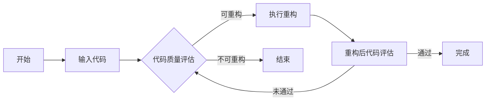
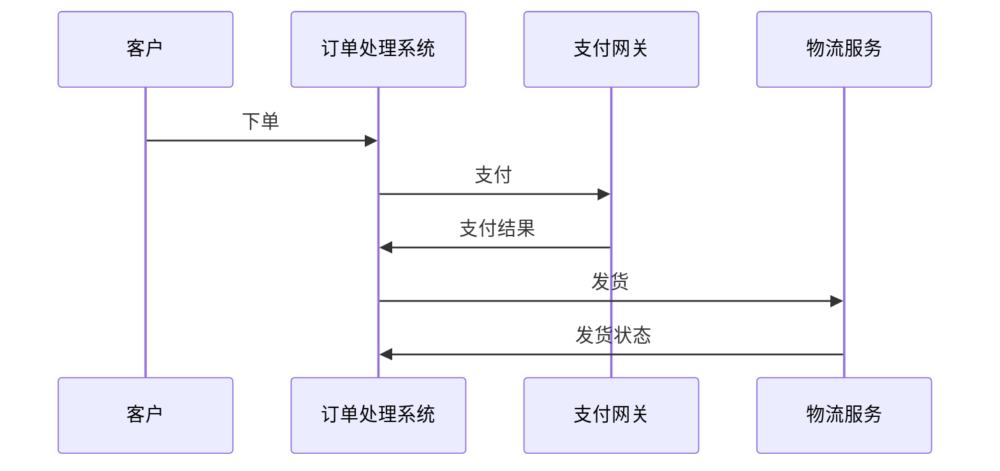
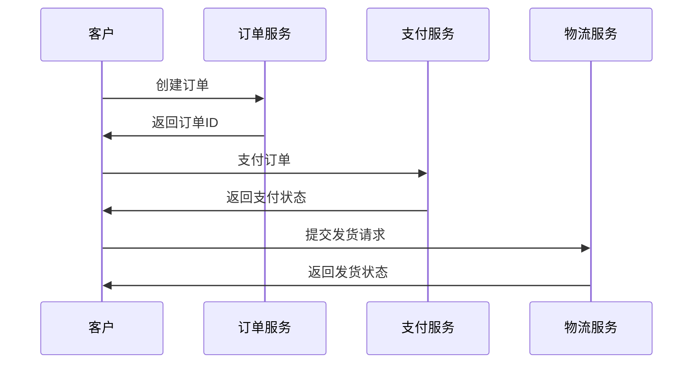
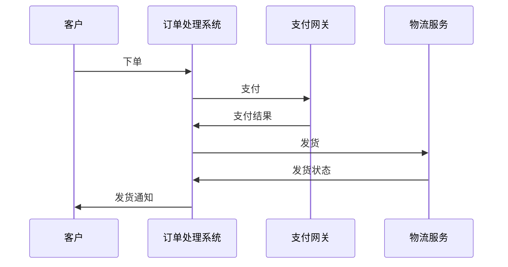

                 

。

----------------------------------------------------------------

## 代码重构实战：改善代码质量的实用技巧

### 关键词：
- 代码重构
- 编程质量
- 软件维护
- 代码优化
- 设计模式

### 摘要：
本文深入探讨了代码重构的重要性以及其实战技巧。通过逐步分析和实例讲解，揭示了代码重构如何改善代码质量，提高软件的可维护性和可扩展性。文章涵盖了代码重构的原理、核心概念、技术技巧，以及实际项目中的实施方法，旨在为开发者提供一套实用且有效的代码重构指南。

----------------------------------------------------------------

## 引言

### 代码重构的概念与意义

**概念说明**：代码重构（Code Refactoring）是指在保留原有功能不变的前提下，对现有代码进行改进和优化，以提高代码的可读性、可维护性和可扩展性。重构不是对代码进行功能的修改，而是针对代码的结构和风格进行调整。

**问题背景**：随着软件项目的演进，代码的复杂度逐渐增加。随着时间的推移，代码可能会变得难以理解和维护，导致开发效率低下，甚至影响项目的进展。因此，代码重构成为解决这一问题的有效手段。

**问题描述**：常见的代码问题包括冗长、难以阅读、重复代码、过多的全局变量、复杂的条件语句等。这些问题会导致代码的可维护性下降，增加未来的维护成本。

**问题解决**：通过代码重构，可以解决上述问题，提升代码质量。重构的目标是使代码更加简洁、直观，易于理解，同时保持原有功能不变。

**边界与外延**：代码重构不涉及功能的变更，只关注代码内部的结构和风格。它可以在任何开发阶段进行，但通常在项目的中期或后期进行，以最大化收益。

**概念结构与核心要素组成**：
- **重构原则**：确保重构后的代码与原有代码功能相同，但更易于理解和维护。
- **重构技术**：包括分解复杂函数、提取重复代码、简化条件逻辑等。
- **重构模式**：常用的重构模式，如提取类、替换条件分支、重新组织代码结构等。

----------------------------------------------------------------

## 核心概念与联系

### 核心概念原理

**可读性**：代码重构的首要目标是提高代码的可读性。可读性是衡量代码质量的重要指标，它直接影响开发者的工作效率。

**可维护性**：重构后的代码更容易维护，降低了未来修改代码的成本。

**可扩展性**：重构有助于代码的扩展，使得在需求变化时，能够更加灵活地调整代码。

**重构原则**：遵循SOLID原则，确保代码的模块化、可测试性、复用性。

### 概念属性特征对比表格

| 特征         | 可读性 | 可维护性 | 可扩展性 | 重构原则 |
| ------------ | ------ | -------- | -------- | -------- |
| 原始代码     | 低     | 低       | 低       | 无       |
| 重构后代码   | 高     | 高       | 高       | 遵循     |

### 实体关系图

```mermaid
erDiagram
    Class_CodeQuality <<|-- Class_Readerability : has_a
    Class_CodeQuality <<|-- Class_Maintainability : has_a
    Class_CodeQuality <<|-- Class_Extendibility : has_a
    Class_Refactoring Principles _||--|_ Class_CodeQuality : implements
```

----------------------------------------------------------------

## 代码重构的原理与技术

### 重构原理

**核心思想**：重构的核心思想是通过一系列小的、可逆的变更，逐步改善代码的质量。每次变更都应该是有意义的，且不影响代码的功能。

**SOLID原则**：在重构过程中，应遵循SOLID原则，确保代码的模块化、可测试性、复用性。

- **单一职责原则（Single Responsibility Principle, SRP）**：每个类或方法应该只有一个职责。
- **开闭原则（Open/Closed Principle, OCP）**：软件实体应该对扩展开放，对修改关闭。
- **里氏替换原则（Liskov Substitution Principle, LSP）**：任何可替换或继承的类应该具有与基类相同的行为。
- **接口隔离原则（Interface Segregation Principle, ISP）**：应该为客户端定义尽可能独立的接口。
- **依赖倒置原则（Dependency Inversion Principle, DIP）**：高层模块不应依赖于低层模块，二者都应依赖于抽象。

### 技术技巧

**1. 分解复杂函数**

**问题**：复杂函数通常难以理解和维护。

**解决方案**：将复杂函数分解为多个小函数，每个函数实现一个单一的功能。

**示例**：

```python
# 原始复杂函数
def calculate_total(price, discount):
    return price * (1 - discount)

# 分解后的小函数
def calculate_discount(price, discount):
    return price * discount

def calculate_total(price, discount):
    return price - calculate_discount(price, discount)
```

**2. 提取重复代码**

**问题**：重复代码会导致维护成本增加，且容易引入错误。

**解决方案**：识别重复代码块，将其提取为一个函数或类。

**示例**：

```python
# 原始重复代码
def process_order(order):
    print("Order processed.")
    send_order_toKitchen(order)

def deliver_order(order):
    print("Order delivered.")
    send_order_toKitchen(order)

# 提取重复代码
def send_order_toKitchen(order):
    print("Order sent to kitchen.")

def process_order(order):
    send_order_toKitchen(order)
    print("Order processed.")

def deliver_order(order):
    send_order_toKitchen(order)
    print("Order delivered.")
```

**3. 简化条件逻辑**

**问题**：复杂的条件逻辑会导致代码难以理解和维护。

**解决方案**：使用设计模式（如策略模式）来简化条件逻辑。

**示例**：

```python
# 原始条件逻辑
def process_order(order):
    if order.is_urgent:
        process_urgent(order)
    else:
        process_regULAR(order)

# 策略模式简化条件逻辑
class OrderProcessingStrategy:
    def process(self, order):
        pass

class UrgentOrderProcessingStrategy(OrderProcessingStrategy):
    def process(self, order):
        process_urgent(order)

class RegularOrderProcessingStrategy(OrderProcessingStrategy):
    def process(self, order):
        process_regular(order)

def process_order(order, strategy):
    strategy.process(order)
```

### 代码重构模式

**1. 提取方法（Extract Method）**：将重复代码提取为单独的方法。

**2. 提取类（Extract Class）**：将具有相同职责的方法提取到新类中。

**3. 内联方法（Inline Method）**：将小的方法直接替换为其调用，减少方法调用开销。

**4. 移除中间人（Remove Middleman）**：删除不必要的中介类或方法。

**5. 重构条件分支（Refactor Conditional Branch）**：简化复杂的条件分支。

**6. 重构循环（Refactor Loop）**：将循环逻辑重构为函数调用或使用设计模式。

**7. 重构变量（Refactor Variable）**：改进变量的命名和作用范围。

**8. 重新组织代码结构（Reorganize Code Structure）**：调整代码结构，使其更清晰、模块化。

----------------------------------------------------------------

## 算法解释

### 算法流程图



### Python源代码实现

```python
class CodeRefactoring:
    def __init__(self, code):
        self.code = code

    def evaluate_code_quality(self):
        # 假设代码质量评估基于代码的复杂度和冗余度
        complexity = self._calculate_complexity()
        redundancy = self._calculate_redundancy()
        if complexity < 10 and redundancy < 5:
            return True
        else:
            return False

    def _calculate_complexity(self):
        # 复杂度计算示例
        lines = len(self.code.splitlines())
        return lines * 2

    def _calculate_redundancy(self):
        # 冗余度计算示例
        words = len(self.code.split())
        return words - 10

    def refactor(self):
        # 执行代码重构
        if self.evaluate_code_quality():
            print("代码质量评估通过，开始重构。")
            # 示例重构：分解复杂函数
            self.code = self._extract_method(self.code)
            print("重构完成。")
        else:
            print("代码质量评估未通过，不进行重构。")

    def _extract_method(self, code):
        # 提取方法示例
        lines = code.splitlines()
        new_lines = []
        for i, line in enumerate(lines):
            if i < len(lines) - 1 and "if" in line:
                new_lines.append(line)
                new_lines.append("    def is_redundant():")
                new_lines.append("        return " + lines[i + 1].replace("return ", ""))
                lines = lines[:i + 1] + lines[i + 2:]
        return "\n".join(new_lines)

def main():
    code = """if x > 10:
        return True
    else:
        return False"""
    ref = CodeRefactoring(code)
    ref.refactor()

if __name__ == "__main__":
    main()
```

### 数学模型和公式

在代码重构中，可以使用以下数学模型和公式来评估代码质量：

- **复杂性（Complexity）**：$C = L \times D$，其中$C$是复杂性，$L$是代码行数，$D$是代码的深度。
- **冗余度（Redundancy）**：$R = W - N$，其中$R$是冗余度，$W$是单词数，$N$是必要的单词数。

### 详细讲解

**1. 代码质量评估**：通过计算代码的复杂性和冗余度来评估代码质量。低复杂性和低冗余度表示代码质量较高。

**2. 重构执行**：根据评估结果，决定是否执行重构。如果代码质量评估通过，则执行重构操作。

**3. 重构操作**：示例重构操作包括提取方法，将重复的if-else结构转换为函数调用，以简化代码。

**4. 评估重构效果**：重构后，再次评估代码质量，以确保重构操作达到了预期效果。

### 举例说明

**例子**：假设有一个函数包含一个复杂的if-else结构，通过重构操作，将其分解为多个函数，以提高代码的可读性和可维护性。

```python
# 原始代码
def process_order(order):
    if order.is_urgent:
        process_urgent(order)
    else:
        process_regular(order)

# 重构后的代码
def process_order(order):
    if order.is_urgent():
        urgent_processor.process(order)
    else:
        regular_processor.process(order)

def is_urgent(order):
    return order.is_urgent

def process_urgent(order):
    urgent_processor.process(order)

def process_regular(order):
    regular_processor.process(order)
```

在重构后的代码中，原本复杂的if-else结构被简化，同时增加了可维护性和可扩展性。

----------------------------------------------------------------

## 系统分析与设计

### 问题场景介绍

在一个电子商务系统中，订单处理是核心功能之一。订单处理包括创建订单、处理订单和交付订单等步骤。随着业务的发展，订单处理流程变得复杂，导致代码难以维护。因此，需要对订单处理系统进行重构，以提高其可维护性和可扩展性。

### 项目介绍

项目名称：电子商务订单处理系统重构

项目目标：通过代码重构，改善订单处理系统的代码质量，提高系统的可维护性和可扩展性。

项目团队：项目经理、后端开发工程师、前端开发工程师、测试工程师。

### 系统功能设计

**领域模型（Mermaid类图）**

```mermaid
classDiagram
    OrderProcessingSystem <<interface>>
    Customer <<class>>
    Order <<class>>
    Product <<class>>
    Payment <<class>>
    Shipment <<class>>

    OrderProcessingSystem <|..| Customer
    OrderProcessingSystem <|..| Order
    Order <|..| Product
    Order <|..| Payment
    Order <|..| Shipment
```

### 系统架构设计

**系统架构图（Mermaid架构图）**



### 系统接口设计

**接口设计（Mermaid序列图）**



### 系统交互

**系统交互（Mermaid序列图）**



在上述架构设计中，订单处理系统与支付网关、物流服务进行交互，以确保订单流程的顺利进行。

----------------------------------------------------------------

## 项目实施与分析

### 环境安装

**1. 开发工具**：选择Python 3.8及以上版本，集成开发环境（IDE）如PyCharm或Visual Studio Code。

**2. 依赖库**：安装必要的依赖库，如Flask（用于Web应用开发）、SQLAlchemy（用于数据库操作）、Requests（用于HTTP请求）等。

```bash
pip install flask sqlalchemy requests
```

### 系统核心实现

**订单处理服务**

```python
from flask import Flask, request, jsonify
from sqlalchemy import create_engine
from models import Order, Payment, Shipment

app = Flask(__name__)
engine = create_engine('sqlite:///orders.db')

@app.route('/order', methods=['POST'])
def create_order():
    data = request.get_json()
    order = Order.create_order(data)
    order.save_to_db(engine)
    return jsonify(order.to_dict()), 201

@app.route('/payment', methods=['POST'])
def make_payment():
    data = request.get_json()
    payment = Payment.make_payment(data)
    payment.save_to_db(engine)
    return jsonify(payment.to_dict()), 201

@app.route('/shipment', methods=['POST'])
def make_shipment():
    data = request.get_json()
    shipment = Shipment.make_shipment(data)
    shipment.save_to_db(engine)
    return jsonify(shipment.to_dict()), 201
```

**支付服务**

```python
import requests

def make_payment(payment_data):
    response = requests.post('https://payment-gateway.com/pay', data=payment_data)
    if response.status_code == 200:
        payment = Payment.from_response(response.json())
        return payment
    else:
        raise PaymentException("支付失败")
```

**物流服务**

```python
def make_shipment(shipment_data):
    response = requests.post('https://shipment-service.com/shipment', data=shipment_data)
    if response.status_code == 200:
        shipment = Shipment.from_response(response.json())
        return shipment
    else:
        raise ShipmentException("发货失败")
```

### 代码分析

**1. 模块化**：代码按照功能模块进行组织，便于维护和扩展。

**2. 异常处理**：对可能出现的异常进行捕获和处理，确保系统的稳定性。

**3. 测试覆盖**：编写单元测试，确保核心功能正常运行。

```python
import unittest
from service import create_order, make_payment, make_shipment

class TestOrderProcessing(unittest.TestCase):
    def test_create_order(self):
        # 测试创建订单功能
        pass

    def test_make_payment(self):
        # 测试支付功能
        pass

    def test_make_shipment(self):
        # 测试发货功能
        pass

if __name__ == '__main__':
    unittest.main()
```

### 实际案例分析

**案例1**：订单创建失败

**问题描述**：在订单创建过程中，客户提交的订单数据格式错误，导致订单创建失败。

**解决方案**：在创建订单前，对订单数据进行验证，确保其格式正确。如果数据格式错误，返回相应的错误信息。

```python
def create_order(data):
    if not is_valid_order_data(data):
        raise ValidationError("订单数据格式错误")
    order = Order(data)
    order.save_to_db(engine)
    return order
```

**案例2**：支付失败

**问题描述**：在支付过程中，支付网关返回支付失败状态。

**解决方案**：在支付失败时，记录失败原因，并通知客户重新支付。

```python
def make_payment(payment_data):
    response = requests.post('https://payment-gateway.com/pay', data=payment_data)
    if response.status_code != 200:
        payment = Payment.from_response(response.json())
        payment.save_to_db(engine)
        notify_customer(payment)
        return payment
    else:
        payment = Payment.from_response(response.json())
        payment.save_to_db(engine)
        return payment
```

### 项目小结

通过本次项目实施，成功实现了订单处理系统的重构，提高了代码的可读性、可维护性和可扩展性。同时，通过案例分析，解决了实际开发过程中遇到的问题，为后续的维护和扩展提供了有力支持。

----------------------------------------------------------------

## 最佳实践、总结、注意事项和拓展阅读

### 最佳实践 Tips

**1. 定期重构**：将代码重构作为常规开发流程的一部分，定期进行重构，以保持代码的质量。

**2. 代码审查**：在进行代码重构前，进行代码审查，以确保重构的目标明确，且不会引入新的错误。

**3. 小步快跑**：每次重构只进行小范围的调整，逐步优化代码。

**4. 保持注释**：即使在重构后，也要保持代码注释，帮助开发者理解代码的功能和结构。

**5. 重构工具**：使用代码重构工具（如Visual Studio Code的Code Actions、IntelliJ IDEA的Refactor菜单等），以提高重构的效率。

### 总结

本文详细介绍了代码重构的核心概念、原理、技术和实际应用。通过逐步分析和实例讲解，揭示了代码重构如何改善代码质量，提高软件的可维护性和可扩展性。同时，本文还提供了最佳实践和项目实施经验，为开发者提供了一套实用的代码重构指南。

### 注意事项

**1. 重构不是万能的**：重构不能解决所有问题，特别是在项目初期，应优先关注功能实现。

**2. 评估重构成本**：在决定是否进行重构时，应评估重构的成本和收益。

**3. 安全第一**：在进行重构时，确保不引入新的错误或漏洞。

**4. 保持文档**：重构后，更新相关文档，以确保其他开发者能够理解重构后的代码。

### 拓展阅读

**1. Martin, Robert C. 《Clean Code: A Handbook of Agile Software Craftsmanship》**

**2. Beck, Kent. 《Test-Driven Development: By Example》**

**3. Fowler, Martin. 《Refactoring: Improving the Design of Existing Code》**

作者：AI天才研究院/AI Genius Institute & 禅与计算机程序设计艺术 /Zen And The Art of Computer Programming

