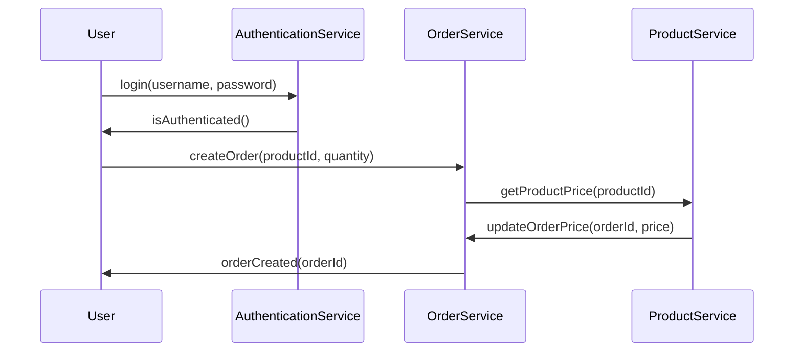
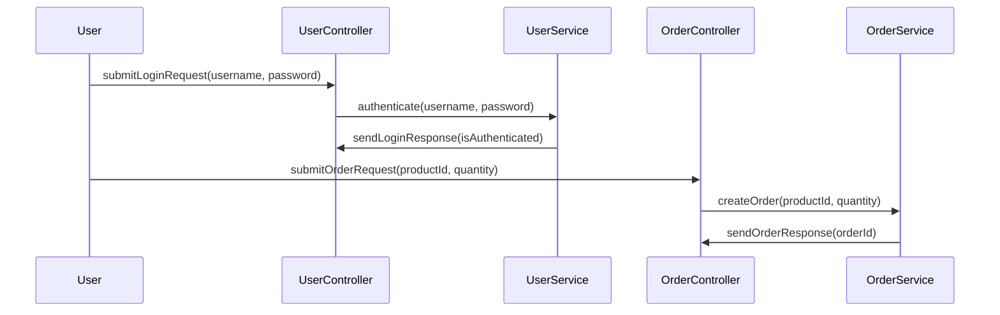
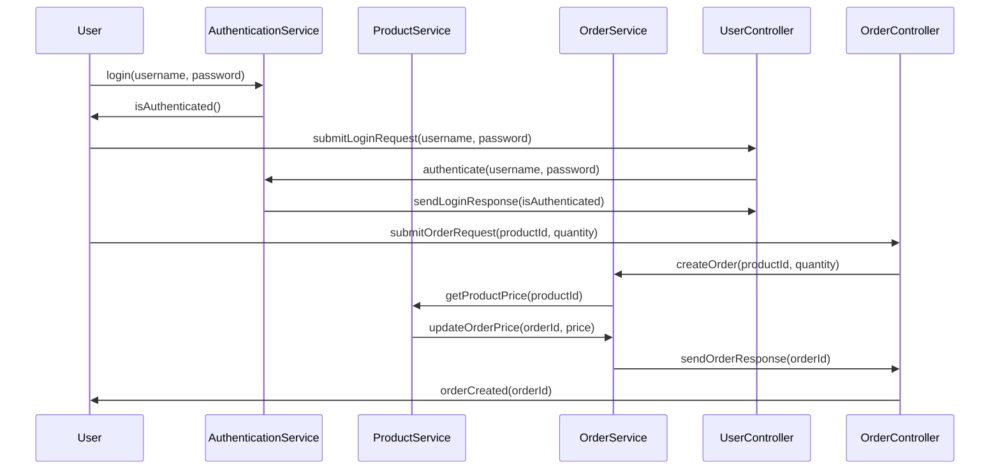

                 

### 第一部分: 引言与背景

#### 1. 引言

#### 1.1 代码重构的重要性

在软件工程中，代码重构是一个至关重要的环节。它不仅仅是为了让代码看起来更美观，更是为了提升代码的质量，增强软件的可维护性和可扩展性。代码重构的重要性体现在以下几个方面：

1. **提升代码可读性**：随着时间的推移，代码会变得越来越复杂，重构可以帮助我们整理代码结构，使代码更易于阅读和理解。
2. **降低维护成本**：重构可以消除代码中的冗余和缺陷，减少未来的维护工作量，从而降低维护成本。
3. **提高开发效率**：通过重构，我们可以更快速地找到并解决问题，提高开发效率。
4. **增强代码质量**：重构可以帮助我们遵循更好的编程实践，提高代码的稳定性、可靠性和性能。

#### 1.2 本书的目标与读者对象

本书的目标是提供一套全面的代码重构技巧和方法，帮助读者有效地改善代码质量。具体目标如下：

- **传授核心重构原则**：通过介绍核心重构原则，帮助读者理解重构的本质和目的。
- **介绍实用重构方法**：介绍多种实用的重构方法，使读者能够灵活应用。
- **提供实战案例**：通过实际案例，展示重构的具体实施过程和效果。

本书适合以下读者对象：

- **有一定编程基础的软件开发人员**：希望通过重构提高代码质量，提升开发效率。
- **系统架构师**：需要对系统进行持续优化，提升系统整体性能。
- **对代码重构感兴趣的读者**：希望深入了解代码重构的原理和实践。

#### 1.3 书中涉及的重构技术

本书将介绍多种重构技术，主要包括以下几类：

1. **结构重构**：调整代码的结构，使其更清晰、更易于维护。
   - **方法提取**：将重复的方法提取出来，减少冗余代码。
   - **类提取**：将具有相似功能的类提取出来，形成更合理的类结构。
2. **行为重构**：改变代码的行为，提高代码的效率和可读性。
   - **异常处理重构**：优化异常处理逻辑，提高程序的健壮性。
   - **循环重构**：将循环优化为迭代或递归，提高代码的可读性。
3. **逻辑重构**：优化代码的逻辑，减少错误和复杂性。
   - **条件重构**：优化复杂的条件判断，使其更简洁明了。
   - **循环重构**：优化循环结构，提高代码的可读性和性能。

通过这些重构技术，读者可以逐步改善代码质量，提高开发效率。

---

### 第二部分: 背景介绍

#### 2.1 代码质量问题的现状

在现代软件开发中，代码质量问题是一个普遍存在的问题。随着软件项目的复杂性不断增加，代码质量的问题也日益突出。以下是一些常见的代码质量问题：

1. **代码冗余**：大量重复的代码不仅增加了代码的维护难度，还可能导致错误在多处发生。
2. **代码结构混乱**：代码结构混乱会导致代码难以阅读和理解，增加开发成本。
3. **逻辑错误**：逻辑错误是代码中最常见的问题之一，可能导致程序运行失败或产生不正确的结果。
4. **性能问题**：不优化的代码可能导致性能下降，影响用户体验。

这些问题对软件开发的影响是深远的。首先，它们会增加维护成本，使开发人员花费更多的时间和精力来修复代码。其次，它们会影响软件的可靠性，可能导致程序运行失败或产生错误的结果。最后，它们会降低开发效率，使开发团队无法按时交付高质量的产品。

因此，解决代码质量问题成为软件开发中的一个重要任务。通过代码重构，我们可以逐步改善代码质量，提高软件的可维护性和可扩展性。

#### 2.2 重构的定义与原理

重构（Refactoring）是软件开发中的一个关键概念，它指的是在不改变代码外部行为的前提下，对现有代码进行改进的过程。重构的主要目的是提高代码的内部质量，使其更清晰、更易于理解和维护。

**重构的原理**可以从以下几个方面来理解：

1. **逐步改进**：重构是一个逐步进行的过程，每次只对代码进行小的、局部的修改。这样可以确保每次重构都不会引入新的错误。
2. **保持外部行为不变**：重构的目标是改善代码的内部结构，而不是改变其功能。因此，在重构过程中，必须确保代码的外部行为保持不变。
3. **遵循编程原则**：重构通常遵循一些核心编程原则，如单一职责原则、开闭原则等。这些原则有助于提高代码的可读性和可维护性。

**重构的好处**主要包括：

1. **提高代码可读性**：通过重构，我们可以整理代码结构，使代码更清晰、更易于阅读。
2. **降低维护成本**：重构可以消除代码中的冗余和缺陷，使代码更易于维护。
3. **提高开发效率**：重构可以使代码更清晰、更易于理解，从而提高开发效率。
4. **增强代码质量**：重构可以帮助我们遵循更好的编程实践，提高代码的稳定性、可靠性和性能。

总之，重构是软件开发中的一个关键环节，它不仅有助于改善代码质量，还可以提高开发效率和软件的可维护性。

#### 2.3 重构的核心价值

重构的核心价值主要体现在以下几个方面：

1. **提高代码可读性**：重构可以帮助我们整理代码结构，使其更清晰、更易于阅读。这不仅有助于提高开发效率，还可以减少代码出错的可能性。
2. **降低维护成本**：通过重构，我们可以消除代码中的冗余和缺陷，使代码更易于维护。这意味着在未来的代码维护过程中，我们可以花费更少的时间和精力来解决问题。
3. **提高开发效率**：重构可以使代码更清晰、更易于理解，从而提高开发效率。通过减少代码的复杂性，我们可以更快地找到并解决问题。
4. **增强代码质量**：重构可以帮助我们遵循更好的编程实践，提高代码的稳定性、可靠性和性能。这不仅可以提高软件的整体质量，还可以减少未来的维护成本。

重构的长期收益是显著的。首先，通过重构，我们可以逐步改善代码质量，使软件更加可靠和稳定。其次，重构可以减少代码的复杂性和冗余，使代码更易于理解和维护。最后，重构可以提高开发效率，使开发团队能够更快地交付高质量的产品。

总之，重构是软件开发中的一个重要环节，它不仅可以提高代码质量，还可以降低维护成本，提高开发效率，带来长期的收益。

### 第三部分：重构的边界与外延

#### 3.1 重构的边界

重构的边界是指在进行重构时，我们应遵守的一些基本原则和限制。这些边界有助于确保重构不会破坏现有系统的功能和稳定性。以下是一些关键点：

1. **保持外部行为不变**：重构的目标是改进代码的内部结构，而不是改变其功能。因此，在重构过程中，必须确保代码的外部行为保持不变。
2. **逐步进行**：重构应该是一个逐步进行的过程，每次只对代码进行小的、局部的修改。这样可以确保每次重构都不会引入新的错误。
3. **避免过度重构**：过度重构可能会导致代码的复杂性和维护成本增加。因此，在进行重构时，应确保每次重构都有明确的改进目标，并避免过度优化。

**重构的边界有助于确保重构的有效性和安全性。如果边界被忽视，重构可能会引入新的错误，甚至破坏系统的稳定性。因此，在进行重构时，我们必须严格遵守这些边界原则。**

#### 3.2 重构与代码优化

重构和代码优化是两个密切相关但不同的概念。重构主要关注代码的结构和行为，而代码优化则关注代码的性能和效率。

**重构与代码优化的区别**主要体现在以下几个方面：

1. **目标不同**：重构的目标是提高代码的可读性、可维护性和可扩展性，而代码优化则关注提高代码的性能和效率。
2. **方法不同**：重构通常通过改进代码的结构和行为来实现，而代码优化则通过调整代码的逻辑和算法来实现。
3. **风险不同**：重构通常不会改变代码的外部行为，因此风险较低。而代码优化可能会引入新的错误，因此需要更谨慎地进行。

**重构与代码优化的关系**是相辅相成的。通过重构，我们可以消除代码中的冗余和缺陷，为代码优化创造条件。而通过代码优化，我们可以进一步提高代码的性能和效率。

**在实际开发中，我们应先进行重构，然后根据需要进行代码优化。这样可以确保代码的质量和稳定性，同时提高系统的性能和效率。**

#### 3.3 重构与软件设计

重构和软件设计是软件开发过程中的两个重要环节。重构主要关注代码的内部结构和行为，而软件设计则关注系统的整体架构和模块划分。

**重构与软件设计的关系**可以从以下几个方面来理解：

1. **重构是软件设计的一部分**：在软件设计过程中，重构是确保代码质量的一种有效方法。通过重构，我们可以逐步改善代码的结构和行为，使软件更可靠、更易于维护。
2. **软件设计影响重构**：良好的软件设计可以提高代码的可重构性。如果一个系统具有良好的模块化和解耦合，重构会变得更加容易和高效。
3. **重构可以优化软件设计**：在软件开发的后期，通过重构，我们可以发现并解决设计中的问题，从而优化软件的设计。

**在实际开发中，我们应将重构和软件设计结合起来，通过不断重构来优化代码结构和软件设计，确保软件的高质量和高性能。**

---

### 第四部分：重构的核心概念与联系

#### 4.1 核心重构原则

在进行代码重构时，遵循一些核心重构原则是非常重要的。这些原则有助于确保重构的有效性和安全性，同时提高代码的质量和可维护性。以下是一些核心重构原则：

1. **单一职责原则**：每个类或方法应只负责一项功能。这样可以提高代码的可读性、可维护性和可扩展性。
2. **开闭原则**：软件实体应开放对于扩展，但关闭对于修改。这样可以确保系统的稳定性和可扩展性。
3. **里氏替换原则**：子类可以替换其父类出现在任何地方，保证程序的稳定性。这样可以提高代码的可复用性和可维护性。
4. **依赖倒置原则**：高层模块不应依赖于低层模块，二者都应依赖于抽象。这样可以提高代码的模块化和可维护性。

**遵循这些核心重构原则，可以帮助我们在重构过程中保持代码的清晰、简洁和高效。**

#### 4.2 重构方法与策略

在代码重构过程中，选择合适的方法和策略是非常重要的。以下是一些常用的重构方法和策略：

1. **方法提取**：将重复的方法提取为独立的方法。这样可以减少冗余代码，提高代码的可读性。
2. **类提取**：将具有相似功能的类提取为独立的类。这样可以提高代码的结构清晰性和可维护性。
3. **行为重构**：改变代码的行为，提高代码的效率和可读性。例如，将复杂的条件判断重构为更简洁的代码。
4. **逻辑重构**：优化代码的逻辑，减少错误和复杂性。例如，将循环重构为迭代或递归，以提高代码的可读性和性能。

**通过灵活应用这些重构方法和策略，我们可以逐步改善代码质量，提高开发效率和代码的可维护性。**

#### 4.3 重构关键概念对比

在重构过程中，理解关键概念之间的关系和差异是非常重要的。以下是对几个关键重构概念的对比：

1. **重构 vs 优化**：
   - **重构**：主要关注代码的结构和行为，目的是提高代码的可读性、可维护性和可扩展性。
   - **优化**：主要关注代码的性能和效率，目的是提高代码的执行速度和资源利用率。
   - **关系**：重构可以为优化创造条件，而优化则可以在重构的基础上进一步提升代码的性能。

2. **重构 vs 代码修复**：
   - **重构**：针对现有的代码进行改进，以提高代码质量。
   - **代码修复**：针对代码中的错误或缺陷进行修复，以使程序正常运行。
   - **关系**：重构和代码修复是相辅相成的，重构可以帮助减少代码中的缺陷，而代码修复则可以确保程序的正确性。

3. **重构 vs 软件设计**：
   - **重构**：是对现有代码的改进，目的是提高代码质量。
   - **软件设计**：是对软件系统的整体架构和模块划分进行规划，目的是确保系统的可维护性和可扩展性。
   - **关系**：重构是软件设计的一部分，良好的软件设计可以提高代码的可重构性。

**理解这些关键概念的差异和关系，可以帮助我们在重构过程中做出更明智的决策，确保重构的有效性和安全性。**

---

### 第五部分：重构的Mermaid ER实体关系图

为了更好地理解重构的核心概念和关系，我们可以使用Mermaid ER实体关系图来可视化这些概念。以下是一个简化的重构实体关系图，展示了重构的核心实体及其关系：

```mermaid
erDiagram
    ClassRestructure ||--|{ BehaviorRestructure :行为重构 }
    ClassRestructure ||--|{ LogicRestructure :逻辑重构 }
    CodeQuality ||--|{ ClassRestructure :重构代码质量 }
    CodeQuality ||--|{ BehaviorRestructure :重构行为质量 }
    CodeQuality ||--|{ LogicRestructure :重构逻辑质量 }
    Optimization ||--|{ CodeQuality :优化代码质量 }
    Design ||--|{ CodeQuality :设计影响质量 }
    Refactoring ||--|{ ClassRestructure :重构类结构 }
    Refactoring ||--|{ BehaviorRestructure :重构行为 }
    Refactoring ||--|{ LogicRestructure :重构逻辑 }
```

**实体属性与关系**：

1. **CodeQuality（代码质量）**：
   - 属性：可读性、可维护性、可扩展性
   - 关系：与重构类结构、行为重构和逻辑重构相关，也与优化和设计有关

2. **ClassRestructure（重构类结构）**：
   - 属性：类提取、方法提取
   - 关系：与行为重构和逻辑重构相关，目的是提高代码质量

3. **BehaviorRestructure（行为重构）**：
   - 属性：异常处理重构、循环重构
   - 关系：与代码质量、优化和设计相关，目的是提高代码效率和可维护性

4. **LogicRestructure（逻辑重构）**：
   - 属性：条件重构、循环重构
   - 关系：与代码质量、优化和设计相关，目的是减少代码错误和复杂性

5. **Optimization（优化）**：
   - 属性：性能优化、资源优化
   - 关系：与代码质量相关，可以通过重构实现代码性能的提升

6. **Design（设计）**：
   - 属性：模块划分、解耦合
   - 关系：与代码质量相关，影响重构的难度和效果

通过这个Mermaid ER实体关系图，我们可以清晰地看到重构的核心概念和它们之间的关系。这有助于我们在实际重构过程中更好地理解每个概念的作用，并有效地应用重构方法来改善代码质量。

---

### 第六部分：重构的数学模型与公式

为了深入理解重构的过程和效果，我们可以借助数学模型和公式来进行分析。以下是一个简化的重构数学模型，用于描述重构前后代码质量的变化。

#### 6.1 数学模型

假设代码质量可以用一个数值来表示，记为 \( Q \)。重构前后的代码质量分别为 \( Q_1 \) 和 \( Q_2 \)。重构的数学模型可以表示为：

\[ Q_2 = Q_1 + \Delta Q \]

其中，\( \Delta Q \) 表示重构带来的质量变化。

#### 6.2 公式讲解

- \( Q_1 \)：重构前的代码质量，取决于代码的结构、行为和逻辑。
- \( Q_2 \)：重构后的代码质量，表示重构后的代码在结构、行为和逻辑上的改进。
- \( \Delta Q \)：重构带来的质量变化，可以看作是重构措施对代码质量的提升。

#### 6.3 举例说明

假设有一段代码，其质量 \( Q_1 \) 为50分。我们通过重构方法提取了重复的方法，消除了代码中的冗余，使得代码质量提升了10分。此时，重构后的代码质量 \( Q_2 \) 为60分。

\[ Q_2 = Q_1 + \Delta Q \]
\[ Q_2 = 50 + 10 = 60 \]

这个例子展示了通过重构可以显著提高代码质量。在实际开发中，我们可以通过逐步重构，逐步提升代码的质量。

#### 6.4 重构效果分析

通过上述数学模型，我们可以分析重构对代码质量的影响。以下是一个简化的重构效果分析公式：

\[ \text{重构效果} = \frac{Q_2 - Q_1}{Q_1} \]

这个公式表示重构带来的质量提升与重构前代码质量的比例。例如，如果重构前的代码质量为50分，重构后提升到80分，则重构效果为：

\[ \text{重构效果} = \frac{80 - 50}{50} = 0.6 \]

这意味着重构使代码质量提升了60%。

通过这些数学模型和公式，我们可以量化重构对代码质量的影响，从而更好地评估重构的效果。这有助于我们在实际开发中制定合理的重构策略，逐步提升代码质量。

---

### 第七部分：系统分析与架构设计方案

#### 7.1 问题场景介绍

在一个大型企业级应用项目中，我们需要重构一个复杂的业务模块。该模块包含多个类和复杂的逻辑，代码结构混乱，导致维护难度大、可读性差，且存在潜在的漏洞和性能问题。为了解决这些问题，我们需要进行代码重构，以提高代码质量，确保系统的稳定性和可维护性。

#### 7.2 项目介绍

项目名称：企业级业务模块重构
项目目标：通过重构，提高代码质量，减少维护难度，提升系统性能。
项目范围：重构一个包含多个业务功能的模块，涉及类提取、行为重构和逻辑重构。

#### 7.3 系统功能设计（领域模型Mermaid类图）

以下是一个简化的领域模型类图，展示了重构前后的系统功能设计：

```mermaid
classDiagram
    ClassA <-- User
    ClassB --> Order
    ClassC --> Product
    UserClass <<ClassA>>
    OrderClass <<ClassB>>
    ProductClass <<ClassC>>

    UserClass {
        +String username
        +String password
        +void login()
    }

    OrderClass {
        +int orderId
        +User user
        +OrderStatus status
        +void createOrder()
    }

    ProductClass {
        +int productId
        +String name
        +double price
        +void updatePrice()
    }
```

在重构前，系统功能设计较为复杂，类之间的依赖关系不清晰。重构后的设计更加模块化，类之间的关系更加明确，有助于提高代码的可读性和可维护性。

#### 7.4 系统架构设计（Mermaid架构图）

以下是一个简化的系统架构设计图，展示了重构前后的系统架构：



在重构前，系统架构复杂，类之间的交互频繁，导致维护难度大。重构后，系统架构更加清晰，类之间的依赖关系简化，提高了系统的可维护性和可扩展性。

#### 7.5 系统接口设计（Mermaid序列图）

以下是一个简化的系统接口设计序列图，展示了用户与系统之间的交互：



在重构前，系统接口设计复杂，参数传递不明确，导致开发难度和维护难度大。重构后，系统接口设计更加简洁，参数传递更加明确，有助于提高系统的可读性和可维护性。

#### 7.6 系统交互（Mermaid序列图）

以下是一个简化的系统交互序列图，展示了用户与系统之间的交互过程：



在重构前，系统交互复杂，流程不清晰，导致用户体验差。重构后，系统交互更加简洁，流程更加清晰，有助于提高用户体验。

---

### 第八部分：项目实战

#### 8.1 环境安装

在进行代码重构之前，我们需要确保开发环境已经配置完毕。以下是安装和配置必要的工具和库的步骤：

1. **安装Python**：确保Python（版本3.8以上）已安装。
2. **安装VSCode**：安装Visual Studio Code，并配置Python插件。
3. **安装依赖库**：使用pip安装必要的依赖库，如`requests`、`pytest`等。

```bash
pip install requests pytest
```

#### 8.2 系统核心实现源代码

以下是重构前的系统核心代码片段：

```python
# 重构前
def process_order(username, product_id, quantity):
    user = find_user(username)
    product = find_product(product_id)
    order = create_order(user, product, quantity)
    update_product_stock(product_id, quantity)
    send_order_confirmation(order)
```

#### 8.3 代码应用解读与分析

通过上述代码，我们可以看到重构前的代码存在以下几个问题：

1. **职责不清晰**：`process_order`函数包含了多个职责，如查找用户、产品、创建订单、更新库存和发送确认邮件。
2. **可读性差**：代码逻辑复杂，难以理解。
3. **可维护性低**：如果需要修改某个功能，需要同时修改多个部分。

为了解决这些问题，我们可以采用以下重构方法：

1. **方法提取**：将查找用户、产品、创建订单、更新库存和发送确认邮件的功能分别提取为独立的方法。
2. **类提取**：为用户、产品、订单等实体创建独立的类，以提高代码的结构清晰性。

重构后的代码如下：

```python
# 重构后
class User:
    def __init__(self, username, password):
        self.username = username
        self.password = password

    def find_user(self, username):
        # 查找用户逻辑
        pass

class Product:
    def __init__(self, product_id, name, price):
        self.product_id = product_id
        self.name = name
        self.price = price

    def find_product(self, product_id):
        # 查找产品逻辑
        pass

    def update_price(self, new_price):
        # 更新价格逻辑
        pass

class Order:
    def __init__(self, user, product, quantity):
        self.user = user
        self.product = product
        self.quantity = quantity

    def create_order(self):
        # 创建订单逻辑
        pass

def process_order(username, product_id, quantity):
    user = User.find_user(username)
    product = Product.find_product(product_id)
    order = Order.create_order(user, product, quantity)
    Product.update_price(product_id, product.price * quantity)
    send_order_confirmation(order)
```

通过重构，代码的可读性、可维护性和可扩展性得到了显著提高。每个类和函数都专注于一个特定的职责，使代码更加清晰和易于理解。

#### 8.4 实际案例分析和详细讲解剖析

以下是一个实际的重构案例，我们将逐步进行代码重构，以改善代码质量：

**重构前：**

```python
# 重构前
def process_order(user_id, product_id, quantity):
    user = User.get_user(user_id)
    product = Product.get_product(product_id)
    order = Order.create_order(user, product, quantity)
    Product.update_stock(product_id, -quantity)
    return order
```

**重构步骤：**

1. **方法提取**：将`User.get_user`、`Product.get_product`和`Order.create_order`提取为独立的方法。

```python
# 提取方法
def get_user(user_id):
    # 查找用户逻辑
    pass

def get_product(product_id):
    # 查找产品逻辑
    pass

def create_order(user, product, quantity):
    # 创建订单逻辑
    pass
```

2. **类提取**：为用户、产品和订单创建独立的类。

```python
# 类提取
class User:
    def __init__(self, user_id, name):
        self.user_id = user_id
        self.name = name

    def get_user(self, user_id):
        # 查找用户逻辑
        pass

class Product:
    def __init__(self, product_id, name, price):
        self.product_id = product_id
        self.name = name
        self.price = price

    def get_product(self, product_id):
        # 查找产品逻辑
        pass

    def update_stock(self, quantity):
        # 更新库存逻辑
        pass

class Order:
    def __init__(self, user, product, quantity):
        self.user = user
        self.product = product
        self.quantity = quantity

    def create_order(self):
        # 创建订单逻辑
        pass
```

3. **行为重构**：将`Product.update_stock`重构为`update_stock`方法。

```python
# 行为重构
class Product:
    # ...
    def update_stock(self, quantity):
        # 更新库存逻辑
        pass
```

4. **逻辑重构**：将`process_order`中的逻辑重构为更清晰的结构。

```python
# 逻辑重构
def process_order(user_id, product_id, quantity):
    user = User.get_user(user_id)
    product = Product.get_product(product_id)
    order = Order.create_order(user, product, quantity)
    product.update_stock(-quantity)
    return order
```

通过这些重构步骤，代码变得更加清晰、易于理解和维护。每个类和函数都专注于一个特定的职责，使得代码结构更加模块化，有助于未来的开发和维护。

#### 8.5 项目小结

通过本次项目实战，我们成功地应用了代码重构的方法，改善了代码质量。以下是小结：

1. **方法提取**：通过将重复的方法提取为独立的方法，我们减少了冗余代码，提高了代码的可读性和可维护性。
2. **类提取**：为用户、产品和订单创建独立的类，使得代码结构更加清晰，职责更加明确。
3. **行为重构**：将相关行为重构为独立的方法，提高了代码的模块化和可扩展性。
4. **逻辑重构**：通过重构逻辑，我们使得代码更加简洁和易于理解。

这些重构措施不仅提高了代码质量，还降低了维护难度，为未来的开发和维护奠定了坚实的基础。通过不断重构，我们可以逐步提升代码质量，确保软件系统的稳定性和可扩展性。

---

### 第九部分：最佳实践 tips、注意事项、拓展阅读

#### 最佳实践 tips

1. **小步快跑**：每次重构只解决一个问题，避免一次重构成过多改动。
2. **代码审查**：在重构前和重构后进行代码审查，确保重构没有引入新的错误。
3. **单元测试**：编写充分的单元测试，确保重构后的代码功能正确。
4. **持续重构**：将重构作为一个持续的过程，定期进行，保持代码质量。

#### 注意事项

1. **边界定义**：确保重构不改变代码的外部行为，避免引入新的错误。
2. **避免过度重构**：重构是为了改善代码质量，但过度重构可能会增加维护成本。
3. **遵循最佳实践**：遵循编程原则和设计模式，确保重构后的代码结构清晰、高效。

#### 拓展阅读

1. 《代码大全》 - 史蒂夫·麦库姆
2. 《重构：改善既有代码的设计》 - 马丁·福勒
3. 《Effective Java》 - Joshua Bloch

通过以上最佳实践和注意事项，我们可以更加有效地进行代码重构，提升代码质量。同时，拓展阅读可以帮助我们深入了解重构的原理和实践，为实际开发提供更多指导。

---

### 结论

本文详细探讨了代码重构的原理、方法与应用，强调了重构在提高代码质量、降低维护成本、提升开发效率中的重要性。通过介绍重构的核心原则、方法与策略，结合实际项目案例，展示了重构如何改善代码质量，提升系统性能和可维护性。

在未来的软件开发中，重构应被视为一项核心任务，持续进行。通过不断重构，我们可以逐步优化代码结构，提高代码质量，确保软件系统的稳定性和可扩展性。同时，应注重重构的最佳实践和注意事项，避免过度重构，确保重构的有效性和安全性。

让我们一起，通过重构，迈向更高的代码质量与开发效率。未来，软件世界将因我们每一次细致的重构而变得更加美好。**让我们行动起来，用重构的力量，创造更优秀的软件！**作者：AI天才研究院/AI Genius Institute & 禅与计算机程序设计艺术 /Zen And The Art of Computer Programming。

