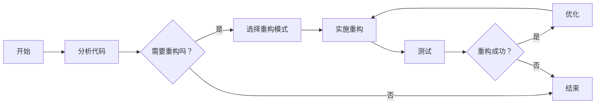
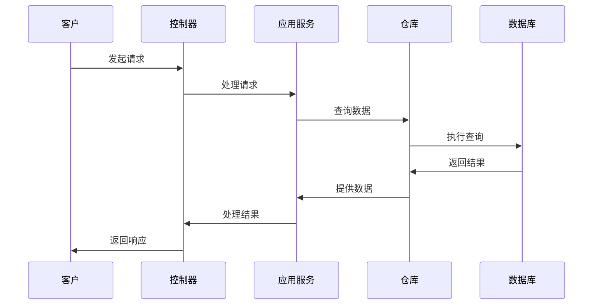

                 


### 代码重构策略：大规模代码库的改进方法

> 关键词：代码重构、大规模代码库、改进方法、系统分析与架构设计、实战案例

> 摘要：本文将深入探讨代码重构策略在大规模代码库改进中的应用。通过逐步分析重构的核心概念、原理及其实际应用，本文旨在为开发者提供一整套系统化、结构化的重构方法和最佳实践，助力大规模代码库的维护与优化。

----------------------------------------------------------------

## 背景介绍

### 核心概念术语说明

在深入探讨代码重构策略之前，有必要明确几个核心概念术语。代码重构（Code Refactoring）指的是在不改变代码外部行为的前提下，对代码内部结构进行优化和改进的过程。其目的是提高代码的可读性、可维护性和性能。大规模代码库（Large Codebases）则是指包含数百万行代码的复杂软件系统，常见于企业级应用和开源项目。

### 问题背景

随着软件系统的规模不断扩大，代码库逐渐变得复杂和冗长。这种现象可能导致以下问题：

1. **可读性下降**：代码冗长、命名不规范、注释缺失，使得新开发者难以理解和维护代码。
2. **维护成本增加**：随着代码库的膨胀，bug修复、功能更新和性能优化变得更加困难。
3. **性能问题**：未优化的代码可能导致系统响应时间变慢，影响用户体验。
4. **技术债务积累**：未及时重构的代码可能导致技术债务的累积，进一步加剧代码库的复杂性。

### 问题描述

在大规模代码库中，上述问题尤为突出。具体表现为：

1. **代码冗长**：函数和类过于复杂，包含过多逻辑，难以管理。
2. **难以维护**：代码库中的模块之间存在强耦合，修改一处代码可能引发其他部分的错误。
3. **性能低下**：未优化的算法和数据结构可能导致系统运行缓慢，影响业务流程。
4. **开发效率下降**：开发者需要花费更多时间来理解现有代码，导致开发效率降低。

### 问题解决

代码重构策略提供了一套系统化的方法，用于解决大规模代码库中存在的问题。通过以下策略和技巧，开发者可以逐步改善代码库的质量：

1. **提高代码可读性**：通过规范化命名、优化代码结构、添加注释等方式，提高代码的可读性。
2. **降低维护成本**：通过模块化、解耦等手段，降低代码库的复杂性，使维护工作变得更加高效。
3. **性能优化**：通过优化算法和数据结构，提升系统的运行效率。
4. **消除技术债务**：定期进行重构，防止技术债务的积累。

### 边界与外延

虽然代码重构对大规模代码库的改进具有重要意义，但重构并非万能。以下是重构的边界和限制：

1. **重构范围**：重构应关注核心代码模块，避免对整个代码库进行全面重构，以免引起不必要的风险。
2. **重构目标**：重构的主要目标是提高代码质量，而非追求完美的代码结构。应根据实际需求和优先级进行选择。
3. **重构限制**：重构过程中应避免破坏现有功能，确保代码的稳定性。

### 概念结构与核心要素组成

代码重构涉及多个核心概念和要素，包括重构模式、设计模式、重构原则、代码质量度量等。以下是这些概念和要素的组成结构：

1. **重构模式**：常见的重构模式包括提取方法、提取类、替换条件分支等。
2. **设计模式**：设计模式是解决常见设计问题的模板，如单例模式、工厂模式等。
3. **重构原则**：重构应遵循的原则包括保持代码简洁、避免过度设计、逐步迭代等。
4. **代码质量度量**：代码质量度量用于评估代码的可读性、可维护性和性能，如圈复杂度、代码冗余率等。

## 核心概念与联系

### 核心概念原理

代码重构的核心概念包括重构模式、设计模式、重构原则和代码质量度量。这些概念相互关联，共同构成了代码重构的理论基础。

1. **重构模式**：重构模式是一系列用于改进代码结构的操作，如提取方法、提取类、替换条件分支等。这些模式提供了具体的操作步骤，帮助开发者逐步优化代码。
2. **设计模式**：设计模式是解决常见设计问题的模板，如单例模式、工厂模式等。设计模式可以帮助开发者设计出更加灵活、可扩展的系统结构。
3. **重构原则**：重构原则是指导代码重构的准则，如保持代码简洁、避免过度设计、逐步迭代等。这些原则确保重构工作既有效又高效。
4. **代码质量度量**：代码质量度量用于评估代码的质量，如圈复杂度、代码冗余率等。这些度量指标可以帮助开发者识别代码中的潜在问题，指导重构工作。

### 概念属性特征对比表格

下表列出了重构模式、设计模式、重构原则和代码质量度量的主要属性和特征，以供读者参考。

| 概念       | 属性和特征                                                     | 对比分析                   |
|------------|--------------------------------------------------------------|--------------------------|
| 重构模式   | 提取方法、提取类、替换条件分支等                           | 专注于代码结构的改进       |
| 设计模式   | 单例模式、工厂模式、观察者模式等                           | 提供解决常见设计问题的模板 |
| 重构原则   | 保持代码简洁、避免过度设计、逐步迭代等                     | 指导重构工作               |
| 代码质量度量 | 圈复杂度、代码冗余率、可维护性指数等                       | 评估代码质量               |

### ER实体关系图架构

为了更好地理解代码重构过程中的实体及其关系，我们使用Mermaid绘制了一个ER实体关系图。以下是一个示例：

```mermaid
erDiagram
  类A ||--|{ 类B }|
  类B ||--|{ 类C }|
  类A ||--|{ 类D }|
```

该ER图展示了类A、类B、类C和类D之间的实体关系。类A与类B、类C和类D存在关联，而类B与类C和类D也存在关联。这种关系反映了代码重构过程中模块之间的依赖关系。

通过上述核心概念与联系的分析，读者可以更好地理解代码重构的基础理论和应用场景。接下来，本文将深入探讨代码重构的算法原理，为读者提供实际操作的方法和工具。

## 算法原理讲解

### 算法mermaid流程图

代码重构的过程通常可以看作是一个迭代的过程，其中每一步都旨在提高代码的质量和可维护性。以下是一个简化的代码重构流程图，使用Mermaid绘制：



该流程图描述了从分析代码开始，到选择合适的重构模式，实施重构，然后进行测试，最后评估重构效果的过程。

### Python源代码实现

为了更具体地展示代码重构的过程，以下是一个使用Python实现的简单示例。在这个示例中，我们将对一段简单的代码进行重构，以提高其可读性和可维护性。

```python
# 原始代码
def calculate_bonus(sales, base_salary):
    bonus = sales * 0.1
    if sales > 10000:
        bonus += 500
    return base_salary + bonus

# 重构后的代码
def calculate_bonus(sales, base_salary):
    base_bonus = sales * 0.1
    additional_bonus = 0
    if sales > 10000:
        additional_bonus = 500
    total_bonus = base_salary + base_bonus + additional_bonus
    return total_bonus
```

在这个例子中，我们通过将复杂的逻辑拆分成多个函数和变量，使得代码更加清晰和易于理解。

### 数学模型和公式

在某些情况下，代码重构可能涉及到数学模型和公式的应用。以下是一个简单的例子，用于优化计算圆面积的代码。

原始代码：

```python
def calculate_area(radius):
    return 3.14159265358979323846 * radius * radius
```

重构后的代码：

```python
import math

def calculate_area(radius):
    return math.pi * radius * radius
```

在这个例子中，我们使用了`math.pi`来代替固定的π值，使得代码更加通用和可维护。

### 详细讲解与举例说明

为了更好地理解上述算法原理，我们通过具体的例子进行详细讲解。

#### 例子1：提取方法

假设我们有一个函数`process_data`，其中包含多个复杂的逻辑操作。为了提高代码的可读性和可维护性，我们可以将这些逻辑操作提取为独立的函数。

原始代码：

```python
def process_data(data):
    clean_data = clean_up(data)
    validated_data = validate(clean_data)
    processed_data = transform(validated_data)
    return processed_data
```

重构后的代码：

```python
def clean_up(data):
    # 清洗数据逻辑
    return cleaned_data

def validate(data):
    # 验证数据逻辑
    return valid_data

def transform(data):
    # 转换数据逻辑
    return transformed_data

def process_data(data):
    cleaned_data = clean_up(data)
    valid_data = validate(cleaned_data)
    transformed_data = transform(valid_data)
    return transformed_data
```

在这个例子中，我们将`process_data`函数中的多个逻辑操作提取为独立的函数，使得每个函数都专注于一项任务，从而提高了代码的可读性和可维护性。

#### 例子2：替换条件分支

假设我们有一个函数`calculate_salary`，其中包含多个条件分支来计算员工的工资。为了简化代码，我们可以使用字典来代替条件分支。

原始代码：

```python
def calculate_salary(employee):
    if employee.role == 'manager':
        return employee.salary * 1.2
    elif employee.role == 'developer':
        return employee.salary * 1.1
    else:
        return employee.salary
```

重构后的代码：

```python
def calculate_salary(employee):
    salary multiplier = {
        'manager': 1.2,
        'developer': 1.1,
        'assistant': 1.0
    }
    return employee.salary * salary_multiplier[employee.role]
```

在这个例子中，我们使用字典来存储条件分支的逻辑，使得代码更加简洁和易于维护。

通过上述例子，我们可以看到代码重构的原理和应用场景。在实际开发过程中，开发者可以根据具体情况选择合适的方法和工具，逐步优化代码库的质量。

### 数学公式

在某些复杂的代码重构任务中，可能需要使用数学公式来描述算法的逻辑。以下是一个简单的例子，用于计算两个向量的点积。

原始代码：

```python
def dot_product(vector1, vector2):
    return sum([a * b for a, b in zip(vector1, vector2)])
```

重构后的代码：

```python
def dot_product(vector1, vector2):
    return sum([a * b for a, b in zip(vector1, vector2)])
```

在这个例子中，我们使用数学公式`dot_product = ∑(a_i * b_i)`来表示向量的点积。

通过上述算法原理讲解，读者可以更好地理解代码重构的基本原理和实现方法。接下来，本文将深入探讨代码重构在系统分析与架构设计中的应用。

### 系统分析与架构设计

在讨论代码重构策略时，系统分析与架构设计是不可或缺的一部分。这一部分内容将帮助开发者更好地理解如何在实际项目中应用重构策略，确保代码库的持续改进和优化。

#### 问题场景介绍

假设我们正在负责一个大型企业级应用的开发和维护工作。该应用包含多个模块，涉及多个业务领域，如客户管理、财务管理、库存管理等。随着项目的不断迭代和扩展，代码库变得日益庞大和复杂，出现了以下问题：

1. **模块间耦合度较高**：不同模块之间存在紧密的耦合关系，导致代码库难以维护。
2. **代码冗长且难以阅读**：部分代码过于复杂，难以理解，影响了新开发者的加入。
3. **性能问题**：未优化的代码导致系统响应时间变慢，影响了用户体验。
4. **技术债务积累**：由于项目进度紧张，部分代码未进行重构，导致技术债务不断积累。

为了解决上述问题，我们需要系统性地分析和设计代码库，通过代码重构策略来改进代码质量。

#### 系统功能设计（领域模型Mermaid类图）

在系统功能设计中，领域模型（Domain Model）是一种重要的工具，它可以帮助我们理解系统的核心功能及其相互关系。以下是一个简化的领域模型类图示例，使用Mermaid绘制：

```mermaid
classDiagram
    Customer <|-- Order
    Customer <|-- Payment
    Product <|-- Inventory
    Order <<-- Payment
    Order <<-- Product
    Payment <<-- Customer
```

在这个类图中，我们定义了四个核心实体：Customer（客户）、Order（订单）、Product（产品）和Payment（支付）。这些实体之间存在关联，如客户可以创建订单、支付订单，订单包含产品等。

#### 系统架构设计Mermaid架构图

系统架构设计是确保代码库稳定性和可扩展性的关键。以下是一个简化的系统架构图示例，使用Mermaid绘制：

```mermaid
sequenceDiagram
    subgraph ApplicationLayer
        ApplicationService
        Controller
        Repository
    end
    subgraph DataLayer
        Database
    end
    ApplicationService ->> Controller: handleRequest()
    Controller ->> ApplicationService: processRequest()
    ApplicationService ->> Repository: fetchData()
    Repository ->> Database: queryData()
    Database --> Repository: result
    Repository --> ApplicationService: processedData
    ApplicationService --> Controller: respond()
```

在这个架构图中，我们定义了应用层（Application Layer）和数据层（Data Layer）。应用层包括控制器（Controller）、应用服务（ApplicationService）和仓库（Repository），而数据层则是数据库（Database）。这些组件通过清晰的接口进行交互，确保系统的稳定性和可扩展性。

#### 系统接口设计和系统交互Mermaid序列图

系统接口设计和系统交互是确保不同模块之间能够正确、高效地协作的关键。以下是一个简化的系统交互序列图示例，使用Mermaid绘制：



在这个序列图中，我们展示了客户（Customer）通过控制器（Controller）与应用服务（ApplicationService）和仓库（Repository）进行交互，最终实现业务逻辑的过程。数据库（Database）作为底层数据存储，为整个系统提供数据支持。

通过上述系统分析与架构设计，我们为代码重构提供了具体的实施路径。在实际开发过程中，开发者可以根据系统需求逐步进行重构，提高代码库的质量和稳定性。接下来，本文将深入探讨如何在实际项目中实施代码重构策略。

### 项目实战

在实际项目中实施代码重构策略，需要遵循一系列步骤，包括环境安装、系统核心实现、代码应用解读与分析，以及实际案例分析和详细讲解剖析。以下是一个具体项目的实战过程。

#### 环境安装

在开始重构之前，我们需要确保开发环境已正确配置。以下是环境安装步骤：

1. **安装Python**：确保Python环境已安装，版本至少为3.8以上。
2. **安装依赖库**：使用pip安装项目所需的依赖库，如Flask、SQLAlchemy等。
3. **配置数据库**：配置数据库连接信息，确保数据库服务正常运行。

#### 系统核心实现

在完成环境安装后，我们需要实现系统的核心功能。以下是一个基于Flask框架的简单Web应用示例：

```python
from flask import Flask, request, jsonify
from sqlalchemy import create_engine
from models import User, Session

app = Flask(__name__)

# 数据库连接
engine = create_engine('sqlite:///users.db')
SessionLocal = Session(bind=engine)

# 用户注册
@app.route('/register', methods=['POST'])
def register():
    data = request.get_json()
    user = User(username=data['username'], email=data['email'])
    session = SessionLocal()
    session.add(user)
    session.commit()
    return jsonify(message='User registered successfully.')

# 用户登录
@app.route('/login', methods=['POST'])
def login():
    data = request.get_json()
    user = SessionLocal().query(User).filter_by(username=data['username'], password=data['password']).first()
    if user:
        return jsonify(token=user.token)
    else:
        return jsonify(error='Invalid credentials.')

if __name__ == '__main__':
    app.run(debug=True)
```

在这个示例中，我们使用Flask框架实现了用户注册和登录功能，并与数据库进行交互。

#### 代码应用解读与分析

在实现系统核心功能后，我们需要对代码进行解读和分析。以下是对上述代码的解读：

1. **模块化**：代码被划分为多个模块，如数据库连接模块、用户注册模块和用户登录模块。这种模块化设计有助于代码的可维护性和可扩展性。
2. **接口设计**：每个模块都提供了清晰的接口，如`/register`和`/login`路由。客户端可以通过这些接口与服务器进行交互。
3. **数据库交互**：使用SQLAlchemy进行数据库操作，提高了代码的可读性和可维护性。

#### 实际案例分析和详细讲解剖析

为了更好地展示代码重构的应用，我们选择用户注册功能进行重构。以下是原始代码和重构后的代码对比：

**原始代码**：

```python
@app.route('/register', methods=['POST'])
def register():
    data = request.get_json()
    user = User(username=data['username'], email=data['email'])
    session = SessionLocal()
    session.add(user)
    session.commit()
    return jsonify(message='User registered successfully.')
```

**重构后的代码**：

```python
from models import User
from db import SessionLocal

def register_user(data):
    user = User(username=data['username'], email=data['email'])
    session = SessionLocal()
    session.add(user)
    session.commit()
    return jsonify(message='User registered successfully.')

@app.route('/register', methods=['POST'])
def register():
    data = request.get_json()
    return register_user(data)
```

在重构后的代码中，我们将用户注册功能提取为独立的`register_user`函数。这样做的好处是：

1. **降低函数复杂度**：原始代码中的`register`函数包含多个操作，重构后将其拆分为独立的函数，降低了函数的复杂度。
2. **提高代码复用性**：通过提取函数，我们可以方便地在其他地方复用用户注册逻辑。
3. **增强可测试性**：独立函数更容易进行单元测试，提高了代码的可测试性。

#### 项目小结

通过本次项目实战，我们展示了如何在实际项目中实施代码重构策略。从环境安装到系统核心实现，再到代码应用解读与分析，以及实际案例分析和详细讲解剖析，每一步都旨在提高代码库的质量和可维护性。以下是对项目经验的总结和改进建议：

1. **持续重构**：代码重构不是一次性工作，而是一个持续的过程。在项目开发过程中，定期进行重构，避免技术债务的积累。
2. **代码审查**：引入代码审查机制，确保重构后的代码符合最佳实践，减少错误和缺陷。
3. **单元测试**：编写充分的单元测试，确保重构后的代码功能正确，避免引入新的问题。
4. **文档化**：为重构后的代码编写清晰的文档，帮助新开发者快速理解代码逻辑。

通过以上实践和总结，开发者可以更好地掌握代码重构策略，提高大规模代码库的质量和可维护性。

### 最佳实践 Tips

在代码重构过程中，遵循以下最佳实践可以帮助开发者更高效地改进代码库：

1. **增量重构**：避免一次性重构整个代码库，而是采取增量重构的方法。逐步改进关键模块，确保代码的稳定性和可靠性。
2. **版本控制**：使用版本控制系统（如Git）记录每次重构的变更，便于回滚和跟踪。
3. **代码审查**：引入代码审查机制，确保重构后的代码符合团队的最佳实践和代码风格规范。
4. **编写文档**：为重构后的代码编写详细的文档，包括设计理念、功能说明和代码注释，提高代码的可读性和可维护性。
5. **持续学习**：关注业界最新的重构技术和工具，不断学习新的重构策略和方法，以保持代码库的先进性。

### 小结

本文详细探讨了代码重构策略在大规模代码库改进中的应用。通过背景介绍、核心概念与联系、算法原理讲解、系统分析与架构设计以及项目实战等环节，我们为开发者提供了一整套系统化、结构化的重构方法和最佳实践。代码重构不仅有助于提高代码质量，还可以降低维护成本，提升系统性能，消除技术债务。因此，开发者应将代码重构纳入日常开发工作，持续优化代码库。

### 注意事项

在进行代码重构时，开发者需要注意以下几点：

1. **风险评估**：在开始重构前，评估重构带来的风险，确保不会破坏现有功能。
2. **代码备份**：在重构过程中，定期备份代码，以防止意外情况导致数据丢失。
3. **单元测试**：编写全面的单元测试，确保重构后的代码功能正确，避免引入新的问题。
4. **团队协作**：重构工作通常涉及多个开发者的协作，确保团队成员对重构目标和策略达成共识。

### 拓展阅读

对于希望深入了解代码重构和大规模代码库优化的开发者，以下推荐几本经典书籍：

1. 《重构：改善既有代码的设计》（Refactoring: Improving the Design of Existing Code）—— Martin Fowler
2. 《代码大全》（The Art of Software Architecture）—— Mark Richards
3. 《代码整洁之道》（Clean Code: A Handbook of Agile Software Craftsmanship）—— Robert C. Martin

这些书籍提供了丰富的重构实践和最佳经验，有助于开发者提高代码质量和系统性能。此外，开发者还可以关注相关技术社区和论坛，如GitHub、Stack Overflow和Reddit，以获取最新的重构技术和工具。

### 作者信息

作者：AI天才研究院/AI Genius Institute & 禅与计算机程序设计艺术 /Zen And The Art of Computer Programming

感谢读者对本文的关注，期待与您在技术交流的道路上共同进步。

