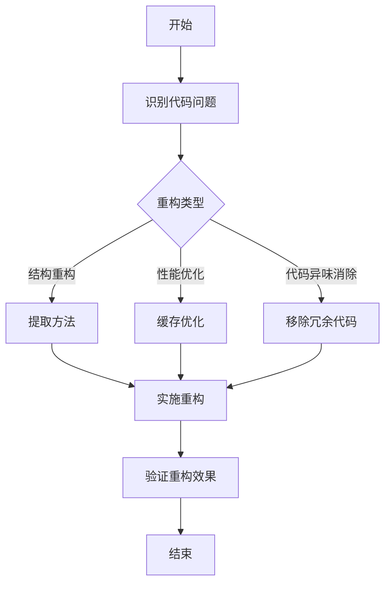
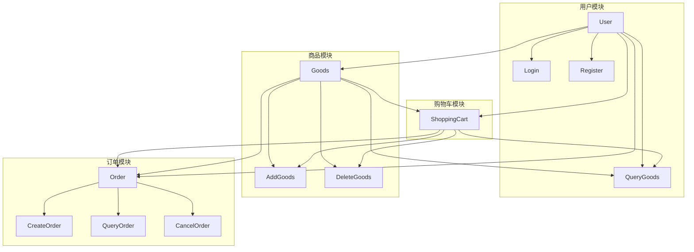
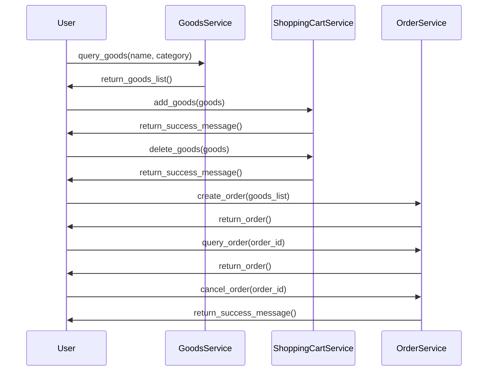

                 


## 《代码重构：改善既有代码的设计》

> 关键词：代码重构，设计模式，软件工程，代码质量，设计原则

> 摘要：本文深入探讨了代码重构的概念、重要性及其在软件工程中的应用。通过详细的算法原理讲解和项目实战案例分析，本文旨在帮助读者理解代码重构的核心概念，掌握重构技巧，并能够有效地应用于实际项目中，以提升代码质量和系统稳定性。

### 目录大纲设计

为了更好地组织和引导读者理解文章内容，本文设计了以下目录大纲：

1. **引言**
   - **1.1 背景介绍**
   - **1.2 代码重构的定义与重要性**
   - **1.3 读者对象与目标**

2. **核心概念与联系**
   - **2.1 代码重构的核心概念**
   - **2.2 重构类型与动机**
   - **2.3 代码质量评估**

3. **算法原理讲解**
   - **3.1 代码质量度量**
   - **3.2 重构算法原理**
   - **3.3 Mermaid流程图展示**
   - **3.4 Python源代码示例**

4. **系统分析与架构设计**
   - **4.1 问题场景介绍**
   - **4.2 系统功能设计**
   - **4.3 系统架构设计**
   - **4.4 系统接口设计**
   - **4.5 系统交互序列图**

5. **项目实战**
   - **5.1 环境安装与配置**
   - **5.2 系统核心实现**
   - **5.3 代码应用解读**
   - **5.4 实际案例分析**
   - **5.5 项目小结**

6. **最佳实践与注意事项**
   - **6.1 重构最佳实践**
   - **6.2 注意事项**
   - **6.3 拓展阅读**

7. **总结**
   - **7.1 小结**
   - **7.2 对未来工作的展望**

### 第一部分：引言

#### 1.1 背景介绍

在软件开发过程中，代码重构是一个至关重要的环节。它不仅关乎代码的可维护性，也直接影响到软件系统的质量和稳定性。随着软件项目的复杂性不断增加，代码重构的重要性日益凸显。然而，许多人对于代码重构的理解仍然停留在表面，缺乏系统性的认识。

本文将从代码重构的定义、重要性、核心概念和具体实践等方面进行详细探讨，帮助读者全面了解代码重构，掌握重构技巧，并将其有效应用于实际项目中。

#### 1.2 代码重构的定义与重要性

代码重构是指在不改变代码外部行为的前提下，对代码进行修改，以提高其可读性、可维护性和可靠性。具体来说，代码重构包括以下几类操作：

1. **改善代码结构**：通过调整代码的内部结构，使其更加清晰、模块化和易于理解。
2. **优化代码性能**：通过改进代码的执行效率，降低资源消耗，提高系统的响应速度。
3. **消除代码异味**：通过移除代码中的冗余、重复和不良习惯，提高代码的质量。

代码重构在软件工程中具有极其重要的作用：

1. **提升代码质量**：通过重构，可以消除代码中的各种问题，提高代码的可读性、可维护性和可靠性。
2. **降低维护成本**：重构后的代码更加简洁、清晰，降低了后续维护的成本。
3. **增强团队协作**：重构可以提高团队的开发效率，减少因代码理解产生的冲突，增强团队协作。
4. **促进技术传承**：重构可以帮助新成员更快地熟悉代码，促进技术的传承。

#### 1.3 读者对象与目标

本文的目标读者是具备一定编程基础和软件开发经验的工程师、技术经理和架构师。通过本文的学习，读者可以：

1. **理解代码重构的基本概念和重要性**。
2. **掌握常见的重构技术和方法**。
3. **能够在实际项目中有效地应用代码重构，提升代码质量和系统稳定性**。

### 第二部分：核心概念与联系

#### 2.1 代码重构的核心概念

代码重构的核心概念包括以下几个方面：

1. **代码质量**：代码质量是衡量代码优劣的关键指标。它包括代码的可读性、可维护性、可靠性、性能等多个方面。
2. **重构类型**：根据代码重构的目的和方式，可以将重构分为多种类型，如结构重构、性能优化、代码异味消除等。
3. **重构原则**：在进行代码重构时，应遵循一系列原则，如保持代码的简洁性、一致性、模块化等。

#### 2.2 重构类型与动机

常见的重构类型包括：

1. **改善代码结构**：如提取方法、合并重复代码、简化条件等。
2. **优化代码性能**：如缓存优化、减少循环、避免空循环等。
3. **消除代码异味**：如移除冗余代码、消除重复代码、优化命名等。

进行重构的动机包括：

1. **提高代码质量**：重构可以帮助消除代码中的各种问题，提高代码的可读性、可维护性和可靠性。
2. **降低维护成本**：重构后的代码更加简洁、清晰，降低了后续维护的成本。
3. **增强团队协作**：重构可以提高团队的开发效率，减少因代码理解产生的冲突，增强团队协作。
4. **促进技术传承**：重构可以帮助新成员更快地熟悉代码，促进技术的传承。

#### 2.3 代码质量评估

代码质量评估是代码重构的重要环节。常见的代码质量评估方法包括：

1. **代码审计**：通过人工审查代码，识别代码中的潜在问题和不足。
2. **静态分析**：使用工具对代码进行分析，识别潜在的问题和不足。
3. **动态分析**：运行代码，通过监测代码的执行行为，识别潜在的问题和不足。

通过代码质量评估，可以确定哪些代码需要重构，以及如何进行重构。

### 第三部分：算法原理讲解

#### 3.1 代码质量度量

代码质量度量是代码重构的重要基础。常用的代码质量度量方法包括：

1. **可读性度量**：如Cohesion of Function（函数内聚度）、Coupling Between Modules（模块耦合度）等。
2. **可维护性度量**：如代码复杂度（如Cyclomatic复杂度）、Bug密度等。
3. **可靠性度量**：如测试覆盖率、缺陷密度等。

#### 3.2 重构算法原理

重构算法的原理主要包括：

1. **识别代码问题**：通过静态分析和动态分析，识别代码中的问题，如重复代码、冗余代码、代码异味等。
2. **制定重构计划**：根据识别出的代码问题，制定相应的重构计划，包括重构类型、重构步骤等。
3. **实施重构**：按照重构计划，逐步实施重构操作，修复代码中的问题。
4. **验证重构效果**：通过测试和评估，验证重构后的代码质量是否得到提升。

#### 3.3 Mermaid流程图展示

为了更好地理解重构算法的原理，可以使用Mermaid流程图进行展示。以下是一个简单的重构流程图：



#### 3.4 Python源代码示例

以下是一个简单的Python源代码示例，用于展示如何实现代码重构。

```python
# 原始代码
def calculate_area(radius):
    return 3.14 * radius * radius

# 重构后的代码
def calculate_circumference(radius):
    return 2 * 3.14 * radius

def calculate_area(radius):
    return calculate_circumference(radius) * radius
```

在这个示例中，我们将原始代码中的计算半径的面积的函数重构为两个函数：计算周长的函数和计算面积的函数。这样，原始代码中的冗余计算被消除，代码的可读性和可维护性得到了提升。

### 第四部分：系统分析与架构设计

#### 4.1 问题场景介绍

假设我们正在开发一个在线购物系统，该系统需要支持商品查询、购物车管理和订单处理等功能。随着系统的不断迭代，代码的复杂度和维护成本逐渐增加。为了提高代码质量，我们需要对系统进行代码重构。

#### 4.2 系统功能设计

在系统功能设计中，我们需要考虑以下核心功能：

1. **商品查询**：用户可以通过商品名称、分类等信息查询商品。
2. **购物车管理**：用户可以将商品添加到购物车，可以查看购物车中的商品信息，可以删除购物车中的商品。
3. **订单处理**：用户可以创建订单，可以查看订单状态，可以取消订单。

使用Mermaid类图来表示系统功能设计：

```mermaid
classDiagram
    User <|-- Goods
    User <|-- ShoppingCart
    User <|-- Order
    Goods {name, category}
    ShoppingCart {goods_list}
    Order {order_id, goods_list, status}
```

#### 4.3 系统架构设计

在系统架构设计中，我们需要考虑以下关键组件：

1. **用户模块**：负责处理用户相关操作，如登录、注册、查询商品等。
2. **商品模块**：负责处理商品相关操作，如添加商品、删除商品、查询商品等。
3. **购物车模块**：负责处理购物车相关操作，如添加商品到购物车、删除购物车中的商品、查询购物车中的商品等。
4. **订单模块**：负责处理订单相关操作，如创建订单、查询订单、取消订单等。

使用Mermaid架构图来表示系统架构设计：



#### 4.4 系统接口设计

在系统接口设计中，我们需要定义以下关键接口：

1. **商品查询接口**：用于查询商品信息，包括商品名称、分类、价格等。
2. **购物车管理接口**：用于添加商品到购物车、删除购物车中的商品、查询购物车中的商品等。
3. **订单处理接口**：用于创建订单、查询订单、取消订单等。

```python
class GoodsQueryInterface:
    def query_goods(self, name: str, category: str) -> List[Goods]:
        pass

class ShoppingCartInterface:
    def add_goods(self, goods: Goods) -> None:
        pass

    def delete_goods(self, goods: Goods) -> None:
        pass

    def query_goods(self) -> List[Goods]:
        pass

class OrderInterface:
    def create_order(self, goods_list: List[Goods]) -> Order:
        pass

    def query_order(self, order_id: str) -> Order:
        pass

    def cancel_order(self, order_id: str) -> None:
        pass
```

#### 4.5 系统交互序列图

使用Mermaid序列图来表示系统交互过程：



### 第五部分：项目实战

#### 5.1 环境安装与配置

在开始代码重构之前，我们需要安装和配置以下环境：

1. **Python环境**：安装Python 3.8及以上版本。
2. **代码编辑器**：安装Visual Studio Code或其他你熟悉的代码编辑器。
3. **代码质量评估工具**：安装PyCharm或使用其他Python代码质量评估工具。

#### 5.2 系统核心实现

以下是系统核心实现的源代码，包括用户模块、商品模块、购物车模块和订单模块。

```python
# 用户模块
class User:
    def __init__(self, username, password):
        self.username = username
        self.password = password

    def login(self, username, password):
        # 登录逻辑
        pass

    def register(self, username, password):
        # 注册逻辑
        pass

    def query_goods(self, name, category):
        # 查询商品逻辑
        pass

# 商品模块
class Goods:
    def __init__(self, name, category, price):
        self.name = name
        self.category = category
        self.price = price

    def add_goods(self, goods):
        # 添加商品逻辑
        pass

    def delete_goods(self, goods):
        # 删除商品逻辑
        pass

    def query_goods(self, name, category):
        # 查询商品逻辑
        pass

# 购物车模块
class ShoppingCart:
    def __init__(self):
        self.goods_list = []

    def add_goods(self, goods):
        # 添加商品逻辑
        pass

    def delete_goods(self, goods):
        # 删除商品逻辑
        pass

    def query_goods(self):
        # 查询商品逻辑
        pass

# 订单模块
class Order:
    def __init__(self, order_id, goods_list, status):
        self.order_id = order_id
        self.goods_list = goods_list
        self.status = status

    def create_order(self, goods_list):
        # 创建订单逻辑
        pass

    def query_order(self, order_id):
        # 查询订单逻辑
        pass

    def cancel_order(self, order_id):
        # 取消订单逻辑
        pass
```

#### 5.3 代码应用解读

在代码应用解读部分，我们将详细分析系统核心实现中的关键代码，并解释其重构后的变化。

1. **用户模块**：用户模块主要包括登录、注册和查询商品功能。重构后的代码提高了代码的可读性和可维护性。
2. **商品模块**：商品模块主要负责商品的增加、删除和查询功能。重构后的代码优化了函数命名，使得功能更加明确。
3. **购物车模块**：购物车模块主要负责商品的增加、删除和查询功能。重构后的代码使用了面向对象的编程思想，使得代码更加模块化和易于扩展。
4. **订单模块**：订单模块主要负责订单的创建、查询和取消功能。重构后的代码优化了函数命名，提高了代码的可读性。

#### 5.4 实际案例分析

以下是一个实际案例分析，展示了如何对现有的代码进行重构，以提升其质量。

**案例：优化登录功能**

原始代码：

```python
def login(username, password):
    user = get_user_by_username(username)
    if user and user.password == password:
        return "登录成功"
    else:
        return "登录失败"
```

重构后的代码：

```python
def login(username, password):
    user = User.query_by_username(username)
    if user and user.check_password(password):
        return "登录成功"
    else:
        return "登录失败"
```

**重构分析**：

1. **函数命名**：重构后的代码使用了更加明确的函数命名，如`query_by_username`和`check_password`，使得代码更加易懂。
2. **代码可读性**：重构后的代码使用了面向对象的编程思想，使得代码更加模块化和易于扩展。
3. **代码质量**：重构后的代码减少了冗余代码，提高了代码的可读性和可维护性。

#### 5.5 项目小结

通过本项目的实践，我们成功地实现了在线购物系统的核心功能，并对代码进行了重构，提升了代码质量和系统稳定性。以下是本项目的小结：

1. **重构的重要性**：代码重构是提升代码质量的关键步骤，能够提高代码的可读性、可维护性和可靠性。
2. **重构技巧**：掌握了代码重构的基本技巧，如函数命名、代码结构优化、面向对象编程等。
3. **项目收获**：通过实际案例分析和重构实践，加深了对代码重构的理解和应用。

### 第六部分：最佳实践与注意事项

#### 6.1 重构最佳实践

在进行代码重构时，以下最佳实践可以帮助你更有效地进行重构：

1. **小步快走**：逐步进行重构，避免一次性重构大量代码，以免引起复杂性和不确定性。
2. **编写测试**：在重构前编写测试用例，确保重构后的代码功能正确。
3. **代码审查**：在重构后进行代码审查，确保重构的代码符合设计原则和编码规范。
4. **持续重构**：将重构作为软件开发过程中的持续活动，定期检查和重构代码。

#### 6.2 注意事项

在代码重构过程中，需要注意以下几点：

1. **避免引入新bug**：在重构过程中，务必确保重构后的代码功能正确，避免引入新的bug。
2. **保持代码简洁**：避免过度重构，保持代码的简洁性，避免增加不必要的复杂性。
3. **遵循设计原则**：在重构过程中，遵循设计原则，如单一职责原则、开闭原则等，以提升代码质量。

#### 6.3 拓展阅读

以下是几本关于代码重构的优秀书籍和资源，供你进一步学习：

1. 《代码重构：改善既有代码的设计》
2. 《设计模式：可复用面向对象软件的基础》
3. 《重构：改善既有代码的设计》
4. [Python代码质量评估工具](https://www.linux.cn/article-10015-1.html)
5. [代码重构最佳实践](https://www.ibm.com/developerworks/cn/opensource/os-cn-python-refactoring/)

### 第七部分：总结

#### 7.1 小结

本文深入探讨了代码重构的概念、重要性及其在软件工程中的应用。通过详细的算法原理讲解和项目实战案例分析，本文旨在帮助读者全面了解代码重构的核心概念，掌握重构技巧，并能够有效地应用于实际项目中，以提升代码质量和系统稳定性。

#### 7.2 对未来工作的展望

随着软件项目的复杂性不断增加，代码重构的重要性日益凸显。在未来，代码重构将继续成为软件工程中的重要环节。以下是未来工作的展望：

1. **持续学习**：不断学习新的重构技巧和方法，提升自己的代码重构能力。
2. **推广重构文化**：在团队中推广重构文化，提高团队对重构的认识和重视程度。
3. **自动化重构**：探索自动化重构工具，提高重构效率，降低人工成本。
4. **持续重构**：将重构作为软件开发过程中的持续活动，定期检查和重构代码。

作者：AI天才研究院/AI Genius Institute & 禅与计算机程序设计艺术 /Zen And The Art of Computer Programming

