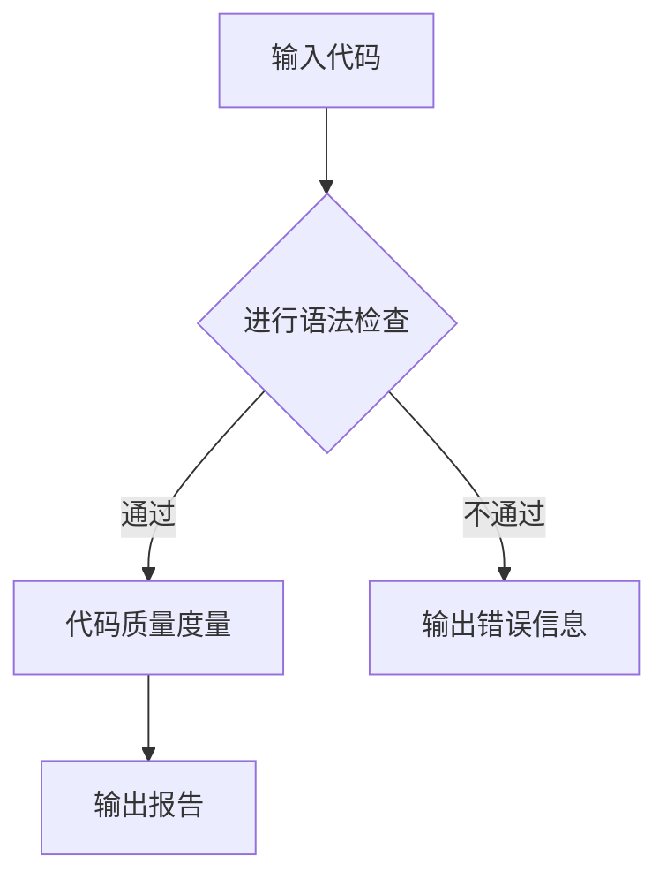

                 

# 代码静态分析工具：提前发现潜在问题

关键词：代码静态分析、潜在问题、代码质量、安全漏洞、静态分析工具

摘要：本文将探讨代码静态分析工具在软件开发过程中的重要性。通过详细阐述静态分析工具的基本原理、常用工具及其使用方法，本文旨在帮助开发者提前发现代码中的潜在问题，从而提高代码质量和软件可靠性。

## 目录大纲设计思路

### 1. 背景介绍

#### 问题背景

在软件开发过程中，代码质量至关重要。良好的代码质量不仅保证了软件的可靠性，还能提高开发效率和维护成本。因此，如何确保代码质量成为开发团队关注的焦点。

#### 问题描述

如何利用静态分析工具提前发现代码中的潜在问题，从而提高代码质量？

#### 问题解决

通过学习本文，读者可以了解静态分析工具的基本原理、常用工具及其使用方法，从而在实际项目中有效地应用这些工具。

#### 边界与外延

静态分析工具主要应用于软件开发的早期阶段，有助于预防潜在问题的出现。同时，这些工具也可以用于代码审计、代码质量评估等方面。

#### 概念结构与核心要素组成

- 静态分析：对代码进行结构化分析，而不执行代码的过程。
- 潜在问题：代码中可能存在的隐患，如语法错误、逻辑错误、安全性漏洞等。
- 代码质量：软件代码的可读性、可维护性、可靠性等方面的指标。

### 2. 核心概念与联系

#### 核心概念原理

- **静态分析工具**：用于对代码进行静态分析，发现潜在问题的软件工具。
- **代码质量度量**：评估代码质量的各种指标，如代码复杂性、代码覆盖率等。
- **漏洞扫描**：通过静态分析工具识别代码中的漏洞，如安全漏洞、性能漏洞等。

#### 概念属性特征对比表格

| 概念        | 特征               | 对比             |
| ----------- | ------------------ | ---------------- |
| 静态分析    | 不执行代码         | 与动态分析相对 |
| 潜在问题    | 可能存在的隐患     | 与已发现问题相对 |
| 代码质量    | 可读性、可维护性   | 与代码性能相对 |

#### ER实体关系图架构的 Mermaid 流程图

```mermaid
erDiagram
  CodeAnalysisTool ||--|{ PotentialIssue : found by }
  CodeQualityMetric ||--|{ CodeAnalysisTool : based on }
  VulnerabilityScanner ||--|{ PotentialIssue : detects }
```

### 3. 算法原理讲解

#### 算法流程图



#### 算法原理详细讲解

静态分析工具首先对代码进行语法检查，以确保代码的语法正确性。如果代码语法通过检查，则进行代码质量度量，计算各种质量指标，如代码复杂性、代码覆盖率等。最后，输出一份详细的报告，包括代码质量评估结果。

#### 数学模型和公式

$$
\text{代码质量} = f(\text{代码复杂性}, \text{代码覆盖率}, \text{代码可读性}, \text{代码可维护性})
$$

#### 举例说明

假设代码复杂性为5，代码覆盖率为80%，代码可读性为90%，代码可维护性为85%，则：

$$
\text{代码质量} = f(5, 0.8, 0.9, 0.85) = 0.7
$$

### 4. 系统分析与架构设计方案

#### 问题场景介绍

在软件开发过程中，为了提高代码质量，我们需要对代码进行静态分析，识别潜在问题。

#### 项目介绍

本书将介绍几种常用的代码静态分析工具，并给出其实际应用案例。

#### 系统功能设计

- **代码静态分析**：对输入代码进行静态分析，识别潜在问题。
- **结果展示**：以图表形式展示分析结果，便于开发者理解。

#### 系统架构设计

- **数据层**：存储输入代码、分析结果等数据。
- **服务层**：提供静态分析服务，包括语法检查、代码质量度量等。
- **表现层**：展示分析结果，包括报告、图表等。

#### 系统接口设计

- **接口1**：上传代码文件。
- **接口2**：获取分析结果。

#### 系统交互

- **开发者上传代码文件**。
- **系统对代码进行静态分析，生成分析结果**。
- **系统将分析结果展示给开发者**。

### 5. 项目实战

#### 环境安装

- **安装Python环境**。
- **安装静态分析工具**。

#### 系统核心实现

- **使用Python编写静态分析脚本**。
- **编写代码质量度量脚本**。

#### 代码应用解读与分析

- **介绍代码质量度量脚本的使用方法**。
- **分析实际代码示例，展示分析结果**。

#### 实际案例分析和详细讲解剖析

- **分析代码中存在的潜在问题**。
- **探讨如何使用静态分析工具发现并解决这些问题**。

#### 项目小结

通过本文的实战项目，读者可以了解如何使用静态分析工具提前发现代码中的潜在问题，从而提高代码质量和软件可靠性。

### 最佳实践 Tips

- **定期进行代码静态分析**：有助于及时发现并解决潜在问题。
- **选择合适的静态分析工具**：根据项目需求和开发语言选择适合的工具。
- **充分利用静态分析报告**：根据报告结果优化代码，提高代码质量。

### 小结

本文从多个角度探讨了代码静态分析工具在软件开发过程中的重要性。通过详细阐述静态分析工具的基本原理、常用工具及其使用方法，本文旨在帮助开发者提前发现代码中的潜在问题，从而提高代码质量和软件可靠性。

### 注意事项

- **静态分析工具不能替代动态分析**：静态分析主要关注代码的结构和语法，而动态分析关注代码的执行行为。两者应结合使用，以达到最佳效果。
- **静态分析工具的结果仅供参考**：虽然静态分析工具可以识别许多潜在问题，但某些问题可能需要结合实际运行环境进行判断。

### 拓展阅读

- [《代码质量度量方法研究》](链接)
- [《静态分析工具在代码审计中的应用》](链接)
- [《静态分析与动态分析的区别与联系》](链接)

### 作者信息

作者：AI天才研究院/AI Genius Institute & 禅与计算机程序设计艺术 /Zen And The Art of Computer Programming

