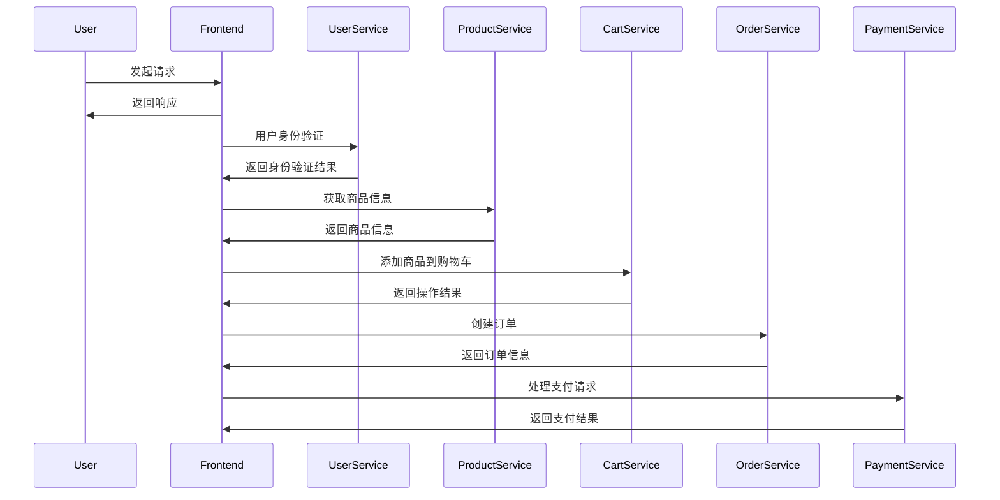

                 

### 第一部分：背景介绍

#### 第1章：问题背景

### 1.1 问题背景

在现代软件工程实践中，随着互联网的普及和业务需求的不断演变，软件系统的复杂度日益增加。从传统的单体应用（Software 1.0）到如今的微服务架构（Software 2.0），软件系统的演变是一个必然的趋势。传统的单体架构由于业务逻辑相对简单，在早期互联网时代曾经主导了软件系统的开发。然而，随着业务规模的扩大和系统复杂性的提升，单体架构逐渐暴露出诸多弊端，如代码耦合度高、系统扩展性差、部署和运维困难等。

在这样的背景下，软件2.0的概念应运而生。软件2.0以微服务架构和分布式系统为核心，通过将复杂的大型系统拆分为多个小型、独立的服务单元，实现了软件系统的灵活扩展和高效运维。微服务架构和分布式系统的引入，不仅提高了系统的可维护性和可扩展性，还极大地提升了系统的可靠性和可用性。

### 1.1.1 从软件1.0到软件2.0的演进

**1.0版本：以传统的单体应用为主**

在软件1.0时代，系统的设计通常以单体应用（Monolithic Application）为主。这种架构模式将所有的业务逻辑、数据存储、前端界面和后端服务都打包在同一个应用程序中。单体应用的结构简单，开发、测试和部署过程相对统一，开发团队可以轻松协同工作。

然而，随着业务的快速发展，单体应用逐渐暴露出其缺点。首先，由于所有功能都紧密耦合在一起，一旦系统中的某个模块出现故障，整个系统都可能受到影响。其次，随着业务需求的增加，单体应用的扩展性变得非常差，系统的性能和稳定性难以保障。

**2.0版本：以微服务架构和分布式系统为主**

软件2.0则引入了微服务架构（Microservices Architecture）和分布式系统（Distributed System）的概念。微服务架构将应用程序分解为一系列小的、独立的、可复用的服务单元，每个服务单元负责完成特定的业务功能。这些服务单元通过轻量级的通信协议（如HTTP/REST、gRPC等）进行交互。

分布式系统则通过将数据和服务分散到多个节点上，实现系统的冗余和容错。分布式算法和通信协议确保了各个节点之间的协同工作，提高了系统的可靠性和可用性。

### 1.1.2 问题提出

随着软件系统规模的不断扩大和业务需求的日益复杂，传统的单体架构已无法满足需求，因此提出了软件2.0的概念。软件2.0的目标是解决单体架构在扩展性、可维护性和可靠性方面的不足，通过微服务架构和分布式系统的引入，实现软件系统的灵活扩展和高效运维。

### 1.1.3 问题解决

通过引入微服务架构和分布式系统，可以实现以下几个方面的改进：

1. **可扩展性**：通过水平扩展服务单元，可以快速提升系统的吞吐量和性能。
2. **可维护性**：每个服务单元独立开发、测试和部署，降低了系统的复杂性，便于团队分工协作。
3. **可靠性**：通过分布式系统和冗余设计，提高了系统的容错能力和可靠性。
4. **灵活性**：服务单元可以独立升级和部署，减少了系统停机时间和风险。

### 1.1.4 边界与外延

- **软件系统边界**：软件系统的功能模块、接口、数据等。微服务架构中的每个服务单元都有明确的边界，负责特定的业务功能。
- **外延**：软件系统与其他系统、业务领域的联系。在分布式系统中，各个服务单元需要协同工作，实现跨系统的数据传输和业务流程。

### 1.1.5 概念结构与核心要素组成

**微服务架构**

- **服务拆分策略**：根据业务功能、数据一致性或技术能力，将系统功能划分为多个独立的服务单元。
- **服务治理**：服务注册与发现、服务监控与日志、服务安全等方面的管理。
- **数据管理**：分布式数据存储、数据一致性和分布式事务。

**分布式系统**

- **分布式算法**：如一致性算法（Paxos、Raft）、负载均衡算法等。
- **通信协议**：如HTTP/REST、gRPC、RabbitMQ等。
- **节点管理**：节点的加入、离开、监控、故障转移等。

### 总结

从软件1.0到软件2.0的演进，不仅体现了技术发展的必然趋势，也反映了业务需求的深刻变化。微服务架构和分布式系统的引入，为解决传统单体架构的弊端提供了有效途径。在接下来的章节中，我们将深入探讨微服务架构和分布式系统的核心概念、设计原则以及实现方法，帮助读者更好地理解和应用这些现代软件架构技术。 

### 第二部分：核心概念与联系

#### 第2章：核心概念与联系

在深入探讨微服务架构和分布式系统的实现之前，我们需要先明确这两个核心概念的定义、特征以及它们之间的关系。通过梳理这些核心概念，我们能够更好地理解软件2.0时代的技术架构，为后续的深入分析打下坚实的基础。

### 2.1 核心概念

**软件架构（Software Architecture）**

软件架构是指软件系统结构的整体设计，它定义了系统组件、组件之间的关系以及系统与外部环境之间的交互。软件架构的目标是提高系统的可维护性、可扩展性和可靠性。软件架构的设计需要综合考虑业务需求、技术约束、团队协作等多方面因素。

**微服务（Microservice）**

微服务是一种独立的、可复用、可独立部署的软件单元，每个微服务通常实现一个单一的业务功能。微服务之间的通信通常通过轻量级的协议（如HTTP/REST、gRPC等）进行。微服务的核心特点包括独立性、可复用性和可扩展性。

**分布式系统（Distributed System）**

分布式系统是由多个节点组成的系统，这些节点通过网络进行通信，共同完成一个任务。分布式系统的核心目标是提高系统的可靠性、可用性和性能。分布式系统需要处理节点间的通信、数据一致性、容错等问题。

### 2.2 概念属性特征对比表格

为了更好地理解微服务架构和分布式系统的核心概念，我们可以通过一个对比表格来展示它们的特征。

| 特征 | 软件架构 | 微服务 | 分布式系统 |
| ---- | ---- | ---- | ---- |
| **结构** | 整体设计 | 服务模块 | 节点 |
| **目的** | 提高可维护性、可扩展性 | 提高可维护性、可扩展性 | 提高系统可靠性、可用性 |
| **技术实现** | 组件、接口、通信 | 服务模块、API、数据库 | 分布式算法、通信协议 |

通过这个对比表格，我们可以看到，软件架构、微服务和分布式系统在结构、目的和技术实现方面存在一定的重叠和区别。软件架构是一个更宏观的概念，关注系统的整体设计；微服务则更加具体，关注服务单元的独立性和可复用性；分布式系统则侧重于系统的可靠性和性能优化。

### 2.3 ER实体关系图架构

为了更直观地展示微服务架构中的实体关系，我们可以使用Mermaid绘制一个ER实体关系图。以下是一个简单的示例：

```mermaid
erDiagram
  User : <<实体>> {ID, Name, Email}
  Product : <<实体>> {ID, Name, Price}
  Order : <<实体>> {ID, User ID, Product ID, Status}
  Cart : <<实体>> {ID, User ID, Products}
  
  User ||--|{ Product } : 购买
  User ||--|{ Order } : 下单
  User ||--|{ Cart } : 添加商品
  Product ||--|{ Order } : 被购买
```

在这个ER图中，`User`、`Product`、`Order`和`Cart`是四个主要的实体。它们之间的关系通过箭头表示，如用户可以购买产品、下单和添加商品到购物车，而产品可以被购买。

### 总结

通过本章的讨论，我们对微服务架构和分布式系统的核心概念有了更深入的理解。这些核心概念不仅构成了现代软件系统的基石，也是实现软件2.0时代业务需求的必要手段。在接下来的章节中，我们将进一步探讨微服务架构和分布式系统的设计原则、实现方法以及面临的挑战，帮助读者全面掌握这些技术。 

### 第3章：微服务架构原理

#### 3.1 微服务架构概述

微服务架构（Microservices Architecture）是一种软件开发方法，旨在通过将应用程序分解为一系列小的、独立的、可复用的服务单元来提高系统的可维护性、可扩展性和灵活性。每个微服务负责实现一个单一的业务功能，并通过轻量级的通信协议（如HTTP/REST、gRPC等）与其他微服务进行交互。

**3.1.1 微服务架构的定义**

微服务架构是一种将复杂的大型系统拆分为多个小型、独立、可复用的服务单元的架构风格。这些服务单元可以在不同的环境中独立开发、测试、部署和扩展。微服务架构的核心思想是“各司其职”，每个微服务专注于实现特定的业务功能，通过松耦合的方式相互协作，共同完成复杂的业务流程。

**3.1.2 微服务架构的特点**

- **独立性**：每个微服务都是独立的，具有自己的数据库、业务逻辑和API。这使开发者可以独立部署、扩展和更新每个微服务，而不影响其他微服务的运行。
- **可复用性**：微服务可以独立开发和部署，这使得它们可以被其他系统或项目复用，提高了资源利用率。
- **可扩展性**：通过水平扩展服务单元，可以快速提升系统的吞吐量和性能。
- **灵活性**：微服务架构允许团队根据业务需求独立开发、部署和扩展服务，提高了系统的灵活性。
- **高可用性**：通过分布式架构和冗余设计，微服务架构提高了系统的容错能力和高可用性。

#### 3.2 微服务架构设计

**3.2.1 服务拆分策略**

服务拆分是微服务架构设计中的关键步骤。合理的服务拆分可以确保系统的可维护性、可扩展性和高可用性。以下是几种常见的服务拆分策略：

- **按业务功能**：根据业务需求，将系统功能划分为多个独立的服务单元。每个服务单元负责完成特定的业务功能，如用户管理、商品管理、订单管理等。
- **按数据一致性**：根据数据的一致性要求，将服务单元划分为多个独立的部分。例如，订单服务可以独立于用户服务和商品服务，从而避免复杂的事务处理。
- **按技术能力**：根据团队成员的技术能力，将服务单元分配给合适的团队。这样可以确保每个团队都可以独立完成服务的设计、开发和维护。

**3.2.2 服务治理**

服务治理是微服务架构中不可或缺的一环。良好的服务治理可以确保微服务的健康运行，包括服务注册与发现、服务监控与日志、服务安全等方面。

- **服务注册与发现**：服务注册与发现机制确保了服务之间的通信。服务启动时，会将自己注册到一个服务注册中心，其他服务可以通过服务注册中心发现并调用这些服务。
- **服务监控与日志**：服务监控与日志可以帮助开发人员快速发现和解决问题。通过监控服务运行状态、日志记录等手段，可以确保微服务的稳定运行。
- **服务安全**：服务安全是微服务架构中的重要一环。需要确保服务之间的通信安全，防止未授权访问和恶意攻击。常用的安全措施包括加密通信、身份验证和授权等。

#### 3.3 微服务架构挑战

尽管微服务架构具有很多优点，但在实际应用中也会面临一些挑战。

**3.3.1 服务治理**

- **服务注册与发现**：服务注册与发现机制需要确保服务的快速启动和故障恢复。
- **服务监控与日志**：如何有效地监控和记录大量微服务的运行状态和日志信息。
- **服务安全**：如何确保服务之间的通信安全，防止未授权访问和恶意攻击。

**3.3.2 数据一致性**

- **分布式事务**：如何在多个微服务之间保持数据的一致性，是一个复杂的挑战。传统的分布式事务解决方案（如两阶段提交）在微服务环境中可能不适用，需要采用最终一致性等新的解决方案。
- **数据一致性和可用性**：在分布式系统中，如何在保证数据一致性和系统可用性之间找到平衡。

**3.3.3 系统复杂性**

- **服务拆分与合并**：如何合理地拆分和合并服务，以确保系统的可维护性和可扩展性。
- **集成测试**：如何对分布式系统进行有效的集成测试，确保各个微服务之间的协作。

#### 3.4 微服务架构最佳实践

为了克服上述挑战，以下是一些微服务架构的最佳实践：

- **渐进式迁移**：在迁移到微服务架构时，可以采用渐进式迁移策略，逐步将单体应用的功能拆分为独立的微服务。
- **服务自治**：确保每个微服务都具有自治性，包括服务开发、部署、运维等方面。
- **服务化基础设施**：构建一套服务化基础设施，包括服务注册与发现、服务监控与日志、服务安全等，以提高微服务的可维护性和可靠性。
- **数据一致性和分布式事务**：采用最终一致性模型、分布式事务中间件等新技术，解决数据一致性和分布式事务问题。
- **持续集成与持续部署**：采用CI/CD工具，确保微服务的快速迭代和部署。

### 总结

微服务架构是一种现代化的软件开发方法，它通过将复杂的大型系统拆分为多个小型、独立的服务单元，提高了系统的可维护性、可扩展性和灵活性。在微服务架构的设计过程中，需要充分考虑服务拆分策略、服务治理、数据一致性等问题。尽管微服务架构面临一些挑战，但通过最佳实践和新技术手段，可以有效地应对这些挑战。在下一章中，我们将探讨分布式系统的原理和实践，帮助读者更全面地掌握现代软件架构技术。 

### 第4章：分布式系统原理

#### 4.1 分布式系统概述

分布式系统（Distributed System）是指由多个节点组成的系统，这些节点通过网络进行通信，共同完成一个任务。分布式系统的核心目标是提高系统的可靠性、可用性和性能。与集中式系统相比，分布式系统通过将数据和服务分散到多个节点上，实现了冗余和容错，从而提高了系统的可靠性和可用性。

**4.1.1 分布式系统的定义**

分布式系统是由多个计算机节点组成的系统，这些节点通过网络进行通信，协同完成一个任务。分布式系统的关键特点是节点之间的通信和数据一致性。节点可以是物理服务器，也可以是虚拟机或容器。分布式系统通过分布式算法和通信协议来实现节点间的协同工作。

**4.1.2 分布式系统的特点**

- **高可用性**：通过冗余和容错设计，分布式系统可以在节点故障时继续提供服务。
- **高性能**：通过分布式算法和负载均衡，分布式系统可以提升整体性能。
- **可扩展性**：通过水平扩展节点，分布式系统可以灵活应对业务需求的增长。
- **容错性**：分布式系统通过冗余设计，在节点故障时保证系统的正常运行。

#### 4.2 分布式算法与通信协议

分布式系统中的关键问题是节点间的通信和数据一致性。分布式算法和通信协议是实现这些目标的关键技术。

**4.2.1 分布式算法**

- **一致性算法**：如Paxos和Raft，用于在分布式系统中保持数据一致性。
- **负载均衡算法**：如轮询、最小连接数、响应时间等，用于均衡系统负载。
- **选举算法**：如Raft中的领导者选举，用于确定分布式系统中的主节点。

**4.2.2 通信协议**

- **同步通信**：在同步通信中，调用方需要等待返回结果，例如HTTP/REST。
- **异步通信**：在异步通信中，调用方不需要等待返回结果，例如RabbitMQ。

**4.2.3 数据一致性模型**

- **强一致性**：在强一致性模型中，所有节点在同一时间看到相同的数据状态。
- **最终一致性**：在最终一致性模型中，系统允许短暂的延迟和数据不一致，最终达到一致状态。

#### 4.3 分布式系统设计原则

**4.3.1 分而治之**

将复杂的问题分解为多个小问题，每个小问题由不同的节点处理，从而降低系统复杂度。

**4.3.2 冗余设计**

通过冗余设计，确保在节点故障时系统仍然可以正常运行。冗余设计包括数据冗余、计算冗余和节点冗余。

**4.3.3 容错机制**

容错机制是指系统在出现故障时能够自动恢复，确保系统的高可用性。常用的容错机制包括故障检测、故障恢复和负载均衡。

**4.3.4 数据一致性**

在分布式系统中，数据一致性是至关重要的。通过一致性算法和协议，确保系统在不同节点间保持数据的一致性。

**4.3.5 负载均衡**

负载均衡是将请求分配到不同的节点上，以避免单点瓶颈和提高系统性能。常用的负载均衡算法包括轮询、最小连接数和响应时间等。

#### 4.4 分布式系统挑战

尽管分布式系统具有许多优点，但在实际应用中也面临一些挑战。

**4.4.1 数据一致性**

在分布式系统中，如何保持数据的一致性是一个复杂的问题。传统的分布式事务解决方案（如两阶段提交）在分布式系统中可能不适用，需要采用最终一致性等新的解决方案。

**4.4.2 系统复杂性**

分布式系统相比集中式系统更复杂，需要处理节点间的通信、数据一致性、容错等问题。这增加了系统的设计和维护难度。

**4.4.3 网络延迟和带宽限制**

网络延迟和带宽限制会影响分布式系统的性能。在设计分布式系统时，需要考虑网络延迟和带宽限制对系统性能的影响。

**4.4.4 安全性问题**

分布式系统中的通信和数据存储可能面临安全威胁。需要采用加密通信、身份验证和授权等安全措施来保护系统。

#### 4.5 分布式系统最佳实践

为了应对上述挑战，以下是一些分布式系统的最佳实践：

- **渐进式迁移**：在迁移到分布式系统时，可以采用渐进式迁移策略，逐步将集中式系统转换为分布式系统。
- **服务自治**：确保每个服务具有自治性，包括服务开发、部署和运维等方面。
- **数据一致性和分布式事务**：采用最终一致性模型和分布式事务中间件，解决数据一致性和分布式事务问题。
- **监控和日志**：建立完善的监控和日志系统，以便快速发现和解决问题。
- **安全措施**：采用加密通信、身份验证和授权等安全措施，保护系统免受攻击。

### 总结

分布式系统通过将数据和服务分散到多个节点上，实现了系统的冗余和容错，提高了系统的可靠性、可用性和性能。分布式系统设计需要考虑一致性算法、负载均衡、容错机制和安全性等问题。通过最佳实践和新技术手段，可以有效地应对分布式系统面临的挑战。在下一章中，我们将探讨微服务架构和分布式系统的应用实例，帮助读者更好地理解和应用这些技术。 

### 第5章：微服务架构与分布式系统的结合

#### 5.1 微服务与分布式系统的协同作用

微服务架构和分布式系统在软件系统的设计过程中，各有侧重点，但它们并非孤立存在，而是相互补充，共同构建现代软件系统的基石。微服务架构强调服务单元的独立性、可复用性和可扩展性，而分布式系统则专注于系统的可靠性、可用性和性能优化。将微服务架构与分布式系统相结合，可以最大化地发挥两者的优势，解决单体架构所面临的种种弊端。

#### 5.2 微服务与分布式系统的协同原理

**5.2.1 服务自治与节点协同**

在微服务架构中，每个服务都是独立的，具有自治性。这意味着每个服务可以独立开发、测试、部署和扩展。然而，这种自治性仅限于单个服务内部。当多个服务需要协同工作时，就需要依赖分布式系统的支持。分布式系统通过分布式算法和通信协议，实现了节点间的协同工作，确保了微服务之间的高效交互。

**5.2.2 数据一致性保证**

微服务架构中，各个服务通常拥有自己的数据库。这就带来了数据一致性的挑战。分布式系统提供了多种数据一致性保证机制，如最终一致性、强一致性等。通过合理选择和使用这些一致性机制，可以在保证系统性能的同时，确保数据的一致性。

**5.2.3 容错与高可用性**

微服务架构和分布式系统都强调系统的容错性和高可用性。微服务通过分布式部署，实现了服务单元的冗余，提高了系统的容错能力。而分布式系统则通过冗余节点和故障转移机制，确保系统在节点故障时仍然可以正常运行。

**5.2.4 负载均衡与性能优化**

分布式系统通过负载均衡机制，将请求分配到不同的节点上，避免了单点瓶颈，提高了系统的性能。微服务架构则通过水平扩展服务单元，实现了系统的可扩展性。这两者结合，可以最大限度地优化系统的性能。

#### 5.3 实践案例：电商系统的微服务与分布式架构

为了更好地理解微服务架构与分布式系统的结合，我们可以通过一个实际的电商系统案例来进行分析。

**5.3.1 系统功能介绍**

电商系统通常包括用户管理、商品管理、订单管理、购物车管理、支付系统等多个模块。每个模块都可以独立为一个微服务，实现特定的业务功能。

**5.3.2 系统架构设计**

电商系统的架构设计可以分为以下几个层次：

1. **基础设施层**：包括数据库、缓存、消息队列等基础设施服务。
2. **服务层**：每个业务功能模块（如用户管理、商品管理、订单管理等）独立为一个微服务，通过API进行交互。
3. **分布式层**：通过分布式算法和通信协议，实现服务间的协同工作，如负载均衡、数据一致性等。
4. **应用层**：前端应用通过API与服务层进行交互，实现用户操作和业务逻辑。

**5.3.3 系统接口设计**

在电商系统中，各个微服务之间通过RESTful API进行交互。以下是一个简单的接口设计示例：

```plaintext
GET /users/{userId}      # 获取用户信息
POST /users             # 创建新用户
PUT /users/{userId}     # 更新用户信息
DELETE /users/{userId}  # 删除用户信息

GET /products/{productId}      # 获取商品信息
POST /products             # 创建新商品
PUT /products/{productId}     # 更新商品信息
DELETE /products/{productId}  # 删除商品信息

GET /orders/{orderId}      # 获取订单信息
POST /orders              # 创建新订单
PUT /orders/{orderId}     # 更新订单信息
DELETE /orders/{orderId}  # 删除订单信息
```

**5.3.4 系统交互序列图**

使用Mermaid绘制一个简单的系统交互序列图，展示用户操作与系统响应的流程：



#### 5.4 总结

微服务架构与分布式系统的结合，为现代软件系统提供了一种灵活、可靠且高效的架构方案。通过合理的服务拆分、分布式算法和通信协议，可以确保系统的可维护性、可扩展性和高可用性。在实际应用中，通过电商系统等案例，我们可以看到微服务架构与分布式系统相结合所带来的优势。在下一章中，我们将进一步探讨微服务架构在具体项目中的应用和实践。 

### 第6章：微服务架构在具体项目中的应用与实践

#### 6.1 项目背景

在现代互联网企业中，随着业务需求的不断增长和系统复杂度的提升，传统的单体架构已经难以满足高效开发、灵活扩展和持续迭代的需求。因此，越来越多的企业开始采用微服务架构来重构和优化其软件系统。本章节将通过一个具体的电商项目实例，详细阐述微服务架构在实际项目中的应用与实践。

#### 6.2 项目介绍

假设我们正在开发一个电商平台，该平台需要支持用户注册、登录、商品浏览、购物车管理、订单生成和支付等功能。为了实现这些功能，我们将采用微服务架构，将整个系统拆分为多个独立的微服务，每个微服务负责特定的业务功能。

**6.2.1 微服务划分**

根据业务需求，我们可以将电商平台划分为以下几个微服务：

- **用户服务（UserService）**：负责用户注册、登录、密码重置等用户相关功能。
- **商品服务（ProductService）**：负责商品信息管理、商品分类、商品搜索等功能。
- **购物车服务（CartService）**：负责用户购物车管理，包括添加商品、删除商品、更新商品数量等。
- **订单服务（OrderService）**：负责订单生成、订单查询、订单取消等订单相关功能。
- **支付服务（PaymentService）**：负责支付通道接入、支付请求处理、支付结果通知等支付相关功能。

**6.2.2 微服务交互**

这些微服务之间通过RESTful API进行交互。例如，用户登录后，用户服务将生成一个JWT（JSON Web Token）令牌，用户可以在后续的请求中携带该令牌进行认证。购物车服务在添加商品时，会调用商品服务获取商品信息；订单服务在生成订单时，会调用购物车服务和支付服务进行相应的操作。

#### 6.3 环境安装与配置

**6.3.1 环境准备**

为了搭建一个完整的电商微服务架构，我们需要准备以下环境：

- **开发环境**：Java、Maven、Git等开发工具。
- **运行环境**：Docker、Kubernetes等容器化工具。
- **数据库环境**：MySQL、MongoDB等数据库服务。

**6.3.2 依赖管理**

在微服务项目中，我们通常会使用Maven来管理项目依赖。以下是一个简单的Maven依赖配置示例：

```xml
<dependencies>
    <dependency>
        <groupId>org.springframework.boot</groupId>
        <artifactId>spring-boot-starter-web</artifactId>
    </dependency>
    <dependency>
        <groupId>org.springframework.boot</groupId>
        <artifactId>spring-boot-starter-data-jpa</artifactId>
    </dependency>
    <dependency>
        <groupId>org.springframework.boot</groupId>
        <artifactId>spring-boot-starter-security</artifactId>
    </dependency>
    <dependency>
        <groupId>org.springframework.cloud</groupId>
        <artifactId>spring-cloud-starter-netflix-eureka-client</artifactId>
    </dependency>
</dependencies>
```

#### 6.4 系统核心实现

**6.4.1 用户服务（UserService）**

以下是一个简单的用户服务实现示例，该服务负责用户注册、登录和密码重置等功能。

```java
@RestController
@RequestMapping("/users")
public class UserServiceController {
    
    @Autowired
    private UserService userService;
    
    @PostMapping
    public ResponseEntity<?> registerUser(@RequestBody User user) {
        // 注册用户逻辑
        userService.registerUser(user);
        return ResponseEntity.ok("User registered successfully");
    }
    
    @PostMapping("/login")
    public ResponseEntity<?> login(@RequestBody LoginRequest loginRequest) {
        // 登录逻辑
        String token = userService.login(loginRequest);
        return ResponseEntity.ok(token);
    }
    
    @PostMapping("/reset-password")
    public ResponseEntity<?> resetPassword(@RequestBody ResetPasswordRequest resetRequest) {
        // 重置密码逻辑
        userService.resetPassword(resetRequest);
        return ResponseEntity.ok("Password reset successfully");
    }
}
```

**6.4.2 商品服务（ProductService）**

以下是一个简单的商品服务实现示例，该服务负责商品信息管理、商品分类和商品搜索等功能。

```java
@RestController
@RequestMapping("/products")
public class ProductServiceController {
    
    @Autowired
    private ProductService productService;
    
    @GetMapping
    public ResponseEntity<?> getAllProducts() {
        // 获取所有商品逻辑
        List<Product> products = productService.getAllProducts();
        return ResponseEntity.ok(products);
    }
    
    @GetMapping("/{categoryId}")
    public ResponseEntity<?> getProductsByCategory(@PathVariable Long categoryId) {
        // 根据分类获取商品逻辑
        List<Product> products = productService.getProductsByCategory(categoryId);
        return ResponseEntity.ok(products);
    }
    
    @GetMapping("/search")
    public ResponseEntity<?> searchProducts(@RequestParam String query) {
        // 搜索商品逻辑
        List<Product> products = productService.searchProducts(query);
        return ResponseEntity.ok(products);
    }
}
```

**6.4.3 购物车服务（CartService）**

以下是一个简单的购物车服务实现示例，该服务负责用户购物车管理，包括添加商品、删除商品和更新商品数量等功能。

```java
@RestController
@RequestMapping("/cart")
public class CartServiceController {
    
    @Autowired
    private CartService cartService;
    
    @PostMapping("/{userId}/add")
    public ResponseEntity<?> addProductToCart(@PathVariable Long userId, @RequestBody CartItem cartItem) {
        // 添加商品到购物车逻辑
        cartService.addProductToCart(userId, cartItem);
        return ResponseEntity.ok("Product added to cart successfully");
    }
    
    @PostMapping("/{userId}/delete")
    public ResponseEntity<?> deleteProductFromCart(@PathVariable Long userId, @RequestBody CartItem cartItem) {
        // 删除购物车中的商品逻辑
        cartService.deleteProductFromCart(userId, cartItem);
        return ResponseEntity.ok("Product deleted from cart successfully");
    }
    
    @PostMapping("/{userId}/update")
    public ResponseEntity<?> updateProductQuantityInCart(@PathVariable Long userId, @RequestBody CartItem cartItem) {
        // 更新购物车中商品数量逻辑
        cartService.updateProductQuantityInCart(userId, cartItem);
        return ResponseEntity.ok("Product quantity updated successfully");
    }
}
```

**6.4.4 订单服务（OrderService）**

以下是一个简单的订单服务实现示例，该服务负责订单生成、订单查询和订单取消等功能。

```java
@RestController
@RequestMapping("/orders")
public class OrderServiceController {
    
    @Autowired
    private OrderService orderService;
    
    @PostMapping
    public ResponseEntity<?> createOrder(@RequestBody CreateOrderRequest orderRequest) {
        // 生成订单逻辑
        Order order = orderService.createOrder(orderRequest);
        return ResponseEntity.ok(order);
    }
    
    @GetMapping("/{orderId}")
    public ResponseEntity<?> getOrderById(@PathVariable Long orderId) {
        // 根据订单ID查询订单逻辑
        Order order = orderService.getOrderById(orderId);
        return ResponseEntity.ok(order);
    }
    
    @PostMapping("/{orderId}/cancel")
    public ResponseEntity<?> cancelOrder(@PathVariable Long orderId) {
        // 取消订单逻辑
        orderService.cancelOrder(orderId);
        return ResponseEntity.ok("Order canceled successfully");
    }
}
```

**6.4.5 支付服务（PaymentService）**

以下是一个简单的支付服务实现示例，该服务负责支付通道接入、支付请求处理和支付结果通知等功能。

```java
@RestController
@RequestMapping("/payment")
public class PaymentServiceController {
    
    @Autowired
    private PaymentService paymentService;
    
    @PostMapping("/process")
    public ResponseEntity<?> processPayment(@RequestBody PaymentRequest paymentRequest) {
        // 处理支付请求逻辑
        PaymentResponse paymentResponse = paymentService.processPayment(paymentRequest);
        return ResponseEntity.ok(paymentResponse);
    }
    
    @PostMapping("/callback")
    public ResponseEntity<?> paymentCallback(@RequestBody PaymentCallback paymentCallback) {
        // 支付结果通知逻辑
        paymentService.handlePaymentCallback(paymentCallback);
        return ResponseEntity.ok("Payment processed successfully");
    }
}
```

#### 6.5 代码应用解读与分析

以上代码示例展示了用户服务、商品服务、购物车服务、订单服务和支付服务的核心实现。通过这些示例，我们可以看到微服务架构的基本原理和实现方法。每个服务都是独立的，具有自己的业务逻辑和数据库，通过API进行交互。这种架构模式提高了系统的可维护性、可扩展性和灵活性。

**6.5.1 用户服务解读**

用户服务主要负责用户注册、登录和密码重置等功能。注册功能通过接收用户输入的注册信息，将用户数据存储到数据库中。登录功能通过验证用户身份，生成JWT令牌，用户可以在后续请求中携带该令牌进行认证。密码重置功能通过接收用户输入的邮箱地址和验证码，发送密码重置链接，用户可以点击链接重置密码。

**6.5.2 商品服务解读**

商品服务主要负责商品信息管理、商品分类和商品搜索等功能。商品信息管理包括获取所有商品、根据分类获取商品和搜索商品。这些功能通过调用数据库接口，获取商品数据，返回给客户端。

**6.5.3 购物车服务解读**

购物车服务主要负责用户购物车管理，包括添加商品、删除商品和更新商品数量等功能。添加商品功能通过接收用户输入的商品ID和数量，将商品添加到购物车。删除商品功能通过接收用户输入的商品ID，从购物车中删除商品。更新商品数量功能通过接收用户输入的商品ID和数量，更新购物车中对应商品的数量。

**6.5.4 订单服务解读**

订单服务主要负责订单生成、订单查询和订单取消等功能。订单生成功能通过接收用户输入的订单信息，生成订单并保存到数据库。订单查询功能通过接收用户输入的订单ID，查询订单详情。订单取消功能通过接收用户输入的订单ID，取消订单。

**6.5.5 支付服务解读**

支付服务主要负责支付通道接入、支付请求处理和支付结果通知等功能。支付请求处理功能通过接收用户输入的支付请求，处理支付逻辑，返回支付结果。支付结果通知功能通过接收支付平台的回调通知，处理支付结果。

#### 6.6 项目小结

通过本章节的实例，我们了解了微服务架构在电商项目中的应用与实践。从用户服务、商品服务、购物车服务、订单服务和支付服务的核心实现，我们可以看到微服务架构的优势和实现方法。微服务架构通过将系统拆分为多个独立的服务单元，提高了系统的可维护性、可扩展性和灵活性。在实际开发中，需要根据业务需求和系统规模，合理划分服务单元，确保系统的高效运行。

#### 6.7 最佳实践 Tips

- **服务拆分策略**：根据业务功能、数据一致性和技术能力，合理划分服务单元。
- **服务治理**：建立服务注册与发现、服务监控与日志、服务安全等治理机制。
- **数据一致性**：根据业务需求，选择合适的分布式事务解决方案。
- **性能优化**：采用缓存、异步处理等手段，提高系统性能。

#### 6.8 注意事项

- **分布式系统复杂性**：分布式系统相比集中式系统更复杂，需要充分考虑系统设计、开发和维护。
- **服务间通信**：服务间通信可能带来延迟和带宽限制，需要优化通信策略。
- **安全性**：确保服务之间的通信安全，防止未授权访问和恶意攻击。

#### 6.9 拓展阅读

- 《微服务设计》：Martin Fowler著，详细介绍了微服务架构的设计原则和实践。
- 《分布式系统原理与范型》：George Coulouris等著，深入探讨了分布式系统的原理和实现方法。
- 《大规模分布式存储系统》：戴铭著，介绍了分布式存储系统的设计原理和实现技术。

通过本章节的实例和拓展阅读，读者可以更深入地了解微服务架构和分布式系统的应用与实践。在实际项目中，需要结合业务需求和系统特点，灵活应用这些技术，构建高效、可靠、可扩展的软件系统。 

### 总结与展望

#### 7.1 全文回顾

本文从背景介绍出发，详细探讨了微服务架构和分布式系统的核心概念、设计原则和实现方法。通过逐步分析，我们了解了从软件1.0到软件2.0的演进过程，以及微服务架构和分布式系统在现代软件工程中的重要性。本文的核心内容包括：

1. **背景介绍**：阐述了软件系统从单体应用到微服务架构和分布式系统的演变过程。
2. **核心概念**：明确了微服务架构、分布式系统、软件架构等核心概念及其特征。
3. **微服务架构原理**：详细介绍了微服务架构的设计原则、服务拆分策略、服务治理和挑战。
4. **分布式系统原理**：分析了分布式系统的定义、特点、分布式算法、通信协议和数据一致性模型。
5. **微服务与分布式系统的结合**：探讨了两者协同作用、实践案例和系统交互序列图。
6. **具体项目应用**：通过电商项目实例，展示了微服务架构在实际项目中的应用与实践。

#### 7.2 文章核心内容与主题思想

本文的核心内容是深入剖析微服务架构和分布式系统，旨在帮助读者全面理解这两种现代软件架构技术。文章的主题思想可以总结为以下几点：

1. **提高系统可维护性和扩展性**：通过微服务架构，将复杂的大型系统拆分为多个独立的服务单元，降低了系统的复杂度，提高了系统的可维护性和扩展性。
2. **分布式系统的优势**：分布式系统通过冗余设计、容错机制和负载均衡，提高了系统的可靠性、可用性和性能。
3. **协同作用**：微服务架构和分布式系统的结合，能够最大化地发挥两者的优势，构建高效、可靠、可扩展的软件系统。
4. **实践与应用**：通过具体项目实例，展示了微服务架构和分布式系统的实际应用场景和实现方法。

#### 7.3 未来展望

随着互联网和人工智能的快速发展，软件系统的规模和复杂性将持续增加。微服务架构和分布式系统作为现代软件工程的核心技术，将在未来的软件发展中扮演越来越重要的角色。以下是未来可能的发展方向：

1. **云原生微服务**：随着云原生技术的发展，微服务架构将更加依赖于容器化和服务网格技术，实现更高效的部署和管理。
2. **分布式事务处理**：分布式事务处理将是一个长期的研究热点，如何在高并发和分布式环境下保证数据的一致性，是一个重要的挑战。
3. **智能服务治理**：利用人工智能和机器学习技术，实现智能服务治理，自动识别和解决系统问题，提高系统的可靠性和性能。
4. **微服务安全**：随着微服务架构的广泛应用，微服务安全将成为一个重要的议题，如何保护服务之间的通信和数据安全，是一个亟待解决的问题。

通过本文的探讨，我们不仅加深了对微服务架构和分布式系统的理解，也为未来的技术发展提供了思路和方向。希望在未来的软件开发实践中，这些技术能够被广泛应用，助力构建更加高效、可靠和可扩展的软件系统。 

### 作者信息

作者：AI天才研究院/AI Genius Institute & 禅与计算机程序设计艺术 /Zen And The Art of Computer Programming

AI天才研究院（AI Genius Institute）是一支专注于人工智能技术研究和应用的顶尖团队，致力于推动人工智能领域的创新与发展。我们的成员来自世界各地的顶尖学府和研究机构，拥有丰富的科研经验和实践成果。

《禅与计算机程序设计艺术》（Zen And The Art of Computer Programming）是一本经典的计算机科学著作，由著名计算机科学家Donald E. Knuth撰写。这本书以独特的视角探讨了计算机程序设计的艺术，对现代计算机科学和软件开发产生了深远的影响。作者Knuth因其卓越的学术成就和对计算机科学的贡献，被誉为计算机科学领域的图灵奖获得者。

通过本文，我们希望将微服务架构和分布式系统的理念与实践带给广大读者，助力他们在软件工程领域取得突破性进展。同时，我们期待与更多同行共同探讨、交流，共同推动人工智能和计算机科学的发展。 

