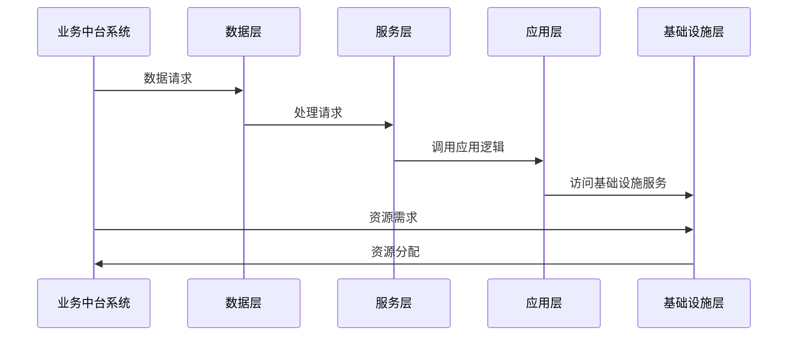
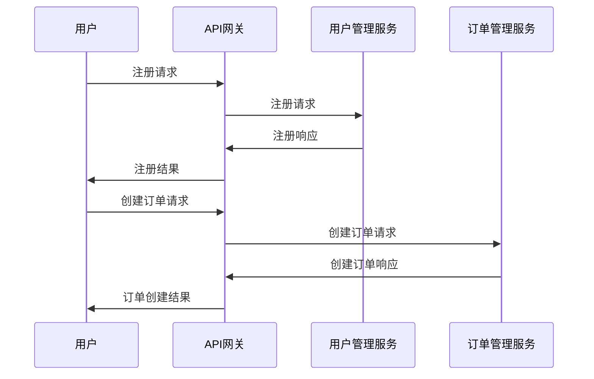

                 


### 第一部分：中台建设基础

#### 第1章：中台概述

在信息技术飞速发展的今天，企业级中台作为数字化转型的核心驱动力，已经成为企业构建现代化IT架构的重要组成部分。本章节将深入探讨中台的概念、核心价值以及其在企业中的应用。

**1.1 什么是中台**

中台，顾名思义，是介于前台和后台之间的一个平台。它通过对数据、业务、技术的整合，提供标准化的服务，以支撑企业前台业务的快速创新和响应市场变化。中台的概念源于阿里巴巴，它通过将数据能力和业务能力模块化，实现了高效的数据共享和业务协同。

**1.1.1 中台的概念背景**

中台的提出，源于互联网企业面对快速变化的市场需求，需要快速响应和调整业务模式的需求。传统的后台系统由于功能固定，难以适应快速的业务变化。而中台通过模块化、标准化、组件化的方式，将数据、业务、技术能力抽象出来，形成了可复用的服务，极大地提高了企业的灵活性和响应速度。

**1.1.2 中台的核心价值**

中台的核心价值在于以下几点：

1. **提升业务灵活性**：中台通过提供标准化的服务，使得前台业务可以快速组合和调整，从而快速响应市场需求。
2. **优化资源利用**：中台通过数据和技术能力的共享，避免了重复建设，提高了资源利用效率。
3. **降低开发成本**：中台提供的基础服务和组件，可以减少前台业务开发的复杂度，降低开发成本。
4. **提高数据质量**：中台通过数据治理，确保数据的一致性和准确性，提高了数据质量。

**1.1.3 中台与前台、后台的关系**

中台作为企业级架构的重要组成部分，与前台和后台有着紧密的联系。

- **前台**：前台是企业与用户直接交互的界面，如电商平台、移动应用等。中台为前台提供标准化的数据和服务，使得前台可以快速迭代和创新。
- **后台**：后台是企业内部管理和服务支持系统，如ERP、CRM等。中台通过整合后台的数据和技术能力，为前台提供支持，同时也可以支撑后台的业务需求。

**1.2 中台的发展历程**

中台的概念并非一蹴而就，而是经历了多年的发展。

- **萌芽期**：在互联网企业的发展初期，中台的概念就已经初露端倪。企业通过构建一些通用的服务模块，来实现业务的快速响应。
- **发展期**：随着云计算、大数据、微服务等技术的发展，中台逐渐成为企业数字化转型的核心驱动力。企业开始大力投入中台建设，以提高业务灵活性和响应速度。
- **成熟期**：当前，中台已经成为企业级架构的重要组成部分。越来越多的企业开始将中台理念融入到自身的IT架构中，以实现业务的持续创新和增长。

**1.2.1 从IT到中台的演变**

中台的演变，实际上是企业从IT驱动到业务驱动的转变。

- **IT驱动**：在传统IT架构中，IT部门是技术的提供者，业务部门是技术的使用者。这种模式导致IT和业务之间存在较大的隔阂，IT部门难以理解业务需求，业务部门也难以适应IT的限制。
- **业务驱动**：中台理念下，IT部门不再是技术的提供者，而是服务的提供者。业务部门可以自由地使用中台提供的服务，进行业务创新和调整。这种模式大大缩短了IT和业务之间的距离，提高了企业的整体效率。

**1.2.2 中台在不同行业的应用**

中台在不同行业中有着广泛的应用，以下是几个典型的应用场景：

- **电商行业**：中台可以帮助电商企业实现业务模块的快速组合和调整，从而快速响应市场需求。
- **金融行业**：中台可以帮助金融机构实现业务创新，提高业务效率，同时确保数据安全和合规。
- **制造行业**：中台可以帮助制造企业实现生产数据的实时监控和分析，提高生产效率和产品质量。
- **零售行业**：中台可以帮助零售企业实现线上线下融合，提高客户体验和满意度。

**1.2.3 中台建设的趋势分析**

随着数字化转型的深入，中台建设呈现出以下趋势：

- **平台化**：越来越多的企业将中台建设作为一个整体平台，实现数据的统一管理和服务的统一提供。
- **云原生**：随着云计算技术的发展，中台建设逐渐向云原生架构转型，以提高系统的弹性、可扩展性和可靠性。
- **智能化**：中台将逐渐融入人工智能技术，实现数据的智能分析和决策，提高业务智能化水平。
- **生态化**：中台将逐渐形成生态系统，与外部合作伙伴紧密协作，实现资源的共享和共赢。

#### 第2章：中台的分类与架构

中台根据其应用场景和功能不同，可以分为业务中台和数据中台。本章将详细介绍这两种中台的分类和架构设计。

**2.1 业务中台**

业务中台主要关注业务能力的构建和整合，为前台业务提供标准化的服务。

**2.1.1 业务中台的核心功能**

业务中台的核心功能包括：

- **业务能力封装**：将业务能力模块化，提供标准化的服务接口，便于前台业务快速调用。
- **业务流程管理**：提供业务流程管理功能，实现业务流程的自动化和智能化。
- **业务数据分析**：通过数据分析和挖掘，提供业务洞察，支持业务决策。
- **业务服务共享**：提供业务服务的共享功能，避免重复建设和资源浪费。

**2.1.2 业务中台的架构设计**

业务中台的架构设计主要包括以下几个层次：

- **基础设施层**：提供计算、存储、网络等基础设施服务。
- **数据层**：提供数据存储、数据治理、数据分析和数据挖掘等功能。
- **服务层**：提供业务能力的封装和服务的共享。
- **应用层**：提供业务应用开发和运行的环境。

**2.2 数据中台**

数据中台主要关注数据的收集、存储、处理和分析，为业务中台提供数据支持。

**2.2.1 数据中台的核心功能**

数据中台的核心功能包括：

- **数据采集**：提供数据采集的功能，从各种数据源中获取数据。
- **数据存储**：提供数据存储的功能，确保数据的安全性和可靠性。
- **数据处理**：提供数据处理的功能，包括数据清洗、数据转换、数据集成等。
- **数据分析**：提供数据分析的功能，支持数据的实时分析和历史数据查询。

**2.2.2 数据中台的架构设计**

数据中台的架构设计主要包括以下几个层次：

- **数据接入层**：提供数据接入的功能，包括数据采集、数据传输等。
- **数据存储层**：提供数据存储的功能，包括关系型数据库、NoSQL数据库、数据仓库等。
- **数据处理层**：提供数据处理的功能，包括数据清洗、数据转换、数据集成等。
- **数据应用层**：提供数据分析和数据挖掘的功能，支持业务决策和预测。

通过以上对业务中台和数据中台的介绍，我们可以看到，中台作为企业级架构的核心，不仅涵盖了业务能力的构建和整合，还涉及数据的收集、存储、处理和分析。中台的分类和架构设计，为企业提供了强大的支持，使得企业能够快速响应市场需求，实现业务的持续创新和增长。

#### 第3章：中台建设的关键要素

中台建设是一项复杂的系统性工程，涉及到技术、组织、流程等多个方面的内容。要成功建设一个高效、稳定的中台，需要关注以下几个关键要素。

**3.1 技术选型**

技术选型是中台建设的基础，直接影响到中台的性能、可扩展性和维护成本。以下是几个关键的技术选型标准：

- **开放性**：选择开放的技术和标准，有利于系统的灵活扩展和组件的替换。
- **高可用性**：确保系统的高可用性，减少系统故障对业务的影响。
- **高性能**：系统需要具备高性能，能够快速响应用户请求，处理大量数据。
- **可扩展性**：系统需要具备良好的可扩展性，能够支持业务量的增长和需求的变化。
- **安全性**：确保系统的安全性，防止数据泄露和系统攻击。

在技术选型过程中，还需要关注以下常用技术栈：

- **前端技术**：如React、Vue等前端框架，用于构建用户界面。
- **后端技术**：如Spring Boot、Django等后端框架，用于处理业务逻辑。
- **数据库技术**：如MySQL、MongoDB、Redis等，用于存储数据。
- **中间件技术**：如Kafka、RabbitMQ等，用于消息传递。
- **大数据技术**：如Hadoop、Spark等，用于数据处理和分析。

**3.2 组织架构调整**

中台建设需要打破传统的部门壁垒，实现跨部门的协同工作。因此，组织架构调整是中台建设的重要一环。以下是几个关键点：

- **打破部门壁垒**：将原本分散在不同部门的资源和职责整合到一起，实现业务的集中管理。
- **设立中台部门**：在企业内部设立专门的中台部门，负责中台的设计、建设和运营。
- **职能角色定位**：明确中台部门和其他部门的职能角色，确保各部门之间的协同和配合。
- **人员配备**：招聘和培养具备中台建设和管理经验的专业人才，提升团队的整体能力。

**3.2.1 中台建设对组织架构的影响**

中台建设对组织架构的影响主要体现在以下几个方面：

- **部门重构**：传统的部门职能可能需要进行调整和重组，以适应中台的建设需求。
- **职能转变**：中台部门将从传统的技术支持角色，转变为业务驱动的服务提供者。
- **人员流动**：中台建设需要大量的专业人才，可能需要进行内部人员的流动和调整。
- **文化变革**：中台建设需要企业内部形成一种开放、协作、创新的文化氛围。

**3.2.2 组织架构调整的最佳实践**

以下是一些组织架构调整的最佳实践：

- **试点先行**：在局部范围内进行试点，积累经验和教训，为全面推广做好准备。
- **充分沟通**：与各部门进行充分的沟通，了解他们的需求和顾虑，确保调整方案的可行性和接受度。
- **分阶段实施**：根据项目的实际情况，分阶段实施组织架构调整，避免一次性调整带来的风险。
- **培训与支持**：为员工提供培训和支持，帮助他们适应新的组织架构和工作方式。

**3.3 流程优化**

中台建设不仅仅是技术上的变革，还需要对业务流程进行优化，以提高业务的效率和质量。以下是几个关键点：

- **流程梳理**：对现有的业务流程进行全面的梳理和优化，找出瓶颈和优化点。
- **流程自动化**：通过自动化工具和技术，实现业务流程的自动化，减少人工干预。
- **流程监控**：建立流程监控机制，实时跟踪业务流程的运行情况，及时发现和解决问题。
- **流程改进**：基于业务数据和用户反馈，不断改进业务流程，提高业务效率和用户满意度。

**3.3.1 流程梳理**

流程梳理是中台建设的重要一环，以下是一些具体的步骤和方法：

- **业务流程地图**：绘制业务流程地图，明确流程的起点、终点和关键节点。
- **流程文档**：编写详细的流程文档，包括流程描述、流程图、角色职责等。
- **流程评审**：组织专家和业务人员进行流程评审，识别和优化流程中的问题和瓶颈。

**3.3.2 流程自动化**

流程自动化是中台建设的重要目标之一，以下是一些实现流程自动化的方法和工具：

- **工作流引擎**：使用工作流引擎，如BPMN（Business Process Model and Notation），实现业务流程的自动化。
- **脚本和代码**：使用脚本语言或代码，自动化执行业务流程中的操作。
- **API集成**：通过API集成，实现不同系统之间的自动化交互。

**3.3.3 流程监控**

流程监控是确保业务流程正常运行的重要手段，以下是一些具体的监控方法和工具：

- **实时监控**：通过实时监控工具，如Prometheus、Grafana，实时跟踪业务流程的运行状态。
- **日志分析**：通过日志分析工具，如ELK（Elasticsearch、Logstash、Kibana），分析业务流程中的错误和异常。
- **告警机制**：建立告警机制，实时通知相关人员业务流程中的问题。

**3.3.4 流程改进**

流程改进是基于业务数据和用户反馈，持续优化业务流程。以下是一些流程改进的方法和工具：

- **数据分析**：通过数据分析，识别业务流程中的问题和瓶颈。
- **用户反馈**：收集用户反馈，了解用户对业务流程的满意度，找出改进的方向。
- **持续迭代**：基于数据和用户反馈，持续优化业务流程，提高业务效率和用户满意度。

通过以上对中台建设关键要素的详细探讨，我们可以看到，中台建设不仅仅是技术上的变革，还需要在组织架构、流程优化等方面进行全面的调整和优化。只有全面关注这些关键要素，才能确保中台建设成功，为企业带来实际的价值。

#### 第4章：数据治理

数据治理是中台建设中的核心环节，它涉及到数据的收集、存储、处理、分析和应用等多个方面。有效的数据治理能够确保数据的质量、安全性和合规性，从而为企业的业务决策提供可靠的数据支持。

**4.1 数据治理概述**

**4.1.1 数据治理的概念**

数据治理是一个系统性的过程，它涉及对数据的全生命周期管理，包括数据的质量管理、安全管理、合规性管理等。数据治理的目标是确保数据的一致性、准确性、完整性和可用性，从而提高数据的价值和使用效率。

**4.1.2 数据治理的重要性**

数据治理的重要性体现在以下几个方面：

- **提高数据质量**：通过数据治理，可以识别和修复数据中的错误，提高数据的一致性和准确性，从而保证数据的价值。
- **确保数据安全**：数据治理包括数据安全策略的制定和执行，可以有效防范数据泄露和非法访问，保护企业数据的安全。
- **满足合规要求**：数据治理可以帮助企业遵守相关的法律法规和行业标准，确保数据的合法合规使用。
- **支持业务决策**：高质量的数据是业务决策的基础，有效的数据治理可以为企业提供准确、可靠的数据支持，促进业务的发展和创新。

**4.1.3 数据治理的关键环节**

数据治理的关键环节包括：

- **数据质量管理**：确保数据的准确性、一致性、完整性和及时性。
- **数据安全管理**：保护数据的安全性，包括数据的访问控制、加密、备份等。
- **数据合规管理**：确保数据的合规性，符合相关的法律法规和行业标准。
- **数据监控与审计**：实时监控数据的运行状态，定期进行审计，确保数据治理的有效性。

**4.2 数据质量管理**

数据质量管理是数据治理的重要组成部分，它涉及到数据的收集、存储、处理和应用等各个环节。以下是数据质量管理的几个关键点：

- **数据质量标准**：制定数据质量标准，明确数据的质量要求和评价指标，如准确性、一致性、完整性、及时性等。
- **数据质量问题识别与处理**：定期对数据进行质量检查，识别数据中的问题，如重复数据、缺失数据、错误数据等，并采取相应的处理措施。
- **数据质量监控**：建立数据质量监控机制，实时跟踪数据的运行状态，及时发现和解决数据质量问题。
- **数据质量报告**：定期生成数据质量报告，向相关人员和部门提供数据质量状况的详细分析，为数据治理提供决策支持。

**4.2.1 数据质量标准**

数据质量标准是数据质量管理的基石，它为数据质量评估提供了量化的依据。以下是几个常见的数据质量标准：

- **准确性**：数据是否真实反映客观事实，如客户地址是否正确、交易金额是否准确等。
- **一致性**：数据在不同系统、不同部门之间是否保持一致，如客户信息在各个系统中的名称和地址是否一致。
- **完整性**：数据是否完整，没有缺失的部分，如订单数据是否包含所有的字段信息。
- **及时性**：数据是否能够及时更新和传递，如库存数据是否能够实时反映库存状态。
- **可验证性**：数据是否可以通过外部数据源进行验证，如通过身份证号码验证个人信息是否真实有效。

**4.2.2 数据质量问题识别与处理**

数据质量问题的识别与处理是数据质量管理的重要环节。以下是几个常用的方法和工具：

- **数据质量检查**：使用数据质量检查工具，对数据进行自动检查，识别数据中的问题。
- **数据清洗**：使用数据清洗工具，对数据进行清洗和修复，如删除重复数据、填充缺失数据、修正错误数据等。
- **数据质量分析**：使用数据质量分析工具，对数据质量问题进行深入分析，找出问题的根本原因。
- **数据质量监控**：建立数据质量监控机制，实时跟踪数据的运行状态，及时发现和解决数据质量问题。

**4.2.3 数据质量监控**

数据质量监控是确保数据质量长期稳定的重要手段。以下是几个数据质量监控的关键点：

- **监控指标**：制定监控指标，如数据准确性、一致性、完整性、及时性等，对数据质量进行量化评估。
- **监控工具**：使用监控工具，如数据质量管理平台、日志分析工具等，实时跟踪数据的运行状态。
- **异常告警**：设置异常告警机制，当数据质量指标低于设定阈值时，自动触发告警，通知相关人员处理。
- **数据质量报告**：定期生成数据质量报告，分析数据质量状况，为数据治理提供决策支持。

**4.3 数据安全与隐私**

数据安全与隐私是数据治理的重要方面，它关系到企业的声誉和利益。以下是数据安全与隐私管理的关键点：

**4.3.1 数据安全策略**

数据安全策略是企业保护数据安全的基本规范，包括以下内容：

- **数据访问控制**：制定数据访问控制策略，确保只有授权人员才能访问敏感数据。
- **数据加密**：对敏感数据进行加密，防止数据泄露和非法访问。
- **数据备份与恢复**：制定数据备份和恢复策略，确保数据的安全性和可用性。
- **安全审计**：建立安全审计机制，定期审查数据安全策略的执行情况。

**4.3.2 数据安全保护措施**

以下是几种常见的数据安全保护措施：

- **物理安全**：确保物理环境的保护，如数据中心的门禁控制、监控设备等。
- **网络安全**：保护网络的安全，如防火墙、入侵检测系统等。
- **系统安全**：保护操作系统的安全，如安装补丁、定期扫描等。
- **数据脱敏**：对敏感数据进行脱敏处理，防止敏感信息泄露。

**4.3.3 数据隐私保护**

数据隐私保护是符合相关法律法规和行业标准的要求，以下是一些数据隐私保护的关键点：

- **隐私法律法规**：了解和遵守相关的隐私法律法规，如《中华人民共和国网络安全法》、《通用数据保护条例》（GDPR）等。
- **隐私保护策略**：制定隐私保护策略，明确数据收集、存储、处理和使用的规则。
- **隐私保护技术**：使用隐私保护技术，如数据加密、数据匿名化等，保护个人隐私。
- **隐私保护培训**：对员工进行隐私保护培训，提高员工的隐私保护意识。

通过以上对数据治理的详细探讨，我们可以看到，数据治理是中台建设的重要环节，它涉及到数据的质量管理、安全管理和隐私保护等多个方面。只有通过有效的数据治理，才能确保数据的准确、安全、合规，为企业提供可靠的数据支持，推动业务的持续发展。

### 第三部分：业务中台实现

#### 第3章：服务编排

服务编排是业务中台实现的重要组成部分，它通过对业务流程和服务组件的整合，实现业务流程的自动化和智能化。本章将详细介绍服务编排的概念、框架以及实现方法。

**3.1 服务编排概述**

**3.1.1 服务编排的概念**

服务编排（Service Orchestration）是指通过将多个服务组件按照一定的逻辑和顺序组合起来，形成一个完整的业务流程。服务编排的核心目标是提高业务流程的灵活性和可扩展性，使得企业可以快速响应市场变化和业务需求。

**3.1.2 服务编排的优势**

服务编排具有以下几个显著优势：

- **提高业务灵活性**：通过服务编排，企业可以灵活地调整业务流程，快速响应市场变化。
- **降低开发成本**：服务编排将多个服务组件组合起来，减少了重复开发的工作量，降低了开发成本。
- **提高系统稳定性**：服务编排通过自动化和标准化，减少了人工干预，提高了系统的稳定性。
- **提高业务效率**：服务编排可以实现业务流程的自动化，提高业务处理速度，降低人力成本。

**3.1.3 服务编排的常用场景**

服务编排广泛应用于以下几个场景：

- **业务流程自动化**：将多个业务操作组合成一个自动化流程，提高业务处理效率。
- **跨系统集成**：将不同系统中的服务组件整合起来，实现跨系统的业务流程。
- **事件驱动架构**：基于事件触发服务执行，实现动态的业务流程编排。
- **弹性扩展**：根据业务需求，动态调整服务组件的执行顺序和资源分配。

**3.2 服务编排框架**

服务编排框架是服务编排的核心，它定义了服务编排的基本组件和运作机制。以下是典型的服务编排框架设计：

**3.2.1 服务编排框架设计**

服务编排框架通常包括以下几个核心组件：

1. **服务注册中心**：服务注册中心是服务编排的核心组件，它负责管理和维护服务列表，提供服务的注册、发现和调用功能。
2. **工作流引擎**：工作流引擎是服务编排的逻辑核心，它负责解析业务流程定义，按照预定的顺序执行服务组件。
3. **服务组件**：服务组件是业务流程中的具体执行单元，它们可以是API接口、数据库操作、消息队列处理等。
4. **监控与告警系统**：监控与告警系统负责实时监控业务流程的运行状态，当发生异常时，自动触发告警通知相关人员。

**3.2.1.1 服务编排的核心组件**

- **服务注册中心**：服务注册中心是服务编排的核心组件，它通常采用服务发现机制，如DNS、ZooKeeper、Consul等。服务注册中心负责维护服务列表，提供服务的注册、发现和调用功能。

- **工作流引擎**：工作流引擎是服务编排的逻辑核心，它负责解析业务流程定义，按照预定的顺序执行服务组件。常见的工作流引擎有Apache ODE、jBPM、Activiti等。

- **服务组件**：服务组件是业务流程中的具体执行单元，它们可以是API接口、数据库操作、消息队列处理等。服务组件通过服务注册中心发现其他服务，实现跨系统的服务调用。

- **监控与告警系统**：监控与告警系统负责实时监控业务流程的运行状态，当发生异常时，自动触发告警通知相关人员。常见的监控工具包括Prometheus、Grafana、ELK（Elasticsearch、Logstash、Kibana）等。

**3.2.1.2 服务编排的工作流程**

服务编排的工作流程通常包括以下几个步骤：

1. **服务注册**：服务组件在启动时，向服务注册中心注册自身信息，包括服务名称、接口地址、版本号等。
2. **业务流程定义**：开发人员使用工作流引擎提供的工具或API，定义业务流程的执行逻辑，包括服务调用顺序、参数传递等。
3. **业务流程执行**：工作流引擎根据业务流程定义，按照预定的顺序执行服务组件，实现业务流程的自动化。
4. **服务调用**：服务组件在执行过程中，通过服务注册中心发现其他服务，实现跨系统的服务调用。
5. **监控与告警**：监控与告警系统实时监控业务流程的运行状态，当发生异常时，自动触发告警通知相关人员。

**3.3 服务编排实现**

服务编排的实现主要包括服务注册中心、工作流引擎和监控与告警系统的搭建和配置。

**3.3.1 服务注册中心实现**

服务注册中心是服务编排的核心组件，以下是常见的服务注册中心实现方法：

1. **使用DNS**：通过DNS记录，将服务地址和服务名称进行映射，实现服务发现。这种方式简单易用，但适用于服务数量较少的场景。
2. **使用ZooKeeper**：ZooKeeper是一个分布式协调服务，可以实现服务的注册、发现和监控。适用于大规模分布式系统的服务编排。
3. **使用Consul**：Consul是一个开源的分布式服务发现工具，支持服务注册、发现、监控和健康检查。适用于高可用性和高可靠性的服务编排场景。

**3.3.2 工作流引擎实现**

工作流引擎是实现服务编排逻辑的核心，以下是常见的工作流引擎实现方法：

1. **Apache ODE**：Apache ODE是一个开源的工作流管理系统，支持BPEL（Business Process Execution Language）规范的业务流程定义。适用于复杂的业务流程编排。
2. **jBPM**：jBPM是一个开源的业务流程管理平台，支持流程定义、流程执行和流程监控。适用于中大型业务系统的服务编排。
3. **Activiti**：Activiti是一个轻量级的开源工作流引擎，支持流程定义、流程执行和流程管理。适用于中小型业务系统的服务编排。

**3.3.3 监控与告警系统实现**

监控与告警系统是确保服务编排正常运行的重要手段，以下是常见的监控与告警系统实现方法：

1. **Prometheus**：Prometheus是一个开源的监控告警工具，支持服务监控、告警通知和数据可视化。适用于大规模分布式系统的监控。
2. **Grafana**：Grafana是一个开源的数据可视化工具，支持各种数据源，可以与Prometheus集成，实现监控数据可视化。
3. **ELK**：ELK（Elasticsearch、Logstash、Kibana）是一个开源的日志分析平台，可以收集、存储和可视化业务日志，实现监控告警。

**3.3.4 服务编排实践案例**

以下是一个简单的服务编排实践案例：

1. **环境准备**：搭建服务注册中心（Consul）、工作流引擎（Activiti）和监控与告警系统（Prometheus+Grafana）。
2. **服务注册**：服务组件在启动时，向Consul注册自身信息。
3. **业务流程定义**：使用Activiti定义一个简单的业务流程，包括两个服务组件：查询用户信息和更新用户信息。
4. **业务流程执行**：通过Activiti执行业务流程，调用注册在Consul中的服务组件。
5. **监控与告警**：Prometheus监控业务流程的运行状态，当出现异常时，自动触发告警通知。

通过以上对服务编排的详细介绍和实践案例，我们可以看到，服务编排是业务中台实现的关键技术之一，它通过将服务组件和业务流程整合，实现了业务流程的自动化和智能化，为企业提供了高效的业务支持。

#### 第4章：API网关

API网关是业务中台架构中的核心组件，它负责处理所有的外部API请求，提供统一的服务入口和出口。本章将详细介绍API网关的概念、架构以及实现方法。

**4.1 API网关概述**

**4.1.1 API网关的概念**

API网关（API Gateway）是一个统一的外部接口，它位于客户端和内部服务之间，负责处理所有的外部请求。API网关不仅可以作为服务调用的入口，还可以提供路由、认证、日志、监控等功能，从而简化系统的架构，提高系统的可维护性和可扩展性。

**4.1.2 API网关的作用**

API网关的作用主要包括以下几个方面：

- **路由与负载均衡**：API网关可以根据请求的路径、参数等信息，将请求路由到对应的后端服务，并实现负载均衡，提高系统的性能和可用性。
- **认证与授权**：API网关可以提供统一的认证和授权机制，确保只有授权的用户和系统能够访问内部服务。
- **日志与监控**：API网关可以记录所有的API请求和响应信息，提供日志和监控功能，方便系统的管理和维护。
- **服务治理**：API网关可以对后端服务进行统一管理和配置，如服务版本管理、服务熔断和降级等。

**4.2 API网关的架构**

API网关的架构通常包括以下几个层次：

1. **入口层**：负责接收和解析客户端的请求，如HTTP请求、RESTful API等。
2. **路由层**：根据请求的路径、参数等信息，将请求路由到对应的后端服务。
3. **认证与授权层**：对请求进行认证和授权，确保只有授权的用户和系统能够访问内部服务。
4. **服务层**：与后端服务进行交互，处理具体的业务逻辑。
5. **监控与日志层**：记录所有的API请求和响应信息，提供日志和监控功能。

**4.3 API网关的实现方法**

API网关的实现方法多种多样，以下介绍几种常见的实现方法：

**4.3.1 使用现成的API网关产品**

现成的API网关产品通常具有丰富的功能和完善的文档，可以快速搭建和部署。常见的API网关产品包括Kong、Apache APISIX、Spring Cloud Gateway等。

1. **Kong**：Kong是一个开源的API网关，支持基于Lua脚本的路由、认证、限流等功能。适用于大规模分布式系统的API网关实现。
2. **Apache APISIX**：Apache APISIX是一个高性能、可扩展的API网关，支持HTTP/1.1、HTTP/2、Websocket等多种协议。适用于高性能和高可用的API网关场景。
3. **Spring Cloud Gateway**：Spring Cloud Gateway是Spring Cloud生态系统的一部分，提供了一个基于Spring WebFlux和项目中立的API网关。适用于Spring生态系统中的API网关实现。

**4.3.2 自定义API网关实现**

自定义API网关实现可以根据具体业务需求进行灵活定制，以下是一个简单的自定义API网关实现示例：

1. **环境准备**：搭建一个基于Spring Boot的Web应用，作为API网关。
2. **入口层**：使用Spring Boot的`@RestController`注解，接收和解析客户端的HTTP请求。
3. **路由层**：使用Spring Boot的`@RequestMapping`注解，根据请求的路径、参数等信息，将请求路由到对应的后端服务。
4. **认证与授权层**：使用Spring Security等安全框架，对请求进行认证和授权，确保只有授权的用户和系统能够访问内部服务。
5. **服务层**：与后端服务进行交互，处理具体的业务逻辑。
6. **监控与日志层**：使用Spring Boot的`@Slf4j`注解，记录所有的API请求和响应信息，提供日志和监控功能。

**4.4 API网关的实践案例**

以下是一个简单的API网关实践案例：

1. **环境准备**：搭建一个基于Spring Boot的API网关应用，并引入Spring Cloud Gateway依赖。
2. **配置路由规则**：在配置文件中配置路由规则，将请求路由到对应的后端服务。
   ```yaml
   spring:
     cloud:
       gateway:
         routes:
           - id: user-service
             uri: lb://user-service
             predicates:
               - Path=/user/**
             filters:
               - StripPrefix=1
   ```
3. **认证与授权**：使用Spring Security配置认证和授权规则，确保只有授权的用户和系统能够访问内部服务。
4. **监控与日志**：集成Prometheus和Grafana，实现API请求的监控和日志分析。

通过以上对API网关的详细介绍和实践案例，我们可以看到，API网关是业务中台架构中的重要组件，它通过统一的外部接口，简化了系统的架构，提高了系统的可维护性和可扩展性。在业务中台的实现过程中，API网关发挥着至关重要的作用。

#### 第5章：业务中台系统功能设计

业务中台作为企业级架构的重要组成部分，其系统功能设计至关重要。本章将详细探讨业务中台的系统功能设计，包括领域模型、系统架构、接口设计和系统交互，并使用Mermaid等工具进行展示。

**5.1 领域模型设计**

领域模型是业务中台设计的基础，它定义了业务中台的核心实体和关系。以下是业务中台的领域模型设计：

**5.1.1 核心实体**

- **用户**：用户的个人资料，包括用户名、密码、邮箱、电话等。
- **商品**：商品的详细信息，包括商品ID、名称、价格、库存等。
- **订单**：订单的详细信息，包括订单ID、用户ID、商品ID、数量、总金额等。
- **库存**：商品的库存信息，包括商品ID、库存数量等。

**5.1.2 实体关系**

以下是业务中台核心实体的ER实体关系图，使用Mermaid工具绘制：

```mermaid
erDiagram
    User ||--|{ Order : creates }|
    Product ||--|{ Order : contains }|
    Inventory ||--|{ Product : manages }|
```

**5.2 系统架构设计**

业务中台的系统架构设计决定了系统的性能、可扩展性和维护性。以下是业务中台的系统架构设计：

**5.2.1 系统层次结构**

业务中台的系统层次结构通常包括以下层次：

- **基础设施层**：提供计算、存储、网络等基础设施服务。
- **数据层**：提供数据存储、数据治理、数据分析和数据挖掘等功能。
- **服务层**：提供业务能力的封装和服务的共享。
- **应用层**：提供业务应用开发和运行的环境。

**5.2.2 系统架构图**

以下是业务中台的系统架构图，使用Mermaid工具绘制：



**5.3 接口设计**

业务中台的接口设计是系统功能实现的关键，它定义了系统与外部交互的方式。以下是业务中台的核心接口设计：

**5.3.1 用户管理接口**

- **注册用户**：POST /user/register
- **登录用户**：POST /user/login
- **查询用户信息**：GET /user/{userId}

**5.3.2 商品管理接口**

- **添加商品**：POST /product
- **查询商品列表**：GET /product
- **查询商品详情**：GET /product/{productId}

**5.3.3 订单管理接口**

- **创建订单**：POST /order
- **查询订单列表**：GET /order
- **查询订单详情**：GET /order/{orderId}

**5.4 系统交互**

业务中台的系统交互决定了系统的可靠性和用户体验。以下是业务中台的核心系统交互流程：

**5.4.1 用户注册交互**

1. 用户通过前端发送注册请求到API网关。
2. API网关将请求转发到用户管理服务。
3. 用户管理服务对用户信息进行校验和处理，将结果返回给API网关。
4. API网关将注册结果返回给前端，完成用户注册。

**5.4.2 订单创建交互**

1. 用户通过前端发送创建订单请求到API网关。
2. API网关将请求转发到订单管理服务。
3. 订单管理服务根据商品库存信息生成订单，将订单数据存储到数据库。
4. 订单管理服务将订单创建结果返回给API网关。
5. API网关将订单创建结果返回给前端，完成订单创建。

**5.4.3 系统交互图**

以下是业务中台的核心系统交互图，使用Mermaid工具绘制：



通过以上对业务中台系统功能设计的详细探讨，我们可以看到，业务中台的系统功能设计是确保系统性能、可扩展性和维护性的关键。领域模型、系统架构、接口设计和系统交互的设计都需要精心规划，以确保业务中台能够高效、稳定地运行，为企业提供强大的业务支持。

### 第6章：项目实战

为了更好地理解企业级中台建设的实践，我们将通过一个具体的案例进行详细讲解。本章节将涵盖环境安装、系统核心实现、代码解读和分析，以及项目案例分析。

**6.1 环境安装**

在中台建设过程中，环境安装是第一步，也是至关重要的一步。以下是一个典型的环境安装步骤：

1. **安装Java环境**：由于大多数中台系统是基于Java技术栈，首先需要安装Java环境。可以使用OpenJDK或者Oracle JDK。例如，使用`brew cask install java`在MacOS上安装Java。
2. **安装数据库**：选择合适的数据库系统，如MySQL、PostgreSQL等。可以使用Docker安装数据库，例如使用以下命令安装MySQL：

   ```shell
   docker run --name some-mysql -e MYSQL_ROOT_PASSWORD=my-secret-pw -d mysql
   ```

3. **安装消息队列**：选择消息队列系统，如Kafka、RabbitMQ等。同样可以使用Docker安装Kafka：

   ```shell
   docker run --name some-kafka -e KAFKA_ZOOKEEPER_CONNECT=127.0.0.1:2181 -e KAFKA_BROKER_ID=0 -e KAFKAautomaten_PORT=9092 -d eclipse-mosquitto
   ```

4. **安装API网关**：例如，可以使用Spring Cloud Gateway。通过Maven安装其依赖：

   ```xml
   <dependencies>
       <dependency>
           <groupId>org.springframework.cloud</groupId>
           <artifactId>spring-cloud-starter-gateway</artifactId>
       </dependency>
   </dependencies>
   ```

**6.2 系统核心实现**

以下是一个简化的业务中台系统核心实现：

**6.2.1 用户管理模块**

用户管理模块负责用户的注册、登录以及信息管理。

- **用户注册**：

  ```java
  @RestController
  public class UserController {
  
      @Autowired
      private UserService userService;
  
      @PostMapping("/register")
      public ResponseEntity<?> registerUser(@RequestBody UserRequestDTO userRequestDTO) {
          User user = userService.registerUser(userRequestDTO);
          return ResponseEntity.ok(user);
      }
  }
  ```

- **用户登录**：

  ```java
  @PostMapping("/login")
  public ResponseEntity<?> loginUser(@RequestBody LoginRequestDTO loginRequestDTO) {
      String token = authenticationManager.authenticate(loginRequestDTO);
      return ResponseEntity.ok(new JwtResponse(token));
  }
  ```

**6.2.2 商品管理模块**

商品管理模块负责商品信息的增删改查。

- **商品添加**：

  ```java
  @RestController
  public class ProductController {
  
      @Autowired
      private ProductService productService;
  
      @PostMapping("/product")
      public ResponseEntity<?> createProduct(@RequestBody ProductRequestDTO productRequestDTO) {
          Product product = productService.createProduct(productRequestDTO);
          return ResponseEntity.ok(product);
      }
  }
  ```

**6.2.3 订单管理模块**

订单管理模块负责订单的创建和查询。

- **订单创建**：

  ```java
  @RestController
  public class OrderController {
  
      @Autowired
      private OrderService orderService;
  
      @PostMapping("/order")
      public ResponseEntity<?> createOrder(@RequestBody OrderRequestDTO orderRequestDTO) {
          Order order = orderService.createOrder(orderRequestDTO);
          return ResponseEntity.ok(order);
      }
  }
  ```

**6.3 代码解读与分析**

以下是对核心代码的解读和分析：

**6.3.1 用户管理模块分析**

- `UserController`：负责用户注册和登录接口的实现。通过调用`UserService`进行用户信息的存储和处理。
- `UserService`：提供用户注册的方法，将用户信息存储到数据库，并生成JWT令牌。

**6.3.2 商品管理模块分析**

- `ProductController`：负责商品添加接口的实现。通过调用`ProductService`创建商品对象，并存储到数据库。
- `ProductService`：提供创建商品的方法，进行商品信息的校验和存储。

**6.3.3 订单管理模块分析**

- `OrderController`：负责订单创建接口的实现。通过调用`OrderService`创建订单对象，并处理订单商品库存的扣减。
- `OrderService`：提供创建订单的方法，处理订单信息生成和库存扣减。

**6.4 项目案例分析**

以下是项目案例分析：

**6.4.1 项目背景**

某电商公司希望在现有系统中构建一个业务中台，以提升业务灵活性、降低开发成本和提高数据利用效率。

**6.4.2 项目目标**

- 构建用户管理、商品管理、订单管理三大核心模块。
- 实现API网关，提供统一的服务入口和出口。
- 集成消息队列，实现模块之间的异步通信。

**6.4.3 项目实施过程**

1. **需求分析**：与业务团队紧密合作，明确项目需求和功能点。
2. **技术选型**：选择Spring Boot、MySQL、Kafka等技术栈。
3. **架构设计**：设计业务中台的系统架构，包括领域模型、接口设计和系统交互。
4. **开发与测试**：按模块进行开发，并进行单元测试和集成测试。
5. **部署与运维**：将系统部署到生产环境，并进行监控和运维。

**6.4.4 项目小结**

- 项目成功构建了业务中台，实现了用户管理、商品管理和订单管理模块。
- 通过API网关，实现了统一的服务入口和出口，提高了系统的安全性。
- 集成消息队列，实现了模块之间的异步通信，提高了系统的性能和可靠性。

通过以上项目实战的详细讲解，我们可以看到，企业级中台建设需要综合考虑技术、业务和架构等多个方面，通过合理的规划和实践，才能实现系统的成功建设。

### 第7章：最佳实践与小结

在中台建设过程中，积累最佳实践是非常重要的，它能够帮助企业避免常见问题，提高项目成功率。以下是一些关键的最佳实践和注意事项。

**最佳实践**

1. **顶层设计先行**：在进行中台建设之前，应首先进行顶层设计，明确中台的目标、架构和关键模块，避免后期频繁调整。
2. **模块化设计**：将中台的功能模块化，确保每个模块具有明确的职责和接口，便于后续的扩展和升级。
3. **数据治理先行**：数据治理是中台建设的关键，应确保数据的一致性、准确性和安全性。在进行数据治理之前，制定详细的数据标准和治理策略。
4. **微服务架构**：采用微服务架构，提高系统的灵活性和可扩展性，便于各个模块的独立开发和部署。
5. **API网关统一管理**：通过API网关实现统一的服务管理和路由，提高系统的安全性和可靠性，便于后期的维护和监控。
6. **持续集成与持续部署**：采用CI/CD流程，确保代码质量和部署效率，降低系统故障率和维护成本。
7. **监控与告警**：建立完善的监控和告警系统，实时跟踪系统的运行状态，及时发现和解决问题。

**注意事项**

1. **团队协作**：中台建设涉及多个部门和技术团队，应建立良好的沟通和协作机制，确保项目顺利进行。
2. **风险管理**：识别和评估项目风险，制定相应的风险应对策略，确保项目能够按时按质完成。
3. **性能优化**：在中台建设过程中，应注重性能优化，确保系统能够快速响应用户请求，提供高质量的服务。
4. **安全合规**：确保系统的安全性和合规性，遵守相关的法律法规和行业标准，保护用户数据和隐私。
5. **用户反馈**：积极收集用户反馈，不断优化系统功能和用户体验，提高用户满意度。

通过以上最佳实践和注意事项的指导，企业可以更有效地推进中台建设，实现业务的持续创新和增长。

### 拓展阅读

1. 《企业级中台架构设计与实践》——黄毅，详细介绍了中台的架构设计、技术选型和最佳实践。
2. 《微服务架构实战》——马丁·福勒，介绍了微服务架构的核心概念、设计模式和实施方法。
3. 《数据治理：实践指南》——迈克尔·贾维斯，提供了全面的数据治理策略和实施方法。
4. 《API设计规范》——雷·富兰克林，介绍了API设计的原则和最佳实践。

通过阅读以上书籍，读者可以进一步深入了解中台建设的相关知识，为实际项目提供有力的理论支持和实践指导。

---

**作者：** AI天才研究院/AI Genius Institute & 禅与计算机程序设计艺术 /Zen And The Art of Computer Programming

---

本文详细阐述了企业级中台建设的核心概念、技术实现、系统设计和实战案例，旨在为读者提供全面、系统的中台建设指导。通过本文的阅读，读者可以全面了解中台建设的理论基础和实践方法，为实际项目提供有力支持。在未来的数字化时代，中台建设将成为企业数字化转型的重要战略方向，本文将为读者在中台建设道路上提供宝贵的参考和启示。

