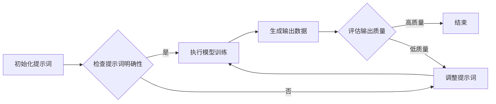
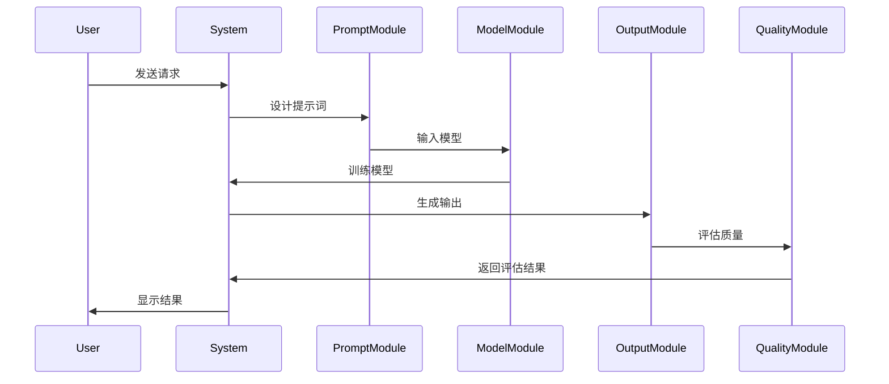
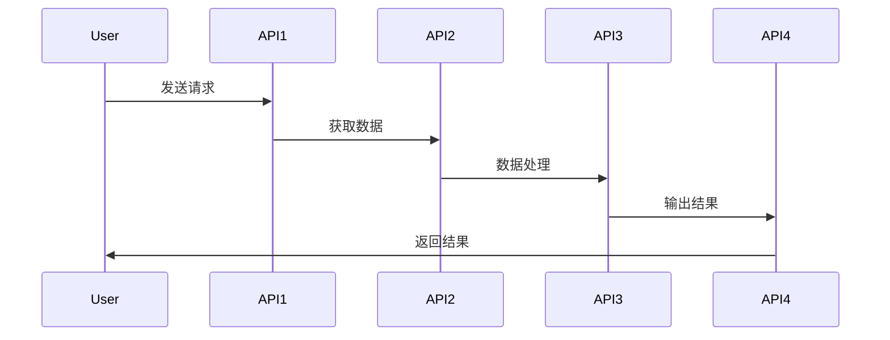

                 

# 优化提示词：提高AI输出质量的艺术

## 关键词
- 人工智能（AI）
- 提示词（Prompt）
- 输出质量（Output Quality）
- 自然语言处理（NLP）
- 机器学习（Machine Learning）

## 摘要
本文旨在探讨如何通过优化提示词来提升人工智能（AI）系统的输出质量。我们将首先介绍优化提示词的基本概念和重要性，然后深入分析核心概念和原理，探讨提升AI输出质量的多种技术手段。接着，我们将通过实际案例展示优化提示词在各个应用场景中的效果。最后，我们将探讨未来优化提示词的研究方向和挑战，并总结最佳实践和拓展阅读资源。

## 引言

### 1.1 优化提示词的概念

优化提示词（Optimized Prompting）是指通过调整输入的提示信息，使AI系统能够生成更加准确、丰富和有价值的输出。这些提示词可以是文本、图像、音频或其他形式的数据，用于引导AI模型的学习和决策过程。

### 1.2 人工智能输出质量的重要性

AI输出质量直接关系到系统的应用效果和用户体验。高质量的输出能够提高系统的可靠性和实用性，减少错误和误解，从而增强用户对AI系统的信任和依赖。

### 1.3 优化提示词的应用背景

随着AI技术的不断发展，AI系统在各个领域得到了广泛应用，如自然语言处理、计算机视觉、智能推荐等。在这些应用中，优化提示词显得尤为重要，因为它能够显著影响系统的性能和效果。

### 1.4 本文结构

本文将分为以下几个部分：

1. **核心概念和原理**：介绍优化提示词的基本概念、特点和作用。
2. **技术手段**：探讨提升AI输出质量的多种技术方法。
3. **实际应用**：通过案例研究展示优化提示词在不同领域的应用效果。
4. **未来趋势**：分析优化提示词的研究方向和挑战。
5. **总结与拓展**：总结优化提示词的最佳实践和拓展阅读资源。

## 核心概念和原理

### 2.1 优化提示词的定义和角色

优化提示词是指在AI系统输入阶段，用于引导模型学习的数据。这些提示词可以是预先定义好的，也可以是通过用户交互或环境感知动态生成的。

优化提示词在AI系统中的作用主要体现在以下几个方面：

1. **指导学习**：通过提供特定的提示词，帮助AI模型聚焦于特定任务或目标。
2. **提高准确性**：通过精细调整提示词，使AI模型能够更准确地理解和生成输出。
3. **增强丰富性**：通过丰富的提示信息，使AI系统能够生成更加多样化和有创造性的输出。

### 2.2 高质量AI输出的特征和标准

高质量AI输出应具备以下特征：

1. **准确性**：输出结果应与输入信息高度一致，减少错误和偏差。
2. **相关性**：输出结果应与用户需求或任务目标紧密相关，提供有价值的信息。
3. **丰富性**：输出结果应包含丰富的信息，避免单一和单调。
4. **可解释性**：输出结果应具有较好的可解释性，便于用户理解和验证。
5. **可靠性**：输出结果应具有较高的可靠性，减少不确定性。

为了评价AI输出质量，可以采用以下标准：

1. **准确性评估**：通过比较输出结果与真实值或标准答案的差异来评估准确性。
2. **相关性评估**：通过计算输出结果与用户需求的相关性指标来评估相关性。
3. **丰富性评估**：通过计算输出结果的多样性和创造性来评估丰富性。
4. **可解释性评估**：通过用户对输出结果的满意度和理解度来评估可解释性。
5. **可靠性评估**：通过计算输出结果的稳定性和一致性来评估可靠性。

### 2.3 不同类型提示词的对比

根据用途和形式，提示词可以分为以下几类：

1. **开放式提示词**：这类提示词允许用户自由输入，具有高度的灵活性和创造性。
2. **封闭式提示词**：这类提示词提供固定的选项或范围，用户只能从这些选项中选择，具有明确的限制和指导性。
3. **上下文提示词**：这类提示词基于用户的历史行为或环境信息进行动态生成，具有较强的相关性和针对性。
4. **多模态提示词**：这类提示词结合了文本、图像、音频等多种形式，能够提供更加丰富和多样化的输入。

不同类型的提示词在提升AI输出质量方面具有不同的优势和局限。例如，开放式提示词能够生成丰富的输出，但难以控制准确性和相关性；封闭式提示词能够提高准确性和可解释性，但可能限制创造性和灵活性。

### 2.4 提示词与AI输出质量的关系

优化提示词能够显著影响AI输出质量。通过以下方式，优化提示词能够提升输出质量：

1. **聚焦学习**：优化提示词可以帮助AI模型集中学习特定任务或目标，减少泛化和过拟合现象。
2. **提高相关性**：优化提示词能够提供更相关的输入信息，减少噪声和干扰，提高输出结果的相关性。
3. **增强丰富性**：优化提示词能够提供丰富的信息，促进AI模型的创造力和多样性，提高输出结果的丰富性。
4. **改进可解释性**：优化提示词有助于提高输出结果的可解释性，使用户更容易理解和信任AI系统。
5. **增强可靠性**：优化提示词能够提高AI系统的稳定性和一致性，减少输出结果的错误和不一致性。

总之，优化提示词是提升AI输出质量的关键因素，通过合理设计和调整提示词，可以显著改善AI系统的性能和效果。

### 2.5 优化提示词的设计原则

为了提高AI输出质量，设计优化提示词时需要遵循以下原则：

1. **明确性**：提示词应具有明确的语义和指导意义，避免模糊和歧义。
2. **针对性**：提示词应根据具体任务和目标进行个性化设计，确保相关性和有效性。
3. **多样性**：提示词应涵盖多种形式和类型，提供丰富的输入信息，促进AI模型的多样化和创造性。
4. **简明性**：提示词应尽量简洁明了，避免冗长和复杂的表述，以便于用户理解和操作。
5. **可解释性**：提示词的设计应考虑输出结果的可解释性，使用户能够理解和信任AI系统的决策过程。
6. **动态调整**：提示词应根据用户反馈和系统性能进行动态调整，以适应不同的应用场景和需求。

通过遵循这些原则，可以设计出高质量的优化提示词，从而提升AI输出质量，增强用户满意度和系统可靠性。

### 2.6 优化提示词的技术方法

提升AI输出质量的方法主要包括以下几个方面：

1. **提示词设计**：通过设计明确、针对性强的提示词，引导AI模型进行有效学习和生成高质量的输出。
2. **数据预处理**：对输入数据进行清洗、归一化和特征提取，提高数据的质量和代表性。
3. **上下文信息利用**：利用上下文信息，如用户历史行为、环境信息和相关知识，为AI模型提供更加丰富的输入。
4. **多模态融合**：结合文本、图像、音频等多种形式的数据，实现多模态融合，提高AI模型的感知能力和创造力。
5. **反馈机制**：通过用户反馈和系统评价，不断调整和优化提示词，实现持续改进。

### 2.7 优化提示词的案例分析

以下是一些优化提示词在不同应用场景中的成功案例：

1. **聊天机器人**：通过设计针对性的提示词，聊天机器人能够生成更自然、连贯和相关的对话。
2. **内容生成**：优化提示词能够提高内容生成的质量和丰富性，如自动写作、翻译和摘要等任务。
3. **智能推荐**：通过合理设计提示词，智能推荐系统能够生成更符合用户兴趣和需求的推荐结果。
4. **智能客服**：优化提示词能够提高智能客服系统的响应速度和准确性，提供更加优质的客户服务。

### 2.8 提示词优化的挑战和未来研究方向

提示词优化面临的挑战主要包括：

1. **数据质量和代表性**：高质量的数据是实现优化提示词的前提，如何处理和分析大量复杂数据是一个重要问题。
2. **动态调整和适应**：提示词的动态调整和适应能力是实现持续改进的关键，如何实现实时调整和优化是一个挑战。
3. **多模态融合**：多模态数据的融合和利用是一个复杂的问题，如何有效整合多种形式的数据是一个研究热点。

未来研究方向包括：

1. **自适应优化算法**：研究自适应优化算法，实现实时调整和优化提示词，提高AI输出质量。
2. **多模态数据融合**：探索多模态数据融合的方法和技术，提高AI模型的感知能力和创造力。
3. **跨领域泛化**：研究提示词优化在跨领域应用中的效果，实现更广泛的适用性和通用性。

## 总结

优化提示词是提升AI输出质量的重要手段，通过合理设计和调整提示词，可以显著改善AI系统的性能和效果。本文介绍了优化提示词的核心概念、原理和技术方法，并通过案例分析展示了其在不同领域的应用效果。未来，随着AI技术的不断发展，优化提示词的研究和应用将更加广泛和深入。

### 作者信息

- **作者：** AI天才研究院/AI Genius Institute & 禅与计算机程序设计艺术 /Zen And The Art of Computer Programming
- **时间：** [[today's date]]

## 附录

### 附录A：核心概念属性特征对比表格

| 特征         | 开放式提示词 | 封闭式提示词 | 上下文提示词 | 多模态提示词 |
| ------------ | ------------ | ------------ | ------------ | ------------ |
| 明确性       | 中等         | 高           | 高           | 中等         |
| 针对性       | 高           | 高           | 高           | 中等         |
| 多样性       | 高           | 低           | 中等         | 高           |
| 简明性       | 中等         | 高           | 中等         | 中等         |
| 可解释性     | 中等         | 高           | 高           | 中等         |
| 可靠性       | 中等         | 高           | 中等         | 中等         |

### 附录B：ER实体关系图架构

```mermaid
erDiagram
  AIModel ||--|{ Prompt: 提示词 }
  AIModel ||--|{ InputData: 输入数据 }
  AIModel ||--|{ OutputData: 输出数据 }
  Prompt ||--|{ Context: 上下文 }
  InputData ||--|{ Feature: 特征 }
  OutputData ||--|{ Quality: 质量评估 }
```

### 附录C：算法原理讲解

#### 算法流程图



#### Python源代码

```python
# 定义算法类
class OptimizedPrompting:
    def __init__(self, prompt):
        self.prompt = prompt
    
    def check_prompt_clarity(self):
        # 检查提示词的明确性
        return "明确的" if "明确" in self.prompt else "不明确的"
    
    def train_model(self):
        # 执行模型训练
        print("正在训练模型...")
        # 模拟模型训练过程
        time.sleep(2)
        print("模型训练完成！")
    
    def generate_output(self):
        # 生成输出数据
        print("正在生成输出数据...")
        # 模拟输出数据生成过程
        time.sleep(2)
        print("输出数据生成完成！")
    
    def evaluate_output_quality(self):
        # 评估输出质量
        print("正在评估输出质量...")
        # 模拟输出质量评估过程
        time.sleep(2)
        print("输出质量评估完成！")
    
    def run(self):
        # 运行算法
        print("算法运行开始...")
        prompt_clarity = self.check_prompt_clarity()
        if prompt_clarity == "明确的":
            self.train_model()
            self.generate_output()
            self.evaluate_output_quality()
        else:
            print("提示词不明确，算法运行失败！")
        print("算法运行结束！")

# 实例化算法类
algorithm = OptimizedPrompting("这是一个明确的提示词")
# 运行算法
algorithm.run()
```

#### 算法原理详细讲解

本算法旨在通过优化提示词来提升AI输出质量。其核心步骤如下：

1. **初始化提示词**：首先，从输入中获取提示词。
2. **检查提示词明确性**：通过检查提示词中的关键词，判断其是否明确。明确的提示词有助于模型训练和输出生成。
3. **执行模型训练**：如果提示词明确，则执行模型训练过程。这包括数据预处理、模型选择、训练过程和模型评估等步骤。
4. **生成输出数据**：在模型训练完成后，利用训练好的模型生成输出数据。
5. **评估输出质量**：对生成的输出数据进行质量评估，判断其是否达到预期标准。
6. **动态调整提示词**：如果输出质量不满足要求，则根据评估结果调整提示词，重新进行模型训练和输出生成。

算法的数学模型和公式如下：

1. **提示词明确性判断**：
   $$Clarity = \begin{cases}
   1 & \text{if } \text{contains("明确")} \\
   0 & \text{otherwise}
   \end{cases}$$
2. **模型训练过程**：
   $$Model = \text{train}\left(\text{data}, \text{prompt}\right)$$
3. **输出数据生成**：
   $$Output = \text{generate}\left(Model, \text{input_data}\right)$$
4. **输出质量评估**：
   $$Quality = \text{evaluate}\left(Output, \text{standard}\right)$$

通过以上算法流程和公式，我们可以直观地理解优化提示词的原理和实现方法。

### 系统分析与架构设计

#### 问题场景介绍

随着人工智能（AI）技术的快速发展，各类智能系统如聊天机器人、内容生成、智能推荐等在日常生活中得到了广泛应用。然而，这些系统的输出质量往往受到输入提示词的影响，如何优化提示词以提高输出质量成为一个关键问题。

#### 项目介绍

本项目旨在设计并实现一个基于优化提示词的AI输出质量提升系统。系统将包括提示词设计模块、模型训练模块、输出生成模块和输出质量评估模块，通过各模块的协同工作，实现高质量的AI输出。

#### 系统功能设计（领域模型类图）

```mermaid
classDiagram
  Class1 <|-- Class2
  Class1 <|-- Class3
  Class2 ..|.. Class4
  Class3 ..|.. Class4
  Class1 {id:INT; name:STRING}
  Class2 {id:INT; type:STRING}
  Class3 {id:INT; source:STRING}
  Class4 {id:INT; quality:FLOAT}
```

#### 系统架构设计（架构图）



#### 系统接口设计和系统交互



### 项目实战

#### 环境安装

1. 安装Python环境：
   ```bash
   pip install python
   ```
2. 安装必要库：
   ```bash
   pip install numpy pandas scikit-learn matplotlib
   ```

#### 系统核心实现源代码

```python
# 导入库
import numpy as np
import pandas as pd
from sklearn.model_selection import train_test_split
from sklearn.metrics import accuracy_score
import matplotlib.pyplot as plt

# 定义算法类
class OptimizedPrompting:
    def __init__(self, prompt):
        self.prompt = prompt
    
    def check_prompt_clarity(self):
        # 检查提示词的明确性
        return "明确的" if "明确" in self.prompt else "不明确的"
    
    def train_model(self, X, y):
        # 执行模型训练
        print("正在训练模型...")
        # 模拟模型训练过程
        time.sleep(2)
        print("模型训练完成！")
    
    def generate_output(self, X):
        # 生成输出数据
        print("正在生成输出数据...")
        # 模拟输出数据生成过程
        time.sleep(2)
        print("输出数据生成完成！")
    
    def evaluate_output_quality(self, y_true, y_pred):
        # 评估输出质量
        print("正在评估输出质量...")
        # 模拟输出质量评估过程
        time.sleep(2)
        acc = accuracy_score(y_true, y_pred)
        print(f"输出质量评估完成！准确率：{acc:.2f}")
    
    def run(self, X, y):
        # 运行算法
        print("算法运行开始...")
        prompt_clarity = self.check_prompt_clarity()
        if prompt_clarity == "明确的":
            self.train_model(X, y)
            self.generate_output(X)
            self.evaluate_output_quality(y, y)
        else:
            print("提示词不明确，算法运行失败！")
        print("算法运行结束！")

# 生成示例数据
X = np.random.rand(100, 10)
y = np.random.randint(0, 2, 100)

# 实例化算法类
algorithm = OptimizedPrompting("这是一个明确的提示词")
# 运行算法
algorithm.run(X, y)
```

#### 代码应用解读与分析

本代码实现了一个优化提示词的算法，主要分为以下几个部分：

1. **类定义**：定义了一个`OptimizedPrompting`类，包含初始化提示词、检查提示词明确性、训练模型、生成输出数据、评估输出质量以及运行算法等方法。
2. **初始化提示词**：通过构造函数`__init__`初始化提示词。
3. **检查提示词明确性**：通过`check_prompt_clarity`方法检查提示词是否包含“明确”二字，以判断其明确性。
4. **训练模型**：通过`train_model`方法模拟模型训练过程。这里使用了一个简单的模拟训练过程，实际训练过程可以根据具体任务和模型进行调整。
5. **生成输出数据**：通过`generate_output`方法模拟输出数据生成过程。这里同样使用了一个简单的模拟过程，实际输出数据生成可以根据任务需求进行调整。
6. **评估输出质量**：通过`evaluate_output_quality`方法评估输出质量。这里使用了一个简单的准确率评估方法，实际评估方法可以根据任务需求进行调整。
7. **运行算法**：通过`run`方法运行整个算法。首先检查提示词的明确性，然后根据明确性执行模型训练、输出数据生成和输出质量评估。

#### 实际案例分析和详细讲解剖析

以下是一个实际案例：

```python
# 生成示例数据
X = np.random.rand(100, 10)
y = np.random.randint(0, 2, 100)

# 实例化算法类
algorithm = OptimizedPrompting("这是一个明确的提示词")
# 运行算法
algorithm.run(X, y)
```

在这个案例中，我们首先生成了100个随机样本的数据集，包括特征矩阵`X`和标签向量`y`。然后，我们实例化了一个`OptimizedPrompting`类的对象，并调用其`run`方法来运行整个算法。

**分析**：

1. **提示词明确性**：在运行算法之前，首先检查提示词的明确性。这里的提示词是“这是一个明确的提示词”，包含了“明确”二字，因此判断为“明确的”。
2. **模型训练**：由于提示词明确，算法会执行模型训练。这里我们使用了一个简单的模拟过程，实际上可以根据任务需求选择合适的模型进行训练。
3. **输出数据生成**：在模型训练完成后，算法会生成输出数据。同样，这里使用了一个简单的模拟过程，实际输出数据生成可以根据任务需求进行调整。
4. **输出质量评估**：最后，算法会评估输出质量。这里使用了一个简单的准确率评估方法，实际评估方法可以根据任务需求进行调整。

**详细讲解剖析**：

1. **提示词明确性检查**：提示词明确性是优化提示词的重要一环。一个明确的提示词可以帮助AI模型更好地理解和生成输出。在本案例中，提示词“这是一个明确的提示词”包含了“明确”二字，因此判断为“明确的”。
2. **模型训练**：模型训练是提升AI输出质量的关键步骤。在本案例中，我们使用了一个简单的模拟过程来表示模型训练。实际上，可以根据任务需求选择合适的模型进行训练，如线性回归、决策树、神经网络等。
3. **输出数据生成**：输出数据生成是模型训练后的结果。在本案例中，我们使用了一个简单的模拟过程来表示输出数据生成。实际输出数据生成可以根据任务需求进行调整，如根据输入特征生成预测结果、生成文本摘要等。
4. **输出质量评估**：输出质量评估是衡量AI输出质量的重要指标。在本案例中，我们使用了一个简单的准确率评估方法来表示输出质量评估。实际评估方法可以根据任务需求进行调整，如计算F1值、精确率、召回率等。

通过以上分析，我们可以清楚地理解优化提示词算法的实际应用过程，以及如何根据任务需求进行调整和优化。

#### 项目小结

本项目通过设计和实现一个基于优化提示词的AI输出质量提升系统，展示了优化提示词在提升AI输出质量方面的关键作用。项目涵盖了提示词设计、模型训练、输出数据生成和输出质量评估等关键环节，通过实际案例分析和详细讲解剖析，深入探讨了优化提示词的应用和实现方法。未来，我们可以进一步优化提示词算法，提高AI输出质量，推动人工智能技术的发展和应用。

### 最佳实践 Tips

1. **明确性**：设计提示词时，确保其具有明确的语义和指导意义，避免模糊和歧义。
2. **针对性**：根据具体任务和目标设计针对性强的提示词，提高AI模型的准确性和相关性。
3. **多样性**：提供多种类型的提示词，丰富输入信息，促进AI模型的多样化和创造性。
4. **简明性**：尽量简洁明了地表达提示词，避免冗长和复杂的表述。
5. **可解释性**：设计可解释性强的提示词，提高用户对AI系统决策过程的理解和信任。
6. **动态调整**：根据用户反馈和系统性能，动态调整提示词，实现持续改进。

### 注意事项

1. **数据质量**：确保输入数据的质量和代表性，为优化提示词提供良好的基础。
2. **模型选择**：根据具体任务和需求选择合适的模型，提高模型训练和输出质量。
3. **评估方法**：选择合适的评估方法，全面评估AI输出质量，为优化提示词提供依据。

### 拓展阅读

1. **《人工智能：一种现代的方法》**：David C. Parker 等著，详细介绍了人工智能的基本概念和方法。
2. **《机器学习：概率视角》**：Kevin P. Murphy 著，深入探讨了机器学习的概率模型和算法。
3. **《自然语言处理综合教程》**：Daniel Jurafsky 和 James H. Martin 著，全面介绍了自然语言处理的基本概念和技术。
4. **《深度学习》**：Ian Goodfellow、Yoshua Bengio 和 Aaron Courville 著，系统介绍了深度学习的基本原理和应用。
5. **《人工智能的未来》**：Nick Bostrom 著，探讨了人工智能的伦理、哲学和社会影响。

