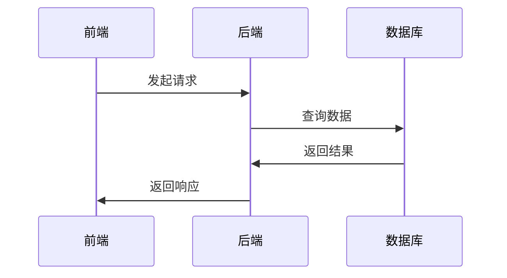

                 

# 低代码平台设计与开发

> 关键词：低代码平台、开发环境、应用程序设计、系统架构、代码实现、项目实战

> 摘要：本文将深入探讨低代码平台的设计与开发，首先介绍低代码平台的背景、基本概念、优势与挑战，然后详细讲解低代码平台的基础开发环境搭建、应用程序设计原则以及系统核心实现。最后，通过一个实际项目实战案例，对低代码平台开发进行全方位的剖析。本文旨在为广大开发者提供有深度、有思考、有见解的低代码平台设计与开发指南。

## 第1章: 低代码平台概述

### 1.1 低代码平台的背景与重要性

#### 1.1.1 信息化时代的挑战

在当今信息化时代，企业面临着日益激烈的市场竞争，快速响应业务需求成为企业的核心竞争力。然而，传统的应用开发模式面临着诸多挑战：

1. **企业应用开发的困境**：传统的软件开发周期长、成本高、难度大，难以满足快速迭代和业务变更的需求。

2. **开发资源与技能的短缺**：企业往往缺乏足够的开发资源和高技能的专业人才，这进一步制约了应用开发的效率和质量。

3. **灵活性与效率的矛盾**：企业需要在保持业务灵活性的同时，提高开发效率，降低开发成本。

#### 1.1.2 低代码平台的兴起

为了解决上述问题，低代码平台应运而生。低代码平台是一种新的软件开发方法，它通过可视化工具、模板、拖放组件等方式，大大简化了应用开发的复杂度，使非专业的业务人员也能够参与到应用开发中来。

1. **低代码平台的定义**：低代码平台是一种提供可视化开发环境、模板库和集成化服务的软件开发工具，通过图形化界面和自动化工具，帮助开发者快速构建应用程序。

2. **低代码平台的核心价值**：
   - **提高开发效率**：通过简化开发流程、减少编码工作量，低代码平台可以显著提高应用开发的速度。
   - **降低开发成本**：降低对专业开发人员的需求，减少开发过程中的资源消耗。
   - **增强业务灵活性**：快速响应业务变化，实现业务与IT的紧密融合。

3. **低代码平台的应用领域**：低代码平台适用于各种应用场景，包括业务流程管理、客户关系管理、数据报表、移动应用开发等。

#### 1.1.3 低代码平台的优势与挑战

1. **优势**：
   - **简化开发流程**：通过可视化界面和自动化工具，简化了应用开发的复杂度。
   - **降低开发门槛**：非专业人员也可以参与到应用开发中来，提升了团队的整体效率。
   - **快速迭代与交付**：支持快速开发和部署，缩短了应用上线时间。

2. **挑战**：
   - **技术限制**：低代码平台的功能和灵活性可能受到技术框架的限制。
   - **数据安全和隐私**：在低代码平台上构建的应用可能面临数据安全和隐私保护的问题。
   - **维护与升级**：随着业务需求的变更，低代码平台的应用需要不断维护和升级。

### 1.2 低代码平台的基本概念

#### 1.2.1 低代码平台的组成部分

1. **低代码开发环境**：提供可视化设计器、模板库和集成化工具，方便开发者进行应用构建。

2. **低代码应用程序**：基于低代码开发环境构建的应用程序，可以包括业务流程、数据报表、移动应用等。

3. **低代码服务**：提供与第三方服务、API的集成，以及自动化任务执行等功能。

#### 1.2.2 低代码开发与传统的区别

1. **代码生成**：低代码平台通过模板和代码生成器自动生成代码，而传统开发需要手动编写代码。

2. **流程图拖放**：低代码平台提供可视化流程设计器，通过拖放组件和节点，构建业务流程。

3. **代码库整合**：低代码平台通常内置代码库管理功能，便于代码的版本控制和协作开发。

#### 1.2.3 低代码平台的分类

1. **敏捷开发平台**：以快速迭代和灵活适应业务变化为特点，适用于快速构建和部署业务应用。

2. **应用连接器平台**：提供丰富的API和连接器，便于不同系统之间的数据交互和集成。

3. **低代码开发框架**：提供基础的低代码开发环境和工具，开发者可以根据项目需求进行扩展和定制。

### 1.3 低代码平台的市场现状与未来发展趋势

#### 1.3.1 市场现状

1. **市场规模**：低代码平台市场正在迅速增长，预计未来几年将保持高速增长态势。

2. **主要竞争者**：包括OutSystems、Appian、Mendix、Salesforce等知名企业。

3. **应用场景分析**：低代码平台在金融、制造、医疗、零售等行业有着广泛的应用，尤其适用于业务流程管理和数据报表等领域。

#### 1.3.2 未来发展趋势

1. **技术创新**：随着人工智能、大数据、物联网等技术的发展，低代码平台的功能将更加丰富，支持更复杂的业务场景。

2. **市场扩展**：低代码平台将不断拓展应用领域，覆盖更多行业和场景。

3. **企业数字化转型需求**：随着企业数字化转型需求的增加，低代码平台将成为企业数字化转型的关键工具。

## 第2章: 低代码平台开发基础

### 2.1 低代码平台开发环境搭建

#### 2.1.1 开发环境需求

1. **操作系统**：一般推荐使用Windows、Linux或MacOS等主流操作系统。

2. **编程语言**：低代码平台通常支持多种编程语言，如Java、Python、JavaScript等。

3. **开发工具**：低代码平台通常内置开发环境，开发者也可以使用第三方开发工具，如Visual Studio Code、IntelliJ IDEA等。

#### 2.1.2 开发环境配置

1. **环境搭建步骤**：
   - 安装操作系统和必要的软件；
   - 配置网络环境，确保可以访问互联网；
   - 安装低代码开发平台及相关工具。

2. **常见问题与解决方案**：
   - 网络连接问题：确保网络畅通，可以尝试更换网络环境或联系网络服务提供商；
   - 软件安装问题：根据安装向导进行操作，如遇到错误提示，可以查阅相关文档或联系技术支持。

#### 2.1.3 低代码平台开发的基本流程

1. **需求分析**：了解项目需求，明确应用目标、功能需求和性能要求。

2. **设计与建模**：使用低代码平台提供的可视化工具，进行应用程序的设计和建模。

3. **开发与测试**：根据设计进行开发，并进行功能测试、性能测试和用户体验测试。

4. **部署与维护**：将应用程序部署到生产环境，并进行定期维护和升级。

## 第3章: 低代码应用程序设计

### 3.1 低代码应用程序的架构与设计原则

#### 3.1.1 应用程序架构

1. **单体架构**：应用程序的所有功能都集成在一个独立的程序中，便于开发和维护。

2. **分布式架构**：应用程序的功能分布在多个独立的节点上，通过网络进行通信和协作。

3. **微服务架构**：应用程序的功能被划分为多个独立的微服务，每个微服务负责一个特定的业务功能。

#### 3.1.2 设计原则

1. **易用性**：设计应简化用户操作，提高用户体验。

2. **可扩展性**：设计应支持应用的扩展和升级，以适应未来业务需求。

3. **安全性**：设计应确保数据安全和隐私保护。

#### 3.1.3 低代码平台提供的开发工具和组件

1. **流程设计器**：用于设计业务流程，支持拖放组件和节点。

2. **表单设计器**：用于设计用户界面，支持各种表单元素和布局。

3. **实体关系图设计器**：用于设计应用程序的数据模型，支持实体和关系的定义。

## 第4章: 低代码平台开发实践

### 4.1 项目环境搭建

#### 4.1.1 环境需求

1. **开发工具**：使用Visual Studio Code作为开发工具。

2. **数据库**：使用MySQL作为数据库管理系统。

3. **服务器**：使用Linux服务器进行应用程序的部署。

#### 4.1.2 环境配置

1. **安装Visual Studio Code**：
   - 访问Visual Studio Code官网，下载适合操作系统的安装包；
   - 运行安装包，按照提示进行安装。

2. **安装MySQL**：
   - 安装Linux服务器，确保服务器已安装MySQL服务；
   - 使用命令行工具，运行MySQL安装程序。

3. **安装Node.js**：
   - 安装Node.js，可以使用包管理工具如npm或yarn进行安装。

### 4.2 系统功能设计

#### 4.2.1 领域模型设计

1. **需求分析**：根据项目需求，明确系统需要管理的用户、权限、流程等信息。

2. **类图设计**：
   - **用户类**：包括用户名、密码、邮箱等属性；
   - **权限类**：包括权限名称、描述等属性；
   - **流程类**：包括流程名称、描述、状态等属性。

```mermaid
classDiagram
User <<类>> {
  - 用户名 username: String
  - 密码 password: String
  - 邮箱 email: String
}

Permission <<类>> {
  - 权限名称 name: String
  - 描述 description: String
}

Process <<类>> {
  - 流程名称 name: String
  - 描述 description: String
  - 状态 status: String
}
```

#### 4.2.2 系统架构设计

1. **系统架构图**：
   - **前端**：使用Vue.js框架构建用户界面；
   - **后端**：使用Spring Boot框架进行应用开发；
   - **数据库**：使用MySQL进行数据存储和管理。



2. **架构设计要点**：
   - **前后端分离**：提高开发效率，便于维护和升级；
   - **微服务架构**：将不同功能模块独立部署，提高系统的可扩展性和容错性；
   - **数据安全**：确保数据传输和存储的安全性，采用加密和身份验证等措施。

### 4.3 系统核心实现

#### 4.3.1 功能模块划分

1. **用户管理模块**：包括用户注册、登录、权限分配等功能。

2. **权限管理模块**：包括权限列表、权限分配、权限修改等功能。

3. **流程管理模块**：包括流程创建、流程启动、流程跟踪等功能。

#### 4.3.2 核心代码实现

1. **用户管理模块**：
   ```java
   public class UserManager {
       public User register(String username, String password, String email) {
           // 注册用户
       }
       
       public User login(String username, String password) {
           // 登录用户
       }
       
       public void assignPermission(User user, Permission permission) {
           // 分配权限
       }
   }
   ```

2. **权限管理模块**：
   ```java
   public class PermissionManager {
       public List<Permission> getPermissions() {
           // 获取权限列表
       }
       
       public void assignPermission(User user, Permission permission) {
           // 分配权限
       }
       
       public void modifyPermission(Permission permission) {
           // 修改权限
       }
   }
   ```

3. **流程管理模块**：
   ```java
   public class ProcessManager {
       public Process createProcess(String name, String description) {
           // 创建流程
       }
       
       public void startProcess(Process process) {
           // 启动流程
       }
       
       public void trackProcess(Process process) {
           // 跟踪流程
       }
   }
   ```

### 4.4 代码应用解读与分析

#### 4.4.1 代码解读

1. **用户管理模块**：
   - `register` 方法用于用户注册，接收用户名、密码和邮箱，创建用户并保存到数据库；
   - `login` 方法用于用户登录，验证用户名和密码，返回登录成功的用户对象；
   - `assignPermission` 方法用于为用户分配权限，将权限信息保存到数据库。

2. **权限管理模块**：
   - `getPermissions` 方法用于获取权限列表，返回数据库中保存的所有权限信息；
   - `assignPermission` 方法用于为用户分配权限，将权限信息保存到数据库；
   - `modifyPermission` 方法用于修改权限信息，更新数据库中的权限记录。

3. **流程管理模块**：
   - `createProcess` 方法用于创建流程，接收流程名称和描述，将流程信息保存到数据库；
   - `startProcess` 方法用于启动流程，将流程状态设置为“进行中”；
   - `trackProcess` 方法用于跟踪流程，查询流程的当前状态。

#### 4.4.2 代码逻辑

1. **用户管理模块**：
   - 注册用户时，首先验证用户名、密码和邮箱的合法性，然后创建用户对象并保存到数据库；
   - 登录用户时，首先验证用户名和密码，然后返回登录成功的用户对象；
   - 分配权限时，首先查询用户和权限的信息，然后保存权限分配记录。

2. **权限管理模块**：
   - 获取权限列表时，直接查询数据库，返回权限信息；
   - 分配权限时，首先查询用户和权限的信息，然后保存权限分配记录；
   - 修改权限时，首先查询权限信息，然后更新数据库中的权限记录。

3. **流程管理模块**：
   - 创建流程时，首先验证流程名称和描述的合法性，然后保存流程信息到数据库；
   - 启动流程时，将流程状态设置为“进行中”；
   - 跟踪流程时，查询流程的当前状态。

### 4.5 项目小结

通过本案例，我们详细介绍了低代码平台的项目开发过程，包括环境搭建、系统功能设计、核心代码实现和代码解读。在实际开发中，低代码平台为开发者提供了极大的便利，可以快速构建应用程序，降低开发成本和难度。然而，低代码平台也存在一定的局限性，如技术限制、数据安全和隐私等问题，开发者需要在使用过程中予以关注和解决。

### 4.6 最佳实践 Tips

1. **合理规划系统架构**：在设计低代码平台的应用程序时，应充分考虑系统的可扩展性和可维护性，采用合理的架构设计原则。

2. **安全性设计**：在开发过程中，应重视数据安全和隐私保护，采用加密、身份验证等技术措施，确保应用的安全性。

3. **文档与培训**：完善项目文档，为团队成员提供培训，提高团队对低代码平台的理解和使用能力。

4. **持续迭代与优化**：根据用户反馈和业务需求，持续迭代和优化应用程序，提升用户体验和应用性能。

### 4.7 注意事项

1. **避免过度依赖低代码平台**：虽然低代码平台可以简化开发过程，但仍然需要开发者具备一定的编程能力和系统设计经验。

2. **数据备份与恢复**：定期备份数据库，确保数据的安全和完整性。

3. **遵循编码规范**：遵循统一的编码规范和命名规则，提高代码的可读性和可维护性。

### 4.8 拓展阅读

1. **《低代码平台开发实战》**：深入介绍低代码平台的应用场景、开发方法和实战技巧。

2. **《低代码开发：创新与应用》**：探讨低代码技术在企业数字化转型中的应用和未来发展趋势。

3. **《敏捷开发与低代码平台》**：分析敏捷开发与低代码平台的结合，探讨如何实现高效的软件开发。

### 作者信息

作者：AI天才研究院/AI Genius Institute & 禅与计算机程序设计艺术 /Zen And The Art of Computer Programming

感谢您的阅读，希望本文对您在低代码平台设计与开发方面有所启发和帮助。如果您有任何疑问或建议，请随时联系作者。期待与您共同探索低代码平台的无限可能！

