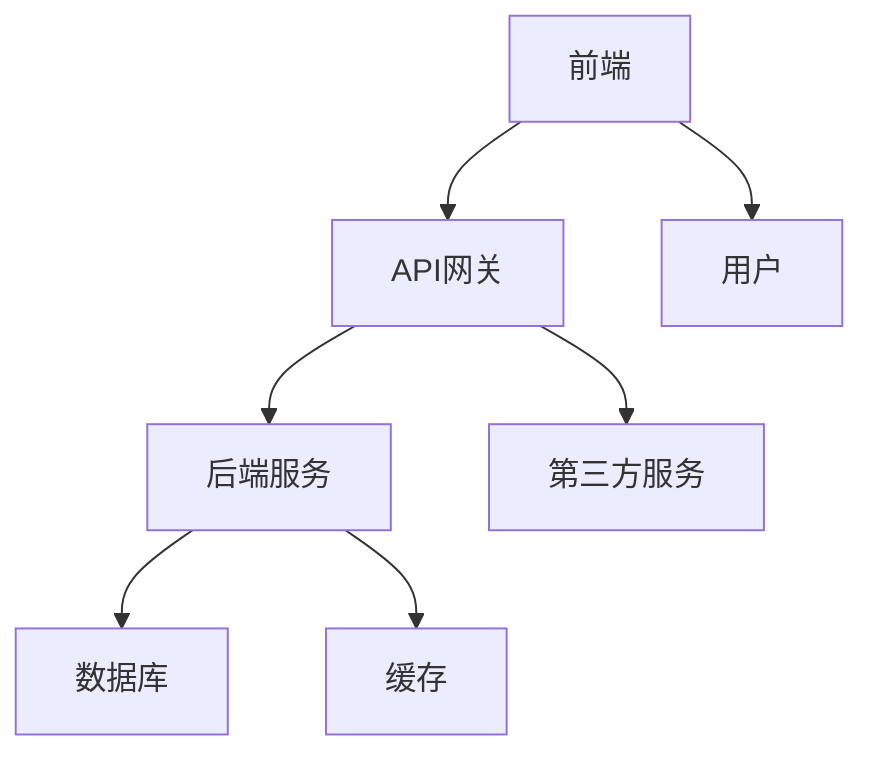
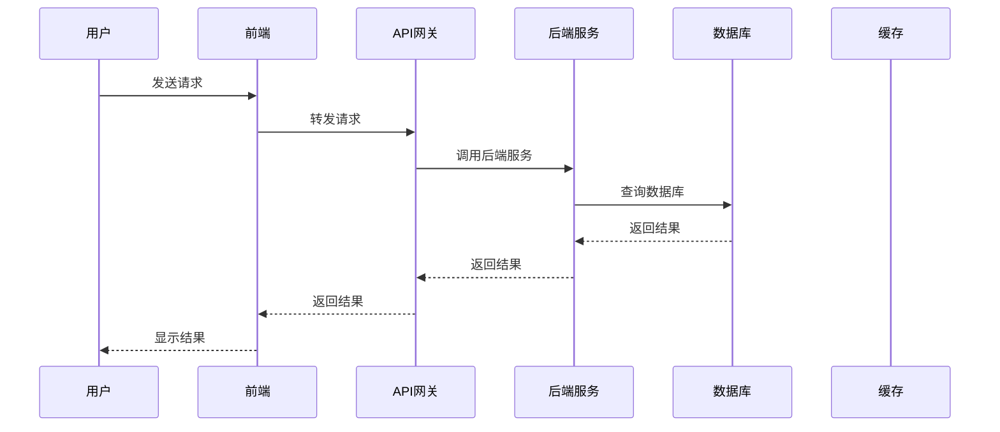

                 


## 使用缓存存在数据不一致问题

### 关键词：
- 缓存
- 数据不一致
- 数据一致性保障
- 数据复制
- 缓存一致性协议
- 写入时序控制
- MVCC

### 摘要：
本文深入探讨了在使用缓存过程中常见的数据不一致问题。通过对问题背景、核心概念、数据不一致的数学模型、解决策略和系统架构设计等方面进行详细分析，本文旨在为开发者提供实用的解决方案和最佳实践。

## 第一部分：背景介绍

### 1.1 问题背景

#### 1.1.1 数据不一致问题的定义
数据不一致问题是指在分布式系统中，由于数据的复制、同步或缓存机制不完善，导致数据在不同节点或存储之间出现不一致的现象。

#### 1.1.2 数据不一致问题的原因
数据不一致问题的原因主要包括：
1. **缓存策略不当**：缓存策略不当会导致数据在不同节点之间的同步不及时，从而导致数据不一致。
2. **并发操作**：在高并发场景下，多个操作可能同时访问同一数据，导致数据不一致。
3. **网络问题**：网络延迟或故障可能导致数据同步不及时，从而导致数据不一致。

#### 1.1.3 数据不一致问题的解决方法
解决数据不一致问题的方法主要包括：
1. **缓存一致性协议**：通过设计合适的缓存一致性协议来保证数据的一致性。
2. **数据复制技术**：通过数据复制技术来保证数据的同步。
3. **数据版本控制**：通过数据版本控制来处理并发操作导致的数据不一致问题。

### 1.2 核心概念与联系

#### 1.2.1 缓存的概念与作用
缓存是一种临时存储数据的技术，用于提高系统的响应速度和性能。缓存的作用包括：
1. **减轻数据库压力**：通过缓存减少对数据库的访问，从而减轻数据库的压力。
2. **提高查询速度**：缓存中的数据是预先加载的，可以显著提高查询速度。

#### 1.2.2 数据一致性的概念与类型
数据一致性是指数据在不同节点或存储之间的一致性。数据一致性的类型包括：
1. **强一致性**：所有操作都被视为同时发生，数据在任何时刻都是一致的。
2. **最终一致性**：数据最终会达到一致，但在此过程中可能会有短暂的延迟或冲突。

#### 1.2.3 数据一致性保障技术
数据一致性保障技术包括：
1. **缓存一致性协议**：通过协议确保缓存的更新与数据库保持同步。
2. **数据复制技术**：通过复制确保数据的多个副本保持一致。
3. **数据版本控制**：通过版本控制处理并发操作导致的数据不一致问题。

### 1.3 数学模型和公式讲解

#### 1.3.1 数据不一致问题的数学模型
假设有两个节点A和B，分别维护同一数据x。在某一时刻t，A节点对x进行更新，但B节点尚未同步到这一更新。此时，数据的不一致性可以用以下公式表示：

$$
不一致性 = x_A - x_B
$$

其中，$x_A$和$x_B$分别为节点A和节点B上的数据值。

#### 1.3.2 数据一致性保障算法的数学公式
假设我们使用版本控制技术来保障数据一致性，每个数据的版本为v。当节点A更新数据时，其版本增加1，即$v_A' = v_A + 1$。节点B在同步数据时，根据版本号来判断数据是否已更新，从而保证数据的一致性。

$$
如果 \ v_B < v_A，则 \ 同步 \ x_A \ 到 \ x_B
$$

$$
如果 \ v_B = v_A，则 \ 不更新 \ x_B
$$

$$
如果 \ v_B > v_A，则 \ x_B \ 已更新
$$

## 第二部分：数据不一致问题的深入分析

### 2.1 数据不一致问题的分类

#### 2.1.1 读脏数据
读脏数据是指在一个事务未提交前，其他事务读取到了未提交的数据。这种情况可能导致数据的不一致性。

#### 2.1.2 写冲突
写冲突是指两个或多个事务同时更新同一数据，导致数据不一致。例如，两个事务同时将数据A从1改为2，结果数据A的值可能为1或2。

#### 2.1.3 幻读与幻写
幻读是指一个事务在读取数据时，发现其他事务已经修改了数据，但这个事务并不知情。幻写是指一个事务在写入数据时，其他事务已经修改了数据，但这个事务并不知情。

### 2.2 数据不一致问题的原因分析

#### 2.2.1 系统架构设计不当
系统架构设计不当可能导致数据不一致。例如，在设计分布式系统时，如果没有考虑数据的同步机制，就可能导致数据不一致。

#### 2.2.2 缓存策略不合理
缓存策略不合理也可能导致数据不一致。例如，如果缓存策略导致数据在缓存和数据库之间的同步不及时，就可能导致数据不一致。

#### 2.2.3 数据一致性保障机制不足
数据一致性保障机制不足也可能导致数据不一致。例如，如果没有使用缓存一致性协议、数据复制技术或数据版本控制技术，就可能导致数据不一致。

### 2.3 数据不一致问题的解决策略

#### 2.3.1 写入时序控制
写入时序控制可以通过控制写入操作的顺序来避免数据不一致。例如，可以采用“先写后读”的策略，确保数据在写入后再进行读取，从而避免读脏数据。

#### 2.3.2 数据版本控制
数据版本控制可以通过为每个数据项分配版本号来避免数据不一致。例如，使用多版本并发控制（MVCC）技术，确保每个事务都能读取到正确的数据版本。

#### 2.3.3 多版本并发控制（MVCC）
多版本并发控制（MVCC）是一种常用的数据一致性保障技术，它允许多个事务同时访问数据，而不会导致数据不一致。MVCC通过为每个数据项创建多个版本，并使用版本号来区分不同的数据版本。

## 第三部分：数据一致性保障技术

### 3.1 缓存一致性协议

#### 3.1.1 基本概念
缓存一致性协议是一种确保缓存数据与主数据源一致的机制。常见的缓存一致性协议包括强一致性协议和最终一致性协议。

#### 3.1.2 强一致性协议
强一致性协议确保所有操作都被视为同时发生，数据在任何时刻都是一致的。常见的强一致性协议包括严格两阶段锁协议（2PL）和冲突序列协议。

#### 3.1.3 最终一致性协议
最终一致性协议允许数据在不同节点之间存在短暂的延迟或冲突，但最终会达到一致。常见的最终一致性协议包括Gossip协议和矢量时钟协议。

### 3.2 数据复制技术

#### 3.2.1 数据复制的基本原理
数据复制技术通过在多个节点之间复制数据来确保数据的一致性。数据复制的基本原理包括同步复制和异步复制。

#### 3.2.2 数据复制的挑战与解决方案
数据复制的挑战包括数据同步延迟和数据冲突处理。解决方案包括使用缓存一致性协议和冲突检测与解决机制。

#### 3.2.3 数据复制的性能优化
数据复制的性能优化包括减少同步延迟和降低网络带宽消耗。优化策略包括压缩数据、批量同步和负载均衡。

### 3.3 数据版本控制技术

#### 3.3.1 数据版本控制的基本原理
数据版本控制技术通过为每个数据项分配版本号来区分不同的数据版本。数据版本控制的基本原理包括版本增量控制和全量备份。

#### 3.3.2 数据版本控制的应用场景
数据版本控制技术广泛应用于分布式系统、数据库和缓存等领域。常见的应用场景包括多版本并发控制和数据回滚。

## 第四部分：系统分析与架构设计方案

### 4.1 问题场景介绍
假设我们设计一个电商系统，其中包含商品信息、用户订单和库存信息等。由于高并发访问，我们需要使用缓存来提高系统的性能。然而，这可能导致数据不一致问题。

### 4.2 系统功能设计
系统功能设计包括商品信息管理、用户订单管理和库存信息管理等功能。使用Mermaid类图表示系统功能设计如下：

```mermaid
classDiagram
    商品信息管理 <<Interface>>
    用户订单管理 <<Interface>>
    库存信息管理 <<Interface>>

    商品信息管理 --|> 数据库
    用户订单管理 --|> 数据库
    库存信息管理 --|> 数据库

    商品信息管理 o-- 用户订单管理
    用户订单管理 o-- 库存信息管理
```

### 4.3 系统架构设计
系统架构设计包括前端、后端和数据库等部分。使用Mermaid架构图表示系统架构设计如下：



### 4.4 系统接口设计
系统接口设计包括API接口和数据库接口等。使用Mermaid序列图表示系统接口设计如下：



### 4.5 系统交互
系统交互包括用户、前端、后端、数据库和缓存等部分的交互。使用Mermaid序列图表示系统交互如下：

```mermaid
sequenceDiagram
    participant F as 用户
    participant A as 前端
    participant B as API网关
    participant C as 后端服务
    participant D as 数据库
    participant E as 缓存

    F->>A: 发送请求
    A->>B: 转发请求
    B->>C: 调用后端服务
    C->>D: 查询数据库
    D-->>C: 返回结果
    C-->>B: 返回结果
    B-->>A: 返回结果
    A-->>F: 显示结果

    note over C,B
        缓存更新策略
    end note

    C->>E: 更新缓存
    E-->>C: 返回更新结果
```

## 第五部分：项目实战

### 5.1 环境安装
在此部分，我们将介绍如何在开发环境中安装所需软件和依赖库。

### 5.2 系统核心实现源代码
在此部分，我们将展示系统的核心实现源代码，并对其进行分析和解读。

### 5.3 代码应用解读与分析
在此部分，我们将对代码应用进行解读和分析，解释其工作原理和关键点。

### 5.4 实际案例分析与讲解
在此部分，我们将通过实际案例来分析和讲解如何处理数据不一致问题。

### 5.5 项目小结
在此部分，我们将总结项目的关键技术和经验，并给出项目小结。

## 第六部分：最佳实践 tips

在此部分，我们将给出一些最佳实践，帮助开发者避免和解决数据不一致问题。

## 第七部分：小结

在此部分，我们将对本文的主要内容进行总结，并强调数据不一致问题的解决方法和重要性。

## 第八部分：注意事项

在此部分，我们将提醒开发者注意一些关键点，以确保系统的稳定性和数据一致性。

## 第九部分：拓展阅读

在此部分，我们将推荐一些相关阅读材料，帮助开发者深入了解数据一致性和缓存技术。

## 作者

作者：AI天才研究院/AI Genius Institute & 禅与计算机程序设计艺术 /Zen And The Art of Computer Programming

-------------------------------------------------------------------

**文章总结：**
本文深入探讨了使用缓存时可能遇到的数据不一致问题。首先介绍了数据不一致问题的定义、原因和解决方法，然后详细分析了数据不一致问题的分类和原因。接着，本文介绍了数据一致性保障技术，包括缓存一致性协议、数据复制技术和数据版本控制技术。最后，本文提供了一个完整的系统架构设计方案，并通过实际案例进行了详细讲解。文章末尾给出了最佳实践、注意事项和拓展阅读，以帮助开发者更好地理解和处理数据不一致问题。

**注意事项：**
- 在设计分布式系统时，要充分考虑数据一致性的问题。
- 使用缓存时要选择合适的缓存策略，避免数据不一致。
- 在处理并发操作时，要使用数据版本控制技术来保证数据一致性。
- 定期检查和优化缓存，确保数据的一致性和性能。

**拓展阅读：**
- 《分布式系统原理与范型》
- 《大规模分布式存储系统设计》
- 《分布式缓存一致性协议》

**致谢：**
感谢AI天才研究院和禅与计算机程序设计艺术为本文提供的技术支持和指导。

