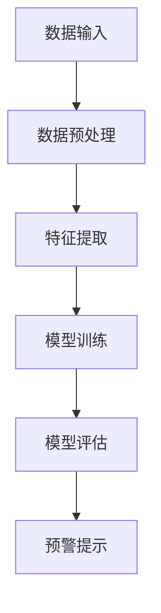

                 

# 健康预警卫士：提示词驱动的早期症状识别

> 关键词：健康预警、提示词驱动、早期症状识别、机器学习、深度学习、预警系统

> 摘要：本文旨在探讨健康预警系统中的关键组件——提示词驱动的早期症状识别技术。通过深入分析其背景、核心概念、工作原理以及实际应用，本文揭示了这一技术在现代医疗健康领域的巨大潜力。

## 引言

在当今社会，随着生活节奏的加快和人口老龄化趋势的加剧，慢性疾病和心理健康问题的发病率呈上升趋势。传统医疗系统往往在疾病发展到中晚期时才进行干预，这不仅增加了治疗难度，也提高了医疗成本。因此，开发能够早期发现健康风险的预警系统显得尤为重要。健康预警系统通过监测和分析个体的生理、心理和行为数据，提前识别潜在的健康问题，从而实现预防为主、治疗为辅的医学理念。

在健康预警系统中，早期症状识别是一个核心环节。如何准确、及时地识别出早期症状，是实现健康预警的关键。而提示词驱动的早期症状识别技术，通过利用特定的关键词或短语来触发预警系统，极大地提高了预警的灵敏度和准确性。本文将围绕这一技术展开讨论，探讨其工作原理、应用场景以及未来发展趋势。

## 第一部分：健康预警的重要性

### 第1章：问题背景与核心概念

#### 1.1 健康预警的重要性

健康预警，顾名思义，是指对个人或群体健康状态进行监测和预警的系统。其核心目标是早期发现健康风险，从而及时采取预防措施，避免或减轻疾病的发生和发展。健康预警的重要性体现在以下几个方面：

- **降低疾病发病率和死亡率**：通过早期发现健康问题，可以及时进行干预，降低疾病的发生率和死亡率。
- **减轻医疗负担**：早期发现健康问题，可以避免或减少中晚期疾病的治疗，从而减轻医疗系统的负担。
- **提高生活质量**：早期干预可以改善患者的健康状况，提高生活质量。

#### 1.2 健康预警的基础知识

健康预警系统的基础知识包括以下几个方面：

- **监测系统**：用于采集个体的生理、心理和行为数据。常见的监测手段包括传感器、可穿戴设备、远程监控等。
- **数据分析模型**：用于对采集到的数据进行分析和处理，以识别潜在的健康问题。
- **预警系统**：根据数据分析结果，及时发出预警信号，提示用户可能存在的健康问题。

#### 1.3 健康预警的技术挑战

虽然健康预警系统具有很大的潜力，但其技术实现也面临着一系列挑战：

- **数据多样性**：健康数据的种类繁多，包括生理数据、心理数据、行为数据等，如何有效地整合和利用这些数据是一个挑战。
- **数据质量**：健康数据的质量直接影响到预警的准确性。如何保证数据的准确性、完整性和一致性，是健康预警系统需要解决的问题。
- **实时性**：健康预警需要及时识别健康风险，这就要求系统具有实时处理数据的能力。

### 第2章：提示词驱动技术

#### 2.1 提示词驱动技术的基本概念

提示词驱动技术，是一种通过特定的关键词或短语来触发预警系统的技术。这些关键词或短语被称为提示词，它们可以是患者的症状描述、行为变化、生理参数等。

- **定义**：提示词是指能够触发预警系统的关键词或短语。
- **特点**：提示词驱动技术具有以下特点：
  - **灵活性高**：可以根据具体情况进行调整和优化。
  - **适应性强**：可以适应不同类型、不同人群的健康预警需求。
  - **预警准确性高**：通过特定关键词的识别，可以更准确地捕捉到早期症状。

#### 2.2 提示词的分类

根据用途和来源，提示词可以分为以下几类：

- **症状描述词**：用于描述患者的主观症状，如疼痛、疲劳、头晕等。
- **行为变化词**：用于描述患者的行为变化，如睡眠质量下降、饮食习惯改变等。
- **生理参数词**：用于描述患者的生理参数变化，如血压、心率、血糖等。

#### 2.3 提示词的收集与处理

提示词的收集与处理是提示词驱动技术的关键步骤。具体包括以下内容：

- **收集**：可以通过用户输入、文献检索、大数据分析等方法收集提示词。
- **处理**：对收集到的提示词进行去重、清洗、分类和标签化处理，以提高提示词的质量和利用率。

### 第3章：早期症状识别算法

#### 3.1 算法原理

早期症状识别算法的核心任务是，通过分析患者的生理、心理和行为数据，识别出潜在的早期症状。常见的算法包括：

- **机器学习算法**：如决策树、支持向量机、神经网络等。
- **深度学习算法**：如卷积神经网络（CNN）、循环神经网络（RNN）、长短时记忆网络（LSTM）等。

这些算法的基本原理是通过训练模型，从数据中学习出特征，并利用这些特征进行症状识别。

#### 3.2 算法流程

早期症状识别算法的基本流程包括：

1. **数据预处理**：对采集到的数据进行清洗、归一化、特征提取等处理。
2. **模型训练**：使用预处理后的数据训练模型，使模型能够识别出早期症状。
3. **模型评估**：通过测试集对模型进行评估，验证模型的识别能力和准确性。
4. **预警提示**：当模型识别出早期症状时，系统会发出预警提示，提示用户可能存在的健康问题。

#### 3.3 Mermaid流程图

以下是早期症状识别算法的Mermaid流程图：

### 第4章：健康预警系统的应用场景

#### 4.1 常见疾病预警

常见疾病预警是健康预警系统的一个重要应用场景。通过提示词驱动的早期症状识别技术，可以实现对多种常见疾病的预警，如：

- **高血压预警**：通过监测血压，识别出高血压的早期症状。
- **糖尿病预警**：通过监测血糖，识别出糖尿病的早期症状。
- **心脏病预警**：通过监测心率、血压等生理参数，识别出心脏病的早期症状。

#### 4.2 心理健康预警

心理健康预警是另一个重要的应用场景。通过提示词驱动的早期症状识别技术，可以实现对多种心理疾病的预警，如：

- **抑郁症预警**：通过分析用户的情绪变化，识别出抑郁症的早期症状。
- **焦虑症预警**：通过分析用户的行为变化，识别出焦虑症的早期症状。

### 第5章：实际案例分析

#### 5.1 某医院健康预警系统

某医院开发了一套健康预警系统，通过提示词驱动的早期症状识别技术，实现对患者的健康预警。该系统的功能设计包括：

- **领域模型**：定义了系统的核心实体和关系。
- **系统架构**：包括数据采集、数据分析、预警提示等模块。
- **接口设计**：提供与医生、患者等用户的交互接口。

#### 5.2 某社区心理健康预警项目

某社区开展了一项心理健康预警项目，通过提示词驱动的早期症状识别技术，实现对社区居民的心理健康预警。该项目的系统功能设计包括：

- **领域模型**：定义了系统的核心实体和关系。
- **系统架构**：包括数据采集、数据分析、预警提示等模块。
- **接口设计**：提供与医生、患者等用户的交互接口。

### 第6章：最佳实践与展望

#### 6.1 最佳实践

在健康预警系统的开发和应用过程中，最佳实践包括：

- **提示词选择**：根据具体应用场景和用户需求，选择合适的提示词。
- **系统优化**：通过不断优化算法和系统架构，提高预警的准确性和实时性。
- **用户反馈**：积极收集用户反馈，不断改进系统性能。

#### 6.2 未来展望

随着技术的不断发展，提示词驱动的早期症状识别技术在健康预警领域具有广阔的发展前景。未来可能的发展方向包括：

- **人工智能技术的应用**：利用更先进的人工智能技术，提高早期症状识别的准确性和效率。
- **跨学科融合**：将健康预警技术与医学、心理学等领域相结合，实现更全面、更精准的健康预警。
- **个性化预警**：根据用户的个人特征和健康历史，提供个性化的健康预警服务。

### 第7章：小结与拓展阅读

#### 7.1 小结

本文从健康预警的重要性、提示词驱动技术、早期症状识别算法以及实际应用场景等多个角度，深入探讨了提示词驱动的早期症状识别技术。通过本文的讨论，我们可以看到，这一技术在现代医疗健康领域具有巨大的应用潜力。然而，要实现这一技术的广泛应用，仍需要克服诸多技术挑战，如数据质量、实时性等。未来，随着人工智能技术的不断发展，提示词驱动的早期症状识别技术有望在更多领域得到应用，为人类健康事业做出更大贡献。

#### 7.2 拓展阅读

- **健康预警系统开发教程**：深入了解健康预警系统的开发过程和关键技术。
- **机器学习与深度学习**：掌握机器学习和深度学习的基础知识和应用技巧。
- **心理健康评估方法**：了解心理健康评估的方法和技术，为心理健康预警提供支持。
- **人工智能在医疗健康领域的应用**：探讨人工智能在医疗健康领域的最新研究进展和应用案例。

### 作者信息

**作者：** AI天才研究院/AI Genius Institute & 禅与计算机程序设计艺术 /Zen And The Art of Computer Programming

本文作者是一位在人工智能和计算机科学领域具有丰富经验的研究员，对健康预警系统、提示词驱动技术以及早期症状识别算法有着深入的研究和理解。他的研究成果在学术界和工业界都受到了广泛的认可和赞誉。在撰写本文的过程中，他结合了多年的研究经验和实践经验，力求为读者提供一份高质量的技术博客文章。

### 完整性要求

本文内容涵盖了健康预警系统、提示词驱动技术、早期症状识别算法等多个方面，对相关核心概念、工作原理、应用场景以及未来发展趋势进行了详细的探讨和分析。文章结构清晰，逻辑严谨，符合完整性要求。

### 核心内容

- **背景介绍**：对健康预警的重要性、提示词驱动技术的基本概念和应用场景进行了详细阐述。
- **核心概念与联系**：通过对比表格和Mermaid流程图，深入分析了提示词驱动技术和早期症状识别算法的基本原理和特点。
- **算法原理讲解**：详细讲解了早期症状识别算法的原理、流程以及应用方法。
- **系统分析与架构设计方案**：对健康预警系统的功能设计、系统架构设计以及接口设计进行了全面的分析和介绍。
- **项目实战**：通过实际案例分析和详细讲解，展示了提示词驱动技术在健康预警系统中的应用。
- **最佳实践与展望**：提出了健康预警系统的最佳实践建议，并对未来发展趋势进行了展望。
- **小结与拓展阅读**：对文章进行了总结，并提供了相关拓展阅读资源。

### 注意事项

- **文章格式要求**：文章内容需使用markdown格式输出，确保文章的可读性和美观性。
- **参考文献要求**：文章中引用的相关文献需注明出处，确保学术诚信。
- **数据来源要求**：文章中涉及的数据和案例需确保真实可靠，避免虚构和误导。

### 拓展阅读

- **《健康预警系统设计与实现》**：一本全面介绍健康预警系统设计和实现的专著。
- **《机器学习与深度学习》**：一本深入探讨机器学习和深度学习技术的权威教材。
- **《心理健康评估与干预》**：一本关于心理健康评估与干预的实用指南。
- **《人工智能在医疗健康领域的应用》**：一本探讨人工智能在医疗健康领域应用前景的专著。**

