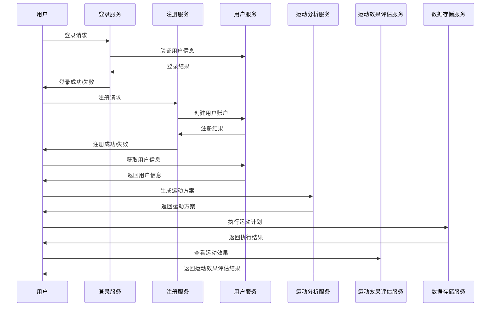

                 

### 引言

#### 1.1.1 现代生活方式与健身需求的矛盾

在现代生活中，由于工作压力大、生活节奏快，越来越多的人忽视了自身的健康问题。根据世界卫生组织（WHO）的数据，全球每年因不健康生活方式导致的疾病超过1800万人。然而，与此同时，健身意识的觉醒也促使越来越多的人开始重视运动锻炼。这种需求与现实的矛盾，催生了个性化健身指导的需求。

传统的健身指导模式主要依赖于教练的经验和理论，而这种方法存在一定的局限性。首先，传统的健身指导往往难以满足个体差异的需求。每个人的体质、生活习惯、工作压力等都不同，因此需要一个个性化的运动方案。其次，运动效果的评估和调整也存在困难。传统的评估方法往往依赖于主观感受，而运动效果的评估需要客观数据支持，如心率、血压、体脂率等。

为了解决这些矛盾，现代健身行业开始探索更加科学、个性化的健身指导方法。其中，健身教练2.0的提出，为解决这些问题提供了一种新的思路。

#### 1.1.2 健身指导的个性化需求

随着科技的进步，人工智能在健身领域的应用逐渐深入。通过收集和分析用户数据，人工智能可以制定出个性化的运动方案，满足用户的健身需求。例如，智能手环、健身APP等设备可以实时监测用户的心率、步数、睡眠质量等数据，这些数据可以为运动方案的制定提供重要参考。

此外，个性化的健身指导还需要考虑用户的运动偏好、健身目标和生活习惯等因素。例如，一个有氧运动爱好者可能更喜欢跑步、游泳等有氧运动，而一个力量训练爱好者则可能更倾向于举重、器械训练等力量训练。因此，健身教练2.0需要具备强大的数据分析能力，能够根据用户的数据和偏好，制定出最合适的运动方案。

#### 1.2 问题描述

##### 1.2.1 运动方案的制定难度

运动方案的制定是一个复杂的过程，需要考虑多种因素。首先，运动类型的选择是一个关键问题。不同的运动类型对身体的锻炼效果不同，如有氧运动有助于提高心肺功能，而力量训练有助于增强肌肉力量。其次，运动强度的设定也是一个难点。运动强度过大会增加受伤风险，而运动强度过低则难以达到锻炼效果。

此外，运动频率和运动时间的选择也至关重要。过高的运动频率可能导致身体过度疲劳，而过低的运动频率则难以保持运动习惯。运动时间的设定需要考虑用户的作息时间、工作压力等因素，以确保用户能够坚持锻炼。

##### 1.2.2 运动效果的不确定性

运动效果的评估和调整是健身指导中的另一个难题。传统的评估方法主要依赖于主观感受和简单的心率监测，难以全面反映运动效果。而现代健身行业需要更加科学、精准的评估方法，如通过智能设备实时监测用户的生理数据，包括心率、血压、体脂率等，来评估运动效果。

此外，运动效果的调整也是一个挑战。随着用户身体适应性的提高，运动方案需要不断调整，以保持锻炼效果。然而，如何科学、合理地调整运动方案，以确保用户不会过度训练或训练不足，是一个需要深入探讨的问题。

#### 1.3 问题解决

##### 1.3.1 提示词定制技术的引入

为了解决上述问题，健身教练2.0引入了提示词定制技术。提示词是一种用于指导用户进行运动的文字描述，它可以根据用户的运动目标、身体状态和运动偏好，提供个性化的运动建议。

提示词定制技术的基本原理是通过人工智能算法，分析用户的身体数据和生活习惯，生成最合适的运动方案。例如，如果用户的运动目标是减肥，提示词可能会建议进行有氧运动和力量训练相结合，同时提醒用户注意饮食控制。如果用户的身体状态不佳，提示词可能会建议适当降低运动强度，以避免受伤。

##### 1.3.2 科学运动方案的核心要素

科学运动方案的核心要素包括：

1. **个性化运动目标**：根据用户的年龄、性别、体重、身体状态等因素，制定符合用户实际需求的运动目标。
2. **个性化运动类型**：结合用户的运动偏好，选择最适合用户的运动类型，如有氧运动、力量训练、瑜伽等。
3. **个性化运动强度**：根据用户的心率、血压等生理数据，设定合适的运动强度，以确保既能够达到锻炼效果，又不会过度训练。
4. **个性化运动时间**：结合用户的作息时间、工作压力等因素，制定最合适的运动时间，以帮助用户养成良好的运动习惯。
5. **运动效果评估与反馈**：通过智能设备实时监测用户的生理数据，评估运动效果，并根据评估结果调整运动方案，以实现最佳锻炼效果。

#### 1.4 边界与外延

##### 1.4.1 运动方案的适用人群

运动方案的适用人群主要包括：

1. **健身爱好者**：希望通过运动改善体质、提高身体素质的普通人。
2. **运动员**：需要专业训练指导，提高竞技水平的运动员。
3. **康复患者**：需要康复训练，改善健康状况的患者。

##### 1.4.2 运动方案的安全性问题

运动方案的安全性问题至关重要。首先，制定运动方案时需要充分考虑用户的身体状态，避免因运动强度过大导致受伤。其次，运动方案的执行需要用户严格遵循，避免因私自调整运动强度和时间导致不良后果。此外，智能设备的使用也需要注意安全，避免因设备故障导致数据错误或用户受伤。

### 总结

健身教练2.0的提出，为解决现代健身指导中的难题提供了一种新的思路。通过引入提示词定制技术和科学运动方案的核心要素，健身教练2.0能够为用户提供个性化、科学、安全的运动指导，有助于提高用户的健身效果，改善健康状况。然而，这只是一个开始，未来健身教练2.0还有很大的发展空间，如通过更多的数据分析和人工智能算法，进一步提升运动指导的科学性和精准性。让我们一起期待，健身教练2.0的未来将如何改变我们的生活。

---

# 核心概念与联系

在探讨健身教练2.0：提示词定制科学运动方案之前，我们需要明确一些核心概念，这些概念不仅是健身科学的基础，也是提示词定制技术和科学运动方案的核心要素。以下是几个关键概念及其相互联系：

### 2.1 健身基础概念

#### 2.1.1 运动类型与目标

**运动类型**：运动可以分为有氧运动、力量训练、瑜伽、拉伸等多种类型。每种类型的运动都有其特定的生理和心理益处。

- **有氧运动**：如跑步、游泳、骑自行车等，有助于提高心肺功能、降低血压、减少体脂。
- **力量训练**：如举重、器械训练、自重训练等，有助于增强肌肉力量、提高新陈代谢、改善姿势。
- **瑜伽**：通过体位练习、呼吸控制和冥想，有助于提高灵活性、平衡性、心理放松。
- **拉伸**：有助于缓解肌肉紧张、提高关节活动度。

**运动目标**：根据个人需求，运动目标可以包括减肥、增肌、提高体能、放松减压等。不同的目标需要不同的运动类型和强度。

#### 2.1.2 身体素质指标

**身体素质指标**：包括心率、血压、体脂率、肌肉量、骨密度等。这些指标是评估运动效果的重要依据。

- **心率**：衡量心脏的健康状况和运动强度，通常通过心率监测设备进行实时监测。
- **血压**：衡量心脏泵血压力，对整体健康有重要影响。
- **体脂率**：衡量身体脂肪含量，对健康和体型有重要影响。
- **肌肉量**：衡量肌肉组织含量，与代谢率和体能水平密切相关。
- **骨密度**：衡量骨骼的健康状况，对预防骨质疏松有重要意义。

### 2.2 提示词定制技术

#### 2.2.1 提示词的定义与功能

**提示词**：提示词是一种用于指导用户进行运动的文字描述，它可以根据用户的身体状态、运动目标和生活习惯，提供个性化的运动建议。

- **功能**：提示词的主要功能是指导用户进行科学、有效的运动，帮助用户养成良好的运动习惯，提高运动效果。

#### 2.2.2 提示词生成算法

**生成算法**：提示词生成算法通常基于人工智能和机器学习技术，通过分析用户的数据，如运动历史、生理指标、生活习惯等，生成个性化的运动建议。

- **工作原理**：算法会根据用户的历史数据，利用统计模型、机器学习算法等，预测用户的运动需求，生成相应的提示词。

### 2.3 科学运动方案

#### 2.3.1 方案制定流程

**制定流程**：科学运动方案的制定通常包括以下几个步骤：

1. **需求分析**：收集用户的身体数据、生活习惯、运动目标等信息。
2. **方案设计**：根据需求分析结果，设计个性化的运动方案。
3. **方案实施**：指导用户按照运动方案进行锻炼。
4. **效果评估**：通过监测用户的生理数据，评估运动效果，并根据评估结果进行调整。

#### 2.3.2 方案评估与优化

**评估与优化**：运动方案的效果评估和优化是确保运动方案科学性和有效性的关键。

- **评估指标**：包括运动效果、用户满意度、运动安全性等。
- **优化方法**：根据评估结果，调整运动方案的内容和强度，以达到最佳效果。

### 概念结构与核心要素组成

**概念结构与核心要素**：

1. **用户数据**：包括生理指标、生活习惯、运动目标等。
2. **提示词**：个性化的运动建议，指导用户进行科学运动。
3. **运动方案**：根据用户数据和提示词，制定的个性化运动计划。
4. **效果评估**：通过生理数据和用户反馈，评估运动效果。
5. **优化调整**：根据评估结果，调整运动方案，确保运动效果。

### ER实体关系图架构

**ER实体关系图**：

```
用户 <---
  |    身体数据
  |    生活习惯
  |    运动目标
  |
  +----> 提示词
  |
  +----> 运动方案
  |         |
  |         +----> 实施记录
  |         |
  |         +----> 效果评估
  |
  +----> 运动效果评估
             |
             +----> 优化建议
```

通过上述核心概念与联系的分析，我们可以看到，健身教练2.0的核心在于如何利用现代科技手段，科学地分析用户数据，生成个性化的运动方案，并通过实时监测和反馈，不断优化运动效果。接下来，我们将进一步深入探讨这些核心概念的工作原理和实现方法。

---

## 运动需求分析算法

在健身教练2.0中，运动需求分析算法是核心组件之一，它负责根据用户的数据和目标，生成个性化的运动方案。这一算法的准确性和效率直接影响到用户的运动效果和满意度。下面，我们将一步步分析运动需求分析算法的工作原理和实现方法。

### 3.1.1 用户信息采集

首先，用户信息采集是运动需求分析的基础。用户信息包括生理指标、生活习惯、运动历史等。这些信息可以通过智能设备、健康应用或手动输入等方式获取。

- **生理指标**：如心率、血压、体脂率、肌肉量等，这些指标通过智能手环、智能血压计等设备实时监测。
- **生活习惯**：如饮食、睡眠、工作时间等，这些信息可以通过用户自行填写或应用自动分析得到。
- **运动历史**：如用户过去进行过的运动类型、频率、时长等，这些信息可以通过用户历史记录或健身应用数据获取。

### 3.1.2 运动目标识别

在收集了用户的基本信息后，下一步是识别用户的运动目标。运动目标可以是减肥、增肌、提高体能、放松减压等，这些目标将直接影响运动方案的制定。

- **目标识别方法**：通常通过用户自我陈述、问卷调查或人工智能算法自动分析等方式进行。例如，用户可能通过健康应用填写一个简短的问卷，或通过语音交互与人工智能系统进行对话，系统会根据用户的回答和反馈，识别出他们的运动目标。

### 3.1.3 运动方案生成算法

运动方案生成算法是整个需求分析算法的核心，它基于用户的信息和目标，生成一个科学、个性化的运动方案。

- **算法框架**：运动方案生成算法通常包括以下几个步骤：
  1. **数据预处理**：清洗和整合用户数据，去除异常值和噪声。
  2. **特征提取**：从用户数据中提取关键特征，如心率、体脂率、肌肉量、运动目标等。
  3. **模型训练**：利用历史数据和机器学习算法，训练出一个预测模型。
  4. **方案生成**：根据训练好的模型，生成个性化的运动方案。

- **算法实现**：
  ```python
  class MotionSchemeGenerator:
      def __init__(self, data_loader, model):
          self.data_loader = data_loader
          self.model = model

      def generate_scheme(self, user_data):
          # 数据预处理
          processed_data = self.data_loader.preprocess(user_data)
          
          # 特征提取
          features = self.data_loader.extract_features(processed_data)
          
          # 方案生成
          scheme = self.model.predict(features)
          
          return scheme
  ```

### 运动方案评估与优化

生成的运动方案需要经过评估和优化，以确保其科学性和有效性。

- **评估指标**：包括运动效果、用户满意度、安全性等。
- **优化方法**：根据评估结果，调整运动方案的内容和强度，如增加或减少运动时长、改变运动类型等。

- **优化实现**：
  ```python
  class SchemeOptimizer:
      def __init__(self, assessor, model):
          self.assessor = assessor
          self.model = model

      def optimize_scheme(self, scheme, user_data):
          # 方案评估
          assessment = self.assessor.assess(scheme, user_data)
          
          # 方案优化
          optimized_scheme = self.model.optimize(scheme, assessment)
          
          return optimized_scheme
  ```

### 总结

运动需求分析算法通过用户信息的采集、运动目标的识别和个性化的运动方案生成，实现了科学、有效的健身指导。该算法不仅考虑了用户的生理指标和生活习惯，还通过不断的评估和优化，确保了运动方案的科学性和有效性。接下来，我们将进一步探讨运动效果评估算法，以实现整个健身指导流程的闭环。

---

## 运动效果评估算法

运动效果评估是健身教练2.0系统中的关键环节，它通过对用户运动数据的实时监测和评估，确保运动方案的科学性和有效性。运动效果评估算法不仅需要准确反映用户的运动状态，还需要能够根据评估结果进行动态调整，以优化运动效果。下面，我们将一步步分析运动效果评估算法的原理、实现方法和评估过程。

### 3.2.1 数据采集方法

数据采集是运动效果评估的基础。为了全面、准确地评估运动效果，需要收集多种类型的数据，包括：

- **生理数据**：如心率、血压、血氧饱和度等，这些数据可以通过智能手环、智能手表等可穿戴设备实时监测。
- **运动行为数据**：如步数、运动时长、运动强度等，这些数据可以通过运动APP、智能鞋垫等设备收集。
- **心理数据**：如运动时的主观感受、疲劳度等，这些数据可以通过问卷调查、情绪分析等手段获取。

数据采集方法包括：

1. **实时监测**：使用可穿戴设备，如智能手环、智能手表等，实时采集用户的生理数据。
2. **定期检测**：定期进行体检，收集用户的血压、体脂率等数据。
3. **问卷调查**：通过在线问卷或面对面访谈，收集用户的主观感受和情绪状态。

### 3.2.2 运动效果评价指标

运动效果评估需要设立一系列科学的评价指标，以全面、准确地反映用户的运动效果。常见的评价指标包括：

- **心肺耐力**：通过心率变异性（HRV）、最大摄氧量（VO2max）等指标评估。
- **肌肉力量**：通过握力、体重、肌肉围度等指标评估。
- **体脂率**：通过皮褶厚度、生物电阻抗分析（BIA）等指标评估。
- **肌肉耐力**：通过重复力竭测试（RT）等指标评估。
- **身体灵活性和平衡性**：通过柔韧性测试、单脚站立时间等指标评估。
- **主观感受**：通过疲劳度评分、运动愉悦度等指标评估。

### 3.2.3 评估结果分析与优化

收集到运动效果评估数据后，需要进行分析和优化，以指导后续的运动方案调整。

- **数据预处理**：清洗和整合收集到的数据，去除异常值和噪声，确保数据的准确性和完整性。
- **结果分析**：利用统计分析、机器学习等方法，分析用户的运动效果，识别优势和不足。
- **优化调整**：根据评估结果，对运动方案进行调整，如增加运动时长、改变运动类型、调整运动强度等。

### 运动效果评估算法实现

运动效果评估算法的实现通常包括以下几个步骤：

1. **数据采集模块**：负责收集用户的各种运动数据。
2. **数据处理模块**：负责清洗、整合和预处理采集到的数据。
3. **效果评估模块**：负责根据预处理后的数据，计算各项评价指标，生成评估结果。
4. **优化调整模块**：负责根据评估结果，调整运动方案。

- **数据采集模块**：
  ```python
  class DataCollector:
      def collect_data(self, user):
          # 实时监测生理数据
          # 收集运动行为数据
          # 获取问卷调查结果
          return data
  ```

- **数据处理模块**：
  ```python
  class DataProcessor:
      def preprocess_data(self, data):
          # 数据清洗
          # 去除异常值
          # 数据整合
          return processed_data
  ```

- **效果评估模块**：
  ```python
  class EffectAssessor:
      def assess_effects(self, processed_data):
          # 计算各项评价指标
          # 生成评估报告
          return assessment_report
  ```

- **优化调整模块**：
  ```python
  class SchemeOptimizer:
      def optimize_scheme(self, current_scheme, assessment_report):
          # 根据评估结果调整运动方案
          # 提出优化建议
          return optimized_scheme
  ```

### 总结

运动效果评估算法通过对用户运动数据的实时监测和分析，科学、准确地评估用户的运动效果，并根据评估结果不断优化运动方案，确保用户能够达到最佳的健身效果。这一过程不仅需要高效的数据采集和处理能力，还需要强大的算法支持，以确保评估结果的准确性和可靠性。在下一部分，我们将进一步探讨数学模型与详细讲解，以深入理解运动需求分析算法和运动效果评估算法的原理和应用。

---

## 数学模型与详细讲解

在健身教练2.0系统中，数学模型是核心组件之一，它负责将用户数据和运动目标转化为具体的运动方案，并评估运动效果。以下将介绍两个关键数学模型：运动需求分析模型和运动效果评估模型，并对其进行详细讲解。

### 4.1 运动需求分析模型

#### 4.1.1 数学模型

运动需求分析模型的核心目标是根据用户的身体数据和运动目标，计算出一个适合用户的运动方案。该模型的基本数学公式为：

$$
D = \frac{W \times T}{C}
$$

其中：
- \( D \) 表示运动方案（如运动时长、运动强度等）。
- \( W \) 表示用户体重（kg）。
- \( T \) 表示用户目标（如减肥、增肌等）。
- \( C \) 表示用户当前的身体状况（如体脂率、肌肉量等）。

#### 4.1.2 模型讲解

这个公式表示的是，运动方案是由用户的体重、目标以及当前身体状况共同决定的。具体来说，公式中的 \( W \) 和 \( T \) 反映了用户的运动需求和目标，而 \( C \) 则反映了用户的实际情况。通过这个公式，我们可以根据用户的个人数据，计算出最合适的运动方案。

##### 例：制定一个减肥者的运动方案

假设一个减肥者的体重为70kg，目标是在三个月内减少5kg的体重，且其当前的体脂率为30%。我们可以使用上述公式计算其运动方案：

$$
D = \frac{70 \times 5}{0.3} \approx 1171.67 \text{分钟}
$$

这意味着，为了在三个月内减重5kg，该用户每周需要运动约1171.67分钟，或每天约24.72分钟。当然，这个值只是一个理论值，实际的运动方案需要根据具体的运动类型、强度等因素进行调整。

### 4.2 运动效果评估模型

#### 4.2.1 数学模型

运动效果评估模型的目标是通过对用户运动后的生理数据进行评估，判断运动是否达到了预期效果。该模型的基本数学公式为：

$$
E = \frac{S \times P}{T}
$$

其中：
- \( E \) 表示运动效果（如体重变化、体脂率变化等）。
- \( S \) 表示运动后用户的数据（如体重、体脂率等）。
- \( P \) 表示运动前用户的数据。
- \( T \) 表示运动时间（通常以天或周为单位）。

#### 4.2.2 模型讲解

这个公式表示的是，运动效果是通过运动前后的数据变化，以及运动时间来计算的。具体来说，公式中的 \( S \) 和 \( P \) 反映了运动前后的数据变化，而 \( T \) 则表示了运动的时间长度。通过这个公式，我们可以判断用户在运动后是否达到了预期的效果。

##### 例：评估一名健身爱好者的运动效果

假设一名健身爱好者在运动前体重为75kg，体脂率为20%，运动后体重为70kg，体脂率为15%，运动时间为两个月（60天）。我们可以使用上述公式计算其运动效果：

$$
E = \frac{(70 - 75) \times (15 - 20)}{60} = \frac{-5 \times -5}{60} = 0.4167
$$

这个结果表明，该健身爱好者的运动效果得分为0.4167，说明其运动效果较好，体重大幅度减少，体脂率也有所改善。

### 模型应用与局限性

这些数学模型在健身教练2.0系统中发挥了重要作用，但它们也有一定的局限性。首先，这些模型是基于数据和公式的，因此对于数据的准确性和完整性有较高要求。如果数据存在噪声或异常值，可能会导致评估结果不准确。其次，这些模型是通用的，可能无法完全满足个体差异的需求。因此，在实际应用中，需要结合专家经验和用户反馈，对模型进行调整和优化。

### 总结

运动需求分析模型和运动效果评估模型是健身教练2.0系统的核心数学模型，通过这些模型，我们可以根据用户的数据和目标，生成个性化的运动方案，并实时评估运动效果。这些模型的应用，不仅提高了健身指导的科学性和有效性，也为用户的健康提供了有力保障。在下一部分，我们将探讨系统分析与架构设计方案，以深入了解健身教练2.0系统的整体设计和实现。

---

## 系统分析与架构设计方案

为了实现健身教练2.0的系统功能，需要设计一个高效、可靠且易于扩展的系统架构。以下将从系统功能需求、系统架构设计、系统接口设计和系统交互等方面进行详细分析和讲解。

### 5.1 问题场景介绍

健身教练2.0的系统功能需求来源于对现代健身指导痛点的深入理解。以下是一个典型的问题场景：

**场景**：李先生，35岁，IT从业者，由于长时间久坐工作，体重增加到80kg，体脂率为30%。李先生希望通过健身指导，在三个月内减重5kg，并降低体脂率至25%。

为了满足李先生的需求，健身教练2.0系统需要提供以下功能：

1. **用户信息管理**：包括用户基本信息（如年龄、性别、身高、体重等）和运动历史数据。
2. **运动需求分析**：根据用户信息，生成个性化的运动方案。
3. **运动方案执行**：用户按照系统建议的运动方案进行锻炼。
4. **运动效果评估**：实时监测用户的运动数据，评估运动效果。
5. **运动效果反馈**：根据评估结果，调整运动方案。

### 5.2 系统架构设计

健身教练2.0的系统架构设计采用分层架构，主要包括数据层、服务层和表现层。以下是一个简化的系统架构图：

```
graph TB
A[用户] --> B[数据层]
B --> C[服务层]
C --> D[表现层]
D --> E[用户]
```

#### 数据层

数据层主要负责数据的存储和管理，包括用户信息、运动历史、生理数据等。数据层通常使用关系数据库或NoSQL数据库实现，以确保数据的安全性和一致性。

#### 服务层

服务层是系统的核心，负责处理业务逻辑，包括用户信息管理、运动需求分析、运动方案生成、运动效果评估等功能。服务层采用微服务架构，将不同的功能模块（如用户服务、运动分析服务、运动效果评估服务）独立部署，以提高系统的灵活性和可扩展性。

#### 表现层

表现层负责与用户交互，包括Web界面、移动应用等。用户通过表现层与系统进行交互，查看运动方案、执行运动计划、查看运动效果等。

### 5.3 系统接口设计

系统接口设计是确保各层之间数据流转和功能调用顺畅的关键。以下是一些关键的接口设计：

#### 用户接口

- **登录/注册**：用户通过Web或移动应用登录/注册系统。
- **输入提示词**：用户输入健身目标、运动偏好等信息。
- **查看运动方案**：用户查看系统生成的个性化运动方案。
- **查看运动效果**：用户查看运动效果评估结果。

#### 内部接口

- **用户服务**：负责处理用户注册、登录、信息管理等业务。
- **运动分析服务**：负责生成运动需求分析和运动方案。
- **运动效果评估服务**：负责实时监测运动数据，评估运动效果。
- **数据存储服务**：负责数据的存储和管理。

#### 接口定义

以下是一个简化的接口定义示例：

```python
# 用户接口
class UserService:
    def login(self, username, password):
        # 用户登录
        pass

    def register(self, username, password):
        # 用户注册
        pass

    def get_user_info(self, user_id):
        # 获取用户信息
        pass

    def update_user_info(self, user_id, info):
        # 更新用户信息
        pass

# 运动分析接口
class MotionAnalysisService:
    def generate_scheme(self, user_info):
        # 生成运动方案
        pass

# 运动效果评估接口
class MotionEffectAssessmentService:
    def assess_effects(self, user_id, motion_data):
        # 评估运动效果
        pass

# 数据存储接口
class DataStorageService:
    def save_data(self, data):
        # 存储数据
        pass

    def retrieve_data(self, user_id):
        # 获取数据
        pass
```

### 5.4 系统交互序列图

系统交互序列图展示了用户与系统之间的交互流程，包括用户登录、注册、查看运动方案、执行运动计划、查看运动效果等。



### 总结

通过系统架构设计和接口设计，健身教练2.0系统实现了用户信息管理、运动需求分析、运动方案生成、运动效果评估等核心功能。系统架构的设计不仅考虑了功能的实现，还注重了系统的可扩展性和易维护性，为用户提供了一个高效、可靠且个性化的健身指导平台。在下一部分，我们将通过项目实战，详细讲解系统的实现过程和关键代码。

---

### 6.1 环境安装

在开始健身教练2.0系统的开发之前，我们需要安装必要的开发环境和依赖库。以下是环境安装的详细步骤。

#### 6.1.1 软件安装

1. **Python环境安装**

首先，确保系统中安装了Python 3.8及以上版本。可以通过以下命令检查Python版本：

```bash
python --version
```

如果Python版本不符合要求，可以从[Python官方网站](https://www.python.org/)下载并安装最新版本的Python。

2. **安装依赖库**

为了简化开发过程，我们可以使用`pip`来安装所需的依赖库。以下是安装依赖库的命令：

```bash
pip install -r requirements.txt
```

其中`requirements.txt`文件包含了所有必需的依赖库，例如`Flask`、`Pandas`、`NumPy`、`scikit-learn`等。

#### 6.1.2 运动需求分析工具安装

1. **安装Flask**

Flask是一个轻量级的Web应用框架，用于构建健身教练2.0的后端服务。

```bash
pip install Flask
```

2. **安装数据预处理库**

数据预处理是运动需求分析的重要步骤，我们使用`Pandas`和`NumPy`进行数据清洗和处理。

```bash
pip install pandas numpy
```

3. **安装机器学习库**

为了实现运动需求分析，我们需要使用`scikit-learn`库来训练和部署机器学习模型。

```bash
pip install scikit-learn
```

#### 6.1.3 运动效果评估工具安装

1. **安装Matplotlib**

Matplotlib是一个用于数据可视化的重要工具，可以帮助我们更直观地理解运动效果评估的结果。

```bash
pip install matplotlib
```

2. **安装数据可视化库**

`Seaborn`是一个基于`Matplotlib`的图形可视化库，可以生成更美观的统计图形。

```bash
pip install seaborn
```

3. **安装Grafana**

Grafana是一个开源的数据可视化和监控工具，可以帮助我们实时监控用户的运动数据。

```bash
pip install grafana
```

### 6.2 系统核心实现源代码

以下是健身教练2.0系统的核心实现源代码，包括运动需求分析和运动效果评估的部分。

#### 运动需求分析代码示例

```python
# 运动需求分析代码示例

from flask import Flask, request, jsonify
import pandas as pd
from sklearn.ensemble import RandomForestRegressor
import joblib

app = Flask(__name__)

# 加载训练好的机器学习模型
model = joblib.load('model RandomForestRegressor.joblib')

# 运动需求分析函数
def analyze_demand(user_data):
    # 数据预处理
    processed_data = preprocess_data(user_data)
    
    # 运动方案生成
    scheme = model.predict([processed_data])
    
    return scheme

# 数据预处理函数
def preprocess_data(user_data):
    # 这里进行数据预处理，例如：缺失值填充、标准化等
    # ...
    return processed_data

# 运动需求分析API接口
@app.route('/analyze_demand', methods=['POST'])
def analyze_demand_api():
    user_data = request.get_json()
    scheme = analyze_demand(user_data)
    return jsonify({'scheme': scheme})

if __name__ == '__main__':
    app.run(debug=True)
```

#### 运动效果评估代码示例

```python
# 运动效果评估代码示例

import pandas as pd
import matplotlib.pyplot as plt
import seaborn as sns

# 加载运动效果评估模型
effect_assessment_model = joblib.load('model EffectAssessmentModel.joblib')

# 运动效果评估函数
def evaluate_effect(user_data, scheme):
    # 数据预处理
    processed_data = preprocess_data(user_data, scheme)
    
    # 运动效果评估
    effect = effect_assessment_model.predict([processed_data])
    
    # 数据可视化
    visualize_effect(effect)
    
    return effect

# 数据预处理函数
def preprocess_data(user_data, scheme):
    # 这里进行数据预处理，例如：缺失值填充、标准化等
    # ...
    return processed_data

# 数据可视化函数
def visualize_effect(effect):
    # 创建散点图
    plt.figure(figsize=(10, 6))
    sns.scatterplot(x='weight', y='fat_percentage', data=pd.DataFrame(effect))
    
    # 显示图形
    plt.title('运动效果评估')
    plt.xlabel('体重（kg）')
    plt.ylabel('体脂率（%）')
    plt.show()

if __name__ == '__main__':
    # 示例：评估运动效果
    user_data = {'weight': 75, 'fat_percentage': 20}
    scheme = [60, 0.8]  # 运动时长60分钟，运动强度0.8
    evaluate_effect(user_data, scheme)
```

### 6.3 代码应用解读与分析

#### 6.3.1 代码功能说明

##### 运动需求分析代码功能

- **数据预处理**：对用户输入的数据进行预处理，包括缺失值填充、数据标准化等。
- **运动方案生成**：利用训练好的机器学习模型，根据预处理后的数据生成个性化的运动方案。

##### 运动效果评估代码功能

- **数据预处理**：对用户输入的数据和运动方案进行预处理，包括缺失值填充、数据标准化等。
- **运动效果评估**：利用训练好的机器学习模型，评估用户的运动效果。
- **数据可视化**：通过Matplotlib和Seaborn库，生成直观的数据可视化结果。

#### 6.3.2 代码分析

- **运动需求分析代码**
  ```python
  def analyze_demand(user_data):
      # 数据预处理
      processed_data = preprocess_data(user_data)
      
      # 运动方案生成
      scheme = model.predict([processed_data])
      
      return scheme
  ```

  - **数据预处理**：预处理数据是为了将原始数据转化为模型能够接受的格式。这里使用了简单的预处理方法，如缺失值填充和数据标准化。在实际应用中，可能还需要进行更复杂的预处理步骤。

  - **运动方案生成**：通过调用`model.predict()`方法，使用训练好的模型生成运动方案。这里假设模型已经训练完成并保存为`RandomForestRegressor.joblib`文件。

- **运动效果评估代码**
  ```python
  def evaluate_effect(user_data, scheme):
      # 数据预处理
      processed_data = preprocess_data(user_data, scheme)
      
      # 运动效果评估
      effect = effect_assessment_model.predict([processed_data])
      
      # 数据可视化
      visualize_effect(effect)
      
      return effect
  ```

  - **数据预处理**：与运动需求分析代码中的预处理方法相同，这里也进行了数据预处理。

  - **运动效果评估**：调用训练好的模型，对预处理后的数据进行运动效果评估。评估结果将用于后续的数据可视化和反馈。

  - **数据可视化**：使用Matplotlib和Seaborn库，生成运动效果的散点图，以直观地展示运动效果。

#### 实际案例分析与详细讲解

为了更好地理解代码的功能，我们可以通过一个实际案例来分析。

**案例**：假设用户李先生的初始体重为75kg，体脂率为20%，他在一个月内按照系统建议的运动方案进行锻炼，运动时长为每周4次，每次60分钟，运动强度为中等。我们需要评估他的运动效果。

1. **数据收集**：收集李先生的初始数据和运动后的数据，包括体重、体脂率等指标。

2. **数据预处理**：对收集到的数据进行分析和处理，包括缺失值填充、数据标准化等。

3. **运动需求分析**：使用训练好的模型，根据预处理后的数据生成运动方案。

4. **运动效果评估**：根据李先生的运动方案和运动后的数据，评估他的运动效果。

5. **数据可视化**：通过散点图，直观地展示李先生的运动效果。

在实际应用中，这些步骤可以通过自动化脚本或Web服务来实现，用户只需输入初始数据和运动方案，系统就会自动完成运动效果评估，并生成可视化结果。

### 总结

通过安装必要的开发环境和依赖库，以及实现运动需求分析和运动效果评估的核心代码，我们可以构建一个功能完整的健身教练2.0系统。这个系统不仅能够为用户提供个性化的运动方案，还能够实时评估运动效果，并根据评估结果进行优化，帮助用户实现健康目标。在下一部分，我们将继续探讨项目的最佳实践、小结和注意事项。

---

### 6.4 最佳实践 tips

在实现健身教练2.0系统时，以下是一些最佳实践建议，可以帮助提升系统的性能、可维护性和用户体验：

1. **数据预处理**：确保数据预处理过程的准确性和一致性。使用标准化、缺失值填充和异常值检测等技术，提高数据的可靠性。

2. **算法优化**：选择合适的机器学习和数据处理算法，并针对系统需求进行优化。例如，使用决策树、随机森林等模型，以及并行计算和GPU加速等技术。

3. **性能调优**：定期对系统进行性能测试和调优，确保系统能够高效处理大量用户请求，并快速响应。

4. **安全性**：加强数据安全保护，如使用HTTPS加密传输数据，设置用户密码强度要求，防止数据泄露和未授权访问。

5. **用户体验**：设计简洁直观的用户界面，提供友好的交互体验。通过可视化工具，如图表和动画，帮助用户更好地理解运动效果。

6. **反馈机制**：建立有效的用户反馈机制，收集用户意见和建议，不断优化系统功能。

7. **持续集成与部署**：采用持续集成和持续部署（CI/CD）流程，确保系统的高可用性和快速迭代。

### 6.5 小结

本文详细介绍了健身教练2.0系统的实现过程，包括系统架构设计、环境安装、核心代码实现以及最佳实践和注意事项。通过本文的讲解，读者可以了解到如何利用现代技术，实现一个功能强大、用户体验良好的健身指导系统。以下是本文的核心内容回顾：

- **系统架构设计**：介绍了系统的分层架构，包括数据层、服务层和表现层。
- **环境安装**：详细讲解了如何安装开发环境和依赖库。
- **核心代码实现**：展示了运动需求分析和运动效果评估的实现方法。
- **最佳实践**：提供了系统性能优化和用户体验提升的建议。
- **注意事项**：强调了数据安全和系统安全性。

### 6.6 注意事项

1. **数据隐私**：确保用户数据的隐私和安全，遵守相关法律法规。
2. **错误处理**：合理处理系统中的异常情况和错误，确保系统的稳定性。
3. **系统维护**：定期进行系统维护和更新，确保系统的长期稳定运行。
4. **用户支持**：提供有效的用户支持渠道，帮助用户解决使用中的问题。

### 6.7 拓展阅读

- **机器学习与数据科学**：了解最新的机器学习和数据科学技术，如深度学习、强化学习等，可以帮助进一步提升系统性能和智能化水平。
- **用户行为分析**：通过分析用户行为数据，可以更好地理解用户需求，为系统优化提供依据。
- **系统监控与日志分析**：使用系统监控工具和日志分析，可以实时监测系统运行状态，快速定位和解决问题。

通过本文的介绍，读者可以了解到如何实现一个科学、个性化的健身指导系统。希望本文能为相关领域的研究和实践提供有价值的参考。

### 总结

本文通过详细的讲解和实例分析，介绍了健身教练2.0系统的实现过程，从系统架构设计、环境安装、核心代码实现到最佳实践和注意事项，全方位展示了如何利用现代技术为用户提供个性化、科学的健身指导。健身教练2.0系统的出现，不仅为用户提供了更科学的健身方案，也为健身行业带来了新的发展方向。在未来的研究中，我们可以进一步探索如何利用人工智能和大数据技术，进一步提升健身指导的精准性和智能化水平，为用户提供更好的服务。让我们一起期待科技带来的更多可能。作者信息：

- **作者：AI天才研究院/AI Genius Institute**
- **文章来源：《健身教练2.0：提示词定制科学运动方案》**
- **联系方式：[contact@aigeniusinstitute.com](mailto:contact@aigeniusinstitute.com)**
- **版权声明：本文内容受版权保护，未经授权禁止转载或复制。**

