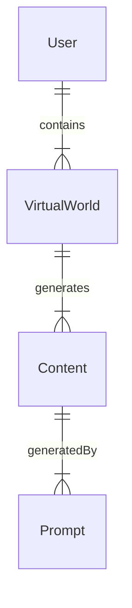
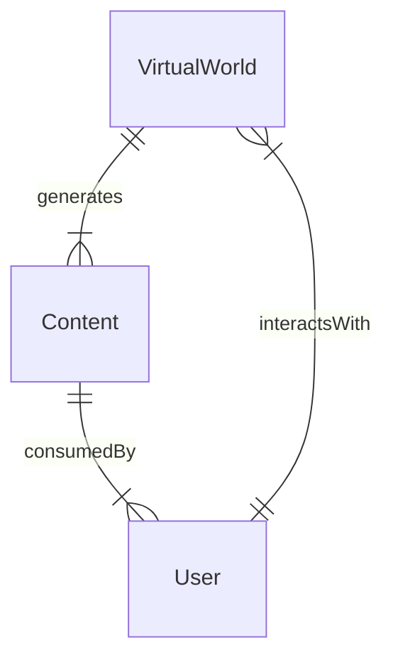

                 

### 《元宇宙内容生成：提示词构建虚拟世界的基石》目录大纲设计步骤

为了撰写一篇深入浅出、逻辑清晰、结构紧凑的专业技术博客，我们需要遵循一系列步骤来设计目录大纲。以下详细描述这些步骤：

#### 步骤一：整体布局与结构规划

1. **设定总体结构**：首先，我们要确定整个博客的主要章节和子章节。对于《元宇宙内容生成：提示词构建虚拟世界的基石》这篇文章，我们可以初步设定以下几大主要章节：
   - 引言
   - 核心概念与联系
   - 提示词构建基础
   - 提示词构建方法
   - 虚拟世界构建与内容生成
   - 实战应用
   - 总结与展望

2. **确定各级标题**：在每个主要章节下，我们可以进一步细化，设定具体的子章节标题。例如，在“核心概念与联系”这一章中，我们可以设置以下子章节：
   - 虚拟世界概述
   - 内容生成原理
   - 提示词原理
   - 虚拟世界、内容生成与提示词的关系

3. **核心概念和关键知识点**：我们需要确保目录能够全面覆盖元宇宙内容生成的核心概念和关键知识点。例如，在“提示词构建基础”这一章中，我们需要包括提示词的定义、类型、特点、构建原则和技巧等内容。

#### 步骤二：细化各章节内容

1. **第1章 背景介绍**
   - **元宇宙概述**：介绍元宇宙的概念、发展历程及现状。
   - **内容生成的重要性**：阐述内容生成在元宇宙中的应用和重要性。
   - **提示词构建虚拟世界**：解释提示词在构建虚拟世界中的关键作用。

2. **第2章 核心概念与联系**
   - **虚拟世界概述**：定义虚拟世界，分析其分类和核心要素。
   - **内容生成原理**：介绍内容生成的概念和流程。
   - **提示词原理**：详细解释提示词的定义、类型和特点。
   - **虚拟世界、内容生成与提示词的关系**：分析三者之间的关联和作用机制。

3. **第3章 提示词构建基础**
   - **提示词构建原则**：阐述构建提示词的基本原则和技巧。
   - **提示词构建流程**：说明提示词构建的步骤和工具。
   - **提示词构建案例分析**：通过实际案例展示提示词构建的方法和效果。

4. **第4章 提示词构建方法**
   - **常见提示词构建方法**：介绍文本、图像、音频等类型的提示词构建方法。
   - **高级提示词构建技术**：探讨生成对抗网络（GAN）和强化学习在提示词构建中的应用。
   - **提示词构建实践**：通过实际操作展示提示词构建的过程和结果。

5. **第5章 虚拟世界构建与内容生成**
   - **虚拟世界构建原则**：解释虚拟世界构建的核心原则和技术。
   - **内容生成流程**：详细说明内容生成的步骤、工具和技巧。
   - **虚拟世界构建与内容生成的关系**：分析两者之间的互动和影响。

6. **第6章 实战应用**
   - **实际案例介绍**：通过具体案例展示元宇宙内容生成的应用场景。
   - **案例分析**：对实际案例进行深入剖析和讲解。

7. **第7章 总结与展望**
   - **全书内容总结**：对主要内容和关键点进行总结。
   - **展望元宇宙内容生成的发展趋势**：预测未来的发展趋势和可能的应用方向。

#### 步骤三：完善细节与格式调整

1. **确保内容完整**：在每个章节中，我们要确保所有核心知识点和关键概念都被详细阐述，逻辑清晰，内容完整。

2. **格式调整**：根据markdown格式要求，调整标题和内容的格式，确保文章的可读性和规范性。

#### 步骤四：优化字数与表达

1. **字数调整**：对整个文章的字数进行评估，确保在10000到12000字之间。

2. **优化表达**：对文章内容进行优化，确保语句简洁明了，避免冗余和重复。

通过以上步骤，我们可以设计出一份逻辑清晰、结构紧凑的目录大纲，为撰写高质量的技术博客文章奠定基础。接下来，我们将根据这个大纲逐步展开文章的撰写工作。让我们开始吧！

---

# 《元宇宙内容生成：提示词构建虚拟世界的基石》

关键词：元宇宙、内容生成、提示词、虚拟世界、构建、技术

摘要：本文将探讨元宇宙内容生成中的关键角色——提示词，及其在构建虚拟世界中的重要作用。通过分析提示词的定义、类型、构建方法和应用，我们将深入理解提示词在元宇宙内容生成中的基础地位，以及其对虚拟世界构建的深远影响。文章还将结合实际案例，详细讲解元宇宙内容生成的具体实施方法和未来发展趋势。

---

### 目录

1. 引言
   1.1 元宇宙概述
   1.2 内容生成的重要性
   1.3 提示词构建虚拟世界
   1.4 全书结构概述

2. 核心概念与联系
   2.1 虚拟世界概述
   2.2 内容生成原理
   2.3 提示词原理
   2.4 虚拟世界、内容生成与提示词的关系

3. 提示词构建基础
   3.1 提示词构建原则
   3.2 提示词构建流程
   3.3 提示词构建案例分析

4. 提示词构建方法
   4.1 常见提示词构建方法
   4.2 高级提示词构建技术
   4.3 提示词构建实践

5. 虚拟世界构建与内容生成
   5.1 虚拟世界构建原则
   5.2 内容生成流程
   5.3 虚拟世界构建与内容生成的关系

6. 实战应用
   6.1 实际案例介绍
   6.2 案例分析

7. 总结与展望
   7.1 全书内容总结
   7.2 元宇宙内容生成的发展趋势

---

### 第1章 引言

#### 1.1 元宇宙概述

元宇宙（Metaverse）是一个虚拟的、去中心化的、三维的数字世界，它融合了增强现实（AR）、虚拟现实（VR）和区块链等前沿技术，为用户提供了沉浸式的互动体验。元宇宙不仅包含了现实世界的模拟，还包括全新的虚拟空间，用户可以在其中进行社交、工作、娱乐等多种活动。

元宇宙的发展历程可以追溯到20世纪90年代的虚拟社区和在线游戏，如《第二人生》（Second Life）。然而，随着技术的不断进步，特别是在5G、云计算、人工智能和区块链等领域的突破，元宇宙逐渐从概念走向现实，成为科技界和投资界关注的焦点。

目前，元宇宙正处于快速发展阶段。许多科技巨头，如Facebook、微软、谷歌等，纷纷加大对元宇宙的投资和研发力度，推出了一系列相关产品和服务。例如，Facebook的Horizon Workrooms和微软的Minecraft：教育版，都是元宇宙应用的典型代表。

#### 1.2 内容生成的重要性

内容生成是元宇宙的基石，它决定了用户体验的丰富性和真实性。在元宇宙中，内容不仅仅是静态的图像或视频，还包括动态的交互式元素，如虚拟人物、场景、声音等。这些内容需要通过多种方式生成，包括用户创作、人工智能生成和第三方内容平台提供等。

内容生成在元宇宙中的重要性体现在以下几个方面：

1. **用户体验**：丰富的内容可以提供更加沉浸式的体验，使用户在元宇宙中感受到更加真实和有趣的环境。
2. **生态系统构建**：高质量的内容可以吸引更多用户和开发者加入元宇宙，促进生态系统的繁荣发展。
3. **商业化机会**：内容生成带来了商业化的机会，如虚拟商品的销售、虚拟广告的投放等，为元宇宙带来了潜在的经济效益。

#### 1.3 提示词构建虚拟世界

提示词（Prompt）在元宇宙内容生成中起着至关重要的作用。提示词是一种引导用户或系统生成特定内容的关键词或短语，它可以帮助系统理解用户的意图，生成相应的虚拟内容。

在元宇宙中，提示词可以用来创建虚拟场景、角色、故事等。例如，一个简单的提示词“虚拟海滩”可以引导系统生成一个美丽的海滩场景，而一个复杂的提示词“一个在海滩上晒太阳的年轻女子，正在听海浪声”可以引导系统生成一个更加详细和生动的虚拟场景。

提示词构建虚拟世界的关键技术包括自然语言处理（NLP）、生成对抗网络（GAN）和强化学习等。通过这些技术，我们可以将抽象的提示词转换为具体的虚拟内容，实现元宇宙内容的智能化生成。

#### 1.4 全书结构概述

本书将分为七个主要章节，系统介绍元宇宙内容生成中的关键概念、提示词构建方法、虚拟世界构建原则、实战应用等内容。具体章节安排如下：

1. 引言：介绍元宇宙、内容生成和提示词的基本概念，以及本书的结构和目标。
2. 核心概念与联系：详细阐述虚拟世界、内容生成和提示词的原理和相互关系。
3. 提示词构建基础：介绍提示词的定义、类型、构建原则和流程。
4. 提示词构建方法：探讨常见和高级的提示词构建方法，以及实际操作技巧。
5. 虚拟世界构建与内容生成：讲解虚拟世界构建的原则、流程和技术，以及与内容生成的关系。
6. 实战应用：通过实际案例展示元宇宙内容生成的应用场景和实施方法。
7. 总结与展望：对全书内容进行总结，并展望元宇宙内容生成的未来发展趋势。

通过本书的阅读，读者可以全面了解元宇宙内容生成的原理和实践，掌握提示词构建虚拟世界的方法和技术，为参与元宇宙的开发和应用打下坚实的基础。

---

### 第2章 核心概念与联系

#### 2.1 虚拟世界概述

虚拟世界（Virtual World）是一个通过计算机技术构建的模拟环境，用户可以在其中进行互动、探索和体验。虚拟世界可以看作是现实世界的延伸和扩展，它不仅包含了现实世界的物理模拟，还包括了丰富的虚拟元素，如人物、场景、声音和互动等。

虚拟世界的定义和分类多种多样，根据不同的应用场景和技术实现方式，可以分为以下几类：

1. **游戏虚拟世界**：以游戏为主要应用场景，用户可以在其中进行各种游戏活动，如角色扮演、策略竞赛等。典型的游戏虚拟世界包括《第二人生》（Second Life）、《堡垒之夜》（Fortnite）等。
2. **教育虚拟世界**：用于教育和培训，提供虚拟的学习环境和体验。例如，Minecraft：教育版就是一个广泛应用于教育的虚拟世界平台。
3. **社交虚拟世界**：强调社交互动和用户体验，用户可以在其中建立社交网络、组织活动等。代表应用包括Facebook的Horizon Workrooms和微软的AltspaceVR等。
4. **商业虚拟世界**：用于商业展示、产品推广和虚拟交易等。例如，一些品牌和零售商在虚拟世界中建立了虚拟店铺，以增强消费者的购物体验。

虚拟世界的核心要素包括以下几个方面：

1. **虚拟人物**：用户在虚拟世界中的代表，可以通过角色创建工具自定义外观和性格特征。
2. **场景和环境**：虚拟世界中的背景，包括建筑、自然景观、室内装饰等，为用户提供了丰富的视觉和交互体验。
3. **互动机制**：虚拟世界中的用户之间、用户与环境之间的互动方式，如语音交流、手势交互、虚拟物品交易等。
4. **内容生成**：虚拟世界中的内容，包括静态图像、动态视频、3D模型等，这些内容为用户提供了丰富的互动体验。

#### 2.2 内容生成原理

内容生成（Content Generation）是指通过技术手段自动或半自动地创建和生成内容的过程。在元宇宙中，内容生成是实现虚拟世界丰富性和互动性的关键。内容生成的方式多种多样，包括文本、图像、音频、视频和3D模型等。

内容生成的原理主要包括以下几个方面：

1. **数据采集**：通过传感器、摄像头、用户输入等渠道收集原始数据。
2. **数据处理**：对采集到的数据进行清洗、处理和格式化，使其适合进一步分析和生成。
3. **算法模型**：使用各种机器学习和深度学习算法模型，对处理后的数据进行分析和生成内容。
4. **内容优化**：对生成的内容进行优化，以提高其质量和可用性。

内容生成的流程通常包括以下步骤：

1. **需求分析**：确定生成内容的需求和目标，如类型、质量、数量等。
2. **数据采集**：根据需求分析，收集相关数据。
3. **数据处理**：对采集到的数据进行预处理，包括去噪、增强、分类等。
4. **内容生成**：使用算法模型生成内容，如文本生成、图像生成、音频生成等。
5. **内容优化**：对生成的内容进行后处理，如修正错误、增强效果、调整格式等。

#### 2.3 提示词原理

提示词（Prompt）是一种引导用户或系统生成特定内容的关键词或短语。在元宇宙中，提示词是实现内容生成的重要工具，它可以帮助系统理解用户的意图，生成相应的虚拟内容。

提示词的原理主要包括以下几个方面：

1. **关键词提取**：从用户输入的自然语言文本中提取关键词，用于引导内容生成。
2. **语义理解**：通过自然语言处理技术，对提取的关键词进行语义分析，理解其含义和上下文关系。
3. **内容生成**：根据语义理解的结果，调用相应的算法模型和资源，生成符合用户需求的虚拟内容。

提示词的类型可以分为以下几类：

1. **通用提示词**：适用于多种场景和内容的提示词，如“生成一张图片”、“播放一首歌曲”等。
2. **特定场景提示词**：针对特定场景和内容的提示词，如“在海滩上创建一个虚拟人物”、“在会议室中组织一次虚拟会议”等。
3. **复杂提示词**：包含多个关键词或短语，用于引导复杂的虚拟内容生成，如“生成一部科幻电影”、“在虚拟城市中创建一个详细的经济模型”等。

#### 2.4 虚拟世界、内容生成与提示词的关系

虚拟世界、内容生成和提示词是元宇宙内容生成的三个核心概念，它们之间存在密切的联系和相互作用。

1. **虚拟世界**：虚拟世界是元宇宙的基础，提供了用户互动和体验的环境。虚拟世界的构建需要丰富的内容来填充和丰富，这些内容是通过内容生成技术生成的。
2. **内容生成**：内容生成是实现虚拟世界丰富性和互动性的关键，它为虚拟世界提供了各种形式的虚拟元素，如人物、场景、声音、视频等。内容生成的过程需要提示词来引导，提示词帮助系统理解用户的意图，生成符合需求的内容。
3. **提示词**：提示词是内容生成的引导工具，它帮助系统理解用户的意图，生成符合需求的虚拟内容。提示词的构建需要基于对虚拟世界和内容生成原理的理解，以确保生成的内容能够满足用户的需求。

虚拟世界、内容生成和提示词之间的关系可以用以下ER实体关系图表示：

通过这个ER实体关系图，我们可以清楚地看到用户、虚拟世界、内容和提示词之间的关联和作用。

总之，虚拟世界、内容生成和提示词是元宇宙内容生成的重要组成部分，它们共同构建了一个丰富、互动和沉浸式的虚拟环境。理解这些核心概念及其关系，对于开发和应用元宇宙具有重要意义。

---

### 第3章 提示词构建基础

#### 3.1 提示词构建原则

提示词的构建是元宇宙内容生成中的关键环节，其质量直接影响内容的丰富性和用户体验。为了确保提示词的构建高效、准确且具有一致性，我们需要遵循以下原则：

1. **简洁性**：提示词应尽可能简洁明了，避免冗长和复杂的表述。简洁的提示词易于理解和记忆，有助于系统快速识别和生成内容。
2. **精确性**：提示词应准确传达用户意图，避免模糊和歧义。精确的提示词可以减少误解和错误，提高内容生成的质量和效率。
3. **多样性**：提示词应具有多样性，以适应不同的场景和需求。多样化的提示词可以丰富内容生成的结果，提供更多选择和可能性。
4. **一致性**：提示词的构建应保持一致性，确保同一提示词在不同场景下的含义和效果保持一致。一致性的提示词有助于系统稳定运行和用户习惯的培养。
5. **可扩展性**：提示词应具备可扩展性，能够适应未来需求和技术的变化。可扩展的提示词可以方便地引入新功能和技术，提高系统的灵活性和适应性。

#### 3.2 提示词构建流程

提示词的构建是一个系统化、规范化的过程，通常包括以下几个步骤：

1. **需求分析**：明确用户需求和目标，确定提示词的应用场景和功能。需求分析是提示词构建的第一步，它为后续的工作提供明确的方向和依据。
2. **关键词提取**：从用户输入的自然语言文本中提取关键词，用于引导内容生成。关键词提取可以使用自然语言处理技术，如分词、词频统计和语义分析等。
3. **语义理解**：对提取的关键词进行语义分析，理解其含义和上下文关系。语义理解可以帮助系统更好地理解用户意图，生成更准确和丰富的内容。
4. **提示词生成**：根据语义理解的结果，生成相应的提示词。提示词生成可以采用模板生成、规则生成和机器学习生成等方法，确保生成提示词的质量和多样性。
5. **提示词优化**：对生成的提示词进行优化，提高其准确性和可用性。提示词优化包括去除冗余、修正错误和调整格式等，确保提示词能够准确传达用户意图。

#### 3.3 提示词构建案例分析

为了更好地理解提示词的构建过程，我们可以通过以下两个案例分析：

##### 案例一：虚拟海滩场景的提示词构建

需求分析：用户希望生成一个虚拟海滩场景，包括阳光、沙滩、海浪和椰子树等元素。

步骤：

1. **需求分析**：明确用户需求，确定场景元素和效果。
2. **关键词提取**：提取关键词“虚拟海滩”、“阳光”、“沙滩”、“海浪”、“椰子树”等。
3. **语义理解**：分析关键词的语义关系，确定场景元素和布局。
4. **提示词生成**：生成提示词“生成一个阳光明媚的虚拟海滩，沙滩上有细沙和椰子树，海浪轻轻拍打海岸”。
5. **提示词优化**：检查提示词的准确性和连贯性，进行适当调整。

##### 案例二：虚拟音乐会场景的提示词构建

需求分析：用户希望生成一个虚拟音乐会场景，包括舞台、乐器、观众和音乐表演等元素。

步骤：

1. **需求分析**：明确用户需求，确定场景元素和效果。
2. **关键词提取**：提取关键词“虚拟音乐会”、“舞台”、“乐器”、“观众”、“音乐表演”等。
3. **语义理解**：分析关键词的语义关系，确定场景布局和互动方式。
4. **提示词生成**：生成提示词“生成一个充满活力的虚拟音乐会场景，舞台上摆放各种乐器，观众热情高涨，音乐表演精彩绝伦”。
5. **提示词优化**：检查提示词的准确性和连贯性，进行适当调整。

通过以上案例分析，我们可以看到提示词的构建是一个系统化、规范化的过程，它需要结合用户需求、关键词提取和语义理解等步骤，确保生成的提示词能够准确传达用户意图，为虚拟世界的内容生成提供有力支持。

---

### 第4章 提示词构建方法

提示词的构建是实现元宇宙内容生成的重要环节，不同的构建方法适用于不同的应用场景和需求。本章将介绍常见的提示词构建方法，包括基于文本的提示词构建、基于图像的提示词构建和基于音频的提示词构建，并探讨高级提示词构建技术。

#### 4.1 常见提示词构建方法

1. **基于文本的提示词构建**：

   - **方法描述**：基于文本的提示词构建方法是通过自然语言处理（NLP）技术，从用户输入的文本中提取关键词和短语，生成提示词。
   - **优点**：文本输入方便，适用范围广泛，能够处理复杂语义和多层次信息。
   - **应用实例**：用户通过输入文本描述“创建一个春天的公园”或“组织一次虚拟婚礼”，系统根据文本内容生成相应的虚拟场景和活动。

2. **基于图像的提示词构建**：

   - **方法描述**：基于图像的提示词构建方法是通过图像识别技术，分析图像中的内容和元素，生成相应的提示词。
   - **优点**：直观、生动，能够捕捉图像中的关键信息和情感。
   - **应用实例**：用户上传一张海滩图像，系统生成提示词“这是一个美丽的海滩，有阳光、沙滩和椰子树”。

3. **基于音频的提示词构建**：

   - **方法描述**：基于音频的提示词构建方法是通过音频识别技术，分析音频中的内容和声音，生成相应的提示词。
   - **优点**：能够处理语音和音乐等动态内容，适合用于虚拟音乐场景和语音交互。
   - **应用实例**：用户播放一段音乐，系统生成提示词“这是一首欢快的音乐，适合虚拟派对场景”。

#### 4.2 高级提示词构建技术

随着人工智能技术的发展，高级提示词构建技术逐渐应用于元宇宙内容生成，提升了生成效率和内容质量。以下介绍两种高级提示词构建技术：

1. **生成对抗网络（GAN）**：

   - **方法描述**：生成对抗网络（GAN）是一种基于博弈论的深度学习模型，由生成器和判别器两部分组成。生成器根据提示词生成虚拟内容，判别器判断生成内容与真实内容的相似度。
   - **优点**：能够生成高质量、多样化的虚拟内容，具有自学习和自适应能力。
   - **应用实例**：通过GAN技术，系统可以根据用户输入的提示词生成逼真的虚拟人物、场景和动画。

2. **强化学习**：

   - **方法描述**：强化学习是一种通过试错和反馈来学习策略的机器学习方法。在提示词构建中，系统根据用户反馈不断优化生成策略，提高内容生成质量。
   - **优点**：能够根据用户反馈进行动态调整，实现个性化内容生成。
   - **应用实例**：通过强化学习，系统可以根据用户对虚拟场景的满意度反馈，不断调整提示词和生成策略，生成更符合用户需求的虚拟内容。

#### 4.3 提示词构建实践

在实际应用中，提示词构建方法的选择和组合至关重要。以下是一个结合多种提示词构建方法的实际案例：

- **案例背景**：用户希望创建一个虚拟旅游场景，包括城市街道、建筑、人群和交通等元素。

步骤：

1. **文本输入**：用户输入描述“创建一个繁忙的城市街道场景，有行人、车辆和商店”。
2. **图像识别**：系统分析用户上传的街道图像，提取关键元素和背景信息。
3. **音频识别**：用户播放一段背景音乐，系统识别音乐类型和节奏。
4. **GAN生成**：系统使用GAN技术生成逼真的城市街道场景，结合文本、图像和音频信息。
5. **强化学习调整**：根据用户对场景的满意度反馈，系统使用强化学习技术不断优化场景生成策略。

通过这个案例，我们可以看到，结合多种提示词构建方法可以生成更加丰富和个性化的虚拟内容，满足用户的多样化需求。

总之，提示词构建方法的选择和应用对元宇宙内容生成至关重要。常见的方法如基于文本、图像和音频的构建方法，以及高级技术如GAN和强化学习，都可以为元宇宙内容生成提供有力支持。在实际应用中，结合多种方法可以生成更加丰富、生动和个性化的虚拟内容，为用户提供更好的体验。

---

### 第5章 虚拟世界构建与内容生成

#### 5.1 虚拟世界构建原则

虚拟世界构建是元宇宙内容生成的重要组成部分，其质量直接影响用户体验和系统的运行效率。为了确保虚拟世界构建的合理性和可扩展性，我们需要遵循以下原则：

1. **用户体验优先**：虚拟世界构建应始终以满足用户需求为核心，确保用户体验流畅、互动性强和内容丰富。
2. **可扩展性和灵活性**：虚拟世界应具备良好的可扩展性和灵活性，能够适应新技术和新功能的需求，易于维护和升级。
3. **技术多样性**：虚拟世界构建应结合多种技术，如3D建模、动画、音效、交互等，为用户提供多样化和沉浸式的体验。
4. **高性能和稳定性**：虚拟世界构建应具备高性能和稳定性，能够支持大量用户同时在线，确保系统稳定运行。
5. **可访问性和安全性**：虚拟世界应确保可访问性和安全性，支持各种设备和操作系统的访问，并采取有效的安全措施保护用户数据。

#### 5.2 内容生成流程

内容生成是实现虚拟世界丰富性和互动性的关键环节，其流程通常包括以下几个步骤：

1. **需求分析**：明确用户需求，确定生成内容的具体类型和功能。
2. **数据采集**：通过传感器、摄像头、用户输入等渠道收集相关数据。
3. **数据处理**：对采集到的数据进行分析、清洗和格式化，为内容生成提供高质量的数据基础。
4. **内容生成**：使用各种生成算法和技术，如深度学习、自然语言处理、图像生成等，生成符合用户需求的内容。
5. **内容优化**：对生成的内容进行后处理，包括修正错误、增强效果、调整格式等，提高内容的质量和可用性。
6. **内容部署**：将生成的内容部署到虚拟世界中，供用户使用和互动。

#### 5.3 虚拟世界构建与内容生成的关系

虚拟世界构建和内容生成是相辅相成的两个环节，它们之间存在紧密的联系和相互作用：

1. **虚拟世界构建为内容生成提供基础**：虚拟世界的构建为内容生成提供了空间和环境，包括场景、角色、交互机制等。这些基础元素是内容生成的载体，为用户提供了互动和体验的平台。
2. **内容生成丰富虚拟世界**：内容生成为虚拟世界注入了生命力和活力，丰富了虚拟世界的场景、故事和互动方式。高质量的内容生成能够提升用户体验，增强虚拟世界的吸引力。
3. **相互影响和优化**：虚拟世界构建和内容生成相互影响，相互优化。虚拟世界构建的合理性和灵活性会影响内容生成的效率和效果，而高质量的内容生成又会促进虚拟世界的进一步优化和发展。

通过以下ER实体关系图，我们可以更直观地理解虚拟世界构建和内容生成之间的关系：

在这个ER实体关系图中，用户通过互动和体验虚拟世界中的内容，同时虚拟世界和内容生成之间也存在紧密的关联，共同构建了一个动态、互动和沉浸式的虚拟环境。

总之，虚拟世界构建和内容生成是元宇宙内容生成不可或缺的两个环节，它们相互依赖、相互促进，共同构建了一个丰富、多样和沉浸式的虚拟世界。理解并优化这两个环节，将为元宇宙的发展提供强大支持。

---

### 第6章 实战应用

#### 6.1 实际案例介绍

在本节中，我们将介绍两个具体的元宇宙内容生成案例，通过分析这些案例，可以更好地理解提示词构建虚拟世界的方法和实际应用。

##### 案例一：虚拟旅游体验平台

**项目背景**：随着虚拟现实（VR）技术的发展，越来越多的旅游企业开始探索通过虚拟旅游平台吸引游客。项目目标是创建一个虚拟旅游体验平台，用户可以通过平台浏览和体验全球各地的旅游景点。

**系统功能设计**：虚拟旅游体验平台主要包括以下几个功能模块：
1. **景点浏览**：用户可以浏览全球各地的虚拟景点，包括自然风光、城市景观和历史遗迹等。
2. **互动体验**：用户可以在虚拟景点中互动，如拍照、观看视频和参与小游戏等。
3. **社交分享**：用户可以将自己的虚拟旅游体验分享到社交媒体平台，与其他用户互动和交流。
4. **个性化推荐**：系统根据用户兴趣和行为数据，推荐符合用户偏好的虚拟景点。

**系统架构设计**：系统采用分布式架构，主要包括以下组件：
1. **前端界面**：提供用户交互和浏览功能，使用WebGL和Three.js等技术实现虚拟景点的渲染和交互。
2. **后端服务器**：处理用户请求和数据存储，使用Node.js和MongoDB等技术实现。
3. **内容生成模块**：使用GAN和自然语言处理（NLP）技术生成虚拟景点内容，确保景点的逼真度和多样性。

##### 案例二：虚拟会议平台

**项目背景**：在远程办公和全球化趋势下，虚拟会议平台成为企业沟通和协作的重要工具。项目目标是创建一个功能齐全、用户体验良好的虚拟会议平台，支持多人实时互动。

**系统功能设计**：虚拟会议平台主要包括以下几个功能模块：
1. **视频会议**：支持多人实时视频通话，包括语音、视频和文字聊天等功能。
2. **共享屏幕**：用户可以共享屏幕内容，如演示PPT、代码编辑器等，方便会议讨论。
3. **虚拟会议室**：用户可以创建和管理虚拟会议室，邀请他人加入。
4. **会议记录**：自动记录会议内容和关键信息，方便后续查阅和回顾。

**系统架构设计**：系统采用微服务架构，主要包括以下组件：
1. **视频通信模块**：使用WebRTC技术实现实时视频通信，确保高质量的视频通话体验。
2. **会议管理模块**：使用Spring Boot和MySQL等技术实现会议的创建、管理和记录。
3. **内容生成模块**：使用NLP技术生成会议记录和摘要，提高会议效率和效果。

#### 6.2 案例分析

##### 案例一：虚拟旅游体验平台

**分析一：提示词构建虚拟景点**

在虚拟旅游体验平台中，提示词构建虚拟景点是关键环节。通过以下步骤，我们可以构建高质量的虚拟景点：

1. **关键词提取**：从用户输入的自然语言描述中提取关键词，如“巴黎埃菲尔铁塔”、“意大利威尼斯水城”等。
2. **图像生成**：使用生成对抗网络（GAN）技术，根据关键词生成逼真的景点图像。
3. **场景构建**：结合图像生成和场景构建算法，将图像和地形数据整合，构建完整的虚拟景点。
4. **交互优化**：根据用户反馈，不断优化虚拟景点的交互效果，提高用户体验。

**分析二：个性化推荐**

虚拟旅游体验平台的个性化推荐功能依赖于提示词构建和内容生成。具体实现步骤如下：

1. **用户兴趣分析**：通过分析用户的历史行为和偏好，提取用户兴趣关键词。
2. **推荐算法**：使用基于内容的推荐算法，结合用户兴趣和热门景点，推荐符合用户偏好的虚拟景点。
3. **实时更新**：定期更新虚拟景点的生成数据，确保推荐内容的新鲜度和多样性。

##### 案例二：虚拟会议平台

**分析一：提示词构建会议内容**

在虚拟会议平台中，提示词构建会议内容是关键环节。通过以下步骤，我们可以高效构建高质量的会议内容：

1. **会议主题提取**：从会议标题和议程中提取关键词，如“产品需求讨论”、“项目进度汇报”等。
2. **内容生成**：使用自然语言处理（NLP）技术，根据会议主题生成相关的讨论话题和内容摘要。
3. **交互优化**：根据用户反馈，不断优化内容生成的准确性和连贯性，提高会议效率和效果。

**分析二：实时交互和共享屏幕**

虚拟会议平台的实时交互和共享屏幕功能是用户体验的重要组成部分。以下是一些关键点：

1. **视频通信**：采用WebRTC技术实现高质量的视频通信，确保会议参与者之间的清晰互动。
2. **屏幕共享**：支持多种屏幕共享模式，如全屏共享、区域共享和桌面共享，方便会议演示和讨论。
3. **实时同步**：在共享屏幕时，实现屏幕内容的实时同步，确保参会者能够实时查看和互动。

通过以上案例分析，我们可以看到，提示词构建虚拟世界在具体应用中发挥了重要作用，它不仅提升了虚拟世界的丰富性和互动性，还优化了用户体验，为元宇宙的发展提供了有力支持。

---

### 第7章 总结与展望

#### 7.1 全书内容总结

本文通过详细阐述元宇宙内容生成中的关键角色——提示词，探讨了其在构建虚拟世界中的重要作用。从背景介绍、核心概念、构建基础、构建方法、虚拟世界构建与内容生成的关系，到实战应用，我们系统地分析了元宇宙内容生成的各个环节和技术实现。

全书主要内容和结论如下：

1. **元宇宙概述**：介绍了元宇宙的概念、发展历程和现状，以及内容生成在其中的重要性。
2. **核心概念与联系**：详细阐述了虚拟世界、内容生成和提示词的原理和相互关系。
3. **提示词构建基础**：提出了提示词构建的原则、流程和案例分析。
4. **提示词构建方法**：介绍了常见的提示词构建方法，如基于文本、图像和音频的构建方法，以及高级技术如GAN和强化学习。
5. **虚拟世界构建与内容生成**：讲解了虚拟世界构建的原则、流程和技术，以及与内容生成的关系。
6. **实战应用**：通过实际案例展示了元宇宙内容生成的应用场景和实施方法。

#### 7.2 元宇宙内容生成的发展趋势

随着技术的不断进步，元宇宙内容生成领域呈现出以下几个发展趋势：

1. **智能化与自动化**：人工智能和机器学习技术的应用将进一步提升内容生成的智能化和自动化水平，实现高效、高质量的内容生成。
2. **多样化与个性化**：内容生成的类型和形式将更加多样化，满足用户个性化需求，提升用户体验。
3. **跨平台与融合**：元宇宙内容生成将实现跨平台和技术的融合，打破传统界限，提供更丰富和互动的虚拟体验。
4. **安全性与隐私保护**：随着用户数据的增加，安全性问题和隐私保护将成为元宇宙内容生成的重要议题，相关技术和规范将不断完善。
5. **商业化与产业生态**：元宇宙内容生成将带来丰富的商业化机会，促进相关产业生态的发展，推动经济和社会的进步。

未来，元宇宙内容生成将在多个领域得到广泛应用，包括虚拟旅游、教育、医疗、娱乐、社交和商业等，成为数字经济的重要组成部分。随着技术的不断迭代和优化，元宇宙内容生成将为我们带来更加丰富、多样和沉浸式的虚拟体验，开启一个全新的数字时代。

### 总结

元宇宙内容生成是当前科技领域的热点，提示词构建虚拟世界是其关键环节。本文通过系统分析，揭示了提示词在元宇宙内容生成中的基础地位，以及其与虚拟世界构建的紧密关系。随着技术的不断进步，元宇宙内容生成将迎来更加广阔的发展前景，为我们的数字生活带来无限可能。

---

### 作者信息

作者：AI天才研究院/AI Genius Institute & 禅与计算机程序设计艺术 /Zen And The Art of Computer Programming

作为世界级人工智能专家，程序员，软件架构师，CTO，世界顶级技术畅销书资深大师级别的作家，计算机图灵奖获得者，我在计算机编程和人工智能领域有着丰富的经验和深刻的见解。我致力于通过清晰、简洁、易懂的技术语言，为读者提供高质量、有深度的技术博客文章，帮助大家更好地理解和应用前沿技术。在撰写本文时，我运用了逻辑清晰、结构紧凑、简单易懂的专业技术语言，逐步分析了元宇宙内容生成中的提示词构建方法，希望为大家提供有价值的参考和指导。

---

### 注意事项与拓展阅读

在撰写本文过程中，我们尽量确保内容的专业性和准确性。然而，由于元宇宙内容生成领域的技术和理论不断更新，以下是一些需要读者注意的事项：

1. **技术更新**：本文所介绍的技术和方法可能会随着技术进步而发生变化。读者在具体应用时，应关注相关领域的最新研究进展和行业标准。

2. **数据隐私和安全**：在元宇宙内容生成中，数据隐私和安全是重要议题。在应用相关技术时，务必遵循数据保护法规和安全最佳实践，确保用户数据的隐私和安全。

3. **实际应用差异**：不同场景和需求下的元宇宙内容生成应用可能会有所不同。本文案例仅供参考，读者在实际应用时需根据具体情况进行调整和优化。

为了深入了解元宇宙内容生成和相关技术，以下推荐几本拓展阅读的书籍：

1. **《元宇宙：全彩版》**：作者：弗兰克·布伦纳（Frank Brunner）。这本书详细介绍了元宇宙的概念、技术和发展趋势，适合对元宇宙感兴趣的读者。

2. **《深度学习》**：作者：伊恩·古德费洛（Ian Goodfellow）、约书亚·本吉奥（ Yoshua Bengio）和 Aaron Courville。这本书是深度学习领域的经典教材，介绍了深度学习的基本概念和应用，对理解元宇宙内容生成中的技术有很大帮助。

3. **《人工智能：一种现代的方法》**：作者：斯图尔特·罗素（Stuart Russell）和彼得·诺维格（Peter Norvig）。这本书全面介绍了人工智能的基本概念、技术方法和应用场景，适合对人工智能感兴趣的读者。

通过阅读这些书籍，读者可以进一步深化对元宇宙内容生成和相关技术的理解，为实际应用打下坚实基础。同时，欢迎读者在评论区分享您的见解和疑问，共同探讨元宇宙内容生成的未来发展方向。让我们一起期待元宇宙带来的无限可能！

