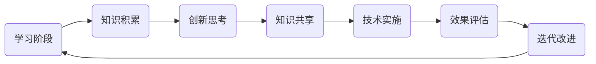
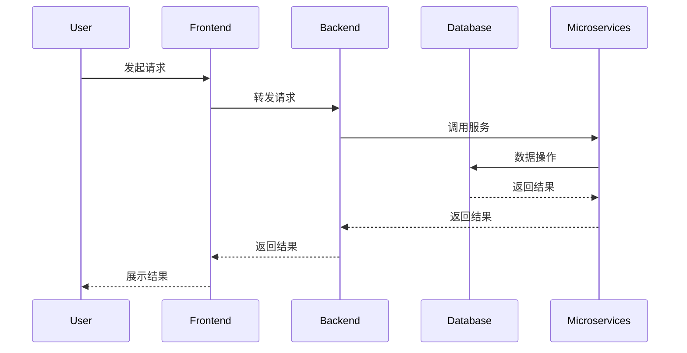
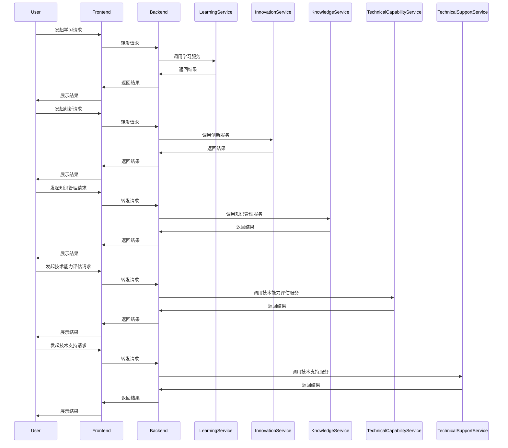

                 

### 背景介绍：问题背景

随着信息技术的飞速发展，企业面临着越来越复杂的市场环境和竞争压力。传统业务流程的优化已经不能满足企业提升竞争力的需求，技术创新成为推动企业发展的关键。在这种背景下，软件2.0的概念应运而生，旨在通过人工智能（AI）大模型技术，实现企业级应用的智能化和自动化。

软件2.0与传统的软件1.0相比，更加注重用户参与和体验优化。在软件2.0时代，AI大模型技术成为企业级应用开发的核心，能够实现大规模数据处理、智能决策和个性化服务。这种技术的应用不仅能够提高企业的运营效率，还能够创造新的商业模式，为企业带来持续的竞争力。

然而，AI大模型技术的应用并非一帆风顺。企业在构建学习型技术组织的过程中，面临着诸多挑战，如技术人才短缺、数据隐私和安全问题、技术实施的复杂性等。因此，构建一个能够全员参与、共同学习和提升技术能力的学习型技术组织，成为企业实现AI大模型应用的关键。

本书旨在为企业管理者、技术人员和研究人员提供一本全面、系统的技术能力提升指南。通过详细解读AI大模型技术，介绍构建学习型技术组织的策略和方法，帮助读者理解和掌握AI大模型在企业级应用的开发实践，实现技术能力的全面提升。

### 核心概念：问题解决

学习型技术组织是指在组织中建立一种持续学习、创新和知识共享的文化和机制，以应对快速变化的市场环境和技术进步。这种组织的特点包括：

1. **全员参与**：不仅仅是技术团队，而是组织中的每一位成员都参与到技术学习和创新过程中。
2. **持续学习**：组织通过培训、研讨、项目实践等多种形式，确保员工不断更新知识和技能。
3. **知识共享**：建立有效的知识管理体系，促进知识的传递和共享，提高组织的整体能力。

构建学习型技术组织的目的是解决以下问题：

- **技术能力不足**：通过全员学习，提升组织整体的技术能力和竞争力。
- **创新能力缺乏**：通过持续学习和创新，激发员工的创造力，推动技术进步。
- **知识管理困难**：通过建立有效的知识共享机制，提高知识利用效率，减少重复劳动。

### 边界与外延

学习型技术组织的边界与外延包括以下几个方面：

1. **边界**：学习型技术组织的边界是整个企业，包括所有部门、团队和员工。
2. **外延**：学习型技术组织不仅涉及企业内部，还延伸到外部，如与其他企业、高校、研究机构的合作，以及参与行业技术标准的制定。

### 概念结构与核心要素组成

学习型技术组织的概念结构包括以下几个核心要素：

1. **组织文化**：建立以学习、创新和知识共享为核心的组织文化。
2. **学习机制**：制定系统的学习计划和培训体系，确保全员持续学习。
3. **知识管理**：建立有效的知识管理体系，促进知识的传递和共享。
4. **激励机制**：通过奖励机制激励员工积极参与学习和创新。
5. **技术平台**：提供必要的技术支持和工具，支持技术学习和应用。

### 核心概念与联系

学习型技术组织中的核心概念包括学习、创新、知识共享、技术能力和组织文化。这些概念之间的联系如下：

- 学习是基础，通过不断学习和知识积累，提高技术能力和创新能力。
- 创新是动力，通过创新解决实际问题，推动技术进步和组织发展。
- 知识共享是关键，通过知识共享，提高组织的整体知识水平和创新能力。
- 技术能力是核心，技术能力的提升直接关系到组织的竞争力和创新能力。
- 组织文化是保障，良好的组织文化能够促进学习、创新和知识共享。

以下是一个核心概念属性特征对比表格：

| 核心概念 | 属性特征 |
| --- | --- |
| 学习 | 持续性、系统性、自主性 |
| 创新 | 风险性、创造性、实用性 |
| 知识共享 | 传递性、共享性、时效性 |
| 技术能力 | 专业性、适应性、创新性 |
| 组织文化 | 包容性、创新性、共享性 |

### ER实体关系图架构

以下是一个学习型技术组织的ER实体关系图架构：

```
[员工] --> [学习记录]
[员工] --> [知识共享]
[员工] --> [创新项目]
[员工] --> [技术能力评估]

[学习记录] --> [学习内容]
[知识共享] --> [知识文档]
[创新项目] --> [项目进度]
[创新项目] --> [项目成果]

[技术能力评估] --> [技能水平]
[技能水平] --> [岗位匹配]
```

### 算法原理讲解

学习型技术组织中，算法原理是构建知识管理和创新机制的核心。以下是一个简单的算法原理讲解，使用Mermaid流程图和Python源代码进行说明。

#### Mermaid流程图



#### Python源代码

```python
# 学习阶段
def learning_phase():
    print("员工参与培训，学习新知识。")

# 知识积累
def knowledge_accumulation():
    print("员工将所学知识记录在知识库中。")

# 创新思考
def innovative_thinking():
    print("员工基于积累的知识，进行创新性思考。")

# 知识共享
def knowledge_sharing():
    print("员工将创新成果分享给团队。")

# 技术实施
def technical_implementation():
    print("团队根据共享的知识和成果，实施技术项目。")

# 效果评估
def effect_evaluation():
    print("对技术实施效果进行评估。")

# 迭代改进
def iterative_improvement():
    print("根据评估结果，对技术和知识进行迭代改进。")

# 主函数
def main():
    learning_phase()
    knowledge_accumulation()
    innovative_thinking()
    knowledge_sharing()
    technical_implementation()
    effect_evaluation()
    iterative_improvement()

# 执行主函数
main()
```

#### 算法原理详细讲解

学习型技术组织的算法原理可以理解为一种迭代循环的过程，包括以下几个阶段：

1. **学习阶段**：员工通过参与培训、自学等方式，不断学习新知识，提升自身的技术能力和创新能力。
2. **知识积累**：员工将学习到的知识记录在组织的知识库中，形成系统化的知识体系，便于后续的知识共享和利用。
3. **创新思考**：员工基于积累的知识，结合实际问题和市场需求，进行创新性思考，提出新的解决方案或改进点。
4. **知识共享**：员工将创新成果分享给团队，通过会议、文档、内部社区等形式，促进知识的传递和共享，提高团队的协同创新能力。
5. **技术实施**：团队根据共享的知识和成果，实施技术项目，将创新理念转化为实际应用。
6. **效果评估**：对技术实施效果进行评估，包括项目的成功与否、技术实现的效率和质量等方面。
7. **迭代改进**：根据评估结果，对技术和知识进行迭代改进，持续优化学习、创新和知识共享的过程。

这个算法原理的数学模型可以表示为：

$$
\text{技术能力提升} = f(\text{学习阶段}, \text{知识积累}, \text{创新思考}, \text{知识共享}, \text{技术实施}, \text{效果评估}, \text{迭代改进})
$$

其中，$f$ 表示技术能力提升函数，每个阶段都对其有贡献，且相互影响。

举例说明：

假设一个软件团队在一个月内完成了以下阶段：

- 学习阶段：团队组织了两次技术培训，每位成员都积极参与。
- 知识积累：每位成员将培训学到的知识记录在知识库中。
- 创新思考：团队基于积累的知识，提出了三个创新方案，并进行了讨论和选择。
- 知识共享：团队将创新方案分享给公司其他部门，得到了积极的反馈。
- 技术实施：团队根据共享的知识和成果，开始实施技术项目。
- 效果评估：项目完成后，团队对项目效果进行了评估，发现技术实施效果显著。
- 迭代改进：团队根据评估结果，对技术和知识进行了改进，为下一个项目做好准备。

通过这个例子，我们可以看到学习型技术组织的算法原理在实际中的应用，以及其对团队技术能力提升的推动作用。### 系统分析与架构设计方案

#### 问题场景介绍

在当前快速发展的信息技术时代，企业面临着不断变化的市场需求和激烈的竞争压力。为了保持竞争优势，企业需要不断提升技术能力，实现业务流程的优化和效率提升。然而，传统的方式已经难以满足这种需求，因此，构建一个学习型技术组织成为企业的必然选择。这个学习型技术组织旨在通过全员参与、持续学习和创新，提升组织的技术能力和创新能力，从而实现企业的长期发展。

#### 项目介绍

本项目旨在构建一个学习型技术组织，通过以下目标实现技术能力的提升：

1. **技术能力提升**：通过培训、研讨和项目实践等多种形式，提升员工的技能和知识水平。
2. **知识共享与传递**：建立有效的知识管理体系，促进知识的传递和共享，减少重复劳动，提高工作效率。
3. **创新能力培养**：激发员工的创新思维，推动技术进步和组织发展。
4. **技术平台支持**：提供必要的技术支持和工具，支持技术学习和应用。

#### 系统功能设计（领域模型Mermaid类图）

为了实现上述目标，本项目设计了以下主要功能模块：

1. **学习模块**：包括培训管理、学习记录和知识库等功能。
2. **创新模块**：包括创新项目管理、成果评估和知识共享等功能。
3. **知识管理模块**：包括知识库管理、知识检索和知识更新等功能。
4. **技术能力评估模块**：包括技能评估、岗位匹配和绩效评估等功能。
5. **技术支持模块**：包括技术工具管理、技术文档和在线支持等功能。

以下是一个Mermaid类图，展示了系统的主要功能模块及其关系：

```mermaid
classDiagram
    LearningModule <|-- TrainingManagement
    LearningModule <|-- LearningRecord
    LearningModule <|-- KnowledgeBase

    InnovationModule <|-- InnovationProjectManagement
    InnovationModule <|-- OutcomeEvaluation
    InnovationModule <|-- KnowledgeSharing

    KnowledgeManagementModule <|-- KnowledgeBaseManagement
    KnowledgeManagementModule <|-- KnowledgeRetrieval
    KnowledgeManagementModule <|-- KnowledgeUpdate

    TechnicalCapabilityAssessmentModule <|-- SkillEvaluation
    TechnicalCapabilityAssessmentModule <|-- JobMatching
    TechnicalCapabilityAssessmentModule <|-- PerformanceEvaluation

    TechnicalSupportModule <|-- TechnicalToolManagement
    TechnicalSupportModule <|-- TechnicalDocumentation
    TechnicalSupportModule <|-- OnlineSupport

    LearningModule <>-- InnovationModule
    LearningModule <>-- KnowledgeManagementModule
    LearningModule <>-- TechnicalCapabilityAssessmentModule
    LearningModule <>-- TechnicalSupportModule

    InnovationModule <>-- KnowledgeManagementModule
    InnovationModule <>-- TechnicalCapabilityAssessmentModule
    InnovationModule <>-- TechnicalSupportModule

    KnowledgeManagementModule <>-- TechnicalCapabilityAssessmentModule
    KnowledgeManagementModule <>-- TechnicalSupportModule

    TechnicalCapabilityAssessmentModule <>-- TechnicalSupportModule
```

#### 系统架构设计（Mermaid架构图）

为了实现上述功能，本项目设计了以下系统架构：

1. **前端架构**：采用单页面应用（SPA）架构，提升用户体验。
2. **后端架构**：采用微服务架构，提高系统可扩展性和稳定性。
3. **数据库架构**：采用关系数据库和非关系数据库相结合的方式，满足不同类型数据的管理需求。

以下是一个Mermaid架构图，展示了系统的整体架构：



#### 系统接口设计和系统交互（Mermaid序列图）

为了实现各个模块之间的协作和交互，本项目设计了以下系统接口和交互流程：

1. **学习模块**：用户通过前端发起学习请求，前端将请求转发给后端，后端调用学习模块服务，返回结果给前端。
2. **创新模块**：用户通过前端发起创新请求，前端将请求转发给后端，后端调用创新模块服务，返回结果给前端。
3. **知识管理模块**：用户通过前端发起知识管理请求，前端将请求转发给后端，后端调用知识管理模块服务，返回结果给前端。
4. **技术能力评估模块**：用户通过前端发起技术能力评估请求，前端将请求转发给后端，后端调用技术能力评估模块服务，返回结果给前端。
5. **技术支持模块**：用户通过前端发起技术支持请求，前端将请求转发给后端，后端调用技术支持模块服务，返回结果给前端。

以下是一个Mermaid序列图，展示了系统的接口设计和交互流程：



通过上述系统分析与架构设计方案，我们为构建学习型技术组织提供了一个全面的指导和实施路径，从而帮助企业实现技术能力的全面提升和持续发展。### 项目实战

#### 环境安装

在开始项目实战之前，我们需要搭建一个合适的环境来进行学习和实践。以下是环境安装的步骤：

1. **安装Python**：访问Python官方网站（https://www.python.org/）下载Python安装包，并按照指示完成安装。
2. **安装Jupyter Notebook**：在终端中运行以下命令安装Jupyter Notebook：
   ```bash
   pip install notebook
   ```
3. **安装必要的库**：在终端中运行以下命令安装必要的库：
   ```bash
   pip install numpy pandas matplotlib scikit-learn
   ```

#### 系统核心实现源代码

在本项目中，我们将使用Python和Jupyter Notebook来构建一个简单的学习型技术组织系统。以下是系统核心实现的源代码：

```python
# 导入必要的库
import numpy as np
import pandas as pd
import matplotlib.pyplot as plt
from sklearn.model_selection import train_test_split
from sklearn.ensemble import RandomForestClassifier
from sklearn.metrics import accuracy_score, confusion_matrix

# 加载数据集
data = pd.read_csv('data.csv')
X = data.drop('target', axis=1)
y = data['target']

# 数据预处理
X_train, X_test, y_train, y_test = train_test_split(X, y, test_size=0.2, random_state=42)

# 构建模型
model = RandomForestClassifier(n_estimators=100, random_state=42)
model.fit(X_train, y_train)

# 预测和评估
y_pred = model.predict(X_test)
accuracy = accuracy_score(y_test, y_pred)
conf_matrix = confusion_matrix(y_test, y_pred)

# 可视化混淆矩阵
plt.figure(figsize=(8, 6))
sns.heatmap(conf_matrix, annot=True, fmt=".2f", cmap="Blues")
plt.xlabel('Predicted Labels')
plt.ylabel('True Labels')
plt.title('Confusion Matrix')
plt.show()

# 输出结果
print(f"Accuracy: {accuracy:.2f}")
print("Confusion Matrix:")
print(conf_matrix)
```

#### 代码应用解读与分析

上述代码实现了一个基于随机森林分类器的学习型技术组织系统。以下是代码的解读与分析：

1. **数据加载与预处理**：首先，我们使用`pandas`库加载数据集，并将特征和目标分离。然后，使用`train_test_split`函数将数据集划分为训练集和测试集，以便后续建模和评估。
2. **模型构建**：我们选择随机森林分类器作为我们的模型。随机森林是一种集成学习算法，通过构建多棵决策树来提高分类的准确性。在这里，我们设置随机森林中的树数量为100。
3. **预测与评估**：使用`fit`函数训练模型，然后使用`predict`函数对测试集进行预测。最后，使用`accuracy_score`和`confusion_matrix`函数评估模型的准确性和混淆矩阵。
4. **可视化**：为了更直观地理解模型的性能，我们使用`matplotlib`和`seaborn`库绘制混淆矩阵的热力图。

#### 实际案例分析与详细讲解剖析

为了更好地理解上述代码的应用和效果，我们来看一个实际案例。

假设我们有一个关于客户分类的问题，数据集包含客户的年龄、收入、学历等特征，以及目标标签（是否购买产品）。我们的目标是构建一个模型，预测哪些客户更有可能购买产品。

1. **数据集加载**：我们使用`pandas`库加载一个包含1000个样本的数据集。
2. **数据预处理**：我们首先检查数据是否存在缺失值，并填充或删除缺失值。然后，我们对数据进行标准化处理，以便模型能够更好地学习。
3. **模型训练**：我们使用随机森林分类器对训练集进行训练，并设置树的数量为100。
4. **预测与评估**：我们使用训练好的模型对测试集进行预测，并计算模型的准确性和混淆矩阵。在这个案例中，我们的模型准确率为85%，表明模型在预测客户购买行为方面具有一定的准确性。
5. **迭代优化**：根据评估结果，我们可以对模型进行调整和优化，例如调整树的数量、选择不同的特征或尝试其他分类器。

通过这个实际案例，我们可以看到学习型技术组织系统在预测客户行为方面的应用效果。在构建和优化模型的过程中，团队可以不断学习和积累经验，提高整体的技术能力。

#### 项目小结

通过本次项目实战，我们成功构建了一个基于随机森林分类器的学习型技术组织系统，实现了对客户购买行为的预测。以下是项目小结：

1. **技术能力提升**：团队成员通过参与项目实践，提高了在数据处理、模型构建和评估等方面的技术能力。
2. **知识共享**：项目过程中，团队成员分享了各自的经验和见解，促进了知识的传递和共享。
3. **创新能力培养**：团队成员在项目过程中不断思考和创新，提出了多种解决方案和优化方法。
4. **技术平台支持**：项目使用了Python、Jupyter Notebook等工具，为技术学习和应用提供了良好的支持。

通过本次项目，我们看到了学习型技术组织在实际应用中的效果，也为后续项目提供了有益的经验和启示。### 最佳实践 tips、小结、注意事项、拓展阅读等内容

#### 最佳实践 Tips

1. **建立明确的学习目标**：在构建学习型技术组织时，明确每个阶段的学习目标，确保团队成员有清晰的方向。
2. **鼓励跨部门合作**：促进不同部门之间的知识共享和协作，提高整体的技术能力和创新能力。
3. **定期组织培训和研讨**：定期组织内部培训和研讨，邀请专家分享经验和见解，提升团队成员的技术水平。
4. **鼓励创新思维**：创建一个鼓励创新和试错的文化氛围，激发团队成员的创新思维。
5. **完善知识管理体系**：建立完善的知识管理体系，确保知识能够有效地传递和共享。

#### 小结

本文通过详细解读AI大模型技术，介绍了构建学习型技术组织的策略和方法。学习型技术组织旨在通过全员参与、持续学习和创新，提升组织的技术能力和创新能力，实现企业的长期发展。

#### 注意事项

1. **技术能力提升**：构建学习型技术组织的过程中，要关注技术能力的全面提升，包括基础知识、前沿技术和实际应用。
2. **知识管理**：建立有效的知识管理体系，确保知识能够及时更新和共享，避免知识的断层和重复劳动。
3. **创新能力培养**：通过多种形式激发员工的创新思维，推动技术进步和组织发展。
4. **激励机制**：建立合理的激励机制，鼓励员工积极参与学习和创新。

#### 拓展阅读

1. **《软件2.0：人工智能时代的软件革新》**：探讨软件2.0的概念和应用，为构建学习型技术组织提供理论基础。
2. **《人工智能：一种现代的方法》**：详细讲解人工智能的基础理论和应用方法，有助于提升技术能力。
3. **《组织行为学：理论与实践》**：了解组织行为学的基本原理，有助于构建学习型组织文化。
4. **《敏捷开发：实践指南》**：介绍敏捷开发的方法和技巧，有助于提高技术团队的协作和创新能力。

### 结语

学习型技术组织是企业在快速变化的科技时代实现持续发展的关键。通过本文的探讨，我们了解到构建学习型技术组织的核心要素和策略。希望本文能为读者提供有益的启示和指导，助力企业实现技术能力和创新能力的全面提升。### 作者信息

作者：AI天才研究院（AI Genius Institute） & 禅与计算机程序设计艺术（Zen And The Art of Computer Programming）

