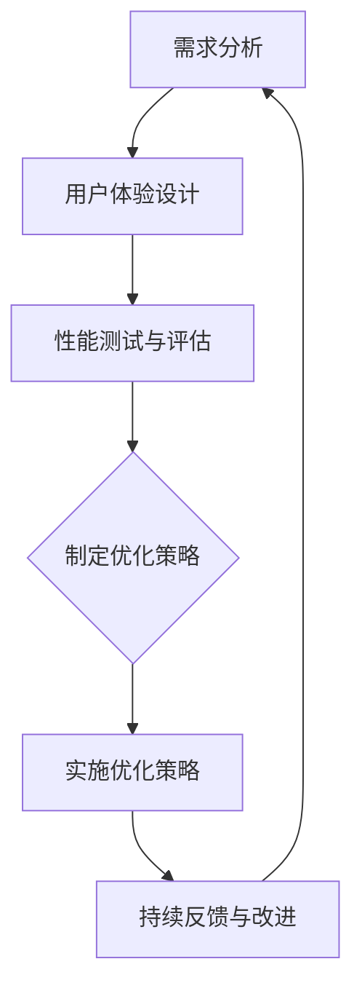
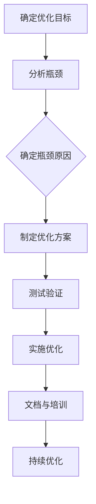

                 

### 性能优化的背景和重要性

在现代互联网时代，性能优化已经成为影响用户体验和业务成功的关键因素。性能优化，顾名思义，是指通过各种技术手段提升系统的响应速度、稳定性和资源利用率，从而提高用户的满意度和系统的整体性能。性能优化不仅关系到用户体验，还直接影响到业务的发展和市场竞争力。

首先，我们需要明确性能优化的定义和目标。性能优化（Performance Optimization）主要是指通过分析、评估和改进系统各个层次（包括前端、后端、数据库、服务器和网络等）的性能，以降低系统的响应时间、提高系统的吞吐量和资源利用率。性能优化的目标包括但不限于：

1. **提高用户响应时间**：减少页面加载时间、响应延迟等，提升用户体验。
2. **增加系统吞吐量**：在相同资源条件下，处理更多的请求。
3. **降低资源消耗**：提高资源利用率，降低服务器和网络的负载。
4. **增强系统稳定性**：减少系统崩溃和错误发生频率，提高系统的可用性。

性能优化的重要性体现在以下几个方面：

1. **用户体验**：快速的响应时间和流畅的用户交互是现代用户体验的核心。一个性能不佳的系统会导致用户流失，从而影响业务的持续发展。
2. **业务效率**：性能优化的系统能够更快地处理任务，提高工作效率，节省人力和资源成本。
3. **市场竞争力**：在竞争激烈的市场环境中，性能优秀的系统能够提供更好的用户体验，吸引更多的用户和客户，从而提升市场竞争力。
4. **业务持续发展**：性能良好的系统能够支持业务规模的扩大，适应不断增长的用户需求。

然而，性能优化并非一蹴而就，它面临诸多挑战：

1. **复杂性**：现代系统通常包含多个组件和层次，性能优化需要全面考虑各个层面的相互影响。
2. **动态变化**：用户需求、数据规模和系统架构都可能随着时间变化，性能优化需要动态适应。
3. **资源限制**：性能优化需要在有限的资源条件下进行，需要在性能提升和成本控制之间找到平衡点。
4. **技术更新**：新技术和工具层出不穷，性能优化需要持续关注行业动态，不断学习新技术。

综上所述，性能优化在当今互联网环境中具有不可忽视的重要性。为了实现性能优化，我们需要从多个角度出发，综合考虑用户体验、业务效率和资源限制，采取科学的方法和策略，逐步提升系统的整体性能。接下来，我们将进一步探讨性能评估与监控、前端性能优化、后端性能优化等多个方面，帮助读者深入了解性能优化的实践和方法。

### 性能优化的重要性

性能优化对于现代软件系统的重要性不可低估，它直接关系到系统的可用性、用户体验和业务的成功。首先，从用户体验的角度来看，性能优化的核心目标是提升系统的响应速度和稳定性，确保用户在使用过程中能够获得流畅、快速的体验。例如，一个电商网站如果响应速度慢，页面加载时间过长，用户很可能会放弃购物，选择竞争对手的服务。相反，如果一个社交媒体平台在用户发布内容时能迅速显示，用户将更愿意使用该平台，从而增加用户粘性和活跃度。

其次，性能优化对于业务效率的提升有着至关重要的作用。在商业环境中，高效的处理速度意味着更快的服务交付和更高的生产效率。例如，对于一个在线交易平台，性能优化可以确保交易过程的快速执行，从而减少交易延迟，提高交易成功率，进而增加交易量和利润。同时，性能良好的系统还可以减少因系统故障或崩溃导致的工作中断，降低运营成本。

再者，性能优化也是提升市场竞争力的关键因素。在互联网经济中，用户体验是影响用户选择的重要标准之一。一个性能优异的系统不仅能吸引新用户，还能保留现有用户，形成良性的用户增长循环。对于企业来说，这意味着可以更好地抓住市场机遇，提升品牌形象和市场份额。

此外，性能优化有助于业务的持续发展。随着用户量的增加和业务需求的增长，系统的性能瓶颈可能会逐渐显现。通过性能优化，企业可以及时发现并解决这些瓶颈，确保系统能够适应不断变化的业务需求。例如，一个视频流媒体平台在用户量剧增时，通过优化服务器和网络性能，可以保证视频播放的流畅性，从而留住大量用户。

综上所述，性能优化不仅仅是一个技术问题，更是关系到企业长期发展的战略问题。它不仅能够提升用户体验和业务效率，还能增强企业的市场竞争力和业务持续发展能力。因此，无论是初创企业还是大型企业，都应该高度重视性能优化，并将其作为一项核心任务来持续优化和改进。

### 性能优化的方法概述

要实现有效的性能优化，我们需要采用一系列科学的方法和策略。这些方法和策略可以从系统设计、开发、部署和维护等多个阶段入手，确保系统的各个组件都能以最佳状态运行。以下是一些常见的性能优化方法和策略：

1. **代码优化**：这是性能优化的基础，通过优化代码结构、减少冗余、提高代码复用性，可以显著提升系统的性能。具体方法包括使用高效算法、避免不必要的计算、减少内存分配等。

2. **缓存技术**：缓存是提高系统性能的有效手段。通过将频繁访问的数据存储在缓存中，可以减少对后端系统的访问次数，从而提高系统的响应速度。常见的缓存技术有内存缓存、分布式缓存（如Redis）和数据库缓存等。

3. **并发处理**：并发处理能够提高系统的吞吐量，使系统能够同时处理多个请求。通过线程池、异步编程和多线程等技术，可以优化系统资源利用率，提高处理效率。

4. **负载均衡**：负载均衡是将请求分布到多个服务器上，从而避免单点故障和资源瓶颈。常用的负载均衡算法有轮询、最小连接数和响应时间等，通过合理配置负载均衡器，可以提高系统的可靠性和性能。

5. **数据库优化**：数据库是系统性能的关键因素之一。通过优化数据库查询、建立索引、分库分表等技术，可以显著提升数据库的访问速度和处理能力。

6. **静态资源优化**：静态资源（如CSS、JavaScript和图片）的优化对于提升页面加载速度至关重要。可以通过压缩文件、使用内容分发网络（CDN）、启用HTTP缓存等方式来优化静态资源的加载速度。

7. **服务器和网络优化**：服务器和网络性能的优化也是提高系统整体性能的重要环节。通过优化服务器配置、网络带宽管理和网络延迟监控等技术，可以提高系统的响应速度和稳定性。

8. **监控和调优**：性能优化不是一次性的工作，而是一个持续的过程。通过监控系统的运行状态，收集性能数据，发现性能瓶颈，然后进行针对性优化，可以不断改进系统的性能。

9. **自动化工具**：自动化工具能够大大提高性能优化的效率和准确性。例如，自动化性能测试工具可以帮助我们发现系统中的性能问题，自动化部署工具可以确保性能优化策略的持续实施。

10. **持续集成和持续交付（CI/CD）**：通过CI/CD流程，可以确保每次代码更新都能自动进行性能测试和部署，从而快速发现和解决性能问题。

综上所述，性能优化是一个多方面的系统工程，需要综合考虑系统的各个方面。通过合理的方法和策略，我们可以在提高系统性能的同时，确保用户体验和业务效率的提升。在接下来的章节中，我们将深入探讨前端、后端、数据库和服务器等多个方面的性能优化方法，帮助读者全面了解和掌握性能优化的实践技巧。

### 用户体验的重要性

用户体验（User Experience, UX）在现代软件设计和开发中占据着核心地位。用户体验不仅仅是界面设计的视觉美感，更是用户在使用产品过程中感受到的整体感受。一个优秀的设计能够满足用户的需求，提升用户满意度，从而增强用户忠诚度和品牌认知度。以下是用户体验的重要性及其对性能优化的影响：

首先，用户体验直接影响用户的满意度。当用户在使用过程中遇到问题或感到不便时，很可能会产生负面情绪，甚至放弃使用。而一个设计合理、操作简便、响应迅速的系统能够提升用户的满意度，让用户感到愉悦和舒适。

其次，用户体验对用户的留存和活跃度有重要影响。在竞争激烈的市场环境中，用户体验成为用户选择产品的重要因素之一。一个用户体验优秀的产品能够吸引新用户，并通过良好的使用体验留住他们，形成用户粘性。例如，社交媒体平台通过优化界面设计和响应速度，吸引了大量用户，并保持了较高的活跃度。

用户体验还关系到产品的市场竞争力。一个用户体验出色的产品往往能够脱颖而出，赢得用户的青睐，从而在市场上占据优势地位。例如，苹果公司通过其优秀的设计和卓越的用户体验，成功建立了强大的品牌影响力，在智能手机市场上取得了巨大成功。

在性能优化中，用户体验的重要性尤为突出。性能直接影响用户体验，因此性能优化是提升用户体验的关键手段。以下是性能对用户体验的影响：

1. **响应速度**：快速响应是用户满意度的关键因素。一个系统如果响应速度慢，会导致用户等待时间增加，降低用户操作效率，影响用户体验。例如，电商网站如果页面加载时间过长，用户可能会放弃购物。

2. **稳定性**：系统的稳定性对用户体验至关重要。一个频繁崩溃或出现错误的系统会让用户感到不安和不信任，从而影响用户的使用体验。例如，社交媒体平台如果频繁出现错误，用户可能会转向其他平台。

3. **交互流畅性**：流畅的交互体验可以提升用户的满意度。例如，用户在操作过程中能够感受到系统的即时反馈，会觉得操作更加顺畅和舒适。

为了提升用户体验，性能优化应从以下几个方面进行：

1. **前端优化**：通过优化CSS、JavaScript和HTML文件，减少冗余代码和资源，提高页面加载速度和交互流畅性。

2. **后端优化**：通过优化数据库查询、代码结构和服务器配置，提高系统的响应速度和稳定性。

3. **网络优化**：通过优化网络架构、带宽管理和延迟监控，提高数据传输速度和系统稳定性。

4. **资源管理**：合理分配和使用系统资源，确保系统能够高效运行。

5. **监控和调优**：通过监控系统和用户行为，及时发现性能瓶颈，进行针对性优化。

综上所述，用户体验在软件设计和开发中至关重要，而性能优化则是提升用户体验的关键手段。通过科学合理的性能优化，我们能够确保系统在各种情况下都能提供出色的用户体验，从而提升用户满意度、留存率和市场竞争力。

### 性能对用户体验的影响

性能对用户体验的影响是全方位且深远的，不仅涉及用户的主观感受，还直接影响用户的操作效率和满意度。以下是性能对用户体验的具体影响及其对系统设计的影响：

首先，响应速度是影响用户体验的核心因素之一。一个系统的响应速度越快，用户在操作过程中等待的时间越短，操作效率越高，用户满意度也越高。例如，在电子商务网站中，页面加载速度直接影响用户的购物体验。如果页面加载缓慢，用户可能会感到不耐烦，从而选择离开，转而使用竞争对手的网站。而一个加载迅速、响应及时的网站，能够提升用户的购物体验，增加购买意愿。

其次，系统的稳定性对用户体验也有着重要影响。稳定性意味着系统在各种情况下都能正常运行，不出现频繁崩溃或错误。一个稳定可靠的系统可以让用户感到信任和安全，从而愿意长期使用。例如，社交媒体平台如果频繁出现加载失败或崩溃，用户可能会感到不安，并转向其他更稳定的平台。因此，在设计系统时，确保系统的稳定性是至关重要的。

交互流畅性也是用户体验的重要组成部分。流畅的交互体验可以让用户在操作过程中感到舒适和愉悦。例如，在移动应用中，如果用户在滑动屏幕时能够感受到平滑的过渡效果，会感到操作更加自然和流畅。流畅的交互可以通过优化动画效果、减少卡顿和延迟来实现。

性能对用户体验的影响不仅限于以上几点，还包括加载时间、资源消耗、响应时间等多个方面。以下是一个简化的框架，展示了性能对用户体验的影响路径：

1. **响应速度**：
   - 快速响应 → 提高操作效率
   - 缓慢响应 → 增加等待时间 → 降低用户满意度

2. **稳定性**：
   - 稳定系统 → 提高用户信任度
   - 系统不稳定 → 增加错误率 → 降低用户满意度

3. **交互流畅性**：
   - 流畅交互 → 提高用户舒适度
   - 卡顿交互 → 降低用户愉悦感

在设计系统时，为了提升用户体验，我们需要从多个角度进行性能优化：

1. **前端优化**：
   - 减少冗余代码和资源
   - 使用高效的JavaScript和CSS代码
   - 优化图片和视频加载

2. **后端优化**：
   - 优化数据库查询
   - 使用缓存技术
   - 提高服务器处理速度

3. **网络优化**：
   - 使用内容分发网络（CDN）
   - 优化网络架构
   - 减少网络延迟

4. **资源管理**：
   - 合理分配系统资源
   - 优化内存和CPU使用率

5. **监控和调优**：
   - 实时监控系统性能
   - 定期进行性能测试和调优

通过这些性能优化措施，我们能够确保系统在各种情况下都能提供出色的用户体验，从而提高用户满意度、留存率和市场竞争力。在接下来的章节中，我们将进一步探讨如何通过具体的性能优化方法来提升用户体验。

### 从用户体验到性能优化的桥梁

用户体验（User Experience, UX）与性能优化之间存在紧密的联系，二者共同构成了现代软件系统设计的关键桥梁。性能优化不仅仅是技术问题，它更关乎用户在使用产品过程中的感受和满意度。理解这一桥梁的重要性，有助于我们在设计过程中更加注重用户体验，从而实现系统的整体优化。

首先，我们需要明确用户体验（UX）和性能优化之间的关系。用户体验关注的是用户在使用产品或服务过程中的感受和体验，而性能优化则致力于通过技术手段提升系统的响应速度、稳定性和资源利用率。性能优化是实现良好用户体验的必要条件，只有当系统性能达到一定水平时，用户才能获得流畅、高效的使用体验。因此，性能优化与用户体验是相辅相成的，性能优化成功与否直接影响到用户体验的质量。

接下来，我们探讨从用户体验到性能优化的具体桥梁。这一桥梁需要通过一系列的设计和实现步骤来搭建，以确保最终系统能够满足用户的期望。以下是构建这一桥梁的几个关键步骤：

1. **需求分析**：在项目启动阶段，首先需要对用户需求进行详细分析。理解用户的核心需求和痛点，可以帮助我们识别系统性能瓶颈的潜在因素。例如，对于电商平台，用户可能关注购物流程的简洁性和支付速度。这些需求将指导我们在设计过程中考虑性能优化策略。

2. **用户体验设计**：基于需求分析结果，进行用户体验设计。在这一阶段，设计师需要关注用户界面的易用性、交互的流畅性和视觉的吸引力。性能优化设计原则应贯穿于整个设计过程中，例如，在UI/UX设计时，优先考虑轻量级界面元素，减少加载时间和资源消耗。

3. **性能测试与评估**：在开发过程中，定期进行性能测试和评估，可以帮助我们及时发现和解决性能问题。性能测试包括加载测试、压力测试和并发测试等，通过这些测试，我们可以评估系统的响应速度、稳定性和资源利用率。性能测试结果将指导我们进一步优化系统。

4. **性能优化策略**：根据性能测试结果，制定和实施具体的性能优化策略。这包括前端优化（如压缩代码、优化图片和视频）、后端优化（如数据库查询优化、缓存使用）和服务器优化（如负载均衡、资源分配）。每个优化策略都需要根据具体情况进行调整和测试，以确保优化效果。

5. **持续反馈与改进**：性能优化是一个持续的过程，需要不断地进行反馈和改进。通过收集用户反馈和性能数据，我们可以发现新的性能瓶颈和优化机会。持续的反馈和改进有助于我们不断提升系统的性能，从而提供更好的用户体验。

为了更好地理解用户体验与性能优化的桥梁，以下是一个简化的流程图，展示了从用户体验到性能优化的路径：

在这个流程中，需求分析、用户体验设计、性能测试与评估、优化策略制定和实施、持续反馈与改进相互关联，形成一个闭环，确保系统能够持续优化，不断提升用户体验。

总之，从用户体验到性能优化的桥梁是现代软件系统设计的重要环节。通过科学的需求分析、用户体验设计、性能测试和持续的优化改进，我们能够确保系统在各种情况下都能提供出色的用户体验，从而实现系统性能和用户体验的全面提升。在接下来的章节中，我们将进一步探讨性能评估与监控、前端性能优化和后端性能优化等具体实践方法，帮助读者全面掌握性能优化的技巧。

### 用户体验指标（UX Metrics）

在性能优化过程中，用户体验指标（UX Metrics）是评估和衡量系统性能对用户体验影响的重要工具。这些指标提供了量化数据，帮助我们了解用户在使用产品时的行为和感受。以下是一些关键的用户体验指标，以及它们对性能优化的重要性：

1. **响应时间（Response Time）**：
   - **定义**：响应时间是指用户发起操作到系统给出反馈的时间间隔。
   - **重要性**：快速的响应时间能够显著提升用户体验，减少用户等待时间和操作延迟。
   - **优化建议**：通过减少后端处理时间、优化数据库查询、减少网络延迟等手段来降低响应时间。

2. **加载时间（Loading Time）**：
   - **定义**：加载时间是指页面从请求到完全展示所需的时间。
   - **重要性**：页面加载时间是影响用户体验的关键因素之一，加载时间过长会导致用户流失。
   - **优化建议**：通过优化前端资源、使用CDN、压缩文件和懒加载等技术来减少加载时间。

3. **卡顿率（Janky Rate）**：
   - **定义**：卡顿率是衡量系统流畅度的指标，表示在一段时间内出现卡顿的次数占总次数的比例。
   - **重要性**：高卡顿率会影响用户操作的流畅性，降低用户体验。
   - **优化建议**：通过优化动画效果、减少重绘和回流次数、使用异步加载等技术来减少卡顿率。

4. **错误率（Error Rate）**：
   - **定义**：错误率是指系统出现错误或崩溃的频率。
   - **重要性**：高错误率会严重损害用户体验，影响用户信任和满意度。
   - **优化建议**：通过加强代码审查、优化错误处理机制、进行压力测试等手段来降低错误率。

5. **用户满意度（User Satisfaction）**：
   - **定义**：用户满意度是衡量用户对产品体验的主观评价。
   - **重要性**：用户满意度直接影响用户的忠诚度和品牌认知。
   - **优化建议**：通过持续收集用户反馈、改进界面设计、优化功能流程等方式来提升用户满意度。

6. **转化率（Conversion Rate）**：
   - **定义**：转化率是指完成特定目标（如注册、购买等）的用户占总用户的比例。
   - **重要性**：高转化率是衡量产品成功的重要指标，直接影响业务收益。
   - **优化建议**：通过优化转化路径、简化用户操作流程、提高页面引导等方式来提升转化率。

7. **跳出率（Bounce Rate）**：
   - **定义**：跳出率是指用户在打开页面后未进行任何操作就离开的比率。
   - **重要性**：高跳出率通常表明用户体验不佳，需要优化页面内容和设计。
   - **优化建议**：通过改善页面内容、提高页面质量、优化导航结构等方式来降低跳出率。

综上所述，用户体验指标在性能优化中扮演着关键角色。通过监控和分析这些指标，我们能够发现系统中的性能瓶颈，制定和实施针对性的优化策略，从而提升用户体验和系统整体性能。在接下来的章节中，我们将进一步探讨性能评估与监控的方法和技术，帮助读者深入了解如何有效地进行性能优化。

### 性能评估的基本概念

性能评估是性能优化的第一步，通过系统地评估系统的各个方面，识别性能瓶颈和潜在问题，为后续的优化工作提供明确的方向。性能评估的基本概念包括性能指标、性能瓶颈和评估方法等。

首先，我们需要了解性能指标（Performance Metrics）。性能指标是用于量化系统性能的参数，常见的性能指标包括响应时间、吞吐量、延迟、错误率等。这些指标能够帮助我们衡量系统的性能水平，发现潜在的瓶颈和问题。

1. **响应时间（Response Time）**：
   - 定义：响应时间是指用户发起请求到系统返回响应所需的时间。
   - 类型：平均响应时间、最大响应时间、最小响应时间、95%响应时间等。
   - 分析：通过分析响应时间，我们可以了解系统的响应速度和用户的等待时间。

2. **吞吐量（Throughput）**：
   - 定义：吞吐量是指单位时间内系统能够处理的请求或事务数量。
   - 类型：每秒请求数（Requests per Second, RPS）、每秒事务数（Transactions per Second, TPST）等。
   - 分析：吞吐量反映了系统的处理能力，对于高并发系统尤为重要。

3. **延迟（Latency）**：
   - 定义：延迟是指用户发起请求到系统开始处理请求的时间间隔。
   - 类型：平均延迟、最大延迟、最小延迟等。
   - 分析：延迟是影响用户体验的关键因素，减少延迟能够提升用户的满意度。

4. **错误率（Error Rate）**：
   - 定义：错误率是指系统在处理请求过程中出现错误的频率。
   - 类型：百分比错误率、每秒错误数等。
   - 分析：高错误率通常表明系统存在严重问题，需要及时排查和修复。

其次，性能瓶颈（Performance Bottlenecks）是性能评估中需要重点关注的问题。性能瓶颈是指系统中的某个环节限制了整体性能，导致系统无法达到预期性能水平。常见的性能瓶颈包括：

1. **CPU瓶颈**：
   - 现象：系统处理能力不足，CPU利用率高。
   - 原因：计算密集型任务过多，处理器资源不足。
   - 解决方法：增加处理器核心、优化算法、分散负载等。

2. **内存瓶颈**：
   - 现象：系统频繁出现内存不足错误，内存占用率过高。
   - 原因：内存分配不合理，大量对象未被及时回收。
   - 解决方法：优化内存管理、使用缓存、减少内存占用等。

3. **磁盘I/O瓶颈**：
   - 现象：系统读写速度慢，磁盘I/O利用率高。
   - 原因：磁盘读写请求过多，磁盘性能不足。
   - 解决方法：使用SSD替换传统硬盘、优化文件系统、分散I/O负载等。

4. **网络瓶颈**：
   - 现象：系统网络延迟高，数据传输速度慢。
   - 原因：网络带宽不足，网络设备性能差。
   - 解决方法：增加网络带宽、优化网络架构、使用CDN等。

最后，性能评估方法（Performance Assessment Methods）是识别和解决性能瓶颈的重要手段。以下是一些常见的性能评估方法：

1. **负载测试（Load Testing）**：
   - 定义：模拟大量用户同时访问系统，评估系统的响应速度和稳定性。
   - 工具：JMeter、LoadRunner等。
   - 分析：通过负载测试，我们可以了解系统在不同负载下的性能表现，发现性能瓶颈。

2. **压力测试（Stress Testing）**：
   - 定义：在极端条件下测试系统的性能，评估系统的最大处理能力和稳定性。
   - 工具：Apache JMeter、Gatling等。
   - 分析：压力测试有助于识别系统的极限性能和潜在问题。

3. **性能监控（Performance Monitoring）**：
   - 定义：实时监控系统的性能指标，及时发现和解决问题。
   - 工具：Prometheus、Grafana、New Relic等。
   - 分析：通过性能监控，我们可以持续跟踪系统的性能变化，制定优化策略。

4. **代码审查（Code Review）**：
   - 定义：通过人工或自动化工具对代码进行审查，发现潜在的性能问题。
   - 工具：SonarQube、Checkmarx等。
   - 分析：代码审查有助于提前发现和解决性能问题，避免代码中的潜在隐患。

综上所述，性能评估是性能优化的基础，通过理解性能指标、识别性能瓶颈和采用合适的评估方法，我们能够全面了解系统的性能状况，为后续的优化工作提供有力支持。在接下来的章节中，我们将进一步探讨性能监控的工具和技术，帮助读者深入了解如何在实际环境中进行有效的性能评估和优化。

### 性能监控的工具和技术

在性能优化过程中，性能监控是至关重要的环节。通过实时监控系统的性能指标，我们可以及时发现潜在的问题和瓶颈，确保系统在最佳状态下运行。以下是一些常用的性能监控工具和技术，以及它们的特点和应用场景。

1. **Prometheus**：
   - **特点**：Prometheus是一个开源的性能监控和告警工具，基于拉模式收集数据，具有高度的灵活性和扩展性。
   - **应用场景**：适用于大规模分布式系统，可以监控各种指标，如CPU使用率、内存使用率、磁盘I/O、网络流量等。
   - **优势**：支持多种数据存储和可视化工具，如Grafana、Kubernetes等，便于进行复杂的数据分析和告警。

2. **Grafana**：
   - **特点**：Grafana是一个开源的数据可视化和监控工具，可以与多种数据存储和监控系统集成，提供丰富的图表和仪表盘。
   - **应用场景**：适用于各种规模和类型的监控系统，特别是需要实时监控和复杂数据分析的场景。
   - **优势**：易于使用和配置，支持多种数据源，如Prometheus、InfluxDB、Kibana等，能够提供直观的监控界面。

3. **New Relic**：
   - **特点**：New Relic是一个商业性能监控和分析平台，提供全面的代码、应用程序和基础架构监控功能。
   - **应用场景**：适用于需要全面监控和性能分析的企业级应用，特别是Web应用程序和后端服务。
   - **优势**：提供丰富的监控指标和告警功能，支持自动化优化建议，有助于快速定位和解决性能问题。

4. **Datadog**：
   - **特点**：Datadog是一个综合性的监控和分析平台，支持多种编程语言和框架，提供实时监控、日志管理和自动化告警功能。
   - **应用场景**：适用于需要集成多种监控工具和服务的现代分布式系统，特别是微服务架构和云原生应用。
   - **优势**：提供全面的监控仪表板和可视化工具，支持自定义监控指标和告警策略，有助于提高系统的可靠性和性能。

5. **Zabbix**：
   - **特点**：Zabbix是一个开源的监控解决方案，支持自动发现和监控各种网络设备和服务器，提供实时数据监控和告警。
   - **应用场景**：适用于中小型企业、数据中心和云环境中的各种设备和应用。
   - **优势**：支持多种监控类型，如性能监控、可用性监控和日志监控，易于扩展和定制，适用于复杂的监控需求。

6. **StatsD**：
   - **特点**：StatsD是一个简单的性能监控工具，用于收集和发送性能数据，通常与Graphite等数据存储和可视化工具配合使用。
   - **应用场景**：适用于需要实时监控和统计数据的简单系统，特别是对于高并发的Web应用程序。
   - **优势**：轻量级、易于配置，支持多种统计方法，如计数器、定时器和分布统计，适用于快速开发和部署。

通过上述工具和技术的应用，我们可以实现对系统的全面监控，及时发现和处理性能问题。性能监控不仅有助于优化系统的性能，还能提高系统的可靠性和稳定性，从而为用户提供更好的用户体验。在接下来的章节中，我们将进一步探讨性能瓶颈分析和性能优化策略的制定，帮助读者深入掌握性能优化的实践方法。

### 性能瓶颈分析

性能瓶颈分析是性能优化的核心步骤之一，其目标是识别系统中的瓶颈，确定影响系统性能的关键因素，并制定相应的优化策略。性能瓶颈分析需要从多个维度进行，包括资源利用率、系统响应时间、并发处理能力等。以下是一些常见的方法和工具，用于识别和解决性能瓶颈。

1. **资源利用率分析**：
   - **工具**：常用的工具包括系统监视器（如Windows Task Manager、Linux `top` 命令）和性能分析工具（如VisualVM、JProfiler）。
   - **方法**：通过监控CPU、内存、磁盘I/O和网络等资源的利用率，识别哪些资源被过度使用，从而导致系统性能下降。例如，如果CPU利用率长时间接近100%，可能意味着存在计算密集型任务。
   - **优化建议**：针对资源利用率高的情况，可以考虑增加服务器资源、优化代码以减少资源消耗、分配更合理的资源配额等。

2. **系统响应时间分析**：
   - **工具**：常用的工具包括性能监控工具（如Prometheus、Grafana）和日志分析工具（如ELK Stack）。
   - **方法**：通过监控系统的响应时间分布和延迟，识别系统的响应时间瓶颈。例如，通过分析响应时间的分布图，可以发现系统中某些请求的处理时间异常长。
   - **优化建议**：针对响应时间长的问题，可以考虑优化数据库查询、减少网络延迟、优化前端资源加载等。

3. **并发处理能力分析**：
   - **工具**：常用的工具包括并发测试工具（如Apache JMeter、Gatling）和性能监控工具（如New Relic、AppDynamics）。
   - **方法**：通过模拟高并发场景，分析系统的并发处理能力和瓶颈。例如，在高并发测试中，如果系统的吞吐量远低于预期，可能存在并发瓶颈。
   - **优化建议**：针对并发处理能力不足的问题，可以考虑使用负载均衡器、优化数据库连接池、增加服务器资源等。

4. **日志分析**：
   - **工具**：常用的工具包括日志收集和分析工具（如ELK Stack、Logstash、Kibana）。
   - **方法**：通过分析系统日志，识别错误、异常和处理延迟。例如，通过分析错误日志，可以发现系统中常见的错误类型和发生频率。
   - **优化建议**：针对日志分析中发现的问题，可以考虑优化错误处理机制、提高系统的健壮性、增加日志监控和告警等。

5. **代码审查**：
   - **工具**：常用的工具包括静态代码分析工具（如SonarQube、Checkmarx）和动态代码分析工具（如JaCoCo、PMD）。
   - **方法**：通过审查代码，识别性能瓶颈和潜在问题。例如，通过静态代码分析，可以发现代码中的冗余、低效和错误。
   - **优化建议**：针对代码审查中发现的问题，可以考虑优化算法、减少不必要的计算、改进数据结构等。

6. **性能基准测试**：
   - **工具**：常用的工具包括性能基准测试工具（如Apache JMeter、Gatling）。
   - **方法**：通过模拟不同的负载场景，评估系统的性能表现。例如，通过负载测试，可以评估系统在高并发下的响应时间和稳定性。
   - **优化建议**：根据性能基准测试的结果，可以识别系统的瓶颈，并针对性地进行优化。

综上所述，性能瓶颈分析是性能优化的重要组成部分。通过多种方法和工具，我们可以全面识别系统中的瓶颈，并制定有效的优化策略，从而提升系统的性能和稳定性。在接下来的章节中，我们将进一步探讨性能优化策略的制定和实施，帮助读者深入了解性能优化的实践过程。

### 性能优化策略的制定

在性能瓶颈分析之后，制定和实施有效的性能优化策略是提升系统性能的关键步骤。一个科学合理的性能优化策略能够针对性地解决系统中的性能瓶颈，从而提升系统的整体性能。以下是制定性能优化策略的主要步骤和方法：

1. **确定优化目标**：
   - **定义具体目标**：在制定性能优化策略之前，需要明确具体的优化目标。这些目标可以是提高响应速度、增加吞吐量、减少错误率或提高系统稳定性等。
   - **优先级排序**：根据业务需求和系统现状，对优化目标进行优先级排序。通常，影响用户体验最直接的优化目标应优先考虑。

2. **分析瓶颈**：
   - **识别瓶颈**：通过对系统进行全面的性能瓶颈分析，识别系统中的性能瓶颈。这包括资源利用率高、响应时间长、并发处理能力不足等问题。
   - **确定瓶颈原因**：分析每个瓶颈的深层次原因，例如代码效率低下、数据库查询优化不足、网络延迟等。

3. **制定优化方案**：
   - **技术方案**：根据瓶颈分析和优化目标，制定具体的技术优化方案。这可以包括代码优化、数据库优化、网络优化、负载均衡等。
   - **资源调整**：根据系统的负载情况和资源利用率，进行必要的资源调整。例如，增加服务器资源、优化数据库架构、使用更高效的存储设备等。

4. **测试验证**：
   - **制定测试计划**：在实施优化方案之前，需要制定详细的测试计划，包括测试环境、测试用例和测试指标。
   - **执行测试**：在实际环境中执行性能测试，验证优化方案的效果。可以使用工具如Apache JMeter、Gatling等模拟高并发场景，评估系统的响应速度、吞吐量和稳定性。

5. **实施优化**：
   - **分阶段实施**：将优化方案分成多个阶段逐步实施，避免一次性大规模变更带来的风险。
   - **监控与调整**：在实施优化过程中，持续监控系统的性能指标，及时发现新的瓶颈和问题，进行针对性的调整。

6. **文档和培训**：
   - **编写文档**：详细记录优化策略、方案和实施步骤，便于后续的维护和优化。
   - **培训与沟通**：对团队成员进行性能优化相关知识和工具的培训，确保团队成员了解和掌握优化策略，提高整体团队的优化能力。

7. **持续优化**：
   - **定期回顾**：定期回顾系统的性能状况，评估优化效果，根据业务需求和系统变化，调整和更新优化策略。
   - **持续监控**：通过性能监控工具，持续监控系统的性能指标，及时发现和处理潜在的性能问题。

以下是性能优化策略制定的步骤流程图：

通过上述步骤，我们可以系统地制定和实施性能优化策略，提升系统的整体性能，从而提供更好的用户体验和业务效率。在接下来的章节中，我们将通过具体的案例分析，展示如何在实际项目中应用这些优化策略，并评估其效果。

### 性能优化案例研究

为了更深入地理解性能优化的实际应用，我们来看一个具体的案例研究。这个案例涉及一家大型电商平台的性能优化项目，旨在提升其系统响应速度和稳定性，从而改善用户体验并提高销售转化率。

#### 项目背景

该电商平台是一家在线购物平台，用户数量庞大，日交易额数百万美元。然而，在高峰期（如节假日购物季），平台的响应速度和稳定性明显下降，导致用户投诉增多，销售转化率下降。经过分析，发现系统存在多个性能瓶颈，包括数据库查询慢、缓存失效、服务器资源不足等。

#### 性能优化策略

1. **确定优化目标**：
   - 提高系统响应速度：将首页加载时间从5秒减少到2秒。
   - 提高系统稳定性：减少系统崩溃和错误率。
   - 提高销售转化率：将购物车的转化率提高10%。

2. **分析瓶颈**：
   - **数据库查询慢**：通过分析数据库日志，发现用户搜索和商品详情页的查询时间过长。
   - **缓存失效**：缓存策略不当，导致频繁访问的页面需要重新查询数据库。
   - **服务器资源不足**：服务器负载过高，导致响应延迟。

3. **制定优化方案**：
   - **数据库优化**：通过优化数据库索引、分库分表和缓存的合理配置，减少查询延迟。
   - **缓存优化**：引入Redis缓存，将频繁访问的数据存储在缓存中，减少对数据库的访问。
   - **服务器优化**：增加服务器资源，使用负载均衡器分散流量，提高系统处理能力。

4. **测试验证**：
   - **性能测试**：使用Apache JMeter模拟高并发场景，测试优化方案的效果。
   - **A/B测试**：通过A/B测试，比较优化前后的系统性能，确保优化效果。

5. **实施优化**：
   - **分阶段实施**：首先优化数据库查询，然后引入Redis缓存，最后增加服务器资源。
   - **监控与调整**：在实施优化过程中，持续监控系统的性能指标，根据监控结果调整优化方案。

6. **文档与培训**：
   - **编写文档**：记录优化策略、方案和实施步骤，便于后续维护。
   - **培训与沟通**：对团队成员进行性能优化相关知识和工具的培训。

7. **持续优化**：
   - **定期回顾**：定期评估系统性能，根据业务需求调整优化策略。
   - **持续监控**：通过Prometheus和Grafana等工具，持续监控系统的性能指标。

#### 性能优化效果

通过实施上述优化策略，平台取得了显著的效果：

- **系统响应速度**：首页加载时间从5秒减少到2秒，用户满意度显著提升。
- **系统稳定性**：系统崩溃和错误率减少，用户投诉率下降。
- **销售转化率**：购物车转化率提高10%，销售业绩显著增长。

#### 项目总结

通过这个性能优化案例，我们可以总结出以下几点经验：

1. **全面分析瓶颈**：在制定优化策略之前，必须进行全面的分析，识别系统的瓶颈和问题。
2. **分阶段实施**：优化方案应分阶段实施，避免一次性大规模变更导致的风险。
3. **持续监控与调整**：优化不是一次性工作，需要持续监控和调整，确保系统性能持续提升。
4. **团队协作**：性能优化需要多部门协作，包括开发、运维和业务团队。

通过这个案例，我们不仅看到了性能优化的实际效果，还学到了如何在实践中应用优化策略，为未来的性能优化项目提供了宝贵的经验。

### 性能优化最佳实践

在性能优化过程中，遵循最佳实践不仅能够提升系统的性能，还能提高开发效率和维护的稳定性。以下是性能优化过程中常见的一些最佳实践：

1. **代码优化**：
   - **避免冗余代码**：删除不必要的代码和注释，减少代码的冗余，可以显著提升代码的执行效率。
   - **代码复用**：通过编写可复用的模块和函数，减少重复代码，提高开发效率和代码的可维护性。
   - **高效算法**：选择合适的算法和数据结构，避免使用复杂度高的算法，优化时间复杂度和空间复杂度。

2. **缓存策略**：
   - **使用缓存**：在系统中引入缓存机制，可以减少对后端服务的访问次数，提升系统的响应速度。
   - **合理设置缓存过期时间**：根据数据的变化频率和重要性，合理设置缓存过期时间，避免缓存长时间无效。
   - **分布式缓存**：对于高并发和高访问量的系统，使用分布式缓存（如Redis）可以有效提升性能。

3. **并发处理**：
   - **多线程**：在适当的情况下使用多线程技术，可以充分利用系统的多核CPU资源，提高系统的并发处理能力。
   - **异步编程**：通过异步编程模型，可以在不阻塞主线程的情况下处理耗时任务，提高系统的响应速度和吞吐量。

4. **数据库优化**：
   - **索引优化**：合理使用索引，可以显著提高数据库查询的速度，减少查询的时间开销。
   - **查询优化**：优化数据库查询语句，避免使用SELECT *，只查询必要的字段，减少网络传输的开销。
   - **分库分表**：对于大数据量的系统，可以通过分库分表的方式，将数据分散存储，减少单表的数据量，提高查询效率。

5. **静态资源优化**：
   - **压缩资源**：通过压缩CSS、JavaScript和图片等静态资源，可以减少资源的传输大小，提高加载速度。
   - **懒加载**：对于页面中不立即需要的资源，可以使用懒加载技术，在用户滚动到相关内容时再加载，减少初始加载时间。
   - **使用CDN**：通过内容分发网络（CDN），可以将静态资源缓存到全球多个节点，提高用户的访问速度。

6. **监控与调优**：
   - **实时监控**：使用性能监控工具，实时监控系统的各项性能指标，及时发现性能瓶颈。
   - **定期评估**：定期进行性能评估和测试，根据评估结果进行优化调整。
   - **自动化测试**：引入自动化性能测试工具，持续集成性能测试，确保每次代码变更都能快速发现问题。

7. **持续学习与更新**：
   - **关注新技术**：持续关注性能优化领域的新技术和新方法，不断学习和应用。
   - **知识分享**：定期组织知识分享会，促进团队成员之间的学习与交流。
   - **文档记录**：详细记录性能优化的过程、策略和结果，为后续优化提供参考。

通过遵循这些最佳实践，我们能够在性能优化过程中更加系统和科学地工作，提升系统的整体性能，为用户提供更好的体验，同时也提高了开发团队的效率和信心。

### 性能优化团队协作与工具使用

性能优化是一项复杂且需要跨部门协作的工作，高效的团队协作和合适的工具使用是成功的关键。以下是如何在性能优化项目中组织团队、分配角色以及选择和利用工具的建议。

#### 团队组织

1. **明确分工**：
   - **开发团队**：负责代码的编写和优化，确保系统的模块和接口设计合理高效。
   - **运维团队**：负责系统的部署、监控和维护，确保系统的稳定运行和资源的合理分配。
   - **测试团队**：负责性能测试和监控，发现系统的性能瓶颈和潜在问题。
   - **产品团队**：负责需求分析和用户体验设计，确保性能优化工作符合业务目标和用户需求。

2. **定期会议**：
   - **性能优化会议**：定期召开性能优化会议，让各团队成员共享进展、问题和解决方案。
   - **代码评审会议**：对优化方案和代码变更进行评审，确保方案的科学性和代码的质量。

3. **跨部门协作**：
   - **共享资源**：开发、运维和测试团队应共享性能监控数据和工具，确保信息的及时性和一致性。
   - **信息透明**：各团队应及时共享性能优化工作的进展和结果，确保整个团队对项目的整体情况有清晰的认识。

#### 工具选择

1. **性能监控工具**：
   - **Prometheus**：适用于大规模分布式系统的监控，支持多维度的监控指标。
   - **Grafana**：提供直观的数据可视化，与Prometheus配合使用，可以方便地监控和报警。

2. **性能测试工具**：
   - **Apache JMeter**：适用于压力测试和并发测试，能够模拟高并发场景，评估系统的性能。
   - **Gatling**：功能强大的性能测试工具，支持HTTP、HTTPS、TCP等协议，适用于复杂的测试场景。

3. **代码优化工具**：
   - **SonarQube**：静态代码分析工具，可以识别代码中的潜在性能问题和安全隐患。
   - **JaCoCo**：代码覆盖率工具，用于评估测试覆盖率，确保代码的全面测试。

4. **日志分析工具**：
   - **ELK Stack**：用于日志收集、存储和分析，可以提供详细的日志查询和分析功能。
   - **Logstash**：负责日志的收集和预处理，与Kibana和Elasticsearch配合，提供强大的日志分析能力。

5. **持续集成工具**：
   - **Jenkins**：用于自动化构建和测试，确保每次代码变更都能及时进行性能测试。
   - **GitLab CI/CD**：与GitLab集成，提供从代码提交到性能测试的一体化解决方案。

#### 工具使用方法

1. **性能监控与报警**：
   - **配置监控指标**：根据系统特点和业务需求，配置需要监控的指标，如CPU使用率、内存使用率、响应时间等。
   - **设置报警规则**：根据监控指标设定报警阈值，当指标超出阈值时，自动触发报警通知。

2. **性能测试**：
   - **设计测试用例**：根据业务场景，设计合理的性能测试用例，模拟用户行为。
   - **执行测试**：使用性能测试工具，执行测试用例，收集性能数据。
   - **分析结果**：分析测试结果，识别性能瓶颈，为优化提供依据。

3. **代码优化**：
   - **代码审查**：使用代码分析工具，对代码进行静态分析，识别潜在的性能问题和代码缺陷。
   - **自动化测试**：编写自动化测试脚本，确保每次代码变更都能进行全面的测试，提高代码质量。

4. **日志分析**：
   - **日志收集**：将系统产生的日志收集到统一的日志存储系统中。
   - **日志分析**：使用日志分析工具，对日志进行查询和分析，发现系统中的异常和潜在问题。

通过合理的团队协作和工具使用，性能优化团队能够更加高效地识别和解决系统性能问题，确保系统在各种情况下都能提供良好的性能和用户体验。在接下来的章节中，我们将进一步探讨性能优化在云计算和大数据中的应用，帮助读者了解新兴技术对性能优化带来的新挑战和机遇。

### 性能优化流程与规范

性能优化是一个系统性工程，涉及多个阶段和步骤，需要制定明确的流程与规范以确保项目的高效和成功。以下是性能优化项目的一般流程和操作规范：

#### 性能优化流程

1. **需求分析**：
   - **收集需求**：与业务团队和用户代表沟通，收集对性能优化的具体需求。
   - **需求梳理**：对收集的需求进行整理和分类，明确优化目标和优先级。

2. **现状评估**：
   - **性能监控**：使用性能监控工具，收集系统的性能数据，评估系统的当前状态。
   - **瓶颈识别**：通过分析监控数据，识别系统中的性能瓶颈和问题。

3. **制定方案**：
   - **技术评估**：根据瓶颈分析结果，评估可行的优化技术方案。
   - **方案设计**：设计详细的优化方案，包括技术实现、资源需求和预期效果。

4. **实施优化**：
   - **分阶段实施**：将优化方案分成多个阶段，逐个实施，避免一次性大规模变更。
   - **监控与调整**：在实施过程中，持续监控系统的性能指标，根据监控结果进行及时调整。

5. **测试验证**：
   - **性能测试**：使用性能测试工具，验证优化方案的效果，确保系统性能达到预期目标。
   - **A/B测试**：在真实用户环境中进行A/B测试，对比优化前后的系统性能和用户体验。

6. **评估效果**：
   - **性能评估**：评估优化后的系统性能，包括响应时间、吞吐量、错误率等指标。
   - **用户反馈**：收集用户反馈，评估优化对用户体验的影响。

7. **文档记录**：
   - **编写文档**：详细记录优化过程中的技术方案、实施步骤、测试结果和用户反馈。
   - **培训与知识分享**：对团队成员进行培训，分享优化经验和知识，提高整体团队能力。

8. **持续优化**：
   - **定期回顾**：定期回顾系统的性能状况，根据业务需求和技术发展，持续优化系统。

#### 操作规范

1. **代码规范**：
   - **编写高效代码**：遵循代码优化最佳实践，编写可读性强、可维护性高的代码。
   - **代码审查**：定期进行代码审查，确保代码质量，减少性能问题。

2. **数据库规范**：
   - **优化数据库查询**：使用合适的索引、避免SELECT *、优化查询语句。
   - **分库分表**：对大数据量的表进行分库分表，提高查询效率。

3. **缓存策略**：
   - **合理配置缓存**：根据数据的重要性和变化频率，合理设置缓存策略和过期时间。
   - **分布式缓存**：在分布式系统中使用分布式缓存，减少对后端数据库的访问。

4. **监控与告警**：
   - **配置监控指标**：根据业务需求和系统特点，配置合理的监控指标，确保覆盖系统关键性能点。
   - **设置告警规则**：根据监控指标，设置告警阈值，确保及时发现问题。

5. **自动化测试**：
   - **编写测试用例**：覆盖系统的关键功能和场景，确保测试全面。
   - **自动化执行**：使用自动化测试工具，定期执行性能测试，确保每次代码变更都能进行性能验证。

6. **文档管理**：
   - **编写文档**：详细记录每次优化的目的、方案、实施步骤和测试结果。
   - **更新维护**：定期更新文档，确保文档的时效性和准确性。

通过制定明确的性能优化流程与规范，我们能够系统地推进优化工作，提高工作效率，确保优化效果，从而持续提升系统的性能和用户体验。在接下来的章节中，我们将探讨性能优化策略的更新与迭代，以及性能优化团队的发展建议。

### 性能优化策略更新与迭代

性能优化是一个持续的过程，随着业务的发展、用户需求的改变和技术的进步，优化策略也需要不断更新和迭代。以下是性能优化策略更新与迭代的几个关键步骤和方法：

1. **定期回顾**：
   - **性能评估**：定期对系统的性能进行评估，通过监控工具收集性能数据，分析系统的响应时间、吞吐量、错误率等指标。
   - **用户反馈**：收集用户的反馈和投诉，了解用户在实际使用过程中遇到的性能问题，评估优化效果。

2. **需求更新**：
   - **业务需求变更**：随着业务的发展，需求可能会发生变化，如新增功能、业务流程优化等。这些变化可能导致现有的优化策略不再适用，需要及时进行调整。
   - **用户需求变化**：用户的需求可能会随着时间变化，例如对响应速度的要求更高、对界面交互的期望更流畅等。这些变化需要反映在优化策略中。

3. **技术评估**：
   - **新技术应用**：持续关注性能优化领域的新技术、新工具和新方法，评估其在当前系统中的应用可行性。
   - **现有技术评估**：定期评估现有技术的效果和适用性，如数据库优化技术、缓存策略、网络优化方法等，根据评估结果进行技术更新。

4. **优化策略调整**：
   - **优化方案更新**：根据定期回顾和需求更新的结果，对现有的优化策略进行调整。例如，如果发现数据库查询效率低，可以引入更高效的查询优化技术。
   - **分阶段实施**：将新的优化策略分成多个阶段逐步实施，避免一次性大规模变更导致的风险。

5. **测试验证**：
   - **性能测试**：在实施新的优化策略之前，使用性能测试工具进行验证，确保优化策略能够达到预期的效果。
   - **A/B测试**：在实际用户环境中进行A/B测试，对比新旧策略的性能表现，确保新策略的有效性和安全性。

6. **文档更新**：
   - **编写文档**：详细记录每次优化策略的更新和迭代过程，包括优化目标、实施方案、测试结果和用户反馈等。
   - **培训与知识分享**：对团队成员进行培训，分享新的优化策略和经验，确保团队全员了解和掌握。

7. **持续改进**：
   - **跟踪效果**：在实施新策略后，持续跟踪系统的性能表现，及时发现问题并进行调整。
   - **用户反馈收集**：定期收集用户反馈，根据用户的实际体验持续改进优化策略。

通过定期回顾、需求更新、技术评估和测试验证，性能优化策略能够不断更新和迭代，确保系统能够持续满足业务需求和用户期望。同时，团队也需要不断学习和适应新的技术和方法，提高整体性能优化能力。在接下来的章节中，我们将探讨性能优化团队的发展建议，帮助团队在技术和管理层面不断提升。

### 性能优化团队发展建议

在快速变化的技术和市场环境中，性能优化团队需要持续发展和提升，以应对不断出现的新挑战和需求。以下是几个关键建议，以帮助性能优化团队在技术和管理层面不断提升。

1. **技术培训与知识更新**：
   - **定期培训**：组织定期的技术培训和研讨会，帮助团队成员了解最新的性能优化技术和工具。例如，定期邀请行业专家进行讲座，分享前沿的技术动态和实践经验。
   - **内部知识分享**：鼓励团队成员进行内部知识分享，通过内部技术会议或内部培训，交流各自的学习心得和实践经验，提升团队的整体技术水平。

2. **持续学习与个人发展**：
   - **在线课程与认证**：推荐团队成员参加在线课程和专业认证，如AWS Certified Solutions Architect、Docker认证工程师等，提升个人技能和专业能力。
   - **自主学习平台**：搭建内部或共享的自主学习平台，提供丰富的学习资源和资料，帮助团队成员在业余时间自主学习和提升。

3. **团队协作与沟通**：
   - **建立良好的沟通机制**：确保团队内部沟通畅通，定期召开团队会议，讨论项目进展、技术难题和优化策略，促进团队成员之间的交流和协作。
   - **跨部门协作**：加强与开发、运维、产品等部门的沟通与协作，共同推进性能优化工作，确保各团队之间的工作协调和配合。

4. **工具和技术的持续优化**：
   - **工具评估与更新**：定期评估现有的性能优化工具和技术，确保其适用性和效率。根据评估结果，引入新的工具和技术，提高团队的工作效率和优化效果。
   - **自动化与流程优化**：通过引入自动化工具和流程，减少重复性工作，提高工作效率。例如，使用CI/CD工具自动化部署和测试，减少人工干预和错误。

5. **性能文化建设**：
   - **重视性能文化**：在团队内部营造重视性能文化的氛围，让每个成员都认识到性能优化对用户体验和业务成功的重要性。
   - **性能指标考核**：将性能优化指标纳入团队成员的考核体系，激励团队成员关注和优化系统的性能。

6. **持续反馈与改进**：
   - **用户反馈机制**：建立有效的用户反馈机制，定期收集和分析用户反馈，了解用户在性能方面的需求和期望，及时调整优化策略。
   - **性能回顾与总结**：定期进行性能回顾和总结，分析优化工作的效果和不足，制定改进措施，持续提升团队的工作质量。

通过上述建议，性能优化团队能够在技术和管理层面不断提升，应对不断变化的市场和技术挑战，确保系统能够持续提供优秀的性能和用户体验。在未来的发展中，团队应保持学习和创新的精神，不断提升自身的核心竞争力，为企业的长期发展贡献力量。

### 性能优化的发展趋势

随着技术的发展，性能优化领域也在不断演进，新兴技术不仅带来了新的优化工具和方法，还改变了性能优化的思路和方向。以下是当前性能优化领域的发展趋势：

1. **云计算**：
   - **弹性计算资源**：云计算平台提供了弹性的计算资源，可以根据需求自动扩展或缩减资源，优化系统性能。通过云服务，企业可以在不需要大量投资的情况下，实现高效的性能优化。
   - **分布式架构**：云计算支持分布式架构，通过将应用分解为微服务，可以更好地进行性能优化，提高系统的可扩展性和灵活性。

2. **大数据**：
   - **实时数据处理**：大数据技术支持实时数据处理和分析，通过对海量数据的实时处理，可以实现更精准的性能监控和优化。例如，使用流处理技术（如Apache Kafka、Apache Flink）可以实时收集和分析性能数据，快速响应性能问题。
   - **大数据分析**：大数据分析技术可以帮助企业更好地了解用户行为和系统性能之间的关系，从而制定更科学的优化策略。

3. **容器化与微服务**：
   - **容器化**：容器化技术（如Docker、Kubernetes）提高了应用程序的部署和扩展效率，通过容器化，可以快速部署和管理服务，提高系统的性能和可维护性。
   - **微服务架构**：微服务架构将应用程序分解为多个独立的服务，每个服务可以独立开发和部署，从而提高系统的可扩展性和容错性。通过微服务，可以更灵活地进行性能优化，针对不同的服务进行针对性的优化。

4. **边缘计算**：
   - **降低延迟**：边缘计算将数据处理和计算任务转移到网络边缘，靠近用户，从而降低数据传输延迟，提高用户体验。通过边缘计算，可以优化实时应用（如在线游戏、视频流媒体）的性能。
   - **提升响应速度**：边缘计算通过在靠近用户的位置处理数据，可以显著减少响应时间，提高系统的性能。

5. **人工智能与机器学习**：
   - **预测性优化**：人工智能和机器学习技术可以用于预测系统性能瓶颈，通过分析历史数据和模式，提前预测性能问题，从而进行预防性优化。
   - **自动化优化**：通过机器学习模型，可以实现自动化性能优化，例如，根据系统负载自动调整资源分配和缓存策略。

6. **可持续性和绿色发展**：
   - **资源高效利用**：随着绿色计算和可持续发展的重要性日益增加，性能优化也需要考虑资源的利用效率，通过优化系统设计，降低能源消耗，实现绿色环保。

这些新兴技术不仅为性能优化带来了新的工具和方法，还改变了传统优化思路。性能优化不再是单纯的技术问题，而是与业务需求、用户行为和技术趋势紧密相关的综合性工作。未来的性能优化将更加智能化、自动化，更加注重用户体验和业务价值的提升。

### 性能优化师的职业发展

在快速发展的信息技术领域，性能优化师作为技术专家，拥有广阔的职业发展前景。以下是性能优化师在职业路径、技能提升、职场竞争力和行业应用前景方面的详细探讨：

#### 职业路径

1. **初级性能优化师**：作为入门阶段，初级性能优化师主要负责基本的性能监控、性能测试和基础优化工作。他们需要熟悉常用的性能优化工具和性能分析技术，了解系统的基本架构和运行原理。

2. **中级性能优化师**：随着经验的积累，中级性能优化师开始承担更复杂的性能优化任务，包括优化策略的制定和实施、性能瓶颈的识别与解决等。他们需要具备较强的分析能力和项目管理能力，能够独立完成性能优化项目。

3. **高级性能优化师**：高级性能优化师通常具备丰富的项目经验和深厚的专业知识，能够为复杂系统提供全面的性能优化方案。他们还可能负责团队管理和知识传承，培养新的性能优化人才。

4. **首席性能优化官（CPO）**：在大型企业中，首席性能优化官负责整体性能优化战略的制定和执行，与业务部门紧密合作，确保系统的性能和稳定性符合业务需求。CPO需要具备战略眼光和跨部门协调能力。

#### 技能提升

1. **掌握核心技术**：性能优化师需要精通性能监控工具（如Prometheus、Grafana）、性能测试工具（如Apache JMeter、Gatling）和日志分析工具（如ELK Stack）。同时，需要熟悉数据库优化技术、缓存策略和网络优化方法。

2. **持续学习新技术**：随着云计算、大数据、人工智能等新兴技术的发展，性能优化师需要持续学习新技术，如容器化技术（Docker、Kubernetes）、边缘计算、实时数据处理和机器学习等。

3. **提高编程能力**：掌握编程语言（如Java、Python、Go）和软件开发最佳实践，能够进行代码级优化，提高系统性能。

4. **提升沟通能力**：性能优化师需要具备良好的沟通能力，能够与开发、运维和产品团队有效协作，确保优化方案的实施和效果。

#### 职场竞争力

1. **丰富项目经验**：通过参与多个性能优化项目，积累丰富的实战经验，提高解决问题的能力。

2. **专业认证**：获取相关性能优化领域的专业认证（如AWS Certified Solutions Architect、Docker Certified Associate），增加职业竞争力。

3. **创新能力**：不断尝试新的优化方法和工具，勇于创新，提高系统的性能和用户体验。

4. **团队协作能力**：在跨部门协作中发挥关键作用，提升团队整体性能优化能力。

#### 行业应用前景

1. **云计算和大数据**：云计算和大数据技术的广泛应用，为性能优化师提供了广阔的发展空间。企业需要优化复杂的云服务和大数据平台，以提高性能和稳定性。

2. **人工智能和物联网**：人工智能和物联网的兴起，对性能优化提出了新的要求。性能优化师需要适应这些新兴领域的技术需求，提升系统的实时处理能力和可扩展性。

3. **持续集成和持续交付**：随着持续集成和持续交付（CI/CD）流程的普及，性能优化师在自动化测试和部署中的角色越来越重要，成为保障系统质量和效率的关键环节。

4. **绿色计算和可持续发展**：随着环保意识的提高，绿色计算和可持续发展成为性能优化的重要方向。性能优化师需要关注能源效率和资源利用，为企业提供绿色优化方案。

综上所述，性能优化师在技术领域拥有广泛的职业发展路径和良好的市场前景。通过不断提升专业技能、积累实战经验、适应新兴技术趋势，性能优化师能够在职场中脱颖而出，为企业创造更大的价值。在未来的发展中，性能优化师将继续在提升系统性能、优化用户体验和推动技术进步中发挥重要作用。

