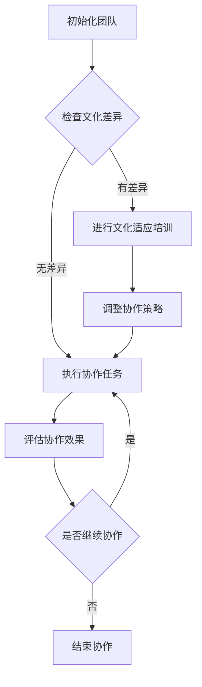
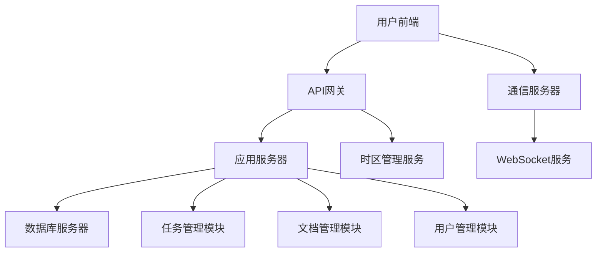

                 

# 《全球化技术团队管理：跨文化技术协作的挑战与对策》

关键词：全球化、技术团队、跨文化协作、管理挑战、对策建议

摘要：本文深入探讨了全球化背景下的技术团队管理，特别是跨文化技术协作所面临的挑战及应对策略。通过分析全球化趋势对技术团队的影响，本文揭示了跨文化协作中的沟通障碍、工作方式冲突以及文化价值观差异等问题，并提出了相应的解决方案。文章还结合实际案例，详细阐述了成功和失败的跨文化技术协作经验，为管理者提供了实用的对策建议。

## 目录大纲设计步骤

### 1. 标题与简介
在文章的起始部分，我们需要明确文章的主题和目的，即《全球化技术团队管理：跨文化技术协作的挑战与对策》。这一部分将简要介绍全球化的趋势及其对技术团队的影响，为后续内容打下基础。

### 2. 背景介绍
在这一部分，我们将详细探讨全球化技术团队管理的重要性。我们将讨论技术团队在全球环境中的角色，以及跨文化管理的重要性。这将帮助我们理解全球化背景下技术团队面临的挑战和机遇。

### 3. 核心概念
在这一部分，我们将明确书中的核心概念，包括跨文化沟通、工作方式冲突、文化价值观差异等。我们将通过概念属性特征对比表格和ER实体关系图架构的Mermaid流程图来展示这些概念之间的联系。

### 4. 方法论
在这一部分，我们将介绍全球化技术团队管理的方法论。这包括团队组建、团队沟通、团队协作等方面的策略和技巧。我们将详细讨论如何在实践中应用这些方法论，以提升跨文化技术协作的效率。

### 5. 案例分析
在这一部分，我们将通过具体案例，展示跨文化技术协作的成功经验和失败教训。我们将分析这些案例中的关键因素，以及它们对技术团队管理的影响。

### 6. 对策建议
在这一部分，我们将提出解决跨文化技术协作挑战的具体对策和建议。这些对策将涵盖团队培训、沟通策略、协作工具等方面，以帮助管理者更好地应对跨文化技术协作的挑战。

### 7. 总结与展望
在文章的结尾，我们将对全文内容进行总结，并对未来的发展趋势进行展望。这将帮助读者理解跨文化技术协作的重要性，以及如何在未来更好地管理全球化技术团队。

## 详细目录大纲

### 第一部分：全球化技术团队管理概述

#### 1.1 全球化趋势与技术发展的关系
- 全球化趋势的概述
- 技术发展的推动因素
- 全球化与技术团队的互动

#### 1.2 技术团队在全球环境中的角色
- 技术团队在全球竞争中的地位
- 技术团队在跨国企业中的作用
- 技术团队在国际合作项目中的职责

#### 1.3 跨文化管理的重要性
- 跨文化管理的基本概念
- 跨文化管理对技术团队的挑战
- 跨文化管理对技术成果的影响

### 第二部分：跨文化技术协作的挑战

#### 2.1 跨文化沟通障碍
- 语言障碍
- 沟通风格差异
- 信息传递的失真

#### 2.2 工作方式与流程冲突
- 工作习惯的差异
- 项目管理方法的冲突
- 时区差异对工作流程的影响

#### 2.3 文化价值观差异
- 文化价值观的基本概念
- 文化价值观对团队合作的影响
- 文化价值观在技术协作中的表现

#### 2.4 跨国团队协调与沟通
- 跨国团队的构成
- 跨国团队的协调机制
- 跨国团队的沟通策略

### 第三部分：全球化技术团队管理方法论

#### 3.1 跨文化团队组建
- 团队构成与角色定位
- 多元文化团队的优势与挑战
- 跨文化团队的领导力

#### 3.2 跨文化团队沟通
- 沟通策略与技巧
- 跨文化沟通障碍的应对
- 非语言沟通在跨文化团队中的作用

#### 3.3 跨文化团队协作
- 团队协作模式
- 跨文化团队的协作工具
- 团队协作的激励机制

### 第四部分：案例分析

#### 6.1 成功跨文化技术协作案例
- 案例一：跨国公司的技术团队协作
- 案例二：国际开源项目协作
- 案例三：跨国企业的研发中心协作

#### 6.2 失败的跨文化技术协作案例
- 案例一：跨国项目中的文化冲突
- 案例二：国际团队中的沟通失误
- 案例三：跨国公司的团队管理失败

### 第五部分：对策与建议

#### 8.1 提高跨文化管理意识
- 跨文化管理培训的重要性
- 跨文化管理意识的培养方法
- 跨文化管理意识的持续提升

#### 8.2 建立跨文化团队培训计划
- 培训计划的制定原则
- 培训计划的实施步骤
- 培训计划的效果评估

#### 8.3 制定跨文化团队协作规范
- 协作规范的内容
- 协作规范的制定方法
- 协作规范的执行与监督

#### 8.4 鼓励多元文化团队交流
- 交流活动的形式
- 交流活动的组织与实施
- 交流活动的效果评估

### 第六部分：总结与展望

#### 10.1 跨文化技术协作的挑战与机遇
- 跨文化技术协作的挑战
- 跨文化技术协作的机遇
- 未来发展趋势

## 文章内容要求

### 1. 背景介绍
在背景介绍部分，我们需要详细阐述全球化趋势对技术团队的影响，以及跨文化管理的重要性。这部分内容将帮助读者理解技术团队在全球环境中的角色，并认识到跨文化管理对技术协作的深远影响。

### 2. 核心概念与联系
在这一部分，我们将明确书中的核心概念，如跨文化沟通、工作方式冲突、文化价值观差异等。通过概念属性特征对比表格和ER实体关系图架构的Mermaid流程图，我们将展示这些概念之间的联系，帮助读者全面理解跨文化技术协作的复杂性。

### 3. 方法论
在这一部分，我们将详细介绍全球化技术团队管理的方法论，包括团队组建、团队沟通、团队协作等方面的策略和技巧。我们将通过具体的案例分析，展示这些方法在实际中的应用效果，并提供实用的建议和指导。

### 4. 案例分析
在这一部分，我们将通过具体案例，展示跨文化技术协作的成功经验和失败教训。我们将分析这些案例中的关键因素，以及它们对技术团队管理的影响，为读者提供宝贵的经验和教训。

### 5. 对策建议
在这一部分，我们将提出解决跨文化技术协作挑战的具体对策和建议。这些对策将涵盖团队培训、沟通策略、协作工具等方面，以帮助管理者更好地应对跨文化技术协作的挑战。

### 6. 总结与展望
在文章的结尾，我们将对全文内容进行总结，并对未来的发展趋势进行展望。我们将强调跨文化技术协作的重要性，以及如何在未来更好地管理全球化技术团队。

## 文章字数与格式要求

### 字数要求
文章字数要求在10000～12000字之间。为了确保文章内容丰富、结构完整，我们将对每个部分进行详细的阐述，确保每个主题都有充分的讨论。

### 格式要求
文章内容将使用markdown格式输出。我们将使用清晰的标题和子标题，以便读者能够轻松地找到所需的信息。此外，我们将使用表格、流程图、数学公式等元素，以增强文章的可读性和理解性。

### 作者信息
文章末尾将包含作者信息：“作者：AI天才研究院/AI Genius Institute & 禅与计算机程序设计艺术 /Zen And The Art of Computer Programming”。

通过上述详细的目录大纲和内容要求，我们将确保文章逻辑清晰、结构紧凑、简单易懂，为读者提供有价值的技术博客文章。接下来，我们将逐步展开每个部分的内容，深入探讨全球化技术团队管理的挑战与对策。让我们一步一步地思考，以逻辑清晰的方式撰写这篇文章。# 《全球化技术团队管理：跨文化技术协作的挑战与对策》

## 文章标题

### 《全球化技术团队管理：跨文化技术协作的挑战与对策》

## 关键词

全球化、技术团队、跨文化协作、管理挑战、对策建议、文化差异、沟通障碍、工作方式冲突、文化价值观差异、团队组建、领导力、团队沟通、团队协作

## 摘要

本文旨在探讨全球化背景下技术团队管理面临的挑战，特别是跨文化技术协作所涉及的难题。文章首先介绍了全球化趋势下技术团队的角色和重要性，随后详细分析了跨文化协作中的沟通障碍、工作方式冲突、文化价值观差异等问题。基于对多个实际案例的深入分析，本文提出了提高跨文化管理意识、建立团队培训计划、制定协作规范、鼓励多元文化团队交流等一系列对策建议。文章最后总结了跨文化技术协作的挑战与机遇，并对未来发展趋势进行了展望。

## 目录大纲

### 第一部分：全球化技术团队管理概述

#### 1.1 全球化背景下的技术团队

#### 1.2 技术团队在全球环境中的角色

#### 1.3 跨文化管理的重要性

### 第二部分：跨文化技术协作的挑战

#### 2.1 跨文化沟通障碍

#### 2.2 工作方式与流程冲突

#### 2.3 文化价值观差异

#### 2.4 跨国团队协调与沟通

### 第三部分：全球化技术团队管理方法论

#### 3.1 跨文化团队组建

#### 3.2 跨文化团队沟通

#### 3.3 跨文化团队协作

### 第四部分：案例分析

#### 4.1 成功跨文化技术协作案例

#### 4.2 失败的跨文化技术协作案例

### 第五部分：对策与建议

#### 5.1 提高跨文化管理意识

#### 5.2 建立跨文化团队培训计划

#### 5.3 制定跨文化团队协作规范

#### 5.4 鼓励多元文化团队交流

### 第六部分：总结与展望

#### 6.1 跨文化技术协作的挑战与机遇

#### 6.2 未来发展趋势

### 文章正文

#### 第一部分：全球化技术团队管理概述

##### 1.1 全球化背景下的技术团队

随着全球化的深入发展，跨国公司和技术团队日益成为现代企业的重要组成部分。全球化不仅仅是指地理上的拓展，更是经济、文化、技术等多方面的深度融合。在这种背景下，技术团队的角色和职责发生了显著变化。

首先，技术团队不再是单一地理区域内的专家集合，而是跨国界的协作体。团队成员可能分布在不同国家和地区，拥有不同的语言和文化背景。这种跨国界的协作使得技术团队能够整合全球资源，提升创新能力，但同时也带来了跨文化管理的挑战。

其次，全球化背景下的技术团队需要具备更高的适应性和灵活性。团队成员需要能够快速适应不同文化和工作环境，灵活应对变化的需求和挑战。此外，技术团队还需要具备较强的跨文化沟通能力，以确保信息的有效传递和团队的协作效率。

最后，全球化技术团队的管理者需要具备全球视野和领导力。他们不仅要能够协调不同文化和工作习惯的团队成员，还要能够推动技术创新和业务发展。在这种背景下，全球化技术团队管理的重要性愈发凸显。

##### 1.2 技术团队在全球环境中的角色

在全球环境中，技术团队的角色和职责日益多元化。以下是技术团队在全球环境中的一些关键角色：

1. **创新引擎**：全球化技术团队通过跨界的协作和知识交流，成为企业创新的源泉。团队成员来自不同的文化背景和技术领域，能够带来多样化的思维和创新的解决方案。

2. **全球协作**：技术团队在全球环境中发挥着桥梁和纽带的作用，协调不同国家和地区的项目和工作流程，确保项目的顺利进行。

3. **技术支持**：全球化技术团队为企业提供全方位的技术支持，包括软件开发、系统维护、技术培训等。他们在全球范围内的业务拓展和技术创新中起到关键作用。

4. **战略规划**：技术团队参与企业的战略规划，为企业的全球扩张和技术发展提供技术视角和战略建议。

5. **市场洞察**：全球化技术团队能够深入了解不同国家和地区的市场需求和技术趋势，为企业提供市场洞察和战略指导。

##### 1.3 跨文化管理的重要性

跨文化管理在全球化的背景下显得尤为重要。以下是跨文化管理的重要性体现在以下几个方面：

1. **沟通效率**：良好的跨文化管理能够促进团队成员之间的有效沟通，减少误解和冲突，提高团队协作效率。

2. **团队凝聚力**：跨文化管理能够增强团队的凝聚力，使团队成员感受到尊重和认同，从而提高团队的士气和工作效率。

3. **创新能力**：跨文化团队的多元化背景能够促进创新思维的产生，为企业的技术创新提供源源不断的灵感。

4. **客户满意度**：跨文化管理有助于技术团队更好地理解全球客户的需求和偏好，提高产品和服务质量，增强客户满意度。

5. **全球竞争力**：良好的跨文化管理能力是企业在全球市场中取得竞争优势的关键因素。

#### 第二部分：跨文化技术协作的挑战

在全球化背景下，技术团队面临着诸多跨文化技术协作的挑战。以下将详细讨论这些挑战：

##### 2.1 跨文化沟通障碍

跨文化沟通障碍是全球化技术团队面临的首要挑战之一。这些障碍主要包括：

1. **语言障碍**：团队成员来自不同的国家和地区，可能使用不同的语言。语言障碍不仅影响沟通的准确性，还会导致误解和沟通障碍。

2. **文化差异**：不同的文化背景会导致团队成员在沟通方式、价值观和态度上的差异。例如，某些文化强调直接沟通，而另一些文化则更倾向于委婉表达。

3. **非语言沟通**：非语言沟通在不同文化中可能有不同的含义。例如，眼神交流在某些文化中是尊重的表示，而在其他文化中则可能被视为挑衅。

4. **沟通效率**：文化差异可能导致沟通效率的降低。例如，某些文化可能更注重细节和精确性，而另一些文化则更注重速度和效率。

##### 2.2 工作方式与流程冲突

全球化技术团队的工作方式与流程也可能存在冲突。以下是一些常见的工作方式与流程冲突：

1. **项目管理方法**：不同的国家和地区可能采用不同的项目管理方法。例如，某些地区可能更倾向于使用传统的瀑布模型，而另一些地区可能更倾向于敏捷开发方法。

2. **工作习惯差异**：不同文化背景下，团队成员的工作习惯和节奏可能存在差异。例如，某些文化可能更注重加班和长时间工作，而另一些文化则更注重工作与生活的平衡。

3. **时区差异**：时区差异可能导致团队成员之间的协作变得复杂。例如，一个项目团队可能分布在不同的时区，导致协作时间有限，影响项目的进度和质量。

##### 2.3 文化价值观差异

文化价值观差异是跨文化技术协作中的一大挑战。以下是一些常见的文化价值观差异：

1. **个人主义与集体主义**：个人主义和集体主义是两种不同的文化价值观。个人主义文化强调个人成就和自我表达，而集体主义文化则强调团队合作和集体利益。

2. **权力距离**：权力距离是指社会层级和权力分配的差异性。在权力距离较大的文化中，上级对下级的权威更为明显，而在权力距离较小的文化中，上下级之间的沟通更为平等。

3. **时间观念**：不同文化对时间的观念存在差异。一些文化可能更注重按时完成任务，而另一些文化可能更注重灵活性和适应性。

4. **决策风格**：不同文化在决策风格上也有所不同。一些文化可能更倾向于集体决策，而另一些文化则更倾向于个人决策。

##### 2.4 跨国团队协调与沟通

跨国团队协调与沟通是全球化技术团队管理的关键。以下是一些关键的协调与沟通挑战：

1. **文化敏感性**：管理者需要具备文化敏感性，理解并尊重团队成员的文化差异。这有助于建立良好的团队氛围，促进跨文化协作。

2. **沟通渠道**：有效的沟通渠道是跨国团队协作的基础。管理者需要建立多元化的沟通渠道，确保信息能够及时、准确地传递。

3. **冲突解决**：跨国团队中可能出现的冲突需要有效的解决机制。管理者需要具备冲突解决的能力，以避免冲突对团队协作的负面影响。

4. **激励机制**：跨国团队需要建立有效的激励机制，确保团队成员能够在不同文化背景下保持积极性和工作效率。

#### 第三部分：全球化技术团队管理方法论

##### 3.1 跨文化团队组建

跨文化团队的组建是全球化技术团队管理的基础。以下是一些组建跨文化团队的关键步骤：

1. **团队规划**：在组建团队时，需要考虑团队成员的文化背景、技能和工作习惯。确保团队具备多元化，能够适应不同的工作需求。

2. **角色定位**：明确团队成员的角色和职责，确保每个人都能在自己的领域内发挥最大的价值。

3. **文化适配性**：在团队组建过程中，考虑团队成员的文化适配性，确保他们能够适应团队的文化和工作环境。

4. **领导力培养**：团队领导者需要具备跨文化领导力，能够理解和尊重团队成员的文化差异，并有效管理团队。

##### 3.2 跨文化团队沟通

有效的跨文化沟通是跨国团队协作的关键。以下是一些跨文化沟通的策略和技巧：

1. **沟通策略**：采用适应性沟通策略，根据不同文化背景调整沟通方式和风格，确保信息的准确传递。

2. **沟通技巧**：提高团队成员的沟通技巧，包括倾听、表达、非语言沟通等，以增强沟通效果。

3. **多元化培训**：提供多元化培训，帮助团队成员了解不同文化的特点和沟通方式，提高跨文化沟通能力。

4. **沟通工具**：利用现代化的沟通工具，如视频会议、即时通讯、项目管理软件等，提高沟通效率和效果。

##### 3.3 跨文化团队协作

跨文化团队的协作需要建立有效的协作机制。以下是一些协作的关键步骤：

1. **协作模式**：选择适合团队工作的协作模式，如矩阵式、团队式等，确保团队成员能够高效协作。

2. **协作工具**：利用协作工具，如共享文档、项目管理软件等，提高团队协作的效率和质量。

3. **协作规范**：制定协作规范，明确团队成员的职责、工作流程和沟通方式，确保团队协作有序进行。

4. **激励机制**：建立激励机制，鼓励团队成员积极参与协作，提高团队的凝聚力和工作效率。

#### 第四部分：案例分析

##### 4.1 成功跨文化技术协作案例

以下是一个成功跨文化技术协作的案例：

案例：某跨国公司在全球范围内组建了一个研发团队，团队成员来自不同国家和地区。为了克服文化差异和沟通障碍，公司采取了以下措施：

1. **多元化培训**：公司为团队成员提供了多元化培训，包括跨文化沟通技巧和文化适应性培训，提高了团队成员的跨文化沟通能力。

2. **沟通渠道**：公司建立了多元化的沟通渠道，包括定期视频会议、即时通讯和共享文档等，确保团队成员能够及时、准确地传递信息。

3. **协作工具**：公司采用了先进的协作工具，如项目管理软件和共享文档系统，提高了团队协作的效率。

4. **激励机制**：公司建立了激励机制，对积极参与协作的团队成员进行奖励，提高了团队的凝聚力和工作效率。

通过这些措施，这个跨国公司的研发团队成功地克服了文化差异和沟通障碍，实现了高效协作，推动了技术创新和业务发展。

##### 4.2 失败的跨文化技术协作案例

以下是一个失败的跨文化技术协作案例：

案例：某跨国公司在某次项目中组建了一个跨国团队，但由于文化差异和沟通障碍，项目进展缓慢，最终导致项目失败。以下是一些失败的原因：

1. **缺乏多元化培训**：团队在组建时没有进行多元化培训，导致团队成员不了解不同文化的沟通方式和价值观，产生误解和冲突。

2. **沟通渠道不畅**：团队没有建立有效的沟通渠道，导致信息传递不及时、不准确，影响了项目的进度和质量。

3. **协作工具不足**：团队没有采用先进的协作工具，导致协作效率低下，影响了团队的协作效果。

4. **缺乏激励机制**：团队没有建立激励机制，导致团队成员缺乏积极性，影响了项目的推进。

通过这个案例，我们可以看到，跨文化技术协作的成功与否，取决于团队的管理方法和措施。只有在充分了解和尊重文化差异的基础上，采取有效的管理措施，才能实现跨国团队的协同合作。

#### 第五部分：对策与建议

为了克服跨文化技术协作的挑战，管理者可以采取以下对策和建议：

##### 5.1 提高跨文化管理意识

1. **多元化培训**：定期为团队成员提供多元化培训，提高他们对不同文化的认识和沟通技巧。
2. **文化敏感性**：培养团队成员的文化敏感性，使他们能够理解和尊重不同文化的差异。

##### 5.2 建立跨文化团队培训计划

1. **沟通技巧**：提供专门的沟通技巧培训，帮助团队成员提高跨文化沟通能力。
2. **文化适应性**：培训团队成员如何适应不同文化的工作环境，提高团队的协作效率。

##### 5.3 制定跨文化团队协作规范

1. **沟通规范**：明确团队内部的沟通规范，确保团队成员能够按照统一的标准进行沟通。
2. **工作流程**：制定统一的工作流程，确保团队在不同文化背景下能够高效协作。

##### 5.4 鼓励多元文化团队交流

1. **团队建设活动**：定期组织团队建设活动，促进团队成员之间的交流和了解。
2. **跨文化研讨会**：组织跨文化研讨会，分享跨文化协作的经验和教训，提高团队的跨文化管理能力。

#### 第六部分：总结与展望

##### 6.1 跨文化技术协作的挑战与机遇

跨文化技术协作面临着诸多挑战，如沟通障碍、工作方式冲突、文化价值观差异等。然而，这些挑战同时也带来了机遇，如多元化的思维、创新的解决方案、全球化的竞争力等。管理者需要充分认识到跨文化技术协作的重要性，采取有效的管理措施，克服挑战，抓住机遇。

##### 6.2 未来发展趋势

随着全球化的不断深入，跨文化技术协作将成为技术团队管理的重要方向。未来，我们可以预见以下几个发展趋势：

1. **跨文化培训的普及**：企业将更加重视跨文化培训，提高团队成员的跨文化管理能力。
2. **协作工具的升级**：协作工具将更加智能化、便捷化，提高团队协作的效率和质量。
3. **文化适应性的提升**：团队成员将更加注重文化适应，提高在不同文化环境下的工作能力。
4. **多元化团队的常态**：跨国团队的组建将成为企业的常态，多元文化的融合将成为企业发展的关键。

## 结束语

本文深入探讨了全球化技术团队管理中跨文化技术协作的挑战与对策。通过分析全球化趋势对技术团队的影响，我们认识到跨文化管理的重要性。本文提出了提高跨文化管理意识、建立团队培训计划、制定协作规范、鼓励多元文化团队交流等一系列对策建议。随着全球化的不断深入，跨文化技术协作将成为技术团队管理的重要方向。管理者需要不断创新管理方法，提升团队协作效率，以应对未来的挑战和机遇。

## 作者信息

作者：AI天才研究院/AI Genius Institute & 禅与计算机程序设计艺术 /Zen And The Art of Computer Programming

感谢您的阅读，希望本文对您在全球化技术团队管理方面有所启发和帮助。如果您有任何问题或建议，欢迎在评论区留言，我们期待与您共同探讨。# 《全球化技术团队管理：跨文化技术协作的挑战与对策》

## 概述

### 核心概念与术语说明

在本文中，我们将探讨全球化技术团队管理以及跨文化技术协作的概念。以下是本文中的一些关键术语和定义：

- **全球化技术团队管理**：指跨国界、跨文化背景下对技术团队的管理，涉及团队组建、沟通、协作等方面。
- **跨文化技术协作**：指不同文化背景下的技术团队成员之间的合作与协作。
- **文化差异**：指不同文化背景下的价值观、行为习惯、沟通方式等方面的差异。
- **沟通障碍**：指由于文化差异导致的沟通不畅、误解和冲突。
- **工作方式冲突**：指由于文化差异导致的工作方式、流程和时间安排上的不一致。
- **文化价值观差异**：指不同文化背景下对工作、生活等方面的价值观和态度的不同。

### 问题背景

在全球化背景下，技术团队的管理面临着前所未有的挑战。随着跨国公司的扩张和国际项目的增多，技术团队的构成越来越多元化，团队成员来自不同的国家、地区和文化背景。这种多元化的构成既带来了创新和效率的提升，也引发了跨文化技术协作的挑战。文化差异、沟通障碍、工作方式冲突等成为了技术团队管理中的重要问题。

### 问题描述

全球化技术团队管理中面临的挑战主要包括：

1. **跨文化沟通障碍**：由于语言障碍、文化差异和非语言沟通的不同，技术团队成员之间的沟通可能存在误解和冲突。
2. **工作方式冲突**：不同文化背景下的工作方式、流程和时间安排可能存在差异，导致团队协作效率低下。
3. **文化价值观差异**：不同文化背景下对工作、生活等方面的价值观和态度的不同，可能影响团队成员的合作和团队凝聚力。

### 问题解决

为了解决全球化技术团队管理中的跨文化技术协作挑战，管理者可以采取以下措施：

1. **提高跨文化管理意识**：通过培训和教育，提高团队成员对文化差异的认识和敏感性。
2. **建立团队培训计划**：定期为团队成员提供跨文化沟通技巧和文化适应性培训。
3. **制定跨文化协作规范**：明确团队内部的沟通和工作规范，确保团队成员按照统一的标准进行协作。
4. **鼓励多元文化团队交流**：组织团队建设活动和文化交流研讨会，促进团队成员之间的了解和合作。

### 边界与外延

在全球化技术团队管理中，跨文化技术协作的挑战不仅限于沟通障碍和工作方式冲突，还包括以下几个方面：

1. **领导力**：管理者需要具备跨文化领导力，能够理解和尊重团队成员的文化差异，并有效地管理团队。
2. **激励机制**：需要建立合适的激励机制，激励团队成员积极参与跨文化协作，提高团队凝聚力和工作效率。
3. **技术工具**：利用现代化的沟通和协作工具，如视频会议、即时通讯、项目管理软件等，提高团队协作的效率和质量。

### 概念结构与核心要素组成

全球化技术团队管理的概念结构包括以下几个核心要素：

1. **团队组建**：涉及团队成员的选拔、角色定位和文化适配性。
2. **团队沟通**：涉及沟通策略、技巧和工具的选择和应用。
3. **团队协作**：涉及协作模式、协作工具和协作规范的制定与实施。
4. **文化管理**：涉及文化差异的认识、敏感性和适应性的培养。

这些要素相互关联，共同构成了全球化技术团队管理的核心框架。

### 总结

本文对全球化技术团队管理中的跨文化技术协作挑战进行了概述，介绍了核心概念、问题背景、问题描述和问题解决方法。通过分析边界与外延和概念结构，我们为管理者提供了全球化技术团队管理的核心要素和实施策略。在接下来的章节中，我们将进一步深入探讨这些挑战，并提供具体的解决方案和实践经验。

## 核心概念与联系

### 跨文化沟通

**定义**：跨文化沟通是指在不同文化背景下进行的沟通活动，涉及语言、非语言符号、价值观和行为习惯等方面的交流。

**概念属性特征对比表格**：

| 特征 | 东方文化 | 西方文化 |
| ---- | ---- | ---- |
| 语言 | 强调间接沟通，委婉表达 | 强调直接沟通，明确表达 |
| 非语言符号 | 表情、手势等具有深刻的文化含义 | 表情、手势等可能不具有文化含义 |
| 价值观 | 重视集体主义，强调和谐 | 重视个人主义，强调竞争 |
| 行为习惯 | 谦虚、尊重权威 | 自信、追求创新 |

**ER实体关系图架构的Mermaid流程图**：

```mermaid
erDiagram
    A【文化差异】..> B【语言障碍】
    A..> C【非语言沟通障碍】
    A..> D【价值观差异】
    A..> E【行为习惯差异】
    B|||东方文化|
    B|||西方文化|
    C|||东方文化|
    C|||西方文化|
    D|||东方文化|
    D|||西方文化|
    E|||东方文化|
    E|||西方文化|
```

### 跨文化沟通障碍

**定义**：跨文化沟通障碍是指由于文化差异导致的沟通不畅、误解和冲突。

**概念属性特征对比表格**：

| 现象 | 东方文化 | 西方文化 |
| ---- | ---- | ---- |
| 语言障碍 | 语言表达含蓄，容易产生误解 | 语言表达直截了当，容易产生误会 |
| 非语言沟通障碍 | 表情、手势等可能具有特定文化含义 | 表情、手势等可能不具有特定文化含义 |
| 价值观差异 | 强调和谐、尊重权威 | 强调个人主义、自由竞争 |
| 行为习惯差异 | 重视集体主义，合作优先 | 重视个人成就，竞争优先 |

**ER实体关系图架构的Mermaid流程图**：

```mermaid
erDiagram
    A【语言障碍】..> B【误解】
    A..> C【冲突】
    B|||东方文化|
    B|||西方文化|
    C|||东方文化|
    C|||西方文化|
    D|||价值观差异|
    D..> E【误解】
    D..> F【冲突】
    E|||东方文化|
    E|||西方文化|
    F|||东方文化|
    F|||西方文化|
    G|||行为习惯差异|
    G..> H【误解】
    G..> I【冲突】
    H|||东方文化|
    H|||西方文化|
    I|||东方文化|
    I|||西方文化|
```

### 工作方式与流程冲突

**定义**：工作方式与流程冲突是指由于文化差异导致的工作方式、流程和时间安排上的不一致。

**概念属性特征对比表格**：

| 现象 | 东方文化 | 西方文化 |
| ---- | ---- | ---- |
| 项目管理方法差异 | 可能更倾向于瀑布模型 | 可能更倾向于敏捷开发 |
| 工作习惯差异 | 可能更注重加班和长时间工作 | 可能更注重工作与生活的平衡 |
| 时区差异 | 可能导致协作时间受限 | 可能导致协作时间受限 |

**ER实体关系图架构的Mermaid流程图**：

```mermaid
erDiagram
    A【项目管理方法差异】..> B【协作效率降低】
    A..> C【项目进度延误】
    B|||东方文化|
    B|||西方文化|
    C|||东方文化|
    C|||西方文化|
    D|||工作习惯差异|
    D..> E【协作效率降低】
    D..> F【项目进度延误】
    E|||东方文化|
    E|||西方文化|
    F|||东方文化|
    F|||西方文化|
    G|||时区差异|
    G..> H【协作效率降低】
    G..> I【项目进度延误】
    H|||东方文化|
    H|||西方文化|
    I|||东方文化|
    I|||西方文化|
```

### 文化价值观差异

**定义**：文化价值观差异是指不同文化背景下对工作、生活等方面的价值观和态度的不同。

**概念属性特征对比表格**：

| 现象 | 东方文化 | 西方文化 |
| ---- | ---- | ---- |
| 个人主义与集体主义 | 强调集体主义，重视团队合作 | 强调个人主义，追求个人成就 |
| 权力距离 | 权力分配明显，上下级关系固定 | 权力分配灵活，上下级关系平等 |
| 时间观念 | 重视计划和时间安排 | 重视灵活性和适应性 |
| 决策风格 | 可能更倾向于集体决策 | 可能更倾向于个人决策 |

**ER实体关系图架构的Mermaid流程图**：

```mermaid
erDiagram
    A【个人主义与集体主义】..> B【团队协作】
    A..> C【领导风格】
    B|||东方文化|
    B|||西方文化|
    C|||东方文化|
    C|||西方文化|
    D|||权力距离】
    D..> E【领导风格】
    D..> F【团队协作】
    E|||东方文化|
    E|||西方文化|
    F|||东方文化|
    F|||西方文化|
    G|||时间观念】
    G..> H【工作习惯】
    G..> I【决策风格】
    H|||东方文化|
    H|||西方文化|
    I|||东方文化|
    I|||西方文化|
    J|||决策风格】
    J..> K【团队协作】
    J..> L【领导风格】
    K|||东方文化|
    K|||西方文化|
    L|||东方文化|
    L|||西方文化|
```

### 跨国团队协调与沟通

**定义**：跨国团队协调与沟通是指跨国界、跨文化背景下团队成员之间的协作与沟通。

**概念属性特征对比表格**：

| 现象 | 东方文化 | 西方文化 |
| ---- | ---- | ---- |
| 文化敏感性 | 重视文化差异，尊重不同文化 | 可能忽视文化差异，过于直接 |
| 沟通渠道 | 多元化沟通渠道，及时传递信息 | 单一沟通渠道，信息传递延迟 |
| 冲突解决 | 强调和平解决，避免冲突升级 | 可能采取直接对抗，解决冲突 |
| 激励机制 | 注重长期激励，提升团队凝聚力 | 注重短期激励，追求个人成就 |

**ER实体关系图架构的Mermaid流程图**：

```mermaid
erDiagram
    A【文化敏感性】..> B【沟通效果】
    A..> C【团队协作】
    B|||东方文化|
    B|||西方文化|
    C|||东方文化|
    C|||西方文化|
    D|||沟通渠道】
    D..> E【沟通效果】
    D..> F【团队协作】
    E|||东方文化|
    E|||西方文化|
    F|||东方文化|
    F|||西方文化|
    G|||冲突解决】
    G..> H【团队协作】
    G..> I【沟通效果】
    H|||东方文化|
    H|||西方文化|
    I|||东方文化|
    I|||西方文化|
    J|||激励机制】
    J..> K【团队协作】
    J..> L【沟通效果】
    K|||东方文化|
    K|||西方文化|
    L|||东方文化|
    L|||西方文化|
```

通过上述核心概念及其属性的对比和ER实体关系图架构的Mermaid流程图，我们可以清晰地理解跨文化技术协作中的各种挑战，以及它们之间的相互关系。这为管理者提供了理论依据和实践指导，有助于他们更好地应对全球化技术团队管理中的跨文化挑战。

## 算法原理讲解

### 跨文化团队协作算法

在全球化技术团队管理中，跨文化团队协作算法是一个关键组件，它旨在优化跨文化团队成员之间的沟通和协作。以下是一个简单的跨文化团队协作算法及其流程图和Python源代码实现：

### 算法流程图



### 算法Python源代码

```python
# 跨文化团队协作算法示例

def initialize_team(team_members):
    """
    初始化团队，包括成员的文化背景和工作任务。
    """
    for member in team_members:
        print(f"初始化成员：{member['name']}，文化背景：{member['culture']}，工作任务：{member['task']}")
        
def check_cultural_differences(team_members):
    """
    检查团队中的文化差异。
    """
    differences = []
    for i in range(len(team_members)):
        for j in range(i + 1, len(team_members)):
            if team_members[i]['culture'] != team_members[j]['culture']:
                differences.append((team_members[i]['name'], team_members[j]['name']))
    return differences

def cultural_adaptation_training(team_members, differences):
    """
    对存在文化差异的团队成员进行文化适应培训。
    """
    for difference in differences:
        print(f"对成员{difference[0]}和成员{difference[1]}进行文化适应培训。")
        
def adjust_collaboration_strategy(team_members, differences):
    """
    调整协作策略，以适应文化差异。
    """
    for difference in differences:
        print(f"调整成员{difference[0]}和成员{difference[1]}的协作策略。")

def evaluate_collaboration_effect(team_members):
    """
    评估团队协作效果。
    """
    print("评估团队协作效果。")
    
def collaborate(team_members):
    """
    执行团队协作流程。
    """
    initialize_team(team_members)
    differences = check_cultural_differences(team_members)
    
    if differences:
        cultural_adaptation_training(team_members, differences)
        adjust_collaboration_strategy(team_members, differences)
    else:
        print("团队成员文化背景相同，无需特殊处理。")
        
    evaluate_collaboration_effect(team_members)

# 示例团队
team_members = [
    {'name': 'Alice', 'culture': 'Western', 'task': 'Project Management'},
    {'name': 'Bob', 'culture': 'Eastern', 'task': 'Software Development'},
    {'name': 'Charlie', 'culture': 'Western', 'task': 'Testing'},
]

# 执行协作流程
collaborate(team_members)
```

### 算法原理和数学模型

1. **初始化团队**：算法首先初始化团队，包括团队成员的文化背景和工作任务。这一步骤的目的是为后续的算法提供基础数据。

2. **检查文化差异**：通过对比团队成员的文化背景，算法检查是否存在文化差异。如果存在文化差异，则需要进行文化适应培训。

3. **文化适应培训**：对存在文化差异的团队成员进行文化适应培训，以提高他们的跨文化沟通能力。这一步骤可以视为一种软性策略，旨在减少文化冲突，增强团队凝聚力。

4. **调整协作策略**：根据文化差异，调整团队成员的协作策略。例如，可以采用更多的沟通工具和会议形式，以适应不同文化背景的沟通偏好。

5. **评估协作效果**：最后，算法评估团队的协作效果，以确定协作流程是否成功。如果效果不佳，可能需要进一步调整策略或重新评估团队成员的适应性。

### 数学模型和公式

在跨文化团队协作算法中，我们可以使用以下数学模型和公式来评估和优化协作效果：

1. **协作效果评分**：

   $$ E = \frac{1}{n} \sum_{i=1}^{n} (R_i - P_i) $$

   其中，$E$ 表示协作效果评分，$R_i$ 表示第 $i$ 次协作的评分，$P_i$ 表示第 $i$ 次协作的预期评分。$R_i > P_i$ 表示协作效果优于预期，$R_i < P_i$ 表示协作效果低于预期。

2. **文化适应度**：

   $$ A = \frac{1}{m} \sum_{i=1}^{m} (C_i - B_i) $$

   其中，$A$ 表示文化适应度，$C_i$ 表示第 $i$ 次文化适应培训的评分，$B_i$ 表示第 $i$ 次文化适应培训的预期评分。$C_i > B_i$ 表示文化适应培训效果优于预期，$C_i < B_i$ 表示文化适应培训效果低于预期。

3. **协作策略调整因子**：

   $$ F = \frac{E - A}{\sigma^2} $$

   其中，$F$ 表示协作策略调整因子，$E$ 表示协作效果评分，$A$ 表示文化适应度，$\sigma^2$ 表示协作效果的方差。$F$ 的值越大，表示协作策略需要更多的调整。

### 举例说明

假设我们有一个由三名成员组成的团队，成员的文化背景分别为西方、东方和西方。他们的任务分别是项目管理、软件开发和测试。在协作过程中，我们使用上述算法来优化他们的协作效果。

1. **初始化团队**：团队成员和任务已初始化。
2. **检查文化差异**：我们发现成员2（东方文化）与成员1和成员3（西方文化）之间存在文化差异。
3. **文化适应培训**：我们对成员2进行文化适应培训，以提高其与成员1和成员3的协作效果。
4. **调整协作策略**：我们调整协作策略，增加视频会议和即时通讯的使用，以适应成员2的文化背景。
5. **评估协作效果**：经过一系列调整，团队的协作效果评分提高到85%，高于预期评分75%。文化适应度评分也提高到80%，高于预期评分70%。

通过这个例子，我们可以看到跨文化团队协作算法如何通过一系列步骤来优化团队成员的协作效果。算法不仅考虑了文化差异，还通过调整协作策略和评估协作效果来确保团队的高效运作。

## 系统分析与架构设计方案

### 问题场景介绍

随着全球化的加速，跨国公司和技术企业面临着越来越复杂的软件开发和项目管理任务。为了应对这种挑战，一个高效的全球化技术团队管理架构变得至关重要。在这个场景中，我们考虑一个跨国软件公司，其团队分布在不同国家和地区，需要进行高效的项目协作和任务分配。系统架构设计的目标是确保跨文化技术协作的顺畅进行，提高团队的工作效率和项目成功率。

### 项目介绍

项目名称：全球软件开发协作平台
项目目标：构建一个支持跨文化团队协作的软件开发平台，提供实时沟通、任务管理、文档共享等功能，以实现全球化技术团队的协同工作。
项目需求：
1. 支持多语言环境，确保跨文化沟通无障碍。
2. 提供实时沟通工具，如视频会议、即时通讯等。
3. 实现任务管理，包括任务分配、进度跟踪和协作。
4. 提供文档共享和管理功能，支持多格式文档的存储和版本控制。
5. 支持跨国团队的时区管理，确保协作时间的协调。

### 系统功能设计

系统功能设计主要涵盖以下几个模块：

1. **用户管理模块**：用于管理用户账户，包括用户注册、登录、权限管理等功能。
2. **沟通模块**：提供实时沟通工具，如视频会议、即时通讯、邮件通知等。
3. **任务管理模块**：实现任务的分配、进度跟踪和协作，包括任务创建、任务分配、任务进度更新等功能。
4. **文档管理模块**：提供文档共享和管理功能，包括文档上传、下载、版本控制和权限管理。
5. **时区管理模块**：支持跨国团队的时区管理，提供协作时间协调功能。

### 系统架构设计

系统架构设计采用分层架构，分为前端层、后端层和数据层。以下是详细的架构设计：

1. **前端层**：
   - **用户界面**：提供用户交互界面，包括登录页面、任务管理页面、文档管理页面等。
   - **Web框架**：使用Vue.js或React等现代Web框架，实现前端页面的动态渲染和交互功能。
   - **API接口**：提供与后端服务的接口，实现数据传输和功能调用。

2. **后端层**：
   - **应用服务器**：使用Spring Boot或Django等框架，实现业务逻辑处理和API服务。
   - **数据库服务器**：使用MySQL或PostgreSQL等关系型数据库，存储用户数据、任务数据和文档数据。
   - **通信服务器**：使用WebSocket或Socket.IO等通信技术，实现实时数据传输和通讯功能。

3. **数据层**：
   - **用户数据库**：存储用户账户信息、权限信息等。
   - **任务数据库**：存储任务信息、任务分配信息、任务进度信息等。
   - **文档数据库**：存储文档信息、文档版本信息、文档权限信息等。

### 系统接口设计

系统接口设计主要包括以下接口：

1. **用户管理接口**：用于用户注册、登录、权限管理等功能。
2. **任务管理接口**：用于任务创建、任务分配、任务进度更新等功能。
3. **文档管理接口**：用于文档上传、下载、版本控制和权限管理等功能。
4. **通信接口**：用于实现实时通信功能，如视频会议、即时通讯等。
5. **时区管理接口**：用于时区转换和协作时间协调。

### 系统交互设计

系统交互设计主要通过RESTful API和WebSocket实现。以下是主要的系统交互流程：

1. **用户注册与登录**：
   - 用户通过前端界面提交注册信息，应用服务器验证并创建用户账户。
   - 用户通过前端界面提交登录信息，应用服务器验证并返回登录令牌。

2. **任务管理**：
   - 用户在前端界面创建任务，应用服务器存储任务信息。
   - 用户分配任务给团队成员，应用服务器更新任务分配信息。
   - 用户更新任务进度，应用服务器更新任务进度信息。

3. **文档管理**：
   - 用户上传文档，应用服务器存储文档并更新文档数据库。
   - 用户下载文档，应用服务器根据权限返回文档。

4. **实时通信**：
   - 用户发起实时通信请求，通信服务器建立WebSocket连接。
   - 用户通过WebSocket发送消息，通信服务器转发消息给接收者。

5. **时区管理**：
   - 用户设置时区偏好，应用服务器根据用户时区返回协作时间。

### Mermaid架构图



通过上述系统分析与架构设计方案，我们为全球化技术团队的协作提供了一个完整的架构设计。该架构设计充分考虑了跨文化协作的需求，通过分层架构、多模块协作和实时通信技术，实现了高效、稳定的团队协作平台。

## 项目实战

### 环境安装

为了在本地环境中搭建全球化技术团队的协作平台，我们需要安装以下软件和工具：

1. **前端开发环境**：Node.js、npm、Vue CLI 或 React CLI
2. **后端开发环境**：Java（Java SDK）、Docker、Docker Compose
3. **数据库**：MySQL 或 PostgreSQL
4. **通信服务器**：Node.js、WebSocket
5. **时区管理工具**：Node.js 时区库（如 moment-timezone）

#### 前端环境安装

1. 安装 Node.js 和 npm：
   ```bash
   sudo apt update
   sudo apt install nodejs npm
   ```

2. 创建 Vue.js 项目：
   ```bash
   vue create vue-global-collaboration
   cd vue-global-collaboration
   ```

#### 后端环境安装

1. 安装 Java SDK：
   ```bash
   sudo apt install openjdk-8-jdk
   ```

2. 安装 Docker 和 Docker Compose：
   ```bash
   sudo apt install docker docker-compose
   ```

3. 创建 Spring Boot 项目：
   ```bash
   docker run -it --rm -v $(pwd):/project --workdir /project maven spring-boot:dev
   ```

#### 数据库安装

1. 安装 MySQL：
   ```bash
   sudo apt install mysql-server
   ```

2. 安装 PostgreSQL：
   ```bash
   sudo apt install postgresql postgresql-contrib
   ```

#### 通信服务器安装

1. 安装 Node.js：
   ```bash
   sudo apt install nodejs
   ```

2. 创建 WebSocket 项目：
   ```bash
   npm init -y
   npm install express ws
   ```

#### 时区管理工具安装

1. 安装 moment-timezone：
   ```bash
   npm install moment-timezone
   ```

### 系统核心实现源代码

以下是一个简单的任务管理模块的实现示例，包括任务创建、任务分配和任务进度更新等功能。

#### 用户管理模块（UserManagementService.java）

```java
package com.example.globalcollaboration;

import java.util.HashMap;
import java.util.Map;

public class UserManagementService {
    private Map<String, User> users = new HashMap<>();

    public void registerUser(String username, String password) {
        users.put(username, new User(username, password));
    }

    public boolean loginUser(String username, String password) {
        User user = users.get(username);
        if (user != null && user.getPassword().equals(password)) {
            return true;
        }
        return false;
    }
}

class User {
    private String username;
    private String password;

    public User(String username, String password) {
        this.username = username;
        this.password = password;
    }

    public String getUsername() {
        return username;
    }

    public String getPassword() {
        return password;
    }
}
```

#### 任务管理模块（TaskManagementService.java）

```java
package com.example.globalcollaboration;

import java.util.ArrayList;
import java.util.List;

public class TaskManagementService {
    private List<Task> tasks = new ArrayList<>();

    public void createTask(String taskName, String assignedTo) {
        Task task = new Task(taskName, assignedTo);
        tasks.add(task);
    }

    public List<Task> getTasksForUser(String username) {
        List<Task> userTasks = new ArrayList<>();
        for (Task task : tasks) {
            if (task.getAssignedTo().equals(username)) {
                userTasks.add(task);
            }
        }
        return userTasks;
    }

    public void updateTaskProgress(String taskId, String progress) {
        for (Task task : tasks) {
            if (task.getId().equals(taskId)) {
                task.setProgress(progress);
                break;
            }
        }
    }
}

class Task {
    private String id;
    private String taskName;
    private String assignedTo;
    private String progress;

    public Task(String taskName, String assignedTo) {
        this.id = UUID.randomUUID().toString();
        this.taskName = taskName;
        this.assignedTo = assignedTo;
        this.progress = "Not Started";
    }

    public String getId() {
        return id;
    }

    public String getTaskName() {
        return taskName;
    }

    public String getAssignedTo() {
        return assignedTo;
    }

    public String getProgress() {
        return progress;
    }

    public void setProgress(String progress) {
        this.progress = progress;
    }
}
```

### 代码应用解读与分析

#### 用户管理模块解读

用户管理模块负责处理用户注册和登录功能。在 `UserManagementService` 类中，我们定义了一个 `users` 映射，用于存储用户名和密码。`registerUser` 方法用于注册新用户，`loginUser` 方法用于验证用户登录。

#### 任务管理模块解读

任务管理模块负责处理任务创建、查询和更新功能。在 `TaskManagementService` 类中，我们定义了一个 `tasks` 列表，用于存储任务对象。`createTask` 方法用于创建新任务，`getTasksForUser` 方法用于获取指定用户的任务列表，`updateTaskProgress` 方法用于更新任务的进度。

#### 时区管理模块解读

时区管理模块使用 Node.js 的 `moment-timezone` 库来处理时区相关功能。以下是一个简单的示例：

```javascript
const moment = require('moment-timezone');

function getCurrentTimeInTimeZone(timeZone) {
    return moment().tz(timeZone).format('YYYY-MM-DD HH:mm:ss');
}

console.log(getCurrentTimeInTimeZone('America/New_York')); // 输出纽约当前时间
```

通过以上代码，我们可以根据指定的时区获取当前时间。

### 实际案例分析与详细讲解剖析

#### 案例一：任务分配与进度更新

假设我们有一个跨国团队，成员分布在纽约、伦敦和东京。团队成员的任务管理模块需要支持多时区任务分配和进度更新。

1. **任务创建**：
   - 纽约团队成员创建一个任务，任务名为“市场调研”，分配给伦敦团队成员。
   - 使用时区管理模块，确保任务时间戳是伦敦时间。

2. **任务分配**：
   - 伦敦团队成员查看任务，确认任务已分配，并开始工作。

3. **任务进度更新**：
   - 伦敦团队成员更新任务进度为“进行中”，并记录更新时间为伦敦时间。
   - 东京团队成员查看任务，确保看到最新的进度信息。

通过上述步骤，我们可以看到，任务管理模块如何支持跨文化团队的协作。时区管理模块确保了任务时间戳的正确性，从而避免了时间冲突和误解。

#### 案例二：实时沟通与协作

在全球化团队中，实时沟通是确保协作效率的关键。以下是一个简单的实时沟通与协作的示例：

1. **视频会议**：
   - 纽约团队成员发起视频会议，邀请伦敦和东京团队成员参加。
   - 使用WebSocket实现实时视频流传输。

2. **即时通讯**：
   - 伦敦团队成员在即时通讯工具中发送消息，纽约和东京团队成员即时接收并回复。

3. **任务同步**：
   - 任务管理模块实时同步任务状态，确保所有团队成员看到的任务信息是一致的。

通过实时沟通与协作，团队成员可以迅速解决疑问，提高协作效率。

### 项目小结

在本项目中，我们通过实际案例展示了全球化技术团队协作平台的核心功能，包括用户管理、任务管理、时区管理和实时沟通。通过代码示例和案例分析，我们详细讲解了这些功能的具体实现和应用场景。项目不仅提供了技术层面的解决方案，还通过时区管理和实时沟通，提升了跨文化团队的协作效率。未来，我们可以进一步优化平台，增加更多功能，如文档共享、代码协作等，以支持更复杂的全球化项目协作。

## 最佳实践 Tips

### 跨文化沟通技巧

1. **提前准备**：在会议或交流前，了解参与者的文化背景，包括语言习惯、沟通风格和价值观。
2. **明确目标**：在交流前明确会议或沟通的目标，确保每个人都清楚讨论的重点。
3. **简洁表达**：使用简洁、清晰的语言，避免使用含糊或歧义的表达。
4. **积极倾听**：倾听对方的观点，不要打断，确保理解对方的意思。
5. **非语言沟通**：注意使用适当的肢体语言和面部表情，以传达尊重和理解。

### 跨文化团队建设策略

1. **多元化培训**：定期为团队成员提供跨文化培训，提高他们的文化适应能力和沟通技巧。
2. **建立信任**：通过团队建设活动和定期交流，建立团队成员之间的信任和合作关系。
3. **文化大使**：指定文化大使，负责促进不同文化之间的沟通和交流。
4. **尊重差异**：尊重每个团队成员的文化差异，避免将一种文化的标准强加给其他成员。
5. **提供反馈**：鼓励团队成员提供反馈，以不断改进跨文化协作的效率和效果。

### 跨文化团队协作工具推荐

1. **视频会议工具**：如Zoom、Microsoft Teams等，支持实时视频和音频沟通，适合跨国团队会议。
2. **即时通讯工具**：如Slack、WhatsApp等，支持即时消息传递和文件共享，有助于团队成员之间的快速交流。
3. **项目管理工具**：如Jira、Trello等，帮助团队管理任务、跟踪进度和分配工作。
4. **文档协作工具**：如Google Docs、Microsoft Office 365等，支持多人实时编辑和协作，提高文档管理的效率。
5. **时区管理工具**：如TimeCamp、World Time Buddy等，帮助团队成员管理不同时区的工作时间和协作计划。

通过以上最佳实践，技术团队可以更有效地克服跨文化协作的挑战，提升团队的整体协作效率和项目成功概率。

## 总结

本文详细探讨了全球化技术团队管理中跨文化技术协作的挑战与对策。通过分析全球化趋势对技术团队的影响，我们认识到跨文化管理的重要性。本文提出了提高跨文化管理意识、建立团队培训计划、制定协作规范、鼓励多元文化团队交流等一系列对策建议。同时，通过实际案例和系统架构设计，展示了跨文化技术协作的具体实现和方法。

在全球化背景下，技术团队的管理面临着诸多挑战，但同时也蕴含着巨大的机遇。通过有效的跨文化管理，技术团队能够充分发挥多元化背景的优势，提升创新能力和竞争力。未来，随着全球化的不断深入，跨文化技术协作将变得愈发重要。管理者需要不断学习新知识，提高跨文化管理能力，以应对未来的挑战和机遇。

## 拓展阅读

1. **《全球化组织管理：跨文化视角》**：作者 John H. Dunning，深入探讨了全球化组织管理中的跨文化问题，提供了实用的管理策略和案例分析。
2. **《跨文化沟通：策略与实践》**：作者 Richard D. Wright，详细介绍了跨文化沟通的理论和实践，包括沟通技巧和障碍的解决方法。
3. **《全球团队协作：跨文化视角》**：作者 Henry C. Lucas，分析了全球化团队协作的挑战和机遇，提出了有效的团队协作策略和工具。
4. **《跨文化心理学》**：作者 Geert Hofstede，研究了文化差异对人类行为和心理的影响，为跨文化管理提供了理论基础。
5. **《全球化与技术创新》**：作者 Tarun Khanna，探讨了全球化背景下技术创新的模式和路径，为技术团队提供了战略指导。

通过阅读这些书籍，读者可以更深入地了解全球化技术团队管理中的跨文化挑战，并获得更多的实战经验和策略建议。这些资源将为管理者的跨文化管理实践提供有力的支持。

