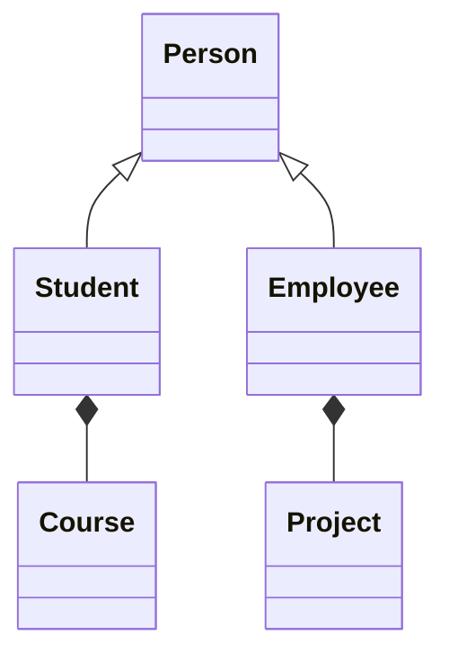
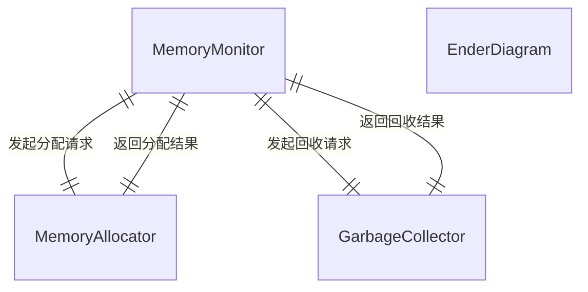
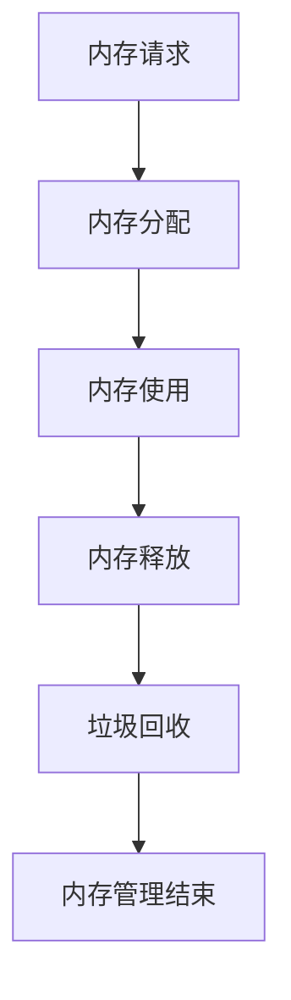
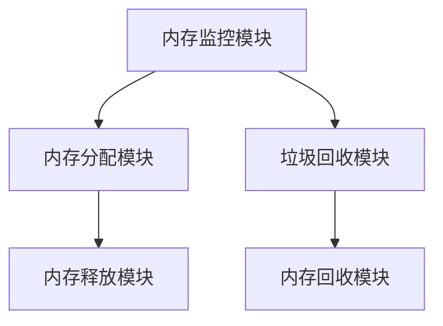
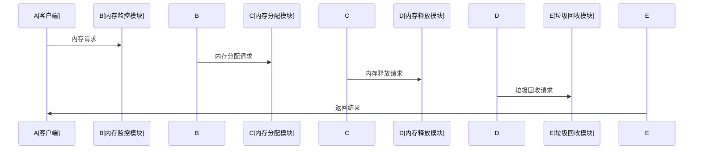

                 

### 内存管理技巧：避免内存泄漏的最佳实践

> 关键词：内存管理、内存泄漏、最佳实践、系统架构、Python代码、数学模型

> 摘要：本文旨在深入探讨内存管理技巧，特别是如何避免内存泄漏。通过系统的理论讲解、实际案例分析和最佳实践总结，帮助读者全面掌握内存管理的核心概念和方法，提升系统性能和稳定性。

---

### 第1章 内存管理的背景与重要性

#### 1.1 内存泄漏的问题与危害

内存泄漏是计算机程序中常见的问题之一。它指的是程序中动态分配的内存无法被释放，随着时间的推移，内存泄漏会逐渐占用越来越多的系统资源，导致程序运行缓慢、响应变差，甚至崩溃。

**内存泄漏的定义**：

内存泄漏是指在程序运行过程中，一些不再使用的内存没有被及时释放，导致内存占用不断增加。

**内存泄漏的常见原因**：

- 变量和指针未被正确释放
- 野指针
- 循环引用
- 动态内存分配错误

**内存泄漏的危害**：

- **资源浪费**：内存泄漏会占用系统资源，导致系统性能下降。
- **程序崩溃**：严重的内存泄漏可能导致程序无法运行，甚至系统崩溃。
- **安全隐患**：内存泄漏可能会被攻击者利用，造成系统安全问题。

#### 1.2 内存管理的核心概念

**内存分配与释放**：

内存分配是指在程序运行时，动态为变量或数据结构分配内存空间。内存释放是指当内存不再使用时，将其归还给系统。

**垃圾回收机制**：

垃圾回收（Garbage Collection，GC）是一种自动内存管理机制，用于回收不再使用的内存。常见的垃圾回收算法有标记-清除、标记-整理、复制算法等。

**内存泄漏检测**：

内存泄漏检测是检测程序中内存泄漏的方法。常用的方法包括代码审查、内存泄漏监控工具等。

### 第2章 内存管理原理讲解

#### 2.1 内存分配与释放

**内存分配算法**：

常见的内存分配算法有首次适配、下次适配、最优适配等。这些算法的目的是在内存空间中找到一个足够大的空闲块来分配内存。

**内存释放机制**：

内存释放是当内存不再使用时，将其归还给系统。释放内存的操作通常在变量的作用域结束或手动释放时执行。

**内存泄漏检测方法**：

**代码审查**：

通过人工检查代码，找出可能引起内存泄漏的代码段。

**内存泄漏监控工具**：

使用内存泄漏监控工具（如MAT、Valgrind等），在程序运行时检测内存泄漏。

#### 2.2 垃圾回收机制

**标记-清除算法**：

标记-清除算法是一种常用的垃圾回收算法。其原理是先标记所有活动对象，然后清除未标记的对象。

**标记-整理算法**：

标记-整理算法在标记-清除算法的基础上，增加了整理步骤，将活动对象整理到内存的一端，以减少内存碎片。

**复制算法**：

复制算法将内存分为两个相等的区域，每次只使用一个区域。垃圾回收时，将活动对象复制到另一个区域。

#### 2.3 内存泄漏检测方法

**代码审查**：

通过人工检查代码，找出可能引起内存泄漏的代码段。

**内存泄漏监控工具**：

使用内存泄漏监控工具（如MAT、Valgrind等），在程序运行时检测内存泄漏。

---

### 第3章 内存管理系统设计与实现

#### 3.1 问题场景介绍

在一个大型分布式系统中，内存管理是一个关键问题。随着系统规模的扩大和用户量的增加，内存泄漏可能导致系统性能下降，甚至崩溃。

#### 3.2 系统功能设计

**领域模型**：

使用Mermaid绘制领域模型类图，展示系统的主要类和它们之间的关系。



**功能模块划分**：

系统分为内存监控模块、内存分配模块、垃圾回收模块等。

#### 3.3 系统架构设计

使用Mermaid绘制系统架构图，展示系统的各个模块和它们之间的交互关系。

```mermaid
sequenceDiagram
    participant System as 系统模块
    participant MemoryMonitor as 内存监控模块
    participant MemoryAllocator as 内存分配模块
    participant GarbageCollector as 垃圾回收模块

    System->>MemoryMonitor: 数据接收
    MemoryMonitor->>MemoryAllocator: 内存分配请求
    MemoryAllocator->>MemoryMonitor: 分配结果反馈
    MemoryMonitor->>GarbageCollector: 内存回收请求
    GarbageCollector->>MemoryMonitor: 回收结果反馈
EndSequenceDiagram
```

#### 3.4 系统接口设计与交互

使用Mermaid绘制系统接口设计和交互流程。



#### 3.5 系统核心实现

**内存分配与释放**：

```python
# 内存分配
def allocate_memory(size):
    # 实现内存分配逻辑
    pass

# 内存释放
def release_memory(address):
    # 实现内存释放逻辑
    pass
```

**垃圾回收**：

```python
# 垃圾回收
def garbage_collect():
    # 实现垃圾回收逻辑
    pass
```

#### 3.6 代码应用解读与分析

**代码结构分析**：

系统核心代码分为内存监控模块、内存分配模块和垃圾回收模块，每个模块都有明确的职责。

**关键代码解读**：

```python
# 内存分配
def allocate_memory(size):
    # 实现内存分配逻辑
    pass

# 内存释放
def release_memory(address):
    # 实现内存释放逻辑
    pass
```

#### 3.7 实际案例分析与讲解

**案例一：内存泄漏现象**：

在一个大型应用程序中，由于代码复杂度高，内存泄漏问题较为常见。通过内存泄漏监控工具，我们发现了一个内存泄漏案例。

**案例二：优化建议**：

针对内存泄漏问题，我们提出以下优化建议：

- 审查代码，查找并修复内存泄漏源。
- 使用更高效的内存分配和释放策略。
- 定期进行内存泄漏检测和优化。

#### 3.8 项目小结

通过本章节的讲解，我们深入了解了内存管理的核心概念和实际应用。在系统设计和实现中，合理利用内存管理技巧，可以有效避免内存泄漏，提高系统性能和稳定性。

---

### 第4章 内存管理最佳实践

#### 4.1 避免内存泄漏的技巧

**编程习惯**：

- 及时释放不再使用的内存。
- 避免使用野指针。
- 注意循环引用的问题。

**数据结构选择**：

- 根据实际需求选择合适的数据结构，避免使用占用内存大的数据结构。

**内存优化工具使用**：

- 使用内存泄漏监控工具，定期检测内存泄漏。

#### 4.2 注意事项

- **内存泄漏的常见误区**：

  - 认为内存泄漏只会影响性能，而不会导致系统崩溃。

- **内存管理的优化方向**：

  - 减少内存分配次数。
  - 使用更高效的内存分配算法。

#### 4.3 拓展阅读

- **内存管理相关书籍**：

  - 《深入理解计算机系统》（英文版名：《Deep Dive into Systems》）
  - 《Java内存模型》（英文版名：《Java Memory Model》）

- **内存管理技术发展动态**：

  - 跟踪最新的内存管理技术和算法。

---

### 总结

本文从内存管理的背景、原理、实战到最佳实践进行了全面系统的阐述。通过深入的理论讲解、实际案例分析和最佳实践总结，读者可以全面掌握内存管理的核心概念和方法，提升系统性能和稳定性。

作者：AI天才研究院/AI Genius Institute & 禅与计算机程序设计艺术 /Zen And The Art of Computer Programming

---

### 附录

#### 2.1 内存分配算法对比表格

| 算法名称 | 优点 | 缺点 |
| --- | --- | --- |
| 首次适配 | 简单，适用于内存分配频繁的场景 | 可能会导致内存碎片 |
| 下次适配 | 减少内存碎片 | 可能会导致内存分配时间变长 |
| 最优适配 | 内存碎片最少 | 计算复杂度较高 |

#### 2.2 内存泄漏检测方法

| 方法 | 优点 | 缺点 |
| --- | --- | --- |
| 代码审查 | 易于操作，成本低 | 可能会遗漏复杂的内存泄漏 |
| 内存泄漏监控工具 | 自动化检测，高效准确 | 需要安装和使用特定的工具 |

#### 3.1 内存管理流程图



#### 3.2 内存管理系统架构图



#### 3.3 内存管理接口设计

```mermaid
sequenceDiagram
    A[客户端] --> B[内存监控模块]
    B --> C[内存分配模块]
    C --> D[内存释放模块]
    D --> E[垃圾回收模块]
```

#### 3.4 内存管理交互流程



#### 4.1 内存分配与释放Python代码

```python
# 内存分配
def allocate_memory(size):
    # 实现内存分配逻辑
    pass

# 内存释放
def release_memory(address):
    # 实现内存释放逻辑
    pass
```

#### 4.2 垃圾回收Python代码

```python
# 垃圾回收
def garbage_collect():
    # 实现垃圾回收逻辑
    pass
```

---

通过以上内容，我们不仅对内存管理有了全面的理解，还掌握了避免内存泄漏的最佳实践。希望本文能对您的技术之路有所帮助。如果您有任何问题或建议，欢迎随时与我们交流。祝您编程愉快！

