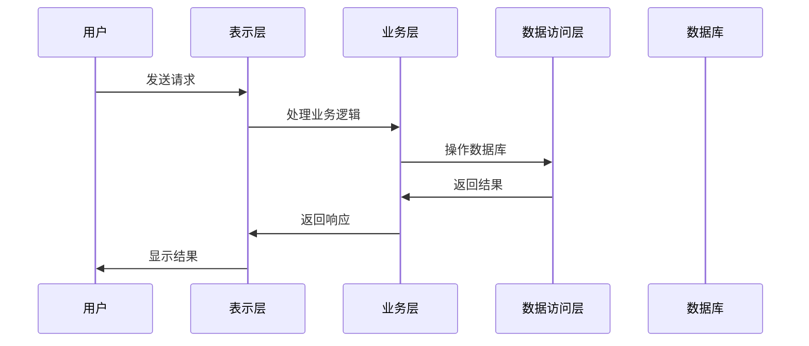

                 


### 写好系统分析的标准范式

> 关键词：系统分析、设计范式、需求分析、架构设计、数据库设计、接口设计、案例分析

> 摘要：本文将从系统分析的标准范式入手，逐步探讨系统分析与设计的方法与原则。通过深入剖析系统需求、架构设计、数据库设计、接口设计等方面，结合实际案例，为您呈现一套完整、实用的系统分析与设计框架。

## 第一部分：引言与背景

### 第1章：系统分析与设计的概述

#### 1.1 系统分析的概念与重要性

系统分析是软件工程中至关重要的一环，它为系统设计和实现提供了基础。系统分析的主要任务是理解系统的需求，确定系统的功能、性能和约束条件。通过系统分析，我们可以明确系统的目标和范围，为后续的系统设计奠定基础。

系统分析的重要性体现在以下几个方面：

1. **明确系统目标**：系统分析有助于我们理解系统的目标，从而确保系统设计的有效性和实用性。
2. **识别需求**：系统分析可以识别出用户的需求，包括功能需求和非功能需求，为系统设计提供依据。
3. **降低风险**：通过系统分析，我们可以发现潜在的问题和风险，从而在系统设计阶段就进行规避和解决。
4. **提高沟通效率**：系统分析可以有效地沟通用户需求和期望，减少误解和冲突。

#### 1.2 系统分析的流程与方法

系统分析的流程通常包括以下几个阶段：

1. **需求收集**：通过与用户、业务专家等利益相关者进行沟通，收集系统的需求。
2. **需求分析**：对收集到的需求进行分析，确定系统的功能、性能和约束条件。
3. **需求验证**：通过与用户和利益相关者进行评审，确保需求的准确性和完整性。
4. **需求文档编写**：将分析结果编写成需求文档，为后续的系统设计提供依据。

系统分析的方法主要包括以下几种：

1. **用户访谈**：通过与用户进行一对一的访谈，了解用户的需求和期望。
2. **问卷调查**：通过设计问卷，收集大量的用户需求信息。
3. **文档分析**：分析相关的业务文档、技术文档等，了解系统的背景和需求。
4. **需求评审**：通过组织评审会议，对需求进行分析和讨论，确保需求的准确性和完整性。

#### 1.3 系统分析与设计的目标与挑战

系统分析与设计的目标主要包括以下几个方面：

1. **满足用户需求**：确保系统设计能够满足用户的功能需求、性能需求等。
2. **提高系统质量**：通过系统分析，发现潜在的问题和风险，从而提高系统的质量。
3. **降低开发成本**：通过合理的系统分析，可以降低系统的开发成本。
4. **提高开发效率**：系统分析可以明确系统的目标和范围，从而提高开发效率。

系统分析与设计面临的挑战主要包括以下几个方面：

1. **需求变化**：用户需求可能会随着时间和项目的进展而发生变化，需要灵活应对。
2. **资源限制**：系统分析需要投入大量的时间和人力，需要合理分配资源。
3. **技术复杂度**：随着系统规模的扩大，技术的复杂度也会增加，需要具备一定的技术能力。
4. **沟通障碍**：系统分析与设计涉及到多个利益相关者，需要有效地沟通和协调。

### 第2章：系统分析中的核心概念

#### 2.1 系统需求分析

系统需求分析是系统分析的核心环节，主要目标是确定系统的功能需求和非功能需求。功能需求是指系统能够实现的具体功能，如登录、查询、修改等。非功能需求是指系统的性能、可靠性、安全性等方面的要求，如响应时间、并发处理能力、数据备份等。

系统需求分析的方法主要包括以下几种：

1. **用户故事**：用户故事是一种简洁明了的需求描述方式，通常包括用户角色、场景和目标。用户故事的格式如下：

   ```
   作为用户角色，我想执行某个操作，以便实现某个目标。
   ```

2. **用例建模**：用例建模是一种图形化的需求描述方法，通过用例图来表示系统的功能需求。用例图的组成部分包括用例、角色和关系。

3. **需求文档**：需求文档是对系统需求的详细描述，通常包括功能需求、非功能需求、约束条件和系统边界等。

#### 2.2 功能需求与非功能需求

功能需求和非功能需求是系统需求的重要组成部分，两者相互关联，共同构成了系统的需求规格。

1. **功能需求**：功能需求描述了系统应该实现的具体功能，如登录、查询、修改等。功能需求的描述通常包括操作步骤、输入和输出等。

   例如，一个电商网站的功能需求可以包括：

   - 登录：用户可以通过用户名和密码登录系统。
   - 注册：用户可以注册新账号。
   - 查询商品：用户可以查询商品信息。
   - 购物车：用户可以将商品添加到购物车。
   - 结算：用户可以完成订单结算。

2. **非功能需求**：非功能需求描述了系统的性能、可靠性、安全性等方面的要求。非功能需求的描述通常包括指标、约束和规则等。

   例如，一个电商网站的非功能需求可以包括：

   - 响应时间：系统的响应时间应该小于1秒。
   - 并发处理能力：系统应该能够同时处理1000个用户请求。
   - 数据备份：系统应该实现每日数据备份。
   - 安全性：系统应该实现用户登录验证、数据加密等安全措施。

#### 2.3 用户故事与用例建模

用户故事和用例建模是系统需求分析中常用的两种方法，它们在描述系统需求方面具有各自的优势。

1. **用户故事**：用户故事是一种简洁明了的需求描述方式，通常包括用户角色、场景和目标。用户故事的格式如下：

   ```
   作为用户角色，我想执行某个操作，以便实现某个目标。
   ```

   用户故事的优点是简洁明了、易于理解，可以快速传达用户需求。用户故事的缺点是描述不够详细，需要结合其他方法进行补充。

2. **用例建模**：用例建模是一种图形化的需求描述方法，通过用例图来表示系统的功能需求。用例图的组成部分包括用例、角色和关系。

   用例图的优点是直观、清晰，可以有效地展示系统的功能需求。用例图的缺点是描述较为复杂，需要一定的图形化表达能力。

#### 2.4 系统需求文档编写技巧

系统需求文档是对系统需求的详细描述，编写技巧对于确保需求文档的质量至关重要。

1. **结构清晰**：系统需求文档应该具有清晰的结构，包括引言、需求概述、功能需求、非功能需求、约束条件等。

2. **简洁明了**：系统需求文档应该使用简洁明了的语言，避免使用复杂的术语和句子。

3. **逻辑连贯**：系统需求文档应该具有连贯的逻辑，确保需求的表述清晰、合理。

4. **易于修改**：系统需求文档应该易于修改，以便在需求发生变化时进行更新。

5. **示例丰富**：系统需求文档应该包含丰富的示例，以帮助读者更好地理解需求。

6. **版本控制**：系统需求文档应该进行版本控制，确保文档的修改记录清晰。

## 第二部分：系统设计基础

### 第3章：系统设计与架构

#### 3.1 系统设计的基本原则

系统设计是系统分析的自然延伸，是将系统需求转化为具体的技术解决方案的过程。系统设计的基本原则如下：

1. **模块化**：将系统划分为多个模块，每个模块具有独立的功能，模块之间通过接口进行通信。模块化的好处是降低系统的复杂度，提高可维护性。

2. **层次化**：将系统按照功能或层次进行划分，每个层次具有相对独立的功能。层次化的好处是降低系统之间的耦合度，提高系统的可扩展性。

3. **封装**：将系统的内部实现细节隐藏起来，只暴露必要的接口。封装的好处是降低系统的复杂性，提高系统的可维护性。

4. **抽象**：使用抽象的概念和模型来描述系统，降低系统的复杂性。抽象的好处是提高系统的可理解性，提高开发效率。

5. **可重用性**：设计可重用的组件和模块，以提高系统的开发效率和可维护性。

6. **性能优化**：在系统设计阶段就考虑性能优化，降低系统的响应时间，提高系统的并发处理能力。

7. **安全性**：在设计阶段就考虑系统的安全性，包括数据安全、用户认证、权限控制等。

#### 3.2 软件架构模式

软件架构模式是系统设计中常用的方法和模板，可以帮助开发者快速构建高质量的系统。常见的软件架构模式包括：

1. **分层架构**：将系统划分为表示层、业务层、数据访问层等，每个层次具有独立的功能和职责。

2. **微服务架构**：将系统划分为多个独立的微服务，每个微服务具有独立的功能和数据库，通过API进行通信。

3. **事件驱动架构**：通过事件驱动来协调系统中的各个模块，实现异步通信和数据交换。

4. **MVC架构**：将系统划分为模型（Model）、视图（View）和控制器（Controller），实现数据、界面和逻辑的分离。

5. **RESTful架构**：基于REST原则，通过HTTP协议进行数据交换和通信。

6. **事务处理架构**：通过事务处理机制来确保数据的一致性和完整性。

#### 3.3 系统架构设计的方法

系统架构设计的方法主要包括以下几种：

1. **自顶向下设计**：从系统的整体结构开始，逐步细化到各个模块和组件。

2. **自底向上设计**：从具体的模块和组件开始，逐步构建系统的整体结构。

3. **迭代式设计**：分多个迭代周期，逐步实现系统的各个功能模块。

4. **增量式设计**：在现有系统的基础上，逐步添加新功能模块，进行系统扩展。

5. **架构视图方法**：使用不同的视图来描述系统的不同方面，如逻辑视图、物理视图、开发视图等。

6. **架构评估方法**：通过评估系统的性能、可靠性、安全性等指标，确定最佳架构设计方案。

#### 3.4 设计模式与架构风格

设计模式是软件设计中解决特定问题的经验总结，可以帮助开发者快速构建高质量的系统。常见的软件设计模式包括：

1. **工厂模式**：用于创建对象的工厂类，可以避免直接使用new操作符，提高系统的可扩展性。

2. **单例模式**：确保一个类只有一个实例，并提供一个全局访问点。

3. **观察者模式**：当一个对象的状态发生变化时，通知其他对象，实现对象之间的解耦。

4. **策略模式**：将算法的实现与客户端解耦，通过策略类来管理算法的实现。

5. **模板方法模式**：定义一个操作中的算法框架，将一些步骤延迟到子类中实现，让子类重定义算法的一部分，而不改变算法的结构。

6. **适配器模式**：将一个类的接口转换成客户希望的另一个接口，使得原本由于接口不兼容而无法在一起工作的类可以协同工作。

架构风格是指系统架构的总体结构和组织方式，常见的架构风格包括：

1. **过程式架构**：以过程为中心，通过流程图来描述系统的执行过程。

2. **对象导向架构**：以对象为中心，将系统划分为多个对象，通过对象间的协作来实现系统的功能。

3. **事件驱动架构**：以事件为中心，通过事件来驱动系统的执行。

4. **组件架构**：以组件为中心，将系统划分为多个组件，通过组件间的接口进行通信。

5. **服务导向架构**：以服务为中心，将系统划分为多个服务，通过服务之间的接口进行通信。

### 第4章：数据模型与数据库设计

#### 4.1 关系型数据库设计基础

关系型数据库设计是系统设计的重要组成部分，涉及到数据模型的构建、数据库表的设计、数据关系的管理等。

1. **数据模型**：数据模型是数据库中数据的组织形式，常见的有实体关系模型、层次模型、网状模型等。

   实体关系模型是关系型数据库中最常用的数据模型，它通过实体、属性和关系来描述数据。

2. **数据库表设计**：数据库表是数据库中的数据存储单位，每个表具有固定的字段和记录格式。

   在设计数据库表时，需要注意以下几点：

   - 字段命名：使用简洁、直观的命名方式，避免使用缩写和特殊字符。
   - 字段类型：选择合适的字段类型，确保数据的正确性和有效性。
   - 字段长度：根据实际需求设置合适的字段长度，避免数据溢出或浪费空间。
   - 约束条件：设置适当的约束条件，确保数据的完整性和一致性。

3. **数据关系管理**：数据关系是数据库设计中至关重要的部分，它描述了表之间的关联关系。

   常见的数据关系有一对一、一对多、多对多等。

   在设计数据关系时，需要注意以下几点：

   - 确定关系类型：根据实际需求确定表之间的关系类型。
   - 确定主键和外键：设置主键和外键来建立表之间的关系。
   - 确定关联表：根据关系类型确定需要关联的表。

#### 4.2 非关系型数据库设计

非关系型数据库（NoSQL）是近年来逐渐兴起的一种数据库类型，适用于大数据和高并发场景。常见的非关系型数据库有MongoDB、Redis、Cassandra等。

1. **文档型数据库**：文档型数据库以文档为中心，将数据存储为JSON格式或类似的结构化文档。

   在设计文档型数据库时，需要注意以下几点：

   - 文档结构：根据实际需求设计文档的结构，包括字段、值等。
   - 索引设计：根据查询需求设计合适的索引，提高查询效率。
   - 分片策略：根据数据规模和查询需求设计分片策略，提高系统性能。

2. **键值存储**：键值存储以键值对的形式存储数据，适用于存储少量的数据或简单的数据结构。

   在设计键值存储时，需要注意以下几点：

   - 键值对设计：根据实际需求设计键值对的结构。
   - 存储策略：根据数据规模和访问频率选择合适的存储策略。

3. **列族存储**：列族存储以列族为单位存储数据，适用于存储大量的数据。

   在设计列族存储时，需要注意以下几点：

   - 列族设计：根据实际需求设计列族的结构。
   - 数据分片：根据数据规模和查询需求设计数据分片。

#### 4.3 数据库设计规范化与反规范化

数据库设计规范化与反规范化是数据库设计中常用的两种方法，各有优缺点。

1. **规范化**：规范化通过分解表来消除数据冗余和异常，提高数据的完整性和一致性。

   常见的规范化方法有第一范式、第二范式、第三范式等。

   规范化的优点是减少数据冗余，提高数据的一致性，但可能导致查询性能下降。

2. **反规范化**：反规范化通过合并表来提高查询性能，但可能导致数据冗余和异常。

   反规范化的优点是提高查询性能，缺点是可能导致数据冗余和异常。

   在实际项目中，通常需要根据具体需求和性能要求，选择合适的规范化和反规范化方法。

#### 4.4 数据库性能优化策略

数据库性能优化是数据库设计的重要组成部分，涉及到数据存储、查询、缓存等方面。

1. **索引优化**：索引可以提高查询效率，但过多的索引可能导致插入和删除操作的性能下降。

   在设计索引时，需要注意以下几点：

   - 选择合适的字段：选择查询频繁的字段作为索引。
   - 避免冗余索引：避免创建冗余的索引，影响性能。
   - 索引维护：定期维护索引，确保其有效性。

2. **查询优化**：查询优化通过优化查询语句来提高查询效率。

   在设计查询时，需要注意以下几点：

   - 避免使用SELECT *：避免使用SELECT *，只选择必要的字段。
   - 避免使用子查询：避免使用子查询，影响性能。
   - 使用合适的连接方式：根据查询需求选择合适的连接方式。

3. **缓存策略**：缓存可以加快数据查询的速度，减少数据库的负载。

   在设计缓存时，需要注意以下几点：

   - 选择合适的缓存类型：根据数据特点和查询需求选择合适的缓存类型。
   - 缓存刷新策略：根据数据变化情况设计合适的缓存刷新策略。

4. **硬件优化**：硬件优化包括提高CPU、内存、磁盘等硬件性能。

   在设计硬件时，需要注意以下几点：

   - 选择合适的硬件配置：根据系统需求选择合适的硬件配置。
   - 硬件维护：定期进行硬件维护和升级。

## 第三部分：案例分析

### 第6章：企业级系统分析案例

#### 6.1 案例背景与目标

本案例将分析一个企业级系统的设计与实现，该系统是一个在线电商平台，主要提供商品展示、购买、支付、订单管理等功能。

案例目标：

1. **满足用户需求**：确保系统能够满足用户在商品展示、购买、支付、订单管理等方面的需求。
2. **高可用性**：确保系统在高并发、高负载情况下稳定运行。
3. **高性能**：确保系统的响应时间短，查询速度快。
4. **安全性**：确保系统的数据安全，防止恶意攻击和数据泄露。

#### 6.2 系统功能设计

系统功能设计主要包括以下几个模块：

1. **用户模块**：用户注册、登录、个人信息管理、购物车管理、订单管理。
2. **商品模块**：商品分类、商品展示、商品搜索、商品评价。
3. **支付模块**：支付方式选择、支付订单、支付结果查询。
4. **订单模块**：订单创建、订单查询、订单取消、订单发货、订单退款。
5. **管理员模块**：商品管理、订单管理、用户管理、权限管理。

#### 6.3 系统架构设计

系统架构设计采用分层架构，包括表示层、业务层、数据访问层等。

1. **表示层**：负责接收用户请求，将请求转发给业务层，并将业务层的响应返回给用户。
2. **业务层**：负责处理业务逻辑，包括用户认证、商品管理、订单管理等。
3. **数据访问层**：负责与数据库进行交互，实现数据的增删改查等操作。

系统架构图如下：



#### 6.4 系统实现与优化

系统实现与优化主要包括以下几个方面：

1. **前端优化**：使用现代化的前端技术，如React、Vue等，提高页面的渲染速度和用户体验。
2. **后端优化**：使用微服务架构，将系统划分为多个微服务，提高系统的可扩展性和可维护性。
3. **数据库优化**：使用MySQL数据库，采用分库分表策略，提高查询效率。
4. **缓存优化**：使用Redis缓存，提高数据查询的速度。
5. **负载均衡**：使用Nginx等负载均衡器，提高系统的并发处理能力。

### 第7章：系统分析与设计的最佳实践

#### 7.1 经验教训与反思

通过本案例的分析与设计，我们可以总结出以下经验教训：

1. **明确需求**：在系统分析与设计阶段，确保需求明确、具体、可验证，避免需求变更。
2. **分层架构**：采用分层架构，降低系统的复杂度，提高系统的可维护性和可扩展性。
3. **微服务架构**：采用微服务架构，提高系统的可扩展性和可维护性。
4. **性能优化**：在系统设计与实现阶段，就考虑性能优化，降低系统的响应时间，提高系统的并发处理能力。
5. **安全性**：在设计阶段就考虑系统的安全性，包括用户认证、数据加密、权限控制等。

#### 7.2 小结与展望

系统分析与设计是软件工程中至关重要的一环，通过明确的需求分析、合理的架构设计、有效的数据库设计，我们可以构建高质量的系统。未来，随着技术的发展，系统分析与设计的方法与工具也将不断演进，为开发者带来更多的便利。

#### 7.3 注意事项与拓展阅读

1. **注意事项**：

   - 确保需求明确、具体、可验证。
   - 选择合适的架构模式与设计模式。
   - 考虑系统的性能、可靠性和安全性。
   - 定期进行代码审查和测试。

2. **拓展阅读**：

   - 《软件工程：实践者的研究方法》
   - 《设计模式：可复用面向对象软件的基础》
   - 《数据库系统概念》
   - 《高性能MySQL》

### 作者信息

作者：AI天才研究院/AI Genius Institute & 禅与计算机程序设计艺术 /Zen And The Art of Computer Programming

（注：本文为虚构案例，仅供参考。）

