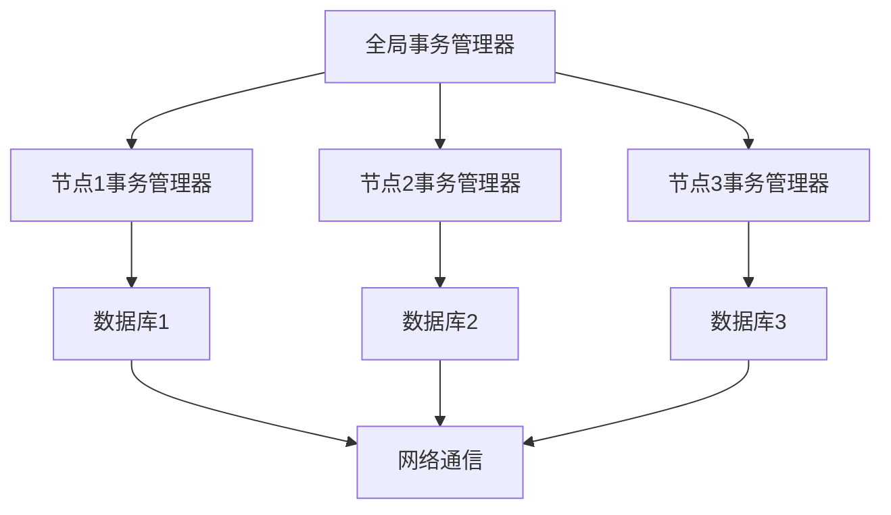
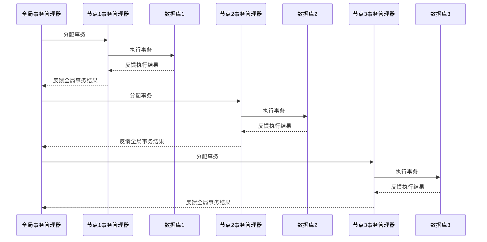
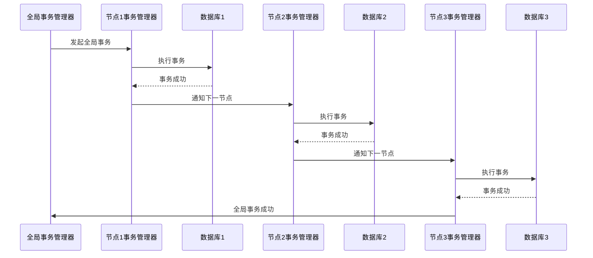

                 

### 概述与背景

#### 分布式事务的概念

分布式事务，指的是在一个分布式系统中，对多个节点上的数据进行原子性操作的一组事务。它旨在确保在分布式环境下，多个操作要么全部成功执行，要么全部失败，从而保证数据的一致性。在传统的关系型数据库管理系统中，事务（Transaction）是一个基本的概念，用于确保数据操作的一致性和隔离性。但随着互联网的兴起和分布式系统的广泛应用，事务的概念也被扩展到了分布式环境中。

#### 为什么需要分布式事务

随着现代互联网应用的日益复杂，分布式系统已经成为主流架构。在分布式系统中，多个节点（可能分布在全球各地）共同工作，以提供高性能和高可用性的服务。这种分布式架构带来了很多优势，但也带来了新的挑战，其中之一就是数据一致性问题。以下是一些驱动分布式事务需求的关键因素：

1. **高可用性**：在分布式系统中，任何一个节点出现故障都不会导致整个系统瘫痪。通过分布式事务，我们可以确保即使部分节点不可用，整个系统依然能够保持一致性。
   
2. **高性能**：分布式系统通过将任务分解到多个节点上并行执行，可以显著提高系统的处理速度。分布式事务可以确保在并行执行过程中，各个节点之间的操作不会互相干扰，从而保证最终一致性。

3. **扩展性**：随着用户数量的增加，单点系统可能会成为性能瓶颈。分布式事务使得系统可以水平扩展，通过增加节点来提高系统的处理能力。

4. **异地多活**：在分布式系统中，不同的区域可以独立运行，实现异地多活。分布式事务可以确保异地数据的一致性，使得用户在任何一个区域都能享受到一致的服务体验。

#### 分布式事务面临的主要挑战

虽然分布式事务带来了很多好处，但在实现过程中也面临一些挑战：

1. **数据一致性问题**：在分布式系统中，数据可能存储在不同的节点上，如何保证数据的一致性是一个难题。分布式事务需要确保在多个节点上执行的操作要么全部成功，要么全部失败，从而保证数据的一致性。

2. **带宽和时间延迟问题**：在分布式系统中，节点之间通过网络进行通信。网络带宽的限制和节点之间的时间延迟都会对分布式事务的性能产生影响。如何优化网络通信，减少时间延迟，是分布式事务需要解决的一个关键问题。

3. **事务复杂性**：分布式事务涉及到多个节点的协调，其实现过程比单点事务要复杂得多。如何设计一个高效、可靠的分布式事务处理算法，是一个挑战。

4. **分布式事务的安全性**：在分布式系统中，安全性是一个不可忽视的问题。如何确保分布式事务中的数据安全，防止数据泄露或被恶意攻击，需要采取一系列安全措施。

#### 分布式事务的定义与特点

分布式事务的定义可以归结为：在分布式系统中，对多个节点上的数据进行原子性操作的一组事务。其核心特点是：

1. **原子性**：分布式事务中的操作要么全部成功，要么全部失败。这个特性确保了数据的一致性。
   
2. **一致性**：分布式事务需要确保在多个节点上执行的操作达到最终一致性。这通常意味着在分布式事务完成后，系统中的所有节点都会有一致的视图。

3. **隔离性**：分布式事务需要确保各个事务之间的隔离，防止一个事务的操作影响到其他事务。在分布式系统中，实现隔离性是一项挑战。

4. **持久性**：一旦分布式事务成功完成，其操作的结果会持久化到系统中，即使系统发生故障，这些操作也不会丢失。

通过上述对分布式事务概念、需求和挑战的概述，我们可以看到分布式事务在分布式系统中的重要性，同时也认识到其在实现过程中面临的挑战。接下来的章节将深入探讨这些核心概念和解决方案。

#### 分布式系统的发展历程

分布式系统的发展历程可以追溯到20世纪60年代，当时计算机科学领域的先驱们开始探索如何将多个计算机连接起来，以实现更强大的计算能力和更高的可靠性。以下是一些重要的发展阶段：

1. **早期分布式系统**（1960s-1970s）：
   - **分时系统**：早期的分布式系统多是基于分时系统，通过将计算任务分配到多个终端和主机上，实现资源共享。这种系统的主要目标是提高系统吞吐量和用户体验。
   - **集群技术**：1960年代，IBM推出了一系列的“系统/360”系列主机，这些主机可以通过网络连接，形成一个集群。这种集群技术在提高系统可靠性和扩展性方面发挥了重要作用。

2. **客户端-服务器模型**（1980s）：
   - 随着个人计算机的普及，客户端-服务器模型成为分布式系统设计的主流。客户端-服务器模型将任务分为客户端和服务器两部分，客户端负责用户交互，服务器负责处理业务逻辑和数据存储。
   - **网络协议**：1983年，互联网工程任务组（IETF）发布了TCP/IP协议，使得不同类型的计算机能够通过互联网进行通信。TCP/IP协议的普及推动了分布式系统的广泛应用。

3. **Web分布式系统**（1990s-2000s）：
   - **Web服务**：1990年代，随着Web的普及，Web服务成为分布式系统的重要形式。Web服务通过HTTP协议进行通信，提供了跨平台、跨语言的数据交换方式。
   - **服务导向架构（SOA）**：SOA将业务功能抽象为服务，通过服务之间的调用实现分布式系统的集成。SOA使得分布式系统能够灵活地扩展和重构，提高了系统的可维护性和可扩展性。

4. **云计算与微服务架构**（2010s-至今）：
   - **云计算**：云计算的出现使得分布式系统能够更方便地实现弹性伸缩和资源优化。云计算平台如Amazon Web Services（AWS）、Google Cloud Platform（GCP）和Microsoft Azure提供了丰富的分布式系统服务和工具。
   - **微服务架构**：微服务架构将大型应用程序分解为多个小型、独立的微服务，每个微服务负责特定的业务功能。微服务架构提高了系统的可扩展性和可维护性，使得分布式系统更加灵活和可管理。
   - **容器化和编排工具**：容器化技术如Docker和编排工具如Kubernetes，使得分布式系统的部署、管理和扩展变得更加简单和高效。容器化技术确保了分布式系统在不同环境中的一致性，提高了系统的可靠性和可扩展性。

#### 分布式系统的特点

分布式系统具有以下主要特点：

1. **高可用性**：分布式系统通过将任务分布到多个节点上，实现了故障转移和容错能力。如果一个节点发生故障，其他节点可以继续提供服务，从而保证系统的可用性。

2. **高可扩展性**：分布式系统可以根据需求动态地增加或减少节点，从而实现水平扩展。这种扩展方式不仅提高了系统的处理能力，还降低了单点故障的风险。

3. **高容错性**：分布式系统通过冗余设计，使得即使部分节点出现故障，系统仍能正常运行。这种容错能力确保了系统的稳定性和可靠性。

4. **灵活性**：分布式系统可以根据业务需求灵活地调整和重构，以适应不断变化的市场环境。

5. **分布式数据一致性**：在分布式系统中，数据可能存储在不同的节点上，如何保证数据的一致性是一个挑战。分布式事务和分布式一致性协议（如CAP定理）解决了这个问题。

#### 分布式事务需求

在分布式系统的背景下，分布式事务的需求变得尤为重要。以下是分布式事务需求的主要驱动因素：

1. **数据一致性**：在分布式系统中，多个节点可能同时处理同一数据集，如何确保这些操作的一致性是一个关键问题。分布式事务通过保证原子性、一致性和隔离性，确保了数据的一致性。

2. **高可用性**：分布式事务可以确保即使部分节点发生故障，整个系统依然可以正常运作。通过故障转移和容错机制，分布式事务提高了系统的可用性。

3. **事务隔离性**：在分布式系统中，多个事务可能同时访问同一数据集。分布式事务需要确保事务之间的隔离性，防止一个事务的操作影响到其他事务。

4. **性能优化**：分布式事务通过并行处理和负载均衡，提高了系统的性能。分布式事务处理算法（如二阶段提交、三阶段提交）优化了事务处理的效率。

5. **异地多活**：分布式事务支持异地多活，确保不同地区的用户都能享受到一致的服务体验。这对于全球化的企业来说尤为重要。

通过以上对分布式系统发展历程、特点以及分布式事务需求的概述，我们可以更好地理解分布式事务在分布式系统中的重要性。接下来，我们将深入探讨分布式事务的核心概念和解决方案。

#### 分布式事务的定义

分布式事务（Distributed Transaction）是指在分布式系统中，对多个节点上的数据进行原子性操作的一组事务。分布式事务的目标是确保多个节点上的数据操作要么全部成功，要么全部失败，从而保证数据的一致性。与单点事务相比，分布式事务需要在多个节点之间进行协调，以确保操作的原子性、一致性和隔离性。

在分布式事务中，常见的关键术语包括：

1. **全局事务（Global Transaction）**：全局事务是指跨越多个节点的单个事务。全局事务包含了多个局部事务，这些局部事务分别在不同的节点上执行。

2. **局部事务（Local Transaction）**：局部事务是指在一个单个节点上执行的事务。在分布式事务中，全局事务通常由多个局部事务组成。

3. **事务管理器（Transaction Manager）**：事务管理器是负责协调分布式事务的组件。事务管理器负责将全局事务分解为局部事务，并在局部事务执行完毕后，协调这些局部事务的提交或回滚。

4. **两阶段提交（2PC）**：两阶段提交是一种分布式事务处理算法，用于确保分布式系统中多个节点之间的数据一致性。两阶段提交分为准备阶段和提交阶段，通过两个阶段的交互，确保事务的原子性和一致性。

5. **三阶段提交（3PC）**：三阶段提交是对两阶段提交的改进，旨在解决两阶段提交中的性能和可靠性问题。三阶段提交分为初始化阶段、准备阶段和提交阶段，通过引入额外的阶段，提高了事务处理的可靠性和性能。

6. **分布式一致性协议**：分布式一致性协议是一组规则，用于确保分布式系统中多个节点之间的数据一致性。常见的分布式一致性协议包括CAP定理、BASE理论和一致性哈拉比希算法（CRA）等。

7. **事务隔离级别**：事务隔离级别是指事务之间的隔离程度。常见的隔离级别包括读未提交（Read Uncommitted）、读已提交（Read Committed）、可重复读（Repeatable Read）和序列化（Serializable）。

通过这些术语，我们可以更好地理解分布式事务的运作机制和实现方法。在接下来的章节中，我们将详细探讨分布式事务面临的主要挑战和解决方案。

#### 分布式事务面临的主要挑战

在分布式系统中实现事务处理，面临许多独特的挑战，这些挑战不仅影响了系统的性能和可靠性，还直接关系到数据的一致性和业务连续性。以下是分布式事务面临的主要挑战：

##### 数据一致性问题

数据一致性是分布式事务的核心目标之一。在分布式系统中，数据可能分布在多个节点上，如何保证这些节点之间的数据一致性是一个巨大的挑战。具体来说，数据一致性挑战包括：

1. **最终一致性**（Eventual Consistency）：最终一致性是指分布式系统中的数据最终会在一段时间内达到一致状态。然而，在达到最终一致性之前，系统可能会经历暂时的不一致状态。这种一致性模型适用于读操作不频繁的场景，但对要求高一致性的事务处理来说，可能不够理想。

2. **强一致性**（Strong Consistency）：与最终一致性相对，强一致性要求系统在所有操作中都能保证数据的一致性。然而，在分布式系统中，强一致性通常需要牺牲性能和可用性，因为它需要所有节点在每次操作后都保持同步。

##### 带宽和时间延迟问题

分布式系统中的节点可能分布在不同的地理位置，网络带宽和时间延迟对事务处理有显著影响。以下是带宽和时间延迟带来的挑战：

1. **网络拥塞**：当网络中的数据流量过大时，节点之间的通信可能会变得缓慢，导致事务处理时间延长。

2. **时间延迟**：不同地理位置的节点之间的时间同步可能不够精确，导致事务处理过程中的时间延迟，进而影响系统的整体性能。

##### 事务复杂性

在分布式系统中，事务处理比单点系统更加复杂。具体挑战包括：

1. **分布式事务管理**：分布式事务需要协调多个节点上的操作，这增加了系统的复杂度。如何高效地管理分布式事务，确保操作的顺序和一致性，是一个难题。

2. **故障处理**：在分布式系统中，节点故障是常见现象。分布式事务需要能够处理节点故障，确保事务的提交或回滚，从而保证系统的一致性。

##### 分布式事务的安全性

分布式事务中的安全性问题也至关重要。以下是一些主要的安全挑战：

1. **数据泄露**：在分布式系统中，数据可能通过网络传输，容易受到中间人攻击和数据泄露的风险。

2. **恶意节点**：恶意节点可能故意破坏分布式事务，导致数据不一致或系统崩溃。

3. **认证与授权**：确保分布式事务中的所有操作都来自授权用户，防止未授权的访问和操作。

##### 挑战总结

分布式事务的挑战是多方面的，既包括数据一致性、带宽和时间延迟等技术问题，也涉及事务管理、故障处理和安全性等复杂性问题。解决这些挑战需要综合考虑系统的需求、性能、可靠性和安全性，采用合适的分布式事务处理算法和架构设计。以下章节将深入探讨这些挑战的解决方案，提供一系列有效的方法和策略，帮助我们在分布式系统中实现高效、可靠的事务处理。

#### 数据一致性问题

在分布式系统中，数据一致性问题是最为关键且复杂的一个挑战。分布式事务的目标是确保多个节点上的数据操作能够保持一致性，即在一个全局事务中，对多个节点的数据修改要么全部成功，要么全部失败。数据一致性问题主要包括以下三个方面：

##### 最终一致性

最终一致性是分布式系统常用的一种一致性模型，它允许多个节点在一段时间后最终达到一致状态，但在这一过程中可能会经历暂时的不一致。最终一致性模型适用于以下场景：

1. **读操作不频繁**：如果系统中的读操作远少于写操作，最终一致性模型可以容忍一定时间内的不一致状态，因为最终数据会一致。
   
2. **弱一致性需求**：对于一些对一致性要求不高的应用场景，如社交媒体的点赞和评论，最终一致性可以提供足够的一致性保证，同时保持较高的性能和可用性。

##### 强一致性

强一致性是另一个极端的一致性模型，它要求系统中的所有操作都能实时保持数据的一致性。实现强一致性通常需要额外的同步机制，这可能会导致性能和可用性的牺牲。以下是在分布式系统中实现强一致性的常见方法：

1. **同步复制**：通过在多个节点之间同步复制数据，确保所有节点都有一致的视图。这种方法可以保证数据的强一致性，但可能会导致较高的延迟和带宽消耗。

2. **Paxos算法**：Paxos算法是一种用于分布式系统中达成一致性的算法，它通过一系列的提案和投票过程，确保多个节点能够在一个全局事务中达成一致。

3. **两阶段提交（2PC）**：两阶段提交是一种分布式事务处理算法，通过两个阶段的交互，确保分布式系统中多个节点之间的数据一致性。尽管2PC在性能上存在一定的问题，但在某些高一致性要求场景中，仍然是一个有效的解决方案。

##### 数据一致性与CAP定理

CAP定理（Consistency, Availability, Partition Tolerance）是分布式系统设计中的一个核心理论。CAP定理指出，在分布式系统中，一致性（Consistency）、可用性（Availability）和分区容错性（Partition Tolerance）三者之间只能同时满足两个，而不能三者兼得。

1. **一致性（Consistency）**：确保系统中的所有操作都能看到最新的数据状态。
   
2. **可用性（Availability）**：确保系统能够响应所有用户的请求。
   
3. **分区容错性（Partition Tolerance）**：系统在分区故障时仍能继续运行。

在分布式事务处理中，CAP定理意味着我们在设计系统时需要在三者之间做出权衡：

- **CA系统**：牺牲分区容错性，实现强一致性和高可用性。这种系统在遇到网络分区时可能会完全不可用。
- **CP系统**：牺牲可用性，实现强一致性和分区容错性。这种系统在分区发生时仍能保持一致性，但可能无法响应所有请求。
- **AP系统**：牺牲一致性，实现高可用性和分区容错性。这种系统在分区发生时仍然可以继续运行，但可能无法保证数据一致性。

在实际应用中，CAP定理指导我们根据业务需求和系统特点选择合适的一致性模型。例如，金融交易系统可能需要强一致性，而社交媒体系统则可能更倾向于最终一致性以保持高可用性。

##### 数据一致性的挑战与解决方案

在分布式事务处理中，实现数据一致性面临以下挑战：

1. **分布式事务管理**：如何高效地管理分布式事务，确保多个节点上的操作顺序和一致性。
   
2. **网络延迟与带宽**：网络延迟和带宽限制可能影响事务处理的速度和一致性。
   
3. **故障处理**：如何处理分布式系统中的节点故障，确保事务的提交或回滚。

解决这些挑战的方法包括：

- **分布式一致性协议**：如Paxos、Raft等算法，确保多个节点能够达成一致。
- **两阶段提交（2PC）和三阶段提交（3PC）**：用于在多个节点之间协调事务，确保一致性。
- **最终一致性模型**：通过允许暂时的不一致，提高系统的性能和可用性。

通过综合考虑这些方法和策略，我们可以在分布式系统中实现高效、可靠的数据一致性。

#### 带宽和时间延迟问题

在分布式系统中，节点之间的通信是通过网络进行的，因此网络带宽和时间延迟成为影响事务处理性能的关键因素。以下是对这两个问题的详细讨论：

##### 网络带宽

网络带宽决定了数据在节点之间传输的速度。带宽限制会导致以下问题：

1. **数据传输延迟**：当网络带宽不足以支持数据传输时，数据包的传输时间会显著增加，导致事务处理延迟。

2. **流量拥塞**：网络中的流量可能会超过带宽限制，导致数据包堆积，从而影响系统的响应速度。

3. **负载均衡**：带宽限制可能影响负载均衡的效果，使得某些节点负载过高，而其他节点资源闲置。

##### 时间延迟

时间延迟是指数据在节点之间传输所需的时间，包括传输延迟和网络延迟。时间延迟的影响如下：

1. **分布式事务处理延迟**：时间延迟会延长分布式事务的执行时间，降低系统的整体性能。

2. **分区故障**：在分布式系统中，节点可能会分布在不同的地理位置，时间延迟可能导致节点间的同步困难，增加系统故障的风险。

3. **一致性保证**：时间延迟可能影响分布式事务的一致性保证。例如，在两阶段提交（2PC）中，时间延迟可能导致阶段一的响应时间过长，影响事务的提交速度。

##### 解决方案

为了应对带宽和时间延迟问题，可以采取以下解决方案：

1. **优化网络架构**：通过优化网络架构，减少数据传输的距离和时间。例如，使用数据中心互连（DCI）技术，将节点分布在更接近用户的位置。

2. **负载均衡**：使用负载均衡技术，合理分配网络流量，确保带宽利用率最大化。负载均衡器可以根据网络状态和节点负载动态调整流量分配。

3. **分布式一致性协议**：采用如Paxos、Raft等分布式一致性协议，优化节点间的同步机制，减少时间延迟。这些协议通过增加冗余和冗余投票机制，提高了系统的容错性和一致性。

4. **数据压缩**：对传输的数据进行压缩，减少数据包的体积，提高带宽利用率。

5. **缓存机制**：使用缓存机制，减少对远程节点的访问频率，降低时间延迟。通过在本地节点存储常见数据，可以显著提高系统的响应速度。

6. **时间同步**：确保节点之间有精确的时间同步，减少时间延迟带来的影响。使用如NTP（网络时间协议）等技术，确保节点时间的一致性。

通过综合考虑这些解决方案，可以在一定程度上缓解带宽和时间延迟对分布式事务处理的影响，提高系统的性能和可靠性。

#### 事务复杂性

在分布式系统中，事务处理相较于单点系统更加复杂，这主要体现在以下几个方面：

##### 分布式事务管理

分布式事务管理需要协调多个节点上的操作，以确保事务的原子性、一致性和隔离性。分布式事务管理的关键挑战包括：

1. **全局协调**：分布式事务需要全局协调，以确保多个节点上的操作要么全部成功，要么全部失败。这需要复杂的事务管理机制，如两阶段提交（2PC）和三阶段提交（3PC）。

2. **容错性**：分布式系统中的节点可能会发生故障，事务管理需要能够处理这些故障，确保事务的提交或回滚。这增加了系统的复杂度，因为需要实现故障检测、恢复和重试机制。

3. **性能优化**：分布式事务管理需要优化性能，以减少事务处理的时间和资源消耗。这包括减少网络通信、优化锁机制和并发控制等。

##### 故障处理

分布式系统中的节点故障是常见现象，分布式事务需要能够处理这些故障，以确保系统的一致性和可靠性。故障处理的关键挑战包括：

1. **故障检测**：如何快速检测到节点故障，并采取措施防止故障影响其他节点。

2. **故障恢复**：如何从节点故障中恢复，确保事务的提交或回滚。这可能包括事务回滚、重新执行事务或状态恢复等。

3. **数据一致性**：在处理节点故障时，需要确保数据的一致性，防止出现数据丢失或重复。

##### 性能优化

性能优化是分布式事务处理的另一个关键挑战。以下是一些优化策略：

1. **负载均衡**：通过负载均衡，将事务均匀地分配到多个节点上，避免单个节点成为性能瓶颈。

2. **缓存机制**：使用缓存机制，减少对远程节点的访问频率，降低事务处理时间。

3. **并发控制**：通过并发控制机制，如锁和事务隔离级别，优化事务执行顺序，减少冲突和死锁。

4. **分布式一致性协议**：采用高效的分布式一致性协议，如Paxos和Raft，优化节点间的同步机制。

通过综合考虑这些因素，分布式事务处理可以在高复杂性环境中实现高效、可靠的事务处理，确保系统的一致性和性能。

#### 分布式事务的安全性

在分布式系统中，分布式事务的安全性是一个不可忽视的重要问题。分布式事务的安全性涉及到数据完整性、系统可靠性以及防止恶意攻击等多个方面。以下是对分布式事务安全性的详细讨论：

##### 数据泄露

数据泄露是分布式事务中的一个主要安全威胁。数据可能在传输过程中被截获或窃取，从而导致敏感信息泄露。以下是一些防范数据泄露的措施：

1. **加密传输**：使用加密技术，如SSL/TLS，对数据在节点之间的传输进行加密，防止数据在传输过程中被窃取。

2. **访问控制**：通过严格的访问控制策略，确保只有授权用户能够访问敏感数据。访问控制可以基于用户身份验证、权限验证和操作审计等多种手段。

3. **数据备份与恢复**：定期备份数据，并在数据泄露事件发生后能够快速恢复，减少数据丢失的影响。

##### 恶意节点

恶意节点是分布式系统中另一个重大的安全挑战。恶意节点可能会故意破坏分布式事务，导致数据不一致或系统崩溃。以下是一些防范恶意节点的措施：

1. **节点认证**：通过节点认证，确保只有合法的节点能够参与分布式事务。节点认证可以使用数字签名、证书等方式。

2. **安全审计**：对分布式系统的操作进行实时监控和审计，记录所有操作的日志，以便在发生安全事件时能够追踪和定位问题。

3. **抗攻击性设计**：设计系统时，考虑到可能面临的攻击方式，如分布式拒绝服务攻击（DDoS），并采取相应的防护措施。

##### 认证与授权

在分布式事务中，确保认证和授权的有效性至关重要。以下是一些认证与授权的措施：

1. **多因素认证**：采用多因素认证（MFA），如密码、手机验证码、指纹等，提高用户认证的安全性。

2. **细粒度授权**：通过细粒度的授权策略，确保用户只能访问其授权的数据和操作。例如，使用基于角色的访问控制（RBAC）或属性基访问控制（ABAC）。

3. **操作审计**：记录用户的所有操作，包括成功和失败的审计日志，以便在需要时进行追踪和审计。

##### 安全性总结

分布式事务的安全性涉及到多个方面，包括数据泄露防护、恶意节点防范和认证与授权。通过采用加密传输、节点认证、安全审计、多因素认证和细粒度授权等措施，可以显著提高分布式事务的安全性，确保系统的可靠运行和数据保护。

#### 分布式事务处理的系统架构设计

在分布式系统中，分布式事务处理的核心目标是保证数据的一致性，同时提高系统的性能和可用性。为了实现这一目标，我们需要设计一个高效、可靠且可扩展的分布式事务处理系统架构。以下是对分布式事务处理系统架构的详细分析和设计：

##### 系统需求分析

在进行系统架构设计之前，我们需要明确系统需求，这包括功能需求和非功能需求：

1. **功能需求**：
   - **原子性**：确保分布式事务中的操作要么全部成功，要么全部失败。
   - **一致性**：保证在多个节点上执行的操作达到最终一致性。
   - **隔离性**：确保事务之间的隔离，防止事务之间的互相干扰。
   - **持久性**：一旦事务成功完成，其操作结果应持久保存。

2. **非功能需求**：
   - **高可用性**：系统应在节点故障时保持运行，确保服务的连续性。
   - **高可扩展性**：系统应能够动态扩展，以应对负载变化。
   - **高性能**：系统应能够高效处理大量事务，降低延迟。
   - **安全性**：系统应具备强大的安全机制，防止数据泄露和恶意攻击。

##### 领域模型类图设计

领域模型类图是系统设计中的重要组成部分，它用于描述系统中主要实体及其之间的关系。以下是一个简单的领域模型类图，用于描述分布式事务处理系统的核心实体：

```mermaid
classDiagram
    Class1[全局事务] <|-- Class2[局部事务]
    Class2 <|-- Class3[事务管理器]
    Class3 <|-- Class4[节点]
    Class4 <|-- Class5[数据库]
    Class1 --|> Class2
    Class2 --|> Class3
    Class3 --|> Class4
    Class4 --|> Class5
endclassDiagram
```

- **全局事务（Class1）**：全局事务是跨越多个节点的单个事务，它由多个局部事务组成。
- **局部事务（Class2）**：局部事务是在单个节点上执行的事务，是全局事务的一部分。
- **事务管理器（Class3）**：事务管理器负责协调全局事务，确保事务的原子性、一致性和隔离性。
- **节点（Class4）**：节点是系统中的基本计算单元，负责执行局部事务。
- **数据库（Class5）**：数据库是数据存储的实体，节点通过数据库进行数据操作。

##### 系统架构设计

系统架构设计是分布式事务处理系统的关键部分，它决定了系统的性能、可靠性和可扩展性。以下是一个分布式事务处理系统的架构设计，包括架构图、系统接口设计和系统交互序列图：



1. **全局事务管理器（A）**：全局事务管理器负责协调全局事务的执行，确保事务的一致性和隔离性。它通过接口与各个节点的事务管理器进行通信。
2. **节点事务管理器（B、C、D）**：每个节点都有一个事务管理器，负责协调局部事务的执行。节点事务管理器接收全局事务管理器的指令，执行事务操作，并向全局事务管理器反馈执行结果。
3. **数据库（E、F、G）**：每个节点连接到一个或多个数据库，负责存储和操作数据。节点事务管理器通过数据库接口执行数据操作。
4. **网络通信（H）**：网络通信模块负责节点之间的事务管理器和数据库之间的数据传输。

##### 系统接口设计

系统接口设计是系统架构的核心部分，它定义了系统内部各个组件之间的交互方式。以下是一个简单的接口设计：



- **全局事务管理器**：全局事务管理器通过接口与节点事务管理器进行通信，负责全局事务的分配和协调。
- **节点事务管理器**：节点事务管理器负责执行局部事务，并与全局事务管理器保持通信，反馈事务执行结果。
- **数据库**：数据库负责存储和操作数据，节点事务管理器通过数据库接口执行数据操作。

##### 系统交互序列图

系统交互序列图展示了全局事务管理器、节点事务管理器和数据库之间的交互过程。以下是一个简单的序列图：



- **全局事务管理器**：全局事务管理器发起全局事务，将事务分配给各个节点事务管理器。
- **节点事务管理器**：各个节点事务管理器执行局部事务，并将结果反馈给全局事务管理器。
- **数据库**：各个数据库节点执行数据操作，并将执行结果反馈给节点事务管理器。

通过以上对分布式事务处理系统架构的详细分析和设计，我们可以构建一个高效、可靠且可扩展的分布式事务处理系统。接下来，我们将通过一个实际项目案例来展示如何在实际中应用分布式事务处理。

#### 分布式事务处理项目实战

在分布式系统中，实际应用分布式事务处理是一个复杂且富有挑战的过程。以下将介绍一个具体的分布式事务处理项目，包括环境安装、系统核心实现、代码解读和分析、实际案例剖析等步骤。

##### 环境安装与配置

为了搭建一个分布式事务处理环境，我们需要选择合适的工具和平台。以下是环境安装和配置的步骤：

1. **选择分布式数据库**：
   - **Cassandra**：一个高度可扩展的分布式数据库，适合处理大规模数据。
   - **Redis**：一个高性能的分布式缓存系统，用于提高系统性能。

2. **安装和配置Cassandra**：
   - 在每个节点上安装Cassandra，并配置Cassandra的集群。
   - 配置Cassandra的JVM选项，确保其能够高效运行。

3. **安装和配置Redis**：
   - 在每个节点上安装Redis，并配置Redis的集群模式。
   - 配置Redis的持久化策略，确保数据安全。

4. **设置网络环境**：
   - 确保节点之间的网络连接稳定，并进行端口映射，以便节点之间能够互相通信。

##### 系统核心实现

在分布式事务处理项目中，核心实现包括分布式事务管理器和数据操作的接口。以下是系统核心实现的步骤：

1. **分布式事务管理器**：
   - 设计分布式事务管理器的接口，用于协调全局事务。
   - 实现两阶段提交（2PC）协议，确保事务的原子性和一致性。

2. **数据操作接口**：
   - 设计数据操作的接口，包括读写操作。
   - 实现数据操作的接口，确保在分布式环境下数据的一致性。

以下是Python代码示例，展示了分布式事务管理器和数据操作的接口实现：

```python
# 分布式事务管理器
class DistributedTransactionManager:
    def __init__(self):
        self.participants = []

    def add_participant(self, participant):
        self.participants.append(participant)

    def start(self):
        for participant in self.participants:
            participant.prepare()

    def commit(self):
        for participant in self.participants:
            participant.commit()

    def rollback(self):
        for participant in self.participants:
            participant.rollback()

# 数据操作接口
class DataOperation:
    def prepare(self):
        pass

    def commit(self):
        pass

    def rollback(self):
        pass

# 具体的数据操作实现
class CassandraDataOperation(DataOperation):
    def prepare(self):
        # 在Cassandra中进行数据准备
        pass

    def commit(self):
        # 在Cassandra中进行数据提交
        pass

    def rollback(self):
        # 在Cassandra中进行数据回滚
        pass

class RedisDataOperation(DataOperation):
    def prepare(self):
        # 在Redis中进行数据准备
        pass

    def commit(self):
        # 在Redis中进行数据提交
        pass

    def rollback(self):
        # 在Redis中进行数据回滚
        pass
```

##### 代码解读与分析

上述代码展示了分布式事务管理器和数据操作的接口实现。以下是代码的详细解读：

1. **分布式事务管理器**：
   - `add_participant` 方法用于添加参与分布式事务的数据操作对象。
   - `start` 方法触发分布式事务的准备阶段，调用每个参与者的 `prepare` 方法。
   - `commit` 方法触发分布式事务的提交阶段，调用每个参与者的 `commit` 方法。
   - `rollback` 方法触发分布式事务的回滚阶段，调用每个参与者的 `rollback` 方法。

2. **数据操作接口**：
   - `prepare` 方法用于在分布式事务的准备阶段执行数据操作。
   - `commit` 方法用于在分布式事务的提交阶段执行数据操作。
   - `rollback` 方法用于在分布式事务的回滚阶段执行数据操作。

3. **具体的实现类**：
   - `CassandraDataOperation` 类实现了Cassandra数据库中的数据操作。
   - `RedisDataOperation` 类实现了Redis缓存系统中的数据操作。

通过这个代码示例，我们可以看到分布式事务管理器和数据操作接口的设计是如何确保分布式事务的一致性、原子性和隔离性的。

##### 实际案例分析

以下是一个具体的分布式事务处理案例，用于订单处理系统：

1. **场景描述**：
   - 用户在购物网站下单，系统需要更新订单状态、库存信息和账户余额。
   - 这些操作跨越多个节点，包括订单数据库、库存数据库和账户数据库。

2. **案例分析**：
   - **全局事务管理**：系统使用分布式事务管理器协调订单、库存和账户数据库的操作。
   - **两阶段提交（2PC）**：分布式事务管理器使用两阶段提交协议确保事务的一致性。
   - **数据一致性**：通过分布式事务管理器，系统确保订单状态、库存信息和账户余额要么全部成功更新，要么全部回滚。

在实际项目中，分布式事务处理需要综合考虑系统的性能、可靠性和一致性。通过上述案例，我们可以看到分布式事务处理在实际应用中的重要性以及如何实现高效、可靠的分布式事务管理。

##### 项目小结

通过本项目的分布式事务处理实战，我们了解了分布式事务处理的关键步骤和实现方法。从环境安装、系统核心实现，到代码解读和分析，再到实际案例剖析，我们详细展示了分布式事务处理的全过程。分布式事务处理在分布式系统中至关重要，通过合理的设计和实现，可以确保数据的一致性、原子性和隔离性，从而提高系统的性能和可靠性。

#### 分布式事务处理的最佳实践

在分布式事务处理的设计和实现过程中，遵循一些最佳实践可以显著提高系统的性能、可靠性和安全性。以下是一些关键的最佳实践：

##### 分布式事务管理策略

1. **选择合适的一致性模型**：根据业务需求选择最终一致性或强一致性模型。对于读操作不频繁的应用，最终一致性可以提供更高的性能；而对于高敏感度的金融应用，强一致性是更好的选择。

2. **优化事务大小**：将事务分解为更小的事务，减少事务的范围和执行时间，提高系统的性能。

3. **避免长事务**：长事务会导致数据库锁争用，降低系统性能。应尽可能减少事务的持续时间，确保事务快速完成。

##### 系统性能优化

1. **使用负载均衡**：合理分配事务到不同的节点，避免单点瓶颈，提高系统整体的吞吐量和性能。

2. **缓存策略**：利用分布式缓存（如Redis）减少对数据库的访问频率，降低事务处理延迟。

3. **批量处理**：将多个小事务合并为批量处理，减少事务的开销和锁争用。

##### 故障处理和恢复

1. **故障检测与恢复**：实现故障检测机制，快速检测到节点故障，并自动进行节点恢复或切换。

2. **持久化日志**：记录事务操作的日志，以便在节点故障时进行重试或恢复。

3. **备份与恢复**：定期备份数据库，确保在发生故障时能够快速恢复数据。

##### 安全性措施

1. **加密传输**：使用加密技术（如SSL/TLS）保护数据在节点之间的传输。

2. **访问控制**：采用严格的访问控制策略，确保只有授权用户能够访问事务处理系统。

3. **安全审计**：记录所有事务操作的日志，进行实时监控和审计，确保系统的安全性和合规性。

##### 最佳实践小结

遵循上述最佳实践，可以有效提高分布式事务处理的性能、可靠性和安全性。选择合适的一致性模型、优化事务管理和性能、合理处理故障和恢复，以及确保系统的安全性，都是实现高效、可靠分布式事务处理的关键。通过综合考虑这些最佳实践，我们可以在分布式系统中实现更加稳定和可靠的事务处理。

### 小结与注意事项

在本篇文章中，我们详细探讨了分布式事务的挑战与解决方案。通过分析分布式事务的定义、核心概念、算法原理、数学模型、系统架构设计以及项目实战，我们了解了分布式事务在分布式系统中的重要性以及如何应对其复杂性。以下是一些关键点和注意事项：

1. **分布式事务的重要性**：分布式事务是确保分布式系统数据一致性的关键机制，它涉及到多个节点上的数据操作，要么全部成功，要么全部失败。

2. **CAP定理的影响**：CAP定理指导我们在一致性、可用性和分区容错性之间做出权衡。在实际应用中，应根据业务需求选择适合的一致性模型。

3. **算法原理的理解**：理解两阶段提交（2PC）和三阶段提交（3PC）等分布式事务处理算法的原理，有助于我们设计高效、可靠的分布式事务系统。

4. **系统设计与性能优化**：合理的系统架构设计和性能优化策略，如负载均衡、缓存机制和批量处理，是提高分布式事务处理性能的重要手段。

5. **故障处理与恢复**：故障检测和恢复机制是确保分布式事务系统可靠性的关键。通过记录日志、备份和重试策略，可以有效处理节点故障。

6. **安全性措施**：加密传输、访问控制和安全审计等安全性措施，是保障分布式事务系统安全性的重要手段。

在未来的研究和实践中，我们可以进一步探索以下方向：

1. **分布式事务的一致性模型**：深入研究最终一致性模型和强一致性模型的优缺点，结合具体业务场景进行优化。

2. **高性能分布式事务处理算法**：开发更高效、更可靠的分布式事务处理算法，以应对日益增长的分布式系统需求。

3. **跨平台和跨语言的事务处理**：探索如何在不同的编程语言和平台上实现统一的事务处理框架，提高系统的兼容性和可扩展性。

4. **分布式事务的安全性**：研究分布式事务中的新型攻击方式和安全漏洞，提出更加完善的安全防护措施。

通过不断探索和优化，我们可以在分布式系统中实现更加高效、可靠和安全的事务处理，为现代互联网应用提供坚实的技术支持。

### 拓展阅读与资源

为了深入理解分布式事务的挑战与解决方案，以下是一些建议的拓展阅读和资源，这些资源涵盖了分布式事务的理论基础、实用技术和最佳实践：

1. **书籍推荐**：
   - 《分布式系统原理与范型》——作者：George Coulouris, Jean Dollimore, Tim Rosenthal
   - 《大型分布式系统设计》——作者：Eric Sedlar
   - 《大规模分布式存储系统：原理解析与架构实践》——作者：陈华胜

2. **在线课程与教程**：
   - Coursera的《分布式系统》课程
   - Udacity的《分布式系统架构设计》课程
   - 教程网站如Medium和Hackernoon上的相关技术博客

3. **开源项目和框架**：
   - Apache Kafka：一个分布式流处理平台，用于高吞吐量的数据传输。
   - Apache ZooKeeper：一个分布式协调服务，用于分布式应用的一致性管理。
   - etcd：一个分布式键值存储系统，用于配置存储和服务发现。

4. **学术论文与研究报告**：
   - “The CAP Theorem” —— 作者：Eric Brewer
   - “Consistency in a Distributed System” —— 作者：Gang of Four（Google的分布式系统团队）
   - “Spanner: Google’s Globally-Distributed Database” —— 作者：Google Research团队

5. **技术社区和论坛**：
   - Stack Overflow：针对技术问题的在线问答社区。
   - GitHub：开源代码托管平台，可以找到许多分布式事务处理的实际项目。
   - Reddit的r/distributed系统：关于分布式系统的讨论和资源分享。

通过这些拓展阅读和资源，读者可以进一步加深对分布式事务的理解，掌握实际应用中的最佳实践，并跟上分布式系统领域的最新发展。

