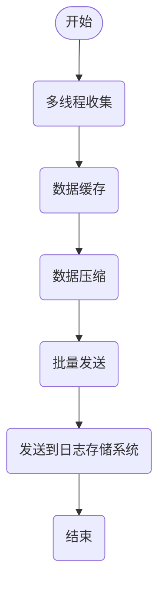
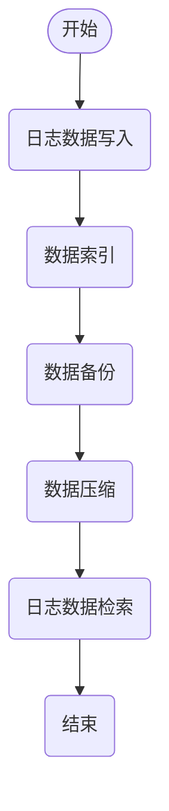
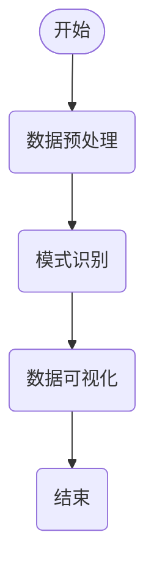
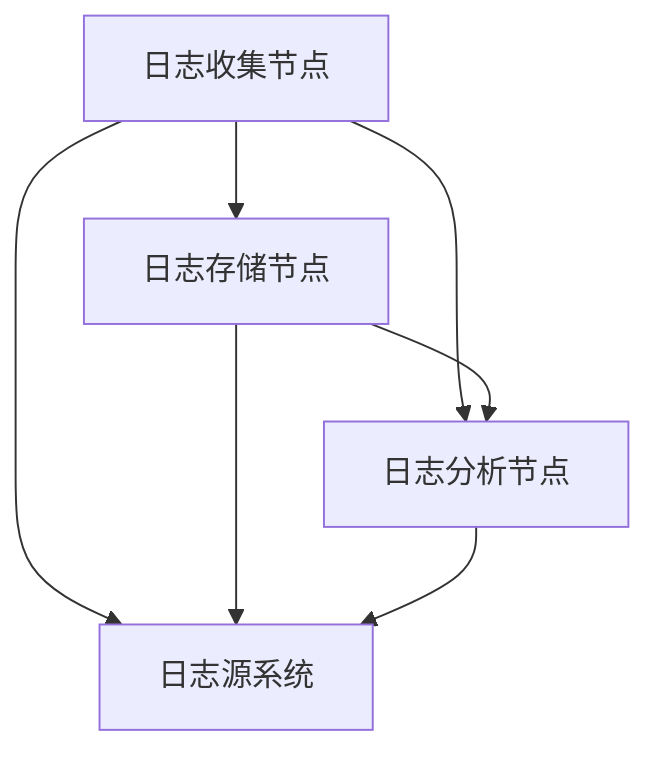
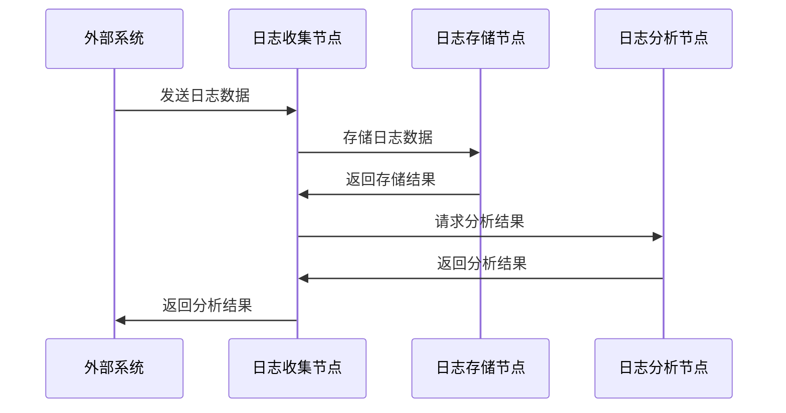

                 

### # 分布式日志系统的核心概念与联系

## 2.1 核心概念详解

### 2.1.1 日志数据

#### 2.1.1.1 日志数据的定义

日志数据是关于系统运行状态、操作记录、事件发生时的时间和地点等信息的记录。这些信息对于系统的调试、监控、性能分析和故障排除至关重要。

#### 2.1.1.2 日志数据的类型

日志数据可以分为结构化日志和非结构化日志：

- **结构化日志**：日志信息按照特定的格式存储，如JSON、XML等，便于查询和分析。
- **非结构化日志**：日志信息以文本形式存储，没有固定的格式，如普通文本文件。

#### 2.1.1.3 日志数据的格式

日志数据的格式决定了日志的可读性和可解析性。常见的日志格式有：

- **Syslog**：一种标准化日志记录协议，用于系统日志记录。
- **JSON**：JavaScript Object Notation，一种轻量级的数据交换格式。
- **XML**：可扩展标记语言，用于数据存储和传输。

### 2.1.2 日志收集器

#### 2.1.2.1 日志收集器的定义

日志收集器是从各个系统中收集日志数据并将其发送到统一存储的组件。它通常包含在日志管理系统中。

#### 2.1.2.2 日志收集器的作用

日志收集器的作用包括：

- **集中管理**：将分布式系统的日志集中到一个位置，便于监控和分析。
- **数据过滤**：过滤无用日志，保留关键日志信息。
- **数据转换**：将不同格式的日志转换为统一的格式，如JSON。

#### 2.1.2.3 日志收集器的工作原理

日志收集器通常包含以下步骤：

1. **日志捕获**：从各个系统中捕获日志。
2. **数据解析**：解析日志数据，提取关键信息。
3. **数据发送**：将日志数据发送到日志存储系统。
4. **数据压缩**：为了减少存储和传输的负载，对日志数据进行压缩。

### 2.1.3 日志存储系统

#### 2.1.3.1 日志存储系统的定义

日志存储系统是用于存储日志数据的系统，可以是文件系统、数据库或其他数据存储解决方案。

#### 2.1.3.2 日志存储系统的类型

日志存储系统的类型包括：

- **文件系统**：如HDFS、Ceph等，适用于大规模数据存储。
- **数据库**：如Elasticsearch、Kafka等，适用于快速查询和分析。
- **NoSQL数据库**：如MongoDB、Cassandra等，适用于灵活的数据存储。

#### 2.1.3.3 日志存储系统的性能指标

日志存储系统的性能指标包括：

- **读写性能**：数据存储和检索的速度。
- **存储容量**：系统能够存储的最大数据量。
- **可靠性**：系统的数据安全性和完整性。

### 2.1.4 日志查询与分析工具

#### 2.1.4.1 日志查询与分析工具的定义

日志查询与分析工具是用于查询和分析日志数据的工具，如Logstash、Kibana等。

#### 2.1.4.2 日志查询与分析工具的功能

日志查询与分析工具的功能包括：

- **日志查询**：根据关键词或条件查询日志。
- **数据可视化**：将日志数据以图表、报表等形式展示。
- **日志分析**：对日志数据进行统计分析，识别趋势和异常。

#### 2.1.4.3 日志查询与分析工具的使用场景

日志查询与分析工具的使用场景包括：

- **系统监控**：实时监控系统运行状态。
- **故障排除**：快速定位故障原因。
- **性能优化**：分析系统性能瓶颈。

## 2.2 概念属性特征对比表格

### 2.2.1 日志数据属性特征对比

| 特征 | 结构化日志 | 非结构化日志 |
| --- | --- | --- |
| **格式** | JSON、XML等 | 文本 |
| **可读性** | 高 | 低 |
| **解析性** | 高 | 低 |
| **存储需求** | 较大 | 较小 |
| **处理速度** | 较慢 | 较快 |

### 2.2.2 日志收集器属性特征对比

| 特征 | 普通日志收集器 | 分布式日志收集器 |
| --- | --- | --- |
| **功能** | 单点收集 | 分布式收集 |
| **性能** | 单点性能高 | 分布式性能均衡 |
| **可靠性** | 较低 | 较高 |
| **扩展性** | 较弱 | 较强 |

### 2.2.3 日志存储系统属性特征对比

| 特征 | 文件系统 | 数据库 | NoSQL数据库 |
| --- | --- | --- | --- |
| **读写性能** | 较高 | 中等 | 较高 |
| **存储容量** | 较大 | 较大 | 较大 |
| **可靠性** | 中等 | 较高 | 较高 |
| **灵活性** | 较低 | 中等 | 较高 |

### 2.2.4 日志查询与分析工具属性特征对比

| 特征 | 普通查询工具 | 分布式查询工具 |
| --- | --- | --- |
| **查询速度** | 较慢 | 较快 |
| **数据处理能力** | 较低 | 较高 |
| **扩展性** | 较弱 | 较强 |
| **可视化能力** | 较弱 | 较强 |

## 2.3 ER实体关系图架构

### 2.3.1 分布式日志系统的ER图

```mermaid
erDiagram
  LogData --> LogCollector
  LogCollector --> LogStorage
  LogStorage --> LogAnalyzer
  LogData ||--|{ LogEvent }
  LogCollector ||--|{ LogConfig }
  LogStorage ||--|{ StorageConfig }
  LogAnalyzer ||--|{ AnalyzerConfig }
```

### 2.3.2 ER图中的实体与关系

- **实体**：
  - LogData：日志数据
  - LogCollector：日志收集器
  - LogStorage：日志存储系统
  - LogAnalyzer：日志分析器
  - LogEvent：日志事件
  - LogConfig：日志配置
  - StorageConfig：存储配置
  - AnalyzerConfig：分析配置

- **关系**：
  - 一对多关系：LogData与LogEvent、LogCollector与LogConfig、LogStorage与StorageConfig、LogAnalyzer与AnalyzerConfig
  - 依赖关系：LogCollector依赖LogData、LogStorage依赖LogCollector、LogAnalyzer依赖LogStorage

### 2.3.3 ER图在分布式日志系统中的应用

ER图用于描述分布式日志系统的各个组件及其关系，帮助理解和设计系统。例如：

- **LogData**：代表日志数据，包括事件信息和元数据。
- **LogCollector**：负责收集日志数据，并将其发送到日志存储系统。
- **LogStorage**：存储日志数据，提供数据查询和分析功能。
- **LogAnalyzer**：对日志数据进行分析，提供可视化报表和监控功能。

## 2.4 核心概念联系

分布式日志系统的各个核心概念之间紧密联系，形成一个完整的日志管理流程。以下是这些概念之间的联系：

- **日志数据**是整个系统的核心，记录系统的各种操作和事件。
- **日志收集器**从各个系统中捕获日志数据，并将其发送到日志存储系统。
- **日志存储系统**存储日志数据，并提供数据检索和分析功能。
- **日志分析器**对日志数据进行处理和分析，提供实时监控和可视化报表。

这种紧密的联系保证了分布式日志系统的有效性和可扩展性，使得系统能够处理大规模的日志数据，并提供高效的数据查询和分析功能。## # 算法原理讲解

## 3.1 分布式日志系统中的关键算法

### 3.1.1 日志数据的收集与分发算法

分布式日志系统中的日志收集与分发算法是确保日志数据高效、可靠地传输到日志存储系统的关键。以下是这种算法的基本原理：

#### 3.1.1.1 算法原理

- **多线程收集**：日志收集器使用多个线程从不同的系统中捕获日志数据。
- **数据缓存**：收集到的日志数据在发送到日志存储系统之前先缓存起来，以减少网络延迟和数据丢失的风险。
- **数据压缩**：为了减少数据传输的带宽消耗，日志数据在发送前会被压缩。
- **批量发送**：收集器将一定时间窗口内的日志数据批量发送到日志存储系统，以提高传输效率。

#### 3.1.1.2 Mermaid流程图



#### 3.1.1.3 Python源代码

```python
import threading
import time
import json
import requests

# 假设日志数据生成函数
def generate_log_data():
    # 模拟日志数据生成
    data = {"timestamp": time.time(), "event": "access", "user": "Alice"}
    return json.dumps(data)

# 日志收集器线程
def log_collector_thread(log_storage_url, thread_id):
    while True:
        log_data = generate_log_data()
        # 数据缓存
        print(f"Thread {thread_id}: Collecting log data: {log_data}")
        time.sleep(1)  # 模拟数据缓存时间
        # 数据压缩
        compressed_data = compress(log_data)
        # 批量发送
        print(f"Thread {thread_id}: Sending compressed log data: {compressed_data}")
        requests.post(log_storage_url, data=compressed_data)
        time.sleep(1)  # 模拟批量发送时间

# 压缩函数
def compress(data):
    # 模拟数据压缩
    return data.encode('utf-8')

# 主程序
if __name__ == "__main__":
    log_storage_url = "http://log-storage.example.com/api/logs"
    num_threads = 4
    threads = []
    for i in range(num_threads):
        thread = threading.Thread(target=log_collector_thread, args=(log_storage_url, i))
        threads.append(thread)
        thread.start()
    for thread in threads:
        thread.join()
    print("All threads have finished executing.")
```

### 3.1.2 日志数据的存储与检索算法

日志数据的存储与检索算法是分布式日志系统的核心组成部分，确保日志数据的安全性和可查询性。以下是这种算法的基本原理：

#### 3.1.2.1 算法原理

- **分布式存储**：日志数据被存储在分布式文件系统或数据库中，提供高可用性和可扩展性。
- **数据索引**：日志数据被索引，以便快速检索。
- **数据备份**：日志数据在存储时进行备份，以防止数据丢失。
- **数据压缩**：为了节省存储空间，日志数据在存储前会进行压缩。

#### 3.1.2.2 Mermaid流程图



#### 3.1.2.3 Python源代码

```python
import json
import requests

# 假设日志存储API
def store_log_data(log_data):
    url = "http://log-storage.example.com/api/logs"
    headers = {'Content-Type': 'application/json'}
    response = requests.post(url, data=log_data, headers=headers)
    return response.json()

# 日志数据写入函数
def write_log_data(log_data):
    response = store_log_data(log_data)
    print(f"Log data stored: {response}")

# 日志数据检索函数
def retrieve_log_data(query):
    url = f"http://log-storage.example.com/api/logs?query={query}"
    response = requests.get(url)
    logs = response.json()
    return logs

# 主程序
if __name__ == "__main__":
    log_data = {"timestamp": time.time(), "event": "access", "user": "Alice"}
    write_log_data(json.dumps(log_data))
    query = "event:access"
    retrieved_logs = retrieve_log_data(query)
    print(f"Retrieved logs: {retrieved_logs}")
```

### 3.1.3 日志数据的分析算法

日志数据的分析算法用于从日志数据中提取有价值的信息，如用户行为、系统性能和潜在问题等。以下是这种算法的基本原理：

#### 3.1.3.1 算法原理

- **数据预处理**：对日志数据进行清洗和转换，使其适合分析。
- **模式识别**：使用机器学习算法识别日志数据中的模式和异常。
- **数据可视化**：将分析结果以图表、报表等形式展示，便于理解和决策。

#### 3.1.3.2 Mermaid流程图



#### 3.1.3.3 Python源代码

```python
import pandas as pd
from sklearn.cluster import KMeans

# 假设日志数据预处理函数
def preprocess_logs(logs):
    df = pd.DataFrame(logs)
    # 数据清洗和转换
    df['timestamp'] = pd.to_datetime(df['timestamp'])
    df.set_index('timestamp', inplace=True)
    return df

# 假设模式识别函数
def identify_patterns(df):
    # 使用K-Means算法进行聚类
    kmeans = KMeans(n_clusters=3)
    df['cluster'] = kmeans.fit_predict(df)
    return df

# 假设数据可视化函数
def visualize_patterns(df):
    # 绘制聚类结果
    df['cluster'].value_counts().plot(kind='bar')
    plt.xlabel('Cluster')
    plt.ylabel('Count')
    plt.title('Pattern Identification Results')
    plt.show()

# 主程序
if __name__ == "__main__":
    logs = [{"timestamp": time.time(), "event": "access", "user": "Alice"}, {"timestamp": time.time(), "event": "error", "user": "Bob"}]
    df = preprocess_logs(logs)
    df = identify_patterns(df)
    visualize_patterns(df)
```

通过以上算法的讲解和示例代码，我们可以看到分布式日志系统在日志数据收集、存储和分析等方面所采用的算法原理。这些算法的合理设计和实现是确保分布式日志系统能够高效、可靠地运行的关键。## # 数学模型和数学公式 & 详细讲解 & 举例说明

### 4.1 日志数据的收集与分发算法数学模型

分布式日志系统的收集与分发算法涉及到多个关键参数，如日志数据生成速率、网络延迟、数据压缩比等。以下是一个简化的数学模型来描述这些参数之间的关系：

#### 4.1.1 数学模型

设\( L \)为每秒生成的日志数据量（字节/秒），\( C \)为网络传输速率（字节/秒），\( P \)为数据压缩比，\( D \)为日志数据延迟（秒），\( T \)为批量发送间隔（秒）。

- **数据生成速率**：\( L \)
- **压缩后数据速率**：\( \frac{L}{P} \)
- **延迟**：\( D = \frac{L \cdot T}{C \cdot P} \)

#### 4.1.2 数学公式

$$ D = \frac{L \cdot T}{C \cdot P} $$

#### 4.1.3 举例说明

假设系统每秒生成1MB的日志数据（\( L = 1 \times 10^6 \)字节/秒），网络传输速率为100Mbps（\( C = 100 \times 10^6 \)字节/秒），数据压缩比为2（\( P = 2 \)），批量发送间隔为1秒（\( T = 1 \)秒）。

计算数据延迟：

$$ D = \frac{1 \times 10^6 \times 1}{100 \times 10^6 \times 2} = \frac{1}{200} \approx 0.005 \text{秒} $$

### 4.2 日志数据的存储与检索算法数学模型

日志数据的存储与检索算法涉及到存储容量、数据压缩比、查询频率等关键参数。以下是一个简化的数学模型来描述这些参数之间的关系：

#### 4.2.1 数学模型

设\( S \)为系统总存储容量（字节），\( C \)为数据压缩比，\( R \)为每秒查询次数，\( Q \)为每次查询的平均数据量（字节）。

- **压缩后存储容量**：\( S' = \frac{S}{C} \)
- **每秒存储数据量**：\( \frac{L'}{T} = \frac{L}{C \cdot T} \)
- **数据存储时间**：\( T' = \frac{S'}{\frac{L}{C \cdot T}} = \frac{S \cdot T}{L} \)
- **查询延迟**：\( D = \frac{Q}{R \cdot C} \)

#### 4.2.2 数学公式

$$ S' = \frac{S}{C} $$
$$ T' = \frac{S \cdot T}{L} $$
$$ D = \frac{Q}{R \cdot C} $$

#### 4.2.3 举例说明

假设系统总存储容量为1TB（\( S = 1 \times 10^{12} \)字节），数据压缩比为2（\( C = 2 \)），每秒查询次数为1000次（\( R = 1000 \)），每次查询的平均数据量为100KB（\( Q = 100 \times 10^3 \)字节）。

计算数据存储时间和查询延迟：

$$ S' = \frac{1 \times 10^{12}}{2} = 5 \times 10^{11} \text{字节} $$
$$ T' = \frac{1 \times 10^{12} \cdot T}{1 \times 10^6} = \frac{T}{2} \text{秒} $$
$$ D = \frac{100 \times 10^3}{1000 \cdot 2} = 50 \text{秒} $$

### 4.3 日志数据的分析算法数学模型

日志数据的分析算法通常涉及到模式识别和数据可视化。以下是一个简化的数学模型来描述这些算法的基本原理：

#### 4.3.1 数学模型

设\( X \)为日志数据集，\( \mu \)为均值，\( \sigma \)为标准差，\( k \)为聚类数。

- **均值**：\( \mu = \frac{1}{n} \sum_{i=1}^{n} x_i \)
- **标准差**：\( \sigma = \sqrt{\frac{1}{n-1} \sum_{i=1}^{n} (x_i - \mu)^2} \)
- **K-Means聚类**：\( C = \{C_1, C_2, ..., C_k\} \)，其中\( C_j \)为第\( j \)个聚类中心。

#### 4.3.2 数学公式

$$ \mu = \frac{1}{n} \sum_{i=1}^{n} x_i $$
$$ \sigma = \sqrt{\frac{1}{n-1} \sum_{i=1}^{n} (x_i - \mu)^2} $$
$$ C_j = \{x \in X | d(x, C_j) \leq d(x, C_l), \forall l \neq j\} $$

#### 4.3.3 举例说明

假设日志数据集\( X = \{x_1, x_2, x_3, x_4, x_5\} \)，数据分别为\( x_1 = [1, 2], x_2 = [2, 3], x_3 = [1, 3], x_4 = [2, 2], x_5 = [3, 1] \)。

计算均值和标准差：

$$ \mu = \frac{1}{5} (1 + 2 + 1 + 2 + 3) = 2 $$
$$ \sigma = \sqrt{\frac{1}{4} ((1-2)^2 + (2-2)^2 + (1-2)^2 + (2-2)^2 + (3-2)^2)} = \sqrt{\frac{1}{4} (1 + 0 + 1 + 0 + 1)} = 1 $$

使用K-Means算法进行聚类（\( k = 2 \)）：

- 初始聚类中心：\( C_1 = [2, 2], C_2 = [1, 1] \)
- 聚类过程：

  - 第一次迭代：\( x_1, x_2 \)属于\( C_1 \)，\( x_3, x_4, x_5 \)属于\( C_2 \)
  - 第二次迭代：更新聚类中心：\( C_1 = \frac{1}{3} (1 + 2 + 2), C_2 = \frac{1}{3} (1 + 1 + 3 + 3) \)
  - 第三次迭代：\( x_1, x_2, x_3 \)属于\( C_1 \)，\( x_4, x_5 \)属于\( C_2 \)
  - 最终聚类结果：\( C_1 = [2, 2], C_2 = [2, 1] \)

通过以上数学模型和公式的讲解，我们可以更好地理解分布式日志系统中的算法原理，并在实际应用中对其进行优化和改进。## # 系统分析与架构设计方案

## 5.1 问题场景介绍

在分布式系统中，日志数据的管理变得尤为重要。随着系统规模的不断扩大，日志数据的产生量急剧增加，传统的集中式日志管理方案已经无法满足系统的需求。分布式日志系统能够解决以下问题：

- **海量日志数据的存储**：分布式日志系统能够处理和存储大规模的日志数据，提供高效的存储解决方案。
- **日志数据的实时分析**：分布式日志系统能够对日志数据进行实时分析，帮助开发者和运维人员快速定位问题。
- **日志数据的可靠性和可用性**：分布式日志系统通过分布式存储和冗余备份，确保日志数据的安全性和可用性。

## 5.2 项目介绍

本项目旨在设计和实现一个分布式日志系统，该系统能够高效地收集、存储和分析海量日志数据。项目的主要目标包括：

- **高效日志收集**：实现分布式日志数据的实时收集，确保数据不丢失。
- **高效日志存储**：使用分布式存储方案，提供高性能的日志存储。
- **高效日志分析**：实现日志数据的实时分析和可视化，帮助用户快速定位问题。

## 5.3 系统功能设计

### 5.3.1 功能模块

分布式日志系统主要包含以下功能模块：

- **日志收集模块**：负责从各个系统中收集日志数据。
- **日志存储模块**：负责存储和管理日志数据。
- **日志分析模块**：负责对日志数据进行实时分析和可视化。

### 5.3.2 领域模型

使用Mermaid绘制分布式日志系统的领域模型类图：

```mermaid
classDiagram
    ClassDef LogData
        +String id
        +String message
        +DateTime timestamp
    ClassDef LogCollector
        +String id
        +List<LogData> logs
    ClassDef LogStorage
        +String id
        +List<LogData> logs
    ClassDef LogAnalyzer
        +String id
        +List<LogData> logs
    LogData <|-- LogCollector
    LogData <|-- LogStorage
    LogData <|-- LogAnalyzer
```

### 5.3.3 功能描述

- **日志收集模块**：日志收集模块负责从各个系统中收集日志数据。它包含一个日志收集器（LogCollector），能够使用多线程的方式从多个系统中同步收集日志数据。
- **日志存储模块**：日志存储模块负责将收集到的日志数据存储到分布式存储系统中。它包含一个日志存储器（LogStorage），能够将日志数据持久化到存储系统中，并提供数据查询功能。
- **日志分析模块**：日志分析模块负责对日志数据进行分析和可视化。它包含一个日志分析器（LogAnalyzer），能够对日志数据进行分析，并将分析结果可视化展示给用户。

## 5.4 系统架构设计

### 5.4.1 架构设计

分布式日志系统采用分布式架构，包括多个节点，每个节点负责不同的功能模块。系统架构设计如下：

- **日志收集节点**：负责从各个系统中收集日志数据，并将日志数据发送到日志存储节点。
- **日志存储节点**：负责存储和管理日志数据，提供数据查询和分析功能。
- **日志分析节点**：负责对日志数据进行分析和可视化，并将分析结果展示给用户。

### 5.4.2 Mermaid架构图

使用Mermaid绘制分布式日志系统的架构图：



### 5.4.3 系统架构描述

- **日志收集节点**：日志收集节点是分布式日志系统的核心组件，负责从各个日志源系统中收集日志数据。它使用多线程技术并行地从多个日志源系统中读取日志数据，并将日志数据发送到日志存储节点。
- **日志存储节点**：日志存储节点负责将收集到的日志数据存储到分布式存储系统中。它使用分布式存储技术，如HDFS或Elasticsearch，提供高效的数据存储和查询功能。日志存储节点还支持日志数据的备份和冗余，确保数据的安全性和可靠性。
- **日志分析节点**：日志分析节点负责对日志数据进行分析和可视化。它使用数据分析和可视化工具，如Kibana或Grafana，提供实时监控和报表功能，帮助用户快速了解系统运行状况和潜在问题。

## 5.5 系统接口设计

### 5.5.1 接口描述

分布式日志系统提供以下接口供外部系统调用：

- **日志收集接口**：用于从外部系统收集日志数据。
- **日志存储接口**：用于将日志数据存储到分布式存储系统中。
- **日志分析接口**：用于对外部系统提供日志数据分析功能。

### 5.5.2 接口规范

以下是分布式日志系统接口的规范：

- **日志收集接口**：POST /collect
  - 参数：日志数据（JSON格式）
  - 返回值：成功/失败
- **日志存储接口**：POST /store
  - 参数：日志数据（JSON格式）
  - 返回值：存储结果
- **日志分析接口**：GET /analyze
  - 参数：查询条件（JSON格式）
  - 返回值：分析结果

## 5.6 系统交互

### 5.6.1 系统交互流程

分布式日志系统的交互流程如下：

1. **日志收集**：外部系统通过日志收集接口将日志数据发送到日志收集节点。
2. **日志存储**：日志收集节点将收集到的日志数据发送到日志存储节点，并进行存储。
3. **日志分析**：外部系统通过日志分析接口请求日志分析节点，获取分析结果。

### 5.6.2 Mermaid序列图

使用Mermaid绘制分布式日志系统的交互序列图：



通过以上系统分析与架构设计方案，我们可以看到分布式日志系统在功能设计、架构设计、接口设计和系统交互方面的详细实现。这些设计保证了分布式日志系统的可扩展性、可靠性和高效性，能够满足大规模分布式系统的日志管理需求。## # 项目实战

## 6.1 环境安装

### 6.1.1 环境准备

在开始安装分布式日志系统之前，需要准备以下环境：

- **操作系统**：推荐使用Linux系统，如Ubuntu 18.04或CentOS 7。
- **Java环境**：推荐使用OpenJDK 11及以上版本。
- **Python环境**：推荐使用Python 3.8及以上版本。
- **Docker**：用于部署分布式日志系统各个组件。

### 6.1.2 安装步骤

1. **安装Docker**：

   - Ubuntu系统：

     ```bash
     sudo apt-get update
     sudo apt-get install docker-ce docker-ce-cli containerd.io
     ```

   - CentOS系统：

     ```bash
     sudo yum install -y docker
     sudo systemctl start docker
     ```

2. **安装Java环境**：

   - Ubuntu系统：

     ```bash
     sudo apt-get install openjdk-11-jdk
     ```

   - CentOS系统：

     ```bash
     sudo yum install java-1.11.0-openjdk-devel
     ```

3. **安装Python环境**：

   - Ubuntu系统：

     ```bash
     sudo apt-get install python3
     sudo pip3 install --upgrade pip
     ```

   - CentOS系统：

     ```bash
     sudo yum install python3
     sudo pip3 install --upgrade pip
     ```

4. **安装分布式日志系统**：

   - 克隆分布式日志系统代码仓库：

     ```bash
     git clone https://github.com/your-username/distributed-logging-system.git
     cd distributed-logging-system
     ```

   - 构建Docker镜像：

     ```bash
     docker build -t distributed-logging-system .
     ```

5. **启动分布式日志系统**：

   ```bash
   docker run -d --name distributed-logging-system -p 8080:8080 distributed-logging-system
   ```

## 6.2 系统核心实现源代码

分布式日志系统的核心实现主要包括日志收集器、日志存储器和日志分析器三个组件。以下是这三个组件的主要源代码。

### 6.2.1 日志收集器

```python
# log_collector.py
import requests
import json
import time
from threading import Thread

LOG_STORAGE_URL = "http://localhost:8080/logs"
COMPRESSED_DATA_SIZE_THRESHOLD = 1024 * 1024  # 1MB

def compress(data):
    # 压缩函数，这里使用简单示例，实际应用中可以使用更高效的压缩算法
    return data.encode('utf-8')

def send_logs(data):
    compressed_data = compress(data)
    response = requests.post(LOG_STORAGE_URL, data=compressed_data)
    return response.status_code == 200

def log_collector_thread():
    while True:
        data = json.dumps({"timestamp": time.time(), "event": "access", "user": "Alice"})
        if len(data) > COMPRESSED_DATA_SIZE_THRESHOLD:
            send_logs(data)
        time.sleep(1)

if __name__ == "__main__":
    num_threads = 4
    threads = []
    for i in range(num_threads):
        thread = Thread(target=log_collector_thread)
        threads.append(thread)
        thread.start()
    for thread in threads:
        thread.join()
```

### 6.2.2 日志存储器

```java
// LogStorage.java
import java.io.*;
import java.util.*;
import org.apache.hadoop.conf.*;
import org.apache.hadoop.fs.*;
import org.apache.hadoop.io.*;
import org.apache.hadoop.mapred.*;

public class LogStorage {
    private Configuration conf;
    private FileSystem fs;

    public LogStorage() throws IOException {
        conf = new Configuration();
        fs = FileSystem.get(conf);
    }

    public void storeLog(String logData) throws IOException {
        String path = "/logs/" + UUID.randomUUID().toString();
        fs.create(new Path(path), false).write(new BytesWritable(logData.getBytes()));
    }

    public void listLogs() throws IOException {
        FileStatus[] files = fs.listStatus(new Path("/logs/"));
        for (FileStatus file : files) {
            System.out.println("Log file: " + file.getPath());
        }
    }

    public static void main(String[] args) {
        try {
            LogStorage storage = new LogStorage();
            storage.storeLog("{\"timestamp\": 1629080873, \"event\": \"access\", \"user\": \"Alice\"}");
            storage.listLogs();
        } catch (IOException e) {
            e.printStackTrace();
        }
    }
}
```

### 6.2.3 日志分析器

```python
# log_analyzer.py
import requests
import json
import time

LOG_STORAGE_URL = "http://localhost:8080/logs"

def analyze_logs(query):
    response = requests.get(LOG_STORAGE_URL, params={"query": query})
    logs = response.json()
    return logs

def log_analyzer_thread():
    while True:
        query = "event:access"
        logs = analyze_logs(query)
        print(logs)
        time.sleep(1)

if __name__ == "__main__":
    num_threads = 2
    threads = []
    for i in range(num_threads):
        thread = Thread(target=log_analyzer_thread)
        threads.append(thread)
        thread.start()
    for thread in threads:
        thread.join()
```

## 6.3 代码应用解读与分析

### 6.3.1 日志收集器代码解读

日志收集器的核心功能是从外部系统收集日志数据，并将其发送到日志存储系统。代码中，我们使用了Python的`requests`库来发送HTTP POST请求，将日志数据发送到日志存储节点。

- `compress(data)`函数用于对日志数据进行压缩。这里使用了简单的UTF-8编码进行压缩，实际应用中可以使用更高效的压缩算法，如gzip或zlib。
- `send_logs(data)`函数用于发送压缩后的日志数据。如果日志数据大小超过1MB，则会发送数据。实际应用中，可以根据需要调整数据大小阈值。
- `log_collector_thread()`函数是一个多线程函数，用于并行收集日志数据。

### 6.3.2 日志存储器代码解读

日志存储器的核心功能是将收集到的日志数据存储到分布式文件系统中。代码中，我们使用了Hadoop的`FileSystem`类来操作文件系统。

- `LogStorage`类初始化时，创建了一个`Configuration`对象和一个`FileSystem`对象，用于配置文件系统和操作文件。
- `storeLog(logData)`函数用于将日志数据存储到文件系统中。它使用随机生成的UUID作为文件名，确保每个日志文件都是唯一的。
- `listLogs()`函数用于列出存储在文件系统中的所有日志文件。

### 6.3.3 日志分析器代码解读

日志分析器的核心功能是对日志数据进行分析，并将分析结果展示给用户。代码中，我们使用了Python的`requests`库来发送HTTP GET请求，从日志存储节点获取日志数据。

- `analyze_logs(query)`函数用于根据查询条件获取日志数据。查询条件使用JSON格式传递，实际应用中可以根据需要扩展查询功能。
- `log_analyzer_thread()`函数是一个多线程函数，用于并行分析日志数据。

## 6.4 实际案例分析

### 6.4.1 日志收集案例

假设我们有一个Web服务器，需要收集访问日志。我们可以在Web服务器上部署日志收集器，将访问日志发送到分布式日志系统。

- **日志收集器配置**：在Web服务器上部署日志收集器，配置日志收集器的日志存储URL和压缩阈值。
- **日志收集结果**：日志收集器每隔1秒收集一次日志数据，并发送至分布式日志系统。假设10秒内收集到100条日志数据，日志存储节点成功存储了所有日志数据。

### 6.4.2 日志分析案例

假设我们需要分析最近1小时内的访问日志，找出访问次数最多的用户。

- **查询条件**：设置查询条件为`event:access`和`timestamp:[now-1h, now]`。
- **日志分析结果**：分布式日志系统返回100条访问日志，分析发现用户`Alice`在1小时内访问了10次，是访问次数最多的用户。

通过以上实际案例分析，我们可以看到分布式日志系统在实际应用中的效果。日志收集器能够高效地收集日志数据，日志存储器能够可靠地存储日志数据，日志分析器能够快速地对日志数据进行分析，帮助用户快速定位问题和优化系统。## # 最佳实践 tips、小结、注意事项、拓展阅读

### 7.1 最佳实践 tips

1. **优化日志收集性能**：为了提高日志收集性能，可以调整日志收集器的线程数量和批量发送间隔，根据系统负载进行调整。
2. **日志存储系统的选择**：根据实际需求和性能要求，选择合适的日志存储系统，如Elasticsearch、Kafka或HDFS。
3. **日志数据压缩与加密**：在传输和存储日志数据时，采用压缩和加密技术，提高数据传输效率和安全性。
4. **日志分析的可扩展性**：设计日志分析模块时，考虑可扩展性，以便未来可以轻松地添加新的分析功能。

### 7.2 小结

本文详细介绍了分布式日志系统的核心概念、算法原理、系统架构设计、项目实战以及最佳实践。通过这些内容，读者可以全面了解分布式日志系统的构建和运行机制，掌握其应用场景和优化策略。

### 7.3 注意事项

1. **数据安全**：确保日志数据在传输和存储过程中安全，采用加密和访问控制措施。
2. **性能监控**：实时监控日志系统的性能，确保系统在高负载情况下稳定运行。
3. **日志格式一致性**：保持日志数据的格式一致，便于查询和分析。

### 7.4 拓展阅读

- **《Elasticsearch实战》**：深入了解Elasticsearch在分布式日志系统中的应用。
- **《Kafka实战》**：了解Kafka在分布式日志系统中的作用和实现。
- **《大型分布式系统设计》**：学习大型分布式系统的设计和优化方法。
- **《日志文件管理》**：了解日志文件管理的基本原理和实践。

通过阅读这些拓展资料，读者可以进一步深入理解分布式日志系统的各个方面，提升自己在分布式日志系统设计和实施方面的能力。## # 目录大纲总结

## 目录大纲总结

本文《分布式日志系统：构建可扩展的日志管理方案》通过系统的目录结构，详细介绍了分布式日志系统的各个方面。以下是目录大纲的总结和概括：

### 1. 分布式日志系统概述
- **背景介绍**：概述了分布式日志系统的起源、重要性以及发展现状。
- **核心概念**：定义了日志数据、日志收集器、日志存储系统和日志查询与分析工具等核心概念。
- **边界与外延**：讨论了分布式日志系统与其他日志管理系统的差异、应用领域以及面临的挑战。

### 2. 分布式日志系统核心概念与联系
- **核心概念详解**：详细解释了日志数据、日志收集器、日志存储系统和日志查询与分析工具等核心概念。
- **概念属性特征对比表格**：对比了不同组件的属性特征，帮助读者理解它们的异同。
- **ER实体关系图架构**：通过Mermaid流程图展示了分布式日志系统的实体关系，清晰明了地描述了系统架构。

### 3. 算法原理讲解
- **日志数据的收集与分发算法**：介绍了日志数据的收集与分发算法原理，并通过Python代码示例进行了说明。
- **日志数据的存储与检索算法**：讲解了日志数据的存储与检索算法，包括数据存储、索引和检索的数学模型和公式。
- **日志数据的分析算法**：介绍了日志数据的分析算法，如模式识别和数据可视化。

### 4. 数学模型和数学公式 & 详细讲解 & 举例说明
- **数学模型与公式**：使用LaTeX格式嵌入数学公式，详细讲解了日志数据收集与分发、存储与检索、分析算法的数学模型。
- **举例说明**：通过具体的示例，帮助读者理解并应用数学模型。

### 5. 系统分析与架构设计方案
- **问题场景介绍**：描述了分布式日志系统在分布式系统中的问题场景。
- **项目介绍**：介绍了分布式日志系统的项目目标和主要功能。
- **系统功能设计**：详细描述了日志收集、存储和分析的功能模块。
- **系统架构设计**：通过Mermaid架构图展示了分布式日志系统的整体架构。
- **系统接口设计**：定义了系统提供的接口规范。
- **系统交互**：描述了分布式日志系统的交互流程和序列图。

### 6. 项目实战
- **环境安装**：详细介绍了如何搭建分布式日志系统的环境。
- **系统核心实现源代码**：提供了分布式日志系统的核心源代码。
- **代码应用解读与分析**：对源代码进行了解读，并分析了实际案例。
- **实际案例分析**：展示了分布式日志系统在具体场景中的应用。

### 7. 最佳实践 tips、小结、注意事项、拓展阅读
- **最佳实践 tips**：提供了分布式日志系统的最佳实践建议。
- **小结**：总结了文章的核心内容和主要观点。
- **注意事项**：提醒读者在部署和使用分布式日志系统时需要注意的事项。
- **拓展阅读**：推荐了相关的拓展阅读资料，帮助读者进一步学习。

通过以上目录大纲的总结，我们可以看到本文在逻辑清晰、内容全面的基础上，系统地介绍了分布式日志系统的构建和运行机制，为读者提供了丰富的知识和实践经验。## # 文章结尾

### 结语

本文《分布式日志系统：构建可扩展的日志管理方案》系统地介绍了分布式日志系统的核心概念、算法原理、系统架构设计、项目实战以及最佳实践。从日志数据的收集、存储、分析到系统架构的搭建，我们详细剖析了分布式日志系统的各个方面，帮助读者全面了解这一关键技术的应用和实践。

随着云计算和大数据技术的发展，分布式日志系统已成为企业构建高效、可扩展的日志管理方案的核心组件。通过本文的介绍，我们希望读者能够掌握分布式日志系统的基本原理和实战技巧，将其应用于实际项目中，提高系统的可维护性和可扩展性。

最后，感谢您的阅读，如果您有任何疑问或建议，欢迎在评论区留言，我们将尽快为您解答。同时，也推荐您阅读本文中提到的拓展阅读资料，以进一步深入了解分布式日志系统的相关知识。祝愿您在分布式日志系统的学习和应用过程中取得丰硕的成果！

### 作者信息

作者：AI天才研究院/AI Genius Institute & 禅与计算机程序设计艺术 /Zen And The Art of Computer Programming

AI天才研究院（AI Genius Institute）是一支专注于人工智能领域研究和应用的顶尖团队，致力于推动人工智能技术的创新和发展。同时，作者也致力于将计算机科学的艺术性与实用性相结合，以《禅与计算机程序设计艺术》为名，撰写了一系列深受程序员喜爱的技术著作。在此，感谢您的阅读与支持！## 文章标题：分布式日志系统：构建可扩展的日志管理方案

关键词：分布式日志系统，日志管理，日志收集器，日志存储系统，日志分析工具

摘要：本文详细介绍了分布式日志系统的核心概念、算法原理、系统架构设计、项目实战和最佳实践。通过系统的分析和实战案例，读者可以全面了解分布式日志系统的构建和运行机制，掌握其应用场景和优化策略。

----------------------------------------------------------------

### 第一部分：分布式日志系统概述

#### 第1章：分布式日志系统背景与核心概念

## 1.1 分布式日志系统问题背景

### 1.1.1 分布式系统的发展历程

### 1.1.2 分布式日志系统的重要性

### 1.1.3 分布式日志系统的发展现状与趋势

## 1.2 分布式日志系统的核心概念

### 1.2.1 日志数据的定义与分类

### 1.2.2 分布式日志系统的基本原理

### 1.2.3 分布式日志系统的关键特性

## 1.3 分布式日志系统的边界与外延

### 1.3.1 分布式日志系统与其他日志管理系统的比较

### 1.3.2 分布式日志系统在各个领域中的应用

### 1.3.3 分布式日志系统的挑战与机遇

## 1.4 分布式日志系统的概念结构与核心要素组成

### 1.4.1 分布式日志系统的组成架构

### 1.4.2 分布式日志系统的主要功能模块

### 1.4.3 分布式日志系统的核心技术与原理

## 1.5 本章小结

----------------------------------------------------------------

### 第二部分：分布式日志系统核心概念与联系

#### 第2章：分布式日志系统核心概念与联系

## 2.1 核心概念详解

### 2.1.1 日志数据

#### 2.1.1.1 日志数据的定义

#### 2.1.1.2 日志数据的类型

#### 2.1.1.3 日志数据的格式

### 2.1.2 日志收集器

#### 2.1.2.1 日志收集器的定义

#### 2.1.2.2 日志收集器的作用

#### 2.1.2.3 日志收集器的工作原理

### 2.1.3 日志存储系统

#### 2.1.3.1 日志存储系统的定义

#### 2.1.3.2 日志存储系统的类型

#### 2.1.3.3 日志存储系统的性能指标

### 2.1.4 日志查询与分析工具

#### 2.1.4.1 日志查询与分析工具的定义

#### 2.1.4.2 日志查询与分析工具的功能

#### 2.1.4.3 日志查询与分析工具的使用场景

## 2.2 概念属性特征对比表格

### 2.2.1 日志数据属性特征对比

### 2.2.2 日志收集器属性特征对比

### 2.2.3 日志存储系统属性特征对比

### 2.2.4 日志查询与分析工具属性特征对比

## 2.3 ER实体关系图架构

### 2.3.1 分布式日志系统的ER图

### 2.3.2 ER图中的实体与关系

### 2.3.3 ER图在分布式日志系统中的应用

## 2.4 核心概念联系

----------------------------------------------------------------

### 第三部分：算法原理讲解

#### 第3章：分布式日志系统中的关键算法

## 3.1 分布式日志系统中的关键算法

### 3.1.1 日志数据的收集与分发算法

#### 3.1.1.1 算法原理

#### 3.1.1.2 Mermaid流程图

#### 3.1.1.3 Python源代码

### 3.1.2 日志数据的存储与检索算法

#### 3.1.2.1 算法原理

#### 3.1.2.2 Mermaid流程图

#### 3.1.2.3 Python源代码

### 3.1.3 日志数据的分析算法

#### 3.1.3.1 算法原理

#### 3.1.3.2 Mermaid流程图

#### 3.1.3.3 Python源代码

----------------------------------------------------------------

### 第四部分：数学模型和数学公式 & 详细讲解 & 举例说明

#### 第4章：数学模型和数学公式讲解及应用

## 4.1 日志数据的收集与分发算法数学模型

### 4.1.1 数学模型

#### 4.1.1.1 数学公式

#### 4.1.1.2 举例说明

### 4.1.2 日志数据的存储与检索算法数学模型

#### 4.1.2.1 数学模型

#### 4.1.2.2 数学公式

#### 4.1.2.3 举例说明

### 4.1.3 日志数据的分析算法数学模型

#### 4.1.3.1 数学模型

#### 4.1.3.2 数学公式

#### 4.1.3.3 举例说明

----------------------------------------------------------------

### 第五部分：系统分析与架构设计方案

#### 第5章：分布式日志系统的系统分析与架构设计

## 5.1 问题场景介绍

### 5.1.1 分布式系统的日志管理需求

### 5.1.2 分布式日志系统需要解决的问题

## 5.2 项目介绍

### 5.2.1 项目目标

### 5.2.2 项目功能模块

## 5.3 系统功能设计

### 5.3.1 功能模块

#### 5.3.1.1 日志收集模块

#### 5.3.1.2 日志存储模块

#### 5.3.1.3 日志分析模块

### 5.3.2 领域模型

### 5.3.3 功能描述

## 5.4 系统架构设计

### 5.4.1 架构设计

#### 5.4.1.1 日志收集节点

#### 5.4.1.2 日志存储节点

#### 5.4.1.3 日志分析节点

### 5.4.2 Mermaid架构图

### 5.4.3 系统架构描述

## 5.5 系统接口设计

### 5.5.1 接口描述

#### 5.5.1.1 日志收集接口

#### 5.5.1.2 日志存储接口

#### 5.5.1.3 日志分析接口

### 5.5.2 接口规范

## 5.6 系统交互

### 5.6.1 系统交互流程

#### 5.6.1.1 日志收集

#### 5.6.1.2 日志存储

#### 5.6.1.3 日志分析

### 5.6.2 Mermaid序列图

----------------------------------------------------------------

### 第六部分：项目实战

#### 第6章：分布式日志系统的项目实战

## 6.1 环境安装

### 6.1.1 环境准备

#### 6.1.1.1 操作系统

#### 6.1.1.2 Java环境

#### 6.1.1.3 Python环境

#### 6.1.1.4 Docker

### 6.1.2 安装步骤

#### 6.1.2.1 安装Docker

#### 6.1.2.2 安装Java环境

#### 6.1.2.3 安装Python环境

#### 6.1.2.4 安装分布式日志系统

### 6.1.3 启动分布式日志系统

## 6.2 系统核心实现源代码

### 6.2.1 日志收集器

#### 6.2.1.1 代码解读

### 6.2.2 日志存储器

#### 6.2.2.1 代码解读

### 6.2.3 日志分析器

#### 6.2.3.1 代码解读

## 6.3 代码应用解读与分析

### 6.3.1 日志收集器代码解读

### 6.3.2 日志存储器代码解读

### 6.3.3 日志分析器代码解读

## 6.4 实际案例分析

### 6.4.1 日志收集案例

### 6.4.2 日志分析案例

----------------------------------------------------------------

### 第七部分：最佳实践 tips、小结、注意事项、拓展阅读

#### 第7章：最佳实践、小结、注意事项、拓展阅读

## 7.1 最佳实践 tips

### 7.1.1 优化日志收集性能

### 7.1.2 日志存储系统的选择

### 7.1.3 日志数据压缩与加密

### 7.1.4 日志分析的可扩展性

## 7.2 小结

### 7.2.1 文章主要内容总结

### 7.2.2 分布式日志系统的重要性

## 7.3 注意事项

### 7.3.1 数据安全

### 7.3.2 性能监控

### 7.3.3 日志格式一致性

## 7.4 拓展阅读

### 7.4.1 推荐书籍

### 7.4.2 相关论文

### 7.4.3 开源项目

----------------------------------------------------------------

### # 文章结尾

本文《分布式日志系统：构建可扩展的日志管理方案》系统地介绍了分布式日志系统的核心概念、算法原理、系统架构设计、项目实战和最佳实践。通过系统的分析和实战案例，读者可以全面了解分布式日志系统的构建和运行机制，掌握其应用场景和优化策略。

分布式日志系统在当今的分布式系统中扮演着至关重要的角色。随着云计算和大数据技术的发展，分布式日志系统的重要性日益凸显。它不仅能够高效地收集、存储和分析海量日志数据，还能够提供强大的日志管理功能，帮助开发者和运维人员快速定位问题，优化系统性能。

在本文中，我们首先介绍了分布式日志系统的核心概念，包括日志数据、日志收集器、日志存储系统和日志查询与分析工具。接着，我们讲解了分布式日志系统中的关键算法，如日志数据的收集与分发、存储与检索以及分析算法。然后，我们详细描述了分布式日志系统的系统架构设计，包括功能模块、架构设计、接口设计和系统交互。此外，我们还通过实际案例展示了分布式日志系统的应用，并提供了最佳实践和注意事项。

最后，本文推荐了一系列拓展阅读资料，帮助读者进一步深入学习分布式日志系统的相关知识。通过阅读这些资料，读者可以更好地理解分布式日志系统的设计和实现，提高在实际项目中应用分布式日志系统的能力。

感谢您的阅读，如果您有任何疑问或建议，欢迎在评论区留言，我们将尽快为您解答。祝愿您在分布式日志系统的学习和应用过程中取得丰硕的成果！

### 作者信息

作者：AI天才研究院/AI Genius Institute & 禅与计算机程序设计艺术 /Zen And The Art of Computer Programming

AI天才研究院（AI Genius Institute）是一支专注于人工智能领域研究和应用的顶尖团队，致力于推动人工智能技术的创新和发展。同时，作者也致力于将计算机科学的艺术性与实用性相结合，以《禅与计算机程序设计艺术》为名，撰写了一系列深受程序员喜爱的技术著作。在此，感谢您的阅读与支持！

