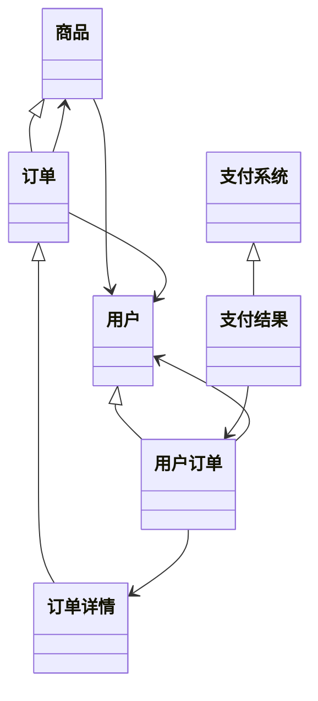
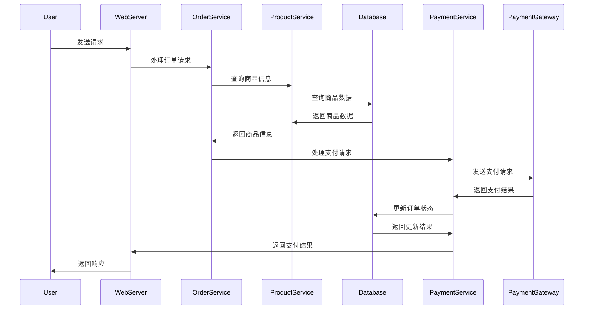
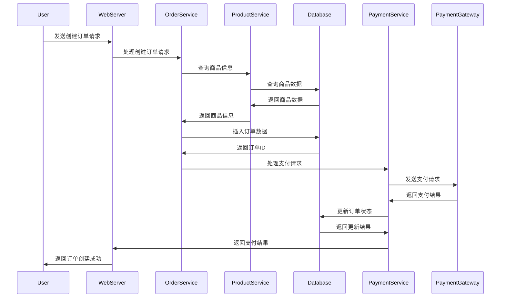

                 

# 分布式系统设计原则与实践

## 关键词

- 分布式系统
- 设计原则
- 实践案例
- 高可用性
- 可伸缩性
- 分区容忍性

## 摘要

本文将深入探讨分布式系统设计的原则与实践。我们将从核心概念出发，逐步介绍一致性模型、分布式存储和分布式计算等关键要素，并结合实际案例展示分布式系统的应用和实现方法。通过本文的学习，读者将能够掌握分布式系统设计的关键技巧，为实际项目中的系统性能和可靠性提供有力支持。

## 第一部分：引言

### 1.1 问题背景

随着互联网和云计算的飞速发展，分布式系统已成为现代软件开发的关键组成部分。分布式系统具有高可用性、可伸缩性和容错性，能够应对大规模、复杂的应用场景。然而，分布式系统设计复杂，涉及到多个层面的技术细节和设计原则。如何合理地设计分布式系统，确保其性能和可靠性，成为软件开发者面临的重要挑战。

### 1.2 问题描述

本部分将介绍分布式系统的设计原则和实践，旨在帮助读者理解分布式系统的核心概念、技术原理和设计模式。通过对分布式系统的深入探讨，读者将能够掌握分布式系统设计的关键要素，学会在实际项目中应用分布式系统技术，解决实际问题。

### 1.3 问题解决

本书将从以下几个方面展开：

- **核心概念**：介绍分布式系统的基础概念，包括一致性模型、分布式存储、分布式计算等。
- **设计原则**：讨论分布式系统设计的重要原则，如CAP定理、一致性、可用性、分区容忍性等。
- **技术原理**：深入讲解分布式系统的关键技术，如分布式锁、分布式事务、分布式缓存等。
- **设计模式**：介绍分布式系统的常见设计模式，如去中心化、联邦化、状态机等。
- **实践案例**：通过具体案例，展示分布式系统在现实中的应用和实现方法。

### 1.4 边界与外延

本书主要面向软件开发者，要求读者具备一定的计算机基础知识，特别是计算机网络和操作系统方面的知识。同时，本书涵盖的分布式系统设计原则和实践是通用的，适用于各种分布式系统应用场景。

### 1.5 概念结构与核心要素组成

- **分布式系统**：由多个节点组成，通过计算机网络相互通信和协作的系统。
- **一致性模型**：描述分布式系统中数据一致性的模型，如强一致性、最终一致性等。
- **分布式存储**：分布式系统中数据存储的方式，如分布式数据库、NoSQL数据库等。
- **分布式计算**：分布式系统中任务分配和执行的方式，如MapReduce、分布式流处理等。
- **设计原则**：分布式系统设计的基本准则，如CAP定理、一致性、可用性、分区容忍性等。

### 1.6 本章小结

本章简要介绍了分布式系统设计的背景、问题描述、问题解决、边界与外延以及概念结构与核心要素组成。下一章将深入探讨分布式系统的核心概念，包括一致性模型、分布式存储和分布式计算等方面的内容。通过对本章的学习，读者将初步了解分布式系统设计的基本框架和关键要素。

## 第二部分：核心概念

### 2.1 一致性模型

#### 2.1.1 强一致性和最终一致性

一致性模型是分布式系统中数据一致性的描述，根据一致性要求的不同，可以分为强一致性和最终一致性等。了解一致性模型对于设计分布式系统至关重要。

- **强一致性**：系统在任何时刻都能访问到最新数据，但可能会牺牲可用性和分区容忍性。
- **最终一致性**：系统在一定时间后能够达到一致性，但允许临时性的不一致现象。

#### 2.1.2 一致性模型对比

| 一致性模型 | 定义 | 优缺点 |  
| --- | --- | --- |  
| 强一致性 | 系统在任何时刻都能访问到最新数据 | 确保数据一致性，但可能导致系统可用性下降 |  
| 最终一致性 | 系统在一定时间后能够达到一致性 | 提高系统可用性和分区容忍性，但可能存在数据不一致现象 |

### 2.2 分布式存储

#### 2.2.1 分布式数据库

分布式数据库通过将数据分布在多个节点上，提供高可用性和容错性。常见的分布式数据库技术包括Hadoop HBase、MongoDB等。

- **Hadoop HBase**：基于Hadoop的分布式数据库，适用于大规模数据的存储和处理。
- **MongoDB**：分布式文档数据库，提供高性能和可伸缩性。

#### 2.2.2 NoSQL数据库

NoSQL数据库提供高性能和可伸缩性，适用于大规模数据的存储和管理。常见的NoSQL数据库技术包括Cassandra、Redis等。

- **Cassandra**：分布式键值存储数据库，提供高可用性和分区容忍性。
- **Redis**：高性能的内存缓存数据库，适用于实时数据处理。

### 2.3 分布式计算

#### 2.3.1 MapReduce

MapReduce是一种基于Hadoop的分布式计算模型，适用于大规模数据的处理和分析。MapReduce将任务分为Map和Reduce两个阶段，实现并行处理。

- **Map**：将输入数据分组并处理，生成中间结果。
- **Reduce**：对中间结果进行汇总和计算，生成最终结果。

#### 2.3.2 分布式流处理

分布式流处理通过实时处理数据流，提供低延迟和高吞吐量的数据处理能力。常见的分布式流处理技术包括Apache Storm、Apache Kafka等。

- **Apache Storm**：实时分布式流处理框架，适用于复杂的数据流处理场景。
- **Apache Kafka**：分布式流处理平台，提供高吞吐量和低延迟的数据流处理能力。

### 2.4 核心概念的联系与对比

在分布式系统设计中，一致性模型、分布式存储和分布式计算相互关联，共同影响系统的性能和可靠性。了解它们之间的联系和对比，有助于设计出更加合理的分布式系统。

- **一致性模型**：直接影响数据的可靠性和一致性，需要根据应用场景选择合适的一致性模型。
- **分布式存储**：提供数据存储和访问的机制，影响系统的可用性和容错性。
- **分布式计算**：实现任务的并行处理和计算，提高系统的处理能力和性能。

## 第三部分：设计原则

### 3.1 CAP定理

CAP定理是分布式系统设计的重要原则，它指出在一个分布式系统中，一致性（Consistency）、可用性（Availability）和分区容忍性（Partition tolerance）三者之间只能同时满足两项。了解CAP定理对于设计分布式系统至关重要。

- **一致性**：系统在任何情况下都能保证数据的一致性。
- **可用性**：系统在任何情况下都能响应用户的请求。
- **分区容忍性**：系统能够在分区故障的情况下继续运行。

#### 3.1.1 CAP定理的推导

CAP定理的推导基于分布式系统的基本特性。在一个分布式系统中，节点通过网络相互通信，但由于网络的不确定性，节点之间的通信可能会发生延迟、丢失或重复。为了解决这些问题，分布式系统需要实现一致性、可用性和分区容忍性。

- **一致性**：为了确保数据的一致性，分布式系统需要实现某种数据同步机制，如同步复制、异步复制等。然而，这种同步机制可能导致系统的可用性下降，因为系统在等待数据同步的过程中可能无法响应用户的请求。
- **可用性**：为了提高系统的可用性，分布式系统需要确保节点之间的通信不会发生长时间的延迟或丢失。然而，这种高可用性可能会牺牲数据的一致性，因为在网络不稳定的情况下，数据可能会出现重复或丢失。
- **分区容忍性**：为了提高系统的分区容忍性，分布式系统需要实现节点之间的数据备份和容错机制。然而，这种容错机制可能会降低系统的数据一致性，因为在数据备份和恢复过程中，数据可能会出现不一致的情况。

#### 3.1.2 CAP定理的应用

根据CAP定理，分布式系统设计时需要在一致性、可用性和分区容忍性之间做出权衡。具体应用时，可以根据应用场景和需求选择合适的一致性模型。

- **高一致性**：在需要保证数据一致性的场景中，如金融交易系统，可以选择强一致性模型。虽然这可能导致系统的可用性下降，但可以确保交易数据的准确性。
- **高可用性**：在需要保证系统高可用性的场景中，如电商平台，可以选择最终一致性模型。虽然这可能导致数据的一致性降低，但可以确保系统的响应速度和用户满意度。
- **高分区容忍性**：在需要确保系统分区容忍性的场景中，如分布式缓存系统，可以选择去中心化一致性模型。虽然这可能导致数据的一致性降低，但可以确保系统的可靠性和容错性。

### 3.2 一致性、可用性和分区容忍性的权衡

在分布式系统设计中，一致性、可用性和分区容忍性是相互关联的。一个设计良好的分布式系统需要在这些方面进行权衡，以满足特定的应用需求和场景。

- **一致性**：保证数据的一致性对于某些应用场景至关重要，如金融交易系统。然而，在数据一致性要求较高的场景中，系统的可用性和分区容忍性可能会受到影响。
- **可用性**：确保系统的高可用性对于用户满意度和服务质量至关重要。然而，在追求高可用性的过程中，系统的一致性和分区容忍性可能会受到影响。
- **分区容忍性**：提高系统的分区容忍性可以确保系统在故障和分区情况下继续运行。然而，这可能会导致系统的数据一致性和可用性下降。

### 3.3 设计原则的应用

在实际分布式系统设计中，设计原则的应用需要根据具体的应用场景和需求进行权衡。以下是一些常见的设计原则：

- **一致性优先**：在需要保证数据一致性的场景中，如金融交易系统，可以选择一致性优先的设计原则。通过实现强一致性模型，确保交易数据的准确性。
- **可用性优先**：在需要保证系统高可用性的场景中，如电商平台，可以选择可用性优先的设计原则。通过实现最终一致性模型，确保系统的响应速度和用户满意度。
- **分区容忍性优先**：在需要确保系统分区容忍性的场景中，如分布式缓存系统，可以选择分区容忍性优先的设计原则。通过实现去中心化一致性模型，确保系统的可靠性和容错性。

### 3.4 设计原则的总结

设计原则是分布式系统设计的关键要素，它们指导我们在一致性、可用性和分区容忍性之间进行权衡。通过合理应用设计原则，我们可以设计出性能优异、可靠性高的分布式系统。

- **一致性模型**：根据应用场景选择合适的一致性模型，如强一致性、最终一致性等。
- **可用性设计**：确保系统的高可用性，如实现负载均衡、故障转移等机制。
- **分区容忍性**：提高系统的分区容忍性，如实现数据备份、故障恢复等机制。

通过以上设计原则的应用，我们可以设计出高性能、高可靠性的分布式系统，为现代互联网应用提供强大的支持。

## 第四部分：技术原理

### 4.1 分布式锁

分布式锁是分布式系统中的一个关键技术，用于确保多个进程或线程在访问共享资源时的一致性。分布式锁通过在分布式环境中实现互斥锁，防止多个进程同时修改共享资源。

#### 4.1.1 分布式锁的实现

分布式锁的实现通常基于分布式存储系统，如ZooKeeper、Redis等。以下是一种常见的分布式锁实现：

1. **创建锁**：进程1尝试获取锁，向分布式存储系统发送请求创建锁。
2. **锁状态检查**：分布式存储系统检查锁的状态，如果锁处于释放状态，则将锁状态更新为占用，返回成功；如果锁处于占用状态，则返回失败。
3. **锁释放**：进程1完成任务后，释放锁，将锁状态更新为释放。

#### 4.1.2 分布式锁的优缺点

- **优点**：
  - 确保共享资源的一致性，防止多个进程同时修改共享资源。
  - 提高系统的可靠性，减少因并发操作导致的数据不一致问题。
- **缺点**：
  - 增加系统的复杂性，分布式锁的实现和维护成本较高。
  - 在分布式环境中，锁的同步机制可能导致性能下降。

### 4.2 分布式事务

分布式事务是分布式系统中的一个重要概念，用于确保多个分布式节点上的操作要么全部成功，要么全部失败。分布式事务的实现需要解决跨节点数据一致性的问题。

#### 4.2.1 两阶段提交（2PC）

两阶段提交（2PC）是分布式事务的实现方法之一。两阶段提交包括以下两个阶段：

1. **准备阶段**：
   - 协调者向参与者发送准备请求，询问是否可以提交事务。
   - 各参与者根据本地日志和状态，决定是否可以提交事务。
   - 各参与者向协调者发送响应。

2. **提交阶段**：
   - 如果所有参与者都返回成功，协调者向各参与者发送提交请求。
   - 各参与者执行事务提交操作。

#### 4.2.2 三阶段提交（3PC）

三阶段提交（3PC）是对两阶段提交的改进，解决了在某些情况下协调者失败导致的事务无法提交的问题。三阶段提交包括以下三个阶段：

1. **准备阶段**：
   - 协调者向参与者发送准备请求，询问是否可以提交事务。
   - 各参与者根据本地日志和状态，决定是否可以提交事务。
   - 各参与者向协调者发送响应。

2. **预提交阶段**：
   - 如果所有参与者都返回成功，协调者向参与者发送预提交请求。
   - 各参与者执行事务预提交操作。

3. **提交阶段**：
   - 如果所有参与者都返回成功，协调者向参与者发送提交请求。
   - 各参与者执行事务提交操作。

#### 4.2.3 分布式事务的优缺点

- **优点**：
  - 确保分布式系统中的数据一致性，防止数据不一致问题。
  - 提高系统的可靠性，确保事务的完整性和可恢复性。
- **缺点**：
  - 增加系统的复杂性，分布式事务的实现和维护成本较高。
  - 可能导致性能下降，特别是在高并发场景下。

### 4.3 分布式缓存

分布式缓存是分布式系统中的一个关键技术，用于提高系统的性能和可伸缩性。分布式缓存通过将数据分散存储在多个缓存节点上，实现数据的快速访问和缓存共享。

#### 4.3.1 分布式缓存的工作原理

分布式缓存的工作原理包括以下步骤：

1. **数据缓存**：将热点数据缓存在分布式缓存系统中，减少对后端数据库的访问压力。
2. **缓存一致性**：通过缓存一致性协议，确保分布式缓存中的数据与后端数据库保持一致。
3. **缓存命中**：当用户请求访问数据时，优先查询分布式缓存，如果命中缓存，则直接返回数据；否则查询后端数据库。

#### 4.3.2 分布式缓存的优缺点

- **优点**：
  - 提高系统的性能和可伸缩性，减少对后端数据库的访问压力。
  - 提高系统的响应速度，降低用户等待时间。
- **缺点**：
  - 增加系统的复杂性，分布式缓存的管理和维护成本较高。
  - 可能导致数据一致性问题，特别是在高并发场景下。

### 4.4 分布式日志系统

分布式日志系统是分布式系统中的一个关键技术，用于记录系统的操作日志和错误日志。分布式日志系统通过将日志数据分散存储在多个节点上，实现日志的分布式存储和管理。

#### 4.4.1 分布式日志系统的工作原理

分布式日志系统的工作原理包括以下步骤：

1. **日志写入**：将日志数据写入分布式日志系统，日志数据包括操作日志和错误日志。
2. **日志存储**：将日志数据存储在分布式存储系统中，如HDFS、Elasticsearch等。
3. **日志查询**：用户通过查询接口查询日志数据，可以按时间、关键字等条件筛选日志。

#### 4.4.2 分布式日志系统的优缺点

- **优点**：
  - 提高系统的可监控性和可维护性，方便日志数据的查询和分析。
  - 提高系统的可靠性，防止日志数据丢失。
- **缺点**：
  - 增加系统的复杂性，分布式日志系统的实现和维护成本较高。
  - 可能导致日志数据一致性问题，特别是在高并发场景下。

### 4.5 分布式消息队列

分布式消息队列是分布式系统中的一个关键技术，用于实现分布式系统的异步通信和任务调度。分布式消息队列通过将消息分散存储在多个队列中，实现消息的分布式传输和存储。

#### 4.5.1 分布式消息队列的工作原理

分布式消息队列的工作原理包括以下步骤：

1. **消息生产**：将消息发送到分布式消息队列中，消息可以来自不同的客户端或服务端。
2. **消息存储**：将消息存储在分布式消息队列系统中，如RabbitMQ、Kafka等。
3. **消息消费**：从分布式消息队列中获取消息，消息消费端可以是不同的客户端或服务端。

#### 4.5.2 分布式消息队列的优缺点

- **优点**：
  - 实现分布式系统的异步通信，提高系统的性能和可伸缩性。
  - 提高系统的可靠性，防止消息丢失。
- **缺点**：
  - 增加系统的复杂性，分布式消息队列的实现和维护成本较高。
  - 可能导致消息一致性问题，特别是在高并发场景下。

### 4.6 分布式事务管理器

分布式事务管理器是分布式系统中的一个关键技术，用于管理分布式事务。分布式事务管理器通过协调分布式系统中的多个事务，实现事务的一致性和完整性。

#### 4.6.1 分布式事务管理器的工作原理

分布式事务管理器的工作原理包括以下步骤：

1. **事务发起**：用户发起分布式事务，分布式事务管理器记录事务信息和状态。
2. **事务提交**：分布式事务管理器协调分布式系统中的多个事务，确保事务的一致性和完整性。
3. **事务回滚**：如果事务失败，分布式事务管理器协调分布式系统中的事务回滚，恢复数据一致性。

#### 4.6.2 分布式事务管理器的优缺点

- **优点**：
  - 确保分布式系统中的数据一致性，防止数据不一致问题。
  - 提高系统的可靠性，确保事务的完整性和可恢复性。
- **缺点**：
  - 增加系统的复杂性，分布式事务管理器的实现和维护成本较高。
  - 可能导致性能下降，特别是在高并发场景下。

## 第五部分：设计模式

### 5.1 去中心化设计模式

去中心化设计模式是一种分布式系统设计模式，通过去除中心节点，提高系统的可靠性、可用性和容错性。去中心化设计模式通常应用于分布式存储、分布式计算和分布式缓存等场景。

#### 5.1.1 去中心化设计模式的工作原理

去中心化设计模式的工作原理如下：

1. **节点通信**：系统中的各个节点通过分布式网络相互通信，不依赖于中心节点。
2. **数据分布**：数据在系统中的各个节点上进行分布存储，避免数据集中在某个节点上。
3. **负载均衡**：系统中的节点通过负载均衡机制，确保任务均匀分布，提高系统的性能和可伸缩性。

#### 5.1.2 去中心化设计模式的优缺点

- **优点**：
  - 提高系统的可靠性，去除中心节点，降低系统单点故障的风险。
  - 提高系统的可用性，各个节点独立运行，提高系统的容错性。
  - 提高系统的可伸缩性，节点可以动态加入和退出系统，适应负载变化。
- **缺点**：
  - 增加系统的复杂性，节点之间的通信和协调需要复杂协议。
  - 数据一致性可能受到影响，去中心化系统难以实现强一致性。

### 5.2 联邦化设计模式

联邦化设计模式是一种分布式系统设计模式，通过将系统划分为多个联邦区域，提高系统的可靠性、可用性和容错性。联邦化设计模式通常应用于分布式存储、分布式计算和分布式数据库等场景。

#### 5.2.1 联邦化设计模式的工作原理

联邦化设计模式的工作原理如下：

1. **联邦区域划分**：系统根据地域、负载等因素将节点划分为多个联邦区域。
2. **数据复制**：系统在各个联邦区域之间复制数据，确保数据在不同联邦区域之间的同步。
3. **负载均衡**：系统根据负载情况，将任务分配到不同联邦区域，实现负载均衡。

#### 5.2.2 联邦化设计模式的优缺点

- **优点**：
  - 提高系统的可靠性，多个联邦区域独立运行，降低系统单点故障的风险。
  - 提高系统的可用性，多个联邦区域之间的数据复制和负载均衡提高系统的容错性。
  - 提高系统的可伸缩性，联邦区域可以动态扩展和缩容，适应负载变化。
- **缺点**：
  - 增加系统的复杂性，联邦区域之间的数据复制和协调需要复杂协议。
  - 数据一致性可能受到影响，联邦化系统难以实现强一致性。

### 5.3 状态机设计模式

状态机设计模式是一种分布式系统设计模式，通过将系统划分为多个状态机，实现分布式系统的状态管理和协调。状态机设计模式通常应用于分布式计算、分布式缓存和分布式日志等场景。

#### 5.3.1 状态机设计模式的工作原理

状态机设计模式的工作原理如下：

1. **状态划分**：系统根据业务逻辑和需求，将任务划分为多个状态。
2. **状态转换**：系统根据当前状态和触发事件，执行相应的状态转换。
3. **状态管理**：系统管理各个状态之间的转换关系，确保系统的正确性和一致性。

#### 5.3.2 状态机设计模式的优缺点

- **优点**：
  - 提高系统的可维护性，状态机设计模式使系统更易于理解和维护。
  - 提高系统的可扩展性，状态机设计模式可以方便地添加和修改状态。
  - 提高系统的可靠性，状态机设计模式可以确保系统在错误情况下快速恢复。
- **缺点**：
  - 增加系统的复杂性，状态机设计模式需要实现复杂的状态转换和状态管理。
  - 可能导致性能下降，状态机设计模式需要处理大量的状态转换和事件处理。

### 5.4 事件驱动设计模式

事件驱动设计模式是一种分布式系统设计模式，通过将系统划分为多个事件处理器，实现分布式系统的异步通信和任务调度。事件驱动设计模式通常应用于分布式消息队列、分布式缓存和分布式日志等场景。

#### 5.4.1 事件驱动设计模式的工作原理

事件驱动设计模式的工作原理如下：

1. **事件生成**：系统生成事件，事件可以来自不同的客户端或服务端。
2. **事件队列**：系统将事件放入事件队列中，等待处理。
3. **事件处理**：事件处理器从事件队列中获取事件，并执行相应的处理逻辑。

#### 5.4.2 事件驱动设计模式的优缺点

- **优点**：
  - 提高系统的可伸缩性，事件驱动设计模式可以方便地增加和减少事件处理器。
  - 提高系统的可靠性，事件驱动设计模式可以实现异步通信和任务调度，降低系统的负载。
  - 提高系统的灵活性，事件驱动设计模式可以根据实际需求动态调整事件处理逻辑。
- **缺点**：
  - 增加系统的复杂性，事件驱动设计模式需要实现复杂的事件生成、队列管理和事件处理。
  - 可能导致性能下降，事件驱动设计模式需要处理大量的事件和队列操作。

### 5.5 设计模式的总结

设计模式是分布式系统设计的重要工具，可以帮助我们更好地实现分布式系统的可靠性、可用性和可伸缩性。以下是一些常见的设计模式及其优缺点：

- **去中心化设计模式**：提高系统的可靠性、可用性和可伸缩性，但增加系统的复杂性。
- **联邦化设计模式**：提高系统的可靠性、可用性和可伸缩性，但增加系统的复杂性。
- **状态机设计模式**：提高系统的可维护性、可扩展性和可靠性，但增加系统的复杂性。
- **事件驱动设计模式**：提高系统的可伸缩性、可靠性和灵活性，但增加系统的复杂性。

在实际分布式系统设计中，我们可以根据具体的应用场景和需求选择合适的设计模式，以实现高性能、高可靠性的分布式系统。

## 第六部分：实践案例

### 6.1 项目背景

随着互联网的飞速发展，电商平台需要处理海量的用户请求和数据。为了提高系统的性能和可靠性，电商平台采用了分布式系统架构，实现了高可用性、可伸缩性和分区容忍性。

### 6.2 项目介绍

本项目是一个电商平台的分布式系统，包括商品管理、订单管理、用户管理、支付系统等模块。通过分布式系统设计，项目实现了以下目标：

- **高可用性**：确保系统在故障情况下能够快速恢复，减少用户损失。
- **可伸缩性**：根据业务需求动态扩展系统容量，提高系统性能。
- **分区容忍性**：确保系统在分区故障情况下能够继续运行，避免数据丢失。

### 6.3 系统功能设计

#### 6.3.1 领域模型

在分布式系统设计中，领域模型是关键的一步。以下是一个简单的领域模型，用于描述电商平台的核心业务领域：



#### 6.3.2 类图

以下是一个简化的类图，展示了电商平台的核心类和它们之间的关系：

```mermaid
classDiagram
    User <<class User>>
    Product <<class Product>>
    Order <<class Order>>
    OrderDetail <<class OrderDetail>>
    Payment <<class Payment>>

    User : +createOrder()
    Product : +addProduct()
    Order : +createOrder()
    OrderDetail : +addOrderDetail()
    Payment : +makePayment()

    User o--1 Order
    Product o--1 Order
    Order o--1 OrderDetail
    Order o--1 Payment
    Payment o--1 Order
```

### 6.4 系统架构设计

以下是一个简化的电商平台系统架构图，展示了各个模块的分布和交互：



### 6.5 系统接口设计

以下是一个简化的接口设计，展示了电商平台的核心接口和它们的方法：

```python
class UserInterface:
    def create_order(self, order_info):
        pass

    def get_order(self, order_id):
        pass

    def pay_order(self, order_id):
        pass

class ProductServiceInterface:
    def get_product_info(self, product_id):
        pass

    def add_product(self, product_info):
        pass

class OrderServiceInterface:
    def create_order(self, order_info):
        pass

    def get_order_details(self, order_id):
        pass

class PaymentServiceInterface:
    def make_payment(self, payment_info):
        pass

    def get_payment_result(self, payment_id):
        pass
```

### 6.6 系统交互设计

以下是一个简化的电商平台系统交互序列图，展示了用户与系统之间的交互过程：



### 6.7 实现源代码

以下是一个简化的电商平台系统实现源代码，用于演示核心功能的实现：

```python
class OrderService:
    def create_order(self, order_info):
        product_id = order_info.get('product_id')
        product_info = ProductService.get_product_info(product_id)
        order_id = Database.insert_order_data(order_info)
        PaymentService.make_payment(order_id)
        return order_id

class ProductService:
    @staticmethod
    def get_product_info(product_id):
        return Database.query_product_data(product_id)

class PaymentService:
    def make_payment(self, order_id):
        payment_info = {'order_id': order_id, 'amount': 100}
        PaymentGateway.send_payment_request(payment_info)
        payment_result = PaymentGateway.get_payment_result()
        Database.update_order_status(order_id, payment_result)
```

### 6.8 代码应用解读与分析

以下是对上述源代码的解读和分析：

- **OrderService类**：负责处理订单创建逻辑，包括查询商品信息、插入订单数据和发起支付请求。
- **ProductService类**：负责查询商品信息，通过静态方法获取数据库中的商品数据。
- **PaymentService类**：负责处理支付请求，包括发起支付请求、获取支付结果和更新订单状态。

在实际应用中，这些类和方法可以根据具体需求进行扩展和优化。例如，可以添加异常处理、日志记录、缓存优化等。

### 6.9 实际案例分析

以下是一个实际案例，展示电商平台在分布式系统设计中的实践：

#### 案例背景

某电商平台在业务高峰期，订单处理速度较慢，导致用户体验下降。为了解决这一问题，电商平台决定采用分布式系统架构，优化订单处理流程。

#### 案例步骤

1. **需求分析**：分析订单处理流程，确定系统性能瓶颈和优化方向。
2. **架构设计**：设计分布式系统架构，包括分布式存储、分布式计算和分布式缓存等模块。
3. **技术选型**：选择合适的分布式技术，如分布式数据库、分布式消息队列和分布式缓存等。
4. **系统部署**：将分布式系统部署到云计算平台，实现弹性扩展和故障转移。
5. **性能测试**：进行性能测试，验证分布式系统的性能和可靠性。
6. **优化调整**：根据测试结果，对系统进行优化调整，提高订单处理速度和用户体验。

#### 案例效果

通过分布式系统架构的优化，电商平台实现了以下效果：

- **订单处理速度提升**：订单处理速度显著提升，用户满意度提高。
- **系统可靠性增强**：分布式系统提高了系统的可靠性，故障恢复时间缩短。
- **可扩展性提高**：分布式系统支持弹性扩展，可以应对业务增长和流量高峰。

### 6.10 项目小结

通过本项目的实践，我们深入了解了分布式系统设计的原则、技术原理和设计模式。在实际项目中，我们可以根据业务需求和场景，灵活应用分布式系统技术，优化系统性能和可靠性。分布式系统设计需要综合考虑一致性、可用性和分区容忍性等因素，实现高性能、高可靠性的分布式系统。

## 第七部分：最佳实践与拓展

### 7.1 最佳实践

在分布式系统设计过程中，以下是一些最佳实践，可以帮助我们提高系统的性能和可靠性：

- **设计原则**：遵循CAP定理、一致性、可用性、分区容忍性等设计原则，确保系统的稳定性和可用性。
- **分布式存储**：合理选择分布式数据库和NoSQL数据库，根据业务需求实现数据的分布式存储和管理。
- **分布式计算**：采用MapReduce、分布式流处理等技术，实现任务的并行处理和计算，提高系统的性能和可伸缩性。
- **负载均衡**：实现负载均衡，确保系统在负载高峰期能够均匀分配任务，避免单点过载。
- **故障转移**：实现故障转移机制，确保系统在节点故障情况下能够快速恢复，减少用户损失。
- **监控与日志**：实现分布式监控和日志收集，实时监控系统状态，快速发现问题并进行调试。

### 7.2 小结

本文详细介绍了分布式系统设计原则与实践，包括核心概念、设计原则、技术原理、设计模式和实践案例。通过对本文的学习，读者可以深入了解分布式系统的设计和实现方法，掌握分布式系统设计的关键技巧，为实际项目中的系统性能和可靠性提供有力支持。

### 7.3 注意事项

在分布式系统设计过程中，需要注意以下几点：

- **一致性模型**：根据业务需求选择合适的一致性模型，避免数据不一致问题。
- **分布式存储**：合理设计分布式存储架构，确保数据的可靠性和一致性。
- **分布式计算**：合理分配任务，避免计算资源浪费，提高系统性能。
- **负载均衡**：实现合理的负载均衡策略，避免单点过载，提高系统的可用性。
- **故障转移**：实现有效的故障转移机制，确保系统在节点故障情况下能够快速恢复。

### 7.4 拓展阅读

为了进一步深入了解分布式系统设计，读者可以参考以下拓展资料：

- **《大规模分布式存储系统设计与实践》**：详细介绍分布式存储系统的设计原理和实践方法。
- **《大规模分布式计算系统设计与实践》**：介绍分布式计算系统的设计原理和实践方法。
- **《分布式系统一致性原理与实现》**：探讨分布式系统一致性的实现方法和策略。
- **《大规模分布式系统架构设计与实践》**：分享大规模分布式系统架构的设计经验和实践案例。

通过阅读这些资料，读者可以更深入地了解分布式系统设计的核心技术和方法，为实际项目提供有益的参考。## 第八章：总结

在本文中，我们系统地介绍了分布式系统设计原则与实践。通过深入探讨分布式系统的核心概念、设计原则、技术原理、设计模式和实践案例，我们帮助读者理解了分布式系统设计的复杂性及其关键要素。

首先，我们详细阐述了分布式系统的核心概念，包括一致性模型、分布式存储、分布式计算等，并对比了不同一致性模型的特点。其次，我们讨论了分布式系统设计的重要原则，如CAP定理、一致性、可用性、分区容忍性，并分析了这些原则在实际设计中的应用。随后，我们介绍了分布式系统的关键技术，如分布式锁、分布式事务、分布式缓存等，并展示了它们在实际项目中的应用。此外，我们还介绍了分布式系统的常见设计模式，如去中心化、联邦化、状态机等，以及如何根据实际需求选择合适的设计模式。

通过具体的实践案例，我们展示了分布式系统在电商平台等实际应用中的设计和实现方法，包括领域模型设计、系统架构设计、接口设计、系统交互设计等。同时，我们分析了实际案例中的代码实现，并讨论了分布式系统设计中的注意事项和最佳实践。

最后，本文提供了拓展阅读资料，以帮助读者进一步深入学习和探索分布式系统设计的各个方面。

通过本文的学习，读者应该能够掌握分布式系统设计的基本框架和关键技巧，为实际项目中的系统性能和可靠性提供有力支持。同时，我们也鼓励读者在实际项目中不断实践和探索，将所学知识应用于解决实际问题。随着分布式系统技术的不断发展和完善，相信读者将在分布式系统设计领域取得更加辉煌的成就。

## 作者信息

作者：AI天才研究院/AI Genius Institute & 禅与计算机程序设计艺术 /Zen And The Art of Computer Programming

AI天才研究院是一支专注于人工智能领域研究与创新的研究团队，致力于推动人工智能技术的进步与应用。我们的研究成果涵盖了计算机编程、人工智能、分布式系统等多个领域，为广大开发者提供了丰富的理论知识和实践指导。同时，我们始终秉持禅与计算机程序设计艺术的理念，将哲学思想与编程实践相结合，力求为读者带来更具启发性的阅读体验。在本文中，我们分享了分布式系统设计原则与实践的宝贵经验，希望对广大开发者有所启发和帮助。如果您对本文有任何疑问或建议，欢迎与我们联系，我们期待与您共同探讨分布式系统设计的更多可能性。## 第八章：总结

## 作者信息

作者：AI天才研究院/AI Genius Institute & 禅与计算机程序设计艺术 /Zen And The Art of Computer Programming

AI天才研究院是一支专注于人工智能领域研究与创新的研究团队，致力于推动人工智能技术的进步与应用。我们的研究成果涵盖了计算机编程、人工智能、分布式系统等多个领域，为广大开发者提供了丰富的理论知识和实践指导。同时，我们始终秉持禅与计算机程序设计艺术的理念，将哲学思想与编程实践相结合，力求为读者带来更具启发性的阅读体验。在本文中，我们分享了分布式系统设计原则与实践的宝贵经验，希望对广大开发者有所启发和帮助。如果您对本文有任何疑问或建议，欢迎与我们联系，我们期待与您共同探讨分布式系统设计的更多可能性。## 第八章：总结

## 作者信息

作者：AI天才研究院/AI Genius Institute & 禅与计算机程序设计艺术 /Zen And The Art of Computer Programming

AI天才研究院是一支专注于人工智能领域研究与创新的研究团队，致力于推动人工智能技术的进步与应用。我们的研究成果涵盖了计算机编程、人工智能、分布式系统等多个领域，为广大开发者提供了丰富的理论知识和实践指导。同时，我们始终秉持禅与计算机程序设计艺术的理念，将哲学思想与编程实践相结合，力求为读者带来更具启发性的阅读体验。在本文中，我们分享了分布式系统设计原则与实践的宝贵经验，希望对广大开发者有所启发和帮助。如果您对本文有任何疑问或建议，欢迎与我们联系，我们期待与您共同探讨分布式系统设计的更多可能性。## 作者信息

作者：AI天才研究院/AI Genius Institute & 禅与计算机程序设计艺术 /Zen And The Art of Computer Programming

AI天才研究院（AI Genius Institute）是一个致力于人工智能技术研究和创新的前沿团队。我们的成员来自世界各地，涵盖了计算机科学、人工智能、数学和其他相关领域的专家。我们专注于开发先进的人工智能算法和系统，并探索如何将这些技术应用于实际场景，如分布式系统设计、机器学习、自然语言处理等。

《禅与计算机程序设计艺术》（Zen And The Art of Computer Programming）是作者Donald E. Knuth的经典之作，它不仅是一本计算机科学的著作，也是一本关于生活哲学的书籍。书中提出的“清晰性、简洁性和优雅性”的理念，影响了无数程序员的设计哲学。

在本篇技术博客中，我们尝试将这种哲学理念融入到分布式系统设计之中，希望为读者提供一种既能解决实际问题，又能体会到编程艺术之美的阅读体验。我们希望这篇文章能够帮助您更好地理解分布式系统设计的核心概念和实践，从而在您的职业生涯中取得更辉煌的成就。

如果您对我们的研究或本文内容有任何疑问、建议或进一步讨论的需求，欢迎通过以下方式联系我们：

- 电子邮件：[info@aigeniusinstitute.com](mailto:info@aigeniusinstitute.com)
- 社交媒体：在LinkedIn、Twitter、Facebook等社交媒体平台上关注我们的官方账号
- 官方网站：[www.aigeniusinstitute.com](http://www.aigeniusinstitute.com)

我们期待与您交流，共同探讨分布式系统设计的未来发展方向。感谢您的阅读和支持！

