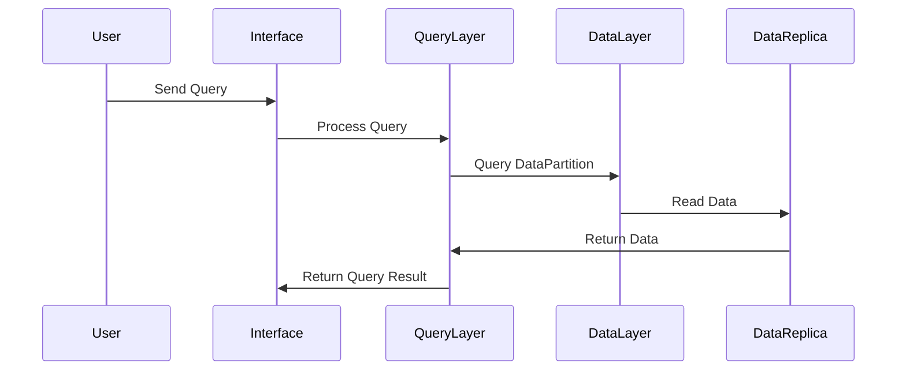

                 

### 分布式系统概述

#### 核心概念术语说明

分布式系统（Distributed System）是指由多个独立计算节点组成，通过通信网络互联，协同完成计算任务的系统。每个节点都具有独立的处理器、内存和存储资源，能够自主执行任务和响应请求。

#### 问题背景

随着互联网和云计算的快速发展，单机性能已经无法满足日益增长的计算需求。分布式系统因其能够横向扩展、提高系统容错能力和性能优势，成为现代计算架构的核心。无论是大型社交网络、电子商务平台，还是物联网、自动驾驶等新兴应用，分布式系统都扮演着至关重要的角色。

#### 问题描述

分布式系统面临着诸多挑战，包括通信延迟、网络分区、数据一致性和可靠性等问题。如何设计高效、可靠且具有扩展性的分布式系统，成为当前研究的热点和难点。

#### 问题解决

分布式系统设计需要遵循一系列核心原则和策略，确保系统的稳定性、性能和可扩展性。关键点包括：

1. **模块化和可扩展性**：将系统划分为多个模块，每个模块独立运行，能够灵活扩展。
2. **容错性和故障恢复**：设计冗余机制和故障恢复策略，确保系统在故障发生时能够快速恢复。
3. **一致性保障**：通过一致性协议和分布式算法，确保分布式数据的一致性。
4. **性能优化**：采用高效的网络通信协议和负载均衡策略，提高系统整体性能。
5. **安全性**：保护系统免受恶意攻击，确保数据安全和隐私保护。

#### 边界与外延

分布式系统不仅涉及计算节点和网络通信，还包括数据存储、数据处理、负载均衡等组件。在实际应用中，分布式系统可以支持大规模数据处理、实时计算、云计算和物联网等场景。

#### 概念结构与核心要素组成

分布式系统的核心要素包括：

- **计算节点**：执行计算任务的基本单元。
- **通信网络**：节点间进行数据交换的媒介。
- **数据存储**：存储系统数据，确保数据一致性和可靠性。
- **负载均衡**：分配计算任务，优化系统资源利用。
- **监控与日志**：监控系统状态，记录日志信息，便于故障排查和性能优化。

通过以上要素的有机结合，分布式系统能够实现高性能、高可靠性和可扩展性的目标。接下来，我们将深入探讨分布式系统的核心设计原则，为构建高效的分布式系统奠定基础。

#### 分布式系统的核心设计原则

在设计分布式系统时，我们需要遵循一系列核心原则，以确保系统能够在复杂环境中稳定运行。以下将详细阐述五个关键设计原则：模块化和可扩展性、容错性和故障恢复、一致性保障、性能优化以及安全性。

##### 1. 模块化和可扩展性

**模块化**是分布式系统设计的基础，它将复杂的系统分解为多个独立模块，每个模块可以独立开发、测试和部署。模块化不仅提高了系统的可维护性和灵活性，还使得系统能够轻松地扩展。例如，在分布式数据库系统中，可以将数据库分为多个分区，每个分区负责存储一部分数据，从而实现水平扩展。

**可扩展性**是分布式系统的关键特性之一。在系统负载增加时，能够通过增加节点数量或提高节点性能来满足需求。可扩展性可以分为两种：水平扩展（Horizontal Scaling）和垂直扩展（Vertical Scaling）。水平扩展通过增加节点数量来提高系统性能，而垂直扩展则是通过提升单个节点的性能来满足需求。例如，在分布式缓存系统中，可以通过增加缓存节点来提高缓存命中率，实现性能优化。

##### 2. 容错性和故障恢复

**容错性**是指系统在部分节点或组件失效时，仍然能够继续正常运行的能力。容错性对于分布式系统至关重要，因为网络故障、硬件损坏或软件错误都是常见的现象。为了实现容错性，分布式系统需要采用冗余机制和故障检测与恢复策略。

**冗余机制**通过复制数据和功能，确保系统在部分节点失效时，其他节点可以接管其工作。例如，在分布式数据库系统中，可以通过主从复制（Master-Slave Replication）或多主复制（Multi-Master Replication）来确保数据一致性和容错性。

**故障检测与恢复策略**包括故障检测、故障隔离和故障恢复。故障检测是通过监控和日志分析来识别系统中的故障。故障隔离是将故障节点从系统中隔离，避免影响其他节点的正常运行。故障恢复则是通过冗余节点接管失效节点的任务，使系统恢复正常运行。

##### 3. 一致性保障

**一致性**是分布式系统中的一个重要概念，它指的是系统中所有节点访问同一份数据时，能够看到相同的数据状态。在分布式系统中，由于节点间通过网络通信，数据的一致性问题变得尤为复杂。为了保障一致性，分布式系统需要采用一致性协议和分布式算法。

**一致性协议**包括强一致性（Strong Consistency）和最终一致性（ eventual consistency）。强一致性要求系统中所有节点在任何时刻都能访问到相同的数据状态，而最终一致性则允许节点在一段时间内访问到不同版本的数据，但最终会达到一致状态。

**分布式算法**用于实现数据一致性的机制，包括 Paxos、Raft 和日志压缩（Log Compaction）等。这些算法通过特定的算法步骤和协议，确保分布式系统中数据的一致性和可靠性。

##### 4. 性能优化

**性能优化**是分布式系统设计的重要目标之一。为了提高系统性能，分布式系统需要采用多种策略，包括高效的网络通信协议、负载均衡和缓存机制等。

**高效的网络通信协议**如 HTTP/2 和 gRPC，可以提高数据传输速度和减少延迟。负载均衡（Load Balancing）则是通过将请求分配到多个节点上，优化系统资源的利用，提高整体性能。常见的负载均衡算法包括轮询（Round Robin）、最小连接数（Least Connections）和哈希（Hashing）等。

**缓存机制**是提高系统性能的有效手段。通过在分布式系统中引入缓存，可以减少对后端存储的访问次数，提高数据访问速度。常见的缓存策略包括本地缓存、分布式缓存和智能缓存等。

##### 5. 安全性

**安全性**是分布式系统的关键考量因素。分布式系统面临着各种安全威胁，包括网络攻击、数据泄露和恶意软件等。为了保障系统安全，分布式系统需要采用多种安全措施。

**加密技术**是保护数据传输和存储的重要手段。通过使用对称加密和非对称加密，可以确保数据在传输和存储过程中的机密性和完整性。

**身份验证和访问控制**是确保系统资源安全的重要机制。通过使用用户名和密码、二因素认证（Two-Factor Authentication）和访问控制列表（Access Control List），可以限制对系统资源的访问，防止未授权访问。

**网络安全防护**包括防火墙、入侵检测系统（Intrusion Detection System）和反病毒软件等，用于检测和防御网络攻击。

通过遵循以上核心设计原则，分布式系统能够实现高性能、高可靠性和可扩展性，为现代应用提供强大的支持。接下来，我们将探讨分布式系统设计中的各种挑战，进一步深入理解分布式系统的复杂性。

### 分布式系统设计中的挑战

尽管分布式系统具备诸多优势，但在实际设计和实现过程中，依然面临着一系列复杂的挑战。以下将详细分析这些挑战，包括通信延迟和网络分区、数据一致性和可靠性、同步和异步通信等问题。

#### 1. 通信延迟和网络分区

**通信延迟**是分布式系统中常见的问题，它会导致系统的响应时间变长。分布式系统中的节点可能分布在不同地理位置，网络延迟会直接影响节点的通信效率。例如，一个分布式数据库中的数据需要跨不同数据中心进行同步，如果网络延迟较高，会导致数据同步时间显著增加。

**网络分区**是分布式系统中的另一个严重问题。当系统中的一部分节点无法与另一部分节点进行通信时，就会形成网络分区。网络分区可能导致系统出现分裂，从而影响系统的整体性能和稳定性。网络分区可以分为以下几种类型：

- **永久分区**：节点之间的通信永远无法恢复，这种情况下，系统需要采取故障恢复策略。
- **临时分区**：节点之间的通信在一定时间内可能恢复，这种情况下，系统需要具备一定的容错能力，以便在分区恢复后能够自动恢复正常运行。
- **可恢复分区**：节点之间的通信在一定时间内无法恢复，但通过特定的策略可以重新建立通信。

为了解决这些问题，分布式系统需要采用多种策略，包括**负载均衡**、**延迟容忍**和**网络分区检测与恢复**等。负载均衡可以将请求分散到不同的节点上，减少单个节点的压力；延迟容忍则通过优化系统架构和算法，提高系统对延迟的容忍度；网络分区检测与恢复则通过监控网络状态，及时检测和恢复网络分区。

#### 2. 数据一致性和可靠性

**数据一致性和可靠性**是分布式系统设计中的关键挑战。由于分布式系统中的节点可能处于不同的状态，导致数据同步和一致性变得复杂。以下是一些主要问题：

- **最终一致性**（eventual consistency）：在最终一致性模型中，系统不会保证所有节点在同一时刻访问到相同的数据状态，但最终会达到一致状态。这种模型适用于对一致性要求较低的应用，例如社交媒体和博客平台。
- **强一致性**（strong consistency）：在强一致性模型中，系统会保证所有节点在同一时刻访问到相同的数据状态。这种模型适用于对一致性要求较高的应用，例如银行交易系统和电子商务平台。
- **分布式事务**：在分布式系统中，事务可能跨越多个节点，如何保证分布式事务的原子性、一致性和隔离性，是一个重要的挑战。分布式事务需要采用特定的算法和协议，例如两阶段提交（2PC）和三阶段提交（3PC）。

为了解决这些问题，分布式系统需要采用多种一致性保障机制，包括**分布式锁**、**一致性协议**和**分布式事务管理**等。分布式锁用于在多节点环境中同步访问共享资源，一致性协议如 Paxos 和 Raft 用于确保数据的一致性，分布式事务管理则用于处理跨节点的分布式事务。

#### 3. 同步和异步通信

**同步通信**和**异步通信**是分布式系统中常见的通信模式。同步通信要求发送方在等待接收方响应后，才能继续执行后续操作。异步通信则允许发送方在发送消息后，继续执行其他任务，而无需等待接收方响应。

- **同步通信**的优点是简单易用，但在高延迟环境下，可能导致系统性能下降。例如，在分布式数据库中，如果同步复制数据，可能会显著增加数据的延迟。
- **异步通信**的优点是提高了系统的并发性和性能，但在处理异步消息时，需要考虑消息的顺序性和一致性。例如，在消息队列系统中，需要确保消息按照一定的顺序处理，以避免数据丢失或重复处理。

为了解决这些问题，分布式系统需要采用多种策略，包括**异步消息队列**、**消息确认机制**和**顺序保证**等。异步消息队列如 Kafka 和 RabbitMQ，用于处理大规模消息传递和异步任务调度；消息确认机制如消息确认（Message Acknowledgment）和事务消息（Transaction Message），用于确保消息的可靠传递；顺序保证如顺序消息队列（Ordered Message Queue）和流水线（Pipeline），用于确保消息的顺序处理。

#### 4. 数据管理和复制

**数据管理和复制**是分布式系统中的重要问题。由于分布式系统中的节点可能处于不同的状态，导致数据管理和复制的复杂度增加。以下是一些主要问题：

- **数据分区**：如何将大规模数据划分为多个分区，并在不同的节点上进行存储和复制，是一个重要的挑战。常见的分区策略包括哈希分区（Hash Partitioning）和范围分区（Range Partitioning）。
- **数据复制**：如何实现数据的复制，以确保在节点失效时，系统仍然能够访问到完整的数据。常见的复制策略包括主从复制（Master-Slave Replication）和多主复制（Multi-Master Replication）。
- **数据一致性**：在数据复制过程中，如何确保系统中的数据一致性，是一个关键问题。分布式一致性协议如 Paxos 和 Raft，用于确保数据的一致性和可靠性。

为了解决这些问题，分布式系统需要采用多种数据管理和复制策略，包括**分布式文件系统**、**分布式数据库**和**分布式缓存**等。分布式文件系统如 HDFS 和 Ceph，用于处理大规模数据存储和复制；分布式数据库如 Cassandra 和 MongoDB，用于处理分布式数据存储和管理；分布式缓存如 Redis 和 Memcached，用于提高系统性能和数据访问速度。

综上所述，分布式系统设计中的挑战是复杂而多样的，需要综合考虑通信延迟、网络分区、数据一致性和可靠性、同步和异步通信、数据管理和复制等多个方面。通过采用合适的设计原则和策略，分布式系统可以在复杂环境中实现高性能、高可靠性和可扩展性的目标。接下来，我们将探讨分布式系统的常见架构风格，为解决这些挑战提供更多思路。

### 分布式系统的常见架构风格

分布式系统在设计和实现过程中，可以根据不同的需求和场景选择不同的架构风格。以下将介绍几种常见的分布式系统架构风格：客户端-服务器（Client-Server）架构、对等网络（Peer-to-Peer）架构、服务导向架构（Service-Oriented Architecture，SOA）、微服务架构（Microservices Architecture）和事件驱动架构（Event-Driven Architecture）。

#### 1. 客户端-服务器架构（Client-Server Architecture）

客户端-服务器架构是一种经典的分布式系统架构，其中客户端负责发起请求，服务器端负责处理请求并返回结果。这种架构具有清晰的角色分工，客户端和服务器端可以独立开发、部署和扩展。

- **优点**：架构简单、易于理解和实现，有利于开发和维护。
- **缺点**：系统扩展性受限，当请求量增加时，服务器端的压力会显著增加。

#### 2. 对等网络架构（Peer-to-Peer Architecture）

对等网络架构是一种去中心化的分布式系统架构，系统中所有节点都平等参与，既充当客户端也充当服务器端。每个节点既可以请求资源，也可以提供资源。

- **优点**：去中心化，提高了系统的容错性和鲁棒性；资源分布广泛，有利于提高系统性能。
- **缺点**：复杂度高，需要解决节点间的通信、状态同步和数据一致性等问题。

#### 3. 服务导向架构（Service-Oriented Architecture，SOA）

服务导向架构是一种基于服务的分布式系统架构，系统中的各个功能模块通过服务进行交互。每个服务都是独立的、自包含的，可以通过接口进行访问和调用。

- **优点**：模块化，提高了系统的可扩展性和可维护性；服务间松耦合，降低了系统的耦合度。
- **缺点**：服务发现和负载均衡复杂，需要额外的服务注册和发现机制。

#### 4. 微服务架构（Microservices Architecture）

微服务架构是一种基于服务的分布式系统架构，系统被划分为多个独立的、小型化的服务模块。每个服务都有自己的数据库和业务逻辑，通过轻量级通信协议进行交互。

- **优点**：模块化，提高了系统的可扩展性和可维护性；每个服务可以独立部署和扩展，降低了系统故障的风险。
- **缺点**：服务间通信复杂，需要处理服务发现、负载均衡和分布式事务等问题。

#### 5. 事件驱动架构（Event-Driven Architecture）

事件驱动架构是一种基于事件的分布式系统架构，系统中的组件通过事件进行交互。事件可以是系统内部生成的，也可以来自外部系统或设备。

- **优点**：高并发性，适合处理大量的事件；系统响应速度快，降低了延迟。
- **缺点**：复杂度高，需要处理事件的生成、订阅和分发等问题。

### 总结

每种分布式系统架构风格都有其适用的场景和优缺点。在实际应用中，可以根据具体需求和场景选择合适的架构风格。例如，对于需要高并发性的应用，可以选择事件驱动架构；对于需要模块化和可维护性的应用，可以选择微服务架构。理解这些架构风格，有助于我们在分布式系统设计和实现过程中做出更明智的决策。

#### 分布式系统中的数据复制

在分布式系统中，数据复制是一个关键且复杂的问题。数据复制的主要目的是确保系统的可靠性和可用性，即当系统中某些节点或存储设备出现故障时，系统仍然能够访问到完整的数据。以下将详细讨论数据复制的技术、一致性模型以及处理网络分区的方法。

##### 1. 数据复制技术

数据复制技术是指在分布式系统中，将数据从一个节点复制到多个节点的过程。以下是一些常见的数据复制技术：

- **主从复制（Master-Slave Replication）**：在这种模型中，有一个主节点负责处理所有写操作，而从节点只负责处理读操作。主节点会将写操作的结果同步到从节点，从而确保数据的冗余和一致性。例如，在数据库系统中，可以使用 MySQL 的主从复制来提高系统的可用性。

- **多主复制（Multi-Master Replication）**：在这种模型中，多个节点都可以处理写操作。每个节点都会将写操作同步到其他节点，从而实现数据的一致性。例如，在分布式存储系统中，可以使用 Cassandra 的多主复制来提高系统的性能和可用性。

- **多主主动复制（Active-Active Multi-Master Replication）**：在这种模型中，多个节点都可以处理写操作，并且每个节点都会将写操作同步到其他节点。这种模型通常用于对性能要求较高的场景，例如电子商务平台。

##### 2. 一致性模型

在分布式系统中，数据一致性是确保系统正确性的关键。一致性模型用于描述系统中数据状态的变化和同步过程。以下是一些常见的一致性模型：

- **强一致性（Strong Consistency）**：在强一致性模型中，系统中的所有节点在同一时刻都能访问到相同的数据状态。这种模型要求所有节点之间的同步操作必须成功，从而确保数据的一致性。例如，使用两阶段提交（2PC）或三阶段提交（3PC）协议可以实现强一致性。

- **最终一致性（Eventual Consistency）**：在最终一致性模型中，系统中的所有节点最终会达到一致状态，但在某些时刻，不同节点可能会访问到不同的数据状态。这种模型允许短暂的异步同步过程，从而提高系统的性能和可用性。例如，使用最终一致性算法（如 Log Compaction）可以实现最终一致性。

- **因果一致性（ causal consistency）**：因果一致性是一种弱一致性模型，它确保因果关系的正确传递。即如果一个操作 A 导致了另一个操作 B，那么在所有节点上，操作 A 的结果必须先于操作 B 的结果。这种模型适用于对因果关系要求较高的场景。

- **读己写（Read-Your-Write）一致性**：在这种一致性模型中，如果一个节点对某个数据进行了写操作，那么该节点后续的读操作将返回最新的写结果。这种模型确保了系统的部分一致性，但无法保证全局一致性。

##### 3. 处理网络分区

网络分区是分布式系统中常见的问题，它会导致系统中的节点无法相互通信。以下是一些处理网络分区的方法：

- **分区感知（Partition Awareness）**：系统需要能够检测到网络分区，并采取相应的措施。例如，在分布式数据库中，可以使用心跳机制（Heartbeat Mechanism）来检测节点的状态，当检测到网络分区时，可以启用备用节点。

- **虚拟同步（Virtual Synchronization）**：通过虚拟同步，系统可以在分区状态下继续运行，并最终达到一致性。例如，使用 Paxos 或 Raft 算法，系统可以在分区状态下继续接收写操作，并最终在分区恢复后同步数据。

- **最终一致性算法（Eventual Consistency Algorithms）**：使用最终一致性算法，系统可以在分区状态下继续运行，并最终达到一致性。例如，使用 Log Compaction 算法，系统可以在分区状态下继续接收写操作，并最终通过日志压缩来同步数据。

- **数据分区策略（Data Partitioning Strategies）**：通过合理的数据分区策略，可以降低网络分区的风险。例如，在分布式数据库中，可以使用哈希分区（Hash Partitioning）或范围分区（Range Partitioning），将数据分散存储在多个节点上。

通过采用合适的数据复制技术、一致性模型和分区处理方法，分布式系统可以在面对网络故障和分区时，保持数据的完整性和一致性，从而提高系统的可靠性和可用性。接下来，我们将讨论分布式系统中的故障容忍和恢复策略。

#### 故障容忍和恢复策略

在分布式系统中，故障是不可避免的，因此设计有效的故障容忍和恢复策略至关重要。以下将讨论几种常见的故障容忍和恢复策略，包括故障检测、冗余机制、故障转移和恢复机制。

##### 1. 故障检测

故障检测是分布式系统中的一项基本功能，用于识别和报告系统中的故障。以下是一些常见的故障检测方法：

- **心跳机制（Heartbeat Mechanism）**：通过定期发送心跳信号，节点之间可以相互确认状态。如果某个节点在一定时间内没有收到心跳信号，就可以判定该节点可能出现故障。
  
- **监控和日志分析**：通过监控系统性能和日志记录，可以发现异常行为和潜在故障。例如，CPU 使用率过高、内存泄漏或网络延迟异常等。

- **健康检查（Health Checks）**：节点可以定期执行健康检查，以评估自身状态。健康检查通常包括资源使用情况、服务可用性和响应时间等。

##### 2. 冗余机制

冗余机制通过复制数据和功能，确保系统在部分节点或组件失效时，其他节点可以接管其工作。以下是一些常见的冗余机制：

- **数据冗余**：通过数据复制，确保数据在多个节点上存储，从而提高数据的可靠性和可用性。例如，主从复制（Master-Slave Replication）和多主复制（Multi-Master Replication）。

- **功能冗余**：通过部署冗余组件，确保关键功能在故障发生时仍然可用。例如，在分布式数据库系统中，可以使用冗余的数据库实例来处理查询和写操作。

- **负载均衡**：通过负载均衡，将请求分配到多个节点上，提高系统的整体性能和容错能力。常见的负载均衡算法包括轮询（Round Robin）、最小连接数（Least Connections）和哈希（Hashing）等。

##### 3. 故障转移

故障转移（Failover）是一种自动化的故障恢复机制，用于在故障节点上重新分配任务或服务。以下是一些常见的故障转移策略：

- **主动故障转移（Active Failover）**：系统在故障检测到后，立即将任务或服务转移到备用节点。主动故障转移可以提高系统的可用性，但需要处理状态同步和数据一致性问题。

- **被动故障转移（Passive Failover）**：系统在故障检测到后，将任务或服务转移到备用节点，但在实际切换前，需要等待一定时间以确保数据一致性。被动故障转移可以减少不必要的切换，但可能影响系统的可用性。

- **多主故障转移（Multi-Master Failover）**：在多主复制模型中，系统可以实现自动故障转移，从而确保多个主节点中的任一节点都可以处理写操作。

##### 4. 恢复机制

恢复机制用于在故障发生后，使系统恢复正常运行。以下是一些常见的恢复机制：

- **自动恢复（Automatic Recovery）**：系统在故障检测到后，自动执行恢复操作，如启动备用节点或重新同步数据。自动恢复可以显著减少人工干预，提高系统的可靠性。

- **手动恢复（Manual Recovery）**：在自动恢复无法解决问题时，需要人工干预进行恢复。手动恢复通常涉及故障排查、故障节点修复和数据同步等。

- **备份和恢复**：通过定期备份，系统可以在故障发生后，快速恢复到之前的状态。例如，使用快照（Snapshot）或日志回滚（Log Rollback）等技术。

##### 5. 预防性措施

除了故障检测和恢复机制外，预防性措施也是提高系统可靠性的重要手段。以下是一些常见的预防性措施：

- **负载均衡和资源监控**：通过负载均衡和资源监控，可以及时发现和处理系统中的潜在问题，避免因资源不足或过载导致故障。

- **定期维护和升级**：定期对系统进行维护和升级，可以修复已知问题，提高系统的稳定性和安全性。

- **容灾备份**：通过建立容灾备份系统，确保在发生灾难时，系统能够快速恢复，降低业务中断的风险。

综上所述，通过故障检测、冗余机制、故障转移和恢复机制，以及预防性措施，分布式系统可以在面对故障时，保持高可用性和可靠性。这些策略的有效实施，为分布式系统的稳定运行提供了有力保障。接下来，我们将探讨分布式系统设计中的典型问题和解决策略。

#### 分布式系统中的典型问题和解决策略

在分布式系统设计过程中，会遇到许多复杂的挑战和问题。以下将列举一些常见的问题，并讨论相应的解决策略。

##### 1. 数据一致性问题

数据一致性是分布式系统设计中一个核心问题。由于节点之间的延迟、网络分区和故障等原因，系统可能无法保证所有节点在同一时刻访问到相同的数据状态。以下是一些解决策略：

- **强一致性协议**：如两阶段提交（2PC）和三阶段提交（3PC），通过分布式事务管理确保数据的一致性。
- **最终一致性模型**：允许系统在一段时间内访问到不同版本的数据，但最终会达到一致状态。适用于对一致性要求较低的场景。
- **一致性协议**：如 Paxos 和 Raft，通过分布式一致性算法确保数据的一致性和可靠性。

##### 2. 数据丢失问题

在分布式系统中，数据丢失可能是由于网络故障、节点故障或数据复制错误等原因引起的。以下是一些解决策略：

- **数据复制和备份**：通过数据复制和定期备份，确保数据的多份副本，从而提高数据可靠性。
- **检查点（Checkpoint）和恢复**：在分布式系统中，定期执行检查点操作，将系统状态保存到持久存储中，以便在故障发生时进行恢复。
- **冲突解决**：在多主复制模型中，通过冲突解决策略（如 Last Write Wins 或版本向量），确保数据在多个节点上的一致性。

##### 3. 负载不均衡问题

在分布式系统中，负载不均衡可能导致某些节点过载，而其他节点资源空闲。以下是一些解决策略：

- **动态负载均衡**：通过动态调整负载均衡策略，如轮询（Round Robin）、最小连接数（Least Connections）和哈希（Hashing），确保请求均匀分配到各个节点。
- **负载感知**：通过监控系统性能指标（如 CPU 使用率、内存使用率和网络延迟），自动调整负载均衡策略。
- **资源分配**：通过合理的资源分配和调度策略，确保系统资源的有效利用。

##### 4. 安全性问题

分布式系统面临着各种安全威胁，包括网络攻击、数据泄露和恶意软件等。以下是一些解决策略：

- **加密和认证**：使用加密技术（如 TLS）保护数据传输和存储，使用身份认证和访问控制（如用户名和密码、二因素认证）确保系统的安全性。
- **安全审计和日志**：定期进行安全审计，记录系统日志信息，以便在发生安全事件时进行排查和分析。
- **安全防护**：采用防火墙、入侵检测系统（IDS）和反病毒软件等安全防护措施，保护系统免受网络攻击。

##### 5. 系统监控和运维问题

分布式系统的监控和运维是一项复杂且具有挑战性的任务。以下是一些解决策略：

- **自动化运维**：通过自动化脚本和工具，实现系统的自动化部署、监控和故障恢复，降低运维成本。
- **监控指标和告警**：通过设置关键监控指标（如 CPU 使用率、内存使用率和网络延迟）和告警规则，及时发现系统异常并进行处理。
- **日志分析和可视化**：通过日志分析和可视化工具，实时监控系统状态，快速定位和解决问题。

通过采用上述解决策略，分布式系统可以更好地应对设计过程中的典型问题，提高系统的可靠性、性能和安全性。接下来，我们将通过具体案例来探讨分布式系统的设计与实现。

#### 系统设计与实现案例

为了更好地理解分布式系统的设计和实现，我们将通过一个具体案例——分布式数据库系统——来详细分析其设计思路和实现方法。

##### 1. 项目介绍

项目名称：分布式数据库系统（DDBS）

目标：构建一个高可用性、高性能和可扩展的分布式数据库系统，能够处理大规模数据存储和查询需求。

功能需求：
- **数据存储**：支持大规模数据的存储和分布式管理。
- **数据一致性**：确保在分布式环境下，数据的一致性和可靠性。
- **数据查询**：提供高效的数据查询接口。
- **故障恢复**：在节点故障时，能够自动恢复数据和服务。

##### 2. 系统功能设计

**领域模型**：在分布式数据库系统中，主要的领域模型包括数据节点、数据分区、数据副本和查询引擎。

- **数据节点**：负责存储和同步数据。
- **数据分区**：将数据划分为多个分区，以便于分布式存储和查询。
- **数据副本**：为提高数据可靠性，每个数据分区可以有多个副本。
- **查询引擎**：负责处理用户的查询请求，并返回查询结果。

**类图**：使用 Mermaid 类图表示分布式数据库系统的领域模型，如下所示：

```mermaid
classDiagram
    DataNode <-|- DataPartition
    DataNode o-- DataReplica
    QueryEngine o-- DataPartition
    QueryEngine o-- DataReplica
```

##### 3. 系统架构设计

**架构设计**：分布式数据库系统的架构可以分为四层：数据层、复制层、查询层和接口层。

- **数据层**：负责数据存储和分区。
- **复制层**：负责数据同步和副本管理。
- **查询层**：负责处理查询请求。
- **接口层**：提供对外接口，处理用户请求。

**架构图**：使用 Mermaid 架构图表示分布式数据库系统的架构设计，如下所示：



##### 4. 系统接口设计和系统交互

**接口设计**：分布式数据库系统提供以下主要接口：
- **数据存储接口**：用于数据的插入、更新和删除。
- **查询接口**：用于执行各种查询操作。
- **监控接口**：用于监控系统的状态和性能。

**系统交互**：系统交互过程如下：
- 用户通过接口层发送查询请求。
- 接口层将请求传递给查询层。
- 查询层根据查询请求，向数据层请求数据。
- 数据层在数据分区中查找数据副本，读取数据。
- 数据副本返回数据给查询层。
- 查询层将查询结果返回给接口层，最终返回给用户。

**序列图**：使用 Mermaid 序列图表示系统交互过程，如下所示：


##### 5. 系统核心实现源代码和代码应用解读

**核心实现**：
```python
# 数据节点类
class DataNode:
    def __init__(self, partition):
        self.partition = partition
        self.replicas = []

    def add_replica(self, replica):
        self.replicas.append(replica)

    def read_data(self, key):
        for replica in self.replicas:
            if replica.has_key(key):
                return replica.read_key(key)
        return None

# 数据副本类
class DataReplica:
    def __init__(self, data_partition):
        self.data_partition = data_partition
        self.data = {}

    def has_key(self, key):
        return key in self.data

    def read_key(self, key):
        return self.data[key]

    def write_key(self, key, value):
        self.data[key] = value

# 查询引擎类
class QueryEngine:
    def __init__(self, data_nodes):
        self.data_nodes = data_nodes

    def query_data(self, key):
        for data_node in self.data_nodes:
            replica = data_node.read_data(key)
            if replica:
                return replica
        return None
```

**代码应用解读**：
- **数据节点（DataNode）**：负责管理数据分区和副本。`add_replica` 方法用于添加副本，`read_data` 方法用于读取数据。
- **数据副本（DataReplica）**：负责存储和读取数据。`has_key` 方法用于检查键是否存在，`read_key` 和 `write_key` 方法用于读取和写入键值对。
- **查询引擎（QueryEngine）**：负责处理查询请求。`query_data` 方法用于根据键查询数据。

##### 6. 实际案例分析和详细讲解

**案例**：假设用户需要查询键为 "user123" 的数据，分析分布式数据库系统的处理过程。

1. 用户发送查询请求，查询键为 "user123" 的数据。
2. 接口层将查询请求传递给查询引擎。
3. 查询引擎向数据节点请求数据。
4. 数据节点依次访问其副本，查找键为 "user123" 的数据。
5. 如果找到数据，返回给查询引擎；否则，返回空。
6. 查询引擎将查询结果返回给接口层，最终返回给用户。

**详细讲解**：
- **数据一致性**：分布式数据库系统使用多主复制策略，确保数据在多个副本中的一致性。
- **故障恢复**：如果某个数据节点或副本出现故障，其他节点可以继续提供服务，确保系统的可用性。
- **性能优化**：通过数据分区和副本策略，分布式数据库系统可以并行处理查询请求，提高查询性能。

##### 7. 项目小结

分布式数据库系统设计过程中，我们考虑了数据一致性、可靠性、性能和扩展性等多个方面。通过模块化和冗余机制，系统能够在故障发生时保持高可用性。同时，通过合理的数据分区和查询引擎设计，系统能够高效地处理大规模数据查询请求。在实际应用中，分布式数据库系统为许多企业级应用提供了强大的数据存储和查询支持。

**最佳实践 tips**：
- **数据一致性策略**：根据应用场景选择合适的一致性模型，如最终一致性或强一致性。
- **故障恢复策略**：定期进行系统监控和故障恢复测试，确保系统的稳定运行。
- **性能优化**：合理设置数据分区和副本策略，提高系统性能。

### 总结与展望

本文通过对分布式系统设计原则与挑战的深入探讨，从概述、核心设计原则、设计中的挑战、常见架构风格、数据复制与故障容忍恢复策略、典型问题与解决策略以及实际案例等多个角度，系统地阐述了分布式系统的设计和实现。以下是本文的主要观点和总结：

1. **分布式系统的核心设计原则**：模块化和可扩展性、容错性和故障恢复、一致性保障、性能优化以及安全性是分布式系统设计中的关键原则。通过遵循这些原则，分布式系统可以实现高效、可靠和可扩展的目标。

2. **分布式系统面临的挑战**：通信延迟和网络分区、数据一致性和可靠性、同步和异步通信、数据管理和复制是分布式系统设计中的重要挑战。针对这些挑战，需要采用相应的策略和算法来优化系统性能和稳定性。

3. **常见架构风格**：客户端-服务器架构、对等网络架构、服务导向架构、微服务架构和事件驱动架构是分布式系统中的几种常见架构风格。根据具体应用场景和需求，选择合适的架构风格有助于提高系统性能和可维护性。

4. **数据复制与故障容忍恢复策略**：数据复制技术、一致性模型以及故障检测、冗余机制、故障转移和恢复机制是确保分布式系统可靠性的关键。通过合理的数据复制和故障容忍策略，分布式系统可以在面对故障时保持高可用性。

5. **典型问题与解决策略**：数据一致性问题、数据丢失问题、负载不均衡问题、安全问题和系统监控与运维问题是分布式系统设计中的典型问题。针对这些问题，需要采用相应的解决策略来提高系统的可靠性、性能和安全性。

6. **实际案例**：通过分布式数据库系统的设计实现案例，展示了如何将理论应用到实际项目中。该案例涵盖了领域模型、系统架构设计、接口设计、系统交互以及核心实现等多个方面。

在展望未来，分布式系统将继续在云计算、物联网、人工智能等新兴领域发挥重要作用。随着技术的不断发展，分布式系统将面临新的挑战和机遇。以下是一些未来可能的发展趋势：

1. **量子计算**：量子计算的兴起将可能带来分布式系统设计的革命性变革。量子计算机在处理大规模分布式数据和处理复杂计算任务方面具有巨大潜力。

2. **边缘计算**：随着物联网设备的普及，边缘计算将使分布式系统更加靠近数据源，从而降低延迟和提高性能。

3. **去中心化系统**：去中心化系统（如区块链）的发展，将可能改变传统分布式系统的架构和运行方式，为分布式系统带来新的机会和挑战。

4. **自修复和自优化系统**：未来的分布式系统将更加智能化，通过机器学习和人工智能技术，实现自我修复和自优化，提高系统的可靠性和性能。

总之，分布式系统设计原则与挑战是一个复杂而广泛的话题。通过深入理解分布式系统的核心概念和设计原则，结合实际案例进行分析，我们可以更好地应对分布式系统中的各种挑战，为构建高效、可靠和可扩展的分布式系统奠定坚实基础。

### 拓展阅读

为了深入了解分布式系统的设计原则与挑战，以下是几本推荐的技术书籍，以及一些优秀的在线资源和论文，供读者进一步学习：

1. **《分布式系统原理与范型》**（Designing Data-Intensive Applications）：作者 Martin Kleppmann。本书详细介绍了分布式系统的基本概念、设计原则和常见模式，包括一致性、分布式事务、分布式缓存和分布式数据库等。

2. **《大规模分布式存储系统：原理解析与架构实战》**（Massively Distributed Storage Systems: Principles, Algorithims, and Systems）：作者 Michael Isard、Daryn Collier、Andrew Konwinski、Matei Zaharia。本书讲解了大规模分布式存储系统的设计原理和实现方法，包括GFS、HDFS、Cassandra等。

3. **《分布式系统概念与模式》**（Distributed Systems: Concepts and Models）：作者 George Coulouris、Jean Dollimore、Tim Kindberg、Gerry Cockburn。本书系统地介绍了分布式系统的基本概念、通信模型和一致性模型。

4. **在线资源**：
   - **Netflix Engineering Blog**：Netflix是一家大型分布式系统公司，其博客分享了大量关于分布式系统的实践经验和技术文章。
   - **Apache ZooKeeper**：Apache ZooKeeper是一个分布式服务协调系统，其官方文档提供了丰富的分布式系统设计资源。
   - **Kubernetes Documentation**：Kubernetes是一个开源的容器编排系统，其文档详细介绍了如何在分布式环境中部署和管理应用。

5. **优秀论文**：
   - **“The Google File System”**：作者 Sanjay Ghemawat、Shun-Tak Leung、Bharat Bhattacharjee、Cannan Atyia、Frank Back、Ian Chen。该论文介绍了GFS的设计和实现，是分布式存储系统的重要参考文献。
   - **“Bigtable: A Distributed Storage System for Structured Data”**：作者 Sanjay Ghemawat、Howard Gobioff、Shun-Tak Leung。该论文介绍了Bigtable的设计和实现，是分布式数据库系统的经典参考文献。

通过阅读这些书籍和资料，读者可以深入了解分布式系统的理论基础和实践经验，为分布式系统的设计与实现提供有力的指导。同时，保持关注分布式系统领域的最新进展和研究成果，有助于不断优化和提升分布式系统的性能和可靠性。

