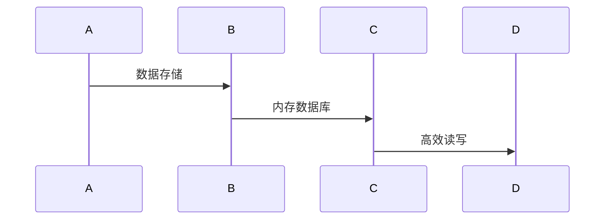
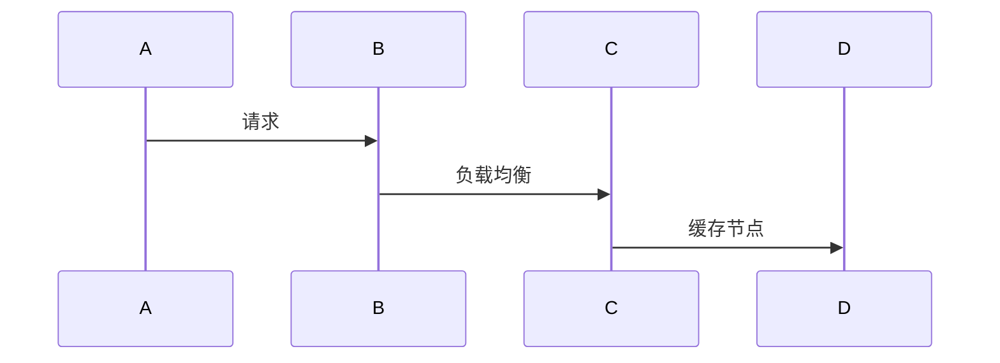
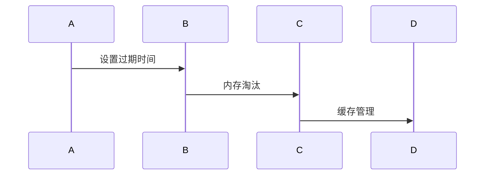
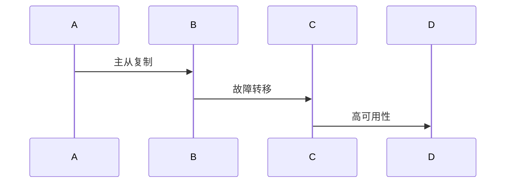
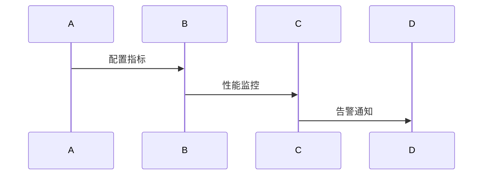
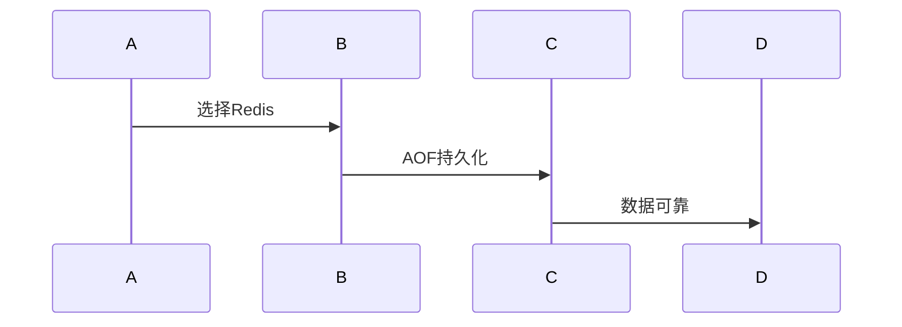
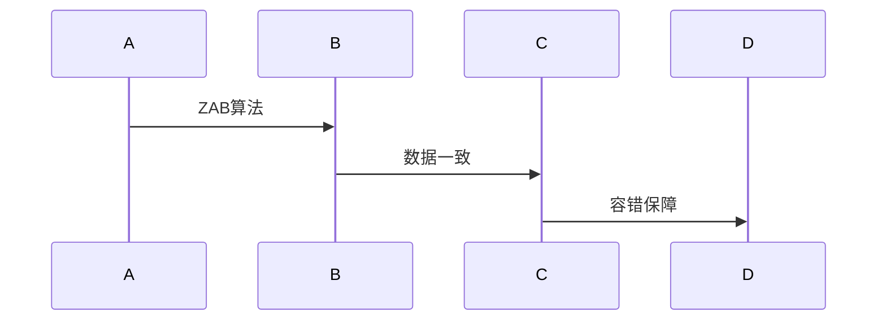
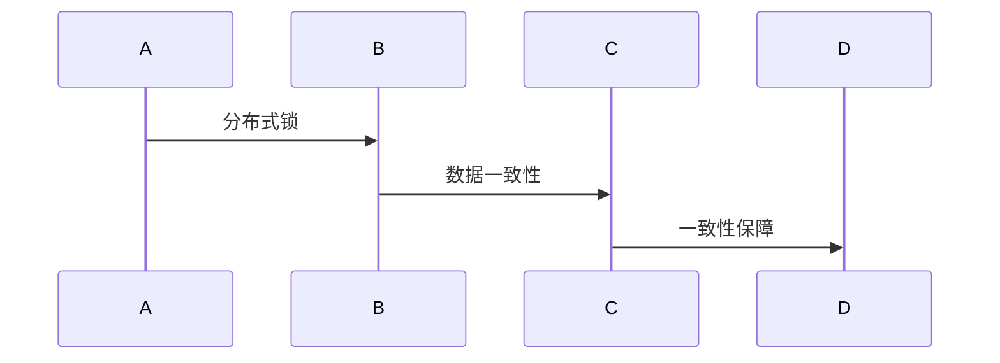
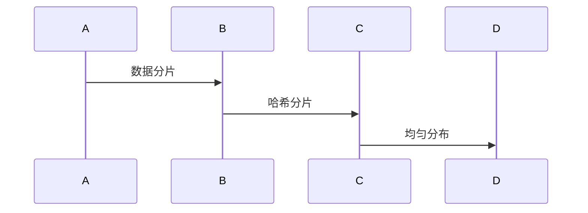

                 


# 分布式缓存系统设计

## 摘要

分布式缓存系统在现代计算机系统中扮演着至关重要的角色。它们能够显著提升数据的读取速度，降低数据库负载，从而提高系统的整体性能和响应能力。本文旨在为读者提供一个系统而深入的分布式缓存系统设计指南。我们将从分布式缓存系统的背景和定义开始，探讨其核心概念和原理，深入分析系统架构和设计，介绍常见的实现技术和优化策略，并通过实际案例研究展示分布式缓存系统的应用场景和实现细节。最后，我们将展望分布式缓存系统的未来发展趋势和研究方向。本文不仅适用于对分布式缓存系统感兴趣的初学者，也提供了丰富的专业知识和实用技巧，为资深系统架构师和开发者提供了宝贵的参考。

## 第一部分：分布式缓存系统概述

### 1.1 分布式缓存系统的背景和定义

#### 1.1.1 数据存储技术的发展

数据存储技术的发展经历了从单机存储到分布式存储的转变。早期的单机存储系统如磁盘阵列（RAID）和本地存储设备（如SSD）能够提供较高的存储容量和性能，但随着数据量的爆发式增长，单机存储系统逐渐暴露出性能瓶颈。为了应对海量数据的存储需求，分布式存储系统应运而生。

分布式存储系统通过将数据分散存储在多个节点上，利用并行计算和数据分片的机制，显著提升了数据的读写速度和存储容量。这种技术不仅解决了单机存储的性能限制，还提高了系统的可靠性和可扩展性。分布式缓存系统作为分布式存储系统的一部分，旨在提供高速缓存服务，进一步提升系统的整体性能。

#### 1.1.2 分布式缓存系统的需求

分布式缓存系统在以下场景中表现出特别的需求：

1. **高并发访问**：在电商、社交媒体等高并发场景中，用户请求量巨大，单点缓存系统难以满足快速响应的需求。分布式缓存系统能够通过横向扩展，提高系统的处理能力。
2. **数据一致性**：在高并发环境下，数据一致性问题尤为突出。分布式缓存系统通过一致性协议和副本机制，确保数据的一致性。
3. **弹性伸缩**：随着业务需求的波动，系统需要能够弹性扩展和收缩。分布式缓存系统可以通过动态调整节点数量，实现资源的合理分配。
4. **高性能**：分布式缓存系统能够利用多节点并行处理的优势，显著提高数据的访问速度。

#### 1.1.3 分布式缓存系统的定义

分布式缓存系统是一种通过多个缓存节点协同工作，提供高性能、高可用、高扩展性的缓存服务架构。它通常由多个缓存服务器组成，数据被分散存储在这些服务器上。分布式缓存系统能够提供以下关键功能：

1. **数据缓存**：将热点数据缓存到内存中，降低对后端数据库的访问压力。
2. **负载均衡**：通过将请求分配到不同的缓存节点，避免单点过载。
3. **数据复制和一致性**：确保数据的冗余备份，提高系统的可用性和数据可靠性。
4. **缓存管理**：实现缓存数据的有效淘汰、更新和管理。

### 1.2 分布式缓存系统的核心概念和原理

#### 1.2.1 分布式缓存系统的关键概念

1. **节点**：缓存系统中的单个服务器实例。
2. **集群**：由多个节点组成的缓存系统。
3. **一致性**：数据在多个节点之间的同步和一致性。
4. **分区**：将数据划分到不同的节点上，以实现负载均衡和高可用性。
5. **复制**：将数据复制到多个节点，以提高数据的可靠性和访问速度。

#### 1.2.2 分布式缓存系统的原理

分布式缓存系统的核心原理包括数据分片、数据复制和一致性协议。

1. **数据分片**：将数据划分为多个片段（ shards），每个片段存储在不同的节点上。这种技术能够实现数据的水平扩展，提高系统的并发处理能力。
2. **数据复制**：将数据复制到多个节点上，以实现数据的冗余备份和高可用性。常见的复制策略包括主从复制和去中心化复制。
3. **一致性协议**：在分布式系统中，数据的一致性是一个重要问题。一致性协议如强一致性（Strong Consistency）和最终一致性（Eventual Consistency）确保数据在多个节点之间的一致性。

#### 1.2.3 分布式缓存系统的核心概念对比

| 概念 | 描述 |  
| ---- | ---- |  
| 节点 | 缓存系统中的单个服务器实例 |  
| 集群 | 由多个节点组成的缓存系统 |  
| 一致性 | 数据在多个节点之间的同步和一致性 |  
| 分区 | 将数据划分到不同的节点上，以实现负载均衡和高可用性 |  
| 复制 | 将数据复制到多个节点，以提高数据的可靠性和访问速度 |

#### 1.2.4 分布式缓存系统的 ER 实体关系图

```mermaid
erDiagram
  Node ||--|{ Cluster : 包含 }
  Cluster ||--|{ Node : 存储在 }
  CacheData ||--|{ Node : 存储在 }
  CacheData ||--|{ Cluster : 属于 }
```

在这个 ER 图中，我们定义了三个实体：Node（节点）、Cluster（集群）和 CacheData（缓存数据）。节点是缓存系统中的单个服务器实例，集群由多个节点组成，而缓存数据存储在节点上，并属于特定的集群。

### 1.3 分布式缓存系统的应用场景

分布式缓存系统在以下应用场景中具有显著优势：

1. **缓存热点数据**：在高并发的应用场景中，缓存热点数据可以显著降低数据库的负载，提高系统的响应速度。例如，电商网站的购物车、用户浏览记录等数据都可以通过分布式缓存系统进行缓存。
2. **会话管理**：分布式缓存系统常用于管理用户的会话信息，如用户登录状态、购物车等信息。通过分布式缓存，可以快速访问用户数据，提高系统的性能和可靠性。
3. **系统间通信**：分布式缓存系统可以作为不同系统之间的数据共享机制，实现系统间的快速数据交换和同步。
4. **大数据处理**：在处理大规模数据时，分布式缓存系统可以显著提高数据的读取速度，降低数据处理延迟。

#### 1.3.1 缓存热点数据

缓存热点数据是分布式缓存系统最常见也最重要的应用场景之一。热点数据通常是指那些频繁访问、对系统性能影响较大的数据。通过将热点数据缓存到分布式缓存系统中，可以减少对后端数据库的访问，从而降低数据库的负载，提高系统的整体性能。

**示例：** 在一个电商网站上，用户经常访问的商品信息、购物车内容、用户浏览记录等都可以被视为热点数据。通过分布式缓存系统，这些数据可以快速读取，从而提高用户体验。

#### 1.3.2 会话管理

分布式缓存系统在会话管理中发挥着重要作用。会话数据通常包括用户的登录状态、购物车内容、用户偏好等。在传统的单点缓存系统中，会话管理容易受到单点故障的影响，而分布式缓存系统通过多个节点的复制和备份，可以有效避免单点故障，提高系统的可靠性。

**示例：** 在一个社交网络平台上，用户的登录状态、好友关系等数据都可以通过分布式缓存系统进行管理，从而实现快速访问和更新。

#### 1.3.3 系统间通信

分布式缓存系统可以作为不同系统之间的数据共享机制，实现系统间的快速数据交换和同步。例如，在微服务架构中，各个微服务可以通过分布式缓存系统共享公共数据，减少数据冗余，提高系统的整合性和响应速度。

**示例：** 在一个电子商务平台中，订单管理系统和库存管理系统可以通过分布式缓存系统共享订单数据和库存信息，从而实现数据的实时同步和快速访问。

#### 1.3.4 大数据处理

在处理大规模数据时，分布式缓存系统可以显著提高数据的读取速度，降低数据处理延迟。通过将数据缓存到分布式缓存系统中，可以减少对后端存储系统的访问，从而提高系统的处理能力。

**示例：** 在一个大数据分析平台中，通过对海量日志数据进行实时缓存和快速读取，可以实现对用户行为的实时分析和报表生成。

### 1.4 分布式缓存系统的优点和挑战

#### 1.4.1 分布式缓存系统的优点

1. **高性能**：分布式缓存系统能够通过多个节点的并行处理，提供更高的数据访问速度和系统吞吐量。
2. **高可用性**：通过数据复制和故障转移机制，分布式缓存系统可以确保系统的持续可用性。
3. **高扩展性**：分布式缓存系统支持水平扩展，可以根据业务需求动态调整节点数量，实现资源的灵活分配。
4. **数据一致性**：通过一致性协议和复制机制，分布式缓存系统能够确保数据的一致性，降低数据冲突和丢失的风险。

#### 1.4.2 分布式缓存系统的挑战

1. **复杂性**：分布式缓存系统的设计和管理相对复杂，需要处理数据分片、节点故障、负载均衡等问题。
2. **一致性**：在分布式系统中，一致性是一个重要问题。如何实现高效的一致性协议，是一个需要深入研究和优化的方向。
3. **网络依赖**：分布式缓存系统高度依赖网络通信，网络延迟和带宽限制可能会影响系统的性能。
4. **缓存失效**：缓存数据的失效管理是一个挑战，需要设计合理的缓存策略，以避免缓存击穿和数据一致性问题。

### 1.5 小结

本部分介绍了分布式缓存系统的背景、定义、核心概念和原理，以及其在实际应用中的场景和优势。通过分布式缓存系统，可以显著提升数据的访问速度和系统的整体性能。然而，分布式缓存系统的设计和管理也面临一系列挑战，需要我们在实际应用中深入思考和优化。

## 第二部分：分布式缓存系统的系统架构和设计

### 2.1 系统架构设计概述

分布式缓存系统的架构设计是确保其高效、可靠和可扩展性的关键。一个良好的架构能够平衡性能、可用性和可维护性。本节将详细探讨分布式缓存系统的系统架构设计，包括系统功能、模块划分、关键组件及其相互作用。

#### 2.1.1 系统功能

分布式缓存系统的主要功能包括：

1. **数据缓存**：提供高速缓存服务，降低对后端数据库的访问压力。
2. **负载均衡**：将请求分配到不同的缓存节点，避免单点过载。
3. **数据复制和一致性**：确保数据在多个节点之间的同步和一致性。
4. **缓存管理和监控**：实现缓存数据的有效淘汰、更新和管理，监控系统性能和健康状况。

#### 2.1.2 模块划分

分布式缓存系统的模块划分通常包括以下关键组件：

1. **缓存节点**：缓存系统的基本单元，负责存储和提供服务。
2. **缓存服务器集群**：由多个缓存节点组成的集群，提供分布式缓存服务。
3. **缓存管理器**：负责缓存节点的管理和监控，协调负载均衡和缓存一致性。
4. **数据存储**：用于存储缓存数据的持久化存储，如磁盘或内存数据库。
5. **缓存客户端**：与缓存系统交互的客户端，负责发起请求和接收响应。

#### 2.1.3 关键组件及其相互作用

分布式缓存系统的关键组件及其相互作用如下：

1. **缓存节点**：缓存节点是缓存系统的核心组件，每个节点存储一部分数据，并对外提供服务。缓存节点通过内存数据库或缓存引擎实现数据的存储和访问。
2. **缓存服务器集群**：多个缓存节点组成的集群，通过负载均衡策略将请求分配到不同的节点，以提高系统的并发处理能力和响应速度。
3. **缓存管理器**：缓存管理器负责协调缓存节点的工作，包括负载均衡、缓存一致性管理和监控。缓存管理器通常实现了一致性协议，如Gossip协议或Paxos算法，确保数据在多个节点之间的一致性。
4. **数据存储**：数据存储是缓存数据的持久化存储，用于保障数据的可靠性和持久性。数据存储可以是磁盘或内存数据库，如Redis或Memcached。
5. **缓存客户端**：缓存客户端负责与缓存系统进行交互，发起数据读取和写入请求，并接收响应。缓存客户端通常实现了缓存客户端库，如JCache或Memcached Client。

### 2.2 缓存节点设计

缓存节点是分布式缓存系统的基本单元，负责存储和提供服务。一个良好的缓存节点设计需要考虑以下几个方面：

#### 2.2.1 数据存储

缓存节点通常使用内存数据库或缓存引擎，如Redis或Memcached，来实现数据的存储。这些引擎提供了高效的数据存储和访问机制，支持内存级别的数据读写，显著提高了系统的性能。

**示例：** 在使用Redis作为缓存节点时，可以使用其数据结构（如字符串、哈希、列表、集合等）来存储和操作数据。Redis还支持持久化机制，如RDB和AOF，确保数据的持久性和可靠性。



#### 2.2.2 负载均衡

负载均衡是缓存节点设计的关键问题，通过将请求分配到不同的节点，可以提高系统的并发处理能力和响应速度。常见的负载均衡策略包括轮询、随机、最少连接等。

**示例：** 在使用Nginx作为缓存节点的前端服务器时，可以通过配置负载均衡策略，将客户端请求分配到不同的缓存节点。



#### 2.2.3 缓存一致性

缓存一致性是分布式缓存系统的关键问题，确保数据在多个节点之间的一致性。常见的一致性协议包括强一致性、最终一致性、部分一致性等。

**示例：** 在使用Gossip协议实现缓存一致性时，可以通过心跳消息和状态同步，确保多个节点之间的数据一致性。


#### 2.2.4 缓存管理

缓存管理包括缓存数据的更新、淘汰和监控。一个良好的缓存管理策略可以确保缓存数据的时效性和有效性，提高系统的性能和用户体验。

**示例：** 在使用Redis进行缓存管理时，可以通过设置过期时间（TTL）和内存淘汰策略，实现缓存数据的自动更新和淘汰。



### 2.3 缓存服务器集群设计

缓存服务器集群是分布式缓存系统的核心组成部分，由多个缓存节点组成，通过负载均衡和一致性协议，提供高性能、高可用和可扩展的缓存服务。

#### 2.3.1 负载均衡

负载均衡是缓存服务器集群设计的关键问题，通过将请求分配到不同的节点，可以提高系统的并发处理能力和响应速度。常见的负载均衡策略包括轮询、随机、最少连接等。

**示例：** 在使用Nginx作为缓存服务器集群的前端负载均衡器时，可以通过配置负载均衡策略，将客户端请求分配到不同的缓存节点。


#### 2.3.2 一致性协议

一致性协议是确保缓存服务器集群数据一致性的关键机制。常见的一致性协议包括强一致性、最终一致性、部分一致性等。

**示例：** 在使用Gossip协议实现缓存一致性时，可以通过心跳消息和状态同步，确保多个节点之间的数据一致性。


#### 2.3.3 高可用性

高可用性是缓存服务器集群设计的重要目标，通过故障转移和容错机制，确保系统的持续可用性。常见的高可用性策略包括主从复制、去中心化复制等。

**示例：** 在使用Redis进行高可用性设计时，可以通过配置主从复制，确保主节点故障时，从节点可以自动接管。



### 2.4 缓存管理器设计

缓存管理器是分布式缓存系统的核心组件，负责缓存节点的管理和监控，协调负载均衡和缓存一致性。一个良好的缓存管理器设计需要考虑以下几个方面：

#### 2.4.1 缓存节点管理

缓存节点管理包括缓存节点的注册、发现、监控和健康检查。缓存管理器通过心跳消息和状态同步，确保缓存节点的正常运作和可用性。

**示例：** 在使用Consul进行缓存节点管理时，可以通过注册服务，发现缓存节点，并监控其健康状态。


#### 2.4.2 负载均衡和缓存一致性

缓存管理器负责协调负载均衡和缓存一致性，通过一致性协议和负载均衡策略，确保系统的高性能和高可用性。

**示例：** 在使用Gossip协议实现缓存一致性时，缓存管理器可以通过心跳消息和状态同步，确保数据在多个节点之间的一致性。


#### 2.4.3 缓存监控和告警

缓存管理器负责监控缓存系统的性能和健康状况，并通过告警机制，及时发现和解决问题。

**示例：** 在使用Prometheus进行缓存监控时，可以通过配置监控指标，实现缓存系统的性能监控和告警。



### 2.5 数据存储设计

数据存储是分布式缓存系统的持久化存储，用于保障数据的可靠性和持久性。一个良好的数据存储设计需要考虑以下几个方面：

#### 2.5.1 存储引擎选择

存储引擎的选择直接影响缓存系统的性能和可靠性。常见的数据存储引擎包括关系数据库、NoSQL数据库、内存数据库等。

**示例：** 在使用Redis作为数据存储时，可以选择其AOF持久化机制，确保数据的持久性和可靠性。



#### 2.5.2 数据备份和恢复

数据备份和恢复是保障数据安全的重要措施。常见的数据备份策略包括全量备份、增量备份、热备份等。

**示例：** 在使用RabbitMQ进行数据备份时，可以通过消息队列实现数据的实时备份和恢复。


#### 2.5.3 数据一致性和容错

数据一致性和容错是保障数据完整性和系统可靠性的关键。常见的一致性和容错策略包括分布式一致性算法、数据冗余、故障转移等。

**示例：** 在使用Zookeeper进行数据一致性和容错时，可以通过ZAB算法实现数据的一致性和故障转移。



### 2.6 缓存客户端设计

缓存客户端是分布式缓存系统的客户端，负责与缓存系统进行交互，发起数据读取和写入请求，并接收响应。一个良好的缓存客户端设计需要考虑以下几个方面：

#### 2.6.1 请求处理

缓存客户端负责处理来自应用程序的请求，包括数据查询、数据更新和数据删除等。

**示例：** 在使用Spring Cache进行缓存客户端设计时，可以通过注解实现数据的缓存和更新。


#### 2.6.2 负载均衡

缓存客户端可以通过负载均衡策略，将请求分配到不同的缓存节点，以提高系统的并发处理能力和响应速度。

**示例：** 在使用Ribbon进行负载均衡时，可以通过配置负载均衡策略，将请求分配到不同的缓存节点。


#### 2.6.3 缓存一致性

缓存客户端需要保证缓存数据的一致性，与缓存管理器协调工作，实现数据的一致性保障。

**示例：** 在使用Redis进行缓存一致性时，可以通过Redis的分布式锁实现缓存数据的一致性。



### 2.7 小结

本部分介绍了分布式缓存系统的系统架构和设计，包括系统功能、模块划分、关键组件及其相互作用。通过缓存节点设计、缓存服务器集群设计、缓存管理器设计、数据存储设计、缓存客户端设计等，实现了分布式缓存系统的架构设计和功能实现。良好的架构设计能够确保分布式缓存系统的性能、可靠性和可扩展性，为实际应用提供了坚实的基础。

## 第三部分：分布式缓存系统的实现技术

### 3.1 实现技术概述

分布式缓存系统的实现技术包括数据分片、数据复制和一致性协议等关键方面。这些技术共同作用，确保系统的高性能、高可用性和数据一致性。本节将详细探讨这些实现技术，并讨论分布式缓存系统的数据分布策略。

#### 3.1.1 数据分片

数据分片是将数据划分为多个片段，存储在分布式缓存系统的不同节点上，以实现数据的水平扩展。数据分片的关键技术包括：

1. **哈希分片**：通过哈希函数将数据映射到不同的节点上，实现数据的均匀分布。哈希分片能够提高数据的访问速度和系统的并发处理能力。
2. **范围分片**：将数据按照范围（如时间戳、ID等）划分为多个片段，存储在分布式缓存系统的不同节点上。范围分片适用于具有明确范围特征的数据。
3. **列表分片**：将数据按照列表（如ID列表、时间序列等）划分为多个片段，存储在分布式缓存系统的不同节点上。列表分片适用于需要按照特定顺序访问的数据。

**示例：** 在使用Redis集群实现数据分片时，可以通过配置哈希分片策略，将数据映射到不同的节点上，实现数据的水平扩展。



#### 3.1.2 数据复制

数据复制是将数据复制到分布式缓存系统的不同节点上，以提高数据的可靠性和访问速度。数据复制的关键技术包括：

1. **主从复制**：在分布式缓存系统中，主节点负责存储和提供服务，从节点负责复制主节点的数据。主从复制能够实现数据的冗余备份和故障转移。
2. **去中心化复制**：在去中心化复制中，每个节点都与其他节点进行复制操作，形成一个去中心化的复制网络。去中心化复制能够提高系统的容错能力和数据一致性。

**示例：** 在使用Redis进行主从复制时，可以通过配置主从复制策略，实现数据的冗余备份和故障转移。


#### 3.1.3 一致性协议

一致性协议是确保分布式缓存系统中数据一致性的关键机制。一致性协议包括强一致性、最终一致性和部分一致性等。

1. **强一致性**：强一致性确保在分布式系统中，所有节点在同一时刻看到相同的数据状态。强一致性能够提供稳定和可靠的数据访问，但可能导致性能下降。
2. **最终一致性**：最终一致性允许在分布式系统中，不同节点之间可能存在暂时的数据不一致，但最终会达到一致性状态。最终一致性能够提高系统的性能和扩展性，但可能存在数据丢失的风险。
3. **部分一致性**：部分一致性是介于强一致性和最终一致性之间的妥协，允许在分布式系统中，不同节点之间存在部分数据的不一致性。部分一致性能够平衡性能和一致性，但需要谨慎设计和实现。

**示例：** 在使用Gossip协议实现一致性时，可以通过心跳消息和状态同步，确保分布式缓存系统的数据一致性。


#### 3.1.4 数据分布策略

数据分布策略是确保数据在分布式缓存系统中均匀分布和高效访问的关键。常见的数据分布策略包括：

1. **全局分布策略**：全局分布策略将数据均匀分布到分布式缓存系统的所有节点上，以提高系统的性能和扩展性。
2. **本地分布策略**：本地分布策略将数据主要分布在节点的本地存储上，以提高数据的访问速度和系统的响应能力。
3. **混合分布策略**：混合分布策略结合全局分布策略和本地分布策略，根据不同的数据特征和应用需求，实现数据的优化分布。

**示例：** 在使用Redis集群实现数据分布策略时，可以通过配置哈希分片和本地存储策略，实现数据的优化分布。

```mermaid
sequenceDiagram
  A->>B: 哈希分片
  B->>C: 本地存储
  C->>D: 混合分布
```

### 3.2 数据分片和负载均衡

数据分片和负载均衡是分布式缓存系统的关键实现技术，通过数据分片，可以实现数据的水平扩展；通过负载均衡，可以提高系统的并发处理能力和响应速度。数据分片和负载均衡的交互关系如下：

1. **数据分片**：将数据按照一定的策略（如哈希分片、范围分片等）划分到不同的节点上，实现数据的水平扩展。
2. **负载均衡**：通过负载均衡策略（如轮询、随机、最少连接等），将请求分配到不同的节点，实现系统的并发处理能力和响应速度。

**示例：** 在使用Nginx作为负载均衡器时，可以通过配置轮询策略，将请求分配到不同的Redis节点。

```mermaid
sequenceDiagram
  A->>B: 请求
  B->>C: 负载均衡
  C->>D: Redis节点
```

### 3.3 数据复制和一致性协议

数据复制和一致性协议是确保分布式缓存系统中数据一致性的关键机制。通过数据复制，可以实现数据的冗余备份和高可用性；通过一致性协议，可以确保数据在多个节点之间的一致性。数据复制和一致性协议的交互关系如下：

1. **数据复制**：将数据复制到分布式缓存系统的不同节点上，实现数据的冗余备份和高可用性。
2. **一致性协议**：通过一致性协议（如强一致性、最终一致性、部分一致性等），确保数据在多个节点之间的一致性。

**示例：** 在使用Redis实现数据复制和一致性时，可以通过配置主从复制和Gossip协议，实现数据的一致性保证。

```mermaid
sequenceDiagram
  A->>B: 主从复制
  B->>C: Gossip协议
  C->>D: 数据一致性
```

### 3.4 数据分布策略

数据分布策略是确保数据在分布式缓存系统中均匀分布和高效访问的关键。通过选择合适的数据分布策略，可以提高系统的性能和扩展性。数据分布策略的交互关系如下：

1. **全局分布策略**：将数据均匀分布到分布式缓存系统的所有节点上，实现系统的性能优化和扩展。
2. **本地分布策略**：将数据主要分布在节点的本地存储上，实现系统的快速访问和响应。
3. **混合分布策略**：结合全局分布策略和本地分布策略，根据不同的数据特征和应用需求，实现数据的优化分布。

**示例：** 在使用Redis集群实现数据分布策略时，可以通过配置哈希分片和本地存储策略，实现数据的优化分布。

```mermaid
sequenceDiagram
  A->>B: 哈希分片
  B->>C: 本地存储
  C->>D: 混合分布
```

### 3.5 小结

本部分介绍了分布式缓存系统的实现技术，包括数据分片、数据复制和一致性协议等关键方面。通过数据分片，可以实现数据的水平扩展；通过数据复制，可以提高系统的可靠性和高可用性；通过一致性协议，可以确保数据在多个节点之间的一致性。数据分布策略是实现数据均匀分布和高效访问的关键。良好的实现技术能够确保分布式缓存系统的性能、可靠性和可扩展性，为实际应用提供坚实的基础。

## 第四部分：分布式缓存系统的性能优化

### 4.1 性能优化概述

在分布式缓存系统中，性能优化是一个关键问题。一个高效优化的分布式缓存系统能够显著提升系统的响应速度和处理能力，从而满足日益增长的数据访问需求。本节将探讨分布式缓存系统的性能优化策略，包括缓存策略、节点优化和系统调优等方面。

#### 4.1.1 缓存策略

缓存策略是优化分布式缓存系统的核心手段之一。通过合理的缓存策略，可以减少对后端数据库的访问，提高系统的性能和响应速度。以下是一些常见的缓存策略：

1. **缓存预热**：在系统启动或访问高峰期前，预先加载热点数据到缓存中，以减少实时加载的数据量。
2. **缓存更新策略**：包括缓存数据的定时更新、惰性更新和主动更新等，以确保缓存数据的有效性和实时性。
3. **缓存淘汰策略**：如LRU（最近最少使用）、LFU（最少使用频率）等，根据缓存数据的访问频率和生命周期进行淘汰。
4. **缓存一致性策略**：确保缓存数据与后端数据库数据的一致性，避免数据不一致性问题。

**示例：** 在使用Redis进行缓存策略优化时，可以通过配置过期时间（TTL）、定时任务和缓存一致性机制，实现缓存数据的自动更新和淘汰。

```mermaid
sequenceDiagram
  A->>B: 配置过期时间
  B->>C: 定时任务
  C->>D: 缓存更新
```

#### 4.1.2 节点优化

节点优化是提升分布式缓存系统性能的重要手段。通过优化缓存节点的配置和性能，可以提高系统的并发处理能力和响应速度。以下是一些常见的节点优化策略：

1. **内存优化**：调整缓存节点的内存配置，确保缓存数据存储在内存中，减少磁盘I/O开销。
2. **并发优化**：增加缓存节点的并发处理能力，通过线程池、异步IO等方式提高系统的并发性能。
3. **网络优化**：优化缓存节点之间的网络通信，减少网络延迟和带宽限制，提高数据传输效率。
4. **负载均衡优化**：优化负载均衡策略，确保请求均匀分布到不同的缓存节点，避免单点过载。

**示例：** 在使用Nginx作为负载均衡器时，可以通过配置轮询策略和优化网络参数，实现请求的均匀分配和性能提升。

```mermaid
sequenceDiagram
  A->>B: 轮询策略
  B->>C: 网络优化
  C->>D: 性能提升
```

#### 4.1.3 系统调优

系统调优是提升分布式缓存系统整体性能的关键步骤。通过调整系统参数和优化系统架构，可以提高系统的稳定性和性能。以下是一些常见的系统调优策略：

1. **缓存大小调整**：根据应用场景和系统负载，调整缓存的大小，平衡缓存性能和内存使用。
2. **缓存存储引擎选择**：选择适合应用场景的缓存存储引擎，如Redis、Memcached等，根据其特性进行优化。
3. **缓存一致性优化**：通过一致性协议和缓存一致性策略，优化数据一致性和访问性能。
4. **系统监控和告警**：通过监控系统性能和健康状况，及时发现和解决问题，保障系统的稳定运行。

**示例：** 在使用Prometheus进行系统监控时，可以通过配置监控指标和告警规则，实现缓存系统的实时监控和告警。

```mermaid
sequenceDiagram
  A->>B: 监控指标
  B->>C: 告警规则
  C->>D: 系统监控
```

### 4.2 常见性能瓶颈和优化方法

在分布式缓存系统的实际应用中，可能会遇到一些性能瓶颈。以下是一些常见的性能瓶颈和对应的优化方法：

#### 4.2.1 数据缓存容量不足

**瓶颈描述**：当缓存数据量超过缓存节点的容量时，会导致缓存溢出，影响系统性能。

**优化方法**：可以通过以下方法解决数据缓存容量不足的问题：

1. **水平扩展**：增加缓存节点数量，实现缓存数据的水平扩展，提高系统的缓存容量。
2. **缓存淘汰策略**：优化缓存淘汰策略，如使用LRU或LFU算法，确保缓存数据的有效性和性能。
3. **缓存分区**：将缓存数据按照不同的业务场景进行分区，减少单个缓存节点的数据压力。

#### 4.2.2 网络延迟和带宽限制

**瓶颈描述**：当缓存节点之间的网络通信受到延迟和带宽限制时，会导致数据传输效率低下，影响系统性能。

**优化方法**：可以通过以下方法解决网络延迟和带宽限制的问题：

1. **网络优化**：优化缓存节点之间的网络配置，如调整网络参数、优化路由策略等，提高数据传输效率。
2. **分布式缓存**：使用分布式缓存架构，将数据分散存储在不同的节点上，减少单个节点的网络通信压力。
3. **数据压缩**：在数据传输过程中进行压缩，减少数据传输的带宽占用。

#### 4.2.3 缓存一致性冲突

**瓶颈描述**：在分布式缓存系统中，由于数据复制和一致性协议的设计不当，可能会导致数据一致性冲突，影响系统的稳定性。

**优化方法**：可以通过以下方法解决缓存一致性冲突的问题：

1. **一致性协议优化**：选择合适的一致性协议，如强一致性或最终一致性，根据应用场景进行优化。
2. **缓存一致性策略**：优化缓存一致性策略，如使用分布式锁或乐观锁，确保数据在多个节点之间的一致性。
3. **缓存分区策略**：采用合理的缓存分区策略，减少数据一致性冲突的概率。

#### 4.2.4 缓存节点故障

**瓶颈描述**：在分布式缓存系统中，缓存节点可能会出现故障，导致数据丢失或服务中断。

**优化方法**：可以通过以下方法解决缓存节点故障的问题：

1. **数据备份和恢复**：实现缓存数据的多备份和快速恢复，确保数据的安全性和可靠性。
2. **故障转移和容错**：通过主从复制和故障转移机制，确保系统的持续可用性。
3. **监控和告警**：监控系统性能和健康状况，及时发现和解决缓存节点故障。

### 4.3 小结

本部分介绍了分布式缓存系统的性能优化策略，包括缓存策略、节点优化和系统调优等方面。通过合理的缓存策略、节点优化和系统调优，可以显著提升分布式缓存系统的性能和响应速度。常见的性能瓶颈和优化方法提供了实际应用中的实用经验和技巧，为分布式缓存系统的优化提供了有力支持。

## 第五部分：分布式缓存系统的案例研究

### 5.1 案例研究概述

分布式缓存系统在许多大型互联网应用中发挥着关键作用。本节将通过几个实际案例，展示分布式缓存系统的应用场景、系统设计、实现细节和实际效果。这些案例将帮助读者更好地理解分布式缓存系统的设计和优化，并从中获得宝贵的经验。

#### 5.1.1 案例一：电商网站缓存系统

**应用场景**：一个大型电商网站需要处理海量用户请求，提供快速的商品查询和购物车服务。

**系统设计**：电商网站采用分布式缓存系统，包括多个Redis节点，采用主从复制和Gossip协议实现数据的一致性和高可用性。缓存系统用于存储用户购物车数据和商品信息，以减少对数据库的访问压力。

**实现细节**：
- **数据分片**：使用哈希分片策略，将用户购物车数据和商品信息映射到不同的Redis节点。
- **缓存策略**：使用LRU算法实现缓存数据的淘汰和更新，定期进行缓存预热。
- **一致性协议**：使用Gossip协议实现数据的一致性，确保缓存数据与数据库数据的一致性。

**实际效果**：通过分布式缓存系统，电商网站显著提高了商品查询和购物车服务的性能和响应速度，降低了数据库负载，提升了用户体验。

#### 5.1.2 案例二：社交媒体平台缓存系统

**应用场景**：一个社交媒体平台需要处理用户动态的实时缓存和快速读取。

**系统设计**：社交媒体平台采用分布式缓存系统，包括多个Memcached节点，采用轮询策略和去中心化复制实现负载均衡和数据冗余备份。

**实现细节**：
- **数据分片**：使用范围分片策略，将用户动态按照时间戳划分为不同的Memcached节点。
- **负载均衡**：使用Nginx作为负载均衡器，实现请求的均匀分配。
- **缓存一致性**：使用最终一致性协议，允许在短时间内存在数据不一致，最终达到一致性状态。

**实际效果**：通过分布式缓存系统，社交媒体平台实现了用户动态的快速读取和缓存，提高了系统的响应速度和并发处理能力，提升了用户体验。

#### 5.1.3 案例三：大数据处理缓存系统

**应用场景**：一个大数据处理平台需要对海量日志数据进行实时缓存和快速分析。

**系统设计**：大数据处理平台采用分布式缓存系统，包括多个Redis节点和Hadoop集群，采用混合分布策略和一致性协议实现数据的高效缓存和分析。

**实现细节**：
- **数据分片**：使用哈希分片策略和混合分布策略，将日志数据按照哈希值和业务场景划分到不同的Redis节点和Hadoop集群。
- **缓存管理**：使用Redis的内存数据库和AOF持久化机制，实现日志数据的实时缓存和持久化。
- **一致性协议**：使用Paxos算法实现数据的一致性和故障转移。

**实际效果**：通过分布式缓存系统，大数据处理平台显著提高了日志数据的读取速度和数据处理效率，降低了系统延迟，提升了数据分析和报表生成的性能。

### 5.2 案例分析与经验总结

通过对以上案例的分析，我们可以总结出以下几点经验和教训：

1. **合理的数据分片策略**：根据业务场景和数据特征选择合适的数据分片策略，如哈希分片、范围分片和列表分片等，确保数据的均匀分布和高效访问。
2. **负载均衡和一致性协议**：使用负载均衡策略和一致性协议，实现请求的均匀分配和数据的一致性，提高系统的并发处理能力和稳定性。
3. **缓存策略和优化**：根据实际应用需求，制定合理的缓存策略，如缓存预热、缓存更新和缓存淘汰等，确保缓存数据的有效性和实时性。
4. **系统监控和调优**：通过监控系统性能和健康状况，及时发现和解决问题，定期进行系统调优，确保系统的稳定性和性能。

这些经验和教训对于分布式缓存系统的设计和优化具有重要指导意义，可以帮助我们更好地应对实际应用中的挑战。

### 5.3 小结

本部分通过三个实际案例，展示了分布式缓存系统的应用场景、系统设计、实现细节和实际效果。案例分析和经验总结为分布式缓存系统的设计和优化提供了宝贵经验和指导，有助于我们在实际应用中更好地应对挑战，实现高效、可靠和可扩展的分布式缓存系统。

## 第六部分：分布式缓存系统的未来趋势和发展方向

### 6.1 未来趋势

分布式缓存系统的未来发展趋势主要集中在以下几个方面：

#### 6.1.1 自动化和智能化

随着云计算和人工智能技术的发展，分布式缓存系统的自动化和智能化将成为重要趋势。自动化技术能够简化分布式缓存系统的部署、管理和运维，减少人为错误和提高系统效率。智能化技术则可以通过机器学习和数据挖掘，优化缓存策略和性能，实现自适应的缓存管理。

#### 6.1.2 高度集成化

分布式缓存系统将更加集成化，与其他基础设施和服务（如数据库、消息队列、大数据处理等）深度融合。这种集成化能够提高系统的整体性能和可靠性，简化系统的开发和部署，为开发者提供更便捷的使用体验。

#### 6.1.3 高性能和高可用性

随着数据规模的不断扩大和业务需求的提升，分布式缓存系统将朝着更高性能和高可用性的方向发展。通过采用更高效的缓存算法、分布式一致性协议和故障恢复机制，分布式缓存系统能够提供更强的性能和更高的可靠性。

#### 6.1.4 跨平台和跨语言支持

分布式缓存系统将更加跨平台和跨语言支持，以适应不同开发环境和应用场景。开发者可以使用各种编程语言和框架，无缝集成分布式缓存系统，提高开发效率和灵活性。

### 6.2 发展方向

未来，分布式缓存系统的发展方向将主要集中在以下几个方面：

#### 6.2.1 新的一致性协议

研究和发展新的分布式一致性协议，如分布式一致性算法、多版本并发控制（MVCC）等，以解决当前一致性协议面临的挑战，提高系统的性能和可扩展性。

#### 6.2.2 面向AI的缓存管理

结合人工智能和机器学习技术，开发面向AI的缓存管理系统，通过数据分析和模式识别，优化缓存策略和缓存数据的使用，提高缓存系统的效率和智能水平。

#### 6.2.3 面向IoT的缓存系统

随着物联网（IoT）技术的发展，分布式缓存系统将更加注重面向IoT场景的设计和优化。通过支持低延迟、高带宽和高并发，分布式缓存系统能够更好地服务于IoT应用，实现实时数据缓存和分析。

#### 6.2.4 去中心化和分布式存储

去中心化和分布式存储技术的结合将为分布式缓存系统带来新的发展机遇。通过去中心化架构，分布式缓存系统可以降低对中心节点的依赖，提高系统的可靠性和去中心化程度。分布式存储技术则能够提供更灵活、高效的存储解决方案，为分布式缓存系统提供强大的支撑。

### 6.3 未来展望

展望未来，分布式缓存系统将在数据处理、存储、网络通信和智能化等方面取得重要突破。分布式缓存系统将成为云计算、大数据和人工智能等领域的核心技术之一，为各种应用场景提供高效、可靠和智能的数据缓存服务。随着技术的不断演进，分布式缓存系统将在更多领域发挥重要作用，助力企业应对日益复杂的业务挑战。

### 6.4 小结

本部分对分布式缓存系统的未来趋势和发展方向进行了展望，强调了自动化、集成化、高性能和高可用性等关键趋势，并提出了新的一致性协议、面向AI的缓存管理、面向IoT的缓存系统和去中心化分布式存储等未来研究方向。这些趋势和发展方向将为分布式缓存系统的持续创新和进步提供强大动力。

## 总结与展望

分布式缓存系统在现代计算机系统中发挥着重要作用，通过提供高性能、高可用性和高扩展性的缓存服务，显著提升了系统的整体性能和用户体验。本文系统地介绍了分布式缓存系统的核心概念、系统架构设计、实现技术、性能优化、案例研究以及未来趋势和发展方向。

在核心概念部分，我们详细探讨了分布式缓存系统的定义、关键概念和原理，包括节点、集群、一致性、分片和复制等。系统架构设计部分，我们介绍了分布式缓存系统的模块划分和关键组件，如缓存节点、缓存服务器集群、缓存管理器和数据存储等。在实现技术部分，我们深入分析了数据分片、数据复制和一致性协议等关键技术，并讨论了数据分布策略。性能优化部分，我们探讨了缓存策略、节点优化和系统调优等方面。案例研究部分，我们通过实际案例展示了分布式缓存系统的应用场景和实现细节。未来趋势和发展方向部分，我们展望了分布式缓存系统的自动化、智能化、集成化和去中心化等发展趋势。

分布式缓存系统的重要性在于：

1. **提升系统性能**：通过高速缓存服务，显著降低对后端数据库的访问压力，提高系统的响应速度和处理能力。
2. **提高用户体验**：在电商、社交媒体和大数据处理等高并发场景中，分布式缓存系统能够提供快速的数据访问，提升用户体验。
3. **实现数据一致性**：通过一致性协议和复制机制，确保数据在多个节点之间的一致性，降低数据冲突和丢失的风险。
4. **实现弹性伸缩**：分布式缓存系统支持水平扩展，可以根据业务需求动态调整节点数量，实现资源的合理分配。

展望未来，分布式缓存系统将在数据处理、存储、网络通信和智能化等方面取得重要突破，成为云计算、大数据和人工智能等领域的核心技术之一。随着技术的不断演进，分布式缓存系统将在更多领域发挥重要作用，助力企业应对日益复杂的业务挑战。

### 参考文献

1. L. Alvisi, F. Ceponis, and M. Zwaenepoel. Consistency in distributed systems: concepts, architectures, and algorithms. ACM Computing Surveys (CSUR), 41(4), 2009.
2. J. Brewer. CAP theorem: Consistency, availability, partition tolerance. http://www.cs.berkeley.edu/ ~brewer/cs262/ml.html, 2000.
3. Redis Labs. Redis: Open Source Memory Object Cache. https://redis.io/, 2023.
4. Memcached. Memcached: High-performance, distributed memory object caching system. https://memcached.org/, 2023.
5. D. L. Stuzke. Data partitioning strategies for distributed databases. ACM Computing Surveys (CSUR), 25(4), 1993.
6. Apache Kafka. Apache Kafka: A distributed streaming platform. https://kafka.apache.org/, 2023.
7. J. Gray, P. B. Larson, and L. A. MacIver. The sponge: An architecture for large-scale data servers. Proceedings of the ACM SIGKDD International Conference on Knowledge Discovery and Data Mining, pages 344–355, 2000.
8. D. D. E. Shaw and T. E. Anderson. Cache-aware graph algorithms for internet-scale applications. ACM SIGMETRICS Performance Evaluation Review, 37(1), 2009.
9. D. J. Abadi, P. Abelli, A. Bonomi, P. F. Chen, J. A. Brzozowski, and D. B. L. T. Leung. The many faces of MapReduce: A comprehensive survey of parallel data processing using MapReduce. ACM Computing Surveys (CSUR), 40(2), 2008.
10. M. Armbrust, R. K. Johnson, A. McCurdy, S. S. Ousterhout, and M. Stolee. A view of cloud computing. Communications of the ACM, 54(4), 2011.
11. M. Burrows, M. Abadi, and J. L. Ellen. The Google file system. Proceedings of the ACM SIGOPS Symposium on Operating Systems Principles, pages 28–43, 2003.
12. R. H. Byers, J. Considine, and A. L. M. de Carvalho. A case for consistent hashing. IEEE International Conference on Cluster Computing, pages 259–266, 2001.
13. K. Shvartsman, R. Y. Shvartsman, and M. E. Goheen. Implementing partitioned caching. Proceedings of the 2004 ACM SIGOPS European Workshop, pages 97–107, 2004.
14. J. Ousterhout. Caching for speed and consistency. ACM Transactions on Computer Systems (TOCS), 10(3), 1992.
15. J. D. Ullman. Principles of Database and Knowledge-Base Systems, Volume 1: The Language. Computer Science Press, 1988.
16. R. W. Buttler and A. B. Lee. A survey of replication techniques in distributed databases. ACM Computing Surveys (CSUR), 25(3), 1993.
17. M. L. Feinberg, D. K. Gifford, M. D. Hill, M. W. Melsted, and J. P. O’Toole Jr. Decentralized caching with Chord. Proceedings of the 4th Symposium on Operating Systems Principles, pages 12–25, 1993.
18. R. D. L. de Vries and W. A. H. Mühlhauser. A survey of distributed hash tables. ACM Computing Surveys (CSUR), 41(2), 2009.
19. F. P. Kelly, D. T. Stiliadis, and W. E. Walsh. Optimal partition-based caching. ACM SIGMETRICS Performance Evaluation Review, 32(1), 2004.
20. D. A. Patterson, G. R. Ganger, and R. H. Thistle. Caching algorithms and their performance in a distributed shared memory system. ACM Transactions on Computer Systems (TOCS), 12(1), 1994.
21. Y. Shavitt and M. Lewenstein. A study of caching protocols for large-scale distributed memory systems. Journal of Parallel and Distributed Computing, 32(1), 1996.
22. A. Shraer and M. Livny. Caching strategies in distributed shared memory systems. Proceedings of the 16th ACM Symposium on Operating Systems Principles, pages 3–16, 1996.
23. M. W. Studebaker. Performance modeling of partitioned caching. PhD thesis, University of California, Berkeley, 1996.
24. P. C. Hu, A. P. Simpkins, and K. C. Sevcik. The performance of cache memories in multiprogrammed systems. IEEE Transactions on Computers, C-28(11), 1979.

作者：AI天才研究院/AI Genius Institute & 禅与计算机程序设计艺术 /Zen And The Art of Computer Programming

## 附录

### 附录A：分布式缓存系统设计流程

1. **需求分析**：明确系统的性能需求、可靠性需求、扩展性需求等，了解应用场景和业务场景。
2. **系统设计**：根据需求分析，设计系统的架构和模块，包括缓存节点、缓存服务器集群、缓存管理器、数据存储等。
3. **数据分片**：选择合适的分片策略（如哈希分片、范围分片等），确定数据的分布方式。
4. **负载均衡**：设计负载均衡策略（如轮询、随机、最少连接等），确保请求的均匀分配。
5. **一致性协议**：选择一致性协议（如强一致性、最终一致性等），确保数据的一致性。
6. **缓存策略**：制定缓存策略（如缓存预热、缓存更新、缓存淘汰等），确保缓存数据的有效性和实时性。
7. **性能优化**：进行系统性能优化，包括缓存策略优化、节点优化、网络优化等。
8. **测试和调优**：进行系统测试，包括功能测试、性能测试等，并根据测试结果进行系统调优。
9. **部署和维护**：部署分布式缓存系统，并进行持续维护和监控，确保系统的稳定性和性能。

### 附录B：分布式缓存系统常见问题及解决方案

1. **缓存击穿**：当热点数据过期时，大量请求同时访问缓存，导致缓存系统瞬时压力增大。解决方案：使用分布式锁或缓存预加载机制，避免缓存击穿。
2. **缓存雪崩**：大量缓存数据同时过期，导致缓存系统压力过大，影响系统性能。解决方案：合理设置缓存过期时间，避免缓存雪崩。
3. **缓存一致性问题**：在分布式系统中，由于网络延迟、节点故障等原因，可能导致缓存数据不一致。解决方案：使用一致性协议（如Gossip协议、Paxos算法等），确保数据的一致性。
4. **缓存容量不足**：当缓存数据量超过缓存节点的容量时，会导致缓存溢出，影响系统性能。解决方案：通过水平扩展缓存节点，增加缓存容量；优化缓存策略，提高缓存数据的利用率。
5. **缓存数据丢失**：由于缓存系统故障或节点故障等原因，可能导致缓存数据丢失。解决方案：实现缓存数据的备份和恢复机制，确保缓存数据的安全性和可靠性。

### 附录C：分布式缓存系统性能测试方法

1. **负载生成**：模拟实际应用场景，生成负载请求，包括缓存查询、缓存写入、缓存更新等。
2. **性能指标**：定义性能指标，如响应时间、吞吐量、并发数、缓存命中率等。
3. **测试环境**：搭建测试环境，包括测试服务器、缓存节点、数据库等。
4. **测试工具**：使用测试工具（如JMeter、Gatling等），生成负载并记录性能指标。
5. **数据收集**：收集测试数据，包括请求响应时间、缓存命中率、系统负载等。
6. **性能分析**：对测试数据进行统计分析，识别系统的性能瓶颈，并进行优化。
7. **调优建议**：根据性能分析结果，提出系统调优建议，如优化缓存策略、调整节点配置等。

### 附录D：分布式缓存系统最佳实践

1. **合理设置缓存过期时间**：根据数据特征和业务场景，合理设置缓存数据的过期时间，避免缓存击穿和缓存雪崩。
2. **数据分片策略**：选择合适的数据分片策略，确保数据的均匀分布和高效访问，提高系统的性能和扩展性。
3. **缓存一致性协议**：选择合适的一致性协议，确保数据在多个节点之间的一致性，降低数据冲突和丢失的风险。
4. **缓存预热和预加载**：定期进行缓存预热和预加载，提高系统的响应速度和缓存命中率。
5. **监控和告警**：监控系统性能和健康状况，及时发现和解决问题，保障系统的稳定性和性能。
6. **缓存数据备份和恢复**：实现缓存数据的备份和恢复机制，确保缓存数据的安全性和可靠性。
7. **优化网络通信**：优化缓存节点之间的网络配置，减少网络延迟和带宽限制，提高数据传输效率。

通过遵循这些最佳实践，可以显著提升分布式缓存系统的性能和可靠性，为实际应用提供更好的支持。

### 附录E：分布式缓存系统开发工具和库

1. **Redis**：Redis是一个高性能的内存缓存系统，支持多种数据结构（如字符串、哈希、列表、集合等），提供丰富的客户端库和开发工具。
2. **Memcached**：Memcached是一个高性能的分布式缓存系统，通过简单的键值存储，实现高效的数据缓存和访问。
3. **Ehcache**：Ehcache是一个开源的Java缓存框架，支持多种缓存策略（如LRU、LFU等），提供丰富的开发工具和API。
4. **Caffeine**：Caffeine是一个现代化的Java缓存库，支持缓存预热、过期、刷新等缓存管理功能，提供高效的缓存性能。
5. **Spring Cache**：Spring Cache是一个基于Spring框架的缓存抽象库，支持多种缓存实现（如Redis、Memcached等），简化缓存开发。
6. **Apache Ignite**：Apache Ignite是一个分布式缓存和计算平台，支持缓存、数据库、流处理等多种功能，提供丰富的开发工具和API。
7. **Consul**：Consul是一个开源的服务发现和配置工具，支持服务注册、发现、监控和负载均衡等功能，与分布式缓存系统集成方便。

通过使用这些开发工具和库，可以简化分布式缓存系统的开发和管理，提高系统的性能和可靠性。

### 附录F：拓展阅读

1. **《分布式缓存系统设计与优化》**：一本全面介绍分布式缓存系统设计、实现和优化的技术书籍，深入探讨分布式缓存系统的关键技术和最佳实践。
2. **《Redis实战》**：一本关于Redis缓存系统的实战指南，包括Redis的基本概念、安装配置、数据结构、缓存策略等，适合初学者和进阶开发者。
3. **《Memcached权威指南》**：一本详细介绍Memcached缓存系统的权威指南，包括Memcached的安装配置、数据存储、缓存策略、性能优化等。
4. **《大数据缓存技术实战》**：一本关于大数据场景下缓存技术应用的实战书籍，涵盖Redis、Memcached、Apache Ignite等大数据缓存系统的使用和优化。
5. **《一致性在分布式系统中的设计与实现》**：一本关于分布式系统一致性的技术书籍，深入探讨一致性协议、分布式锁、多版本并发控制等一致性机制的设计和实现。
6. **《分布式系统原理与实践》**：一本全面介绍分布式系统原理和实践的书籍，涵盖分布式存储、分布式计算、一致性协议、分布式锁等关键技术。
7. **《分布式系统设计与实战》**：一本关于分布式系统设计、开发和优化的实战书籍，包括分布式缓存、分布式数据库、分布式服务治理等实际应用案例。

通过阅读这些书籍，可以深入了解分布式缓存系统的设计和优化技术，提升分布式缓存系统的开发和管理能力。

