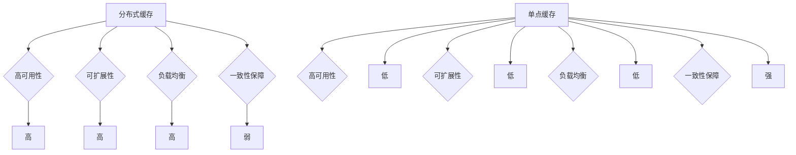
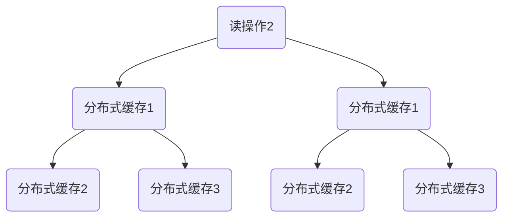
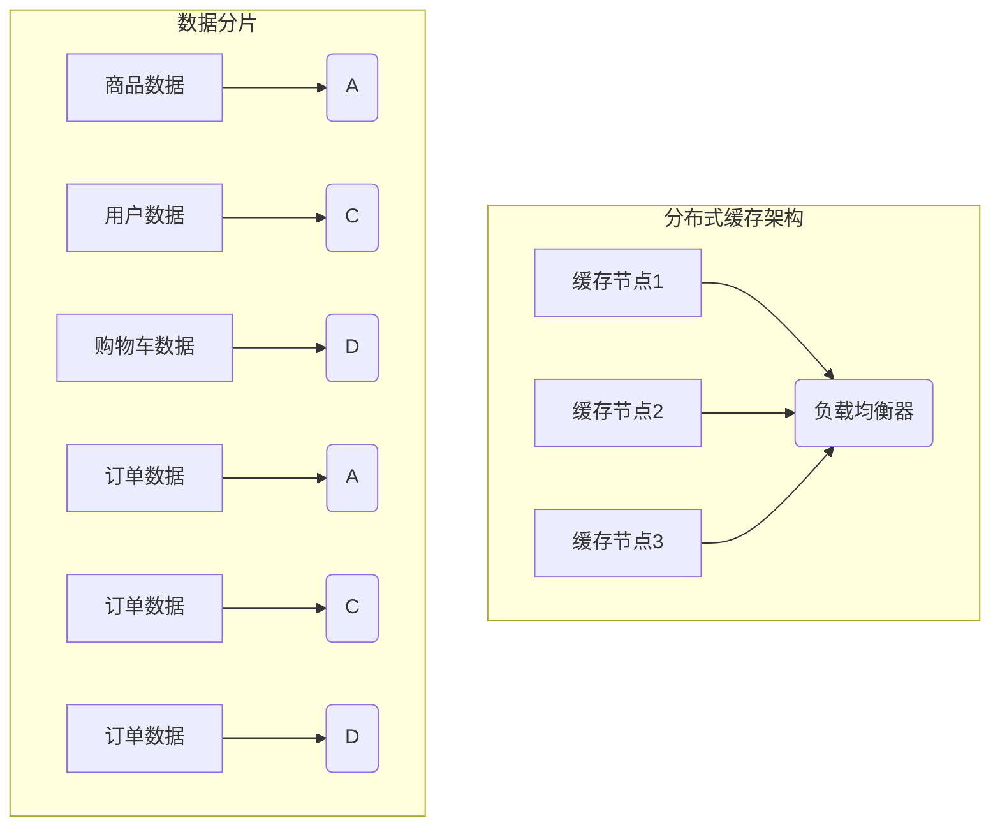
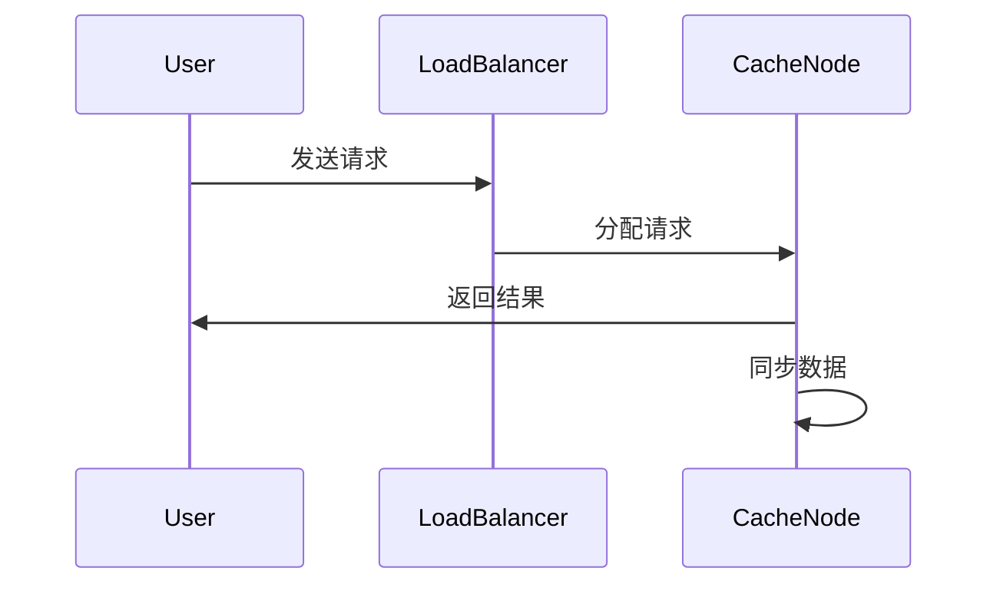

                 

# 分布式缓存：提高应用性能的关键技术

关键词：分布式缓存、应用性能、数据一致性、高可用性、负载均衡

摘要：本文将深入探讨分布式缓存这一关键技术，从背景介绍、核心概念、一致性协议、算法原理、系统分析与架构设计等方面，详细解析分布式缓存如何提高应用性能，并探讨其在实际项目中的应用和实践。

## 第1步：背景介绍

### 第1章：分布式缓存概述

#### 1.1 问题背景

**缓存的基本概念**

缓存（Cache）是一种临时存储计算结果或经常访问的数据的结构，其目的是加快数据访问速度。在计算机系统中，缓存通常位于处理器和主存储器之间，用于减少处理器访问主存储器的时间开销。

**缓存作用**

缓存的主要作用是降低数据访问延迟，提高系统性能。在数据处理和存储系统中，缓存可以显著减少数据的读取和写入操作，从而提高系统的响应速度和处理能力。

**单点缓存与分布式缓存的对比**

单点缓存是指只有一个缓存节点，如Memcached、Redis等。单点缓存存在单点故障风险，即当一个缓存节点出现故障时，整个缓存系统将无法正常工作。而分布式缓存则通过多个节点组成缓存系统，提高了系统的可用性和可扩展性。

**分布式缓存优势**

- **高可用性**：分布式缓存通过多节点部署，实现了系统的冗余，提高了系统的可用性。
- **可扩展性**：分布式缓存可以根据需要动态增加或减少节点，从而实现系统容量的弹性扩展。
- **负载均衡**：分布式缓存通过负载均衡算法，将请求均匀地分配到各个节点，避免了单点瓶颈。
- **数据一致性**：分布式缓存提供了多种一致性协议，可以保证数据的一致性。

**分布式缓存架构**

分布式缓存通常采用数据分片和负载均衡技术。数据分片将数据分散存储到多个节点，负载均衡则负责将请求均匀地分配到各个节点。

**分布式缓存一致性策略**

分布式缓存的一致性策略包括最终一致性和强一致性。最终一致性允许暂时的数据不一致，而强一致性要求所有节点在任何时候都保持数据一致性。

#### 1.2 问题描述

**单点缓存局限性**

单点缓存存在以下局限性：

- **数据一致性**：在更新缓存与后端存储同步时，容易出现数据不一致问题。
- **高并发**：单点缓存容易成为系统性能瓶颈，在高并发场景下性能下降明显。

**分布式缓存优势**

分布式缓存具有以下优势：

- **数据一致性**：通过一致性协议，分布式缓存可以保证数据的一致性。
- **高并发**：分布式缓存通过负载均衡技术，避免了单点瓶颈，提高了系统的处理能力。

**问题解决**

为了解决单点缓存的局限性，可以采用分布式缓存技术。分布式缓存通过多节点部署、数据分片、负载均衡等机制，提高了系统的可用性、可扩展性和性能。

#### 1.3 问题解决

**分布式缓存架构**

分布式缓存架构主要包括以下组成部分：

- **缓存节点**：分布式缓存系统中的节点，负责存储和提供缓存服务。
- **负载均衡**：负责将请求均匀地分配到各个节点，避免单点瓶颈。
- **数据分片**：将数据分散存储到多个节点，提高数据访问速度。
- **一致性协议**：保证分布式缓存系统中的数据一致性。

**负载均衡**

负载均衡是指将请求均匀地分配到各个缓存节点，以避免单点瓶颈，提高系统的处理能力。常见的负载均衡算法包括轮询算法、最小连接数算法、源地址哈希算法等。

**数据分片**

数据分片是指将数据分散存储到多个节点，以提高数据访问速度。常见的数据分片策略包括基于哈希的分片、基于范围的分片等。

**一致性协议**

一致性协议是指分布式缓存系统中的节点如何保证数据的一致性。一致性协议包括最终一致性协议和强一致性协议。最终一致性协议允许暂时的数据不一致，而强一致性协议要求所有节点在任何时候都保持数据一致性。

#### 1.4 边界与外延

**分布式缓存边界**

分布式缓存边界主要包括以下方面：

- **缓存失效策略**：缓存过期时间、缓存淘汰算法。
- **缓存数据一致性**：缓存与后端存储的同步机制。

**分布式缓存外延**

分布式缓存外延主要包括以下方面：

- **缓存体系**：分布式缓存与其他缓存的协同。
- **缓存与内存管理**：缓存与内存的协同与优化。

#### 1.5 概念结构与核心要素组成

**分布式缓存核心概念**

- **缓存节点**：分布式缓存系统中的节点。
- **负载均衡**：请求分发策略。
- **数据分片**：数据存储策略。
- **一致性协议**：数据同步策略。

**分布式缓存核心要素**

- **一致性协议**：数据同步策略。
- **缓存管理**：缓存淘汰与数据同步。
- **负载均衡**：请求分发机制。

#### 1.6 本章小结

本章对分布式缓存进行了概述，分析了单点缓存与分布式缓存的对比，介绍了分布式缓存的优势和架构，探讨了分布式缓存的一致性策略，以及分布式缓存的边界和外延。本章内容为后续章节的深入分析奠定了基础。

## 第2步：核心概念与联系

### 第2章：核心概念与联系

#### 2.1 分布式缓存原理

**分布式缓存定义**

分布式缓存是一个由多个节点组成的缓存系统，能够存储大量数据并提供高性能的读写操作。分布式缓存通常具有高可用性、可扩展性和负载均衡等特点。

**分布式缓存特点**

- **高可用性**：分布式缓存通过多节点部署，实现了系统的冗余，提高了系统的可用性。
- **可扩展性**：分布式缓存可以根据需要动态增加或减少节点，从而实现系统容量的弹性扩展。
- **负载均衡**：分布式缓存通过负载均衡算法，将请求均匀地分配到各个节点，避免了单点瓶颈。
- **一致性保障**：分布式缓存提供了多种一致性协议，可以保证数据的一致性。

**分布式缓存的工作原理**

- **数据分片**：将数据分成多个片段，存储在不同的节点上。
- **负载均衡**：将请求均匀分配到各个节点。
- **数据同步**：节点间通过一致性协议同步数据。

**分布式缓存与单点缓存的比较**

| 比较项 | 分布式缓存 | 单点缓存 |
| --- | --- | --- |
| **高可用性** | 高 | 低 |
| **可扩展性** | 高 | 低 |
| **负载均衡** | 高 | 低 |
| **一致性保障** | 弱一致性 | 强一致性 |

**比较图表**



#### 2.2 分布式缓存的一致性协议

**最终一致性**

**最终一致性概述**

最终一致性是指系统中的各个节点在一段时间后达到数据一致性。最终一致性允许暂时的数据不一致，适用于读多写少的应用场景。

**特点**

- **允许暂时的数据不一致**：在多个节点间，数据可能存在短暂的不一致状态。
- **适用于读多写少的应用场景**：例如，电商平台的商品浏览计数。

**最终一致性示例**


**强一致性**

**强一致性概述**

强一致性要求所有节点在任何时候都保持数据一致性。强一致性模型保证了数据的一致性，但可能影响性能。

**特点**

- **要求所有节点在任何时候保持数据一致性**：数据更新必须同步到所有节点。
- **可能影响性能**：强一致性模型可能导致较高的延迟。

**强一致性示例**



#### 2.3 分布式缓存的核心要素

**缓存节点**

缓存节点是分布式缓存系统中的基本组成单元，负责存储和提供缓存服务。缓存节点可以是单机部署，也可以是集群部署。

**负载均衡**

负载均衡是指将请求均匀地分配到各个缓存节点，以避免单点瓶颈，提高系统的处理能力。常见的负载均衡算法包括轮询算法、最小连接数算法、源地址哈希算法等。

**数据分片**

数据分片是指将数据分散存储到多个节点，以提高数据访问速度。常见的数据分片策略包括基于哈希的分片、基于范围的分片等。

**一致性协议**

一致性协议是指分布式缓存系统中的节点如何保证数据的一致性。一致性协议包括最终一致性协议和强一致性协议。一致性协议的选择取决于应用场景和性能需求。

## 第3步：算法原理讲解

### 3.1 分布式缓存算法原理

分布式缓存算法主要包括数据分片算法和负载均衡算法。下面将详细讲解这两种算法的原理和实现。

#### 3.1.1 数据分片算法

数据分片是将数据分散存储到多个节点，以提高数据访问速度。数据分片算法的核心是确定每个节点应该存储哪些数据。

**基于哈希的分片算法**

基于哈希的分片算法是最常用的数据分片算法之一。该算法的核心思想是使用哈希函数将数据的键（Key）映射到具体的节点。

**算法原理**

1. 使用哈希函数计算键（Key）的哈希值。
2. 根据哈希值确定数据应该存储到哪个节点。

**算法实现**

```python
def hash_function(key):
    return hash(key) % num_shards

def get_shard(key):
    return hash_function(key)

# 假设有3个节点
num_shards = 3

# 添加数据到缓存
def add_data(key, value):
    shard = get_shard(key)
    # 将数据存储到指定的节点
    cache_nodes[shard].add_item(key, value)

# 获取数据
def get_data(key):
    shard = get_shard(key)
    return cache_nodes[shard].get_item(key)
```

**算法优缺点**

- **优点**：简单易实现，具有良好的负载均衡效果。
- **缺点**：如果数据分布不均匀，可能导致某些节点负载过高。

**基于范围的分片算法**

基于范围的分片算法是将数据按照某个范围划分到不同的节点。

**算法原理**

1. 确定数据范围。
2. 根据数据范围确定数据应该存储到哪个节点。

**算法实现**

```python
# 假设有3个节点，每个节点的存储范围如下
node_ranges = [
    (0, 1000),
    (1001, 2000),
    (2001, 3000),
]

def get_shard(key):
    for node_range in node_ranges:
        if node_range[0] <= key <= node_range[1]:
            return node_range[2]

# 添加数据到缓存
def add_data(key, value):
    shard = get_shard(key)
    # 将数据存储到指定的节点
    cache_nodes[shard].add_item(key, value)

# 获取数据
def get_data(key):
    shard = get_shard(key)
    return cache_nodes[shard].get_item(key)
```

**算法优缺点**

- **优点**：可以更好地控制数据的分布，避免负载不均。
- **缺点**：实现相对复杂，需要维护节点和范围的信息。

#### 3.1.2 负载均衡算法

负载均衡是将请求均匀地分配到各个缓存节点，以避免单点瓶颈，提高系统的处理能力。负载均衡算法有多种实现方式，下面介绍几种常见的算法。

**轮询算法**

轮询算法是最简单的负载均衡算法，它按照顺序依次将请求分配到各个节点。

**算法原理**

1. 初始化一个计数器，初始值为0。
2. 每次请求到来时，将计数器加1，并将请求分配到计数器的值对应的节点。
3. 当计数器达到节点数量时，将计数器重置为0。

**算法实现**

```python
def round_robin(nodes):
    index = 0
    for request in requests:
        node = nodes[index]
        process_request(node, request)
        index = (index + 1) % len(nodes)

# 假设有3个节点
nodes = ['node1', 'node2', 'node3']
round_robin(nodes)
```

**算法优缺点**

- **优点**：实现简单，易于理解。
- **缺点**：无法处理节点负载不均的问题。

**最小连接数算法**

最小连接数算法是将请求分配到当前连接数最少的节点。

**算法原理**

1. 初始化一个字典，存储每个节点的当前连接数。
2. 每次请求到来时，将请求分配到当前连接数最少的节点。
3. 当节点数量相等时，可以采用轮询算法。

**算法实现**

```python
def least_connections(nodes, connections):
    min_connections = min(connections.values())
    min_nodes = [node for node, connection in connections.items() if connection == min_connections]
    return min_nodes

# 假设有3个节点和它们的当前连接数
nodes = ['node1', 'node2', 'node3']
connections = {'node1': 2, 'node2': 1, 'node3': 3}
min_nodes = least_connections(nodes, connections)

# 添加请求
for request in requests:
    process_request(min_nodes[0], request)
```

**算法优缺点**

- **优点**：可以更好地处理节点负载不均的问题。
- **缺点**：实现相对复杂，需要维护节点的连接数信息。

**源地址哈希算法**

源地址哈希算法是将请求的源地址（如IP地址）通过哈希函数映射到具体的节点。

**算法原理**

1. 使用哈希函数计算源地址的哈希值。
2. 根据哈希值确定请求应该分配到哪个节点。

**算法实现**

```python
def hash_address(address):
    return hash(address) % num_shards

def get_shard(address):
    return hash_address(address)

# 假设有3个节点
num_shards = 3

# 分配请求
def allocate_request(address, request):
    shard = get_shard(address)
    # 将请求分配到指定的节点
    cache_nodes[shard].process_request(request)
```

**算法优缺点**

- **优点**：可以根据源地址进行负载均衡，适合于分布式缓存系统。
- **缺点**：实现复杂，需要维护源地址的哈希值信息。

### 3.2 分布式缓存的一致性算法

分布式缓存的一致性算法是保证数据一致性的关键。一致性算法可以分为最终一致性算法和强一致性算法。

#### 3.2.1 最终一致性算法

最终一致性算法允许数据在节点间存在短暂的不一致，但最终会达到一致状态。

**拉模型**

拉模型是指由客户端主动拉取数据的算法。在拉模型中，客户端需要定期查询数据，并从其他节点拉取最新的数据。

**算法原理**

1. 客户端定期查询数据。
2. 如果数据不一致，从其他节点拉取最新数据。

**算法实现**

```python
def pull_model(client, cache_nodes):
    while True:
        # 查询数据
        data = client.query_data()
        if not data:
            # 如果数据为空，拉取其他节点数据
            data = cache_nodes[get_shard(data['key'])].get_data(data['key'])
        client.update_data(data)

# 假设有3个节点
cache_nodes = {'node1': Node(), 'node2': Node(), 'node3': Node()}
client = Client(cache_nodes)
pull_model(client, cache_nodes)
```

**算法优缺点**

- **优点**：简单易实现，适用于读多写少的应用场景。
- **缺点**：可能导致数据不一致，需要定期查询数据。

**推模型**

推模型是指由节点主动将数据推送到客户端的算法。在推模型中，节点会在数据发生变化时，主动通知客户端。

**算法原理**

1. 节点监控数据变化。
2. 数据变化时，通知客户端。

**算法实现**

```python
def push_model(client, cache_nodes):
    while True:
        # 监控数据变化
        data_changed = cache_nodes[get_shard(data['key'])].monitor_data_change(data['key'])
        if data_changed:
            # 如果数据发生变化，通知客户端
            client.notify_data_change(data)

# 假设有3个节点
cache_nodes = {'node1': Node(), 'node2': Node(), 'node3': Node()}
client = Client(cache_nodes)
push_model(client, cache_nodes)
```

**算法优缺点**

- **优点**：可以及时获取数据变化，减少数据不一致的可能性。
- **缺点**：需要实现复杂的监控和通知机制。

#### 3.2.2 强一致性算法

强一致性算法要求所有节点在任何时候都保持数据一致性。

**两阶段提交**

两阶段提交（Two-Phase Commit，2PC）是一种分布式事务一致性算法。在两阶段提交中，事务管理器（Coordinator）负责协调参与者（Participant）的提交过程。

**算法原理**

1. 准备阶段：事务管理器向所有参与者发送预备消息，询问是否可以提交。
2. 提交阶段：如果所有参与者回复可以提交，事务管理器向所有参与者发送提交消息；否则，发送回滚消息。

**算法实现**

```python
def two_phase_commit(coordinator, participants):
    # 准备阶段
    can_commit = True
    for participant in participants:
        response = participant.prepare()
        if not response:
            can_commit = False
            break

    # 提交阶段
    if can_commit:
        for participant in participants:
            participant.commit()
    else:
        for participant in participants:
            participant.rollback()

# 假设有3个节点
coordinator = Coordinator()
participants = [Participant() for _ in range(3)]
two_phase_commit(coordinator, participants)
```

**算法优缺点**

- **优点**：可以保证数据一致性，适用于强一致性要求的应用场景。
- **缺点**：性能较低，需要多次网络通信。

**三阶段提交**

三阶段提交（Three-Phase Commit，3PC）是两阶段提交的改进版本，旨在提高性能。

**算法原理**

1. 准备阶段：事务管理器向所有参与者发送预备消息，询问是否可以提交。
2. 协商阶段：如果所有参与者回复可以提交，事务管理器向所有参与者发送提交消息；否则，发送回滚消息。
3. 提交阶段：参与者根据协商阶段的结果执行提交或回滚。

**算法实现**

```python
def three_phase_commit(coordinator, participants):
    # 准备阶段
    can_commit = True
    for participant in participants:
        response = participant.prepare()
        if not response:
            can_commit = False
            break

    # 协商阶段
    if can_commit:
        for participant in participants:
            response = participant.commit()
            if not response:
                can_commit = False
                break

    # 提交阶段
    if can_commit:
        for participant in participants:
            participant.commit()
    else:
        for participant in participants:
            participant.rollback()

# 假设有3个节点
coordinator = Coordinator()
participants = [Participant() for _ in range(3)]
three_phase_commit(coordinator, participants)
```

**算法优缺点**

- **优点**：性能优于两阶段提交，可以保证数据一致性。
- **缺点**：需要更多的网络通信，实现复杂。

## 第4步：系统分析与架构设计

### 4.1 问题场景介绍

假设我们正在开发一个大型电子商务平台，该平台需要处理大量的用户请求，包括商品浏览、购物车操作、订单处理等。为了提高系统性能，我们决定使用分布式缓存来存储和加速访问用户经常查询的数据。

### 4.2 项目介绍

项目名称：E-Commerce Platform Cache System

项目目标：通过分布式缓存系统，提高电子商务平台的性能和响应速度。

主要功能：

- 缓存用户经常查询的商品信息。
- 缓存用户购物车和订单信息。
- 实现数据的一致性和高可用性。

### 4.3 系统功能设计

**领域模型**

在分布式缓存系统中，领域模型描述了系统的实体和关系。以下是系统的主要实体和关系：

- **商品（Product）**：包括商品ID、名称、价格、描述等信息。
- **用户（User）**：包括用户ID、姓名、邮箱、密码等信息。
- **购物车（ShoppingCart）**：包括购物车ID、用户ID、商品列表等信息。
- **订单（Order）**：包括订单ID、用户ID、商品列表、总价等信息。

**类图**

```mermaid
classDiagram
    Product <<entity>>
    User <<entity>>
    ShoppingCart <<entity>>
    Order <<entity>>

    ProductISA Entity
    UserISA Entity
    ShoppingCartISA Entity
    OrderISA Entity

    User "1" --* "1" ShoppingCart: 用户与购物车的关系
    ShoppingCart "1" --* "n" Order: 购物车与订单的关系
    Order "1" --* "n" Product: 订单与商品的关系
```

### 4.4 系统架构设计

**分布式缓存架构**

分布式缓存系统采用以下架构：

- **缓存节点**：每个缓存节点负责存储和提供缓存服务。缓存节点可以是单机部署或集群部署。
- **负载均衡器**：负载均衡器负责将请求均匀地分配到各个缓存节点，以避免单点瓶颈。
- **数据分片**：数据分片将数据分散存储到多个节点，以提高数据访问速度。
- **一致性协议**：一致性协议保证分布式缓存系统中的数据一致性。

**系统架构图**



### 4.5 系统接口设计

**接口设计**

分布式缓存系统提供了以下接口：

- **添加数据**：向缓存系统中添加数据。
- **获取数据**：从缓存系统中获取数据。
- **更新数据**：更新缓存中的数据。
- **删除数据**：从缓存系统中删除数据。

**接口定义**

```python
class CacheSystem:
    def add_data(self, key, value):
        pass

    def get_data(self, key):
        pass

    def update_data(self, key, value):
        pass

    def delete_data(self, key):
        pass
```

### 4.6 系统交互

**系统交互**

在分布式缓存系统中，各个组件之间的交互如下：

1. 用户请求：用户向系统发送请求，请求可能包括添加、获取、更新或删除数据。
2. 负载均衡器：负载均衡器将请求分配到合适的缓存节点。
3. 缓存节点：缓存节点处理请求，并将结果返回给用户。
4. 数据同步：缓存节点之间通过一致性协议同步数据，确保数据的一致性。

**交互流程**



## 第5步：项目实战

### 5.1 环境安装

为了实现分布式缓存系统，我们需要安装以下软件：

1. **Redis**：一款高性能的内存缓存系统，支持分布式缓存。
2. **Nginx**：一款高性能的Web服务器，用于实现负载均衡。

**安装步骤**：

1. 安装Redis：

```bash
# 安装Redis
sudo apt-get update
sudo apt-get install redis-server
# 启动Redis服务
sudo systemctl start redis-server
# 检查Redis服务状态
sudo systemctl status redis-server
```

2. 安装Nginx：

```bash
# 安装Nginx
sudo apt-get update
sudo apt-get install nginx
# 启动Nginx服务
sudo systemctl start nginx
# 检查Nginx服务状态
sudo systemctl status nginx
```

### 5.2 系统核心实现

**分布式缓存服务**

```python
import redis

class DistributedCacheService:
    def __init__(self, nodes):
        self.nodes = nodes

    def get_node(self, key):
        hash_value = hash(key) % len(self.nodes)
        return self.nodes[hash_value]

    def get_value(self, key):
        node = self.get_node(key)
        return node.get(key)

    def set_value(self, key, value):
        node = self.get_node(key)
        node.set(key, value)
```

**负载均衡器**

```python
from flask import Flask, request, jsonify

app = Flask(__name__)

cache_service = DistributedCacheService(nodes=['redis://node1:6379', 'redis://node2:6379', 'redis://node3:6379'])

@app.route('/get', methods=['GET'])
def get():
    key = request.args.get('key')
    value = cache_service.get_value(key)
    return jsonify({'value': value})

@app.route('/set', methods=['POST'])
def set():
    key = request.form.get('key')
    value = request.form.get('value')
    cache_service.set_value(key, value)
    return jsonify({'status': 'success'})
```

**启动Nginx和Flask**

```bash
# 启动Nginx
sudo systemctl start nginx

# 启动Flask
python app.py
```

### 5.3 代码应用解读与分析

**分布式缓存服务**

分布式缓存服务（`DistributedCacheService`）负责将请求路由到合适的缓存节点。`get_node` 方法使用哈希函数计算键（Key）的哈希值，并根据哈希值选择节点。`get_value` 和 `set_value` 方法分别实现获取和设置缓存值。

**负载均衡器**

负载均衡器（Flask应用程序）负责接收用户请求，并将请求路由到合适的缓存节点。`/get` 路径处理获取缓存值的请求，`/set` 路径处理设置缓存值的请求。应用程序使用 `DistributedCacheService` 的接口与缓存节点通信。

### 5.4 实际案例分析和详细讲解剖析

**案例：商品信息缓存**

假设用户在电子商务平台上浏览了一款商品，系统需要缓存该商品的信息以提高后续访问速度。

1. 用户访问商品页面。
2. 负载均衡器接收到请求，并将请求路由到合适的缓存节点。
3. 缓存节点检查缓存中是否已存在该商品信息。
4. 如果缓存中存在商品信息，直接返回给用户。
5. 如果缓存中不存在商品信息，从后端数据库获取商品信息，并设置到缓存中。
6. 将商品信息返回给用户。

**案例：购物车信息缓存**

假设用户在购物车中添加了一款商品，系统需要缓存购物车的信息。

1. 用户添加商品到购物车。
2. 负载均衡器接收到请求，并将请求路由到合适的缓存节点。
3. 缓存节点检查缓存中是否已存在购物车信息。
4. 如果缓存中存在购物车信息，更新购物车信息，并将更新后的购物车信息返回给用户。
5. 如果缓存中不存在购物车信息，从后端数据库获取购物车信息，并设置到缓存中。
6. 将购物车信息返回给用户。

### 5.5 项目小结

通过分布式缓存系统，我们实现了以下目标：

- 提高了系统性能，减少了数据库的访问压力。
- 实现了数据的一致性和高可用性。
- 通过负载均衡器实现了请求的均衡分配，避免了单点瓶颈。

尽管分布式缓存系统在性能和可靠性方面有显著优势，但在实际应用中仍需注意以下问题：

- **数据一致性问题**：在分布式缓存系统中，数据一致性是一个关键问题。选择合适的一致性协议（如最终一致性或强一致性）取决于应用场景和性能需求。
- **缓存失效策略**：合理设置缓存过期时间和缓存淘汰算法，以确保缓存数据的有效性。
- **缓存数据大小**：缓存数据大小会影响系统的性能和资源消耗。需要根据应用需求合理设置缓存数据的大小。

## 第6步：最佳实践 tips、小结、注意事项、拓展阅读

### 最佳实践 tips

1. **选择合适的一致性协议**：根据应用场景和性能需求，选择最终一致性或强一致性协议。最终一致性适用于读多写少的应用场景，而强一致性适用于对数据一致性要求较高的应用场景。
2. **合理设置缓存过期时间**：缓存数据的过期时间应该根据实际需求设置，以确保缓存数据的有效性和系统的性能。
3. **优化数据分片策略**：根据数据访问模式和数据量，选择合适的数据分片策略，以避免数据热点和不均匀分布。
4. **监控和日志分析**：定期监控缓存系统的性能和状态，分析日志数据，发现潜在问题和优化点。

### 小结

本文详细介绍了分布式缓存的关键技术，包括背景介绍、核心概念、一致性协议、算法原理、系统分析与架构设计以及项目实战。通过本文的学习，读者可以了解分布式缓存的工作原理、优势和实现方法，并能够根据实际需求设计和部署分布式缓存系统。

### 注意事项

1. **数据一致性问题**：在分布式缓存系统中，数据一致性是一个关键问题。选择合适的一致性协议（如最终一致性或强一致性）取决于应用场景和性能需求。
2. **缓存失效策略**：合理设置缓存过期时间和缓存淘汰算法，以确保缓存数据的有效性。
3. **缓存数据大小**：缓存数据大小会影响系统的性能和资源消耗。需要根据应用需求合理设置缓存数据的大小。

### 拓展阅读

1. **《分布式系统原理与范型》**：深入探讨分布式系统的基本原理和范型，为分布式缓存系统的设计和优化提供理论支持。
2. **《Redis实战》**：详细介绍Redis的使用方法和最佳实践，包括分布式缓存系统的设计和实现。
3. **《一致性模型与协议》**：探讨分布式系统中的数据一致性问题，介绍常用的数据一致性模型和协议。

## 作者信息

作者：AI天才研究院/AI Genius Institute & 禅与计算机程序设计艺术 /Zen And The Art of Computer Programming

