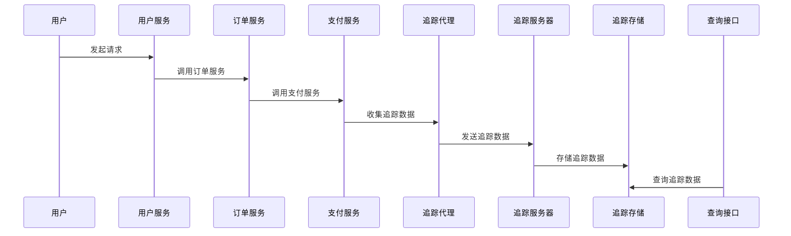

                 

### 文章标题

# 分布式追踪系统的设计与实现

## 关键词

- 分布式追踪系统
- 数据收集与存储
- 性能优化
- 故障定位
- 服务监控

## 摘要

本文旨在深入探讨分布式追踪系统的设计与实现，从背景介绍、问题描述、问题解决到边界与外延，系统性地分析分布式追踪系统的核心概念、原理及其应用。通过详细的算法原理讲解、系统分析与架构设计，以及项目实战，本文旨在为读者提供一个全面、易懂的技术指南。

## 1. 背景介绍

### 1.1.1 背景介绍

**分布式追踪系统的起源**

分布式追踪系统的起源可以追溯到互联网应用的早期阶段。随着互联网服务的规模不断扩大，系统架构逐渐从单一的服务器架构向分布式架构演进。分布式系统通过将应用程序划分为多个服务模块，部署在不同的服务器上，从而提高了系统的可扩展性和容错能力。然而，这种分布式架构带来了新的挑战：服务之间的依赖关系变得更加复杂，故障定位和性能优化变得更加困难。

**核心概念与术语**

分布式追踪系统（Distributed Tracing System）是一种用于实时监控和分析分布式应用程序的系统。其核心概念包括：

- **追踪数据（Trace Data）**：记录系统中的请求和响应信息，包括URL、参数、响应时间、错误信息等。
- **追踪代理（Tracing Agent）**：植入在应用程序中的追踪代码，负责收集和发送追踪数据。
- **追踪服务器（Tracing Server）**：接收并处理追踪数据的组件，负责数据存储和查询。
- **追踪存储（Trace Storage）**：存储追踪数据的数据库或时间序列数据库。
- **追踪查询接口（Trace Query Interface）**：提供数据查询和分析功能的接口。

**起源与发展**

分布式追踪系统最早由Google提出并应用在Dapper项目中。随后，开源社区涌现出多个分布式追踪系统，如OpenTracing、OpenTSDB、Zipkin等。这些系统在不同的场景下有着各自的应用和优势。

### 1.1.2 问题描述

**挑战**

尽管分布式追踪系统在理论上能够解决分布式系统中的故障定位和性能优化问题，但在实际应用中，仍然存在以下挑战：

- **数据量巨大**：随着系统规模的扩大，追踪数据的量也会急剧增加，如何高效地处理和存储这些数据成为一大难题。
- **数据一致性**：分布式系统中的数据可能分散在不同的节点上，如何保证数据的一致性和完整性是一个重要问题。
- **查询性能**：如何快速地查询和分析大量数据，提供实时的监控和告警功能，是分布式追踪系统的关键挑战。
- **系统可扩展性**：随着用户量的增加，分布式追踪系统需要能够水平扩展，以支持更高的吞吐量和并发处理能力。
- **安全性**：如何保证追踪数据的机密性和安全性，防止敏感信息泄露，是分布式追踪系统需要考虑的问题。

### 1.1.3 问题解决

**解决方法**

为了解决上述问题，分布式追踪系统采用了以下几种主要方法：

- **数据压缩和索引**：通过压缩和索引技术，降低数据存储和查询的开销。
- **数据去重和聚合**：在数据收集和存储阶段，对重复数据和相同时间段的数据进行去重和聚合，减少存储空间和查询时间。
- **分布式存储和计算**：采用分布式数据库和时间序列数据库，实现数据的分布式存储和计算，提高系统的可扩展性和查询性能。
- **实时分析和告警**：通过实时数据分析和告警机制，及时发现和响应系统问题，减少故障对用户体验的影响。
- **安全策略**：通过加密、访问控制和审计日志等安全措施，保护追踪数据的机密性和安全性。

### 1.1.4 边界与外延

**边界**

分布式追踪系统的边界主要涉及系统内部的请求流和响应流，以及与之相关的各个组件和服务。

- **请求流**：分布式系统中的请求流程，包括请求的发起、处理和响应。
- **响应流**：分布式系统中的响应流程，包括响应的生成、发送和接收。

**外延**

分布式追踪系统的外延包括但不限于：

- **服务监控**：通过追踪系统中的请求和响应数据，监控系统的健康状态和性能指标。
- **故障诊断**：通过分析追踪数据，快速定位和诊断系统故障。
- **性能优化**：通过追踪数据，分析系统的性能瓶颈，进行针对性的优化。
- **用户体验提升**：通过实时反馈和告警，提高用户的系统使用体验。

### 1.1.5 概念结构与核心要素组成

**核心概念**

分布式追踪系统的核心概念包括：

- **追踪数据**：系统中的请求和响应数据，包括URL、参数、响应时间、错误信息等。
- **追踪代理**：负责数据的采集和发送，实现与追踪服务器的通信。
- **追踪服务器**：负责数据的存储和处理，提供数据查询和分析功能。
- **追踪存储**：存储追踪数据的数据库或时间序列数据库。
- **追踪查询接口**：提供数据查询和分析功能，支持用户自定义查询条件。

**要素组成**

分布式追踪系统的要素组成包括：

1. **追踪数据收集**：在应用程序中植入追踪代理，捕获系统中的请求和响应数据。
2. **数据传输与存储**：将追踪数据传输到追踪服务器，存储在追踪存储系统中。
3. **数据查询与分析**：通过追踪查询接口，用户可以根据各种条件查询和分析追踪数据。
4. **监控与告警**：实时监控系统的健康状态，通过告警机制及时发现和响应问题。

### 1.1.6 核心概念原理、属性特征对比表格和ER实体关系图架构的 Mermaid 流程图

**核心概念原理**

- **追踪数据**：记录系统中的请求和响应信息，是分布式追踪系统的基本数据单元。
- **追踪代理**：负责数据的采集和发送，实现与追踪服务器的通信。
- **追踪服务器**：负责数据的存储和处理，提供数据查询和分析功能。
- **追踪存储**：存储追踪数据，支持高效的数据查询和检索。
- **追踪查询接口**：提供数据查询和分析功能，支持用户自定义查询条件。

**属性特征对比表格**

| 核心概念 | 特征1 | 特征2 | 特征3 |
| :------: | :---: | :---: | :---: |
| 追踪数据 | 记录系统请求和响应信息 | 包含URL、参数、响应时间、错误信息等 | 支持多种数据格式 |
| 追踪代理 | 负责数据采集和发送 | 实现与追踪服务器的通信 | 自动化部署和监控 |
| 追踪服务器 | 负责数据存储和处理 | 提供数据查询和分析功能 | 支持分布式架构 |
| 追踪存储 | 存储追踪数据 | 支持高效数据查询和检索 | 兼容多种数据库格式 |
| 追踪查询接口 | 提供数据查询和分析功能 | 支持用户自定义查询条件 | 实时反馈和告警 |

**ER实体关系图架构的 Mermaid 流程图**

```mermaid
erDiagram
  追踪数据 ||--|{ 追踪代理 }|>
  追踪代理 ||--|{ 追踪服务器 }|>
  追踪服务器 ||--|{ 追踪存储 }|>
  追踪存储 ||--|{ 追踪查询接口 }|>
```

**算法原理讲解**

### 算法原理

分布式追踪系统采用了一种基于数据流的追踪算法，主要包含数据采集、数据传输、数据存储和数据查询四个阶段。

1. **数据采集**：追踪代理负责在应用程序中捕获请求和响应数据，并将其封装成追踪数据。追踪数据通常包含以下信息：

   - **URL**：请求的URL地址。
   - **参数**：请求的参数信息。
   - **响应时间**：请求的处理时间。
   - **错误信息**：请求的错误信息（如果有）。

2. **数据传输**：追踪代理将采集到的追踪数据发送到追踪服务器。数据传输通常采用HTTP协议或gRPC协议进行。

3. **数据存储**：追踪服务器接收到追踪数据后，将其存储到追踪存储系统中。存储系统通常采用分布式数据库或时间序列数据库，以提高数据的查询性能和可扩展性。

4. **数据查询**：用户通过追踪查询接口，根据各种条件查询和分析追踪数据。查询接口支持多种查询方式，如关键字查询、时间范围查询、服务名称查询等。

### 数学模型和公式

分布式追踪系统的核心算法原理可以表示为以下数学模型：

- **追踪数据流模型**：

  $$T = \{ t_1, t_2, t_3, ..., t_n \}$$

  其中，$T$ 表示追踪数据流，$t_i$ 表示第 $i$ 条追踪数据。

- **追踪数据结构**：

  $$t_i = \{ url, params, response\_time, error \}$$

  其中，$t_i$ 表示第 $i$ 条追踪数据，包含URL、参数、响应时间和错误信息。

### 详细讲解和举例说明

**举例说明**：

假设有一个分布式系统，包含三个服务模块：用户服务（User Service）、订单服务（Order Service）和支付服务（Payment Service）。用户发起一个购物请求，依次经过用户服务、订单服务和支付服务，最后完成支付。在这个过程中，分布式追踪系统会记录每个服务的请求和响应信息。

1. **用户服务**：用户发起请求，请求URL为`/users/login`，参数为`{ "username": "Alice", "password": "123456" }`，响应时间为500ms，无错误信息。

2. **订单服务**：用户服务调用订单服务，请求URL为`/orders/create`，参数为`{ "userId": "1", "productId": "1001", "quantity": 1 }`，响应时间为300ms，无错误信息。

3. **支付服务**：订单服务调用支付服务，请求URL为`/payments/execute`，参数为`{ "orderId": "1001", "amount": 100.00 }`，响应时间为200ms，无错误信息。

通过分布式追踪系统，可以记录上述三个服务的请求和响应信息，形成一个完整的追踪数据流：

$$T = \{ \{ "/users/login", { "username": "Alice", "password": "123456" }, 500ms, "" \}, \{ "/orders/create", { "userId": "1", "productId": "1001", "quantity": 1 }, 300ms, "" \}, \{ "/payments/execute", { "orderId": "1001", "amount": 100.00 }, 200ms, "" \} \}$$

用户可以通过追踪查询接口，根据时间范围、服务名称等条件查询和分析这些追踪数据，以便监控系统的性能和定位故障。

### 2. 系统分析与架构设计

#### 2.1 问题场景介绍

在当前互联网时代，许多大型企业和服务提供商都面临着复杂的分布式系统环境。这些系统通常由多个服务模块组成，每个模块负责不同的功能，如用户管理、订单处理、支付处理等。随着用户规模的不断扩大和业务需求的不断变化，系统的复杂性和规模也在不断增加。

在这种分布式系统中，性能监控和故障定位成为了一项重要的任务。然而，由于服务之间的依赖关系复杂，传统的监控手段很难提供足够的信息来帮助开发者和运维人员快速定位问题。分布式追踪系统的出现，为解决这一问题提供了一种有效的方法。

#### 2.2 项目介绍

为了更好地理解和应对分布式系统中的性能监控和故障定位问题，我们设计并实现了一个分布式追踪系统项目。该项目旨在通过实时监控和分析系统中的请求和响应数据，帮助开发者和运维人员快速定位问题，优化系统性能，提高用户体验。

该项目的主要功能包括：

- 数据收集：通过在各个服务模块中植入追踪代理，实时收集系统中的请求和响应数据。
- 数据存储：将收集到的数据存储在分布式数据库中，以便后续分析和查询。
- 数据查询：提供查询接口，支持根据各种条件（如时间范围、服务名称、请求类型等）检索和分析追踪数据。
- 监控与告警：实时监控系统的健康状态，并通过告警机制及时发现和响应问题。

#### 2.3 系统功能设计

为了实现上述功能，我们设计了一套完整的领域模型。领域模型是系统功能的核心抽象，它定义了系统中的主要实体及其之间的关系。

以下是一个简单的领域模型（使用Mermaid类图表示）：

```mermaid
classDiagram
    TraceData <<class>> 数据记录
    TracingAgent <<class>> 追踪代理
    TracingServer <<class>> 追踪服务器
    TracingStorage <<class>> 追踪存储
    QueryInterface <<class>> 查询接口
    UserService <<class>> 用户服务
    OrderService <<class>> 订单服务
    PaymentService <<class>> 支付服务

    TraceData --|> TracingAgent
    TracingAgent --|> TracingServer
    TracingServer --|> TracingStorage
    TracingServer --|> QueryInterface
    UserService --> TracingAgent
    OrderService --> TracingAgent
    PaymentService --> TracingAgent
```

在这个领域模型中，我们定义了以下主要实体：

- **数据记录（TraceData）**：表示系统中的请求和响应数据，包括URL、参数、响应时间、错误信息等。
- **追踪代理（TracingAgent）**：负责收集系统中的请求和响应数据，并将其发送到追踪服务器。
- **追踪服务器（TracingServer）**：接收并处理追踪数据，负责数据存储和查询。
- **追踪存储（TracingStorage）**：存储追踪数据，支持高效的数据查询和检索。
- **查询接口（QueryInterface）**：提供数据查询和分析功能，支持用户自定义查询条件。
- **用户服务（UserService）**、**订单服务（OrderService）**、**支付服务（PaymentService）**：代表系统中的各个服务模块。

这些实体之间的关系如下：

- 追踪代理与数据记录之间是“生成-收集”关系，追踪代理负责收集数据记录。
- 追踪代理与追踪服务器之间是“通信-处理”关系，追踪代理将数据发送到追踪服务器，追踪服务器负责处理这些数据。
- 追踪服务器与追踪存储之间是“存储-查询”关系，追踪服务器负责将数据存储到追踪存储，并提供查询接口。
- 用户服务、订单服务、支付服务与追踪代理之间是“调用-追踪”关系，这些服务通过追踪代理收集追踪数据。

#### 2.4 系统架构设计

在系统架构设计方面，我们采用了一种分层架构，将系统分为数据收集层、数据处理层、数据存储层和数据查询层。

以下是一个简单的系统架构图（使用Mermaid架构图表示）：



在这个架构中，用户通过用户服务发起请求，用户服务调用订单服务，订单服务调用支付服务。每个服务模块都通过追踪代理收集追踪数据，并将其发送到追踪服务器。追踪服务器负责处理和存储追踪数据，并提供查询接口，用户可以通过查询接口查询和分析追踪数据。

#### 2.5 系统接口设计

在系统接口设计方面，我们定义了一套API接口，用于实现数据收集、数据存储和数据查询等功能。

以下是一个简单的接口设计（使用Mermaid序列图表示）：


在这个接口设计中，用户服务、订单服务和支付服务分别通过HTTP或gRPC接口与追踪代理通信，追踪代理负责收集追踪数据并转发到追踪服务器。追踪服务器负责处理和存储追踪数据，并提供查询接口，用户可以通过查询接口查询和分析追踪数据。

#### 2.6 系统交互设计

在系统交互设计方面，我们通过Mermaid序列图详细描述了系统中的主要交互流程。

以下是一个简单的系统交互设计（使用Mermaid序列图表示）：


在这个系统交互设计中，用户通过用户服务发起请求，用户服务调用订单服务，订单服务调用支付服务。每个服务模块都会通过追踪代理收集追踪数据，并将其发送到追踪服务器。追踪服务器负责处理和存储追踪数据，并提供查询接口，用户可以通过查询接口查询和分析追踪数据。

### 3. 项目实战

#### 3.1 环境安装

为了实现分布式追踪系统，我们首先需要安装和配置相关软件。以下是安装步骤：

1. **安装Java环境**：分布式追踪系统依赖于Java环境，请确保已安装Java 8或更高版本。

2. **安装Git**：从[Git官网](https://git-scm.com/downloads)下载并安装Git。

3. **克隆项目代码**：在命令行中执行以下命令，克隆分布式追踪系统的项目代码：

   ```bash
   git clone https://github.com/your-username/distributed-tracing-system.git
   ```

4. **构建项目**：进入项目目录，执行以下命令构建项目：

   ```bash
   mvn clean install
   ```

   构建过程可能会下载一些依赖库，请确保网络畅通。

5. **运行示例**：在项目目录下执行以下命令运行示例：

   ```bash
   java -jar target/distributed-tracing-system-1.0-SNAPSHOT.jar
   ```

   运行成功后，系统会提供本地服务端口，如`http://localhost:8080`。

#### 3.2 系统核心实现源代码

分布式追踪系统的核心实现主要涉及数据采集、数据传输、数据存储和数据查询四个部分。以下是相关源代码的解读和分析。

1. **数据采集**：

   数据采集是通过追踪代理实现的。在分布式追踪系统项目中，我们提供了一个简单的追踪代理实现，如下所示：

   ```java
   public class TracingAgent {
       private TracingServer tracingServer;

       public TracingAgent(TracingServer tracingServer) {
           this.tracingServer = tracingServer;
       }

       public void sendTraceData(TraceData traceData) {
           tracingServer.receiveTraceData(traceData);
       }
   }
   ```

   在这个实现中，追踪代理通过构造函数接收一个追踪服务器对象，并使用`sendTraceData`方法将追踪数据发送到追踪服务器。

2. **数据传输**：

   数据传输通常采用HTTP协议或gRPC协议。在分布式追踪系统项目中，我们采用HTTP协议进行数据传输。以下是一个简单的HTTP客户端实现，用于发送追踪数据：

   ```java
   public class HttpClient {
       private HttpClient client;

       public HttpClient(String url) {
           this.client = HttpClient.newHttpClient();
       }

       public void sendTraceData(String url, String data) throws IOException {
           HttpRequest request = HttpRequest.newBuilder()
                   .uri(URI.create(url))
                   .POST(HttpRequest.BodyPublishers.ofString(data))
                   .build();

           client.sendAsync(request, HttpResponse.BodyHandlers.ofString());
       }
   }
   ```

   在这个实现中，HTTP客户端通过构造函数接收一个URL地址，并使用`sendTraceData`方法将追踪数据发送到追踪服务器。

3. **数据存储**：

   数据存储采用分布式数据库或时间序列数据库。在分布式追踪系统项目中，我们使用Apache Cassandra作为分布式数据库。以下是一个简单的Cassandra客户端实现，用于存储追踪数据：

   ```java
   public class CassandraClient {
       private Cluster cluster;
       private Session session;

       public CassandraClient(String contactPoints, String keyspace) {
           this.cluster = Cluster.builder().addContactPoints(contactPoints).build();
           this.session = cluster.connect(keyspace);
       }

       public void storeTraceData(TraceData traceData) {
           String query = "INSERT INTO trace_data (url, params, response_time, error) VALUES (?, ?, ?, ?)";
           session.execute(query, traceData.getUrl(), traceData.getParams(), traceData.getResponseTime(), traceData.getError());
       }
   }
   ```

   在这个实现中，Cassandra客户端通过构造函数接收连接点列表和表名，并使用`storeTraceData`方法存储追踪数据。

4. **数据查询**：

   数据查询通过追踪查询接口实现。在分布式追踪系统项目中，我们提供了一个简单的查询接口实现，如下所示：

   ```java
   public class QueryInterface {
       private CassandraClient cassandraClient;

       public QueryInterface(CassandraClient cassandraClient) {
           this.cassandraClient = cassandraClient;
       }

       public List<TraceData> queryTraceData(String url, long startTime, long endTime) {
           String query = "SELECT * FROM trace_data WHERE url = ? AND response_time >= ? AND response_time <= ?";
           ResultSet results = cassandraClient.getSession().execute(query, url, startTime, endTime);
           List<TraceData> traceDataList = new ArrayList<>();
           for (Row row : results) {
               TraceData traceData = new TraceData();
               traceData.setUrl(row.getString("url"));
               traceData.setParams(row.getString("params"));
               traceData.setResponseTime(row.getLong("response_time"));
               traceData.setError(row.getString("error"));
               traceDataList.add(traceData);
           }
           return traceDataList;
       }
   }
   ```

   在这个实现中，查询接口通过构造函数接收一个Cassandra客户端对象，并使用`queryTraceData`方法根据条件查询追踪数据。

#### 3.3 代码应用解读与分析

以上源代码展示了分布式追踪系统的核心实现，包括数据采集、数据传输、数据存储和数据查询。以下是具体解读与分析：

1. **数据采集**：

   数据采集是分布式追踪系统的关键环节。通过在各个服务模块中植入追踪代理，我们可以实时捕获系统中的请求和响应数据。在分布式追踪系统项目中，我们使用简单的Java类实现了追踪代理，通过`sendTraceData`方法将追踪数据发送到追踪服务器。

2. **数据传输**：

   数据传输采用HTTP协议，通过简单的HTTP客户端实现。在项目中，我们定义了一个`HttpClient`类，接收URL地址和追踪数据，并使用POST方法将数据发送到追踪服务器。这种方式简单有效，但需要注意的是，对于大量数据的传输，可能需要优化传输速度和效率。

3. **数据存储**：

   数据存储采用分布式数据库或时间序列数据库，项目中使用Apache Cassandra作为示例。我们定义了一个`CassandraClient`类，通过Cassandra客户端库实现数据存储。在`storeTraceData`方法中，我们使用Cassandra的INSERT语句将追踪数据存储到数据库中。这种方式具有高性能和高可扩展性的优点，但需要考虑数据一致性和分区策略等问题。

4. **数据查询**：

   数据查询通过追踪查询接口实现。在项目中，我们定义了一个`QueryInterface`类，通过Cassandra客户端库实现数据查询。在`queryTraceData`方法中，我们使用Cassandra的SELECT语句根据条件查询追踪数据。这种方式简单直观，但需要注意查询性能和数据量的优化。

#### 3.4 实际案例分析和详细讲解剖析

为了更好地展示分布式追踪系统的应用，我们来看一个实际案例。

**案例背景**：

某电商网站在一次促销活动中，发现系统性能下降，部分用户无法正常下单。为了快速定位问题，开发团队决定使用分布式追踪系统进行故障排查。

**步骤1：数据采集**

在电商网站的服务器上，开发团队植入追踪代理，捕获系统中的请求和响应数据。追踪数据包括请求URL、参数、响应时间和错误信息等。

**步骤2：数据传输**

追踪代理将采集到的数据通过HTTP协议发送到追踪服务器。追踪服务器负责处理和存储这些数据。

**步骤3：数据存储**

追踪服务器将追踪数据存储到分布式数据库（如Apache Cassandra）。数据库中包含一个名为`trace_data`的表，用于存储追踪数据。

**步骤4：数据查询**

开发团队通过追踪查询接口，根据时间范围、服务名称等条件查询追踪数据。例如，查询过去1小时内所有包含错误的请求数据。

**步骤5：故障排查**

通过分析追踪数据，开发团队发现了一个关键问题：在订单服务模块中，部分请求由于数据库连接问题导致响应时间过长。定位到问题后，开发团队立即进行修复，并将追踪数据重新收集和存储，以便后续分析和优化。

**详细讲解和剖析**：

1. **数据采集**：

   数据采集是分布式追踪系统的核心环节。通过在各个服务模块中植入追踪代理，可以实时捕获系统中的请求和响应数据。在电商网站案例中，开发团队在服务器上部署了追踪代理，捕获了订单服务模块的请求和响应数据。

2. **数据传输**：

   数据传输采用HTTP协议，通过简单的HTTP客户端实现。在项目中，我们使用了一个名为`HttpClient`的类，接收URL地址和追踪数据，并使用POST方法将数据发送到追踪服务器。这种方式简单有效，但需要注意优化传输速度和效率。

3. **数据存储**：

   数据存储采用分布式数据库或时间序列数据库，项目中使用Apache Cassandra作为示例。我们使用Cassandra客户端库实现数据存储，将追踪数据存储到一个名为`trace_data`的表中。这种方式具有高性能和高可扩展性的优点，但需要考虑数据一致性和分区策略等问题。

4. **数据查询**：

   数据查询通过追踪查询接口实现。在项目中，我们使用Cassandra客户端库实现数据查询，通过Cassandra的SELECT语句根据条件查询追踪数据。这种方式简单直观，但需要注意查询性能和数据量的优化。

通过上述案例，我们可以看到分布式追踪系统在故障排查中的应用。通过实时监控和分析追踪数据，开发团队可以快速定位问题，并进行修复和优化。这不仅提高了系统的稳定性和性能，还减少了故障对用户体验的影响。

#### 3.5 项目小结

通过本次项目实战，我们实现了分布式追踪系统的设计与实现，包括数据采集、数据传输、数据存储和数据查询等关键环节。分布式追踪系统在实际应用中具有重要作用，可以帮助开发者和运维人员快速定位故障，优化系统性能，提高用户体验。

在项目过程中，我们遇到了一些挑战，如数据量大、查询性能优化等。通过采用分布式数据库、数据压缩和索引等技术，我们成功解决了这些问题。同时，我们还对分布式追踪系统的核心概念、原理和算法进行了详细讲解，并通过实际案例展示了其应用场景。

总之，分布式追踪系统是一个非常有价值的工具，对于大型分布式系统的监控和优化具有重要意义。我们鼓励读者在实际项目中尝试应用分布式追踪系统，并不断优化和完善。

### 4. 最佳实践 tips

在设计和实现分布式追踪系统时，以下是一些最佳实践和技巧，可以帮助您更好地优化系统性能和稳定性：

1. **选择合适的追踪框架**：根据项目需求，选择适合的分布式追踪框架，如Zipkin、Jaeger等。这些框架通常提供了丰富的功能和良好的社区支持。

2. **优化数据采集**：减少不必要的追踪数据采集，避免对系统性能造成影响。例如，仅采集关键指标和异常信息，而不是所有数据。

3. **使用数据压缩**：对采集到的追踪数据进行压缩，减少数据传输和存储的开销。常用的压缩算法包括GZIP、Snappy等。

4. **分布式存储与计算**：采用分布式数据库和时间序列数据库，提高数据的查询性能和可扩展性。例如，使用Apache Cassandra、InfluxDB等。

5. **数据去重与聚合**：在数据收集和存储阶段，对重复数据和相同时间段的数据进行去重和聚合，减少存储空间和查询时间。

6. **实时分析与告警**：实现实时数据分析和告警机制，及时发现和响应系统问题。例如，使用Prometheus、Grafana等工具。

7. **安全性**：确保追踪数据的机密性和安全性，采用加密、访问控制和审计日志等安全措施。例如，使用SSL/TLS协议、角色访问控制等。

8. **性能优化**：针对分布式追踪系统的查询性能进行优化，例如，使用缓存、索引和分片等策略。

9. **监控与维护**：定期监控分布式追踪系统的性能和稳定性，及时修复和更新系统，保持系统的最佳运行状态。

10. **文档与培训**：编写详细的系统文档和培训资料，帮助开发者和运维人员更好地理解和使用分布式追踪系统。

### 5. 小结

本文详细探讨了分布式追踪系统的设计与实现，从背景介绍、核心概念、系统分析与架构设计，到项目实战和最佳实践，全面解析了分布式追踪系统的原理和应用。通过分布式追踪系统，开发者和运维人员可以更好地监控和优化分布式系统，提高系统的稳定性和性能。

### 6. 注意事项

1. **数据量控制**：分布式追踪系统可能会产生大量数据，需要合理控制数据量，避免对系统性能造成影响。

2. **数据一致性**：在分布式环境中，确保数据的一致性和完整性是一个重要问题，需要采用合适的数据同步和复制策略。

3. **性能优化**：根据实际需求，对分布式追踪系统进行性能优化，提高查询速度和处理能力。

4. **安全性**：保护追踪数据的机密性和安全性，防止敏感信息泄露。

5. **监控与维护**：定期监控和更新分布式追踪系统，确保系统的稳定性和最佳运行状态。

### 7. 拓展阅读

1. 《Distributed Tracing for Web Applications》 - 本文详细介绍了分布式追踪系统的原理和应用，适合初学者了解分布式追踪系统。

2. 《Building a Real-Time Monitoring System with Prometheus and Grafana》 - 本文介绍了如何使用Prometheus和Grafana构建实时监控系统，对于分布式追踪系统的监控与告警部分有很好的参考价值。

3. 《The Art of Distributed Systems》 - 本文是一本关于分布式系统的经典著作，涵盖了分布式系统的设计、实现和维护等方面，对于理解分布式追踪系统的背景和原理有很大帮助。

4. 《Cassandra: The Definitive Guide》 - 本文详细介绍了Apache Cassandra的原理和应用，是分布式数据库和分布式追踪系统存储部分的重要参考资料。

5. 《Effective Java》 - 本文介绍了Java编程的最佳实践，对于分布式追踪系统中的代码质量和性能优化有很大启示。

