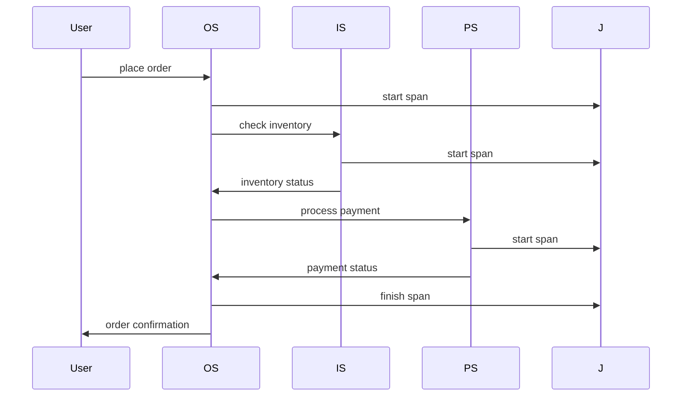
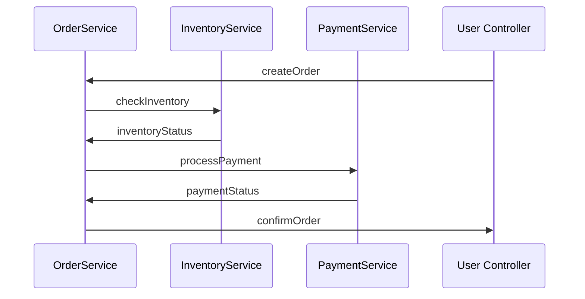

                 


### 文章标题：分布式追踪：复杂系统的问题定位利器

#### 关键词：分布式追踪，复杂系统，问题定位，监控，数据追踪

> 摘要：本文将深入探讨分布式追踪在现代复杂系统中的重要性，解析其基本概念、原理和实现方法，并通过具体的案例来展示分布式追踪在复杂系统问题定位中的应用。文章旨在帮助开发者更好地理解和应用分布式追踪技术，以提高系统监控和问题定位的效率。

## 第一部分：分布式追踪概述

### 1.1 分布式追踪背景与重要性

#### 1.1.1 复杂系统与分布式追踪

在现代互联网架构中，复杂系统的特点日益显著。这些系统通常由多个微服务组成，分布在不同地理位置，运行在不同的硬件和操作系统上。这使得传统的集中式监控方法难以应对复杂系统的监控需求。

#### 1.1.2 分布式追踪的定义与目的

分布式追踪是指通过一种或多种技术手段，对分布式系统中各个服务的运行情况进行监控和记录。其目的是为了解决复杂系统中服务之间的依赖关系，以及在系统出现问题时快速定位故障源头。

#### 1.1.3 分布式追踪的应用场景

分布式追踪技术广泛应用于金融、电商、云计算、社交网络等领域。在这些领域，分布式追踪有助于提高系统的稳定性和可靠性，减少因系统故障导致的损失。

#### 1.1.4 分布式追踪与传统监控对比

与传统监控方法相比，分布式追踪具有更高的灵活性和可扩展性。传统监控方法通常依赖于单个系统或服务的日志，而分布式追踪则能够跨多个服务收集和分析数据，提供更全面的监控视角。

### 1.2 核心概念与联系

#### 1.2.1 分布式追踪的基本概念

分布式追踪的基本概念包括数据追踪、上下文传递和跨系统追踪。数据追踪是指对系统中的数据进行记录和分析；上下文传递是指在不同服务之间传递追踪数据；跨系统追踪是指追踪数据跨不同系统进行传输和分析。

#### 1.2.2 概念属性特征对比表格

以下是一个简单的概念属性特征对比表格，展示了几种常见的分布式追踪系统的特点和适用场景：

| 系统名称 | 特点 | 适用场景 |
|----------|------|----------|
| Zipkin   | 基于Dapper设计 | 大型分布式系统 |
| Jaeger   | 开源、易于部署 | 微服务架构 |
| OpenTelemetry | 标准化、可扩展 | 多语言、多平台 |

#### 1.2.3 分布式追踪系统实体关系图

下图是一个ER实体关系图，展示了分布式追踪系统的基本实体及其关系：

```mermaid
erDiagram
    Service --> Trace : 服务产生追踪数据
    Trace --> Span : 追踪数据中的操作
    Span --> Log : 记录操作日志
```

## 第二部分：分布式追踪架构与实现

### 2.1 系统分析与架构设计

#### 2.1.1 问题场景介绍

假设我们正在开发一个大型电商系统，该系统包括订单服务、库存服务、支付服务等多个微服务。这些服务之间相互依赖，构成一个复杂的分布式系统。在系统运行过程中，任何服务出现故障都可能导致整个系统的瘫痪。

#### 2.1.2 项目介绍

在本项目中，我们将使用Jaeger作为分布式追踪工具，实现对电商系统中各个微服务的监控和追踪。项目的目标是提高系统的稳定性和可靠性，减少故障对用户的影响。

#### 2.1.3 系统功能设计（领域模型 Mermaid 类图）

以下是一个简单的领域模型类图，展示了系统的主要功能模块：

```mermaid
classDiagram
    Service Oversight <<Interface>>
    Service Oversight <|-- Jaeger Client
    Service Oversight <|-- Monitor System
    OrderService <<Service>>
    InventoryService <<Service>>
    PaymentService <<Service>>

    OrderService : order management
    InventoryService : inventory management
    PaymentService : payment processing

    Jaeger Client : trace data collection
    Monitor System : system monitoring
```

#### 2.1.4 系统架构设计（Mermaid 架构图）

下图展示了系统的整体架构：



#### 2.1.5 系统接口设计和系统交互（Mermaid 序列图）

下图展示了系统各接口的交互过程：



## 第三部分：分布式追踪项目

### 3.1 环境安装

在本项目中，我们将使用Docker来部署Jaeger。以下是安装步骤：

1. 安装Docker：在服务器上安装Docker，并确保其正常运行。
2. 下载Jaeger：使用以下命令下载Jaeger Docker镜像：
    ```bash
    docker pull jaegertracing/jaeger
    ```
3. 运行Jaeger：使用以下命令启动Jaeger服务：
    ```bash
    docker run -d --name jaeger -p 16686:16686 -p 14268:14268 jaegertracing/jaeger
    ```

### 3.2 系统核心实现源代码

以下是系统核心实现源代码：

```python
# order_service.py
from jaeger_client import init_tracer
from inventory_service import InventoryService
from payment_service import PaymentService

tracer = init_tracer()
tracer.start_span('create_order')

inventory_service = InventoryService()
payment_service = PaymentService()

inventory_status = inventory_service.check_inventory()
if inventory_status:
    payment_status = payment_service.process_payment()
    if payment_status:
        tracer.finish_span()
        return 'Order confirmed'
    else:
        tracer.add_tag('payment_failed', 'true')
else:
    tracer.add_tag('inventory_shortage', 'true')
tracer.finish_span()
return 'Order processing failed'
```

### 3.3 代码应用解读与分析

以上代码展示了订单服务的实现。首先，我们使用Jaeger的客户端初始化一个追踪器。然后，我们分别调用库存服务和支付服务的接口，并在每个接口调用前开始一个新的追踪span。如果订单处理成功，我们将结束当前的span；否则，我们添加相应的标签来记录失败的原因。

### 3.4 实际案例分析和详细讲解剖析

假设我们在运行订单服务时发现一个异常，导致订单处理失败。通过分析Jaeger追踪数据，我们可以快速定位到失败的具体位置，以及导致失败的原因。例如，如果我们发现库存服务返回了一个无效的库存状态，我们可以进一步分析库存服务的日志，找到问题的根源。

### 3.5 项目小结

通过本项目的实践，我们了解了分布式追踪在复杂系统中的应用价值。分布式追踪可以帮助我们快速定位系统故障，提高系统的稳定性和可靠性。同时，我们也学会了如何使用Jaeger等分布式追踪工具来实现分布式系统的监控。

## 第四部分：最佳实践、小结、注意事项、拓展阅读

### 4.1 最佳实践 tips

1. 在部署分布式追踪系统时，确保所有服务都使用相同的追踪工具。
2. 定期分析追踪数据，识别潜在的性能瓶颈和故障点。
3. 在设计分布式系统时，充分考虑追踪系统的需求，为每个服务提供足够的追踪数据。

### 4.2 小结

本文介绍了分布式追踪在复杂系统中的应用，解析了其基本概念和实现方法，并通过具体案例展示了分布式追踪在系统问题定位中的作用。

### 4.3 注意事项

1. 分布式追踪系统对性能有一定的影响，应合理配置追踪频率和数据存储策略。
2. 在生产环境中使用分布式追踪时，注意保护用户隐私和敏感信息。

### 4.4 拓展阅读

1. 《分布式系统监控：原理与实践》
2. 《微服务设计：构建基于Docker、Kubernetes和React的分布式系统》
3. 《Distributed Tracing：A Comprehensive Guide》

---

### 作者：AI天才研究院/AI Genius Institute & 禅与计算机程序设计艺术 /Zen And The Art of Computer Programming

[End of Article]

