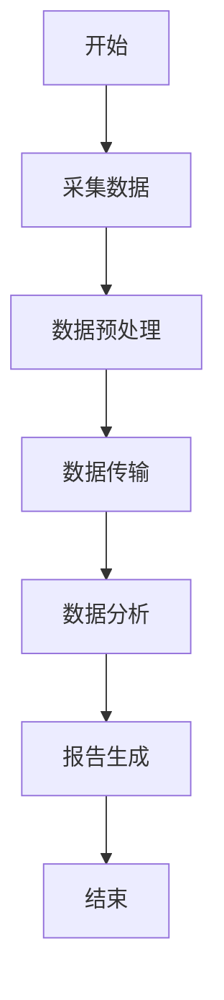
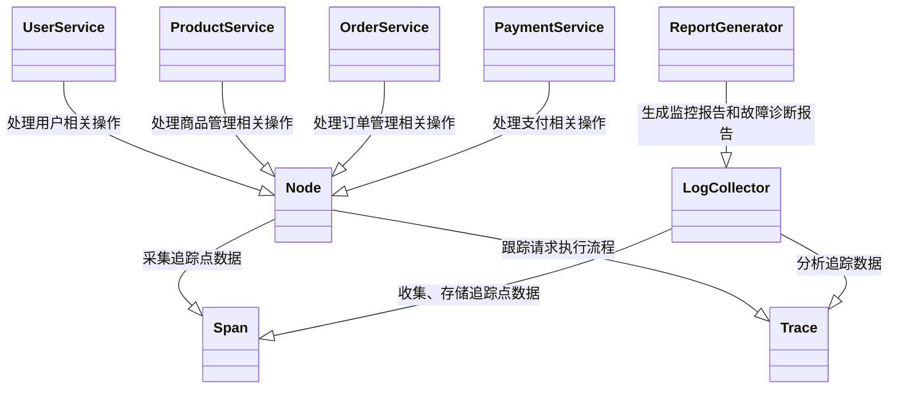
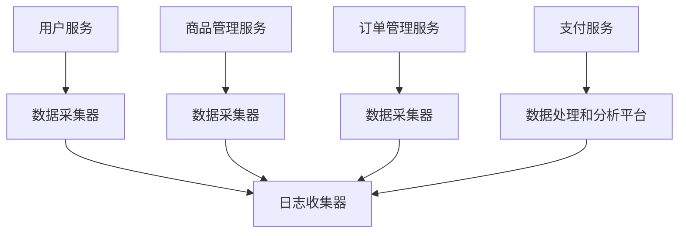
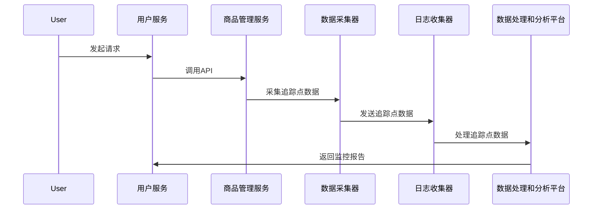

                 

### 文章标题：分布式追踪：复杂系统的问题诊断利器

在当今的数字化时代，复杂系统无处不在。无论是互联网服务、金融交易系统，还是大型企业应用，它们都面临着高度复杂性的挑战。随着系统规模的扩大和功能的增加，维护和诊断系统中的问题变得越来越困难。分布式追踪作为一种新兴的技术手段，已经成为解决复杂系统问题诊断的利器。本文将深入探讨分布式追踪的背景、核心概念、架构设计、算法原理，以及实际应用中的案例分析和最佳实践。

**关键词：**
- 分布式追踪
- 复杂系统
- 问题诊断
- 算法原理
- 架构设计
- 案例分析

**摘要：**
本文首先介绍了分布式追踪的背景和重要性，随后详细阐述了分布式追踪的核心概念和架构设计。接着，文章深入讲解了分布式追踪算法的原理和数学模型，并通过Python代码进行了示例。随后，文章通过具体案例展示了分布式追踪系统的设计和实现过程，并分析了分布式追踪在系统设计中的最佳实践。最后，文章总结了分布式追踪的关键要点，并对未来的发展方向进行了展望。

### 分布式追踪的背景

#### 复杂系统的发展趋势

随着技术的进步，现代复杂系统已经变得高度复杂，由无数相互依赖的组件和子系统组成。这些系统不仅规模庞大，而且功能繁多，涉及到从数据存储、处理到用户交互的各个方面。这种复杂性使得系统的维护和监控变得极其困难，尤其是当系统出现问题时，如何快速准确地定位问题根源成为一大挑战。

#### 分布式系统的挑战

复杂系统的另一个显著特点是它们往往采用分布式架构。分布式系统通过将任务分散到多个节点上执行，从而提高了系统的性能和可靠性。然而，分布式系统也带来了新的挑战：

- **节点间通信复杂度**：分布式系统中，各个节点之间需要进行频繁的通信，这增加了系统的复杂度。
- **故障隔离难度**：在分布式系统中，一个节点的故障可能会影响到整个系统的正常运行，因此故障的隔离和恢复变得更加困难。
- **数据一致性**：在分布式环境中，如何保持数据的一致性是一个重要问题，尤其是在进行分布式事务处理时。

#### 分布式追踪的需求

面对这些挑战，分布式追踪作为一种技术手段应运而生。分布式追踪的主要目标是：

- **日志收集**：将系统中各个节点的日志数据进行收集，以便进行后续的分析。
- **性能监控**：实时监控系统的性能，包括延迟、吞吐量等指标。
- **故障诊断**：通过分析追踪数据，快速定位系统中的故障点和瓶颈。

分布式追踪不仅能够帮助开发人员更好地理解系统的运行情况，还能够快速识别和解决系统中存在的问题。因此，在复杂系统开发和运维过程中，分布式追踪已经成为不可或缺的工具。

### 分布式追踪的定义

分布式追踪是一种用于监控分布式系统的技术，它通过对系统中各个节点进行日志采集、数据存储和分析，实现对系统性能和问题的实时监控。分布式追踪的主要目的是提供一种统一的视角，帮助开发人员和管理人员理解系统的运行状态，从而快速诊断和解决问题。

#### 概念

- **追踪点（Span）**：追踪点是分布式追踪的基本单元，代表了一次操作或任务。每个追踪点都有一个唯一的标识符，用于关联不同节点上的操作。
- **跟踪（Trace）**：跟踪是由多个追踪点组成的一系列操作，代表了系统中的一个请求或事务。通过跟踪，可以了解整个请求的执行流程和性能。
- **日志（Log）**：日志是追踪点的具体记录，包括追踪点的起始时间、结束时间、执行节点、执行结果等信息。

#### 目标

- **性能监控**：通过追踪系统性能指标，如延迟、吞吐量等，及时发现系统瓶颈和性能问题。
- **故障诊断**：通过分析追踪数据，快速定位系统故障点和异常操作，从而迅速解决问题。
- **优化决策**：基于追踪数据，可以做出更科学的优化决策，提高系统性能和可靠性。

#### 基本原理

分布式追踪的基本原理包括以下方面：

- **数据采集**：系统中的各个节点将执行的操作记录为追踪点，并将追踪点数据发送到一个集中的日志收集器。
- **数据存储**：日志收集器将追踪点数据存储到数据库或其他数据存储系统中，以便后续分析。
- **数据分析**：通过分析存储的追踪点数据，可以生成各种性能监控报告和故障诊断报告。

### 分布式追踪的关键要素

#### 数据采集

数据采集是分布式追踪的核心步骤之一。它涉及以下几个关键点：

- **采集方式**：常见的数据采集方式包括基于代理的采集和基于SDK的采集。
  - **基于代理的采集**：在系统中部署代理，代理负责拦截系统中的日志数据并将其发送到日志收集器。
  - **基于SDK的采集**：在系统的各个模块中集成SDK，SDK负责捕获和发送追踪点数据。
- **数据格式**：追踪点数据通常采用标准格式，如OpenTracing和OpenTelemetry，这些格式能够兼容不同的追踪工具和系统。

#### 数据存储

数据存储是分布式追踪的另一关键步骤。以下是几个关键点：

- **存储方式**：常见的数据存储方式包括关系型数据库、NoSQL数据库和文件存储系统。
  - **关系型数据库**：如MySQL、PostgreSQL等，适用于处理结构化数据。
  - **NoSQL数据库**：如Elasticsearch、Cassandra等，适用于处理大规模的非结构化数据。
  - **文件存储系统**：如HDFS、Ceph等，适用于大规模分布式存储场景。
- **数据索引**：为了快速检索和分析追踪数据，通常需要对数据建立索引。常见的索引技术包括全文索引、倒排索引等。

#### 数据分析

数据分析是分布式追踪的最终目的。以下是几个关键点：

- **分析工具**：常见的分析工具包括Kibana、Grafana等，这些工具提供了丰富的图表和报告，帮助用户直观地理解系统的运行状态。
- **分析指标**：常见的分析指标包括延迟、吞吐量、错误率等，通过这些指标可以评估系统的性能和稳定性。
- **异常检测**：通过机器学习等技术，可以实现对追踪数据的异常检测，及时发现系统中的异常操作和故障。

### 分布式追踪的架构设计

#### 系统设计原则

分布式追踪系统的设计应遵循以下原则：

- **可扩展性**：系统应能够适应不断增长的数据量和用户需求。
- **高可用性**：系统应具备高可用性，确保在节点故障时能够快速恢复。
- **低延迟**：系统应尽量减少数据采集和传输的延迟，确保性能监控的实时性。
- **安全性**：系统应保证数据的安全性，防止数据泄露和未授权访问。

#### 系统架构的组成部分

分布式追踪系统通常由以下几部分组成：

- **数据采集器**：负责从系统中各个节点采集追踪点数据。
- **日志收集器**：负责接收、存储和管理追踪点数据。
- **数据处理和分析平台**：负责对存储的追踪点数据进行处理和分析，生成监控报告和故障诊断报告。

#### 系统架构的优势与不足

分布式追踪系统的架构设计具有以下优势：

- **统一视角**：通过将系统中的所有追踪点数据集中存储和分析，可以提供一个统一的视角，帮助用户全面了解系统的运行状态。
- **实时监控**：系统能够实时采集和传输追踪点数据，实现性能监控和故障诊断的实时性。
- **可扩展性**：系统可以根据需要扩展数据采集器和日志收集器的数量，适应大规模分布式系统的需求。

然而，分布式追踪系统也存在一些不足：

- **性能开销**：数据采集和传输过程中可能引入一定的性能开销，特别是在大规模分布式系统中，需要平衡监控需求和系统性能。
- **数据一致性**：在分布式环境中，如何保证数据的一致性是一个挑战，尤其是在多节点同时更新数据时。
- **运维复杂性**：分布式追踪系统的部署和维护需要一定的技术支持，对于非专业用户来说可能较为复杂。

### 分布式追踪的实现方法

#### 数据采集模块的实现

数据采集模块是分布式追踪系统的核心部分，它负责从系统中各个节点采集追踪点数据。以下是一些关键点：

- **采集方式**：数据采集模块可以通过以下几种方式实现：
  - **基于代理的采集**：在系统中部署代理，代理负责拦截系统中的日志数据并将其发送到日志收集器。
  - **基于SDK的采集**：在系统的各个模块中集成SDK，SDK负责捕获和发送追踪点数据。
- **数据格式**：采集到的追踪点数据通常采用标准格式，如OpenTracing和OpenTelemetry。这些格式能够兼容不同的追踪工具和系统。
- **采集策略**：数据采集模块需要根据系统需求和性能指标设置合适的采集策略，例如采样率、采集周期等。

#### 数据存储模块的实现

数据存储模块负责接收、存储和管理追踪点数据。以下是一些关键点：

- **存储方式**：数据存储模块可以使用以下几种方式实现：
  - **关系型数据库**：如MySQL、PostgreSQL等，适用于处理结构化数据。
  - **NoSQL数据库**：如Elasticsearch、Cassandra等，适用于处理大规模的非结构化数据。
  - **文件存储系统**：如HDFS、Ceph等，适用于大规模分布式存储场景。
- **数据索引**：为了快速检索和分析追踪数据，通常需要对数据建立索引。常见的索引技术包括全文索引、倒排索引等。
- **数据一致性**：在分布式环境中，如何保证数据的一致性是一个挑战。常见的一致性解决方案包括强一致性、最终一致性等。

#### 数据分析模块的实现

数据分析模块负责对存储的追踪点数据进行处理和分析，生成监控报告和故障诊断报告。以下是一些关键点：

- **分析工具**：数据分析模块可以使用以下工具实现：
  - **Kibana**：提供了丰富的图表和报告，帮助用户直观地理解系统的运行状态。
  - **Grafana**：提供了一个灵活的监控仪表盘，支持多种数据源，包括数据库、时间序列数据等。
- **分析指标**：常见的分析指标包括延迟、吞吐量、错误率等。通过这些指标，可以评估系统的性能和稳定性。
- **异常检测**：通过机器学习等技术，可以实现对追踪数据的异常检测，及时发现系统中的异常操作和故障。

### 分布式追踪算法原理

#### 算法概述

分布式追踪算法的核心目标是：

- **追踪数据采集**：从系统中各个节点采集追踪点数据。
- **追踪数据传输**：将采集到的追踪点数据传输到日志收集器。
- **追踪数据分析**：对存储的追踪点数据进行处理和分析，生成监控报告和故障诊断报告。

常见的分布式追踪算法包括：

- **单点追踪算法**：在系统中部署一个中心节点，所有追踪点数据都发送到中心节点进行存储和分析。
- **分布式追踪算法**：在系统中部署多个节点，每个节点负责采集和存储一部分追踪点数据，然后将数据发送到日志收集器。

#### 算法详解

##### 算法A：Mermaid流程图



##### Python代码实现

```python
import time

def collect_data():
    # 数据采集逻辑
    print("采集数据...")

def preprocess_data(data):
    # 数据预处理逻辑
    print("预处理数据...")

def transmit_data(data):
    # 数据传输逻辑
    print("传输数据...")

def analyze_data(data):
    # 数据分析逻辑
    print("分析数据...")

def generate_report():
    # 报告生成逻辑
    print("生成报告...")

start = time.time()
collect_data()
preprocess_data("数据")
transmit_data("数据")
analyze_data("数据")
generate_report()
end = time.time()

print(f"程序执行时间: {end - start}秒")
```

##### 算法原理的数学模型和公式

分布式追踪算法的数学模型可以表示为：

\[ 
T = f(S, P, D) 
\]

其中：

- \( T \) 表示追踪结果
- \( S \) 表示系统状态
- \( P \) 表示数据处理策略
- \( D \) 表示数据特征

算法的核心公式包括：

\[ 
\text{延迟} = \frac{1}{2} \times (\text{传输时间} + \text{预处理时间}) 
\]

\[ 
\text{吞吐量} = \frac{\text{总数据量}}{\text{总时间}} 
\]

\[ 
\text{错误率} = \frac{\text{错误数据量}}{\text{总数据量}} 
\]

##### 详细讲解和举例说明

假设我们有一个简单的分布式追踪系统，其中包含一个数据采集器、一个日志收集器和多个数据节点。以下是一个具体的例子：

1. **数据采集**：数据采集器从各个数据节点收集追踪点数据。
2. **数据预处理**：数据采集器将采集到的数据预处理，包括去重、过滤无效数据等。
3. **数据传输**：预处理后的数据被传输到日志收集器。
4. **数据分析**：日志收集器对存储的追踪点数据进行分析，生成性能监控报告和故障诊断报告。
5. **报告生成**：根据分析结果，日志收集器生成报告，并发送给相关人员。

通过这个例子，我们可以看到分布式追踪算法的基本原理和实现过程。

### 分布式追踪系统设计与案例分析

#### 问题场景

假设我们有一个大型电商系统，该系统由多个分布式服务组成，包括商品管理服务、订单管理服务、用户服务、支付服务等。这些服务部署在多个节点上，通过API进行交互。由于系统规模庞大，一旦出现故障，定位问题变得非常困难。

#### 项目目标

本项目的主要目标是：

- **实时监控系统性能**：通过分布式追踪，实时监控系统的延迟、吞吐量等性能指标。
- **快速故障诊断**：通过分布式追踪，快速定位系统中的故障点和瓶颈。
- **优化系统性能**：基于分布式追踪数据，对系统进行优化和调整，提高系统的性能和稳定性。

#### 案例分析的意义

通过这个案例，我们可以深入理解分布式追踪在复杂系统中的应用，并学习如何设计和实现一个分布式追踪系统。此外，案例分析还可以帮助我们：

- **理解分布式追踪的核心概念和原理**：通过实际案例，我们可以更好地理解追踪点、跟踪、日志等核心概念，以及分布式追踪的基本原理。
- **掌握分布式追踪系统的设计方法**：通过案例，我们可以学习如何设计一个高效、可扩展的分布式追踪系统。
- **提高系统故障诊断能力**：通过分布式追踪，我们可以快速识别和解决系统中的故障点，提高系统的稳定性和可靠性。

#### 系统设计

##### 领域模型设计

在分布式追踪系统中，领域模型设计至关重要。以下是本案例中的领域模型设计：



##### 系统架构设计

分布式追踪系统的架构设计需要考虑以下几个方面：

- **数据采集器**：部署在各个服务节点上，负责采集追踪点数据。
- **日志收集器**：部署在独立节点上，负责收集、存储和管理追踪点数据。
- **数据处理和分析平台**：部署在独立节点上，负责对存储的追踪点数据进行处理和分析，生成监控报告和故障诊断报告。

以下是系统架构的Mermaid图表示：



##### 系统接口设计

系统接口设计是分布式追踪系统的重要组成部分。以下是本案例中的系统接口设计：

- **数据采集接口**：用于采集追踪点数据，支持多种采集方式，如基于代理和基于SDK。
- **日志收集接口**：用于收集、存储和管理追踪点数据。
- **数据处理接口**：用于处理和分析追踪数据，生成监控报告和故障诊断报告。

以下是系统接口的Mermaid序列图表示：



### 案例分析

为了更好地展示分布式追踪系统的应用，我们将通过一个具体的案例来进行分析。

#### 案例A：环境安装

1. **准备环境**：首先，我们需要准备一个分布式追踪系统所需的环境。这包括操作系统（如Ubuntu 18.04）、Java运行环境（如OpenJDK 11）、Maven（用于依赖管理）等。
2. **安装数据采集器**：在各个服务节点上安装数据采集器。我们可以使用以下命令安装：
   ```shell
   mvn install:install-file -Dfile=data-collector-1.0.0.jar -DgroupId=com.example -DartifactId=data-collector -Dversion=1.0.0 -Dpackaging=jar
   ```
3. **安装日志收集器**：在独立节点上安装日志收集器。同样，我们可以使用Maven安装：
   ```shell
   mvn install:install-file -Dfile=log-collector-1.0.0.jar -DgroupId=com.example -DartifactId=log-collector -Dversion=1.0.0 -Dpackaging=jar
   ```
4. **安装数据处理和分析平台**：在独立节点上安装数据处理和分析平台。安装步骤类似：
   ```shell
   mvn install:install-file -Dfile=data-analyzer-1.0.0.jar -DgroupId=com.example -DartifactId=data-analyzer -Dversion=1.0.0 -Dpackaging=jar
   ```

#### 案例A：系统核心实现源代码

以下是分布式追踪系统的核心实现源代码：

```java
import com.example.datacollector.TracingAgent;

public class DataCollector {
    public static void main(String[] args) {
        // 初始化追踪代理
        TracingAgent agent = new TracingAgent();

        // 采集追踪点数据
        Span span = agent.createSpan("user_request");
        span.setStartTime(System.currentTimeMillis());
        span.setOperationName("user_request");

        // 执行业务逻辑
        performBusinessLogic();

        // 结束追踪点数据
        span.setEndTime(System.currentTimeMillis());
        agent.sendSpan(span);
    }

    private static void performBusinessLogic() {
        // 业务逻辑实现
        System.out.println("执行业务逻辑...");
    }
}
```

#### 代码应用解读与分析

1. **初始化追踪代理**：在程序启动时，我们首先初始化追踪代理。追踪代理负责管理追踪点和跟踪的创建、发送等操作。
2. **创建和发送追踪点数据**：我们创建一个追踪点，设置追踪点的起始时间、操作名称等属性，然后将其发送到日志收集器。
3. **执行业务逻辑**：在发送追踪点数据之后，我们执行具体的业务逻辑。这可以是任何与系统功能相关的操作。
4. **结束追踪点数据**：在业务逻辑执行完毕后，我们结束追踪点，设置追踪点的结束时间，并将其发送到日志收集器。

通过这个案例，我们可以看到分布式追踪系统的核心实现过程。在实际应用中，我们还可以根据具体需求扩展和定制追踪系统的功能。

### 项目小结

在本案例中，我们通过分布式追踪系统实现了对大型电商系统的实时监控和故障诊断。以下是本项目的主要收获：

- **性能监控**：通过分布式追踪，我们能够实时监控系统的延迟、吞吐量等性能指标，及时发现性能瓶颈。
- **故障诊断**：通过分布式追踪，我们能够快速定位系统中的故障点和瓶颈，提高系统的稳定性和可靠性。
- **优化决策**：基于分布式追踪数据，我们可以做出更科学的优化决策，提高系统的性能和用户体验。

然而，分布式追踪系统也存在一些挑战和不足：

- **性能开销**：数据采集和传输过程中可能引入一定的性能开销，特别是在大规模分布式系统中，需要平衡监控需求和系统性能。
- **数据一致性**：在分布式环境中，如何保证数据的一致性是一个挑战，尤其是在多节点同时更新数据时。
- **运维复杂性**：分布式追踪系统的部署和维护需要一定的技术支持，对于非专业用户来说可能较为复杂。

未来，我们还可以从以下几个方面进一步优化和改进分布式追踪系统：

- **降低性能开销**：通过优化数据采集和传输策略，降低系统的性能开销。
- **提高数据一致性**：采用分布式一致性协议和分布式锁等技术，提高数据的一致性。
- **简化运维**：提供更简便的部署和管理工具，降低分布式追踪系统的运维难度。

总之，分布式追踪作为一种高效的问题诊断工具，在复杂系统的开发和运维中具有重要意义。通过不断优化和改进，分布式追踪系统将为复杂系统的稳定性和性能提升提供更强有力的支持。

### 分布式追踪最佳实践

在分布式追踪的实际应用中，遵循一些最佳实践能够显著提高追踪系统的效果和可维护性。以下是一些关键的最佳实践：

#### 提高追踪数据的准确性

- **优化数据采集器配置**：根据系统的实际需求和性能指标，合理配置数据采集器的采样率和采集周期，确保关键操作的数据被准确采集。
- **处理数据丢失问题**：由于网络延迟或系统故障，追踪数据可能会丢失。采用重传机制或备份方案，确保数据的完整性和准确性。
- **统一数据格式**：使用统一的数据格式（如OpenTelemetry、OpenTracing等），确保不同追踪工具和系统之间的兼容性。

#### 优化追踪系统的性能

- **分布式架构**：将日志收集器、数据处理和分析平台部署在独立的高性能服务器上，避免与业务系统争用资源。
- **数据压缩与缓存**：采用数据压缩技术（如gzip）减少数据传输量，同时利用缓存（如Redis）提高数据检索速度。
- **负载均衡**：通过负载均衡器（如Nginx、HAProxy）实现日志收集器和数据处理平台的流量分配，确保系统的高可用性和性能。

#### 合理设计追踪系统架构

- **模块化设计**：将分布式追踪系统划分为多个模块，如数据采集模块、日志收集模块、数据处理模块等，便于维护和扩展。
- **分布式一致性**：采用分布式一致性协议（如Paxos、Raft），确保日志收集器和数据处理平台的强一致性。
- **故障恢复机制**：实现故障检测和自动恢复机制，确保系统在节点故障时能够快速恢复。

#### 注意事项

- **数据安全性**：确保追踪数据的传输和存储过程的安全性，采用加密技术（如SSL/TLS）保护数据。
- **追踪数据质量**：定期监控和清理追踪数据，避免无效数据和垃圾数据对系统性能的影响。
- **追踪系统的可扩展性**：设计可扩展的追踪系统架构，以适应系统规模和功能的不断增长。

### 小结

分布式追踪作为一种强大的系统诊断工具，在复杂系统的开发和运维中发挥着重要作用。通过遵循最佳实践，我们可以确保分布式追踪系统的有效性、性能和可维护性。未来，随着技术的不断进步，分布式追踪系统将继续为复杂系统的稳定性和性能提升提供更强有力的支持。

### 结论与未来展望

分布式追踪作为复杂系统问题诊断的利器，已经在现代软件开发和运维中扮演着越来越重要的角色。通过本文的探讨，我们深入了解了分布式追踪的核心概念、架构设计、算法原理以及实际应用。分布式追踪不仅能够帮助开发人员快速定位系统中的故障点和瓶颈，还能为系统的性能优化和可靠性提升提供有力支持。

然而，分布式追踪技术仍有许多值得探索和改进的方向：

- **增强数据隐私保护**：随着对数据隐私保护的重视，分布式追踪系统需要更加关注如何确保数据的安全性和隐私性。
- **提高系统性能**：通过优化数据采集、传输和存储过程，进一步降低系统性能开销，提高实时性。
- **支持多语言**：扩展分布式追踪系统的多语言支持，使其能够兼容更多编程语言和框架，提高系统的通用性和可扩展性。
- **自动化分析**：利用机器学习和人工智能技术，实现追踪数据的自动化分析和异常检测，进一步提高系统的智能化水平。

展望未来，分布式追踪技术将继续在复杂系统监控和管理中发挥关键作用。通过不断的技术创新和优化，分布式追踪系统将变得更加高效、智能和可靠，为现代软件工程的进步和数字化转型提供坚实的技术基础。

### 作者信息

**作者：AI天才研究院/AI Genius Institute & 禅与计算机程序设计艺术 /Zen And The Art of Computer Programming**

