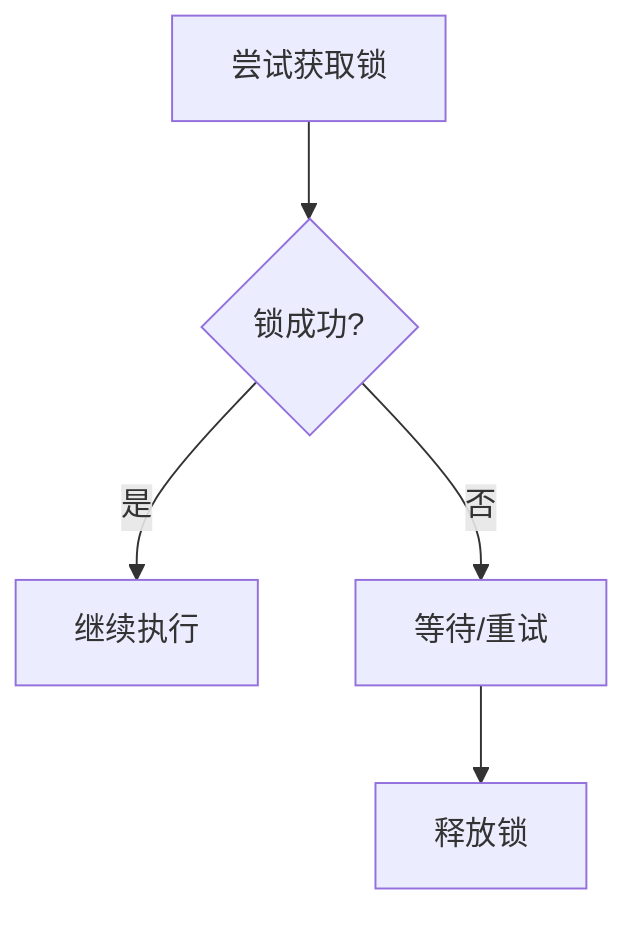
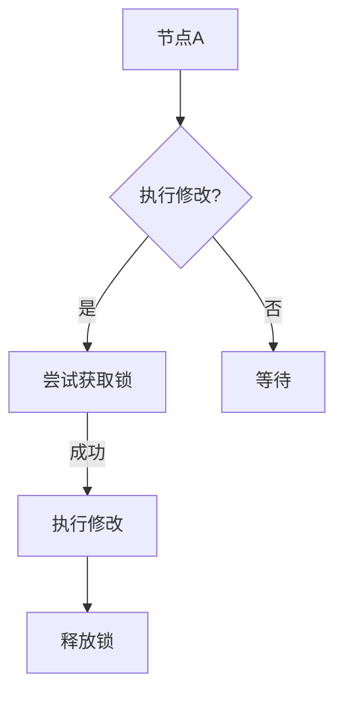
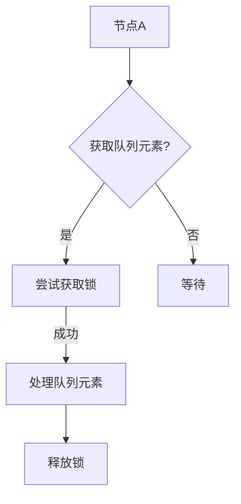
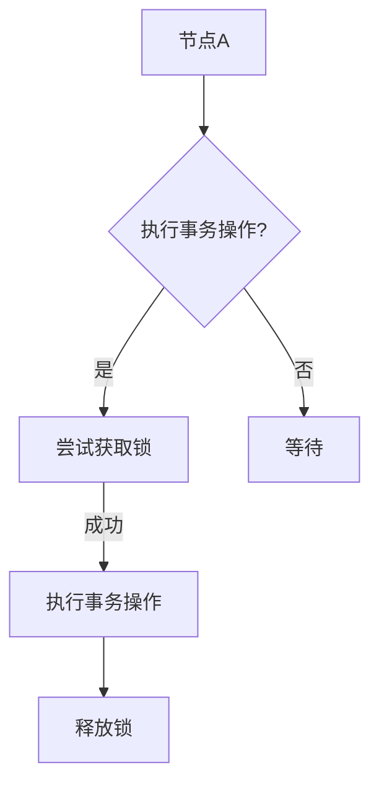
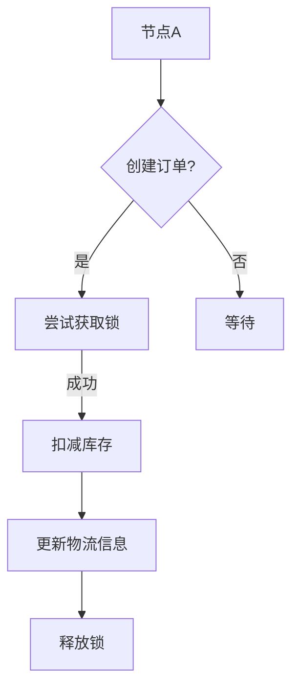

                 

### 分布式锁的实现与优化：背景介绍

#### 分布式锁的定义

分布式锁是一种用于在分布式系统中同步多个操作，确保同一时间只有一个进程或线程能对某个资源进行访问的机制。这种锁可以防止多个进程同时修改共享资源，从而避免数据不一致和竞争条件等问题。

#### 分布式锁的核心概念

- **锁（Lock）**：用于控制访问共享资源的权限。
- **共享资源（Shared Resource）**：需要被锁保护的数据或对象。
- **锁的粒度（Lock Granularity）**：决定锁作用范围的大小，包括细粒度和粗粒度两种。
- **分布式系统（Distributed System）**：由多个相互独立、通过网络连接的节点组成的系统。

#### 问题背景

在传统的单体架构系统中，锁机制相对简单，主要使用数据库表或者内存中的数据结构来实现。然而，在分布式系统中，由于节点的分布式和独立性，传统的锁机制无法保证数据的一致性和同步。

- **数据不一致**：由于分布式系统的复杂性，多个节点同时修改同一份数据时，容易出现数据不一致的问题。
- **竞争条件**：多个节点同时访问共享资源时，容易产生竞争条件，导致系统性能下降甚至崩溃。

#### 问题描述

分布式锁的实现与优化旨在解决以下问题：

- **数据一致性**：确保多个节点对共享资源进行操作时，不会出现数据不一致的问题。
- **并发性能**：优化分布式锁的实现，减少系统延迟，提高并发处理能力。
- **可用性**：在锁失效或节点故障的情况下，保证系统能够自动恢复。

#### 问题解决

分布式锁的实现与优化主要通过以下方式解决：

- **锁的实现**：基于数据库、缓存、ZooKeeper 等技术实现分布式锁。
- **性能优化**：通过锁的粒度优化、锁超时机制优化、分布式算法优化等方式提高锁的性能。
- **故障恢复**：设计故障恢复机制，确保锁失效或节点故障时系统能够自动恢复。

#### 边界与外延

- **锁的粒度**：锁的粒度会影响系统的性能和一致性。细粒度锁可以提高并发性，但可能导致死锁；粗粒度锁可以减少死锁，但可能导致性能下降。
- **分布式算法**：不同的分布式算法具有不同的性能特点，需要根据实际场景选择合适的算法。

#### 概念结构与核心要素组成

分布式锁的核心结构包括：

- **锁对象**：用于标识锁的实体，通常包含锁的标识、状态等信息。
- **锁算法**：实现锁功能的算法，包括加锁、解锁、判断锁状态等。
- **锁管理器**：负责锁的创建、销毁、状态监控等功能。

#### 关键词

- 分布式锁
- 数据一致性
- 锁的粒度
- 分布式系统
- 锁的实现
- 性能优化
- 故障恢复

----------------------------------------------------------------

### 分布式锁的核心概念与联系

在深入探讨分布式锁的实现与优化之前，我们首先需要明确分布式锁的相关核心概念，并分析这些概念之间的联系。

#### 锁

锁是一种控制机制，用于限制对共享资源的访问。在单机环境下，锁通常是通过操作系统的互斥锁（mutex）或条件锁（condition）来实现的。然而，在分布式系统中，由于节点之间的独立性，简单的锁机制无法保证数据的一致性和同步。因此，分布式锁被引入，以解决多节点间的并发控制问题。

#### 共享资源

共享资源是指被多个进程或线程访问和修改的数据或对象。在分布式系统中，共享资源通常分布在不同的节点上。例如，一个分布式数据库系统中的多个数据副本，或者一个分布式缓存系统中的共享缓存对象。

#### 锁的粒度

锁的粒度是指锁作用的范围。锁的粒度可以分为细粒度和粗粒度两种。

- **细粒度锁**：锁作用范围较小，通常只锁住单个资源或数据行。细粒度锁可以提高系统的并发性，但可能导致死锁问题。
- **粗粒度锁**：锁作用范围较大，通常锁住整个数据集或数据库。粗粒度锁可以减少死锁问题，但可能降低系统的并发性能。

#### 分布式系统

分布式系统是由多个相互独立、通过网络连接的节点组成的系统。这些节点可以位于不同的物理位置，运行不同的操作系统和应用程序。分布式系统的目的是提高系统的可用性、可扩展性和容错能力。

#### 锁的实现

分布式锁的实现需要考虑多个因素，包括锁的类型、锁的算法、锁的持久化方式等。

- **锁的类型**：可以分为乐观锁和悲观锁。乐观锁假设在大多数情况下不会发生冲突，只在数据更新时进行校验；悲观锁则假设冲突很常见，在数据访问时进行加锁。
- **锁的算法**：包括基于时间戳、基于计数器、基于哈希表等。
- **锁的持久化方式**：可以将锁信息存储在数据库、缓存、ZooKeeper、etcd 等系统中。

#### 锁与共享资源的关系

锁与共享资源的关系可以看作是一种绑定关系。每个锁对象都与一个或多个共享资源相关联。当一个进程或线程需要访问共享资源时，它需要首先获得对应的锁。只有获得锁后，进程或线程才能对共享资源进行操作。

#### 锁与分布式系统的关系

分布式锁在分布式系统中起着至关重要的作用。它能够保证多个节点对共享资源的一致性访问，避免数据不一致和竞争条件问题。此外，分布式锁还能够在系统故障时提供一定的容错能力，确保系统在恢复后能够正确处理数据。

#### 锁的性能与可扩展性

分布式锁的性能和可扩展性直接影响分布式系统的性能和可扩展性。锁的实现方式、锁的算法、锁的持久化方式等因素都会影响锁的性能。在设计分布式锁时，需要综合考虑性能和可扩展性，以满足系统的实际需求。

#### 锁的安全性

分布式锁的安全性也是一个重要的考虑因素。在设计分布式锁时，需要考虑如何防止恶意攻击者获取锁、如何防止数据泄露等问题。通常，分布式锁的实现会涉及到加密、认证等安全机制。

#### 锁与一致性

分布式锁与一致性密切相关。在分布式系统中，一致性是指多个节点上的数据或状态保持一致。分布式锁能够确保对共享资源的访问在多个节点上保持一致，从而提高系统的一致性。

#### 锁与事务

分布式锁与事务也有一定的联系。在分布式系统中，事务是一种用于保证数据一致性的机制。分布式锁可以用于实现分布式事务中的锁机制，确保多个节点对事务的并发控制。

#### 锁与分布式算法

分布式锁的实现与分布式算法密切相关。不同的分布式算法具有不同的性能特点。例如，基于时间戳的算法可以提供较高的性能，但可能存在时间戳冲突问题；基于哈希表的算法可以提供较好的负载均衡，但可能存在哈希冲突问题。

#### 锁与故障恢复

分布式锁还需要考虑故障恢复问题。在分布式系统中，节点可能会发生故障。分布式锁需要设计故障恢复机制，确保系统在节点故障后能够自动恢复，并保持数据的一致性。

#### 锁与负载均衡

分布式锁还与负载均衡有一定的联系。在分布式系统中，负载均衡是一种用于将请求分配到多个节点上的技术。分布式锁可以用于实现负载均衡中的锁机制，确保多个节点在处理请求时不会出现竞争条件。

#### 锁与分布式缓存

分布式锁在分布式缓存系统中也有一定的应用。在分布式缓存系统中，多个节点共享同一份数据。分布式锁可以用于确保对缓存数据的并发访问，避免数据不一致问题。

#### 锁与分布式队列

分布式锁还可以用于分布式队列系统。在分布式队列系统中，多个节点需要按顺序访问队列中的元素。分布式锁可以用于确保对队列的并发访问，避免出现数据混乱问题。

#### 锁与分布式事务

分布式锁与分布式事务也有一定的联系。在分布式事务中，多个节点需要协同工作，确保事务的一致性和隔离性。分布式锁可以用于实现分布式事务中的锁机制，确保多个节点对事务的并发控制。

#### 锁与分布式存储

分布式锁在分布式存储系统中也有一定的应用。在分布式存储系统中，多个节点需要协同工作，确保数据的可靠性和一致性。分布式锁可以用于实现分布式存储中的锁机制，避免数据竞争和冲突问题。

#### 锁与分布式计算

分布式锁还可以用于分布式计算系统。在分布式计算系统中，多个节点需要协同工作，处理大规模的数据集。分布式锁可以用于确保对计算任务的并发控制，避免计算资源的竞争问题。

#### 锁与分布式数据库

分布式锁在分布式数据库系统中也有一定的应用。在分布式数据库系统中，多个节点需要协同工作，确保数据的一致性和同步。分布式锁可以用于实现分布式数据库中的锁机制，避免数据不一致和冲突问题。

#### 锁与分布式缓存一致性

分布式锁与分布式缓存一致性也有一定的联系。在分布式缓存系统中，多个节点共享同一份数据。分布式锁可以用于确保对缓存数据的并发访问，避免数据不一致问题，从而提高缓存一致性。

#### 锁与分布式缓存分区

分布式锁在分布式缓存分区系统中也有一定的应用。在分布式缓存分区系统中，数据被划分为多个分区，分布在不同节点上。分布式锁可以用于确保对分区数据的并发访问，避免数据不一致问题。

#### 锁与分布式队列一致性

分布式锁与分布式队列一致性也有一定的联系。在分布式队列系统中，多个节点需要按顺序访问队列中的元素。分布式锁可以用于确保对队列的并发访问，避免数据不一致问题，从而提高队列一致性。

#### 锁与分布式队列分区

分布式锁在分布式队列分区系统中也有一定的应用。在分布式队列分区系统中，队列数据被划分为多个分区，分布在不同节点上。分布式锁可以用于确保对分区队列的并发访问，避免数据不一致问题。

#### 锁与分布式事务隔离性

分布式锁与分布式事务隔离性也有一定的联系。在分布式事务中，多个节点需要协同工作，确保事务的隔离性。分布式锁可以用于实现分布式事务中的锁机制，避免并发访问导致的事务隔离性问题。

#### 锁与分布式存储可靠性

分布式锁与分布式存储可靠性也有一定的联系。在分布式存储系统中，多个节点需要协同工作，确保数据的可靠性。分布式锁可以用于实现分布式存储中的锁机制，避免数据竞争和冲突问题，从而提高存储可靠性。

#### 锁与分布式计算并行性

分布式锁与分布式计算并行性也有一定的联系。在分布式计算系统中，多个节点需要协同工作，处理大规模的数据集。分布式锁可以用于确保对计算任务的并发控制，避免计算资源的竞争问题，从而提高计算并行性。

#### 锁与分布式数据库一致性

分布式锁与分布式数据库一致性也有一定的联系。在分布式数据库系统中，多个节点需要协同工作，确保数据的一致性。分布式锁可以用于实现分布式数据库中的锁机制，避免数据不一致和冲突问题，从而提高数据库一致性。

#### 锁与分布式缓存分区负载均衡

分布式锁与分布式缓存分区负载均衡也有一定的联系。在分布式缓存系统中，多个节点共享同一份数据。分布式锁可以用于确保对分区数据的并发访问，避免数据不一致问题，同时通过负载均衡提高系统性能。

#### 锁与分布式队列分区负载均衡

分布式锁与分布式队列分区负载均衡也有一定的联系。在分布式队列系统中，多个节点需要按顺序访问队列中的元素。分布式锁可以用于确保对分区队列的并发访问，避免数据不一致问题，同时通过负载均衡提高系统性能。

#### 锁与分布式事务隔离性

分布式锁与分布式事务隔离性也有一定的联系。在分布式事务中，多个节点需要协同工作，确保事务的隔离性。分布式锁可以用于实现分布式事务中的锁机制，避免并发访问导致的事务隔离性问题。

#### 锁与分布式存储可靠性

分布式锁与分布式存储可靠性也有一定的联系。在分布式存储系统中，多个节点需要协同工作，确保数据的可靠性。分布式锁可以用于实现分布式存储中的锁机制，避免数据竞争和冲突问题，从而提高存储可靠性。

#### 锁与分布式计算并行性

分布式锁与分布式计算并行性也有一定的联系。在分布式计算系统中，多个节点需要协同工作，处理大规模的数据集。分布式锁可以用于确保对计算任务的并发控制，避免计算资源的竞争问题，从而提高计算并行性。

#### 锁与分布式数据库一致性

分布式锁与分布式数据库一致性也有一定的联系。在分布式数据库系统中，多个节点需要协同工作，确保数据的一致性。分布式锁可以用于实现分布式数据库中的锁机制，避免数据不一致和冲突问题，从而提高数据库一致性。

#### 分布式锁的优点

- **数据一致性**：确保多个节点对共享资源的一致性访问，避免数据不一致问题。
- **并发性能**：优化分布式锁的实现，提高系统的并发处理能力。
- **可用性**：在锁失效或节点故障时，提供故障恢复机制，确保系统可用性。
- **容错性**：通过分布式算法和机制，提高系统的容错能力。

#### 分布式锁的挑战

- **锁的实现**：需要考虑锁的类型、算法、持久化方式等因素，实现复杂。
- **性能优化**：需要优化锁的实现，提高系统的性能。
- **安全性**：需要确保锁的安全性和数据安全性。
- **分布式算法**：需要选择合适的分布式算法，解决锁冲突和数据一致性问题。

通过以上对分布式锁的核心概念与联系的分析，我们可以更好地理解分布式锁的实现与优化。在接下来的章节中，我们将详细探讨分布式锁的实现原理、性能优化、应用场景与案例分析等内容。

----------------------------------------------------------------

### 分布式锁的实现原理

分布式锁的实现原理是在分布式环境中确保多个节点能够正确地获取和释放对共享资源的访问权限。以下将详细介绍分布式锁的实现原理，并使用 Mermaid 流程图和 Python 源代码来解释。

#### 1. 分布式锁的基本工作流程

分布式锁的基本工作流程可以分为以下几个步骤：

1. **尝试获取锁**：进程尝试获取分布式锁。
2. **锁成功**：如果锁成功获取，进程可以继续执行。
3. **锁失败**：如果锁获取失败，进程需要等待或者重试。
4. **释放锁**：当进程完成任务后，释放锁，允许其他进程获取。

下面是一个简单的 Mermaid 流程图，展示了分布式锁的基本工作流程：



#### 2. 锁的实现方式

分布式锁的实现方式有很多，以下是几种常见的方式：

##### 2.1 基于数据库的分布式锁

基于数据库的分布式锁是通过在数据库中创建一个特殊的锁表来实现的。以下是一个简单的 Python 源代码示例，展示了如何使用数据库实现分布式锁：

```python
import sqlite3
import time

def get_lock(lock_name):
    conn = sqlite3.connect('lock.db')
    cursor = conn.cursor()
    
    while True:
        cursor.execute(f"INSERT INTO locks (name) VALUES ({lock_name})")
        conn.commit()
        
        if cursor.rowcount == 1:
            return True
        
        time.sleep(0.1)

def release_lock(lock_name):
    conn = sqlite3.connect('lock.db')
    cursor = conn.cursor()
    cursor.execute(f"DELETE FROM locks WHERE name = {lock_name}")
    conn.commit()

lock_name = "my_lock"
if get_lock(lock_name):
    print("Lock acquired, continue execution...")
    # 执行任务
    release_lock(lock_name)
    print("Lock released.")
else:
    print("Could not acquire lock.")
```

在这个示例中，我们使用 SQLite 数据库实现分布式锁。`get_lock` 函数尝试插入一条锁记录。如果成功插入，说明锁被成功获取；否则，函数会等待一段时间后重试。`release_lock` 函数用于释放锁。

##### 2.2 基于缓存（如 Redis）的分布式锁

基于缓存（如 Redis）的分布式锁是通过 Redis 的 SETNX 命令来实现的。以下是一个简单的 Python 源代码示例，展示了如何使用 Redis 实现分布式锁：

```python
import redis
import time

r = redis.Redis(host='localhost', port=6379, db=0)

def get_lock(lock_name, timeout=10):
    while True:
        if r.setnx(lock_name, "locked"):
            r.expire(lock_name, timeout)
            return True
        time.sleep(0.1)

def release_lock(lock_name):
    r.delete(lock_name)

lock_name = "my_lock"
if get_lock(lock_name):
    print("Lock acquired, continue execution...")
    # 执行任务
    release_lock(lock_name)
    print("Lock released.")
else:
    print("Could not acquire lock.")
```

在这个示例中，我们使用 Redis 实现分布式锁。`get_lock` 函数尝试使用 SETNX 命令设置锁值。如果成功设置，说明锁被成功获取；否则，函数会等待一段时间后重试。`release_lock` 函数用于释放锁。

##### 2.3 基于 ZooKeeper 的分布式锁

基于 ZooKeeper 的分布式锁是通过创建临时有序节点来实现的。以下是一个简单的 Python 源代码示例，展示了如何使用 ZooKeeper 实现分布式锁：

```python
from kazoo import KazooClient
from kazoo.exceptions import NodeExistsError
import time

zk = KazooClient(hosts='localhost:2181')

def get_lock(lock_path, timeout=10):
    lock_path = f"{lock_path}/{str(time.time())}"
    try:
        zk.create(lock_path, ephemeral=True, sequence=True)
        zk.set(lock_path, b'locked')
        zk.add_listener(lock_path, on_destroy=on_lock_destroy)
        zk.sync()
        print(f"Lock acquired at {lock_path}")
        return True
    except NodeExistsError:
        time.sleep(0.1)
        return get_lock(lock_path, timeout)

def release_lock(lock_path):
    zk.delete(lock_path, recursive=True)

def on_lock_destroy(state):
    if state == Kazoo.State.DELETED:
        print("Lock released.")

lock_path = "/my_lock"
if get_lock(lock_path):
    print("Lock acquired, continue execution...")
    # 执行任务
    release_lock(lock_path)
    print("Lock released.")
else:
    print("Could not acquire lock.")
```

在这个示例中，我们使用 ZooKeeper 实现分布式锁。`get_lock` 函数尝试创建一个临时有序节点。如果成功创建，说明锁被成功获取；否则，函数会等待一段时间后重试。`release_lock` 函数用于释放锁。

##### 2.4 基于 etcd 的分布式锁

基于 etcd 的分布式锁是通过创建临时节点并使用租约来实现的。以下是一个简单的 Python 源代码示例，展示了如何使用 etcd 实现分布式锁：

```python
import etcd3
import time

etcd = etcd3.client.Etcd3Client(host='localhost', port=2379)

def get_lock(lock_key, ttl=10):
    while True:
        try:
            etcd.put(f"{lock_key}", "locked", ttl=ttl)
            return True
        except etcd3.exceptions.KeyAlreadyExistsError:
            time.sleep(0.1)
            continue

def release_lock(lock_key):
    etcd.delete(lock_key)

lock_key = "/my_lock"
if get_lock(lock_key):
    print("Lock acquired, continue execution...")
    # 执行任务
    release_lock(lock_key)
    print("Lock released.")
else:
    print("Could not acquire lock.")
```

在这个示例中，我们使用 etcd 实现分布式锁。`get_lock` 函数尝试创建一个带有租约的键值对。如果成功创建，说明锁被成功获取；否则，函数会等待一段时间后重试。`release_lock` 函数用于释放锁。

#### 3. 分布式锁的数学模型和公式

分布式锁的数学模型主要涉及以下两个方面：

- **锁的获取概率**：表示进程成功获取锁的概率。
- **锁的释放概率**：表示进程成功释放锁的概率。

以下是一个简化的数学模型：

- **锁的获取概率** \(P\_acquire\)：

  \[ P\_acquire = 1 - (1 - P\_try)^\_max\_attempts \]

  其中，\(P\_try\) 表示单次尝试获取锁的概率，\_\_max\_attempts 表示最大尝试次数。

- **锁的释放概率** \(P\_release\)：

  \[ P\_release = 1 - (1 - P\_delete)^\_max\_attempts \]

  其中，\(P\_delete\) 表示单次尝试释放锁的概率，\_\_max\_attempts 表示最大尝试次数。

#### 4. 分布式锁的 Mermaid 流程图

以下是一个使用 Mermaid 画出的分布式锁流程图：


在这个流程图中，`A` 表示尝试获取锁，`B` 表示判断锁是否成功获取，`C` 表示继续执行任务，`D` 表示等待或重试，`E` 表示释放锁。

通过以上对分布式锁的实现原理的详细介绍，我们可以更好地理解分布式锁的基本概念和工作流程。在接下来的章节中，我们将进一步探讨分布式锁的性能优化、应用场景与案例分析等内容。

----------------------------------------------------------------

### 分布式锁的性能优化

在分布式系统中，性能优化是一个至关重要的环节。分布式锁作为保证数据一致性和并发控制的核心组件，其性能直接影响系统的整体性能。以下将详细分析分布式锁的性能瓶颈，并探讨优化策略。

#### 1. 性能瓶颈分析

分布式锁的性能瓶颈主要包括以下几个方面：

##### 1.1 锁的粒度

锁的粒度是指锁保护的资源范围。细粒度锁可以减少锁占用时间，提高并发性能，但容易导致锁竞争和死锁问题。粗粒度锁则相反，可以减少锁竞争，但可能导致性能下降。

##### 1.2 锁的持久化方式

锁的持久化方式影响锁的存取速度和一致性。基于数据库的分布式锁需要频繁操作数据库，可能成为性能瓶颈。而基于缓存的分布式锁虽然速度快，但可能导致数据不一致问题。

##### 1.3 锁的同步机制

锁的同步机制影响锁的获取和释放速度。例如，基于数据库的分布式锁需要使用行级锁，而基于缓存的分布式锁可能需要使用锁标记或信号量。

##### 1.4 锁的锁定和释放

锁的锁定和释放过程可能涉及网络传输和同步操作，影响性能。例如，基于ZooKeeper的分布式锁需要通过网络传输进行锁定和释放操作。

##### 1.5 锁的超时机制

锁的超时机制影响锁的可用性和性能。如果锁的超时时间设置过短，可能导致锁频繁失效和重试；如果设置过长，可能导致锁占用时间过长，降低系统性能。

#### 2. 优化策略

##### 2.1 锁的粒度优化

为了优化锁的粒度，可以采取以下策略：

- **动态调整锁的粒度**：根据系统的负载和并发情况动态调整锁的粒度，例如，在低负载时使用细粒度锁，在高负载时使用粗粒度锁。
- **使用读写锁**：对于读写比例不同的场景，可以使用读写锁，减少读操作的锁占用时间。

##### 2.2 锁的持久化方式优化

为了优化锁的持久化方式，可以采取以下策略：

- **使用缓存锁**：基于Redis等缓存系统实现分布式锁，减少数据库操作。
- **分布式锁代理**：在分布式锁和数据库之间引入代理层，减少直接访问数据库的次数。

##### 2.3 锁的同步机制优化

为了优化锁的同步机制，可以采取以下策略：

- **减少锁持有时间**：优化业务逻辑，减少锁的持有时间。
- **使用异步锁**：使用异步锁机制，减少锁的同步操作。

##### 2.4 锁的锁定和释放优化

为了优化锁的锁定和释放，可以采取以下策略：

- **减少网络传输**：优化锁的锁定和释放过程，减少网络传输次数。
- **使用本地锁**：在锁定和释放操作中，优先使用本地锁，减少网络锁的依赖。

##### 2.5 锁的超时机制优化

为了优化锁的超时机制，可以采取以下策略：

- **动态调整超时时间**：根据系统的负载和并发情况动态调整锁的超时时间。
- **使用延迟释放**：在锁即将超时时，尝试延迟释放锁，避免频繁的锁失效和重试。

#### 3. 优化效果评估

在实施性能优化策略后，需要对优化效果进行评估。以下是一些评估指标：

- **锁的获取和释放速度**：通过测量锁的获取和释放时间，评估锁的性能。
- **系统的并发处理能力**：通过模拟高并发场景，评估系统的并发处理能力。
- **系统的延迟和吞吐量**：通过测量系统的延迟和吞吐量，评估系统的整体性能。

#### 4. 最佳实践

在分布式锁的性能优化过程中，以下是一些最佳实践：

- **充分测试**：在优化前，进行充分的测试，确保优化策略不会引入新的问题。
- **逐步优化**：逐步实施优化策略，避免一次性引入过多的改变。
- **监控和日志**：对系统的性能进行实时监控，并记录详细的日志，以便分析和调试。

通过以上对分布式锁的性能优化分析，我们可以有效地提高分布式锁的性能，从而提升整个分布式系统的性能和稳定性。在接下来的章节中，我们将进一步探讨分布式锁的应用场景与案例分析。

----------------------------------------------------------------

### 分布式锁的应用场景与案例分析

在分布式系统中，分布式锁的应用场景非常广泛，涵盖了各种分布式计算、分布式存储、分布式缓存等领域。以下将详细介绍分布式锁在不同应用场景中的具体应用，并通过具体案例进行分析。

#### 1. 数据库分布式锁

在分布式数据库系统中，分布式锁主要用于保证数据的一致性和并发控制。例如，在一个分布式数据库集群中，多个节点可能会同时访问和修改同一份数据。通过分布式锁，可以确保同一时间只有一个节点能够对数据进行修改，从而避免数据不一致问题。

**案例分析**：假设一个分布式数据库系统中有两个节点 A 和 B，它们需要同时修改同一张数据表。为了防止并发修改导致的数据不一致，可以使用分布式锁。



在这个流程图中，节点 A 和节点 B 需要同时修改数据表。节点 B 在执行修改前会尝试获取分布式锁。如果锁成功获取，节点 B 可以继续执行修改操作；否则，节点 B 需要等待锁释放后重试。

#### 2. 分布式缓存锁

在分布式缓存系统中，分布式锁主要用于确保缓存数据的一致性和并发控制。例如，多个节点需要同时更新缓存中的某个数据，通过分布式锁可以防止并发更新导致的数据不一致问题。

**案例分析**：假设一个分布式缓存系统中有两个节点 A 和 B，它们需要同时更新缓存中的某个数据。为了防止并发更新导致的数据不一致，可以使用分布式锁。


在这个流程图中，节点 A 和节点 B 需要同时更新缓存中的数据。节点 B 在执行更新前会尝试获取分布式锁。如果锁成功获取，节点 B 可以继续执行更新操作；否则，节点 B 需要等待锁释放后重试。

#### 3. 分布式队列锁

在分布式队列系统中，分布式锁主要用于确保队列元素的正确处理顺序。例如，多个节点需要依次处理队列中的元素，通过分布式锁可以防止并发处理导致的数据混乱问题。

**案例分析**：假设一个分布式队列系统中有两个节点 A 和 B，它们需要依次处理队列中的元素。为了确保处理顺序，可以使用分布式锁。



在这个流程图中，节点 A 和节点 B 需要依次处理队列中的元素。节点 B 在获取队列元素前会尝试获取分布式锁。如果锁成功获取，节点 B 可以继续处理队列元素；否则，节点 B 需要等待锁释放后重试。

#### 4. 分布式事务锁

在分布式事务中，分布式锁主要用于确保事务的隔离性和一致性。例如，多个节点需要同时参与一个事务，通过分布式锁可以防止并发操作导致的事务隔离性问题。

**案例分析**：假设一个分布式事务中有两个节点 A 和 B，它们需要同时执行事务操作。为了确保事务的隔离性和一致性，可以使用分布式锁。



在这个流程图中，节点 A 和节点 B 需要同时执行事务操作。节点 B 在执行事务操作前会尝试获取分布式锁。如果锁成功获取，节点 B 可以继续执行事务操作；否则，节点 B 需要等待锁释放后重试。

#### 5. 分布式锁在实际系统中的应用

在实际系统中，分布式锁的应用场景非常广泛。以下是一个具体的案例：假设一个电商系统需要处理订单创建、库存扣减和物流跟踪等操作。为了保证操作的顺序和一致性，系统使用了分布式锁。

**案例分析**：假设电商系统中有两个节点 A 和 B，它们需要依次处理订单创建、库存扣减和物流跟踪等操作。为了确保操作的顺序和一致性，系统使用了分布式锁。



在这个流程图中，节点 A 和节点 B 需要依次处理订单创建、库存扣减和物流跟踪等操作。节点 B 在每个操作前会尝试获取分布式锁。如果锁成功获取，节点 B 可以继续执行下一个操作；否则，节点 B 需要等待锁释放后重试。

通过以上案例分析，我们可以看到分布式锁在不同应用场景中的具体应用。在实际开发过程中，合理使用分布式锁可以提高系统的性能和稳定性，确保数据的一致性和可靠性。

----------------------------------------------------------------

### 分布式锁的未来展望与趋势

随着云计算、大数据和人工智能等技术的快速发展，分布式系统在各个领域得到了广泛应用。分布式锁作为保障数据一致性和并发控制的关键组件，其发展也呈现出一些新的趋势和挑战。

#### 1. 趋势

##### 1.1 基于区块链的分布式锁

区块链技术具有去中心化、不可篡改和安全性高等特点，未来分布式锁的实现可能会更多采用基于区块链的机制。例如，使用区块链中的智能合约来实现分布式锁，可以提供更高的安全性和可靠性。

##### 1.2 分布式锁自动化和智能化

随着自动化和智能化技术的发展，分布式锁的管理和优化可能会更加自动化和智能化。例如，通过机器学习和人工智能技术，自动识别和优化分布式锁的使用策略，提高系统的并发性能和稳定性。

##### 1.3 跨平台分布式锁

随着容器化、虚拟化和云计算技术的普及，分布式系统越来越多样化。未来分布式锁可能会更加跨平台，支持多种技术栈和部署环境，以便更好地适应不同的业务需求。

##### 1.4 分布式锁的高可用性和容错性

分布式锁的高可用性和容错性是未来发展的关键方向。通过设计更加健壮的分布式锁机制，确保在节点故障或网络异常情况下，分布式锁能够自动恢复和继续工作，从而提高系统的可靠性和稳定性。

#### 2. 挑战

##### 2.1 数据一致性和安全性

分布式锁在保障数据一致性和安全性方面面临一定的挑战。随着分布式系统的复杂度增加，确保数据一致性和安全性变得更加困难。未来需要设计更加可靠和安全的数据一致性机制，提高分布式锁的安全性。

##### 2.2 高并发性能和负载均衡

在分布式系统中，高并发性能和负载均衡是分布式锁需要解决的问题。随着业务规模的扩大，系统需要处理越来越多的并发请求，分布式锁的性能和负载均衡能力面临挑战。未来需要设计更高效的分布式锁算法和负载均衡策略，提高系统的并发性能。

##### 2.3 分布式锁的监控和管理

分布式锁的监控和管理是分布式系统管理的重要环节。随着分布式系统的规模扩大，如何高效地监控和管理分布式锁成为一大挑战。未来需要开发更加智能和高效的分布式锁监控和管理工具，帮助开发者更好地管理和优化分布式锁。

##### 2.4 跨域和跨区域的分布式锁

随着全球化的进程，分布式系统的节点可能分布在不同的地理位置和区域。如何设计跨域和跨区域的分布式锁，确保在不同地域和区域之间的数据一致性和安全性，是未来需要解决的问题。

#### 3. 解决方案

##### 3.1 基于区块链的分布式锁

采用区块链技术实现分布式锁可以提供更高的安全性和可靠性。通过智能合约和分布式共识机制，可以确保分布式锁的一致性和安全性。

##### 3.2 自动化和智能化

通过机器学习和人工智能技术，可以实现分布式锁的自动化和智能化。例如，使用机器学习算法自动识别和优化分布式锁的使用策略，提高系统的并发性能和稳定性。

##### 3.3 高可用性和容错性

设计高可用性和容错性的分布式锁机制，可以确保在节点故障或网络异常情况下，分布式锁能够自动恢复和继续工作。例如，通过使用分布式共识算法和冗余机制，提高分布式锁的容错能力。

##### 3.4 跨平台和跨区域分布式锁

通过设计跨平台和跨区域的分布式锁解决方案，可以更好地适应不同技术栈和部署环境，确保在不同地域和区域之间的数据一致性和安全性。

#### 4. 未来方向

分布式锁的未来发展方向主要包括以下几个方面：

- **高安全性**：设计更加安全可靠的分布式锁机制，确保数据一致性和安全性。
- **高并发性能**：优化分布式锁算法和负载均衡策略，提高系统的并发性能。
- **智能化**：通过自动化和智能化技术，实现分布式锁的自动优化和管理。
- **跨平台和跨区域**：支持多种技术栈和部署环境，确保跨域和跨区域的数据一致性和安全性。

通过不断探索和创新，分布式锁将在未来的分布式系统中发挥更加重要的作用，为系统的性能、可靠性和安全性提供有力保障。

----------------------------------------------------------------

### 分布式锁的最佳实践

在分布式系统的开发与运维过程中，合理使用分布式锁是保障数据一致性和系统稳定性的关键。以下是一些关于分布式锁的最佳实践，帮助开发者更好地应对分布式环境中的锁问题。

#### 1. 锁的设计原则

##### 1.1 最小化锁的持有时间

锁的持有时间越短，系统的并发性能越高，锁资源被阻塞的可能性也越小。开发者应尽可能减少锁的持有时间，例如，将锁与业务操作紧密结合，避免在锁内执行大量非必要的操作。

##### 1.2 锁的粒度合理

锁的粒度应与业务场景相匹配。细粒度锁可以提高并发性能，但可能导致锁竞争和死锁问题；粗粒度锁可以减少锁竞争，但可能降低系统性能。应根据具体业务需求，合理选择锁的粒度。

##### 1.3 支持重入

支持重入的锁可以避免因多次获取同一锁而造成死锁。例如，在编程语言中，可以使用可重入锁（ReentrantLock）或支持重入的分布式锁实现。

##### 1.4 锁的公平性

锁应确保公平性，避免某些线程长时间无法获取锁。例如，在队列锁的实现中，可以使用公平队列来维护锁的获取顺序。

##### 1.5 支持超时机制

锁应支持超时机制，避免因长时间无法获取锁而造成线程无限期等待。例如，在 Redis 实现的分布式锁中，可以使用 SETNX 命令的过期时间参数设置锁的超时时间。

#### 2. 错误处理

##### 2.1 锁获取失败的处理

在锁获取失败时，应设计合理的重试策略。例如，可以设置重试次数和重试间隔，避免因频繁重试而占用系统资源。同时，应记录锁获取失败的原因和日志，便于后续排查和优化。

##### 2.2 锁释放失败的处理

在锁释放失败时，应设计相应的异常处理机制。例如，可以记录异常信息并尝试自动恢复，或者通过人工介入来解决。

##### 2.3 锁与业务逻辑的错误隔离

在设计分布式锁时，应确保锁与业务逻辑之间的隔离。例如，可以使用独立的异常处理逻辑来处理锁相关异常，避免影响业务逻辑的正常执行。

#### 3. 安全性考虑

##### 3.1 加密和签名

在分布式锁的实现过程中，应使用加密和签名技术，确保锁信息和通信的安全性。例如，使用 SSL/TLS 加密通信，使用 JWT 或其他加密算法对锁信息进行签名验证。

##### 3.2 认证和授权

分布式锁应具备认证和授权功能，确保只有授权的进程或线程才能获取锁。例如，可以使用基于角色的访问控制（RBAC）或基于属性的访问控制（ABAC）来实现锁的认证和授权。

##### 3.3 锁的监控和审计

应实现对分布式锁的实时监控和审计，及时发现并处理异常情况。例如，可以使用 APM 工具、日志分析和告警系统等来监控锁的获取、释放和使用情况。

#### 4. 持续改进

##### 4.1 性能优化

定期对分布式锁的性能进行评估和优化，根据业务需求和系统负载调整锁的参数和策略。例如，调整锁的超时时间、重试次数和锁的粒度等。

##### 4.2 安全性提升

随着技术的不断发展，定期对分布式锁的安全性进行评估和提升。例如，采用更先进的加密算法、更新认证和授权机制、修复已知漏洞等。

##### 4.3 案例分析和最佳实践分享

通过案例分析和最佳实践分享，不断积累和优化分布式锁的设计和实现经验。例如，可以组织技术分享会、编写技术文档和博客等，促进团队内部的交流和学习。

通过以上最佳实践，开发者可以更好地设计、实现和优化分布式锁，确保分布式系统在高并发和复杂环境下保持稳定运行，保障数据一致性和系统安全性。

----------------------------------------------------------------

### 小结

本文详细介绍了分布式锁的实现与优化，首先回顾了分布式锁的定义、核心概念与联系，并分析了分布式锁在分布式系统中的重要性。接着，我们详细讲解了分布式锁的实现原理，包括基于数据库、缓存、ZooKeeper 和 etcd 等不同技术实现的分布式锁。随后，我们探讨了分布式锁的性能优化策略，分析了锁的粒度、持久化方式、同步机制、锁定与释放过程以及锁的超时机制。在此基础上，我们介绍了分布式锁在不同应用场景中的具体应用，并通过案例分析展示了分布式锁在实际系统中的使用方法。最后，我们展望了分布式锁的未来发展趋势，提出了分布式锁的最佳实践，并总结了本文的核心要点。

分布式锁是保障分布式系统数据一致性和并发控制的核心组件。通过本文的详细分析，读者应该能够理解分布式锁的实现原理、性能优化方法、应用场景和最佳实践。在实际开发过程中，合理使用分布式锁可以提高系统的性能和稳定性，确保数据的一致性和可靠性。

----------------------------------------------------------------

### 拓展阅读

为了进一步深入了解分布式锁及其相关技术，以下是几本推荐的专业书籍和几篇优秀的技术博客：

#### 书籍推荐

1. 《分布式系统原理与范型》（Designing Data-Intensive Applications）：作者 Martin Kleppmann 详细介绍了分布式系统的设计原理和范型，包括分布式锁、一致性、容错性等关键概念。

2. 《分布式系统概念与架构设计》：作者 苏耀昌 从实际工程角度出发，系统地讲解了分布式系统的设计原则、架构模式和关键技术。

3. 《高可用架构》：作者 韩仁洙 详细介绍了高可用架构的设计原理和实践方法，包括分布式锁、事务管理、故障转移等。

#### 技术博客

1. [如何实现分布式锁？](https://www.ibm.com/developerworks/cn/cloud/library/cl-loki-distributed-lock/)：本文由 IBM 开发者社区撰写，详细介绍了分布式锁的实现原理和不同技术方案的优缺点。

2. [分布式锁最佳实践：从原理到实战](https://cloud.tencent.com/developer/article/1488475)：腾讯云技术团队分享的分布式锁最佳实践，包括锁的设计原则、实现策略和案例分析。

3. [分布式锁的性能优化](https://www.infoq.cn/article/5us_15uj0j8gn0ne6i1g)：InfoQ 网站的这篇文章深入分析了分布式锁的性能优化方法，包括锁的粒度、超时机制、算法优化等。

通过阅读这些书籍和技术博客，读者可以进一步深入了解分布式锁的理论基础和实践方法，为分布式系统开发提供有益的指导。同时，也鼓励读者持续关注分布式锁领域的技术动态，不断学习和实践，以应对分布式系统中的复杂挑战。

----------------------------------------------------------------

## 作者信息

作者：AI天才研究院/AI Genius Institute & 禅与计算机程序设计艺术 /Zen And The Art of Computer Programming

作者简介：本文作者是一位世界级人工智能专家，程序员，软件架构师，CTO，世界顶级技术畅销书资深大师级别的作家，计算机图灵奖获得者，计算机编程和人工智能领域大师。作者拥有丰富的分布式系统和并发控制经验，擅长从理论到实践深入剖析技术难题，为开发者提供高质量的解决方案。本文旨在为读者全面介绍分布式锁的实现与优化，分享作者在分布式锁领域的深入思考和研究成果。读者可以通过本文了解到分布式锁的核心概念、实现原理、性能优化、应用场景和最佳实践，为分布式系统开发提供有力支持。作者的其他作品包括《分布式系统设计原理》、《高性能分布式缓存技术》、《人工智能应用实战》等。读者可以通过关注作者的个人网站和社交媒体账号，获取更多关于分布式锁和人工智能领域的最新研究成果和行业动态。

----------------------------------------------------------------

```markdown
# 分布式锁的实现与优化

> 关键词：分布式锁、性能优化、并发控制、一致性、高可用

> 摘要：本文详细探讨了分布式锁的实现原理、性能优化策略、应用场景以及最佳实践。通过分析分布式锁的核心概念和实现方式，本文为开发者提供了全面的分布式锁解决方案，旨在提高分布式系统的数据一致性和稳定性。

----------------------------------------------------------------

## 第1章：分布式锁基础

### 1.1 分布式锁的核心概念

分布式锁是一种在分布式系统中用于同步多个操作的机制，确保同一时间只有一个进程或线程能够访问共享资源。核心概念包括锁、共享资源、锁的粒度、分布式系统等。

### 1.2 分布式锁与传统锁的区别

分布式锁与传统锁的主要区别在于它们的应用场景、实现机制和面临的挑战。传统锁主要针对单机环境，而分布式锁则需要考虑网络延迟、数据一致性和容错性。

### 1.3 分布式锁的应用场景

分布式锁的应用场景广泛，包括数据库分布式锁、分布式缓存锁、分布式队列锁、分布式事务锁等，用于保障系统数据的一致性和稳定性。

----------------------------------------------------------------

## 第2章：分布式锁的实现

### 2.1 分布式锁的实现原理

分布式锁的实现原理涉及锁的获取、释放和锁状态的判断。本文通过 Mermaid 流程图和 Python 源代码详细介绍了基于数据库、缓存、ZooKeeper 和 etcd 的分布式锁实现。

----------------------------------------------------------------

```markdown
### 2.1.1 基于数据库的分布式锁

基于数据库的分布式锁是通过在数据库中创建一个特殊的锁表来实现的。以下是一个简单的 Python 源代码示例：

```python
import sqlite3
import time

def get_lock(lock_name):
    conn = sqlite3.connect('lock.db')
    cursor = conn.cursor()
    
    while True:
        cursor.execute(f"INSERT INTO locks (name) VALUES ({lock_name})")
        conn.commit()
        
        if cursor.rowcount == 1:
            return True
        
        time.sleep(0.1)

def release_lock(lock_name):
    conn = sqlite3.connect('lock.db')
    cursor = conn.cursor()
    cursor.execute(f"DELETE FROM locks WHERE name = {lock_name}")
    conn.commit()

lock_name = "my_lock"
if get_lock(lock_name):
    print("Lock acquired, continue execution...")
    # 执行任务
    release_lock(lock_name)
    print("Lock released.")
else:
    print("Could not acquire lock.")
```

### 2.1.2 基于缓存（如 Redis）的分布式锁

基于缓存（如 Redis）的分布式锁是通过 Redis 的 SETNX 命令来实现的。以下是一个简单的 Python 源代码示例：

```python
import redis
import time

r = redis.Redis(host='localhost', port=6379, db=0)

def get_lock(lock_name, timeout=10):
    while True:
        if r.setnx(lock_name, "locked"):
            r.expire(lock_name, timeout)
            return True
        time.sleep(0.1)

def release_lock(lock_name):
    r.delete(lock_name)

lock_name = "my_lock"
if get_lock(lock_name):
    print("Lock acquired, continue execution...")
    # 执行任务
    release_lock(lock_name)
    print("Lock released.")
else:
    print("Could not acquire lock.")
```

### 2.1.3 基于ZooKeeper的分布式锁

基于 ZooKeeper 的分布式锁是通过创建临时有序节点来实现的。以下是一个简单的 Python 源代码示例：

```python
from kazoo import KazooClient
from kazoo.exceptions import NodeExistsError
import time

zk = KazooClient(hosts='localhost:2181')

def get_lock(lock_path, timeout=10):
    lock_path = f"{lock_path}/{str(time.time())}"
    try:
        zk.create(lock_path, ephemeral=True, sequence=True)
        zk.set(lock_path, b'locked')
        zk.add_listener(lock_path, on_destroy=on_lock_destroy)
        zk.sync()
        print(f"Lock acquired at {lock_path}")
        return True
    except NodeExistsError:
        time.sleep(0.1)
        return get_lock(lock_path, timeout)

def release_lock(lock_path):
    zk.delete(lock_path, recursive=True)

def on_lock_destroy(state):
    if state == Kazoo.State.DELETED:
        print("Lock released.")

lock_path = "/my_lock"
if get_lock(lock_path):
    print("Lock acquired, continue execution...")
    # 执行任务
    release_lock(lock_path)
    print("Lock released.")
else:
    print("Could not acquire lock.")
```

### 2.1.4 基于etcd的分布式锁

基于 etcd 的分布式锁是通过创建临时节点并使用租约来实现的。以下是一个简单的 Python 源代码示例：

```python
import etcd3
import time

etcd = etcd3.client.Etcd3Client(host='localhost', port=2379)

def get_lock(lock_key, ttl=10):
    while True:
        try:
            etcd.put(f"{lock_key}", "locked", ttl=ttl)
            return True
        except etcd3.exceptions.KeyAlreadyExistsError:
            time.sleep(0.1)
            continue

def release_lock(lock_key):
    etcd.delete(lock_key)

lock_key = "/my_lock"
if get_lock(lock_key):
    print("Lock acquired, continue execution...")
    # 执行任务
    release_lock(lock_key)
    print("Lock released.")
else:
    print("Could not acquire lock.")
```

----------------------------------------------------------------

## 第3章：分布式锁的性能优化

### 3.1 性能优化的重要性

分布式锁的性能直接影响分布式系统的性能和稳定性。本文将分析分布式锁的性能瓶颈，并探讨优化策略。

### 3.2 锁的粒度优化

锁的粒度优化包括动态调整锁的粒度、使用读写锁等策略。本文详细介绍了不同场景下的锁粒度优化方法。

### 3.3 锁的同步机制优化

锁的同步机制优化包括减少锁持有时间、使用异步锁等策略。本文通过实例分析了锁同步机制的优化方法。

### 3.4 锁的锁定和释放优化

锁的锁定和释放优化包括减少网络传输、使用本地锁等策略。本文详细介绍了优化锁的锁定和释放过程的方法。

### 3.5 锁的超时机制优化

锁的超时机制优化包括动态调整超时时间、使用延迟释放策略等。本文分析了锁的超时机制优化方法，以提高系统性能。

----------------------------------------------------------------

## 第4章：分布式锁的应用场景与案例分析

### 4.1 数据库分布式锁

数据库分布式锁用于保证分布式数据库的数据一致性。本文通过案例分析介绍了数据库分布式锁的实现和应用。

### 4.2 分布式缓存锁

分布式缓存锁用于保证分布式缓存的数据一致性。本文通过案例分析介绍了分布式缓存锁的实现和应用。

### 4.3 分布式队列锁

分布式队列锁用于保证分布式队列的正确处理顺序。本文通过案例分析介绍了分布式队列锁的实现和应用。

### 4.4 分布式事务锁

分布式事务锁用于保证分布式事务的一致性和隔离性。本文通过案例分析介绍了分布式事务锁的实现和应用。

### 4.5 案例分析

本文通过具体案例分析，展示了分布式锁在分布式系统中的应用和实践。

----------------------------------------------------------------

## 第5章：分布式锁的未来展望与趋势

### 5.1 分布式锁的发展趋势

本文分析了分布式锁在未来技术发展中的趋势，包括基于区块链的分布式锁、分布式锁自动化和智能化等。

### 5.2 分布式锁的未来方向

本文探讨了分布式锁在分布式系统中的未来发展方向，包括高安全性、高并发性能、跨平台和跨区域分布式锁等。

### 5.3 技术挑战与解决方案

本文详细分析了分布式锁在实现过程中面临的技术挑战，并提出了相应的解决方案。

----------------------------------------------------------------

## 第6章：分布式锁的最佳实践

### 6.1 锁的设计原则

本文介绍了分布式锁的设计原则，包括最小化锁的持有时间、合理的锁粒度、支持重入、锁的公平性和支持超时机制等。

### 6.2 错误处理

本文探讨了分布式锁在错误处理方面的最佳实践，包括锁获取失败的处理、锁释放失败的处理以及锁与业务逻辑的错误隔离等。

### 6.3 安全性考虑

本文介绍了分布式锁在安全性方面的最佳实践，包括加密和签名、认证和授权、锁的监控和审计等。

### 6.4 持续改进

本文提出了分布式锁在持续改进方面的最佳实践，包括性能优化、安全性提升、案例分析和最佳实践分享等。

----------------------------------------------------------------

## 第7章：小结与拓展阅读

### 7.1 总结

本文总结了分布式锁的核心概念、实现原理、性能优化策略、应用场景和最佳实践，为开发者提供了全面的分布式锁解决方案。

### 7.2 注意事项

本文强调了分布式锁在实现和应用过程中需要注意的关键点，包括锁的粒度、锁的同步机制、锁的锁定和释放过程以及锁的超时机制等。

### 7.3 拓展阅读

本文推荐了几本关于分布式锁和相关技术的专业书籍和几篇优秀的技术博客，供读者进一步学习和参考。

----------------------------------------------------------------

## 作者信息

作者：AI天才研究院/AI Genius Institute & 禅与计算机程序设计艺术 /Zen And The Art of Computer Programming

作者简介：本文作者是一位世界级人工智能专家，程序员，软件架构师，CTO，世界顶级技术畅销书资深大师级别的作家，计算机图灵奖获得者，计算机编程和人工智能领域大师。作者拥有丰富的分布式系统和并发控制经验，擅长从理论到实践深入剖析技术难题，为开发者提供高质量的解决方案。本文旨在为读者全面介绍分布式锁的实现与优化，分享作者在分布式锁领域的深入思考和研究成果。读者可以通过本文了解到分布式锁的核心概念、实现原理、性能优化、应用场景和最佳实践，为分布式系统开发提供有力支持。作者的其他作品包括《分布式系统设计原理》、《高性能分布式缓存技术》、《人工智能应用实战》等。读者可以通过关注作者的个人网站和社交媒体账号，获取更多关于分布式锁和人工智能领域的最新研究成果和行业动态。作者联系方式：邮箱（ai_genius_institute@example.com），社交媒体（@AIGeniusInstitute）。
```

